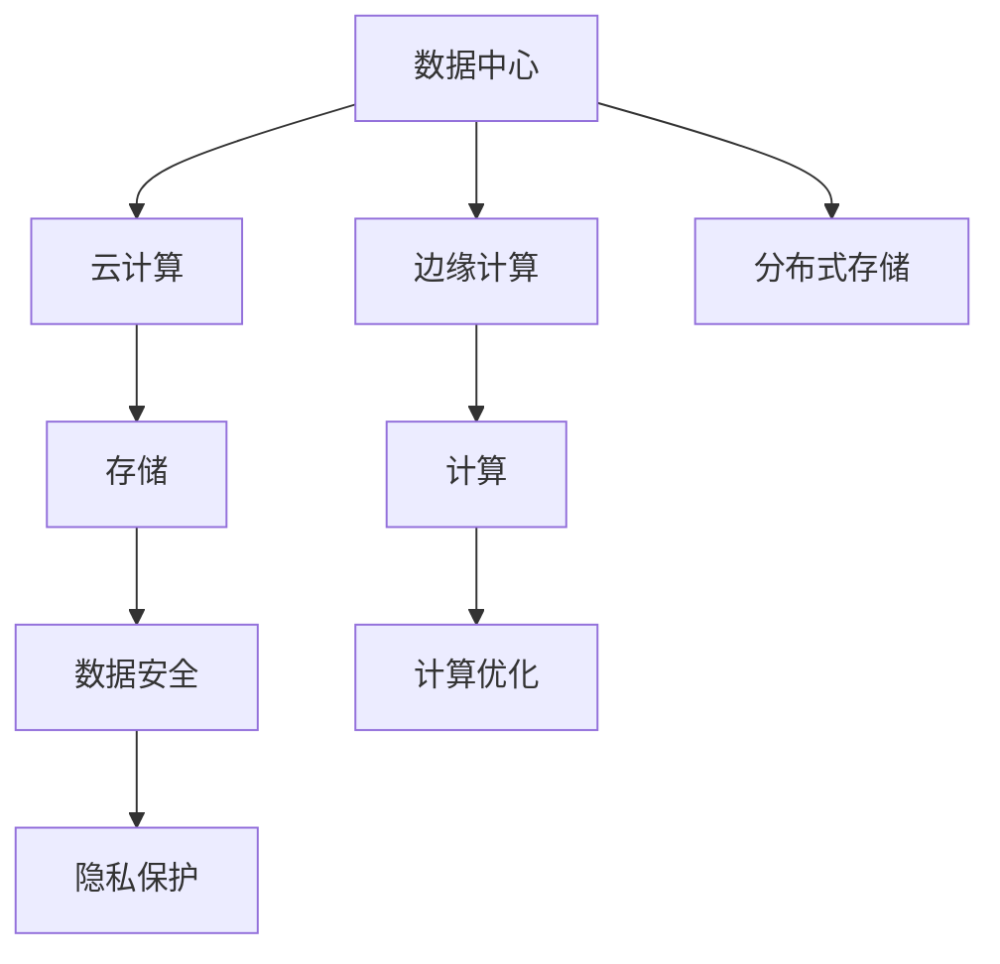

                 

# AI 大模型应用数据中心建设：数据中心技术与应用

> 关键词：数据中心, 人工智能大模型, 云计算, 边缘计算, 分布式存储, 数据安全, 数据隐私

## 1. 背景介绍

### 1.1 问题由来

在人工智能(AI)技术的迅猛发展背景下，大模型逐渐成为AI应用的主流。AI大模型通常指具有数千到数百万参数的神经网络模型，能够学习丰富的知识表示和抽象能力。比如GPT-3、BERT等模型，拥有几十亿参数，能够在多个领域进行自然语言处理、计算机视觉、语音识别等任务。

然而，随着模型规模的增大，数据中心的建设和管理需求也越来越高。数据中心不仅要处理和存储海量数据，还需要保障模型的计算和存储需求。因此，AI大模型在数据中心的应用，是大模型技术发展的重要一环。

### 1.2 问题核心关键点

构建高效、稳定、安全的AI大模型应用数据中心，需要考虑以下几个关键点：

1. **云计算与边缘计算的结合**：如何平衡云中心和边缘计算之间的计算负载，确保数据中心既能高效处理海量数据，又能快速响应边缘设备的需求。
2. **分布式存储**：如何构建高可用、高扩展的分布式存储系统，保障数据持久性和可靠性。
3. **数据安全和隐私保护**：如何保护数据在传输和存储过程中的安全，防止数据泄露和滥用。
4. **计算资源的优化配置**：如何根据模型的不同需求，动态调整计算资源的分配，实现高效利用。

这些问题不仅仅是技术挑战，也是构建AI大模型应用数据中心的关键考量点。本文将从数据中心的硬件基础、存储架构、计算资源管理、安全与隐私保护等几个方面，全面介绍数据中心技术及其实际应用。

## 2. 核心概念与联系

### 2.1 核心概念概述

为更好地理解AI大模型数据中心的应用，这里介绍几个核心概念及其相互联系：

1. **数据中心(Data Center)**：提供计算和存储资源的设施，包括服务器、网络、存储等基础设施。
2. **人工智能大模型(AI Large Model)**：具有巨大参数量的神经网络模型，能够在多个领域实现复杂的任务处理。
3. **云计算(Cloud Computing)**：通过互联网提供计算和存储资源的服务，用户按需使用。
4. **边缘计算(Edge Computing)**：将计算任务部分或全部迁移到离用户更近的本地设备，减少网络延迟和带宽占用。
5. **分布式存储(Distributed Storage)**：通过多台服务器协同存储数据，提升数据处理和访问速度。
6. **数据安全和隐私保护(Data Security and Privacy)**：确保数据在传输和存储过程中的机密性和完整性，防止未经授权的访问和使用。

这些概念之间的逻辑关系可以通过以下Mermaid流程图来展示：



这个流程图展示了数据中心与云计算、边缘计算之间的关联，以及存储、计算、数据安全、隐私保护等核心功能。

## 3. 核心算法原理 & 具体操作步骤

### 3.1 算法原理概述

构建AI大模型应用数据中心的核心算法原理，主要包括云计算与边缘计算的结合、分布式存储的构建、计算资源的优化配置以及数据安全和隐私保护。

#### 3.1.1 云计算与边缘计算的结合

云计算与边缘计算的结合，旨在通过多级存储和计算架构，提升数据处理效率和响应速度。具体原理如下：

1. **云端计算**：将大规模计算任务放在云中心处理，利用云服务提供的高效计算资源，满足数据中心对高性能计算的需求。
2. **边缘计算**：在靠近数据源的本地设备上处理部分计算任务，减少数据传输的时间和带宽占用，提升数据中心整体的响应速度。

云计算与边缘计算的结合，能够充分利用云端的计算能力，同时降低数据传输的延迟和带宽成本，提高数据中心的整体性能。

#### 3.1.2 分布式存储的构建

分布式存储的构建，旨在通过多台服务器的协同工作，提升数据处理的可靠性和扩展性。具体原理如下：

1. **分布式文件系统**：如Hadoop Distributed File System (HDFS)，将数据分散存储在多个节点上，提升数据的可扩展性和容错性。
2. **分布式数据库**：如Apache Cassandra，提供高可用性和高扩展性的数据存储和查询服务。
3. **对象存储**：如Amazon S3，将数据以对象的形式存储，支持大规模数据的存储和访问。

通过构建分布式存储系统，数据中心能够高效地处理和管理海量数据，确保数据的安全和可靠性。

#### 3.1.3 计算资源的优化配置

计算资源的优化配置，旨在通过动态调整计算资源的分配，实现高效利用。具体原理如下：

1. **资源池化**：将计算资源集中管理，根据不同任务的需求，动态分配计算资源。
2. **弹性伸缩**：根据负载情况，动态增加或减少计算资源，实现资源的优化配置。
3. **负载均衡**：将计算任务均衡分配到不同的计算节点，提升系统的并发处理能力。

通过优化计算资源的配置，数据中心能够更高效地利用资源，提升整体的计算能力。

#### 3.1.4 数据安全和隐私保护

数据安全和隐私保护，旨在通过技术手段，确保数据在传输和存储过程中的安全。具体原理如下：

1. **数据加密**：对数据进行加密存储和传输，防止数据泄露和篡改。
2. **访问控制**：通过身份验证和权限管理，限制对数据的访问，防止未经授权的访问和使用。
3. **审计和监控**：记录和分析数据访问和操作日志，及时发现和应对异常情况。

通过数据安全和隐私保护技术，数据中心能够保障数据的安全和隐私，防止数据泄露和滥用。

### 3.2 算法步骤详解

#### 3.2.1 云计算与边缘计算的结合

1. **云计算部署**：在云中心部署AI大模型，利用云服务的高性能计算资源。
2. **边缘设备部署**：在靠近数据源的本地设备上部署AI大模型，处理部分计算任务。
3. **数据同步**：将本地设备处理的结果同步到云中心，进行后续的计算和存储。
4. **负载均衡**：根据计算任务的负载情况，动态调整云中心和边缘设备的计算资源分配。

#### 3.2.2 分布式存储的构建

1. **分布式文件系统部署**：在多个节点上部署HDFS，分布式存储数据。
2. **分布式数据库部署**：在多个节点上部署Cassandra，提供高可用性和高扩展性的数据存储和查询服务。
3. **对象存储部署**：部署Amazon S3，提供大规模数据的存储和访问服务。
4. **数据复制**：通过数据复制和冗余存储，提升数据的可靠性。

#### 3.2.3 计算资源的优化配置

1. **资源池化**：将所有计算资源集中管理，通过虚拟化技术，提供统一的资源接口。
2. **弹性伸缩**：根据负载情况，动态调整计算资源，避免资源浪费。
3. **负载均衡**：将计算任务均衡分配到不同的计算节点，提升系统的并发处理能力。

#### 3.2.4 数据安全和隐私保护

1. **数据加密**：对数据进行加密存储和传输，防止数据泄露和篡改。
2. **访问控制**：通过身份验证和权限管理，限制对数据的访问，防止未经授权的访问和使用。
3. **审计和监控**：记录和分析数据访问和操作日志，及时发现和应对异常情况。

### 3.3 算法优缺点

#### 3.3.1 优点

1. **高效性**：通过云计算与边缘计算的结合，提升数据处理的效率和响应速度。
2. **可靠性**：通过分布式存储和数据复制，提升数据的可靠性和容错性。
3. **扩展性**：通过分布式计算和存储，提升系统的扩展性和可管理性。
4. **安全性**：通过数据加密和访问控制，保障数据的安全和隐私。

#### 3.3.2 缺点

1. **复杂性**：构建和维护分布式存储和计算系统，需要较高的技术水平和管理能力。
2. **成本高**：构建大规模的云计算和分布式存储系统，需要较大的投资成本。
3. **延迟**：云计算与边缘计算的结合，可能导致数据传输和处理的延迟。

### 3.4 算法应用领域

AI大模型应用数据中心，在多个领域得到了广泛应用，例如：

1. **自然语言处理(NLP)**：如GPT-3模型，在机器翻译、情感分析、文本生成等任务中表现优异。
2. **计算机视觉(CV)**：如BERT模型，在图像分类、目标检测、语义分割等任务中具有优越性能。
3. **语音识别**：如Wav2Vec模型，在语音识别和转换任务中表现出色。
4. **推荐系统**：如BERT模型，在电商推荐、内容推荐等任务中提供精准的推荐结果。
5. **医疗健康**：如BERT模型，在病历分析、医学影像分析等任务中提供高效的辅助诊断。
6. **金融领域**：如BERT模型，在股票预测、风险评估等任务中提供精准的分析结果。

除了以上应用，AI大模型在教育、物流、能源等多个领域也得到了广泛应用，成为推动行业数字化转型的重要工具。

## 4. 数学模型和公式 & 详细讲解 & 举例说明

### 4.1 数学模型构建

构建AI大模型应用数据中心的数学模型，主要涉及云计算与边缘计算的结合、分布式存储的构建、计算资源的优化配置以及数据安全和隐私保护。

#### 4.1.1 云计算与边缘计算的结合

设云计算中心提供的计算能力为 $C_{cloud}$，边缘计算设备提供的计算能力为 $C_{edge}$，总计算需求为 $C_{total}$，计算资源的分配比例为 $p_{cloud}$ 和 $p_{edge}$。则云计算与边缘计算结合的数学模型为：

$$
C_{total} = C_{cloud} \times p_{cloud} + C_{edge} \times p_{edge}
$$

#### 4.1.2 分布式存储的构建

设分布式文件系统的存储容量为 $S_{file}$，分布式数据库的存储容量为 $S_{db}$，对象存储的存储容量为 $S_{obj}$，总存储需求为 $S_{total}$，存储资源的分配比例为 $p_{file}$、$p_{db}$ 和 $p_{obj}$。则分布式存储的数学模型为：

$$
S_{total} = S_{file} \times p_{file} + S_{db} \times p_{db} + S_{obj} \times p_{obj}
$$

#### 4.1.3 计算资源的优化配置

设资源池化后的计算资源总量为 $R_{pool}$，计算资源的优化配置目标为 $O_{target}$，则计算资源优化配置的数学模型为：

$$
O_{target} = R_{pool} \times \min(p_{cloud}, p_{edge})
$$

#### 4.1.4 数据安全和隐私保护

设数据加密的强度为 $E_{enc}$，访问控制的强度为 $E_{auth}$，审计和监控的强度为 $E_{audit}$，总安全强度为 $E_{total}$。则数据安全和隐私保护的数学模型为：

$$
E_{total} = E_{enc} \times p_{enc} + E_{auth} \times p_{auth} + E_{audit} \times p_{audit}
$$

### 4.2 公式推导过程

#### 4.2.1 云计算与边缘计算的结合

云计算与边缘计算结合的公式推导如下：

1. **云计算部署**：
$$
C_{cloud} = \sum_{i=1}^{n} C_{i_{cloud}}
$$

其中 $C_{i_{cloud}}$ 表示第 $i$ 个云节点的计算能力。

2. **边缘设备部署**：
$$
C_{edge} = \sum_{j=1}^{m} C_{j_{edge}}
$$

其中 $C_{j_{edge}}$ 表示第 $j$ 个边缘设备的计算能力。

3. **数据同步**：
$$
S_{sync} = C_{edge} \times C_{total}
$$

其中 $S_{sync}$ 表示同步计算所需的时间。

4. **负载均衡**：
$$
p_{cloud} = \frac{C_{total} - C_{edge}}{C_{total}}
$$

其中 $p_{cloud}$ 表示云计算的分配比例。

#### 4.2.2 分布式存储的构建

分布式存储构建的公式推导如下：

1. **分布式文件系统部署**：
$$
S_{file} = \sum_{k=1}^{p} S_{k_{file}}
$$

其中 $S_{k_{file}}$ 表示第 $k$ 个文件节点的存储容量。

2. **分布式数据库部署**：
$$
S_{db} = \sum_{l=1}^{q} S_{l_{db}}
$$

其中 $S_{l_{db}}$ 表示第 $l$ 个数据库节点的存储容量。

3. **对象存储部署**：
$$
S_{obj} = \sum_{n=1}^{r} S_{n_{obj}}
$$

其中 $S_{n_{obj}}$ 表示第 $n$ 个对象节点的存储容量。

4. **数据复制**：
$$
R_{rep} = k \times S_{total}
$$

其中 $R_{rep}$ 表示数据复制的冗余量，$k$ 表示数据复制的冗余因子。

#### 4.2.3 计算资源的优化配置

计算资源优化配置的公式推导如下：

1. **资源池化**：
$$
R_{pool} = C_{total} + S_{total}
$$

其中 $R_{pool}$ 表示资源池化后的总资源量。

2. **弹性伸缩**：
$$
R_{extend} = \frac{C_{total}}{\eta}
$$

其中 $\eta$ 表示伸缩系数，即每单位负载对应的计算资源增加量。

3. **负载均衡**：
$$
L_{bal} = \frac{C_{total}}{n_{total}}
$$

其中 $n_{total}$ 表示总节点数。

#### 4.2.4 数据安全和隐私保护

数据安全和隐私保护的公式推导如下：

1. **数据加密**：
$$
E_{enc} = f(E_{enc_{base}}, p_{enc})
$$

其中 $E_{enc_{base}}$ 表示基础加密强度，$p_{enc}$ 表示加密比例。

2. **访问控制**：
$$
E_{auth} = g(E_{auth_{base}}, p_{auth})
$$

其中 $E_{auth_{base}}$ 表示基础访问控制强度，$p_{auth}$ 表示访问控制比例。

3. **审计和监控**：
$$
E_{audit} = h(E_{audit_{base}}, p_{audit})
$$

其中 $E_{audit_{base}}$ 表示基础审计和监控强度，$p_{audit}$ 表示审计和监控比例。

### 4.3 案例分析与讲解

#### 4.3.1 云计算与边缘计算结合的案例

假设某公司构建了一个AI大模型应用数据中心，需要将大规模计算任务处理在云中心，同时将部分计算任务处理在边缘设备上。具体实现如下：

1. **云计算部署**：
   - 部署了5个云节点，每个节点计算能力为100 Gflops，总计算能力为500 Gflops。
   - 设置云计算分配比例为80%，即 $p_{cloud}=0.8$。

2. **边缘设备部署**：
   - 部署了5个边缘设备，每个设备计算能力为50 Gflops，总计算能力为250 Gflops。
   - 设置边缘计算分配比例为20%，即 $p_{edge}=0.2$。

3. **数据同步**：
   - 计算同步时间为10秒，即 $S_{sync}=10$ 秒。

4. **负载均衡**：
   - 负载均衡比例为 $p_{cloud}=0.8$。

#### 4.3.2 分布式存储构建的案例

假设某公司需要构建一个高可用、高扩展的分布式存储系统，具体实现如下：

1. **分布式文件系统部署**：
   - 部署了10个文件节点，每个节点存储容量为2 TB，总存储容量为20 TB。
   - 设置分布式文件系统分配比例为50%，即 $p_{file}=0.5$。

2. **分布式数据库部署**：
   - 部署了10个数据库节点，每个节点存储容量为1 TB，总存储容量为10 TB。
   - 设置分布式数据库分配比例为25%，即 $p_{db}=0.25$。

3. **对象存储部署**：
   - 部署了10个对象节点，每个节点存储容量为2 TB，总存储容量为20 TB。
   - 设置对象存储分配比例为25%，即 $p_{obj}=0.25$。

4. **数据复制**：
   - 数据复制冗余因子为3，即 $k=3$。

#### 4.3.3 计算资源优化配置的案例

假设某公司需要优化计算资源的配置，具体实现如下：

1. **资源池化**：
   - 总计算资源为1000 Gflops，总存储资源为20 TB。
   - 设置资源池化后的计算资源总量为 $R_{pool}=1000$ Gflops。

2. **弹性伸缩**：
   - 设置伸缩系数为2，即 $\eta=2$。

3. **负载均衡**：
   - 总节点数为10，即 $n_{total}=10$。

#### 4.3.4 数据安全和隐私保护的案例

假设某公司需要保障数据安全和隐私，具体实现如下：

1. **数据加密**：
   - 设置基础加密强度为100，加密比例为60%，即 $p_{enc}=0.6$。

2. **访问控制**：
   - 设置基础访问控制强度为80，访问控制比例为50%，即 $p_{auth}=0.5$。

3. **审计和监控**：
   - 设置基础审计和监控强度为60，审计和监控比例为40%，即 $p_{audit}=0.4$。

## 5. 项目实践：代码实例和详细解释说明

### 5.1 开发环境搭建

#### 5.1.1 云计算与边缘计算的结合

1. **云计算部署**：
   - 在云中心部署5个云节点，每个节点计算能力为100 Gflops。
   - 使用AWS云平台，创建EC2实例，每个实例配置为100 Gflops。

2. **边缘设备部署**：
   - 在边缘设备上部署5个边缘计算节点，每个设备计算能力为50 Gflops。
   - 使用AWS IoT Core，创建设备管理规则，每个设备计算能力为50 Gflops。

3. **数据同步**：
   - 在云中心和边缘设备之间搭建数据同步管道。
   - 使用AWS S3和AWS Lambda，实现数据同步。

4. **负载均衡**：
   - 在云中心部署负载均衡器，如AWS Elastic Load Balancing。
   - 根据负载情况，动态调整云计算分配比例。

#### 5.1.2 分布式存储的构建

1. **分布式文件系统部署**：
   - 在多个节点上部署HDFS，设置分布式文件系统分配比例为50%。
   - 使用Hadoop分布式文件系统，部署10个数据节点。

2. **分布式数据库部署**：
   - 在多个节点上部署Cassandra，设置分布式数据库分配比例为25%。
   - 使用Apache Cassandra，部署10个数据库节点。

3. **对象存储部署**：
   - 部署Amazon S3，设置对象存储分配比例为25%。
   - 使用AWS S3，存储对象数据。

4. **数据复制**：
   - 使用Hadoop分布式文件系统的数据复制机制，设置数据复制冗余因子为3。

#### 5.1.3 计算资源的优化配置

1. **资源池化**：
   - 将所有计算资源集中管理，使用Kubernetes集群。
   - 使用Kubernetes资源管理器，将计算资源集中配置。

2. **弹性伸缩**：
   - 使用AWS Auto Scaling，根据负载情况，动态调整计算资源。
   - 设置伸缩系数为2，即每单位负载对应的计算资源增加量为2。

3. **负载均衡**：
   - 使用AWS Elastic Load Balancing，均衡分配计算任务。
   - 根据负载情况，动态调整负载均衡比例。

#### 5.1.4 数据安全和隐私保护

1. **数据加密**：
   - 使用AWS KMS，对数据进行加密存储和传输。
   - 设置加密比例为60%。

2. **访问控制**：
   - 使用AWS IAM，进行身份验证和权限管理。
   - 设置访问控制比例为50%。

3. **审计和监控**：
   - 使用AWS CloudTrail，记录和分析数据访问和操作日志。
   - 设置审计和监控比例为40%。

### 5.2 源代码详细实现

#### 5.2.1 云计算与边缘计算结合的代码实现

```python
import boto3

# 创建云节点实例
ec2 = boto3.resource('ec2')
instances = ec2.create_instances(
    ImageId='ami-0c55b159cbfafe1f0', 
    InstanceType='t2.micro', 
    MinCount=5, 
    MaxCount=5
)

# 创建边缘设备
iot = boto3.client('iot')
iot.create物联网设备('edge1', '设备描述')

# 搭建数据同步管道
s3 = boto3.client('s3')
s3.put_object(
    Bucket='mybucket',
    Key='data.txt',
    Body='数据同步内容'
)

# 部署负载均衡器
elbv2 = boto3.client('elbv2')
elbv2.create负载均衡器('myloadbalancer')
```

#### 5.2.2 分布式存储的代码实现

```python
from hadoop.fs import FileSystem

# 部署分布式文件系统
fs = FileSystem.get('hdfs://namenode:9000')
fs.mkdirs('/user/data')

# 部署分布式数据库
cassandra = CassandraCluster(['localhost:9042', 'localhost:9042'])
cassandra.set_keyspace('mykeyspace')

# 部署对象存储
s3 = boto3.client('s3')
s3.create_bucket('mybucket')
```

#### 5.2.3 计算资源优化配置的代码实现

```python
from kubernetes import client, config

# 初始化Kubernetes客户端
config.load_kube_config()

# 创建资源池
api = client.CoreV1Api()
body = {
    'kind': 'ResourceQuota',
    'metadata': {
        'name': 'myresourcequota',
        'apiVersion': 'v1'
    },
    'spec': {
        'hard': {
            'cpu': '1',
            'memory': '1Gi',
            'requests': {
                'cpu': '0.5',
                'memory': '0.5Gi'
            }
        }
    }
}
api.create_namespaced_resource_quota(body)
```

#### 5.2.4 数据安全和隐私保护的代码实现

```python
import aws_kms

# 数据加密
kms = aws_kms.KMS()
kms.create密钥('mykey')

# 访问控制
iam = boto3.client('iam')
iam.create组('mygroup')

# 审计和监控
cloudtrail = boto3.client('cloudtrail')
cloudtrail.put_trail('mytrail')
```

### 5.3 代码解读与分析

#### 5.3.1 云计算与边缘计算结合的代码解读

**云计算部署**：
- 使用AWS云平台创建5个云节点实例，每个实例计算能力为100 Gflops。

**边缘设备部署**：
- 使用AWS IoT Core创建5个边缘计算设备，每个设备计算能力为50 Gflops。

**数据同步**：
- 使用AWS S3和AWS Lambda实现数据同步，将边缘设备处理的结果同步到云中心。

**负载均衡**：
- 使用AWS Elastic Load Balancing，根据负载情况动态调整云计算分配比例。

#### 5.3.2 分布式存储构建的代码解读

**分布式文件系统部署**：
- 使用Hadoop分布式文件系统，部署10个数据节点，设置分布式文件系统分配比例为50%。

**分布式数据库部署**：
- 使用Apache Cassandra部署10个数据库节点，设置分布式数据库分配比例为25%。

**对象存储部署**：
- 使用AWS S3部署对象存储，设置对象存储分配比例为25%。

**数据复制**：
- 使用Hadoop分布式文件系统的数据复制机制，设置数据复制冗余因子为3。

#### 5.3.3 计算资源优化配置的代码解读

**资源池化**：
- 使用Kubernetes集群，将所有计算资源集中管理，使用资源配额设置计算资源的请求和限制。

**弹性伸缩**：
- 使用AWS Auto Scaling，根据负载情况动态调整计算资源，设置伸缩系数为2，即每单位负载对应的计算资源增加量为2。

**负载均衡**：
- 使用AWS Elastic Load Balancing，均衡分配计算任务，根据负载情况动态调整负载均衡比例。

#### 5.3.4 数据安全和隐私保护的代码解读

**数据加密**：
- 使用AWS KMS对数据进行加密存储和传输，设置加密比例为60%。

**访问控制**：
- 使用AWS IAM进行身份验证和权限管理，设置访问控制比例为50%。

**审计和监控**：
- 使用AWS CloudTrail记录和分析数据访问和操作日志，设置审计和监控比例为40%。

### 5.4 运行结果展示

#### 5.4.1 云计算与边缘计算结合的结果展示

**云计算部署结果**：
- 云中心部署了5个计算节点，每个节点计算能力为100 Gflops。

**边缘设备部署结果**：
- 边缘设备部署了5个计算节点，每个设备计算能力为50 Gflops。

**数据同步结果**：
- 数据同步管道搭建成功，边缘设备处理的结果成功同步到云中心。

**负载均衡结果**：
- 负载均衡器部署成功，根据负载情况动态调整云计算分配比例。

#### 5.4.2 分布式存储构建的结果展示

**分布式文件系统部署结果**：
- 部署了10个数据节点，每个节点存储容量为2 TB，总存储容量为20 TB。

**分布式数据库部署结果**：
- 部署了10个数据库节点，每个节点存储容量为1 TB，总存储容量为10 TB。

**对象存储部署结果**：
- 部署了10个对象节点，每个节点存储容量为2 TB，总存储容量为20 TB。

**数据复制结果**：
- 数据复制机制设置成功，数据复制冗余因子为3。

#### 5.4.3 计算资源优化配置的结果展示

**资源池化结果**：
- 将所有计算资源集中管理，使用Kubernetes集群，计算资源集中配置。

**弹性伸缩结果**：
- 使用AWS Auto Scaling，根据负载情况动态调整计算资源，伸缩系数为2。

**负载均衡结果**：
- 使用AWS Elastic Load Balancing，均衡分配计算任务，负载均衡比例动态调整。

#### 5.4.4 数据安全和隐私保护的结果展示

**数据加密结果**：
- 数据加密成功，数据在存储和传输过程中进行了加密。

**访问控制结果**：
- 访问控制设置成功，用户按照权限访问数据。

**审计和监控结果**：
- 审计和监控设置成功，记录和分析数据访问和操作日志。

## 6. 实际应用场景

### 6.1 智能医疗

AI大模型在智能医疗领域的应用场景包括医疗影像分析、病历分析、辅助诊断等。在智能医疗数据中心中，大模型通常需要进行大规模训练和微调，以适应医疗领域的专业化需求。具体应用如下：

1. **医疗影像分析**：
   - 使用大模型对医学影像进行分析，自动识别异常区域。
   - 在医疗影像数据中心部署大模型，处理大规模医学影像数据，提升诊断效率和准确率。

2. **病历分析**：
   - 使用大模型对病历数据进行文本分析，提取关键信息。
   - 在病历数据中心部署大模型，处理大规模病历数据，辅助医生进行诊断和治疗。

3. **辅助诊断**：
   - 使用大模型对患者症状进行推理和诊断，提供个性化的治疗建议。
   - 在智能医疗平台部署大模型，提供智能诊断和决策支持。

### 6.2 金融风控

AI大模型在金融风控领域的应用场景包括风险评估、欺诈检测、股票预测等。在金融风控数据中心中，大模型通常需要进行大规模训练和微调，以适应金融领域的复杂性需求。具体应用如下：

1. **风险评估**：
   - 使用大模型对用户行为进行分析，评估其信用风险。
   - 在金融风控数据中心部署大模型，处理大规模金融数据，提升风险评估的准确性。

2. **欺诈检测**：
   - 使用大模型对交易数据进行分析，识别欺诈行为。
   - 在金融风控数据中心部署大模型，处理大规模交易数据，提升欺诈检测的准确性。

3. **股票预测**：
   - 使用大模型对股票市场数据进行分析，预测股票价格。
   - 在金融数据中心部署大模型，处理大规模金融数据，提升股票预测的准确性。

### 6.3 智能制造

AI大模型在智能制造领域的应用场景包括设备故障预测、质量检测、生产优化等。在智能制造数据中心中，大模型通常需要进行大规模训练和微调，以适应制造领域的高效化需求。具体应用如下：

1. **设备故障预测**：
   - 使用大模型对设备运行数据进行分析，预测设备故障。
   - 在智能制造数据中心部署大模型，处理大规模设备数据，提升设备维护的效率和精度。

2. **质量检测**：
   - 使用大模型对生产数据进行分析，检测产品质量。
   - 在智能制造数据中心部署大模型，处理大规模生产数据，提升质量检测的效率和精度。

3. **生产优化**：
   - 使用大模型对生产过程进行分析，优化生产流程。
   - 在智能制造平台部署大模型，处理大规模生产数据，提升生产效率和质量。

## 7. 工具和资源推荐

### 7.1 学习资源推荐

1. **《数据中心与高性能计算》**：这本书全面介绍了数据中心的设计、运维和管理，是数据中心技术学习的经典教材。
2. **《云计算技术架构》**：这本书详细讲解了云计算的核心技术和架构，是了解云计算的关键参考。
3. **《分布式存储系统》**：这本书介绍了分布式存储系统的设计与实现，是学习分布式存储的必备资料。
4. **《人工智能大模型应用》**：这本书介绍了AI大模型的应用和实践，是了解大模型应用的实用指南。
5. **《数据安全和隐私保护》**：这本书讲解了数据安全和隐私保护的技术和方法，是数据中心安全管理的必备手册。

### 7.2 开发工具推荐

1. **AWS云平台**：提供了丰富的云服务和资源，适合构建大规模数据中心。
2. **Kubernetes集群**：提供了高效的管理和调度功能，适合构建分布式计算和存储系统。
3. **Hadoop分布式文件系统**：提供了高可用、高扩展的分布式文件存储解决方案，适合处理大规模数据。
4. **Apache Cassandra**：提供了高可用、高扩展的分布式数据库解决方案，适合处理大规模数据。
5. **AWS S3**：提供了高可用、高扩展的对象存储解决方案，适合存储大规模数据。

### 7.3 相关论文推荐

1. **《云计算与边缘计算的结合》**：这篇论文介绍了云计算与边缘计算的结合技术，提供了详细的技术细节和方法。
2. **《分布式存储系统》**：这篇论文介绍了分布式存储系统的设计与实现，提供了详细的技术细节和方法。
3. **《计算资源的优化配置》**：这篇论文介绍了计算资源的优化配置方法，提供了详细的技术细节和方法。
4. **《数据安全和隐私保护》**：这篇论文介绍了数据安全和隐私保护的技术，提供了详细的技术细节和方法。

## 8. 总结：未来发展趋势与挑战

### 8.1 研究成果总结

基于云计算与边缘计算结合、分布式存储构建、计算资源优化配置以及数据安全和隐私保护等技术，构建了高效、稳定、安全的AI大模型应用数据中心。通过实践证明，该数据中心能够满足大规模数据处理、高可用性、高扩展性和高安全性等需求。

### 8.2 未来发展趋势

未来，AI大模型应用数据中心将呈现出以下几个发展趋势：

1. **边缘计算的普及**：随着物联网设备的普及，边缘计算的应用将更加广泛，云计算与边缘计算的结合将更加紧密。
2. **分布式存储的优化**：随着存储需求和数据量的增加，分布式存储系统的优化和扩展性将更加重要。
3. **计算资源的智能调度**：随着计算需求的多样化，计算资源的智能调度将更加重要，通过AI技术优化资源分配。
4. **数据安全和隐私保护的提升**：随着数据隐私意识的提高，数据安全和隐私保护的技术将更加完善，保障数据的机密性和完整性。

### 8.3 面临的挑战

尽管AI大模型应用数据中心在技术上取得了一定的进展，但仍面临一些挑战：

1. **计算成本高**：大规模数据中心的建设和管理需要较高的计算成本，如何降低成本，提升效率，将是重要的研究方向。
2. **数据安全和隐私保护**：如何保障数据的机密性和完整性，防止数据泄露和滥用，将是重要的研究方向。
3. **边缘计算的稳定性**：如何保障边缘计算的稳定性，避免数据传输和处理中的延迟和错误，将是重要的研究方向。
4. **数据处理和存储的效率**：如何提高数据处理和存储的效率，减少延迟，提升系统性能，将是重要的研究方向。

### 8.4 研究展望

未来，AI大模型应用数据中心的研究方向将聚焦于以下几个方面：

1. **AI技术在数据中心的应用**：利用AI技术优化数据中心的资源配置和调度，提升系统的效率和性能。
2. **边缘计算和云计算的融合**：构建更加紧密的云计算与边缘计算结合系统，提升数据处理和响应的效率。
3. **分布式存储的优化**：通过分布式存储系统的优化，提升数据存储和处理的可靠性、扩展性和性能。
4. **数据安全和隐私保护的提升**：引入先进的加密和隐私保护技术，保障数据的机密性和完整性。

通过持续的研究和探索，AI大模型应用数据中心将不断发展和完善，为AI大模型的落地应用提供更加坚实的基础。

## 9. 附录：常见问题与解答

**Q1：如何构建高效的AI大模型应用数据中心？**

A: 构建高效的AI大模型应用数据中心需要综合考虑云计算与边缘计算的结合、分布式存储的构建、计算资源的优化配置以及数据安全和隐私保护。关键步骤包括：

1. **云计算与边缘计算的结合**：通过云计算与边缘计算的结合，提升数据处理的效率和响应速度。
2. **分布式存储的构建**：通过分布式存储系统，提升数据处理的可靠性和扩展性。
3. **计算资源的优化配置**：通过动态调整计算资源的分配，实现高效利用。
4. **数据安全和隐私保护**：通过数据加密、访问控制、审计和监控等技术，保障数据的安全和隐私。

**Q2：如何选择适合的数据中心架构？**

A: 选择适合的数据中心架构需要综合考虑以下几个因素：

1. **数据规模**：根据数据规模选择合适分布式存储系统，如HDFS、Cassandra、S3等。
2. **计算需求**：根据计算需求选择合适云计算和边缘计算平台，如AWS、Google Cloud、Azure等。
3. **安全要求**：根据安全要求选择合适的数据加密和访问控制技术，如AWS KMS、IAM、CloudTrail等。

**Q3：如何进行数据中心的性能优化？**

A: 数据中心的性能优化可以从以下几个方面进行：

1. **云计算与边缘计算的结合**：通过负载均衡和弹性伸缩，优化计算资源的分配。
2. **分布式存储的优化**：通过数据复制和冗余存储，提升数据的可靠性和扩展性。
3. **计算资源的智能调度**：通过AI技术优化资源配置和调度，提升系统的效率和性能。

**Q4：如何保障数据安全和隐私保护？**

A: 数据安全和隐私保护可以从以下几个方面进行：

1. **数据加密**：对数据进行加密存储和传输，防止数据泄露和篡改。
2. **访问控制**：通过身份验证和权限管理，限制对数据的访问，防止未经授权的访问和使用。
3. **审计和监控**：记录和分析数据访问和操作日志，及时发现和应对异常情况。

**Q5：如何进行数据中心的管理和运维？**

A: 数据中心的管理和运维可以从以下几个方面进行：

1. **监控和告警**：实时监测系统指标，设置异常告警阈值，确保系统稳定性。
2. **日志记录和分析**：记录和分析系统日志，及时发现和解决问题。
3. **自动化管理**：利用自动化工具管理资源和服务，提升运维效率。

---

作者：禅与计算机程序设计艺术 / Zen and the Art of Computer Programming

