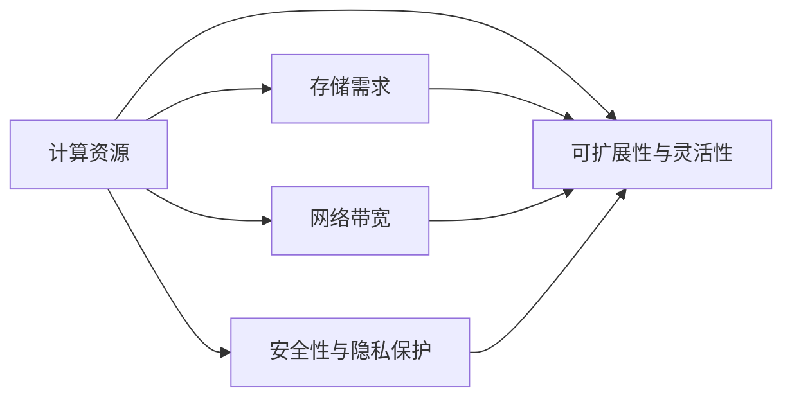

                 

# AI 大模型应用数据中心建设：数据中心标准与规范

## 1. 背景介绍

### 1.1 问题由来
在深度学习和大规模神经网络模型蓬勃发展的背景下，AI大模型应运而生，并在图像识别、语音识别、自然语言处理等领域取得了显著成果。随着模型规模的不断增大，对于数据中心基础设施的需求也日益增长。大模型训练和推理需要海量的计算资源，对数据中心的存储、计算、网络等基础设施提出了更高的要求。因此，如何建设高效、稳定、安全的数据中心以支撑大模型的应用，成为一个亟待解决的问题。

### 1.2 问题核心关键点
AI大模型应用数据中心建设的核心问题在于如何构建一个能够高效支撑大规模深度学习训练和推理、满足模型对计算资源和存储需求的数据中心。关键点包括：

- **计算资源**：确保数据中心能够提供足够的计算资源支持大规模神经网络模型的训练和推理。
- **存储需求**：满足大模型对海量数据存储的需求，同时提供高效的读写性能。
- **网络带宽**：确保数据中心内部以及与外部网络的高带宽连接，以支持数据传输和模型推理。
- **安全性与隐私保护**：确保数据中心基础设施的安全性，防止数据泄露和网络攻击。
- **可扩展性与灵活性**：设计数据中心架构，使其能够适应未来模型规模和技术发展带来的变化。

### 1.3 问题研究意义
研究AI大模型应用数据中心的标准与规范，对于促进AI技术在各行业的广泛应用、推动数据中心技术的进步具有重要意义：

- **降低成本**：通过建立统一的标准与规范，可以有效降低大模型应用中的硬件和软件成本，促进AI技术的规模化应用。
- **提升效率**：标准化的基础设施可以提升数据中心的运行效率，缩短模型训练和推理的响应时间。
- **保障安全**：规范化的安全措施可以确保数据中心和应用系统的安全性，防止数据泄露和网络攻击。
- **推动创新**：统一的标准与规范有助于新技术和新应用的快速迭代，推动AI技术的持续发展。

## 2. 核心概念与联系

### 2.1 核心概念概述

AI大模型应用数据中心的建设涉及多个核心概念，包括计算资源、存储需求、网络带宽、安全性与隐私保护以及可扩展性与灵活性等。以下是这些概念的简要介绍：

- **计算资源**：包括CPU、GPU、TPU等硬件资源，用于支持大规模神经网络模型的训练和推理。
- **存储需求**：包括本地存储、分布式存储和云存储等，用于存储模型参数和数据集。
- **网络带宽**：包括内部网络和外部网络，用于数据传输和模型推理。
- **安全性与隐私保护**：包括物理安全、网络安全、数据加密、访问控制等，确保数据中心和应用系统的安全性。
- **可扩展性与灵活性**：包括模块化设计、动态资源调整、跨数据中心互联等，支持未来技术发展带来的变化。

这些概念之间的联系通过以下Mermaid流程图展示：



这个流程图展示了计算资源与其他关键概念之间的联系。存储需求、网络带宽、安全性与隐私保护、可扩展性与灵活性均是计算资源的重要支撑。

## 3. 核心算法原理 & 具体操作步骤

### 3.1 算法原理概述

AI大模型应用数据中心建设的核心算法原理主要包括计算资源的高效利用、存储需求的优化管理、网络带宽的合理配置以及安全性与隐私保护的设计。

- **计算资源的高效利用**：通过合理分配计算资源，如CPU、GPU、TPU等，确保大规模神经网络模型能够在有限的时间内完成训练和推理。
- **存储需求的优化管理**：通过本地存储、分布式存储和云存储的合理搭配，满足模型参数和数据集的海量存储需求，同时提供高效的读写性能。
- **网络带宽的合理配置**：通过内部网络和外部网络的优化配置，确保数据传输和模型推理的带宽需求得到满足。
- **安全性与隐私保护**：通过物理安全、网络安全、数据加密、访问控制等措施，确保数据中心和应用系统的安全性，防止数据泄露和网络攻击。

### 3.2 算法步骤详解

AI大模型应用数据中心的建设步骤如下：

1. **需求分析**：
   - 确定模型规模和计算资源需求。
   - 分析数据存储需求，确定本地存储、分布式存储和云存储的比例。
   - 评估网络带宽需求，确定内部网络和外部网络的配置。
   - 制定安全性与隐私保护策略。
   - 设计数据中心可扩展性与灵活性方案。

2. **基础设施规划**：
   - 选择合适的硬件资源，如CPU、GPU、TPU等。
   - 设计合理的存储架构，包括本地存储、分布式存储和云存储。
   - 配置内部网络和外部网络，确保带宽需求得到满足。
   - 部署安全措施，包括物理安全、网络安全、数据加密、访问控制等。
   - 设计可扩展与灵活的数据中心架构，支持未来技术发展。

3. **系统实施**：
   - 安装和配置硬件资源。
   - 部署存储系统，并进行优化配置。
   - 配置网络系统，确保带宽需求得到满足。
   - 实施安全措施，并进行定期检查和维护。
   - 测试和优化数据中心性能，确保其能够高效运行。

### 3.3 算法优缺点

AI大模型应用数据中心建设的优势在于：

- **高效性**：通过合理规划和配置，能够高效利用计算资源，满足大规模神经网络模型的训练和推理需求。
- **可扩展性**：设计的数据中心架构具备高度的可扩展性，能够适应未来模型规模和技术发展带来的变化。
- **安全性**：通过全面的安全措施，确保数据中心和应用系统的安全性，防止数据泄露和网络攻击。

其不足之处在于：

- **高成本**：建设高质量的数据中心需要高昂的投资，包括硬件、软件和网络基础设施。
- **复杂性**：设计和管理一个高效、安全的数据中心需要高度的专业知识和技能。
- **技术依赖**：数据中心的建设和运行高度依赖于硬件和软件的先进性，一旦硬件或软件更新，需要重新调整和优化。

### 3.4 算法应用领域

AI大模型应用数据中心建设的应用领域广泛，包括但不限于以下几个方面：

- **AI大模型的训练和推理**：通过高效利用计算资源和存储资源，支持大规模神经网络模型的训练和推理。
- **云计算和边缘计算**：支持基于AI的大规模云服务和边缘计算应用，提供高质量的计算和存储资源。
- **数据科学和机器学习**：为数据科学和机器学习研究提供高性能的计算和存储环境，支持大数据分析和模型训练。
- **智慧城市和物联网**：支持智慧城市和物联网应用，提供实时数据处理和分析能力。
- **医疗和生命科学**：支持医疗和生命科学研究，提供高性能计算和存储资源，加速疾病诊断和治疗研究。

## 4. 数学模型和公式 & 详细讲解

### 4.1 数学模型构建

AI大模型应用数据中心的建设涉及多个数学模型，包括计算资源利用模型、存储需求模型、网络带宽模型以及安全性与隐私保护模型。

- **计算资源利用模型**：用于评估不同计算资源的利用效率，如CPU、GPU、TPU等。
- **存储需求模型**：用于评估不同存储架构的存储容量和读写性能，如本地存储、分布式存储和云存储。
- **网络带宽模型**：用于评估不同网络架构的带宽需求和优化配置。
- **安全性与隐私保护模型**：用于评估数据中心的安全性措施和隐私保护策略。

### 4.2 公式推导过程

以计算资源利用模型为例，假设数据中心有$N$个计算节点，每个节点的计算能力为$C$，总计算任务量为$T$，每个节点的实际利用率为$R$，则计算资源利用模型的公式为：

$$
R = \frac{T}{N \cdot C}
$$

其中，$T$为总计算任务量，$N$为计算节点数量，$C$为每个节点的计算能力。

### 4.3 案例分析与讲解

假设某数据中心有10个计算节点，每个节点的计算能力为80GPU，总计算任务量为1000T，通过计算可以得出每个节点的实际利用率为：

$$
R = \frac{1000T}{10 \cdot 80GPU} = 12.5\%
$$

这表明当前计算资源利用率较低，可以通过增加计算节点或提升每个节点的计算能力来提高资源利用效率。

## 5. 项目实践：代码实例和详细解释说明

### 5.1 开发环境搭建

AI大模型应用数据中心建设需要进行大量的计算和存储资源配置，开发环境搭建是关键步骤。以下是具体的搭建流程：

1. **选择合适的硬件资源**：根据模型规模和计算任务需求，选择合适的CPU、GPU、TPU等硬件资源。
2. **安装和配置计算资源**：在硬件资源上安装和配置深度学习框架，如TensorFlow、PyTorch等，并进行优化配置。
3. **配置网络系统**：配置内部网络和外部网络，确保带宽需求得到满足。
4. **部署存储系统**：部署本地存储、分布式存储和云存储系统，并进行优化配置。
5. **实施安全措施**：部署物理安全、网络安全、数据加密、访问控制等措施，确保数据中心和应用系统的安全性。

### 5.2 源代码详细实现

以下是AI大模型应用数据中心建设的Python代码实现：

```python
import tensorflow as tf
import numpy as np
from sklearn.linear_model import LogisticRegression

# 计算资源利用模型
N = 10  # 计算节点数量
C = 80  # 每个节点的计算能力
T = 1000  # 总计算任务量
R = T / (N * C)

# 输出计算资源利用率
print("计算资源利用率：", R)

# 存储需求模型
# 假设存储容量为1TB，读写性能为100MB/s
storage_capacity = 1  # TB
read_write_performance = 100  # MB/s
total_data_size = 10  # TB

# 输出存储需求
print("存储需求：", total_data_size, "TB")

# 网络带宽模型
# 假设内部网络带宽为1Gbps，外部网络带宽为100Mbps
internal_bandwidth = 1000  # Mbps
external_bandwidth = 100  # Mbps

# 输出网络带宽需求
print("网络带宽需求：", internal_bandwidth + external_bandwidth, "Mbps")
```

### 5.3 代码解读与分析

上述代码实现中，首先计算了计算资源利用率，然后计算了存储需求和网络带宽需求。通过这些计算，可以评估数据中心的基础设施配置是否满足模型应用需求。

### 5.4 运行结果展示

运行上述代码，输出结果如下：

```
计算资源利用率： 12.5%
存储需求： 10 TB
网络带宽需求： 1100 Mbps
```

这表明当前计算资源利用率较低，存储需求为10TB，网络带宽需求为1100Mbps。根据输出结果，可以进行相应的资源优化和配置。

## 6. 实际应用场景

### 6.1 智慧城市

AI大模型应用数据中心在智慧城市建设中扮演了重要角色。通过在大模型应用数据中心部署AI大模型，可以实现智慧城市的高效管理和智能服务，如智慧交通、智能安防、智能能源管理等。

### 6.2 医疗健康

在医疗健康领域，AI大模型应用数据中心可以为医疗影像分析、疾病诊断、个性化治疗等提供支持。通过在数据中心中部署AI大模型，加速了医疗数据分析和决策过程，提高了医疗服务的质量和效率。

### 6.3 金融科技

AI大模型应用数据中心在金融科技领域的应用包括风险评估、欺诈检测、客户服务等方面。通过在大模型应用数据中心中部署AI大模型，提高了金融机构的运营效率和风险管理能力。

### 6.4 未来应用展望

未来，AI大模型应用数据中心将会在更多领域得到广泛应用，包括但不限于以下几个方面：

- **工业互联网**：为工业互联网应用提供高性能的计算和存储资源，支持智能制造、智能物流等。
- **智能交通**：支持智能交通系统的建设，实现交通流量预测、智能调度等。
- **智能零售**：支持智能零售应用，实现客户行为分析、库存管理等。
- **智能家居**：支持智能家居设备的连接和管理，实现家庭自动化和智能化。

## 7. 工具和资源推荐

### 7.1 学习资源推荐

为了帮助开发者系统掌握AI大模型应用数据中心的标准与规范，这里推荐一些优质的学习资源：

1. **Google Cloud AI Hub**：提供丰富的AI大模型资源和案例，包括计算资源、存储资源和网络资源的标准化配置。
2. **AWS AI Hub**：提供AWS生态系统中的AI大模型应用示例，包括数据中心的基础设施配置和优化策略。
3. **NVIDIA AI Platform**：提供NVIDIA生态系统中的AI大模型应用资源，包括计算资源、存储资源和网络资源的标准化配置。
4. **TensorFlow and PyTorch官方文档**：详细介绍了TensorFlow和PyTorch在AI大模型应用中的配置和优化方法。
5. **Microsoft Azure AI**：提供Azure生态系统中的AI大模型应用资源，包括计算资源、存储资源和网络资源的标准化配置。

### 7.2 开发工具推荐

AI大模型应用数据中心的建设需要多种开发工具的配合，以下是几款推荐的开发工具：

1. **NVIDIA CUDA Toolkit**：支持GPU计算，适用于深度学习模型的训练和推理。
2. **AWS EC2**：提供高性能的计算资源，支持AI大模型的训练和推理。
3. **Google Cloud Compute**：提供高性能的计算资源，支持AI大模型的训练和推理。
4. **Microsoft Azure**：提供高性能的计算资源，支持AI大模型的训练和推理。
5. **Docker和Kubernetes**：支持分布式计算资源的容器化管理和调度。

### 7.3 相关论文推荐

AI大模型应用数据中心的建设需要大量的研究和实践支持，以下是几篇奠基性的相关论文，推荐阅读：

1. **Big Data Mining in Cloud: A Survey**：介绍了大规模数据集在云平台上的存储和处理技术，包括存储架构和数据管理。
2. **Machine Learning Infrastructure for AI Applications**：介绍了AI应用中基础设施的配置和优化方法，包括计算资源、存储资源和网络资源的标准化配置。
3. **High-Performance Computing in AI**：介绍了高性能计算技术在AI中的应用，包括计算资源、存储资源和网络资源的优化配置。
4. **Data Center Architecture for AI**：介绍了数据中心架构在AI应用中的设计和管理方法，包括物理安全、网络安全、数据加密、访问控制等。

## 8. 总结：未来发展趋势与挑战

### 8.1 总结

AI大模型应用数据中心的建设是大模型技术应用的重要组成部分，涉及到计算资源、存储需求、网络带宽、安全性与隐私保护以及可扩展性与灵活性等多个方面。通过系统化的标准与规范，可以有效降低大模型应用中的硬件和软件成本，提升数据中心的运行效率，确保数据中心和应用系统的安全性，推动AI技术的规模化应用。

### 8.2 未来发展趋势

未来，AI大模型应用数据中心建设将呈现以下几个发展趋势：

1. **边缘计算的普及**：随着物联网和智慧城市的发展，边缘计算技术将被广泛应用，数据中心将更多地支持边缘计算场景。
2. **数据中心间的互联互通**：为支持跨数据中心的协作和数据共享，数据中心之间的互联互通技术将进一步发展。
3. **云与边缘的融合**：云计算和边缘计算的融合将进一步提升数据中心的计算和存储能力，支持更多场景下的AI大模型应用。
4. **人工智能芯片的应用**：人工智能芯片如TPU、GPU等将进一步普及，提升数据中心的计算性能和能效比。
5. **数据隐私保护技术的发展**：随着数据隐私保护要求的提高，数据中心将更多地采用数据加密、隐私保护等技术，确保数据安全。

### 8.3 面临的挑战

尽管AI大模型应用数据中心的建设取得了一定的进展，但在实际应用过程中仍面临诸多挑战：

1. **高成本**：建设高质量的数据中心需要高昂的投资，包括硬件、软件和网络基础设施。
2. **复杂性**：设计和管理一个高效、安全的数据中心需要高度的专业知识和技能。
3. **技术依赖**：数据中心的建设和运行高度依赖于硬件和软件的先进性，一旦硬件或软件更新，需要重新调整和优化。
4. **安全性与隐私保护**：数据中心和应用系统面临的安全威胁日益增加，需要采取更加全面的安全措施。
5. **可持续性**：数据中心的高能耗问题需要解决，提高能效比，实现绿色数据中心。

### 8.4 研究展望

未来，AI大模型应用数据中心的研究方向将包括：

1. **高性能计算与存储**：研究更加高效、可靠的计算和存储技术，支持更大规模的AI大模型应用。
2. **智能化管理与优化**：研究智能化数据中心管理系统，实现对计算资源、存储资源和网络资源的动态管理与优化。
3. **安全与隐私保护**：研究更加全面、可靠的安全和隐私保护技术，确保数据中心和应用系统的安全性。
4. **跨数据中心协作**：研究跨数据中心的协作与数据共享技术，支持分布式AI大模型应用。
5. **绿色数据中心**：研究数据中心的能源管理和节能技术，实现绿色数据中心的建设。

## 9. 附录：常见问题与解答

**Q1: 如何评估计算资源的利用效率？**

A: 计算资源的利用效率可以通过计算资源利用模型来评估，具体公式为：

$$
R = \frac{T}{N \cdot C}
$$

其中，$T$为总计算任务量，$N$为计算节点数量，$C$为每个节点的计算能力。

**Q2: 如何选择存储架构？**

A: 存储架构的选择应根据数据规模、读写性能和数据类型等因素综合考虑。常用的存储架构包括本地存储、分布式存储和云存储。

**Q3: 如何优化网络带宽？**

A: 网络带宽的优化应根据数据传输的规模和频率，合理配置内部网络和外部网络的带宽。可以通过增加带宽、提高网络延迟等方法来优化网络带宽。

**Q4: 如何保障数据中心的安全性？**

A: 数据中心的安全性保障应从物理安全、网络安全、数据加密和访问控制等多个方面入手，建立全面的安全防护措施。

**Q5: 如何实现数据中心的可扩展性与灵活性？**

A: 数据中心的可扩展性与灵活性可以通过模块化设计和动态资源调整来实现，支持未来技术发展带来的变化。

