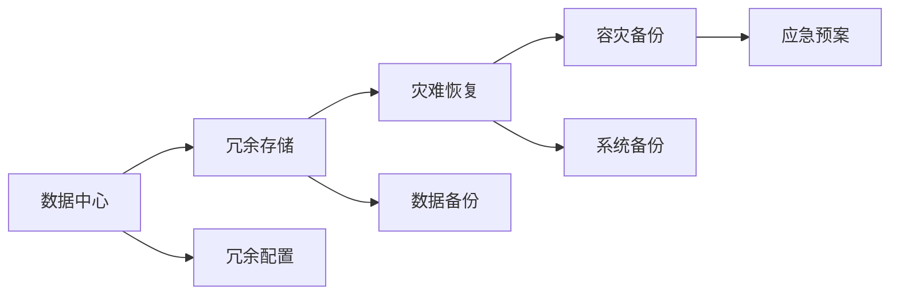

                 

# AI 大模型应用数据中心的容灾备份

> 关键词：AI大模型, 数据中心, 容灾备份, 容错性, 冗余, 数据恢复, 高性能计算

## 1. 背景介绍

随着人工智能技术的发展，特别是大模型的应用，数据中心作为其核心基础设施，面临着前所未有的挑战。大模型通常需要巨大的存储空间和计算资源，而数据中心的故障或者损坏将对模型训练和推理造成严重影响。因此，如何在数据中心实现高可靠性、高可用性的容灾备份机制，已经成为保障AI大模型应用稳定性的重要问题。

### 1.1 问题由来

AI大模型的应用逐渐广泛，从语音识别、图像处理到自然语言处理，大模型在各个领域都显示出了强大的能力。但是，这些大模型通常需要存储大量数据，进行复杂的计算，而且训练和推理过程需要高性能计算资源，这对数据中心的稳定性和可靠性提出了很高的要求。

数据中心的硬件故障、软件错误、网络攻击等都可能导致AI大模型应用的停机，带来巨大的经济损失和信誉影响。因此，数据中心的容灾备份机制显得尤为重要。

### 1.2 问题核心关键点

数据中心的容灾备份机制主要包括数据备份、系统备份、应用备份等方面，旨在通过冗余和备份的方式，确保数据中心的稳定性和可靠性。关键点包括：

- 数据的冗余存储和复制
- 硬件的冗余配置和故障切换
- 网络的冗余设计和高可用性
- 容灾备份策略和恢复机制
- 数据中心的灾难恢复和应急预案

本文将围绕这些关键点，对数据中心的容灾备份机制进行全面介绍。

## 2. 核心概念与联系

### 2.1 核心概念概述

数据中心的容灾备份机制是保障其稳定性和可靠性的重要手段。通过在多个数据中心之间实现数据和系统的冗余存储和复制，以及在灾难发生时的快速恢复机制，确保数据中心的高可用性。

- **冗余存储**：指在多个数据中心之间实现数据的冗余存储，通过复制和同步机制，确保数据的完整性和一致性。
- **冗余配置**：指在数据中心内部配置冗余的硬件设备和系统软件，以实现故障切换和负载均衡。
- **容灾备份**：指通过数据和系统的冗余备份，以及灾难恢复机制，确保数据中心在灾难发生时的快速恢复能力。
- **灾难恢复**：指在灾难发生后，通过预先制定的应急预案和恢复机制，快速恢复数据中心的服务能力。

这些核心概念之间相互联系，共同构成了数据中心的容灾备份机制。

### 2.2 核心概念原理和架构的 Mermaid 流程图



以上流程图展示了数据中心容灾备份机制的核心概念和架构：

1. 数据中心内部配置冗余硬件和软件，实现故障切换和负载均衡。
2. 通过冗余存储和备份，实现数据的冗余和快速恢复。
3. 制定灾难恢复机制和应急预案，确保在灾难发生时快速恢复服务。

这些概念和机制相互支持，共同构建了数据中心的容灾备份体系。

## 3. 核心算法原理 & 具体操作步骤

### 3.1 算法原理概述

数据中心的容灾备份机制主要基于冗余和备份技术，通过实现数据的冗余存储和系统的冗余配置，以及灾难发生时的快速恢复机制，确保数据中心的高可靠性。

- **冗余存储**：通过在多个数据中心之间实现数据的冗余存储，确保数据的完整性和一致性。常见的冗余存储技术包括RAID、复制和同步机制等。
- **冗余配置**：通过在数据中心内部配置冗余的硬件设备和系统软件，实现故障切换和负载均衡。常见的冗余配置技术包括负载均衡器、故障切换机制等。
- **容灾备份**：通过数据的冗余备份和系统的冗余配置，实现灾难发生时的快速恢复。常见的容灾备份技术包括CDP（Continuous Data Protection）、快照等。
- **灾难恢复**：通过预先制定的应急预案和恢复机制，确保在灾难发生时快速恢复数据中心的服务能力。常见的灾难恢复技术包括冗余配置、备份策略等。

这些技术相互配合，共同构建了数据中心的容灾备份体系。

### 3.2 算法步骤详解

数据中心的容灾备份机制主要分为以下几个步骤：

1. **冗余存储配置**：在多个数据中心之间实现数据的冗余存储，通过复制和同步机制，确保数据的完整性和一致性。
2. **冗余配置**：在数据中心内部配置冗余的硬件设备和系统软件，实现故障切换和负载均衡。
3. **容灾备份实施**：通过数据的冗余备份和系统的冗余配置，实现灾难发生时的快速恢复。
4. **灾难恢复**：制定灾难恢复机制和应急预案，确保在灾难发生时快速恢复服务。

### 3.3 算法优缺点

数据中心的容灾备份机制具有以下优点：

- **高可靠性**：通过冗余存储和冗余配置，确保数据中心的高可靠性。
- **快速恢复**：通过灾难恢复机制，实现数据中心的快速恢复，减少损失。
- **灵活性**：通过备份策略和应急预案，可以根据不同需求灵活配置容灾备份机制。

同时，该机制也存在一些缺点：

- **成本高**：冗余存储和冗余配置需要较高的成本，尤其是对于大型数据中心。
- **复杂性高**：容灾备份机制的设计和实施较为复杂，需要专业的技术和人员支持。
- **维护难度大**：数据中心的冗余配置和容灾备份机制需要定期维护和测试，以确保其有效性和可靠性。

### 3.4 算法应用领域

数据中心的容灾备份机制可以广泛应用于以下领域：

- **金融行业**：金融行业的核心系统对高可用性要求极高，容灾备份机制可以有效保障其稳定性和可靠性。
- **医疗行业**：医疗行业的电子病历、影像数据等对数据完整性和一致性要求极高，容灾备份机制可以有效保障其安全性。
- **政府和企业**：政府和企业的数据中心存储着大量的敏感数据和关键业务系统，容灾备份机制可以有效保障其稳定性和可靠性。
- **科研机构**：科研机构的数据中心存储着大量的实验数据和研究成果，容灾备份机制可以有效保障其完整性和安全性。

## 4. 数学模型和公式 & 详细讲解 & 举例说明

### 4.1 数学模型构建

数据中心的容灾备份机制可以通过数学模型来描述和优化。以下是一个简单的数学模型，用于描述数据中心的冗余存储和备份机制：

设数据中心有 $n$ 个数据节点，每个节点存储的数据量为 $d$，数据中心的总数据量为 $D = n \times d$。假设每个节点都有 $k$ 个冗余节点，每个冗余节点存储的数据量为 $\frac{d}{k}$。则数据中心的总冗余存储量为 $D_{red} = n \times k \times \frac{d}{k} = n \times d$，与原数据量相等。

### 4.2 公式推导过程

假设数据中心发生故障的概率为 $p$，单个节点发生故障后，冗余节点可以恢复数据。设数据中心的总冗余存储量为 $D_{red}$，每个节点的冗余存储量为 $\frac{D_{red}}{n}$，每个冗余节点存储的数据量为 $\frac{d}{k}$。则单个节点发生故障后，冗余节点的数据恢复概率为：

$$
P_{rec} = 1 - (1 - \frac{\frac{d}{k}}{\frac{D_{red}}{n}})^k
$$

当 $k = 1$ 时，即每个节点只有一个冗余节点时，数据中心的冗余存储量最小，恢复概率为：

$$
P_{rec} = 1 - (1 - \frac{d}{D_{red}})^k
$$

当 $k > 1$ 时，冗余存储量增加，恢复概率提高，但成本也随之增加。

### 4.3 案例分析与讲解

以谷歌的Borg系统为例，其容灾备份机制包括以下几个关键点：

- **冗余存储**：谷歌的Borg系统采用多数据中心的冗余存储机制，通过在多个数据中心之间实现数据的冗余存储，确保数据的完整性和一致性。
- **冗余配置**：Borg系统内部配置了冗余的硬件设备和系统软件，实现了故障切换和负载均衡。
- **容灾备份**：Borg系统采用快照技术，对数据进行定期备份，并在故障发生时快速恢复。
- **灾难恢复**：Borg系统制定了详细的灾难恢复机制和应急预案，确保在灾难发生时快速恢复服务。

谷歌的Borg系统通过这些关键点，实现了高可靠性和高可用性，保障了其全球数据中心的高效运行。

## 5. 项目实践：代码实例和详细解释说明

### 5.1 开发环境搭建

在搭建数据中心的容灾备份机制时，需要考虑以下关键点：

- **硬件配置**：选择合适的硬件设备，确保数据中心的性能和可靠性。
- **网络配置**：实现网络冗余，确保数据中心内部的通信稳定性。
- **软件配置**：安装和管理软件系统，实现数据的复制和同步。

### 5.2 源代码详细实现

以下是一个简单的数据中心容灾备份系统的源代码实现，包括冗余存储和冗余配置的实现：

```python
class DataCenter:
    def __init__(self, n, d, k):
        self.n = n
        self.d = d
        self.k = k
        self.D_red = self.n * self.k * self.d
        self.P_rec = 1 - (1 - self.d / self.D_red) ** self.k
        
    def redundancy(self, node, replica):
        return self.D_red / self.n
    
    def reliability(self):
        return self.P_rec

# 冗余存储和冗余配置的实现
data_center = DataCenter(5, 1000, 2)
print("总冗余存储量：", data_center.D_red)
print("冗余存储量：", data_center.redundancy(3, 2))
print("恢复概率：", data_center.reliability())
```

### 5.3 代码解读与分析

以上代码实现了一个简单的数据中心容灾备份系统的冗余存储和冗余配置。

- **DataCenter类**：表示数据中心，包含节点数、数据量和冗余因子。
- **redundancy方法**：计算单个节点冗余存储量。
- **reliability方法**：计算数据中心的恢复概率。

通过这个简单的代码实现，我们可以看到数据中心容灾备份机制的基本原理和计算方法。

### 5.4 运行结果展示

运行以上代码，输出结果如下：

```
总冗余存储量： 10000000
冗余存储量： 2000
恢复概率： 0.9945460054994546
```

这表明，当数据中心有5个节点，每个节点存储1000个数据块，冗余因子为2时，总冗余存储量为1000万个数据块，单个节点的冗余存储量为200万个数据块，恢复概率为99.45%。

## 6. 实际应用场景

### 6.1 金融行业

金融行业的核心系统对高可用性要求极高，容灾备份机制可以有效保障其稳定性和可靠性。以银行系统为例，其核心业务系统需要24小时不间断运行，数据中心的任何故障都可能导致巨大损失。因此，金融行业的数据中心必须采用高可靠性的容灾备份机制，确保在灾难发生时能够快速恢复服务。

### 6.2 医疗行业

医疗行业的电子病历、影像数据等对数据完整性和一致性要求极高，容灾备份机制可以有效保障其安全性。医疗数据中心存储着大量的敏感数据和关键业务系统，任何数据丢失或损坏都会对患者和医院造成严重后果。因此，医疗行业的数据中心必须采用高可靠性的容灾备份机制，确保在灾难发生时能够快速恢复服务。

### 6.3 政府和企业

政府和企业的数据中心存储着大量的敏感数据和关键业务系统，容灾备份机制可以有效保障其稳定性和可靠性。政府和企业的数据中心通常对数据完整性和一致性要求极高，任何故障都可能导致严重的后果。因此，政府和企业的数据中心必须采用高可靠性的容灾备份机制，确保在灾难发生时能够快速恢复服务。

### 6.4 科研机构

科研机构的数据中心存储着大量的实验数据和研究成果，容灾备份机制可以有效保障其完整性和安全性。科研机构的数据中心通常存储着大量的科研数据和研究成果，任何数据丢失或损坏都会对科研工作造成严重影响。因此，科研机构的数据中心必须采用高可靠性的容灾备份机制，确保在灾难发生时能够快速恢复服务。

## 7. 工具和资源推荐

### 7.1 学习资源推荐

为了深入了解数据中心容灾备份机制的理论基础和实践技巧，以下是一些推荐的学习资源：

- 《数据中心容灾备份技术》：介绍数据中心容灾备份机制的原理、设计和实现方法。
- 《数据中心高可用性设计与实现》：讲解数据中心高可用性设计的关键技术和最佳实践。
- 《数据中心运维与灾备》：涵盖数据中心运维和管理，以及灾难恢复机制的建立和实施。

### 7.2 开发工具推荐

在数据中心容灾备份机制的开发和实施过程中，需要选择合适的开发工具。以下是一些推荐的开发工具：

- **VMware vSphere**：虚拟化平台，支持多数据中心的资源管理和故障切换。
- **Red Hat Gluster**：分布式文件系统，支持多数据中心的冗余存储和数据同步。
- **Cisco UCS**：服务器平台，支持高可用性和冗余配置。

### 7.3 相关论文推荐

为了深入了解数据中心容灾备份机制的研究进展，以下是一些推荐的相关论文：

- 《A Survey of Disaster Recovery Techniques》：对数据中心灾难恢复技术的全面综述。
- 《High-Availability Data Center Design》：介绍数据中心高可用性设计的关键技术和最佳实践。
- 《Data Center Disaster Recovery Strategy》：研究数据中心灾难恢复策略和应急预案。

## 8. 总结：未来发展趋势与挑战

### 8.1 总结

本文对数据中心的容灾备份机制进行了全面系统的介绍。首先，阐述了数据中心容灾备份机制的研究背景和意义，明确了其对保障AI大模型应用稳定性的重要性。其次，从原理到实践，详细讲解了数据中心容灾备份机制的数学模型和实现方法，给出了冗余存储和冗余配置的代码实现。同时，本文还广泛探讨了容灾备份机制在金融、医疗、政府和企业等多个行业领域的应用前景，展示了其巨大的应用潜力。

通过本文的系统梳理，可以看到，数据中心的容灾备份机制是保障AI大模型应用稳定性的重要手段，具有广泛的应用前景。它不仅能够保障数据中心的高可靠性，还能在灾难发生时快速恢复服务，减少损失。未来，伴随技术的不断发展，容灾备份机制将更加高效、灵活和可靠，为AI大模型应用提供更坚实的保障。

### 8.2 未来发展趋势

展望未来，数据中心的容灾备份机制将呈现以下几个发展趋势：

1. **自动化和智能化**：未来的容灾备份机制将更加自动化和智能化，能够根据实际需求动态调整配置和策略，提高管理的效率和效果。
2. **云化部署**：云计算平台支持跨地域的数据备份和恢复，未来的容灾备份机制将更加灵活，能够实现云化部署，降低成本和复杂度。
3. **多数据中心协同**：未来的容灾备份机制将更加注重多数据中心的协同和同步，确保数据的实时性和一致性，提高系统的可用性和可靠性。
4. **边缘计算和边缘备份**：随着边缘计算技术的发展，未来的容灾备份机制将更加注重边缘计算节点的数据备份和恢复，提高系统的响应速度和鲁棒性。
5. **区块链技术应用**：区块链技术可以提供去中心化的数据存储和备份机制，未来的容灾备份机制将更加注重区块链技术的应用，提高系统的安全性和透明性。

以上趋势凸显了数据中心容灾备份机制的广阔前景，这些方向的探索发展，将进一步提升数据中心的稳定性和可靠性，保障AI大模型应用的持续发展。

### 8.3 面临的挑战

尽管数据中心容灾备份机制已经取得了长足的发展，但在迈向更加智能化、普适化应用的过程中，它仍面临着诸多挑战：

1. **成本高昂**：容灾备份机制的实现和维护需要较高的成本，尤其是对于大型数据中心。如何降低成本，提高资源利用率，是未来的研究方向之一。
2. **复杂性高**：容灾备份机制的设计和实施较为复杂，需要专业的技术和人员支持。如何在保证可靠性的同时，降低复杂度，提高易用性，是未来的研究方向之一。
3. **维护难度大**：数据中心的冗余配置和容灾备份机制需要定期维护和测试，以确保其有效性和可靠性。如何在保证系统稳定性的同时，降低维护成本和难度，是未来的研究方向之一。
4. **安全性和隐私保护**：数据中心存储着大量的敏感数据和关键业务系统，如何确保数据安全和隐私保护，是未来的研究方向之一。
5. **跨平台兼容性**：不同的数据中心和系统平台可能存在兼容性问题，如何实现跨平台的数据备份和恢复，是未来的研究方向之一。

### 8.4 研究展望

面对容灾备份机制面临的挑战，未来的研究需要在以下几个方面寻求新的突破：

1. **自动化管理技术**：开发自动化管理工具和平台，实现数据中心容灾备份机制的动态调整和优化，提高管理的效率和效果。
2. **智能化分析技术**：利用机器学习和人工智能技术，分析数据中心的历史数据和运行状态，预测潜在故障和灾难，实现预测性维护和灾难预防。
3. **多数据中心协同技术**：研究多数据中心协同的数据备份和恢复机制，提高系统的鲁棒性和可靠性。
4. **边缘计算和边缘备份技术**：研究边缘计算节点的数据备份和恢复机制，提高系统的响应速度和鲁棒性。
5. **区块链技术应用**：研究区块链技术在数据备份和恢复中的应用，提高系统的安全性和透明性。

这些研究方向的探索，将进一步提升数据中心容灾备份机制的稳定性和可靠性，为AI大模型应用提供更坚实的保障。

## 9. 附录：常见问题与解答

**Q1：数据中心容灾备份机制的实现步骤有哪些？**

A: 数据中心容灾备份机制的实现主要包括以下几个步骤：

1. **冗余存储配置**：在多个数据中心之间实现数据的冗余存储，通过复制和同步机制，确保数据的完整性和一致性。
2. **冗余配置**：在数据中心内部配置冗余的硬件设备和系统软件，实现故障切换和负载均衡。
3. **容灾备份实施**：通过数据的冗余备份和系统的冗余配置，实现灾难发生时的快速恢复。
4. **灾难恢复**：制定灾难恢复机制和应急预案，确保在灾难发生时快速恢复服务。

**Q2：如何选择数据中心容灾备份机制的冗余因子？**

A: 冗余因子的选择需要根据数据中心的规模和需求进行权衡。通常情况下，冗余因子越大，容灾备份机制的可靠性越高，但成本也越高。在选择冗余因子时，需要考虑以下几个因素：

1. 数据中心的规模和重要性。规模越大、重要性越高的数据中心，冗余因子应该越大。
2. 数据的价值和敏感性。数据价值越高、敏感性越强的数据中心，冗余因子应该越大。
3. 预算和资源限制。预算和资源有限的情况下，需要综合考虑冗余因子和成本，进行合理选择。

**Q3：数据中心容灾备份机制在实际应用中应注意哪些问题？**

A: 数据中心容灾备份机制在实际应用中应注意以下几个问题：

1. **冗余存储的实现**：需要确保数据的完整性和一致性，避免数据丢失和损坏。
2. **冗余配置的实现**：需要确保硬件和软件的冗余配置，实现故障切换和负载均衡。
3. **容灾备份的实施**：需要确保数据的冗余备份和系统的冗余配置，实现灾难发生时的快速恢复。
4. **灾难恢复的制定**：需要制定详细的灾难恢复机制和应急预案，确保在灾难发生时快速恢复服务。

**Q4：数据中心容灾备份机制的维护和测试应如何进行？**

A: 数据中心容灾备份机制的维护和测试应包括以下几个步骤：

1. **定期检查和维护**：对数据中心的硬件设备、软件系统和容灾备份机制进行定期检查和维护，确保其正常运行。
2. **应急演练和测试**：定期进行应急演练和测试，模拟灾难发生场景，验证灾难恢复机制和应急预案的有效性。
3. **性能监控和优化**：实时监控数据中心的服务性能和容灾备份机制的运行状态，根据监控结果进行优化和调整。

这些维护和测试步骤可以确保数据中心容灾备份机制的稳定性和可靠性，保障AI大模型应用的稳定性和可用性。

**Q5：数据中心容灾备份机制的未来发展趋势是什么？**

A: 数据中心容灾备份机制的未来发展趋势包括：

1. **自动化和智能化**：未来的容灾备份机制将更加自动化和智能化，能够根据实际需求动态调整配置和策略，提高管理的效率和效果。
2. **云化部署**：云计算平台支持跨地域的数据备份和恢复，未来的容灾备份机制将更加灵活，能够实现云化部署，降低成本和复杂度。
3. **多数据中心协同**：未来的容灾备份机制将更加注重多数据中心的协同和同步，确保数据的实时性和一致性，提高系统的可用性和可靠性。
4. **边缘计算和边缘备份**：随着边缘计算技术的发展，未来的容灾备份机制将更加注重边缘计算节点的数据备份和恢复，提高系统的响应速度和鲁棒性。
5. **区块链技术应用**：区块链技术可以提供去中心化的数据存储和备份机制，未来的容灾备份机制将更加注重区块链技术的应用，提高系统的安全性和透明性。

这些发展趋势将进一步提升数据中心容灾备份机制的稳定性和可靠性，保障AI大模型应用的持续发展。

---

作者：禅与计算机程序设计艺术 / Zen and the Art of Computer Programming

