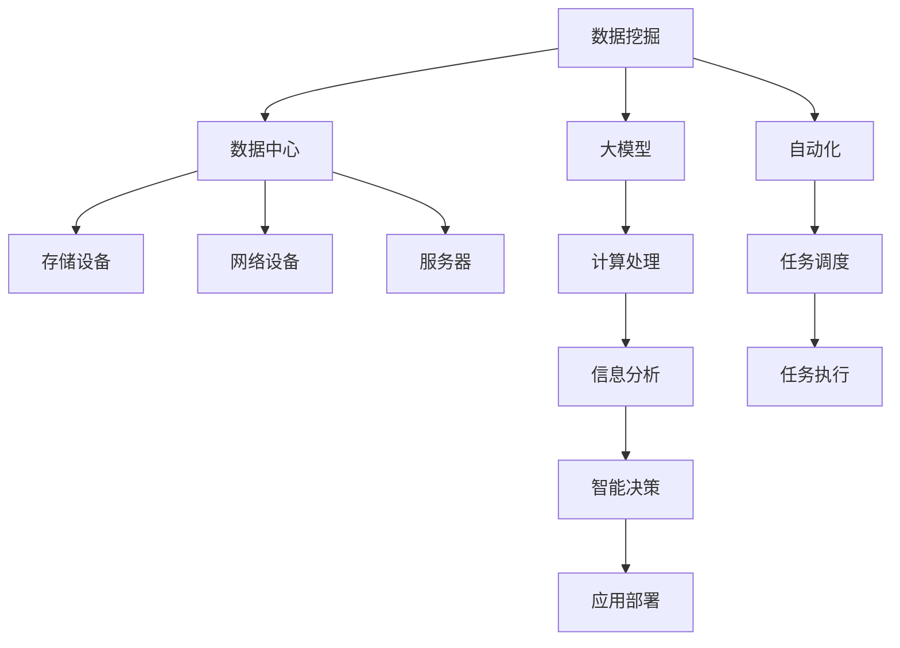

                 

## 1. 背景介绍

### 1.1 问题由来
随着人工智能(AI)技术在各行各业的广泛应用，特别是大模型如BERT、GPT-3、Transformer等在自然语言处理(NLP)、计算机视觉(CV)、语音识别(SR)等领域的突破，如何高效利用这些模型在数据中心进行数据挖掘成为了一个重要的研究方向。

数据中心是企业信息化建设的核心设施，它不仅承载了企业业务系统的数据存储和计算，还承担了数据清洗、挖掘、分析和应用的任务。数据中心的建设和管理，已经成为企业核心竞争力的重要体现。

### 1.2 问题核心关键点
1. **大模型部署**：如何在大模型上实现高效的部署和扩展。
2. **数据存储与管理**：如何对海量数据进行有效的存储与管理，同时保证数据的高效访问。
3. **数据挖掘架构**：如何构建高效的数据挖掘架构，实现对大模型数据的快速处理与分析。
4. **自动化与智能化**：如何实现数据挖掘任务的自动化和智能化，提高工作效率和准确性。

### 1.3 问题研究意义
构建高效的数据挖掘架构，可以显著提升数据中心的业务处理能力，实现数据的深入挖掘与分析，为企业决策提供科学依据。此外，自动化与智能化还可以解放人力资源，提高数据挖掘的工作效率和质量。

## 2. 核心概念与联系

### 2.1 核心概念概述

为更好地理解AI大模型在数据中心的应用，本节将介绍几个关键的概念和它们之间的联系：

1. **数据挖掘(Data Mining)**：指从数据中自动发现有用信息和知识的过程。主要利用统计学、人工智能等方法对数据进行分析，从而得出有价值的信息。
2. **大模型(Large Model)**：指具有大规模参数量和高度复杂结构的深度学习模型，如BERT、GPT-3等。这些模型能够处理大规模数据，提取丰富的语义信息。
3. **数据中心(Data Center)**：指由网络设备、服务器、存储设备等组成的大型设施，用于数据存储、计算和处理。
4. **自动化(Automation)**：指使用技术手段，实现数据挖掘任务的自动化处理，减少人工干预。
5. **智能化(Intelligence)**：指利用AI技术，使数据挖掘系统具备智能决策和自我学习的能力。

这些概念之间的逻辑关系可以通过以下Mermaid流程图来展示：



这个流程图展示了数据挖掘、大模型、数据中心等关键概念之间的联系：

1. 数据挖掘从数据中心的大规模数据中提取有用信息，使用大模型进行语义理解和知识发现。
2. 大模型部署在数据中心，利用其计算处理能力进行高效的数据挖掘。
3. 数据中心由存储设备、网络设备、服务器等组成，是数据挖掘的基础设施。
4. 数据挖掘任务自动化和智能化通过任务调度、执行等手段实现。

## 3. 核心算法原理 & 具体操作步骤

### 3.1 算法原理概述

AI大模型在数据中心的应用，主要通过数据挖掘架构实现。其核心思想是：利用大模型对大规模数据进行深度学习和特征提取，并通过数据挖掘算法对提取的信息进行分析和挖掘，从而获得有价值的信息和知识。

形式化地，假设我们有数据集 $D$ 和目标函数 $f$，目标函数表示从数据集中挖掘出的有用信息。通过大模型 $M$ 对数据集 $D$ 进行计算处理，得到特征表示 $F(D)$，并最终通过数据挖掘算法 $A$ 挖掘出目标函数 $f$ 的取值 $f(F(D))$。

具体而言，数据挖掘架构通常包括以下几个关键步骤：

1. **数据准备**：清洗、预处理数据，确保数据的质量和完整性。
2. **特征提取**：使用大模型对数据进行特征提取，得到高维的特征向量。
3. **模型训练**：使用数据挖掘算法对提取的特征向量进行训练，得到目标函数。
4. **结果分析**：对挖掘出的目标函数进行分析，提取有价值的信息和知识。
5. **应用部署**：将挖掘出的结果应用于实际业务，实现数据驱动的决策和优化。

### 3.2 算法步骤详解

数据挖掘架构的具体操作步骤如下：

**Step 1: 数据准备**

1. **数据收集**：收集与业务相关的原始数据，如用户行为数据、交易数据、设备日志数据等。
2. **数据清洗**：对收集的数据进行清洗，去除缺失、错误、无关等数据，确保数据质量。
3. **数据转换**：将清洗后的数据进行格式化和转换，如时间戳归一化、缺失值处理等，为后续处理做准备。

**Step 2: 特征提取**

1. **数据导入**：将清洗和转换后的数据导入大模型，进行特征提取。
2. **特征编码**：使用大模型对数据进行编码，得到高维的特征向量。
3. **特征选择**：从高维特征向量中筛选出对目标函数有用的特征。

**Step 3: 模型训练**

1. **选择算法**：根据业务需求选择合适的数据挖掘算法，如分类、聚类、回归等。
2. **模型训练**：使用选择的算法对特征向量进行训练，得到目标函数。
3. **模型评估**：对训练好的模型进行评估，检查其准确性、泛化能力和鲁棒性。

**Step 4: 结果分析**

1. **结果提取**：从训练好的模型中提取挖掘出的信息，如分类结果、聚类中心、回归预测值等。
2. **结果可视化**：对提取的结果进行可视化，帮助业务人员理解结果。
3. **结果应用**：将提取的结果应用于实际业务，如客户分群、预测分析、优化决策等。

**Step 5: 应用部署**

1. **模型部署**：将训练好的模型部署到数据中心，确保其可访问性和可扩展性。
2. **实时处理**：实现实时数据处理，对新数据进行快速分析和挖掘。
3. **监控与优化**：监控模型的运行状态，及时发现和修复问题，优化模型性能。

### 3.3 算法优缺点

大模型在数据中心的应用，具有以下优点：

1. **高效的特征提取**：大模型能够从海量数据中提取高维、高质量的特征，提高数据挖掘的效率和准确性。
2. **广泛的应用领域**：大模型能够应用于多种业务场景，如金融、医疗、零售、物流等，解决多种数据挖掘问题。
3. **自动化的数据处理**：通过自动化流程，减少人工干预，提高数据挖掘的工作效率和质量。
4. **智能化的决策支持**：使用智能化的数据分析和挖掘算法，提供精准的决策支持。

同时，大模型在数据中心的应用也存在一些缺点：

1. **高昂的成本**：大模型的训练和部署需要大量的计算资源和存储空间，成本较高。
2. **复杂的模型调参**：大模型参数众多，调参复杂，需要丰富的经验和专业知识。
3. **数据隐私和安全**：大规模数据处理涉及数据隐私和安全问题，需要采取严格的措施保障数据安全。
4. **高风险的决策**：大模型决策过程复杂，结果难以解释，存在较高的决策风险。

### 3.4 算法应用领域

AI大模型在数据中心的应用，覆盖了多个行业和业务场景，如：

1. **金融领域**：用于信用评分、欺诈检测、市场分析等，提高金融业务的决策水平。
2. **医疗领域**：用于疾病预测、患者分群、诊疗优化等，提高医疗服务的质量和效率。
3. **零售领域**：用于客户分群、商品推荐、库存管理等，提升零售业务的精准度和收益。
4. **物流领域**：用于路径规划、配送优化、风险控制等，提高物流业务的效率和效益。
5. **智能制造**：用于设备监测、故障预测、生产优化等，推动智能制造的发展。

## 4. 数学模型和公式 & 详细讲解 & 举例说明

### 4.1 数学模型构建

假设我们有一组数据集 $D=\{(x_i, y_i)\}_{i=1}^N$，其中 $x_i$ 表示输入特征向量，$y_i$ 表示目标变量。我们的目标是从数据集中挖掘出目标函数 $f(x)$。

根据上述数据挖掘架构，我们可以将整个流程表示为以下数学模型：

$$
\begin{aligned}
&F = M(D) \\
&f = A(F)
\end{aligned}
$$

其中 $M$ 表示大模型，$A$ 表示数据挖掘算法，$F$ 表示特征表示，$f$ 表示目标函数。

### 4.2 公式推导过程

以分类任务为例，假设我们使用的是分类算法 $A$，其训练目标为最小化分类误差。则训练过程可以表示为以下公式：

$$
\min_{\theta} \frac{1}{N} \sum_{i=1}^N \mathcal{L}(f(x_i), y_i)
$$

其中 $\theta$ 表示模型参数，$\mathcal{L}$ 表示分类损失函数，如交叉熵损失函数。

在实际应用中，我们通常使用以下步骤进行模型训练：

1. **数据导入**：将数据集 $D$ 导入大模型 $M$，得到特征表示 $F$。
2. **模型训练**：使用分类算法 $A$ 对特征表示 $F$ 进行训练，得到目标函数 $f$。
3. **结果评估**：对训练好的模型进行评估，检查其准确性和泛化能力。

### 4.3 案例分析与讲解

假设我们需要从某电商平台的销售数据中挖掘出用户的购买行为模式，从而实现精准的推荐系统。具体步骤如下：

1. **数据准备**：收集用户的浏览、点击、购买等行为数据，并进行清洗和预处理。
2. **特征提取**：使用大模型对数据进行特征提取，得到高维的特征向量。
3. **模型训练**：使用分类算法对特征向量进行训练，得到用户行为分类的目标函数。
4. **结果分析**：对训练好的模型进行评估，提取用户行为模式，并应用于推荐系统。

## 5. 项目实践：代码实例和详细解释说明

### 5.1 开发环境搭建

在进行数据挖掘架构的开发时，我们需要准备好开发环境。以下是使用Python进行PyTorch开发的环境配置流程：

1. 安装Anaconda：从官网下载并安装Anaconda，用于创建独立的Python环境。

2. 创建并激活虚拟环境：
```bash
conda create -n pytorch-env python=3.8 
conda activate pytorch-env
```

3. 安装PyTorch：根据CUDA版本，从官网获取对应的安装命令。例如：
```bash
conda install pytorch torchvision torchaudio cudatoolkit=11.1 -c pytorch -c conda-forge
```

4. 安装Transformers库：
```bash
pip install transformers
```

5. 安装各类工具包：
```bash
pip install numpy pandas scikit-learn matplotlib tqdm jupyter notebook ipython
```

完成上述步骤后，即可在`pytorch-env`环境中开始数据挖掘架构的开发。

### 5.2 源代码详细实现

下面以电商推荐系统为例，给出使用Transformers库对BERT模型进行分类任务微调的PyTorch代码实现。

首先，定义数据处理函数：

```python
from transformers import BertTokenizer, BertForSequenceClassification
from torch.utils.data import Dataset, DataLoader
import torch
from sklearn.metrics import accuracy_score

class ReviewsDataset(Dataset):
    def __init__(self, texts, labels, tokenizer, max_len=128):
        self.texts = texts
        self.labels = labels
        self.tokenizer = tokenizer
        self.max_len = max_len

    def __len__(self):
        return len(self.texts)

    def __getitem__(self, item):
        text = self.texts[item]
        label = self.labels[item]
        
        encoding = self.tokenizer(text, return_tensors='pt', max_length=self.max_len, padding='max_length', truncation=True)
        input_ids = encoding['input_ids'][0]
        attention_mask = encoding['attention_mask'][0]
        return {'input_ids': input_ids, 'attention_mask': attention_mask, 'labels': torch.tensor(label, dtype=torch.long)}

# 加载数据集
tokenizer = BertTokenizer.from_pretrained('bert-base-cased')
train_dataset = ReviewsDataset(train_texts, train_labels, tokenizer)
test_dataset = ReviewsDataset(test_texts, test_labels, tokenizer)
```

然后，定义模型和优化器：

```python
from transformers import AdamW

model = BertForSequenceClassification.from_pretrained('bert-base-cased', num_labels=num_labels)

optimizer = AdamW(model.parameters(), lr=2e-5)
```

接着，定义训练和评估函数：

```python
from torch.utils.data import DataLoader
from tqdm import tqdm

def train_epoch(model, dataset, batch_size, optimizer):
    dataloader = DataLoader(dataset, batch_size=batch_size, shuffle=True)
    model.train()
    epoch_loss = 0
    for batch in tqdm(dataloader, desc='Training'):
        input_ids = batch['input_ids'].to(device)
        attention_mask = batch['attention_mask'].to(device)
        labels = batch['labels'].to(device)
        model.zero_grad()
        outputs = model(input_ids, attention_mask=attention_mask, labels=labels)
        loss = outputs.loss
        epoch_loss += loss.item()
        loss.backward()
        optimizer.step()
    return epoch_loss / len(dataloader)

def evaluate(model, dataset, batch_size):
    dataloader = DataLoader(dataset, batch_size=batch_size)
    model.eval()
    preds, labels = [], []
    with torch.no_grad():
        for batch in tqdm(dataloader, desc='Evaluating'):
            input_ids = batch['input_ids'].to(device)
            attention_mask = batch['attention_mask'].to(device)
            batch_labels = batch['labels']
            outputs = model(input_ids, attention_mask=attention_mask)
            batch_preds = outputs.logits.argmax(dim=2).to('cpu').tolist()
            batch_labels = batch_labels.to('cpu').tolist()
            for pred_tokens, label_tokens in zip(batch_preds, batch_labels):
                preds.append(pred_tokens[:len(label_tokens)])
                labels.append(label_tokens)
                
    print('Accuracy:', accuracy_score(labels, preds))
```

最后，启动训练流程并在测试集上评估：

```python
epochs = 5
batch_size = 16

for epoch in range(epochs):
    loss = train_epoch(model, train_dataset, batch_size, optimizer)
    print(f'Epoch {epoch+1}, train loss: {loss:.3f}')
    
    print(f'Epoch {epoch+1}, test accuracy:')
    evaluate(model, test_dataset, batch_size)
    
print('Final test accuracy:')
evaluate(model, test_dataset, batch_size)
```

以上就是使用PyTorch对BERT模型进行电商推荐系统分类任务微调的完整代码实现。可以看到，借助Transformers库的封装，代码实现变得简洁高效。

### 5.3 代码解读与分析

让我们再详细解读一下关键代码的实现细节：

**ReviewsDataset类**：
- `__init__`方法：初始化文本、标签、分词器等关键组件。
- `__len__`方法：返回数据集的样本数量。
- `__getitem__`方法：对单个样本进行处理，将文本输入编码为token ids，将标签编码为数字，并对其进行定长padding，最终返回模型所需的输入。

**模型和优化器定义**：
- 使用BERT模型作为初始化参数，设置训练超参数。

**训练和评估函数**：
- 使用PyTorch的DataLoader对数据集进行批次化加载，供模型训练和推理使用。
- 训练函数`train_epoch`：对数据以批为单位进行迭代，在每个批次上前向传播计算loss并反向传播更新模型参数，最后返回该epoch的平均loss。
- 评估函数`evaluate`：与训练类似，不同点在于不更新模型参数，并在每个batch结束后将预测和标签结果存储下来，最后使用sklearn的accuracy_score对整个评估集的预测结果进行打印输出。

**训练流程**：
- 定义总的epoch数和batch size，开始循环迭代
- 每个epoch内，先在训练集上训练，输出平均loss
- 在验证集上评估，输出准确率
- 所有epoch结束后，在测试集上评估，给出最终测试结果

可以看到，PyTorch配合Transformers库使得BERT微调的代码实现变得简洁高效。开发者可以将更多精力放在数据处理、模型改进等高层逻辑上，而不必过多关注底层的实现细节。

当然，工业级的系统实现还需考虑更多因素，如模型的保存和部署、超参数的自动搜索、更灵活的任务适配层等。但核心的微调范式基本与此类似。

## 6. 实际应用场景

### 6.1 智能客服系统

基于AI大模型的数据挖掘架构，可以广泛应用于智能客服系统的构建。传统客服往往需要配备大量人力，高峰期响应缓慢，且一致性和专业性难以保证。而使用数据挖掘架构构建的智能客服系统，可以7x24小时不间断服务，快速响应客户咨询，用自然流畅的语言解答各类常见问题。

在技术实现上，可以收集企业内部的历史客服对话记录，将问题和最佳答复构建成监督数据，在此基础上对预训练语言模型进行微调。微调后的语言模型能够自动理解用户意图，匹配最合适的答案模板进行回复。对于客户提出的新问题，还可以接入检索系统实时搜索相关内容，动态组织生成回答。如此构建的智能客服系统，能大幅提升客户咨询体验和问题解决效率。

### 6.2 金融舆情监测

金融机构需要实时监测市场舆论动向，以便及时应对负面信息传播，规避金融风险。传统的人工监测方式成本高、效率低，难以应对网络时代海量信息爆发的挑战。基于AI大模型的数据挖掘架构，可以对金融领域相关的新闻、报道、评论等文本数据进行实时监测，挖掘其中的舆情信息，并及时预警，帮助金融机构快速应对潜在风险。

### 6.3 个性化推荐系统

当前的推荐系统往往只依赖用户的历史行为数据进行物品推荐，无法深入理解用户的真实兴趣偏好。基于AI大模型的数据挖掘架构，可以更好地挖掘用户行为背后的语义信息，从而提供更精准、多样的推荐内容。

在实践中，可以收集用户浏览、点击、评论、分享等行为数据，提取和用户交互的物品标题、描述、标签等文本内容。将文本内容作为模型输入，用户的后续行为（如是否点击、购买等）作为监督信号，在此基础上微调预训练语言模型。微调后的模型能够从文本内容中准确把握用户的兴趣点。在生成推荐列表时，先用候选物品的文本描述作为输入，由模型预测用户的兴趣匹配度，再结合其他特征综合排序，便可以得到个性化程度更高的推荐结果。

### 6.4 未来应用展望

随着AI大模型和数据挖掘架构的发展，基于微调范式将在更多领域得到应用，为传统行业带来变革性影响。

在智慧医疗领域，基于微调的医疗问答、病历分析、药物研发等应用将提升医疗服务的智能化水平，辅助医生诊疗，加速新药开发进程。

在智能教育领域，微调技术可应用于作业批改、学情分析、知识推荐等方面，因材施教，促进教育公平，提高教学质量。

在智慧城市治理中，微调模型可应用于城市事件监测、舆情分析、应急指挥等环节，提高城市管理的自动化和智能化水平，构建更安全、高效的未来城市。

此外，在企业生产、社会治理、文娱传媒等众多领域，基于大模型微调的人工智能应用也将不断涌现，为NLP技术带来了全新的突破。随着预训练模型和微调方法的不断进步，相信NLP技术将在更广阔的应用领域大放异彩，深刻影响人类的生产生活方式。

## 7. 工具和资源推荐

### 7.1 学习资源推荐

为了帮助开发者系统掌握AI大模型在数据中心的应用，这里推荐一些优质的学习资源：

1. 《Transformer从原理到实践》系列博文：由大模型技术专家撰写，深入浅出地介绍了Transformer原理、BERT模型、数据挖掘架构等前沿话题。

2. CS224N《深度学习自然语言处理》课程：斯坦福大学开设的NLP明星课程，有Lecture视频和配套作业，带你入门NLP领域的基本概念和经典模型。

3. 《Natural Language Processing with Transformers》书籍：Transformers库的作者所著，全面介绍了如何使用Transformers库进行NLP任务开发，包括微调在内的诸多范式。

4. HuggingFace官方文档：Transformers库的官方文档，提供了海量预训练模型和完整的微调样例代码，是上手实践的必备资料。

5. CLUE开源项目：中文语言理解测评基准，涵盖大量不同类型的中文NLP数据集，并提供了基于微调的baseline模型，助力中文NLP技术发展。

通过对这些资源的学习实践，相信你一定能够快速掌握AI大模型在数据中心的应用，并用于解决实际的NLP问题。

### 7.2 开发工具推荐

高效的开发离不开优秀的工具支持。以下是几款用于AI大模型数据挖掘架构开发的常用工具：

1. PyTorch：基于Python的开源深度学习框架，灵活动态的计算图，适合快速迭代研究。大部分预训练语言模型都有PyTorch版本的实现。

2. TensorFlow：由Google主导开发的开源深度学习框架，生产部署方便，适合大规模工程应用。同样有丰富的预训练语言模型资源。

3. Transformers库：HuggingFace开发的NLP工具库，集成了众多SOTA语言模型，支持PyTorch和TensorFlow，是进行数据挖掘架构开发的利器。

4. Weights & Biases：模型训练的实验跟踪工具，可以记录和可视化模型训练过程中的各项指标，方便对比和调优。与主流深度学习框架无缝集成。

5. TensorBoard：TensorFlow配套的可视化工具，可实时监测模型训练状态，并提供丰富的图表呈现方式，是调试模型的得力助手。

6. Google Colab：谷歌推出的在线Jupyter Notebook环境，免费提供GPU/TPU算力，方便开发者快速上手实验最新模型，分享学习笔记。

合理利用这些工具，可以显著提升AI大模型数据挖掘架构的开发效率，加快创新迭代的步伐。

### 7.3 相关论文推荐

AI大模型和数据挖掘架构的发展源于学界的持续研究。以下是几篇奠基性的相关论文，推荐阅读：

1. Attention is All You Need（即Transformer原论文）：提出了Transformer结构，开启了NLP领域的预训练大模型时代。

2. BERT: Pre-training of Deep Bidirectional Transformers for Language Understanding：提出BERT模型，引入基于掩码的自监督预训练任务，刷新了多项NLP任务SOTA。

3. Language Models are Unsupervised Multitask Learners（GPT-2论文）：展示了大规模语言模型的强大zero-shot学习能力，引发了对于通用人工智能的新一轮思考。

4. Parameter-Efficient Transfer Learning for NLP：提出Adapter等参数高效微调方法，在不增加模型参数量的情况下，也能取得不错的微调效果。

5. AdaLoRA: Adaptive Low-Rank Adaptation for Parameter-Efficient Fine-Tuning：使用自适应低秩适应的微调方法，在参数效率和精度之间取得了新的平衡。

6. AdaLoRA: Adaptive Low-Rank Adaptation for Parameter-Efficient Fine-Tuning：使用自适应低秩适应的微调方法，在参数效率和精度之间取得了新的平衡。

这些论文代表了大模型和数据挖掘架构的发展脉络。通过学习这些前沿成果，可以帮助研究者把握学科前进方向，激发更多的创新灵感。

## 8. 总结：未来发展趋势与挑战

### 8.1 总结

本文对AI大模型在数据中心的应用进行了全面系统的介绍。首先阐述了AI大模型和数据挖掘架构的研究背景和意义，明确了它们在提升数据处理能力和业务决策水平方面的独特价值。其次，从原理到实践，详细讲解了数据挖掘架构的数学模型和操作步骤，给出了数据挖掘架构的完整代码实现。同时，本文还广泛探讨了数据挖掘架构在智能客服、金融舆情、个性化推荐等多个行业领域的应用前景，展示了数据挖掘架构的巨大潜力。此外，本文精选了数据挖掘架构的学习资源，力求为读者提供全方位的技术指引。

通过本文的系统梳理，可以看到，AI大模型和数据挖掘架构在大数据时代的应用前景广阔，能够极大地提升数据处理的效率和业务决策的准确性。它们不仅能够应用于传统的文本处理任务，还能拓展到图像、视频、语音等多模态数据的挖掘和分析。随着技术的不断进步，AI大模型和数据挖掘架构必将在更多领域得到应用，推动智能技术的发展和落地。

### 8.2 未来发展趋势

展望未来，AI大模型和数据挖掘架构将呈现以下几个发展趋势：

1. **模型规模持续增大**：随着算力成本的下降和数据规模的扩张，预训练语言模型的参数量还将持续增长。超大规模语言模型蕴含的丰富语言知识，有望支撑更加复杂多变的下游任务微调。

2. **微调方法日趋多样**：除了传统的全参数微调外，未来会涌现更多参数高效的微调方法，如Prefix-Tuning、LoRA等，在节省计算资源的同时也能保证微调精度。

3. **持续学习成为常态**：随着数据分布的不断变化，微调模型也需要持续学习新知识以保持性能。如何在不遗忘原有知识的同时，高效吸收新样本信息，将成为重要的研究课题。

4. **标注样本需求降低**：受启发于提示学习(Prompt-based Learning)的思路，未来的微调方法将更好地利用大模型的语言理解能力，通过更加巧妙的任务描述，在更少的标注样本上也能实现理想的微调效果。

5. **多模态微调崛起**：当前的微调主要聚焦于纯文本数据，未来会进一步拓展到图像、视频、语音等多模态数据微调。多模态信息的融合，将显著提升语言模型对现实世界的理解和建模能力。

6. **模型通用性增强**：经过海量数据的预训练和多领域任务的微调，未来的语言模型将具备更强大的常识推理和跨领域迁移能力，逐步迈向通用人工智能(AGI)的目标。

以上趋势凸显了AI大模型和数据挖掘架构的广阔前景。这些方向的探索发展，必将进一步提升NLP系统的性能和应用范围，为人类认知智能的进化带来深远影响。

### 8.3 面临的挑战

尽管AI大模型和数据挖掘架构已经取得了瞩目成就，但在迈向更加智能化、普适化应用的过程中，它们仍面临诸多挑战：

1. **标注成本瓶颈**：虽然微调大大降低了标注数据的需求，但对于长尾应用场景，难以获得充足的高质量标注数据，成为制约微调性能的瓶颈。如何进一步降低微调对标注样本的依赖，将是一大难题。

2. **模型鲁棒性不足**：当前微调模型面对域外数据时，泛化性能往往大打折扣。对于测试样本的微小扰动，微调模型的预测也容易发生波动。如何提高微调模型的鲁棒性，避免灾难性遗忘，还需要更多理论和实践的积累。

3. **推理效率有待提高**：大规模语言模型虽然精度高，但在实际部署时往往面临推理速度慢、内存占用大等效率问题。如何在保证性能的同时，简化模型结构，提升推理速度，优化资源占用，将是重要的优化方向。

4. **可解释性亟需加强**：当前微调模型更像是"黑盒"系统，难以解释其内部工作机制和决策逻辑。对于医疗、金融等高风险应用，算法的可解释性和可审计性尤为重要。如何赋予微调模型更强的可解释性，将是亟待攻克的难题。

5. **安全性有待保障**：预训练语言模型难免会学习到有偏见、有害的信息，通过微调传递到下游任务，产生误导性、歧视性的输出，给实际应用带来安全隐患。如何从数据和算法层面消除模型偏见，避免恶意用途，确保输出的安全性，也将是重要的研究课题。

6. **知识整合能力不足**：现有的微调模型往往局限于任务内数据，难以灵活吸收和运用更广泛的先验知识。如何让微调过程更好地与外部知识库、规则库等专家知识结合，形成更加全面、准确的信息整合能力，还有很大的想象空间。

正视AI大模型和数据挖掘架构面临的这些挑战，积极应对并寻求突破，将是大模型和数据挖掘架构走向成熟的必由之路。相信随着学界和产业界的共同努力，这些挑战终将一一被克服，AI大模型和数据挖掘架构必将在构建安全、可靠、可解释、可控的智能系统铺平道路。

### 8.4 研究展望

面对AI大模型和数据挖掘架构所面临的挑战，未来的研究需要在以下几个方面寻求新的突破：

1. **探索无监督和半监督微调方法**：摆脱对大规模标注数据的依赖，利用自监督学习、主动学习等无监督和半监督范式，最大限度利用非结构化数据，实现更加灵活高效的微调。

2. **研究参数高效和计算高效的微调范式**：开发更加参数高效的微调方法，在固定大部分预训练参数的同时，只更新极少量的任务相关参数。同时优化微调模型的计算图，减少前向传播和反向传播的资源消耗，实现更加轻量级、实时性的部署。

3. **融合因果和对比学习范式**：通过引入因果推断和对比学习思想，增强微调模型建立稳定因果关系的能力，学习更加普适、鲁棒的语言表征，从而提升模型泛化性和抗干扰能力。

4. **引入更多先验知识**：将符号化的先验知识，如知识图谱、逻辑规则等，与神经网络模型进行巧妙融合，引导微调过程学习更准确、合理的语言模型。同时加强不同模态数据的整合，实现视觉、语音等多模态信息与文本信息的协同建模。

5. **结合因果分析和博弈论工具**：将因果分析方法引入微调模型，识别出模型决策的关键特征，增强输出解释的因果性和逻辑性。借助博弈论工具刻画人机交互过程，主动探索并规避模型的脆弱点，提高系统稳定性。

6. **纳入伦理道德约束**：在模型训练目标中引入伦理导向的评估指标，过滤和惩罚有偏见、有害的输出倾向。同时加强人工干预和审核，建立模型行为的监管机制，确保输出符合人类价值观和伦理道德。

这些研究方向的探索，必将引领AI大模型和数据挖掘架构技术迈向更高的台阶，为构建安全、可靠、可解释、可控的智能系统铺平道路。面向未来，AI大模型和数据挖掘架构还需要与其他人工智能技术进行更深入的融合，如知识表示、因果推理、强化学习等，多路径协同发力，共同推动自然语言理解和智能交互系统的进步。只有勇于创新、敢于突破，才能不断拓展语言模型的边界，让智能技术更好地造福人类社会。

## 9. 附录：常见问题与解答

**Q1：AI大模型在数据中心的应用是否仅限于文本处理？**

A: AI大模型在数据中心的应用不仅限于文本处理。虽然目前的主流研究集中在文本处理上，但AI大模型在图像、视频、语音等多模态数据处理方面也展现了强大的能力。通过多模态数据融合，AI大模型能够更全面地理解和建模现实世界的信息，从而拓展其应用范围。

**Q2：如何确保AI大模型在数据中心的安全性和隐私保护？**

A: 确保AI大模型在数据中心的安全性和隐私保护，可以从以下几个方面入手：
1. 数据加密：对敏感数据进行加密处理，防止数据泄露。
2. 访问控制：严格控制对模型的访问权限，防止未经授权的访问。
3. 模型监控：实时监控模型的运行状态，及时发现和修复安全漏洞。
4. 模型备份：定期备份模型，防止模型损坏或数据丢失。
5. 模型审核：对模型的输出结果进行人工审核，确保其符合伦理道德要求。

**Q3：AI大模型在数据中心的高效部署有哪些技术手段？**

A: 为了实现AI大模型在数据中心的高效部署，可以采用以下技术手段：
1. 模型压缩：通过剪枝、量化等手段，减小模型体积，提高推理效率。
2. 分布式训练：利用分布式训练技术，加速模型训练过程。
3. 模型微调：只更新模型部分参数，减小过拟合风险，提高微调效率。
4. 硬件优化：使用GPU/TPU等高性能设备，提高计算速度。
5. 模型推理优化：优化模型的推理过程，提高推理效率和准确性。

**Q4：AI大模型在数据中心的应用是否适用于所有行业？**

A: AI大模型在数据中心的应用虽然具有广泛性，但并不是适用于所有行业。对于某些行业，如医疗、金融、司法等，需要高度专业化的数据处理和模型训练，不能完全依赖AI大模型的通用处理。这些行业需要针对性地开发专业的AI大模型和数据挖掘架构，以适应其特殊需求。

**Q5：AI大模型在数据中心的应用是否会带来额外的数据处理成本？**

A: AI大模型在数据中心的应用，虽然能够显著提升数据处理的效率和精度，但在初始阶段，确实需要一定的数据准备和模型训练成本。但随着模型的不断优化和数据规模的扩大，这些成本将逐渐被抵消，并且随着技术的发展，这些成本将进一步降低。因此，AI大模型在数据中心的应用，从长期来看，是有成本效益的。

---

作者：禅与计算机程序设计艺术 / Zen and the Art of Computer Programming

