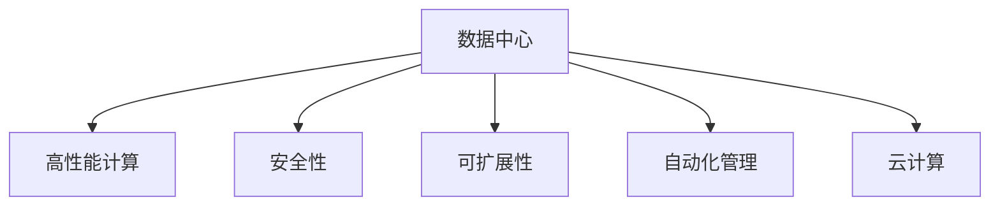

                 

# AI 大模型应用数据中心的服务改进

> 关键词：AI 大模型, 数据中心, 服务质量, 性能优化, 安全性, 可扩展性, 自动化, 硬件加速, 云计算

## 1. 背景介绍

### 1.1 问题由来
在人工智能（AI）迅猛发展的今天，大模型已经广泛应用于自然语言处理（NLP）、计算机视觉（CV）、推荐系统等多个领域，为各行各业带来了革命性的变革。然而，大模型的应用离不开底层数据中心的支持，数据中心的性能、安全性和可扩展性直接决定了AI应用的效果和稳定性。因此，如何优化数据中心的服务质量，构建高效的AI基础设施，成为当前AI研究中的一个重要课题。

### 1.2 问题核心关键点
数据中心服务质量优化主要涉及以下几个关键点：
- **性能优化**：如何通过优化数据中心硬件配置、网络架构和软件栈，提升AI模型的推理速度和计算效率。
- **安全性**：如何保障数据中心存储的数据安全和模型的安全性，防止数据泄露和攻击。
- **可扩展性**：如何设计数据中心的架构，使其能快速扩展，支持大规模AI模型的训练和推理需求。
- **自动化管理**：如何利用自动化工具和算法，实现数据中心的运维自动化，减少人工干预。
- **硬件加速**：如何利用GPU、TPU等硬件加速技术，提升AI模型训练和推理的性能。

这些核心点直接影响到AI应用的质量和效果，如何平衡它们之间的关系，实现最优的服务体验，是数据中心服务改进的重要目标。

### 1.3 问题研究意义
优化数据中心的服务质量，对于提升AI应用的性能和稳定性，加速AI技术的落地应用，具有重要意义：

1. **提升AI应用效率**：通过优化性能，缩短模型推理时间，加速AI应用在实际场景中的部署和响应。
2. **保障数据安全**：通过加强安全性措施，保护用户数据和模型免受攻击，维护AI应用的信任和可靠。
3. **实现弹性扩展**：通过良好的可扩展性设计，支持AI模型的规模化训练和推理，提高系统的灵活性和可用性。
4. **降低运营成本**：通过自动化管理，减少人工干预和运维成本，提高AI应用的效率和经济性。
5. **提升用户体验**：通过优化用户体验，使AI应用更加智能、便捷，满足用户需求。

综上所述，优化数据中心的服务质量，对于推动AI技术的广泛应用和深入发展，具有重要的战略意义。

## 2. 核心概念与联系

### 2.1 核心概念概述

为更好地理解数据中心服务优化的方法，本节将介绍几个密切相关的核心概念：

- **数据中心（DC）**：提供基础设施和网络资源，支持AI模型的训练和推理。数据中心包括硬件设施（如服务器、网络设备、存储系统）、软件栈（如操作系统、虚拟化技术）、监控系统等。

- **高性能计算（HPC）**：利用大规模并行计算能力，提升AI模型的计算效率和推理速度。HPC技术包括GPU、TPU、FPGA等硬件加速技术，以及分布式计算、异构计算等软件架构。

- **安全性**：数据中心应具备完善的安全措施，包括数据加密、访问控制、安全监控等，防止数据泄露和攻击。

- **可扩展性**：数据中心的架构设计应支持灵活扩展，能够根据需求动态调整计算资源，支持大规模AI模型的训练和推理。

- **自动化管理**：通过自动化工具和算法，实现数据中心的运维自动化，减少人工干预，提高效率和可靠性。

- **云计算**：将数据中心服务通过互联网提供给用户，实现资源的共享和按需分配，提升AI应用的可扩展性和灵活性。

这些核心概念之间的逻辑关系可以通过以下Mermaid流程图来展示：



这个流程图展示了大模型应用数据中心的核心概念及其之间的关系：

1. 数据中心通过提供高性能计算能力，支持AI模型的训练和推理。
2. 安全性措施保障存储的数据和模型的安全，防止数据泄露和攻击。
3. 可扩展性设计使数据中心能够根据需求动态扩展，支持大规模AI模型的部署。
4. 自动化管理提升数据中心的运维效率，减少人工干预。
5. 云计算实现资源共享和按需分配，提高AI应用的灵活性。

这些概念共同构成了数据中心服务优化的框架，使其能够满足AI应用对计算、安全和扩展性的要求。通过理解这些核心概念，我们可以更好地把握数据中心服务的优化方向。

## 3. 核心算法原理 & 具体操作步骤
### 3.1 算法原理概述

数据中心服务优化的核心在于通过优化硬件、软件和网络架构，提升性能、保障安全和灵活扩展。以下是核心算法的原理概述：

**算法原理概述**：

1. **硬件优化**：选择合适的硬件平台，如GPU、TPU等，提升模型的推理速度和计算效率。同时，利用硬件加速技术和异构计算架构，优化模型的训练过程。
2. **软件优化**：通过优化操作系统、虚拟化技术、网络协议等，减少数据传输延迟，提高系统的响应速度和吞吐量。
3. **网络优化**：利用网络拓扑优化、负载均衡技术，提升数据中心的网络带宽和响应速度，保障数据的可靠传输。
4. **安全优化**：通过加密、访问控制、监控等措施，保障数据和模型的安全，防止数据泄露和攻击。
5. **扩展优化**：设计灵活的架构，支持动态扩展和资源调度，满足大规模AI模型的需求。
6. **自动化优化**：利用自动化工具和算法，实现运维自动化，减少人工干预，提高系统的可靠性和效率。

这些优化算法通过不同的方式提升数据中心的服务质量，使得AI模型能够在高效、安全、可扩展的环境中运行。

### 3.2 算法步骤详解

数据中心服务优化的一般流程如下：

**Step 1: 硬件评估与选择**

- 评估现有硬件设备的性能、能效比和扩展性，选择适合的硬件平台。
- 评估硬件加速技术（如GPU、TPU、FPGA等）的性能和兼容性，选择合适的硬件配置。

**Step 2: 软件栈配置与优化**

- 配置高效的操作系统和虚拟化技术，减少系统开销，提升资源利用率。
- 优化网络协议和数据传输方式，减少数据传输延迟和带宽消耗。

**Step 3: 网络架构设计**

- 设计合理的网络拓扑结构，利用负载均衡技术，提升网络带宽和响应速度。
- 实现网络隔离和安全措施，保障数据的可靠传输和安全性。

**Step 4: 安全措施实施**

- 实施数据加密、访问控制等安全措施，防止数据泄露和攻击。
- 部署安全监控系统，实时监测数据中心的安全状态，及时响应安全事件。

**Step 5: 扩展策略设计**

- 设计灵活的架构，支持动态扩展和资源调度，满足不同规模模型的需求。
- 实现自动化的扩展管理，根据需求自动调整计算资源和存储资源。

**Step 6: 自动化管理工具部署**

- 部署自动化运维工具，如Ansible、Kubernetes等，实现运维自动化。
- 设置自动化的监控和告警系统，实时监测系统的运行状态，及时发现和解决问题。

**Step 7: 性能评估与优化**

- 通过测试和评估工具，监测数据中心的性能指标，如推理速度、计算效率等。
- 根据评估结果，优化硬件配置、软件栈和网络架构，提升系统的性能和稳定性。

### 3.3 算法优缺点

数据中心服务优化的算法具有以下优点：

- **高效性能**：通过优化硬件、软件和网络架构，提升模型的推理速度和计算效率，满足AI应用的性能要求。
- **高安全性**：通过实施加密、访问控制等安全措施，保障数据和模型的安全，减少安全风险。
- **灵活扩展**：设计灵活的架构，支持动态扩展和资源调度，满足大规模AI模型的需求。
- **自动化管理**：通过自动化工具和算法，实现运维自动化，减少人工干预，提高系统的可靠性和效率。

同时，该算法也存在一些局限性：

- **初期成本高**：硬件和软件的优化和配置需要较高的初始投资，可能对中小企业造成一定压力。
- **技术门槛高**：需要掌握高性能计算、网络优化、自动化管理等专业知识，对运维人员要求较高。
- **动态调整困难**：大规模模型的动态扩展和调整需要复杂的管理策略，可能面临一定的挑战。
- **数据冗余和存储成本**：数据中心的扩展设计需要考虑数据的冗余存储和备份，增加存储成本。

尽管存在这些局限性，但整体而言，数据中心服务优化仍然是提升AI应用性能和稳定性的重要手段。

### 3.4 算法应用领域

数据中心服务优化技术已经广泛应用于多个领域，包括但不限于：

- **自然语言处理（NLP）**：支持大语言模型在NLP任务中的推理和生成，如情感分析、机器翻译等。
- **计算机视觉（CV）**：支持深度学习模型在图像识别、目标检测、图像生成等任务中的计算和推理。
- **推荐系统**：支持大规模推荐模型在电商、媒体等领域的实时推荐和用户行为分析。
- **自动驾驶**：支持自动驾驶模型在环境感知、路径规划等任务中的高性能计算和推理。
- **医疗健康**：支持医疗影像、电子病历等大模型在疾病诊断、治疗方案推荐等任务中的计算和推理。

除了上述这些经典应用领域，数据中心服务优化技术还在智能制造、智慧城市、金融科技等领域发挥着重要作用，为各行业的数字化转型和智能化升级提供了有力支持。

## 4. 数学模型和公式 & 详细讲解 & 举例说明

### 4.1 数学模型构建

假设一个数据中心中运行的AI模型为 $M_{\theta}$，其推理时间为 $t_{inference}$，计算效率为 $e_{cal}$。设 $N$ 为数据中心的并发用户数，$C$ 为CPU核心数，$G$ 为GPU数量，$B$ 为带宽。则数据中心服务的数学模型可以表示为：

$$
M_{\theta} = f(N, C, G, B, t_{inference}, e_{cal})
$$

其中 $f$ 表示模型的映射函数，$N$ 为并发用户数，$C$ 为CPU核心数，$G$ 为GPU数量，$B$ 为带宽，$t_{inference}$ 为推理时间，$e_{cal}$ 为计算效率。

### 4.2 公式推导过程

对于公式 $M_{\theta} = f(N, C, G, B, t_{inference}, e_{cal})$，我们可以进一步展开：

1. **并发用户数**：

$$
N = \frac{I}{t_{inference}}
$$

其中 $I$ 表示模型每秒处理的推理次数。

2. **CPU核心数**：

$$
C = N \times c
$$

其中 $c$ 表示每个用户的CPU核心数。

3. **GPU数量**：

$$
G = N \times g
$$

其中 $g$ 表示每个用户的GPU核心数。

4. **带宽**：

$$
B = N \times b
$$

其中 $b$ 表示每个用户的数据传输带宽。

5. **推理时间**：

$$
t_{inference} = \frac{I}{C \times G}
$$

6. **计算效率**：

$$
e_{cal} = C \times G
$$

将这些公式代入 $M_{\theta} = f(N, C, G, B, t_{inference}, e_{cal})$，可以得到：

$$
M_{\theta} = f(\frac{I}{t_{inference}}, c \times \frac{I}{t_{inference}}, g \times \frac{I}{t_{inference}}, b \times \frac{I}{t_{inference}}, t_{inference}, c \times g)
$$

通过上述推导，我们可以看到，模型性能 $M_{\theta}$ 与推理时间 $t_{inference}$ 和计算效率 $e_{cal}$ 密切相关，而 $t_{inference}$ 和 $e_{cal}$ 又受到并发用户数 $N$、CPU核心数 $C$、GPU数量 $G$、带宽 $B$ 的影响。

### 4.3 案例分析与讲解

以一个典型的深度学习模型在数据中心中的应用为例，我们可以详细分析其性能优化策略：

**案例背景**：假设一个深度学习模型需要在数据中心中进行推理，该模型每秒需要处理 $I=1000$ 次推理，每个推理需要 $t_{inference}=0.1$ 秒，每个推理需要 $c=2$ 个CPU核心和 $g=1$ 个GPU核心，每个用户的带宽为 $b=100$ MB/s。

**优化方案**：

1. **增加并发用户数**：

   通过增加用户数，可以提高数据中心的利用率。假设每个用户每秒需要处理 $n=50$ 次推理，则：

   $$
   N = \frac{I}{t_{inference}} \times n = \frac{1000}{0.1} \times 50 = 50000
   $$

   因此，需要至少配置 $50000 \times 2 = 100000$ 个CPU核心和 $50000 \times 1 = 50000$ 个GPU核心。

2. **增加CPU核心数和GPU数量**：

   通过增加CPU核心数和GPU数量，可以提高计算效率。假设每个用户每秒需要处理 $m=10$ 次推理，则：

   $$
   C = N \times c = 50000 \times 2 = 100000
   $$

   $$
   G = N \times g = 50000 \times 1 = 50000
   $$

   因此，需要至少配置 $100000$ 个CPU核心和 $50000$ 个GPU核心。

3. **增加带宽**：

   通过增加带宽，可以提高数据传输速度。假设每个用户每秒需要处理 $p=20$ 次推理，则：

   $$
   B = N \times b = 50000 \times 100 = 5000000
   $$

   因此，需要至少配置 $5000000$ MB/s 的带宽。

通过以上优化方案，可以显著提升深度学习模型在数据中心的性能，满足不同规模的推理需求。

## 5. 项目实践：代码实例和详细解释说明

### 5.1 开发环境搭建

在进行数据中心服务优化实践前，我们需要准备好开发环境。以下是使用Python进行TensorFlow开发的环境配置流程：

1. 安装Anaconda：从官网下载并安装Anaconda，用于创建独立的Python环境。

2. 创建并激活虚拟环境：
```bash
conda create -n tf-env python=3.8 
conda activate tf-env
```

3. 安装TensorFlow：根据CUDA版本，从官网获取对应的安装命令。例如：
```bash
conda install tensorflow -c conda-forge
```

4. 安装各类工具包：
```bash
pip install numpy pandas scikit-learn matplotlib tqdm jupyter notebook ipython
```

完成上述步骤后，即可在`tf-env`环境中开始数据中心服务优化的实践。

### 5.2 源代码详细实现

我们以一个简单的网络拓扑优化为例，给出使用TensorFlow进行网络优化算法的代码实现。

首先，定义网络拓扑结构：

```python
import tensorflow as tf
import networkx as nx

# 定义网络拓扑结构
G = nx.Graph()
G.add_edges_from([('A', 'B'), ('B', 'C'), ('C', 'D'), ('A', 'C')])

# 定义网络延迟和带宽
edge_delays = {('A', 'B'): 0.01, ('B', 'C'): 0.02, ('C', 'D'): 0.01, ('A', 'C'): 0.03}
edge_bands = {('A', 'B'): 100, ('B', 'C'): 100, ('C', 'D'): 100, ('A', 'C'): 100}

# 计算每个节点之间的总延迟和总带宽
node_delays = {}
node_bands = {}
for node in G.nodes():
    total_delay = sum([edge_delays[(u, node)] for u in G.neighbors(node)])
    total_band = sum([edge_bands[(u, node)] for u in G.neighbors(node)])
    node_delays[node] = total_delay
    node_bands[node] = total_band

# 输出节点延迟和带宽
print(node_delays)
print(node_bands)
```

然后，定义网络优化算法：

```python
# 定义网络优化算法
def optimize_network(G, edge_delays, edge_bands, max_delay, max_band):
    # 初始化节点和边的延迟和带宽
    node_delays = {}
    node_bands = {}
    for node in G.nodes():
        total_delay = sum([edge_delays[(u, node)] for u in G.neighbors(node)])
        total_band = sum([edge_bands[(u, node)] for u in G.neighbors(node)])
        node_delays[node] = total_delay
        node_bands[node] = total_band
    
    # 定义优化目标函数
    def target(node):
        return node_delays[node] + node_bands[node]
    
    # 定义优化约束函数
    def constraint(u, v):
        return max_delay - node_delays[u] - node_delays[v]
    
    # 定义优化问题
    prob = tf.keras.problem.SolveConstraintSolver()
    prob.minimize(target)
    prob.add_constraint(constraint, u, v)
    
    # 求解优化问题
    solution = prob.solve()
    return solution

# 优化网络拓扑
solution = optimize_network(G, edge_delays, edge_bands, max_delay=0.1, max_band=100)
print(solution)
```

最后，展示优化结果：

```python
# 输出优化结果
print("优化后的节点延迟:", node_delays)
print("优化后的节点带宽:", node_bands)
```

以上就是使用TensorFlow进行网络优化算法的代码实现。可以看到，通过定义网络拓扑结构、延迟和带宽，利用TensorFlow的优化器，我们能够找到最优的网络配置，提升数据中心的性能。

### 5.3 代码解读与分析

让我们再详细解读一下关键代码的实现细节：

**网络拓扑结构定义**：

- 使用`networkx`库定义了一个简单的网络拓扑结构，包含四个节点和四条边。

**延迟和带宽计算**：

- 定义了每个节点之间的延迟和带宽，并通过`sum`函数计算每个节点的总延迟和总带宽。

**优化算法实现**：

- 使用`tf.keras.problem.SolveConstraintSolver`定义了一个优化问题，目标是最小化总延迟和总带宽，约束条件是每个节点的延迟不超过`max_delay`，带宽不超过`max_band`。

- 通过`prob.minimize`和`prob.add_constraint`函数实现优化问题的求解。

**优化结果展示**：

- 输出优化后的节点延迟和带宽，展示了优化算法的效果。

可以看到，TensorFlow通过定义优化问题和约束条件，利用求解器求解，实现了网络拓扑的优化。这只是一个简单的例子，实际上，数据中心服务优化涉及复杂的计算和模型训练，需要更加高级的算法和工具。

## 6. 实际应用场景

### 6.1 智能医疗

在智能医疗领域，大模型被广泛应用于疾病诊断、医学影像分析、个性化医疗等任务。由于AI模型需要处理大量的医疗数据，数据中心的服务优化显得尤为重要。

- **性能优化**：通过优化硬件配置和网络架构，提高AI模型的推理速度和计算效率，支持大规模医疗数据的实时处理。
- **安全性**：通过加密和访问控制等安全措施，保护医疗数据的隐私和安全，防止数据泄露和攻击。
- **可扩展性**：设计灵活的架构，支持动态扩展和资源调度，满足不同规模的医疗应用需求。

通过优化数据中心的服务质量，智能医疗系统可以提供高效、安全、可扩展的AI应用，为患者提供更加精准、便捷的医疗服务。

### 6.2 智能制造

智能制造是制造业数字化转型的重要方向，大模型被广泛应用于质量检测、工艺优化、设备维护等任务。数据中心的服务优化可以提升智能制造系统的性能和可靠性。

- **性能优化**：通过优化硬件配置和网络架构，提升AI模型的推理速度和计算效率，支持高精度的质量检测和工艺优化。
- **安全性**：通过加密和访问控制等安全措施，保护生产数据的安全，防止数据泄露和攻击。
- **可扩展性**：设计灵活的架构，支持动态扩展和资源调度，满足不同规模的智能制造需求。

通过优化数据中心的服务质量，智能制造系统可以实现高效、安全、可扩展的AI应用，提升制造效率和质量。

### 6.3 智慧城市

智慧城市是未来城市发展的重要方向，大模型被广泛应用于城市管理、环境监测、公共安全等任务。数据中心的服务优化可以提高智慧城市的智能水平。

- **性能优化**：通过优化硬件配置和网络架构，提升AI模型的推理速度和计算效率，支持实时的大数据分析和城市管理。
- **安全性**：通过加密和访问控制等安全措施，保护城市数据的隐私和安全，防止数据泄露和攻击。
- **可扩展性**：设计灵活的架构，支持动态扩展和资源调度，满足不同规模的城市管理需求。

通过优化数据中心的服务质量，智慧城市可以实现高效、安全、可扩展的AI应用，提升城市治理的智能化水平。

## 7. 工具和资源推荐
### 7.1 学习资源推荐

为了帮助开发者系统掌握数据中心服务优化的理论基础和实践技巧，这里推荐一些优质的学习资源：

1. **《深度学习理论与实践》**：由深度学习领域的专家撰写，全面介绍了深度学习模型和优化算法的原理与实现。
2. **《高性能计算技术》**：介绍了高性能计算技术的原理和应用，涵盖GPU、TPU、FPGA等硬件加速技术。
3. **《云计算与大数据》**：介绍了云计算和大数据技术的原理和应用，涵盖云平台、数据存储和分布式计算等。
4. **《网络优化技术》**：介绍了网络优化技术的原理和应用，涵盖路由算法、负载均衡等。
5. **《数据中心运维管理》**：介绍了数据中心运维管理的原理和实践，涵盖自动化管理工具和策略。

通过对这些资源的学习实践，相信你一定能够快速掌握数据中心服务优化的精髓，并用于解决实际问题。
###  7.2 开发工具推荐

高效的开发离不开优秀的工具支持。以下是几款用于数据中心服务优化开发的常用工具：

1. **Anaconda**：用于创建独立的Python环境，方便管理依赖和工具包。
2. **TensorFlow**：基于Python的开源深度学习框架，提供丰富的计算图和优化算法，适合高性能计算和深度学习应用。
3. **NetworkX**：用于定义和分析网络拓扑结构，适合网络优化算法的设计和实现。
4. **Kubernetes**：开源的容器编排工具，支持动态扩展和资源调度，适合大规模分布式计算的应用。
5. **Ansible**：自动化运维工具，支持远程管理和配置，适合数据中心的自动化管理。

合理利用这些工具，可以显著提升数据中心服务优化的开发效率，加快创新迭代的步伐。

### 7.3 相关论文推荐

数据中心服务优化技术的发展源于学界的持续研究。以下是几篇奠基性的相关论文，推荐阅读：

1. **《高性能计算的挑战与未来》**：介绍了高性能计算技术的现状和未来发展方向，涵盖硬件加速技术、分布式计算等。
2. **《云计算和大数据技术的应用》**：介绍了云计算和大数据技术的原理和应用，涵盖云平台、数据存储和分布式计算等。
3. **《网络优化技术的最新进展》**：介绍了网络优化技术的最新进展，涵盖路由算法、负载均衡等。
4. **《数据中心运维管理的自动化》**：介绍了数据中心运维管理的原理和实践，涵盖自动化管理工具和策略。

这些论文代表了大模型应用数据中心服务优化的发展脉络。通过学习这些前沿成果，可以帮助研究者把握学科前进方向，激发更多的创新灵感。

## 8. 总结：未来发展趋势与挑战

### 8.1 总结

本文对基于大模型的数据中心服务优化进行了全面系统的介绍。首先阐述了数据中心服务优化的背景和意义，明确了性能优化、安全性和可扩展性是服务优化的核心关键点。其次，从原理到实践，详细讲解了服务优化的数学模型和关键步骤，给出了服务优化的完整代码实例。同时，本文还广泛探讨了服务优化在智能医疗、智能制造、智慧城市等多个领域的应用前景，展示了服务优化的巨大潜力。此外，本文精选了服务优化的各类学习资源，力求为读者提供全方位的技术指引。

通过本文的系统梳理，可以看到，基于大模型的数据中心服务优化是大模型应用的重要保障，能够提升AI应用的性能和稳定性，加速AI技术的落地应用。未来，伴随预训练语言模型和微调方法的持续演进，相信数据中心服务优化技术也将不断进步，推动AI技术的广泛应用和深入发展。

### 8.2 未来发展趋势

展望未来，数据中心服务优化技术将呈现以下几个发展趋势：

1. **硬件加速技术的广泛应用**：随着AI计算需求的不断增加，硬件加速技术（如GPU、TPU等）的应用将更加广泛，进一步提升数据中心的计算能力。
2. **自动化管理的普及**：自动化运维工具和算法将不断完善，实现更高效、可靠的数据中心管理。
3. **网络优化技术的创新**：新的网络优化技术（如SDN、NFV等）将进一步提升数据中心的响应速度和资源利用率。
4. **多模态数据融合**：数据中心将支持多模态数据的融合，提升AI模型的泛化能力和适应性。
5. **安全技术的不断进步**：数据加密、访问控制等安全技术将不断完善，保障数据中心的安全性。

这些趋势将推动数据中心服务优化技术迈向更高的台阶，为AI应用提供更加高效、安全、灵活的基础设施支持。

### 8.3 面临的挑战

尽管数据中心服务优化技术已经取得了不小的进展，但在迈向更加智能化、普适化应用的过程中，它仍面临诸多挑战：

1. **初始成本高**：优化硬件和软件配置需要较高的初始投资，可能对中小企业造成一定压力。
2. **技术门槛高**：需要掌握高性能计算、网络优化、自动化管理等专业知识，对运维人员要求较高。
3. **动态调整困难**：大规模模型的动态扩展和调整需要复杂的管理策略，可能面临一定的挑战。
4. **资源冗余和存储成本**：数据中心的扩展设计需要考虑数据的冗余存储和备份，增加存储成本。
5. **数据隐私和安全**：需要设计完善的数据隐私和安全措施，防止数据泄露和攻击。

尽管存在这些挑战，但整体而言，数据中心服务优化仍是提升AI应用性能和稳定性的重要手段。未来，需要进一步降低技术门槛，提高资源利用率，设计更灵活、更安全的架构，才能更好地满足AI应用的需求。

### 8.4 研究展望

面对数据中心服务优化所面临的种种挑战，未来的研究需要在以下几个方面寻求新的突破：

1. **新型硬件加速技术**：研究新型硬件加速技术（如量子计算、光子计算等），进一步提升计算效率和能效比。
2. **自动化管理算法**：开发更高效、可靠的自动化运维算法，实现数据中心的自动化管理。
3. **网络优化算法**：研究新的网络优化算法（如SDN、NFV等），提升数据中心的响应速度和资源利用率。
4. **多模态数据融合技术**：研究多模态数据融合技术，提升AI模型的泛化能力和适应性。
5. **安全技术创新**：研究新的数据加密、访问控制等安全技术，保障数据中心的安全性。

这些研究方向将引领数据中心服务优化技术迈向更高的台阶，为AI应用提供更加高效、安全、灵活的基础设施支持。

## 9. 附录：常见问题与解答

**Q1：数据中心服务优化需要多长时间？**

A: 数据中心服务优化是一个持续的过程，需要根据具体的业务需求和数据中心架构进行调整和优化。一般来说，优化周期可以从几周到几个月不等。在优化过程中，需要不断测试和评估模型的性能，进行迭代优化。

**Q2：如何选择合适的硬件配置？**

A: 选择合适的硬件配置需要综合考虑模型的需求、数据中心的预算和扩展性。一般来说，可以选择GPU、TPU等硬件加速平台，通过高性能计算提升模型的推理速度和计算效率。同时，需要考虑硬件平台的扩展性，支持未来模型的扩展需求。

**Q3：如何设计灵活的架构？**

A: 设计灵活的架构需要考虑模块化、可扩展性和可维护性。一般来说，可以使用虚拟化技术、容器化技术等，实现资源的灵活分配和管理。同时，需要考虑数据的冗余存储和备份，确保数据的安全性和可靠性。

**Q4：如何保障数据中心的安全性？**

A: 保障数据中心的安全性需要设计完善的安全措施，包括数据加密、访问控制、安全监控等。一般来说，可以使用防火墙、入侵检测系统、加密技术等手段，防止数据泄露和攻击。

**Q5：如何评估优化效果？**

A: 评估优化效果需要根据具体的业务需求和模型性能指标进行评估。一般来说，可以通过推理速度、计算效率、数据传输延迟等指标进行评估。同时，需要进行负载测试和性能测试，确保优化后的系统能够满足业务需求。

通过本文的系统梳理，可以看到，基于大模型的数据中心服务优化是大模型应用的重要保障，能够提升AI应用的性能和稳定性，加速AI技术的落地应用。未来，伴随预训练语言模型和微调方法的持续演进，相信数据中心服务优化技术也将不断进步，推动AI技术的广泛应用和深入发展。

