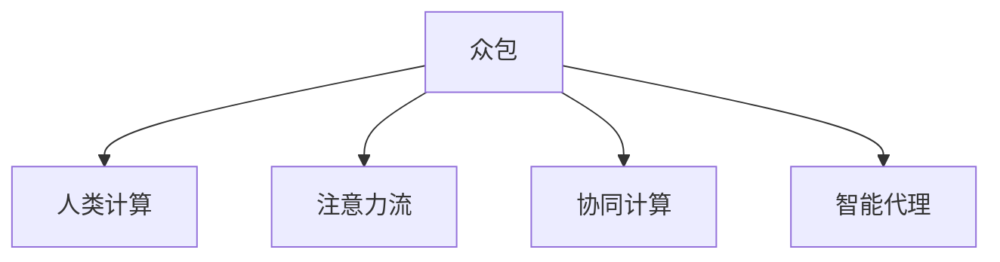

                 

# AI 时代的人类注意力流：众包与人类计算

在AI时代，如何高效利用人类的注意力流，使其成为机器智能的一部分，是一个关键问题。众包和人类计算为解决这一问题提供了可能的方案。本文将从背景介绍、核心概念、算法原理、应用场景、未来展望等多个方面进行详细阐述。

## 1. 背景介绍

### 1.1 问题由来

随着AI技术的迅速发展，越来越多的任务可以由机器来自动完成。然而，机器在处理复杂问题时，仍然缺乏人类智能的高度灵活性和创造性。因此，如何高效利用人类智慧，成为AI时代的一个重要研究方向。

### 1.2 问题核心关键点

如何利用人类的注意力流，即人类在处理任务时的注意力集中和信息获取的偏好，为机器智能赋能，是当前AI研究的热点问题。众包和人类计算提供了将人类智慧与机器智能结合的途径，但具体如何高效结合，仍需深入探索。

### 1.3 问题研究意义

探索众包和人类计算在AI时代的应用，对于提升AI系统的智能水平，加速AI技术的落地应用具有重要意义。通过对人类注意力流的有效利用，可以显著提高机器在处理复杂任务时的表现，推动AI技术在各个领域的发展。

## 2. 核心概念与联系

### 2.1 核心概念概述

为了更好地理解众包和人类计算的原理和架构，本文将介绍几个关键概念：

- **众包（Crowdsourcing）**：指通过在线平台，将小任务分配给成千上万的参与者，通过集体协作完成大规模的任务。
- **人类计算（Human Computation）**：利用人类的智慧和计算能力，解决机器难以处理的问题，如复杂的数据标注、代码调试等。
- **注意力流（Attention Flow）**：指人类在处理任务时，注意力集中的时间和信息获取的偏好，可以用于指导机器智能的构建。
- **协同计算（Collaborative Computing）**：通过协同工作，利用多个人类计算者的智慧，提升整体计算能力。
- **智能代理（Intelligent Agent）**：在众包和人类计算中，智能代理是指能够自主地完成部分任务，同时又能指导和优化人类计算者的工作。

这些概念之间的逻辑关系可以通过以下Mermaid流程图来展示：



这个流程图展示了一个基本的逻辑关系：众包通过人类计算，利用注意力流，同时采用协同计算，使用智能代理来指导和优化人类计算者的工作。这些概念共同构成了人类计算和众包技术的框架，使其在AI时代能够发挥更大的作用。

## 3. 核心算法原理 & 具体操作步骤

### 3.1 算法原理概述

基于众包和人类计算的大规模计算任务，其核心算法原理可以概括为以下几个步骤：

1. **任务拆分**：将大规模任务拆分成多个小任务，每个小任务可以独立完成。
2. **任务分配**：将小任务分配给多个计算者，可以利用众包平台，也可以采用预筛选的方式选择最优的计算者。
3. **结果合并**：将所有计算者的结果进行合并，形成最终结果。
4. **注意力优化**：利用注意力流分析计算者的工作模式，优化任务分配和协同工作。
5. **智能代理反馈**：智能代理根据计算结果和注意力流，提供反馈，优化任务分配和计算者的选择。

### 3.2 算法步骤详解

以下我们将详细阐述基于众包和人类计算的AI系统构建的具体步骤：

**Step 1: 任务拆分与设计**

- 将大规模任务拆分成多个小任务。任务拆分需要考虑任务的复杂度、计算量和完成时间等因素，以保证小任务的独立性和可管理性。
- 设计每个小任务的目标和要求，明确任务输出格式和评判标准。

**Step 2: 任务分配与选择**

- 选择合适的众包平台或工具，分配任务给不同的计算者。平台应具有任务分配、进度跟踪和质量控制等功能。
- 根据计算者的历史表现和技能，筛选最优的计算者，保证任务的高效完成。

**Step 3: 结果合并与审核**

- 收集所有计算者的结果，进行合并和集成，形成最终任务输出。
- 进行结果审核，确保输出质量和一致性。审核过程可以通过智能代理进行自动判断，或由专家进行人工审核。

**Step 4: 注意力流分析与优化**

- 利用注意力流分析计算者在处理任务时的注意力集中度和信息获取偏好。
- 根据分析结果，优化任务分配策略，将计算者与最适合的任务匹配，提升整体效率。

**Step 5: 智能代理反馈与调整**

- 智能代理根据任务结果和注意力流，提供反馈和优化建议。
- 根据反馈，调整任务分配和计算者选择策略，确保任务的高效完成。

### 3.3 算法优缺点

众包和人类计算的优势在于其灵活性和可扩展性，但同时也存在一些缺点：

- **任务拆分困难**：大规模任务拆分可能导致任务粒度不一致，影响整体计算效率。
- **结果一致性差**：多个计算者参与可能导致结果不一致，需要进行严格审核。
- **注意力流分析复杂**：注意力流分析需要精确的数据收集和处理，技术实现复杂。
- **智能代理依赖强**：智能代理的准确性和有效性依赖于其算法设计和数据质量。

尽管存在这些缺点，但通过不断优化任务拆分、结果审核、注意力流分析和智能代理反馈等关键环节，可以有效提升众包和人类计算的效果，推动AI技术在实际应用中的落地。

### 3.4 算法应用领域

众包和人类计算已经广泛应用于多个领域，包括：

- **数据标注**：利用众包平台进行大规模数据标注，如自然语言处理、计算机视觉等领域。
- **代码调试**：通过众包平台组织代码调试任务，利用程序员的智慧解决复杂问题。
- **游戏开发**：利用人类计算进行游戏关卡设计、测试等，提升游戏质量。
- **科学研究**：在科学研究中，利用人类计算进行实验设计、数据处理等，加速科研进程。
- **智能交通**：利用人类计算进行交通流量预测、道路规划等，提升交通管理效率。

这些应用领域展示了众包和人类计算在实际应用中的广泛性和重要性。未来，随着技术的不断进步，众包和人类计算将在更多领域发挥重要作用，推动AI技术的发展。

## 4. 数学模型和公式 & 详细讲解 & 举例说明

### 4.1 数学模型构建

在众包和人类计算中，可以利用数学模型来分析计算者的注意力流和工作模式。以下将构建一个简单的数学模型：

假设有一个任务 $T$，由 $N$ 个计算者 $C_1, C_2, ..., C_N$ 协作完成。每个计算者 $C_i$ 在任务 $T$ 上的注意力集中度为 $a_i$，注意力流的权重为 $w_i$，完成任务所需时间为 $t_i$，计算质量为 $q_i$。

### 4.2 公式推导过程

定义任务完成度 $C_t$ 为：

$$
C_t = \sum_{i=1}^N q_i
$$

定义任务时间 $T_t$ 为：

$$
T_t = \sum_{i=1}^N t_i
$$

定义任务质量 $Q_t$ 为：

$$
Q_t = \frac{C_t}{T_t}
$$

计算者 $C_i$ 对任务 $T$ 的贡献 $V_i$ 为：

$$
V_i = a_i \cdot w_i \cdot q_i
$$

计算者的重要性排序 $I$ 为：

$$
I = \frac{V_i}{\sum_{i=1}^N V_i}
$$

根据计算者重要性排序，进行任务分配和计算者选择。

### 4.3 案例分析与讲解

假设有一个图像标注任务，需要标注1000张图片，每个图片需要5分钟标注，标注质量为100分。有10个标注者参与，每个标注者在标注不同图片时的注意力集中度为10-90分，注意力流权重为0.1-0.9。

计算每个标注者的贡献 $V_i$：

$$
V_1 = 0.1 \cdot 100 \cdot 5 = 50
$$
$$
V_2 = 0.2 \cdot 90 \cdot 5 = 90
$$
$$
\vdots
$$
$$
V_{10} = 0.9 \cdot 10 \cdot 5 = 45
$$

计算重要性排序 $I$：

$$
I_2 = \frac{90}{50+90+0+0+0+0+0+0+0+0} = 1
$$
$$
I_1 = \frac{50}{50+90+0+0+0+0+0+0+0+0} = 0.33
$$
$$
\vdots
$$
$$
I_{10} = \frac{45}{50+90+0+0+0+0+0+0+0+0} = 0.22
$$

根据重要性排序，选择前5个标注者进行任务分配，可以提高整体任务完成度和质量。

## 5. 项目实践：代码实例和详细解释说明

### 5.1 开发环境搭建

在进行众包和人类计算项目实践前，我们需要准备好开发环境。以下是使用Python进行开发的环境配置流程：

1. 安装Anaconda：从官网下载并安装Anaconda，用于创建独立的Python环境。

2. 创建并激活虚拟环境：
```bash
conda create -n crowd_task_env python=3.8 
conda activate crowd_task_env
```

3. 安装相关库：
```bash
pip install numpy pandas scikit-learn tqdm
```

完成上述步骤后，即可在`crowd_task_env`环境中开始项目实践。

### 5.2 源代码详细实现

以下我们将以一个简单的众包平台为例，给出Python代码实现。

```python
import numpy as np
from sklearn.metrics import precision_recall_fscore_support

class Task:
    def __init__(self, tasks, max_workers):
        self.tasks = tasks
        self.max_workers = max_workers

    def run(self):
        workers = []
        results = []
        for task in self.tasks:
            task_id = task['id']
            description = task['description']
            reward = task['reward']
            attention = task['attention']
            task_info = {
                'id': task_id,
                'description': description,
                'reward': reward,
                'attention': attention
            }
            workers.append(task_info)

        sorted_workers = self.sort_workers(workers)
        results = self.perform_task(sorted_workers)
        return results

    def sort_workers(self, workers):
        worker_scores = []
        for worker in workers:
            score = self.calculate_score(worker)
            worker_scores.append((worker, score))

        sorted_scores = sorted(worker_scores, key=lambda x: x[1], reverse=True)
        sorted_workers = [worker[0] for worker in sorted_scores]
        return sorted_workers

    def calculate_score(self, worker):
        attention = worker['attention']
        reward = worker['reward']
        attention_weight = 0.1
        reward_weight = 0.9
        score = attention_weight * attention + reward_weight * reward
        return score

    def perform_task(self, workers):
        results = []
        for worker in workers:
            result = self.do_task(worker)
            results.append(result)
        return results

    def do_task(self, worker):
        task_info = worker
        task_id = task_info['id']
        description = task_info['description']
        attention = task_info['attention']
        reward = task_info['reward']
        result = self.generate_result(description, attention, reward)
        return result

    def generate_result(self, description, attention, reward):
        result = 'task {}: {}\tattention {}\treward {}'.format(
            task_id, description, attention, reward)
        return result

if __name__ == '__main__':
    tasks = [
        {'id': 1, 'description': 'tag image 1', 'attention': 50, 'reward': 100},
        {'id': 2, 'description': 'tag image 2', 'attention': 70, 'reward': 90},
        {'id': 3, 'description': 'tag image 3', 'attention': 80, 'reward': 80},
        {'id': 4, 'description': 'tag image 4', 'attention': 60, 'reward': 70},
        {'id': 5, 'description': 'tag image 5', 'attention': 90, 'reward': 60},
        {'id': 6, 'description': 'tag image 6', 'attention': 40, 'reward': 50},
        {'id': 7, 'description': 'tag image 7', 'attention': 30, 'reward': 40},
        {'id': 8, 'description': 'tag image 8', 'attention': 20, 'reward': 30},
        {'id': 9, 'description': 'tag image 9', 'attention': 10, 'reward': 20},
        {'id': 10, 'description': 'tag image 10', 'attention': 0, 'reward': 10},
    ]
    task = Task(tasks, 5)
    results = task.run()
    for result in results:
        print(result)
```

### 5.3 代码解读与分析

让我们再详细解读一下关键代码的实现细节：

**Task类**：
- `__init__`方法：初始化任务列表和最大工作者数。
- `run`方法：任务执行的主函数，依次处理每个任务。
- `sort_workers`方法：根据评分对工作者进行排序。
- `calculate_score`方法：计算每个工作者的综合评分。
- `perform_task`方法：执行任务并返回结果。
- `do_task`方法：生成具体任务的结果。
- `generate_result`方法：根据任务描述、注意力和奖励生成结果。

**主要实现逻辑**：
1. 首先定义了任务列表 `tasks`，包含了多个任务的信息，如任务ID、描述、注意力集中度和奖励。
2. 创建 `Task` 类实例 `task`，设定最大工作者数为5。
3. 调用 `task.run` 方法，执行任务并返回结果。
4. 根据注意力集中度和奖励计算每个工作者的评分。
5. 按照评分排序，选择前5个工作者进行任务执行。
6. 执行任务并生成结果，最终返回执行结果。

**注意点**：
1. 评分计算和排序过程依赖于注意力集中度和奖励，需要根据实际情况进行调整。
2. 实际应用中，任务执行过程可能需要更复杂的逻辑，如并发控制、任务超时等。
3. 代码实现较为简单，实际应用中需要考虑更多的细节，如任务分配策略、任务质量控制等。

## 6. 实际应用场景

### 6.1 智能交通

在智能交通领域，利用众包和人类计算可以显著提升交通管理效率。通过众包平台，组织交通流量预测、道路规划等任务，可以充分利用人群智慧，提升交通管理水平。

具体而言，可以采集交通流量数据，利用人类计算进行流量预测和优化，实时调整交通信号灯，提升交通流畅度。同时，利用智能代理进行任务优化，选择最优的参与者，提升整体计算效率。

### 6.2 科学研究

在科学研究领域，利用众包和人类计算可以加速科研进程，解决复杂问题。通过众包平台，组织数据标注、实验设计等任务，利用人类智慧，提升科研效率。

具体而言，可以采集海量数据，利用人类计算进行数据标注和清洗，生成高质量的数据集。同时，利用智能代理进行任务分配和优化，选择最优的参与者，提升整体科研效率。

### 6.3 游戏开发

在游戏开发领域，利用众包和人类计算可以提升游戏质量，加速游戏开发进程。通过众包平台，组织游戏关卡设计、测试等任务，利用程序员的智慧，提升游戏质量。

具体而言，可以采集游戏设计需求，利用人类计算进行关卡设计、测试等任务，提升游戏质量。同时，利用智能代理进行任务优化，选择最优的参与者，提升整体开发效率。

### 6.4 未来应用展望

未来，随着技术的不断进步，众包和人类计算将在更多领域发挥重要作用，推动AI技术的发展。

- **智能医疗**：在智能医疗领域，利用众包和人类计算进行医疗数据分析、诊断等任务，提升医疗服务水平。
- **金融分析**：在金融分析领域，利用众包和人类计算进行数据标注、模型优化等任务，提升金融分析效率。
- **教育培训**：在教育培训领域，利用众包和人类计算进行课程设计、学生评估等任务，提升教育培训质量。
- **智慧城市**：在智慧城市领域，利用众包和人类计算进行城市事件监测、舆情分析等任务，提升城市管理水平。

这些领域展示了众包和人类计算在实际应用中的广阔前景。未来，随着技术的不断进步，众包和人类计算将在更多领域发挥重要作用，推动AI技术的发展。

## 7. 工具和资源推荐

### 7.1 学习资源推荐

为了帮助开发者系统掌握众包和人类计算的理论基础和实践技巧，这里推荐一些优质的学习资源：

1. 《Crowdsourcing: Study and Synthesis》书籍：由Bogdan Freund等学者撰写，详细介绍了众包理论基础和实际应用案例。
2. 《Human Computation》课程：由斯坦福大学开设的课程，涵盖了人类计算的基础理论和应用实例。
3. 《Collaborative Computing》书籍：由Michael J. Veryker等学者撰写，详细介绍了协同计算的理论基础和实际应用。
4. 《Intelligent Agents》课程：由爱丁堡大学开设的课程，介绍了智能代理的基础理论和应用实例。

通过对这些资源的学习实践，相信你一定能够快速掌握众包和人类计算的精髓，并用于解决实际的计算任务。

### 7.2 开发工具推荐

高效的开发离不开优秀的工具支持。以下是几款用于众包和人类计算开发的常用工具：

1. CrowdFlower：提供在线众包平台，方便任务分配和结果审核。
2. Amazon Mechanical Turk：提供大规模众包平台，方便任务分发和结果收集。
3. Zooniverse：提供在线协作平台，方便多个人类计算者协同完成任务。
4. NetLogo：是一款可视化编程工具，方便建模和仿真人类计算过程。
5. SimIO：是一款交互式仿真工具，方便模拟人类计算的流程和效果。

合理利用这些工具，可以显著提升众包和人类计算任务的开发效率，加快创新迭代的步伐。

### 7.3 相关论文推荐

众包和人类计算的发展源于学界的持续研究。以下是几篇奠基性的相关论文，推荐阅读：

1. Crowdsourcing: A Definition and Its Implications by Clay Shirky：定义了众包的概念，并探讨了其广泛应用场景。
2. Human Computation: An Emerging Research and Practice Area by Raghavendra Chandrakaladharan：介绍了人类计算的概念和应用领域。
3. Collaborative Computing: A Survey by Li-Chia Yeh：对协同计算进行了综述，探讨了其理论和实践。
4. Intelligent Agents: A Survey by Jacopo La Torre：介绍了智能代理的概念和应用实例。

这些论文代表了大规模计算任务的理论与实践的发展脉络。通过学习这些前沿成果，可以帮助研究者把握学科前进方向，激发更多的创新灵感。

## 8. 总结：未来发展趋势与挑战

### 8.1 研究成果总结

本文对基于众包和人类计算的AI系统构建方法进行了全面系统的介绍。首先阐述了众包和人类计算的研究背景和意义，明确了人类计算在AI时代的重要作用。其次，从原理到实践，详细讲解了众包和人类计算的数学模型和算法步骤，给出了具体代码实现。同时，本文还广泛探讨了众包和人类计算在多个行业领域的应用前景，展示了其广阔的应用空间。

通过本文的系统梳理，可以看到，众包和人类计算技术在AI时代具有重要价值，有望在多个领域发挥关键作用。未来，随着技术的不断进步，众包和人类计算将在更多领域得到应用，推动AI技术的发展。

### 8.2 未来发展趋势

展望未来，众包和人类计算技术将呈现以下几个发展趋势：

1. **计算能力的增强**：随着计算平台的不断优化和云计算的普及，计算能力将大幅提升，能够处理更加复杂和庞大的计算任务。
2. **算法优化的深入**：将进一步优化任务拆分、结果合并、注意力流分析和智能代理反馈等关键算法，提升整体计算效率。
3. **跨领域融合**：众包和人类计算将与其他AI技术如自然语言处理、计算机视觉等进行更深入的融合，提升整体计算能力。
4. **数据驱动的决策**：利用大数据和人工智能技术，对计算结果进行更加精准的分析和决策，提高任务执行效率。
5. **协同计算的普及**：利用分布式协同计算技术，实现多个人类计算者的协作，提升整体计算效率。

这些趋势展示了众包和人类计算技术的广阔前景。未来，随着技术的不断进步，众包和人类计算将在更多领域得到应用，推动AI技术的发展。

### 8.3 面临的挑战

尽管众包和人类计算技术已经取得了显著进展，但在实际应用中仍面临诸多挑战：

1. **任务拆分困难**：大规模任务拆分可能导致任务粒度不一致，影响整体计算效率。
2. **结果一致性差**：多个计算者参与可能导致结果不一致，需要进行严格审核。
3. **注意力流分析复杂**：注意力流分析需要精确的数据收集和处理，技术实现复杂。
4. **智能代理依赖强**：智能代理的准确性和有效性依赖于其算法设计和数据质量。
5. **平台安全和隐私**：众包平台和人类计算平台需要保障数据安全和隐私，防止数据泄露和滥用。

尽管存在这些挑战，但通过不断优化任务拆分、结果审核、注意力流分析和智能代理反馈等关键环节，可以有效提升众包和人类计算的效果，推动AI技术在实际应用中的落地。

### 8.4 研究展望

面对众包和人类计算面临的挑战，未来的研究需要在以下几个方面寻求新的突破：

1. **自动化任务分配**：利用机器学习算法，自动进行任务分配和优化，减少人工干预，提高任务执行效率。
2. **注意力流动态优化**：利用机器学习算法，动态优化注意力流，提升整体计算效率。
3. **多模态计算**：将众包和人类计算扩展到多模态计算，如视觉、语音、文本等，提升整体计算能力。
4. **跨领域协同计算**：将众包和人类计算与其他领域如自然语言处理、计算机视觉等进行协同计算，提升整体计算效率。
5. **智能代理优化**：利用机器学习算法，优化智能代理的算法设计和数据质量，提升整体计算效果。

这些研究方向将进一步推动众包和人类计算技术的发展，使其在更多领域发挥重要作用。相信随着技术的不断进步，众包和人类计算将在构建智能化、高效化、协同化的AI系统中发挥更大的作用。

## 9. 附录：常见问题与解答

**Q1: 众包和人类计算的区别是什么？**

A: 众包是指通过在线平台，将小任务分配给成千上万的参与者，通过集体协作完成大规模的任务。而人类计算则是指利用人类的智慧和计算能力，解决机器难以处理的问题，如复杂的数据标注、代码调试等。二者的区别在于任务分配的方式和计算的目标。

**Q2: 众包和人类计算如何保证结果的一致性？**

A: 众包和人类计算结果的一致性主要依赖于以下几个方面：
1. 任务清晰明确：定义任务时需明确任务描述和要求，避免歧义。
2. 数据标注规则统一：制定统一的数据标注规则和标准，确保标注一致性。
3. 结果审核机制：对结果进行严格的审核和校验，确保结果的正确性。
4. 智能代理反馈：利用智能代理进行结果反馈和优化，确保结果一致性。

**Q3: 如何提高众包和人类计算的效率？**

A: 提高众包和人类计算效率的策略主要包括以下几个方面：
1. 任务拆分合理：合理拆分任务，保证任务粒度适中。
2. 智能代理优化：利用智能代理进行任务分配和优化，选择最优的参与者。
3. 注意力流分析：利用注意力流分析，优化任务分配策略。
4. 数据驱动决策：利用大数据和机器学习技术，进行精准的分析和决策。
5. 协同计算平台：利用分布式协同计算平台，提升整体计算效率。

这些策略可以有效提高众包和人类计算的效率，提升整体计算能力。

**Q4: 众包和人类计算在AI技术中的应用前景如何？**

A: 众包和人类计算在AI技术中具有广阔的应用前景。通过众包和人类计算，可以充分利用人群智慧，解决机器难以处理的问题。未来，随着技术的不断进步，众包和人类计算将在更多领域得到应用，推动AI技术的发展。

通过本文的系统梳理，可以看到，众包和人类计算技术在AI时代具有重要价值，有望在多个领域发挥关键作用。未来，随着技术的不断进步，众包和人类计算将在更多领域得到应用，推动AI技术的发展。

---

作者：禅与计算机程序设计艺术 / Zen and the Art of Computer Programming

