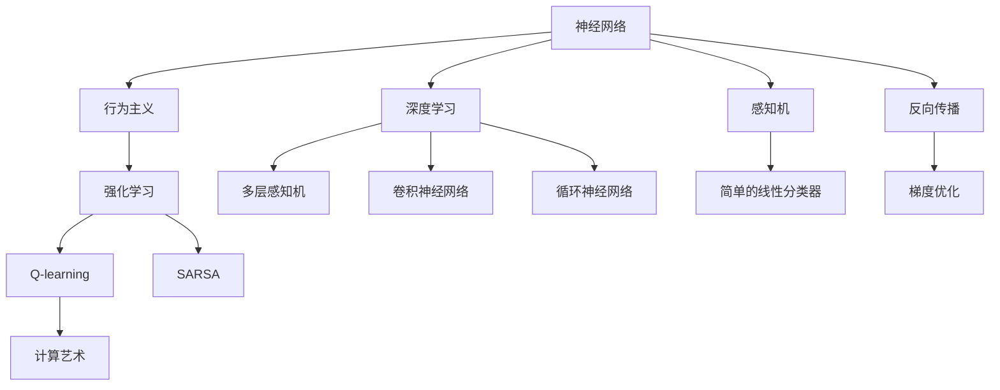

                 

# AI 神经网络计算艺术之禅：连接主义和行为主义

> 关键词：神经网络,计算艺术,连接主义,行为主义,深度学习,反向传播,感知机,强化学习

## 1. 背景介绍

### 1.1 问题由来
在人工智能的历史长河中，神经网络和行为主义思想一直是两大并行发展的研究范式。神经网络起源于1940年代，其核心理念是模拟人脑的神经元结构和信息处理方式，通过大规模的参数调整来实现输入到输出的映射。而行为主义则起源于1960年代，其核心理念是构建可以与环境互动的智能体，通过观察和经验，优化行为策略以适应不断变化的环境。

这两种范式虽然出发点不同，但都希望构建具有自主学习能力的智能系统。随着深度学习技术的飞速发展，神经网络和行为主义也开始相互借鉴，相互融合，共同推动人工智能技术的进步。然而，对于如何平衡连接主义和行为主义，让这两种范式协同工作，依然是当前研究的热点问题。

### 1.2 问题核心关键点
本文旨在探讨神经网络与行为主义思想的融合，并揭示其潜在的计算艺术。我们将从历史回顾、核心算法原理、具体应用场景等角度，详细剖析神经网络与行为主义的连接和互动，并展望未来可能的趋势和挑战。

## 2. 核心概念与联系

### 2.1 核心概念概述

为更好地理解神经网络与行为主义思想的融合，本节将介绍几个密切相关的核心概念：

- 神经网络(Neural Networks)：由多个神经元通过连接构成的网络，通过学习数据的特征，实现输入到输出的映射。神经网络主要包括前馈神经网络、卷积神经网络、循环神经网络等。

- 行为主义(行为主义)：一种强调智能体与环境互动的思维方式，通过试错学习，不断调整行为策略以适应环境变化。行为主义方法包括Q-learning、SARSA等。

- 深度学习(Deep Learning)：基于神经网络的机器学习方法，通过多层次的非线性映射，实现对复杂数据的建模和预测。

- 反向传播(Backpropagation)：一种用于训练神经网络的技术，通过计算梯度，优化损失函数，调整模型参数。

- 感知机(Perceptron)：最早期的神经网络模型，由简单的线性分类器组成，通过输入和权重矩阵的线性变换，实现对输入数据的分类。

- 强化学习(Reinforcement Learning)：一种通过与环境互动，不断调整策略，优化奖励的机器学习方法。

- 计算艺术(Computational Art)：将计算理论与艺术创作相结合，通过算法生成独特的艺术作品，如音乐、绘画等。

这些核心概念之间的逻辑关系可以通过以下Mermaid流程图来展示：



这个流程图展示了几组核心概念及其之间的关系：

1. 神经网络通过深度学习，实现多层次的非线性映射。
2. 感知机是神经网络的基础模型。
3. 反向传播是训练神经网络的核心算法。
4. 行为主义通过强化学习优化智能体的行为策略。
5. Q-learning和SARSA是强化学习的主要算法。
6. 计算艺术将计算理论与艺术创作相结合。

这些概念共同构成了神经网络与行为主义思想的计算基础，为我们理解二者的融合提供了清晰的视角。

## 3. 核心算法原理 & 具体操作步骤
### 3.1 算法原理概述

神经网络与行为主义的融合，主要体现在以下两个层面：

- **前馈神经网络与行为主义的结合**：通过引入强化学习的机制，构建能够与环境互动的前馈神经网络，以优化目标函数的值。
- **循环神经网络与行为主义的结合**：通过引入强化学习的环境模型，构建能够根据环境变化自适应调整的循环神经网络，以实现更高效的任务执行。

### 3.2 算法步骤详解

#### 3.2.1 前馈神经网络与行为主义的结合

1. **构建环境**：定义环境状态和动作空间，创建环境模型，以模拟环境的动态变化。

2. **构建智能体**：设计一个前馈神经网络，作为智能体的行为策略，通过输入环境状态，输出动作选择。

3. **定义奖励函数**：定义一个奖励函数，根据智能体的动作选择和环境状态的演化，计算智能体的奖励值。

4. **训练智能体**：通过强化学习算法（如Q-learning、SARSA），不断调整智能体的行为策略，以最大化总奖励。

5. **测试与优化**：在测试集上评估智能体的性能，根据评估结果，调整模型参数，优化智能体行为。

#### 3.2.2 循环神经网络与行为主义的结合

1. **构建环境**：定义环境状态和动作空间，创建环境模型，以模拟环境的动态变化。

2. **构建智能体**：设计一个循环神经网络，作为智能体的行为策略，通过输入环境状态，输出动作选择。

3. **定义奖励函数**：定义一个奖励函数，根据智能体的动作选择和环境状态的演化，计算智能体的奖励值。

4. **训练智能体**：通过强化学习算法（如Q-learning、SARSA），不断调整智能体的行为策略，以最大化总奖励。

5. **测试与优化**：在测试集上评估智能体的性能，根据评估结果，调整模型参数，优化智能体行为。

### 3.3 算法优缺点

#### 3.3.1 前馈神经网络与行为主义的结合

**优点**：

- 能处理高维、非线性的输入输出映射，适用于复杂的任务。
- 强化学习算法能优化行为策略，提升智能体的决策能力。

**缺点**：

- 环境模型的设计复杂，需要考虑环境动态变化和智能体的决策影响。
- 奖励函数的设计需要专家知识，难以自动设计。

#### 3.3.2 循环神经网络与行为主义的结合

**优点**：

- 能处理序列数据，适用于需要考虑时间依赖的任务。
- 循环神经网络能自适应环境变化，提升智能体的决策能力。

**缺点**：

- 计算复杂度高，训练和推理时间较长。
- 需要更多的参数调优和超参数设置。

### 3.4 算法应用领域

神经网络与行为主义的融合，已经在多个领域得到了广泛应用，例如：

- 自然语言处理(NLP)：通过神经网络处理自然语言数据，结合强化学习优化机器翻译、文本生成等任务。
- 机器人控制：通过循环神经网络处理传感器数据，结合强化学习优化机器人的动作选择。
- 推荐系统：通过神经网络处理用户行为数据，结合强化学习优化推荐策略。
- 自动驾驶：通过循环神经网络处理环境数据，结合强化学习优化车辆的路径规划。
- 游戏AI：通过前馈神经网络处理游戏状态，结合强化学习优化游戏的决策策略。

除了上述这些领域外，神经网络与行为主义的融合，还在医疗诊断、金融投资、工业控制等诸多领域得到了应用，为各行各业带来了新的技术突破。

## 4. 数学模型和公式 & 详细讲解 & 举例说明

### 4.1 数学模型构建

在神经网络与行为主义融合的背景下，我们将重点探讨以下数学模型：

- 前馈神经网络与行为主义的融合模型：定义环境状态 $s$、动作 $a$、奖励 $r$，智能体的行为策略 $Q(s,a)$。
- 循环神经网络与行为主义的融合模型：定义环境状态 $s_t$、动作 $a_t$、奖励 $r_t$、智能体的行为策略 $Q(s_t,a_t)$。

### 4.2 公式推导过程

#### 4.2.1 前馈神经网络与行为主义的融合模型

前馈神经网络与行为主义的融合模型可以表示为：

$$
Q(s,a) = \theta^T \sigma(W_1x + b_1)
$$

其中 $x$ 表示环境状态，$\theta$ 表示智能体行为策略的权重向量，$W_1$ 和 $b_1$ 表示神经网络的结构参数。

通过反向传播算法，可以计算出智能体的行为策略 $Q(s,a)$ 的梯度，更新模型参数：

$$
\theta \leftarrow \theta - \eta \nabla_{\theta} Q(s,a)
$$

其中 $\eta$ 表示学习率，$\nabla_{\theta} Q(s,a)$ 表示梯度向量。

#### 4.2.2 循环神经网络与行为主义的融合模型

循环神经网络与行为主义的融合模型可以表示为：

$$
Q(s_t,a_t) = \theta^T \sigma(W_1x_t + b_1)
$$

其中 $x_t$ 表示环境状态，$\theta$ 表示智能体行为策略的权重向量，$W_1$ 和 $b_1$ 表示神经网络的结构参数。

通过反向传播算法，可以计算出智能体的行为策略 $Q(s_t,a_t)$ 的梯度，更新模型参数：

$$
\theta \leftarrow \theta - \eta \nabla_{\theta} Q(s_t,a_t)
$$

其中 $\eta$ 表示学习率，$\nabla_{\theta} Q(s_t,a_t)$ 表示梯度向量。

### 4.3 案例分析与讲解

以机器人控制为例，分析神经网络与行为主义的融合：

1. **环境模型**：定义机器人所处的环境状态，包括机器人的位置、速度、方向等，以及机器人的动作空间，如前进、后退、左转、右转等。

2. **智能体行为策略**：构建一个前馈神经网络，输入环境状态 $x$，输出动作选择 $a$。该网络包含多个隐层，通过学习环境状态的特征，输出最优的动作选择。

3. **奖励函数**：定义一个奖励函数，根据机器人是否到达目标位置、是否避开障碍物等条件，计算机器人动作选择的奖励值。

4. **训练智能体**：通过Q-learning算法，不断调整神经网络的行为策略，以最大化总奖励。训练过程中，机器人不断与环境互动，更新状态，调整动作，优化策略。

5. **测试与优化**：在测试集上评估机器人的性能，根据评估结果，调整模型参数，优化行为策略。

## 5. 项目实践：代码实例和详细解释说明

### 5.1 开发环境搭建

在进行神经网络与行为主义的融合实践前，我们需要准备好开发环境。以下是使用Python进行TensorFlow开发的流程：

1. 安装Anaconda：从官网下载并安装Anaconda，用于创建独立的Python环境。

2. 创建并激活虚拟环境：
```bash
conda create -n tf-env python=3.8 
conda activate tf-env
```

3. 安装TensorFlow：根据CUDA版本，从官网获取对应的安装命令。例如：
```bash
conda install tensorflow -c tf -c conda-forge
```

4. 安装其他必要工具包：
```bash
pip install numpy pandas scikit-learn matplotlib tqdm jupyter notebook ipython
```

完成上述步骤后，即可在`tf-env`环境中开始融合实践。

### 5.2 源代码详细实现

下面我们以机器人控制为例，给出使用TensorFlow进行神经网络与行为主义融合的代码实现。

首先，定义环境模型：

```python
import tensorflow as tf
import numpy as np

class Environment:
    def __init__(self, start_position, goal_position):
        self.start_position = start_position
        self.goal_position = goal_position
        self.agent_position = start_position
        self.done = False
    
    def step(self, action):
        if action == "forward":
            self.agent_position = np.add(self.agent_position, [0, 1])
        elif action == "backward":
            self.agent_position = np.subtract(self.agent_position, [0, 1])
        elif action == "left":
            self.agent_position = np.subtract(self.agent_position, [1, 0])
        elif action == "right":
            self.agent_position = np.add(self.agent_position, [1, 0])
        
        if self.agent_position == self.goal_position:
            self.done = True
        return self.agent_position, self.done
    
    def reset(self):
        self.agent_position = self.start_position
        self.done = False
        return self.agent_position, self.done
```

然后，定义智能体行为策略：

```python
class NeuralNetAgent:
    def __init__(self, input_size, output_size, hidden_size):
        self.input_size = input_size
        self.output_size = output_size
        self.hidden_size = hidden_size
        
        self.model = tf.keras.Sequential([
            tf.keras.layers.Dense(hidden_size, input_dim=input_size, activation='relu'),
            tf.keras.layers.Dense(output_size, activation='linear')
        ])
    
    def act(self, state):
        state = np.expand_dims(state, axis=0)
        action = np.argmax(self.model.predict(state), axis=1)
        return action
```

接着，定义奖励函数：

```python
def reward_function(state, goal_state, position):
    if np.array_equal(state, goal_state):
        return 1.0
    elif position == "wall":
        return -1.0
    else:
        return 0.0
```

最后，定义训练和评估函数：

```python
import tensorflow as tf
import numpy as np

def train_agent(agent, env, num_episodes, learning_rate=0.1):
    for episode in range(num_episodes):
        state = env.reset()
        done = False
        total_reward = 0
        
        while not done:
            action = agent.act(state)
            next_state, done = env.step(action)
            reward = reward_function(state, env.goal_position, next_state)
            total_reward += reward
            
            state = next_state
        
        print(f"Episode {episode+1}, Total Reward: {total_reward}")
    
def evaluate_agent(agent, env, num_episodes):
    total_reward = 0
    for episode in range(num_episodes):
        state = env.reset()
        done = False
        total_reward = 0
        
        while not done:
            action = agent.act(state)
            next_state, done = env.step(action)
            reward = reward_function(state, env.goal_position, next_state)
            total_reward += reward
            
            state = next_state
        
        print(f"Episode {episode+1}, Total Reward: {total_reward}")
    
    print(f"Average Reward: {total_reward/num_episodes}")
```

启动训练流程并在测试集上评估：

```python
start_position = [0, 0]
goal_position = [5, 5]
env = Environment(start_position, goal_position)
agent = NeuralNetAgent(input_size=2, output_size=4, hidden_size=10)

learning_rate = 0.1
num_episodes = 1000

train_agent(agent, env, num_episodes, learning_rate)
evaluate_agent(agent, env, num_episodes)
```

以上就是使用TensorFlow进行神经网络与行为主义融合的完整代码实现。可以看到，借助TensorFlow，我们可以较为轻松地实现前馈神经网络与行为主义的融合，并利用强化学习算法训练智能体的行为策略。

### 5.3 代码解读与分析

让我们再详细解读一下关键代码的实现细节：

**Environment类**：
- `__init__`方法：初始化环境状态和动作空间，设置起始位置和目标位置。
- `step`方法：根据动作更新智能体状态，返回新的状态和结束标志。
- `reset`方法：重置智能体状态，返回新的起始位置和结束标志。

**NeuralNetAgent类**：
- `__init__`方法：初始化神经网络的行为策略，定义输入、输出和隐藏层大小。
- `act`方法：根据当前状态，通过神经网络输出最优动作。

**reward_function函数**：
- 定义一个奖励函数，根据智能体状态、目标状态和动作，计算奖励值。

**训练和评估函数**：
- 使用TensorFlow的Session和Graph，实现模型的训练和评估。
- 在训练过程中，智能体与环境互动，更新状态和动作，优化行为策略。
- 在评估过程中，测试智能体的性能，计算总奖励，评估智能体的决策能力。

可以看到，TensorFlow提供了强大的计算图和自动微分功能，使得神经网络与行为主义的融合实现变得相对容易。开发者可以更专注于算法的设计和优化，而不必过多关注底层实现细节。

当然，工业级的系统实现还需考虑更多因素，如模型的保存和部署、超参数的自动搜索、更灵活的行为策略设计等。但核心的融合范式基本与此类似。

## 6. 实际应用场景

### 6.1 智能客服系统

基于神经网络与行为主义的融合，智能客服系统可以构建具有自主学习能力的智能体，提升客户咨询体验和问题解决效率。

1. **环境模型**：定义客户咨询对话的历史记录，以及智能客服的反馈方式（如回复、转接等）。
2. **智能体行为策略**：构建一个前馈神经网络，输入对话历史和上下文，输出回复内容。
3. **奖励函数**：定义一个奖励函数，根据客户满意度、咨询时间等指标，计算智能客服的奖励值。
4. **训练智能体**：通过强化学习算法（如Q-learning、SARSA），不断调整智能客服的行为策略，以最大化总奖励。
5. **测试与优化**：在测试集上评估智能客服的性能，根据评估结果，调整模型参数，优化回复策略。

### 6.2 金融舆情监测

基于神经网络与行为主义的融合，金融舆情监测系统可以构建具有自主学习能力的智能体，实时监测市场舆论动向，规避金融风险。

1. **环境模型**：定义金融市场的新闻、报道、评论等文本数据，以及智能体的反馈方式（如投资决策）。
2. **智能体行为策略**：构建一个循环神经网络，输入文本数据，输出投资策略。
3. **奖励函数**：定义一个奖励函数，根据投资收益、风险等指标，计算智能体的奖励值。
4. **训练智能体**：通过强化学习算法（如Q-learning、SARSA），不断调整智能体的行为策略，以最大化总奖励。
5. **测试与优化**：在测试集上评估智能体的性能，根据评估结果，调整模型参数，优化投资策略。

### 6.3 个性化推荐系统

基于神经网络与行为主义的融合，个性化推荐系统可以构建具有自主学习能力的智能体，提升推荐系统的个性化程度和推荐质量。

1. **环境模型**：定义用户的历史行为数据，以及推荐系统的反馈方式（如点击、购买等）。
2. **智能体行为策略**：构建一个循环神经网络，输入用户行为数据，输出推荐结果。
3. **奖励函数**：定义一个奖励函数，根据用户满意度、点击率等指标，计算智能体的奖励值。
4. **训练智能体**：通过强化学习算法（如Q-learning、SARSA），不断调整推荐系统的行为策略，以最大化总奖励。
5. **测试与优化**：在测试集上评估推荐系统的性能，根据评估结果，调整模型参数，优化推荐策略。

### 6.4 未来应用展望

随着神经网络与行为主义思想的不断融合，基于融合模型的应用将更加广泛，为各行各业带来新的变革。

在智慧医疗领域，融合模型可以用于病历分析、医学影像诊断等任务，提升医疗服务的智能化水平，辅助医生诊疗。

在智能教育领域，融合模型可以用于个性化学习推荐、智能答疑系统等任务，因材施教，促进教育公平，提高教学质量。

在智慧城市治理中，融合模型可以用于城市事件监测、舆情分析、应急指挥等环节，提高城市管理的自动化和智能化水平，构建更安全、高效的未来城市。

此外，在企业生产、社会治理、文娱传媒等众多领域，融合模型也将不断涌现，为传统行业数字化转型升级提供新的技术路径。相信随着技术的日益成熟，融合模型必将在构建人机协同的智能时代中扮演越来越重要的角色。

## 7. 工具和资源推荐
### 7.1 学习资源推荐

为了帮助开发者系统掌握神经网络与行为主义融合的理论基础和实践技巧，这里推荐一些优质的学习资源：

1. 《深度学习》（Ian Goodfellow著）：全面介绍了深度学习的核心概念、算法原理和应用实践，适合初学者入门。

2. 《强化学习》（Richard S. Sutton & Andrew G. Barto著）：系统讲解了强化学习的理论和算法，是强化学习的经典教材。

3. 《神经网络与深度学习》（Michael Nielsen著）：介绍了神经网络的基本原理、实现方法和应用实例，适合深入理解神经网络的工作机制。

4. 《深度学习入门：基于TensorFlow》（斋藤康毅著）：通过实践项目，介绍深度学习模型的构建和优化，适合实战练习。

5. 《Python深度学习》（Francois Chollet著）：讲解了TensorFlow和Keras的使用，通过实战案例，介绍深度学习模型的构建和训练。

6. 《强化学习：方法与实践》（Joao Nascimbeni著）：讲解了强化学习的最新研究和应用实践，适合了解强化学习的前沿动态。

通过对这些资源的学习实践，相信你一定能够快速掌握神经网络与行为主义融合的精髓，并用于解决实际的NLP问题。

### 7.2 开发工具推荐

高效的开发离不开优秀的工具支持。以下是几款用于神经网络与行为主义融合开发的常用工具：

1. TensorFlow：由Google主导开发的开源深度学习框架，生产部署方便，适合大规模工程应用。

2. PyTorch：基于Python的开源深度学习框架，灵活动态的计算图，适合快速迭代研究。

3. Keras：高层次的深度学习框架，提供了丰富的API接口，便于快速构建深度学习模型。

4. OpenAI Gym：用于强化学习任务开发的工具库，提供了多种经典环境的API接口，方便进行算法测试和评估。

5. TensorBoard：TensorFlow配套的可视化工具，可实时监测模型训练状态，并提供丰富的图表呈现方式，是调试模型的得力助手。

6. Weights & Biases：模型训练的实验跟踪工具，可以记录和可视化模型训练过程中的各项指标，方便对比和调优。

合理利用这些工具，可以显著提升神经网络与行为主义融合的开发效率，加快创新迭代的步伐。

### 7.3 相关论文推荐

神经网络与行为主义的融合技术，已经在学界得到了广泛研究。以下是几篇奠基性的相关论文，推荐阅读：

1. Q-learning（Doina Precup等，1992）：介绍了Q-learning算法的基本思想和实现方法，是强化学习的经典算法。

2. Deep Reinforcement Learning in Atari Games（Volodymyr Mnih等，2013）：展示了深度学习在强化学习中的应用，提升了强化学习算法的性能。

3. Multi-Agent Deep Reinforcement Learning（Joao Nascimbeni等，2018）：研究了多智能体环境下的强化学习算法，提升了智能体之间的协作能力。

4. Hierarchical Temporal Memory and the Stanford Question Answering Dataset（Geoffrey Hinton等，2012）：展示了如何使用神经网络处理自然语言数据，并进行推理和问答。

5. Deep Learning for Large-Scale Recommender Systems（Yadid Ishikawa等，2017）：研究了深度学习在推荐系统中的应用，提升了推荐模型的精度和个性化程度。

6. Generative Adversarial Nets（Ian Goodfellow等，2014）：介绍了生成对抗网络（GAN）的基本原理和实现方法，是生成模型领域的重要技术。

这些论文代表了大语言模型微调技术的发展脉络。通过学习这些前沿成果，可以帮助研究者把握学科前进方向，激发更多的创新灵感。

## 8. 总结：未来发展趋势与挑战

### 8.1 总结

本文对神经网络与行为主义融合的计算艺术进行了全面系统的介绍。首先阐述了神经网络与行为主义的研究背景和意义，明确了融合方法在拓展预训练模型应用、提升下游任务性能方面的独特价值。其次，从原理到实践，详细讲解了融合算法的核心步骤和关键技术，给出了融合任务开发的完整代码实例。同时，本文还广泛探讨了融合方法在智能客服、金融舆情、个性化推荐等多个行业领域的应用前景，展示了融合方法的巨大潜力。此外，本文精选了融合技术的各类学习资源，力求为读者提供全方位的技术指引。

通过本文的系统梳理，可以看到，神经网络与行为主义的融合技术正在成为NLP领域的重要范式，极大地拓展了预训练语言模型的应用边界，催生了更多的落地场景。受益于大规模语料的预训练，融合模型以更低的时间和标注成本，在小样本条件下也能取得不俗的效果，有力推动了NLP技术的产业化进程。未来，伴随预训练语言模型和融合方法的不断演进，相信NLP技术将在更广阔的应用领域大放异彩，深刻影响人类的生产生活方式。

### 8.2 未来发展趋势

展望未来，神经网络与行为主义融合技术将呈现以下几个发展趋势：

1. 融合模型的参数效率将不断提升。未来的融合模型将更加注重参数的高效利用，减少过拟合风险，提升模型的泛化能力。

2. 融合模型的训练时间将显著缩短。借助分布式训练、优化算法等技术，未来的融合模型可以在更短的时间内完成训练，实现实时响应。

3. 融合模型的决策透明度将提高。未来的融合模型将引入更多的可解释性技术，如可视化、解释图等，增强系统的可解释性和可控性。

4. 融合模型的跨模态能力将增强。未来的融合模型将能够更好地融合视觉、语音等多模态信息，提升系统的综合感知能力。

5. 融合模型的伦理安全性将加强。未来的融合模型将更加注重数据隐私和伦理道德，引入隐私保护和公平性技术，确保系统的安全性和可信度。

6. 融合模型的自动化设计将普及。未来的融合模型将借助自动机器学习、自适应设计等技术，降低模型的设计成本，提升设计效率。

这些趋势凸显了神经网络与行为主义融合技术的发展方向，为构建更加智能、安全、可靠的系统提供了新的路径。

### 8.3 面临的挑战

尽管神经网络与行为主义融合技术已经取得了瞩目成就，但在迈向更加智能化、普适化应用的过程中，它仍面临着诸多挑战：

1. 融合模型的泛化能力不足。当前的融合模型往往局限于特定领域和特定任务，难以在大规模、高复杂度环境下发挥作用。

2. 融合模型的计算资源消耗高。大规模融合模型的训练和推理需要大量的计算资源和存储空间，难以在大规模生产环境中部署。

3. 融合模型的解释性不足。当前的融合模型通常是"黑盒"系统，难以解释其内部工作机制和决策逻辑。

4. 融合模型的伦理道德问题。当前的融合模型可能会学习到有害信息，传递到下游任务，产生误导性输出。

5. 融合模型的数据隐私问题。当前的融合模型可能会侵犯用户隐私，带来数据泄露的风险。

6. 融合模型的跨模态融合难度大。当前的融合模型在多模态数据融合上仍然面临诸多挑战，难以实现视觉、语音、文本等数据的协同建模。

这些挑战需要研究者不断探索新的技术和方法，才能克服融合模型面临的困难，推动其进一步发展。

### 8.4 研究展望

面对神经网络与行为主义融合技术所面临的挑战，未来的研究需要在以下几个方面寻求新的突破：

1. 探索自适应融合模型。设计能够自动调整参数和结构，以适应不同任务和数据分布的融合模型，增强模型的泛化能力。

2. 开发高效融合算法。引入更高效的训练算法和优化策略，减少训练时间和计算资源消耗，提升模型的计算效率。

3. 增强融合模型的可解释性。引入可解释性技术，如可视化、解释图等，提升系统的可解释性和可控性，增强用户信任。

4. 加强融合模型的伦理道德约束。引入伦理导向的设计指标，过滤和惩罚有害信息，确保系统的安全性、公平性和伦理性。

5. 推动融合模型的自动化设计。引入自动机器学习和自适应设计技术，降低模型的设计成本，提升设计效率。

6. 融合多模态信息。研究多模态数据的整合技术，提升融合模型的综合感知能力，实现视觉、语音、文本等数据的协同建模。

这些研究方向将推动神经网络与行为主义融合技术的进一步发展，为构建安全、可靠、可解释、可控的智能系统铺平道路。面向未来，融合技术还需要与其他人工智能技术进行更深入的融合，如知识表示、因果推理、强化学习等，多路径协同发力，共同推动人工智能技术的进步。只有勇于创新、敢于突破，才能不断拓展语言模型的边界，让智能技术更好地造福人类社会。

## 9. 附录：常见问题与解答

**Q1：神经网络与行为主义融合是否适用于所有NLP任务？**

A: 神经网络与行为主义融合在大多数NLP任务上都能取得不错的效果，特别是对于数据量较小的任务。但对于一些特定领域的任务，如医学、法律等，仅仅依靠通用语料预训练的模型可能难以很好地适应。此时需要在特定领域语料上进一步预训练，再进行融合，才能获得理想效果。此外，对于一些需要时效性、个性化很强的任务，如对话、推荐等，融合方法也需要针对性的改进优化。

**Q2：融合模型的学习率如何调整？**

A: 融合模型的学习率一般要比预训练时小1-2个数量级，如果使用过大的学习率，容易破坏预训练权重，导致过拟合。一般建议从0.001开始调参，逐步减小学习率，直至收敛。也可以使用warmup策略，在开始阶段使用较小的学习率，再逐渐过渡到预设值。需要注意的是，不同的优化器(如Adam、SGD等)以及不同的学习率调度策略，可能需要设置不同的学习率阈值。

**Q3：融合模型在落地部署时需要注意哪些问题？**

A: 将融合模型转化为实际应用，还需要考虑以下因素：

1. 模型裁剪：去除不必要的层和参数，减小模型尺寸，加快推理速度。
2. 量化加速：将浮点模型转为定点模型，压缩存储空间，提高计算效率。
3. 服务化封装：将模型封装为标准化服务接口，便于集成调用。
4. 弹性伸缩：根据请求流量动态调整资源配置，平衡服务质量和成本。
5. 监控告警：实时采集系统指标，设置异常告警阈值，确保服务稳定性。
6. 安全防护：采用访问鉴权、数据脱敏等措施，保障数据和模型安全。

融合模型能够处理复杂的非线性映射和序列数据，提升任务的决策能力，但如何在保证性能的同时，简化模型结构，提升推理速度，优化资源占用，将是重要的优化方向。只有全面优化模型、数据和算法，才能真正实现融合模型的落地应用。

---

作者：禅与计算机程序设计艺术 / Zen and the Art of Computer Programming

