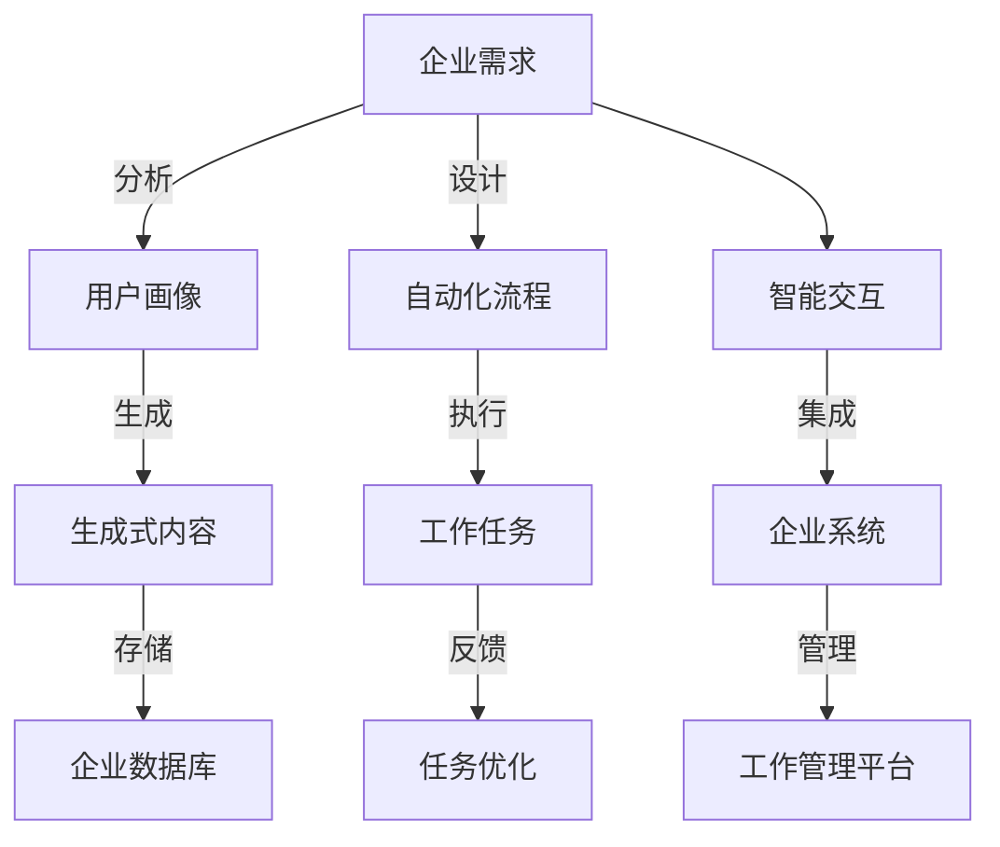

                 

# AIGC助推下的企业工作任务原子化

## 1. 背景介绍

在当前的企业数字化转型大潮中，人工智能(AI)、增强现实(AR)、虚拟现实(VR)、生成式对抗网络(GANs)、计算机视觉(CV)等新兴技术不断涌现，极大地推动了自动化、智能化工作的兴起。这其中，生成式人工智能(AIGC)技术更是以其实现语音、图像、文本等内容的智能生成和定制化生成，颠覆了人们的工作方式，开启了全新的企业运营模式。

在企业内部，AIGC技术对工作任务的生成、处理、自动化执行等方面产生了深远影响，不仅提升了工作效率，还减轻了人工负担，推动了企业内部流程的优化与升级。本文将探讨AIGC技术在企业工作任务自动化、智能化处理中的应用，分析其实现原理和操作步骤，并展望未来发展趋势。

## 2. 核心概念与联系

### 2.1 核心概念概述

生成式人工智能(AIGC)，即生成式模型，是能够生成数据(如文本、图像、音频等)的机器学习模型。AIGC技术包括自然语言处理(NLP)、图像生成、音频生成等多种方式，能够基于大数据和深度学习技术生成逼真的、符合需求的内容。其核心模型包括变分自编码器(VAE)、生成对抗网络(GANs)、语言模型(如GPT系列)、序列生成模型等。

AIGC技术的应用涵盖多个领域，包括但不限于：

- 内容创作：如文本生成、音乐创作、图片生成等。
- 娱乐行业：如虚拟主播、游戏角色设计、影视特效等。
- 虚拟助手：如智能客服、语音助手、虚拟教师等。
- 工业制造：如3D打印、智能设计、工艺仿真等。

### 2.2 核心概念原理和架构的 Mermaid 流程图



这个流程图展示了AIGC技术在企业工作任务自动化中的基本流程：

1. 分析企业需求，设计用户画像。
2. 基于用户画像，设计生成式内容。
3. 生成式内容存储到企业数据库。
4. 设计自动化流程，执行工作任务。
5. 根据反馈优化自动化流程。
6. 与企业系统集成，实现智能交互。
7. 通过工作管理平台进行任务管理。

## 3. 核心算法原理 & 具体操作步骤

### 3.1 算法原理概述

AIGC技术的核心在于利用生成式模型，自动生成高质量、具有特定属性的内容。其算法原理主要基于以下几种技术：

1. **生成对抗网络(GANs)**：由生成器网络(g)和判别器网络(d)组成，通过训练使生成器能够生成逼真内容，判别器能够识别真实与伪造内容。
2. **变分自编码器(VAEs)**：通过优化变分下界，将高维输入映射到低维空间，再映射回高维空间生成新的样本。
3. **语言模型(LMs)**：如BERT、GPT系列，通过大量无标签文本训练，预测文本下一个词或字。
4. **自回归模型(AR)**：通过已有的输入序列预测下一个词。

这些算法可以结合具体的应用场景，实现文本、图像、音频等多种形式的生成。

### 3.2 算法步骤详解

1. **数据收集与预处理**：收集相关的数据，如文本、图片、音频等，并进行清洗、标注等预处理工作。
2. **模型训练与优化**：选择适合的生成式模型，进行训练和优化，确保生成的内容质量高、符合需求。
3. **内容生成**：根据企业需求，利用训练好的模型生成相应的内容。
4. **内容验证与优化**：对生成的内容进行质量评估和优化，确保符合企业标准。
5. **集成与应用**：将生成的内容集成到企业系统中，进行自动化处理和智能化交互。

### 3.3 算法优缺点

AIGC技术的优点：

- **效率高**：自动生成内容，减少人工工作量。
- **适应性强**：适用于多种内容形式，如文本、图片、音频等。
- **灵活性高**：可以灵活应用于多个场景，如内容创作、虚拟助手等。

AIGC技术的缺点：

- **生成质量问题**：生成的内容可能存在一定的质量问题，需要不断优化模型。
- **数据依赖性强**：生成内容的质量高度依赖于训练数据的质量和多样性。
- **可解释性不足**：模型生成内容的逻辑和过程较为复杂，难以解释。

### 3.4 算法应用领域

AIGC技术在多个领域有着广泛的应用，包括但不限于：

- **内容创作**：自动生成新闻、广告文案、产品描述等。
- **虚拟助手**：自动生成对话、客服回答等。
- **虚拟主播**：自动生成视频、音频内容。
- **产品设计**：自动生成3D模型、设计图纸等。
- **娱乐与艺术**：自动生成音乐、艺术作品等。

## 4. 数学模型和公式 & 详细讲解

### 4.1 数学模型构建

AIGC技术的数学模型构建主要基于深度学习模型的构建，以生成对抗网络(GANs)为例，其核心模型包括生成器和判别器。生成器模型 $g$ 接收一个随机噪声向量 $z$，输出一个图像 $x$，判别器模型 $d$ 接收图像 $x$，输出一个判别分数 $y$。

```python
import torch
from torch import nn

class Generator(nn.Module):
    def __init__(self):
        super(Generator, self).__init__()
        self.fc1 = nn.Linear(100, 256)
        self.fc2 = nn.Linear(256, 512)
        self.fc3 = nn.Linear(512, 1024)
        self.fc4 = nn.Linear(1024, 784)

    def forward(self, x):
        x = torch.relu(self.fc1(x))
        x = torch.relu(self.fc2(x))
        x = torch.relu(self.fc3(x))
        x = torch.tanh(self.fc4(x))
        return x

class Discriminator(nn.Module):
    def __init__(self):
        super(Discriminator, self).__init__()
        self.fc1 = nn.Linear(784, 512)
        self.fc2 = nn.Linear(512, 256)
        self.fc3 = nn.Linear(256, 1)

    def forward(self, x):
        x = torch.relu(self.fc1(x))
        x = torch.relu(self.fc2(x))
        x = torch.sigmoid(self.fc3(x))
        return x
```

### 4.2 公式推导过程

GANs模型的目标是最小化生成器损失和判别器损失，即：

$$
\min_{g} \max_{d} \mathcal{L}_{gan}(g,d) = \mathbb{E}_{x \sim p_{data}} [\log d(x)] + \mathbb{E}_{z \sim p(z)} [\log (1 - d(g(z)))]
$$

其中，$g$ 和 $d$ 分别为生成器和判别器，$z$ 为噪声向量，$p(z)$ 为噪声分布。

### 4.3 案例分析与讲解

假设我们要生成手写数字图片，可以从MNIST数据集中选取样本，作为训练GANs模型的数据。具体步骤如下：

1. 加载MNIST数据集，进行预处理和归一化。
2. 构建生成器和判别器模型。
3. 设置优化器，并训练模型。
4. 验证生成的图片质量。
5. 生成新的手写数字图片。

以下是一个简单的实现示例：

```python
import torch
import torch.nn as nn
import torch.optim as optim
from torchvision import datasets, transforms
from torchvision.utils import save_image

# 加载MNIST数据集
train_dataset = datasets.MNIST(root='./data', train=True, download=True, transform=transforms.ToTensor())
train_loader = torch.utils.data.DataLoader(dataset=train_dataset, batch_size=128, shuffle=True)

# 构建生成器和判别器模型
class Generator(nn.Module):
    def __init__(self):
        super(Generator, self).__init__()
        self.fc1 = nn.Linear(100, 256)
        self.fc2 = nn.Linear(256, 512)
        self.fc3 = nn.Linear(512, 1024)
        self.fc4 = nn.Linear(1024, 784)

    def forward(self, x):
        x = torch.relu(self.fc1(x))
        x = torch.relu(self.fc2(x))
        x = torch.relu(self.fc3(x))
        x = torch.tanh(self.fc4(x))
        return x

class Discriminator(nn.Module):
    def __init__(self):
        super(Discriminator, self).__init__()
        self.fc1 = nn.Linear(784, 512)
        self.fc2 = nn.Linear(512, 256)
        self.fc3 = nn.Linear(256, 1)

    def forward(self, x):
        x = torch.relu(self.fc1(x))
        x = torch.relu(self.fc2(x))
        x = torch.sigmoid(self.fc3(x))
        return x

# 设置优化器和损失函数
G = Generator()
D = Discriminator()
optimizer_G = optim.Adam(G.parameters(), lr=0.0002)
optimizer_D = optim.Adam(D.parameters(), lr=0.0002)
criterion = nn.BCELoss()

# 训练模型
for epoch in range(100):
    for batch_idx, (real_images, _) in enumerate(train_loader):
        # 获取真实图像
        real_images = real_images.view(-1, 28*28)
        
        # 训练判别器
        optimizer_D.zero_grad()
        real_outputs = D(real_images)
        fake_images = G(torch.randn(128, 100))
        fake_outputs = D(fake_images)
        d_loss = criterion(torch.cat([real_outputs, fake_outputs]), torch.cat([torch.ones_like(real_outputs), torch.zeros_like(fake_outputs)]))
        d_loss.backward()
        optimizer_D.step()
        
        # 训练生成器
        optimizer_G.zero_grad()
        fake_images = G(torch.randn(128, 100))
        fake_outputs = D(fake_images)
        g_loss = criterion(fake_outputs, torch.ones_like(fake_outputs))
        g_loss.backward()
        optimizer_G.step()
        
        print(f'Epoch {epoch+1}/{100}, Batch {batch_idx}, d_loss: {d_loss.item():.4f}, g_loss: {g_loss.item():.4f}')
        
    # 保存生成器生成的图像
    save_image(fake_images[:16], f'images/{epoch+1}.png', nrow=4)
```

## 5. 项目实践：代码实例和详细解释说明

### 5.1 开发环境搭建

要搭建AIGC项目的开发环境，需要使用以下软件和工具：

1. **Python**：建议使用Python 3.8或更高版本。
2. **PyTorch**：用于构建生成对抗网络和深度学习模型。
3. **TensorFlow**：用于构建变分自编码器和序列生成模型。
4. **NumPy**：用于数值计算。
5. **Matplotlib**：用于绘制生成图像。

以下是在Anaconda环境中搭建环境的步骤：

```bash
# 创建虚拟环境
conda create -n aigc-env python=3.8
conda activate aigc-env

# 安装必要的库
conda install torch torchvision transformers tensorboard numpy matplotlib
```

### 5.2 源代码详细实现

#### 文本生成示例

以下是一个基于GPT-2模型的文本生成示例，用于生成一段新闻报道：

```python
from transformers import GPT2Tokenizer, GPT2LMHeadModel

tokenizer = GPT2Tokenizer.from_pretrained('gpt2')
model = GPT2LMHeadModel.from_pretrained('gpt2')

input_text = "新任CEO上任，公司宣布"
input_ids = tokenizer.encode(input_text, return_tensors='pt')
output = model.generate(input_ids, num_return_sequences=1, max_length=100)
output_text = tokenizer.decode(output[0], skip_special_tokens=True)

print(output_text)
```

#### 图像生成示例

以下是一个基于变分自编码器(VAE)的图像生成示例，用于生成手写数字图片：

```python
import torch
import torch.nn as nn
from torchvision import datasets, transforms

class VAE(nn.Module):
    def __init__(self):
        super(VAE, self).__init__()
        self.fc1 = nn.Linear(784, 256)
        self.fc21 = nn.Linear(256, 100)
        self.fc22 = nn.Linear(256, 100)
        self.fc3 = nn.Linear(100, 784)

    def encode(self, x):
        h1 = torch.relu(self.fc1(x))
        z_mean = self.fc21(h1)
        z_log_var = self.fc22(h1)
        return z_mean, z_log_var

    def reparameterize(self, z_mean, z_log_var):
        std = torch.exp(0.5 * z_log_var)
        eps = torch.randn_like(std)
        return z_mean + eps * std

    def decode(self, z):
        h3 = torch.relu(self.fc3(z))
        return torch.tanh(h3)

    def forward(self, x):
        z_mean, z_log_var = self.encode(x)
        z = self.reparameterize(z_mean, z_log_var)
        return self.decode(z)

# 加载MNIST数据集
train_dataset = datasets.MNIST(root='./data', train=True, download=True, transform=transforms.ToTensor())
train_loader = torch.utils.data.DataLoader(dataset=train_dataset, batch_size=128, shuffle=True)

# 构建VAE模型
vae = VAE()
optimizer = optim.Adam(vae.parameters(), lr=0.0002)

# 训练模型
for epoch in range(100):
    for batch_idx, (real_images, _) in enumerate(train_loader):
        real_images = real_images.view(-1, 784)
        z_mean, z_log_var = vae.encode(real_images)
        z = vae.reparameterize(z_mean, z_log_var)
        reconstructed_images = vae.decode(z)
        reconstruction_loss = nn.MSELoss()(reconstructed_images, real_images)
        optimizer.zero_grad()
        reconstruction_loss.backward()
        optimizer.step()
        print(f'Epoch {epoch+1}/{100}, Batch {batch_idx}, reconstruction_loss: {reconstruction_loss.item():.4f}')
```

### 5.3 代码解读与分析

文本生成和图像生成的代码示例中，主要包含以下几个步骤：

1. **数据加载**：使用TensorFlow或PyTorch加载训练数据。
2. **模型构建**：定义生成器和判别器或编码器、解码器等模型。
3. **训练优化**：通过反向传播算法优化模型参数。
4. **生成与输出**：生成新的内容并输出，如文本或图像。

在代码实现过程中，需要注意以下几点：

- **模型结构**：根据具体的生成任务选择合适的模型结构。
- **超参数**：设置适当的超参数，如学习率、批量大小等。
- **数据增强**：对训练数据进行增强，如回译、裁剪、旋转等，以提升模型泛化能力。
- **模型评估**：定期在测试集上评估模型性能，确保生成内容质量。

## 6. 实际应用场景

### 6.1 内容创作与编辑

AIGC技术在内容创作与编辑中的应用，可以通过以下方式实现：

1. **自动生成新闻报道**：利用GPT-2等模型，自动生成新闻报道，减少人工撰写新闻的负担。
2. **自动生成广告文案**：自动生成具有吸引力的广告文案，提升广告效果。
3. **自动生成产品描述**：自动生成商品描述，提升电商平台的搜索匹配精度。
4. **自动生成代码**：自动生成代码片段，提高软件开发效率。

### 6.2 智能客服与助理

AIGC技术在智能客服与助理中的应用，可以通过以下方式实现：

1. **自动生成客服回答**：利用GPT-3等模型，自动生成客服回答，提升客户满意度。
2. **自动生成推荐内容**：自动生成推荐文章、视频等，提升用户黏性。
3. **自动生成聊天机器人**：自动生成智能聊天机器人，解答用户咨询，提高用户交互体验。

### 6.3 虚拟助手与教育

AIGC技术在虚拟助手与教育中的应用，可以通过以下方式实现：

1. **自动生成教育内容**：自动生成教学视频、课件等，提升教育资源分配效率。
2. **自动生成虚拟教师**：自动生成虚拟教师，辅助教学，提高教学效果。
3. **自动生成虚拟主播**：自动生成虚拟主播，提供实时信息播报、娱乐节目等。

### 6.4 未来应用展望

未来，AIGC技术的应用前景将更加广阔，涵盖更多领域和场景：

1. **智能医疗**：自动生成医疗报告、辅助诊断等。
2. **智能制造**：自动生成工艺仿真、产品设计等。
3. **智能交通**：自动生成交通管制方案、路线规划等。
4. **智能城市**：自动生成城市规划、应急响应方案等。

## 7. 工具和资源推荐

### 7.1 学习资源推荐

- **《生成式模型：原理与应用》**：详细介绍了生成式模型的工作原理和应用场景。
- **《深度学习与神经网络》**：全面讲解深度学习模型的基础知识和应用。
- **《自然语言处理入门》**：介绍NLP基础理论与实践技巧。
- **Hugging Face官方文档**：提供详细的生成式模型API文档和示例代码。

### 7.2 开发工具推荐

- **PyTorch**：强大的深度学习框架，提供丰富的生成式模型API。
- **TensorFlow**：领先的深度学习框架，支持变分自编码器、序列生成模型等。
- **Google Colab**：免费提供GPU资源，方便开发者进行实验。
- **Jupyter Notebook**：交互式编程环境，方便调试和演示代码。

### 7.3 相关论文推荐

- **《生成式对抗网络：生成与判别》**：详细介绍GANs的原理和应用。
- **《变分自编码器：从理论到实践》**：全面讲解VAEs的理论和实现。
- **《语言模型：原理与应用》**：介绍LMs的原理和应用场景。

## 8. 总结：未来发展趋势与挑战

### 8.1 研究成果总结

AIGC技术在内容生成、智能客服、教育、医疗等多个领域展现了巨大的应用潜力，极大地提升了企业的运营效率和用户体验。通过深度学习模型的不断优化，AIGC技术的生成质量、实时性、灵活性等指标逐步提升，未来在更广泛的场景中发挥更大作用。

### 8.2 未来发展趋势

未来AIGC技术的趋势主要集中在以下几个方面：

1. **更高效的生成模型**：通过模型优化和算法改进，提升生成内容的质量和速度。
2. **更智能的交互系统**：增强生成式模型与人类交互的能力，提供更个性化的服务。
3. **更广泛的应用场景**：AIGC技术将在更多行业和领域得到应用，推动智能化转型。

### 8.3 面临的挑战

AIGC技术在应用过程中仍面临诸多挑战：

1. **生成内容质量**：生成内容可能存在质量问题，需要不断优化模型。
2. **数据依赖性**：生成内容的质量高度依赖于训练数据的质量和多样性。
3. **伦理道德问题**：生成内容可能包含有害信息，需要严格审查和管理。

### 8.4 研究展望

未来，AIGC技术的研究方向将包括：

1. **可解释性研究**：提升生成内容的可解释性，增强用户信任。
2. **多模态生成**：实现图像、语音、文本等多模态内容的生成。
3. **跨领域应用**：拓展AIGC技术在更多领域的应用，如医疗、制造等。

## 9. 附录：常见问题与解答

**Q1: 什么是生成式人工智能？**

A: 生成式人工智能，即生成式模型，能够根据输入数据生成新的、具有一定规律性的内容，如文本、图像、音频等。其代表技术包括生成对抗网络(GANs)、变分自编码器(VAEs)、语言模型等。

**Q2: AIGC技术有哪些应用场景？**

A: AIGC技术的应用场景非常广泛，包括内容创作、智能客服、虚拟助手、教育、医疗等多个领域。如自动生成新闻报道、智能客服回答、虚拟教师、产品设计等。

**Q3: AIGC技术的实现有哪些步骤？**

A: AIGC技术的实现主要包括以下步骤：数据收集与预处理、模型构建与训练、内容生成与输出、模型评估与优化。

**Q4: AIGC技术的优缺点有哪些？**

A: AIGC技术的优点包括生成效率高、适应性强、灵活性高。缺点包括生成内容质量问题、数据依赖性强、可解释性不足。

**Q5: 如何提升AIGC技术生成内容的可解释性？**

A: 提升AIGC技术生成内容的可解释性，需要从模型设计、数据标注、用户反馈等多个方面进行改进。如采用可解释性更高的生成模型，增加数据标注信息，引入用户反馈机制等。

---

作者：禅与计算机程序设计艺术 / Zen and the Art of Computer Programming

