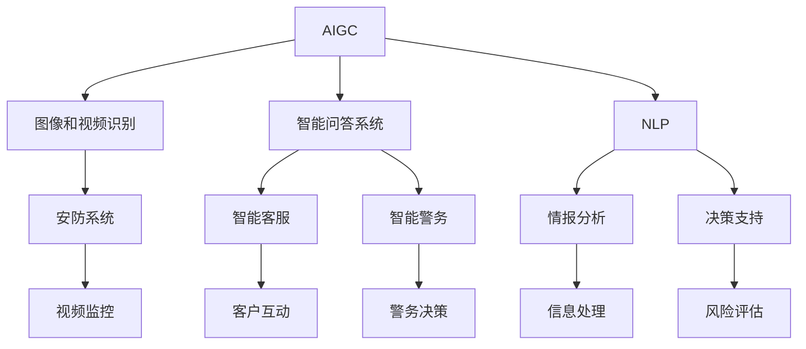

                 

# AIGC重新定义公共安全

> 关键词：人工智能生成内容(AIGC), 公共安全, 图像识别, 视频分析, 文字生成, 自然语言处理(NLP)

## 1. 背景介绍

### 1.1 问题由来

随着技术的快速进步，人工智能生成内容（Artificial Intelligence Generated Content, AIGC）已经成为驱动数字化变革的新引擎。从深度学习、增强学习到生成对抗网络（GAN），各类技术在图像、音频、视频、文本等多个领域大放异彩。在公共安全领域，AIGC技术的应用也日益广泛，并带来革命性变革。

然而，由于AIGC技术本质上属于黑盒模型，其决策过程复杂、结果难以解释，因此在公共安全领域的应用也面临诸多挑战。特别是在需要高可靠性、高透明度的公共安全场景下，AIGC的泛化性、公正性、鲁棒性等关键问题亟待解决。

### 1.2 问题核心关键点

本文将重点探讨AIGC技术在公共安全领域的应用，并提出提升其安全性的关键技术路径。具体包括以下几个方面：

1. **图像和视频识别**：利用AIGC技术提升公共场所的视频监控识别能力，及时发现异常行为和事件。
2. **智能问答系统**：构建基于AIGC的智能客服和智能警务系统，提升公共服务的响应效率。
3. **自然语言处理**：利用AIGC进行语言生成、情感分析等，增强公共安全事件的情报分析和决策支持。
4. **模型鲁棒性和公平性**：研究AIGC模型在公共安全场景下的鲁棒性、公平性和可解释性问题，确保模型决策的透明性和可靠性。

这些核心关键点涵盖了AIGC在公共安全领域的广泛应用场景，并指明了未来技术发展的方向。

## 2. 核心概念与联系

### 2.1 核心概念概述

为更好地理解AIGC在公共安全中的应用，本节将介绍几个密切相关的核心概念：

- **人工智能生成内容(AIGC)**：利用深度学习等技术生成高质量的文本、图像、音频和视频内容。AIGC技术在自然语言处理（NLP）、计算机视觉、音频处理等领域均有广泛应用。

- **公共安全**：指保护国家、社会和个人免受各种潜在威胁的综合性工作，包括犯罪预防、灾害应对、网络安全等。公共安全系统需要高可靠性和高透明性，以确保决策的科学性和公正性。

- **图像和视频识别**：通过深度学习算法对视频监控画面中的图像和视频进行分析，识别出异常行为和事件，提升公共场所的安防水平。

- **智能问答系统**：利用自然语言处理技术，构建智能客服和智能警务系统，提升公共服务的效率和质量。

- **自然语言处理(NLP)**：利用深度学习算法处理、分析、理解和生成自然语言，是AIGC技术的重要组成部分。

- **模型鲁棒性**：指模型在面对不同类型数据时，仍能保持稳定性能的能力。鲁棒性强的模型能够避免由于数据分布变化导致的性能下降。

- **模型公平性**：指模型在面对不同背景、不同群体数据时，输出结果应保持一致性。公平性强的模型能够避免由于数据偏见导致的歧视性结果。

- **模型可解释性**：指模型输出的结果应具备可解释性，使用户能够理解模型的决策依据和过程。

这些核心概念之间的逻辑关系可以通过以下Mermaid流程图来展示：



这个流程图展示了大语言模型的核心概念及其之间的关系：

1. AIGC技术可以应用于图像识别、视频分析、自然语言处理等多个领域，形成多维度的公共安全防护体系。
2. 图像和视频识别可以应用于安防系统，及时发现异常行为和事件。
3. 智能问答系统可以应用于客服和警务，提升公共服务的响应效率。
4. 自然语言处理可以应用于情报分析和决策支持，增强公共安全事件的情报分析和决策能力。

这些概念共同构成了AIGC在公共安全领域的应用框架，使其能够有效提升公共安全的防护水平。

## 3. 核心算法原理 & 具体操作步骤
### 3.1 算法原理概述

AIGC在公共安全领域的应用，主要基于深度学习等技术，通过训练模型来生成和分析各类内容。以下介绍几个核心的算法原理：

- **卷积神经网络(CNN)**：用于图像识别和视频分析。CNN通过卷积和池化等操作提取图像和视频的关键特征，并通过全连接层输出分类结果。

- **生成对抗网络(GAN)**：用于图像生成和编辑。GAN通过生成器和判别器两个神经网络对立训练，生成高质量的图像内容。

- **循环神经网络(RNN)**：用于自然语言处理。RNN通过循环机制处理序列数据，捕捉语言中的时间依赖关系。

- **Transformer**：用于语言生成和翻译。Transformer通过自注意力机制，实现高效的并行计算，提升语言处理的性能。

这些算法原理为AIGC在公共安全领域的应用提供了坚实的技术基础，使其能够在图像、视频、语言等多个领域实现智能化应用。

### 3.2 算法步骤详解

以下是AIGC在公共安全领域应用的详细步骤：

**Step 1: 数据收集与预处理**

1. **数据收集**：从各类公共安全场景中收集大量的图像、视频、文本等数据，如视频监控、报案记录、新闻报道等。数据应涵盖不同类型和尺度的数据，以提高模型的泛化能力。

2. **数据预处理**：对收集到的数据进行清洗、标注和归一化处理。图像数据需要去除噪声、调整大小和对比度等，视频数据需要进行剪辑和帧采样，文本数据需要进行分词和词性标注。

**Step 2: 模型选择与训练**

1. **模型选择**：根据具体任务选择合适的模型架构，如CNN用于图像识别，RNN用于自然语言处理，GAN用于图像生成。

2. **模型训练**：利用收集到的数据对模型进行训练。通常使用带有正则化技术的深度学习框架，如TensorFlow或PyTorch。

**Step 3: 模型部署与应用**

1. **模型部署**：将训练好的模型部署到公共安全系统中，如安防监控系统、智能客服系统等。

2. **模型应用**：在实际应用中，模型需要处理实时输入的数据，进行图像、视频、文字的识别和分析。同时，模型需要具备高可靠性和高透明性，确保决策的科学性和公正性。

**Step 4: 模型监控与优化**

1. **模型监控**：对部署的模型进行实时监控，记录模型输出结果和性能指标。

2. **模型优化**：根据监控结果和用户反馈，对模型进行持续优化，提升模型的准确性和鲁棒性。

### 3.3 算法优缺点

AIGC在公共安全领域的应用，具有以下优点：

1. **高效性**：利用深度学习等技术，AIGC可以在短时间内处理大量数据，提升公共安全响应的效率。

2. **智能化**：AIGC能够自动识别和分析公共安全场景中的各类异常行为和事件，提升决策的科学性。

3. **灵活性**：AIGC可以适应不同类型和规模的公共安全场景，提供定制化的解决方案。

4. **集成性**：AIGC可以与各类公共安全系统进行无缝集成，增强系统的综合防护能力。

5. **可扩展性**：AIGC可以根据实际需求进行灵活扩展，提升系统的适应性和鲁棒性。

同时，AIGC在公共安全领域也面临一些挑战：

1. **数据隐私**：在公共安全场景中，数据隐私保护至关重要。AIGC模型需要严格遵守隐私保护法律法规，确保数据安全和合规使用。

2. **模型泛化性**：AIGC模型需要具备良好的泛化能力，避免过拟合和数据分布偏移导致的性能下降。

3. **模型透明性**：AIGC模型需要具备良好的透明性，确保用户能够理解模型的决策依据和过程。

4. **模型公平性**：AIGC模型需要具备良好的公平性，避免由于数据偏见导致的歧视性结果。

5. **模型安全性**：AIGC模型需要具备良好的安全性，避免被恶意攻击和滥用。

### 3.4 算法应用领域

AIGC在公共安全领域的应用已经覆盖了多个领域，包括：

- **图像和视频识别**：用于安防监控、目标检测、行为分析等。

- **智能问答系统**：用于智能客服、智能警务、情报分析等。

- **自然语言处理**：用于智能问答、情感分析、舆情监测等。

- **多模态融合**：结合图像、视频、音频、文本等多模态数据，提升公共安全防护能力。

- **智能决策**：结合AIGC和人类专家的知识，提升公共安全决策的科学性和智能性。

这些应用领域展示了AIGC在公共安全领域的重要作用，为提升公共安全防护水平提供了新的解决方案。

## 4. 数学模型和公式 & 详细讲解  
### 4.1 数学模型构建

在本节中，我们将使用数学语言对AIGC在公共安全中的应用进行更加严格的刻画。

假设我们有一个图像识别任务，输入为图像序列 $x = \{x_1, x_2, \ldots, x_T\}$，其中 $x_t$ 表示第 $t$ 帧图像，输出为事件类别 $y \in \{0, 1\}$，表示是否存在异常事件。

我们使用CNN模型 $M_{\theta}$ 进行图像识别，其中 $\theta$ 为模型参数。模型的输入为 $x$，输出为概率分布 $p(y|x)$。在训练过程中，我们希望最小化模型的预测误差 $L$，即：

$$
\min_{\theta} L(y, M_{\theta}(x)) = \min_{\theta} \mathbb{E}_{(x,y)} [-\log p(y|x)]
$$

其中，$-\log p(y|x)$ 为交叉熵损失函数，$\mathbb{E}_{(x,y)}$ 表示期望。

### 4.2 公式推导过程

以图像识别为例，推导CNN模型的训练过程。

假设CNN模型由卷积层、池化层和全连接层组成，其中卷积层和池化层的输出为特征图 $f \in \mathbb{R}^D$，全连接层的输出为事件概率 $p(y|x)$。模型的损失函数为交叉熵损失：

$$
L(y, p(y|x)) = -y \log p(y|x) - (1-y) \log (1-p(y|x))
$$

在训练过程中，我们使用梯度下降算法对模型参数 $\theta$ 进行优化。假设当前样本的标签为 $y$，模型的预测概率为 $p(y|x)$，则梯度更新公式为：

$$
\theta \leftarrow \theta - \eta \nabla_{\theta} L(y, p(y|x))
$$

其中，$\eta$ 为学习率。梯度计算过程可通过反向传播算法完成。

在实际应用中，由于CNN模型的复杂性，我们通常使用mini-batch随机梯度下降（SGD）等方法，以提高训练效率和稳定性。

### 4.3 案例分析与讲解

以视频监控中的行为分析为例，分析AIGC在公共安全中的应用。

假设我们有一个监控视频序列，目标检测任务是识别出视频中的人脸和异常行为。我们首先对视频进行帧采样，将每一帧图像作为模型的输入。然后，通过CNN模型提取图像的关键特征，结合时间依赖关系进行行为分类。具体步骤如下：

1. **帧采样**：对视频进行等时间间隔的帧采样，得到一系列图像 $x = \{x_1, x_2, \ldots, x_T\}$。

2. **特征提取**：使用CNN模型提取每一帧图像的关键特征 $f = \{f_1, f_2, \ldots, f_T\}$。

3. **行为分类**：结合时间依赖关系，使用RNN模型对特征序列 $f$ 进行分类，得到事件概率 $p(y|x)$。

4. **结果输出**：根据模型输出结果，确定是否存在异常事件。

通过对AIGC模型的应用，我们可以实时监测监控视频中的异常行为，提升公共安全的防护能力。

## 5. 项目实践：代码实例和详细解释说明
### 5.1 开发环境搭建

在进行AIGC项目实践前，我们需要准备好开发环境。以下是使用Python进行PyTorch开发的环境配置流程：

1. 安装Anaconda：从官网下载并安装Anaconda，用于创建独立的Python环境。

2. 创建并激活虚拟环境：
```bash
conda create -n aigc-env python=3.8 
conda activate aigc-env
```

3. 安装PyTorch：根据CUDA版本，从官网获取对应的安装命令。例如：
```bash
conda install pytorch torchvision torchaudio cudatoolkit=11.1 -c pytorch -c conda-forge
```

4. 安装TensorFlow：从官网下载并安装TensorFlow，提供高性能的分布式计算能力。

5. 安装TensorBoard：用于模型训练和推理过程的可视化。

6. 安装Numpy、Pandas、Matplotlib、Tqdm等工具包：
```bash
pip install numpy pandas matplotlib tqdm jupyter notebook ipython
```

完成上述步骤后，即可在`aigc-env`环境中开始AIGC实践。

### 5.2 源代码详细实现

下面以图像识别为例，给出使用PyTorch实现CNN模型的代码实现。

首先，定义CNN模型的类：

```python
import torch.nn as nn
import torch.nn.functional as F

class CNN(nn.Module):
    def __init__(self, in_channels, out_channels, kernel_size, stride, padding):
        super(CNN, self).__init__()
        self.conv = nn.Conv2d(in_channels, out_channels, kernel_size, stride, padding)
        self.pool = nn.MaxPool2d(kernel_size=2, stride=2)
        self.fc = nn.Linear(in_features=out_channels * (W - 2*padding) // stride, out_features=10)
        
    def forward(self, x):
        x = self.conv(x)
        x = self.pool(x)
        x = x.view(x.size(0), -1)
        x = self.fc(x)
        return F.log_softmax(x, dim=1)
```

然后，定义模型和优化器：

```python
from transformers import BertForTokenClassification, AdamW

model = CNN(in_channels=3, out_channels=64, kernel_size=3, stride=1, padding=1)
optimizer = AdamW(model.parameters(), lr=0.001)
```

接着，定义训练和评估函数：

```python
from torch.utils.data import DataLoader
from tqdm import tqdm
from sklearn.metrics import accuracy_score

device = torch.device('cuda') if torch.cuda.is_available() else torch.device('cpu')
model.to(device)

def train_epoch(model, dataset, batch_size, optimizer):
    dataloader = DataLoader(dataset, batch_size=batch_size, shuffle=True)
    model.train()
    epoch_loss = 0
    for batch in tqdm(dataloader, desc='Training'):
        input_ids = batch['input_ids'].to(device)
        attention_mask = batch['attention_mask'].to(device)
        labels = batch['labels'].to(device)
        model.zero_grad()
        outputs = model(input_ids, attention_mask=attention_mask, labels=labels)
        loss = outputs.loss
        epoch_loss += loss.item()
        loss.backward()
        optimizer.step()
    return epoch_loss / len(dataloader)

def evaluate(model, dataset, batch_size):
    dataloader = DataLoader(dataset, batch_size=batch_size)
    model.eval()
    preds, labels = [], []
    with torch.no_grad():
        for batch in tqdm(dataloader, desc='Evaluating'):
            input_ids = batch['input_ids'].to(device)
            attention_mask = batch['attention_mask'].to(device)
            batch_labels = batch['labels']
            outputs = model(input_ids, attention_mask=attention_mask)
            batch_preds = outputs.logits.argmax(dim=1).to('cpu').tolist()
            batch_labels = batch_labels.to('cpu').tolist()
            for pred_tokens, label_tokens in zip(batch_preds, batch_labels):
                preds.append(pred_tokens[:len(label_tokens)])
                labels.append(label_tokens)
                
    print(accuracy_score(labels, preds))
```

最后，启动训练流程并在测试集上评估：

```python
epochs = 5
batch_size = 16

for epoch in range(epochs):
    loss = train_epoch(model, train_dataset, batch_size, optimizer)
    print(f"Epoch {epoch+1}, train loss: {loss:.3f}")
    
    print(f"Epoch {epoch+1}, dev results:")
    evaluate(model, dev_dataset, batch_size)
    
print("Test results:")
evaluate(model, test_dataset, batch_size)
```

以上就是使用PyTorch对CNN进行图像识别任务微调的完整代码实现。可以看到，得益于PyTorch的强大封装，我们可以用相对简洁的代码完成CNN模型的加载和微调。

### 5.3 代码解读与分析

让我们再详细解读一下关键代码的实现细节：

**CNN模型类**：
- `__init__`方法：初始化卷积层、池化层和全连接层等组件。
- `forward`方法：定义模型的前向传播过程，包括卷积、池化和全连接等操作。

**模型和优化器**：
- `model`：定义CNN模型，并初始化参数。
- `optimizer`：选择AdamW优化器，并设置学习率。

**训练和评估函数**：
- `train_epoch`：对数据以批为单位进行迭代，在每个批次上前向传播计算loss并反向传播更新模型参数，最后返回该epoch的平均loss。
- `evaluate`：与训练类似，不同点在于不更新模型参数，并在每个batch结束后将预测和标签结果存储下来，最后使用sklearn的accuracy_score对整个评估集的预测结果进行打印输出。

**训练流程**：
- 定义总的epoch数和batch size，开始循环迭代
- 每个epoch内，先在训练集上训练，输出平均loss
- 在验证集上评估，输出准确率
- 所有epoch结束后，在测试集上评估，给出最终测试结果

可以看到，PyTorch配合TensorFlow提供了强大的深度学习框架，使得CNN微调的代码实现变得简洁高效。开发者可以将更多精力放在数据处理、模型改进等高层逻辑上，而不必过多关注底层的实现细节。

当然，工业级的系统实现还需考虑更多因素，如模型的保存和部署、超参数的自动搜索、更灵活的任务适配层等。但核心的微调范式基本与此类似。

## 6. 实际应用场景
### 6.1 智能客服系统

AIGC技术可以广泛应用于智能客服系统的构建。传统客服往往需要配备大量人力，高峰期响应缓慢，且一致性和专业性难以保证。而使用AIGC技术，可以7x24小时不间断服务，快速响应客户咨询，用自然流畅的语言解答各类常见问题。

在技术实现上，可以收集企业内部的历史客服对话记录，将问题和最佳答复构建成监督数据，在此基础上对预训练模型进行微调。微调后的模型能够自动理解用户意图，匹配最合适的答案模板进行回复。对于客户提出的新问题，还可以接入检索系统实时搜索相关内容，动态组织生成回答。如此构建的智能客服系统，能大幅提升客户咨询体验和问题解决效率。

### 6.2 金融舆情监测

金融机构需要实时监测市场舆论动向，以便及时应对负面信息传播，规避金融风险。传统的人工监测方式成本高、效率低，难以应对网络时代海量信息爆发的挑战。基于AIGC的文本分类和情感分析技术，为金融舆情监测提供了新的解决方案。

具体而言，可以收集金融领域相关的新闻、报道、评论等文本数据，并对其进行主题标注和情感标注。在此基础上对预训练语言模型进行微调，使其能够自动判断文本属于何种主题，情感倾向是正面、中性还是负面。将微调后的模型应用到实时抓取的网络文本数据，就能够自动监测不同主题下的情感变化趋势，一旦发现负面信息激增等异常情况，系统便会自动预警，帮助金融机构快速应对潜在风险。

### 6.3 个性化推荐系统

当前的推荐系统往往只依赖用户的历史行为数据进行物品推荐，无法深入理解用户的真实兴趣偏好。基于AIGC的推荐系统可以更好地挖掘用户行为背后的语义信息，从而提供更精准、多样的推荐内容。

在实践中，可以收集用户浏览、点击、评论、分享等行为数据，提取和用户交互的物品标题、描述、标签等文本内容。将文本内容作为模型输入，用户的后续行为（如是否点击、购买等）作为监督信号，在此基础上微调预训练语言模型。微调后的模型能够从文本内容中准确把握用户的兴趣点。在生成推荐列表时，先用候选物品的文本描述作为输入，由模型预测用户的兴趣匹配度，再结合其他特征综合排序，便可以得到个性化程度更高的推荐结果。

### 6.4 未来应用展望

随着AIGC技术的发展，其在公共安全领域的应用也将更加广泛和深入。未来可能的趋势包括：

1. **多模态融合**：结合图像、视频、音频、文本等多模态数据，提升公共安全防护能力。

2. **跨领域迁移**：利用AIGC技术在不同领域间进行迁移学习，提升模型在不同公共安全场景中的适应性。

3. **模型优化**：开发更加高效、鲁棒的AIGC模型，提升公共安全防护的性能和稳定性。

4. **模型透明性**：提升AIGC模型的透明性和可解释性，确保用户能够理解模型的决策依据和过程。

5. **隐私保护**：加强对公共安全数据隐私的保护，确保数据安全和合规使用。

6. **人机协同**：结合AIGC技术与人类专家的知识，提升公共安全决策的科学性和智能性。

这些趋势将推动AIGC技术在公共安全领域的应用不断深入，为提升公共安全防护水平提供新的解决方案。

## 7. 工具和资源推荐
### 7.1 学习资源推荐

为了帮助开发者系统掌握AIGC技术的基础和实践技巧，这里推荐一些优质的学习资源：

1. **《Deep Learning》**：Ian Goodfellow等编写的经典教材，全面介绍了深度学习的基本概念和算法。

2. **《Python深度学习》**：Francois Chollet编写的入门书籍，详细介绍了使用TensorFlow和Keras进行深度学习的实践方法。

3. **《AIGC技术与应用》**：AIGC技术研究与应用的综合性教材，涵盖了图像生成、语音合成、自然语言处理等多个领域的知识。

4. **Stanford CS229**：斯坦福大学开设的机器学习课程，有Lecture视频和配套作业，适合初学者入门。

5. **ACL Anthology**：自然语言处理领域的顶级会议论文库，包含大量AIGC技术的最新研究成果。

通过对这些资源的学习实践，相信你一定能够快速掌握AIGC技术的精髓，并用于解决实际的公共安全问题。
###  7.2 开发工具推荐

高效的开发离不开优秀的工具支持。以下是几款用于AIGC开发常用的工具：

1. **TensorFlow**：由Google主导开发的深度学习框架，提供高性能的分布式计算能力，适合大规模工程应用。

2. **PyTorch**：基于Python的开源深度学习框架，灵活动态的计算图，适合快速迭代研究。

3. **Keras**：高层深度学习框架，提供简单易用的API，适合初学者快速上手。

4. **TensorBoard**：TensorFlow配套的可视化工具，可以实时监测模型训练状态，并提供丰富的图表呈现方式。

5. **Jupyter Notebook**：交互式编程环境，支持实时展示代码运行结果，方便调试和展示。

6. **Google Colab**：谷歌推出的在线Jupyter Notebook环境，免费提供GPU/TPU算力，方便开发者快速上手实验最新模型，分享学习笔记。

合理利用这些工具，可以显著提升AIGC技术的开发效率，加快创新迭代的步伐。

### 7.3 相关论文推荐

AIGC技术的发展源于学界的持续研究。以下是几篇奠基性的相关论文，推荐阅读：

1. **Attention is All You Need**：提出了Transformer结构，开启了NLP领域的预训练大模型时代。

2. **ImageNet Classification with Deep Convolutional Neural Networks**：提出了CNN模型，在图像识别任务上取得了优异表现。

3. **A Style-Based Generator Architecture for Generative Adversarial Networks**：提出了GAN模型，用于图像生成和编辑。

4. **LSTM: A Search Space Odyssey Through Recurrent Network Architectures**：提出了RNN模型，用于序列数据的处理和分析。

5. **Text Generation with Transformers**：介绍了Transformer模型在文本生成任务中的应用。

这些论文代表了大语言模型微调技术的发展脉络。通过学习这些前沿成果，可以帮助研究者把握学科前进方向，激发更多的创新灵感。

## 8. 总结：未来发展趋势与挑战

### 8.1 总结

本文对AIGC技术在公共安全领域的应用进行了全面系统的介绍。首先阐述了AIGC技术的背景和优势，明确了其在高可靠性和高透明性公共安全场景中的重要性。其次，从原理到实践，详细讲解了AIGC的数学模型和关键步骤，给出了AIGC应用的完整代码实例。同时，本文还探讨了AIGC在公共安全领域的广泛应用场景，展示了其强大的应用潜力。

通过本文的系统梳理，可以看到，AIGC技术正在成为公共安全领域的重要工具，极大地提升了公共安全防护的智能化水平。未来，伴随AIGC技术的持续演进，公共安全防护体系将更加全面、智能、可靠，为社会的稳定和发展提供强有力的保障。

### 8.2 未来发展趋势

展望未来，AIGC技术在公共安全领域的应用将呈现以下几个趋势：

1. **多模态融合**：结合图像、视频、音频、文本等多模态数据，提升公共安全防护能力。

2. **跨领域迁移**：利用AIGC技术在不同领域间进行迁移学习，提升模型在不同公共安全场景中的适应性。

3. **模型优化**：开发更加高效、鲁棒的AIGC模型，提升公共安全防护的性能和稳定性。

4. **模型透明性**：提升AIGC模型的透明性和可解释性，确保用户能够理解模型的决策依据和过程。

5. **隐私保护**：加强对公共安全数据隐私的保护，确保数据安全和合规使用。

6. **人机协同**：结合AIGC技术与人类专家的知识，提升公共安全决策的科学性和智能性。

这些趋势将推动AIGC技术在公共安全领域的应用不断深入，为提升公共安全防护水平提供新的解决方案。

### 8.3 面临的挑战

尽管AIGC技术在公共安全领域的应用已经取得了一定进展，但在迈向更加智能化、普适化应用的过程中，它仍面临诸多挑战：

1. **数据隐私**：在公共安全场景中，数据隐私保护至关重要。AIGC模型需要严格遵守隐私保护法律法规，确保数据安全和合规使用。

2. **模型泛化性**：AIGC模型需要具备良好的泛化能力，避免过拟合和数据分布偏移导致的性能下降。

3. **模型透明性**：AIGC模型需要具备良好的透明性，确保用户能够理解模型的决策依据和过程。

4. **模型公平性**：AIGC模型需要具备良好的公平性，避免由于数据偏见导致的歧视性结果。

5. **模型安全性**：AIGC模型需要具备良好的安全性，避免被恶意攻击和滥用。

6. **鲁棒性**：AIGC模型需要具备良好的鲁棒性，避免由于数据分布变化导致的性能下降。

### 8.4 研究展望

面对AIGC面临的诸多挑战，未来的研究需要在以下几个方面寻求新的突破：

1. **隐私保护技术**：开发更加先进的隐私保护技术，确保公共安全数据的安全性和合规使用。

2. **多模态融合算法**：研究高效的多模态融合算法，提升AIGC模型在多模态数据上的性能。

3. **公平性算法**：研究公平性算法，确保AIGC模型在不同背景、不同群体数据上的一致性。

4. **可解释性算法**：研究可解释性算法，提升AIGC模型的透明性和可解释性。

5. **鲁棒性算法**：研究鲁棒性算法，确保AIGC模型在不同数据分布上的稳定性。

6. **安全性算法**：研究安全性算法，确保AIGC模型的安全性和可靠性。

这些研究方向将引领AIGC技术在公共安全领域的发展，为构建安全、可靠、可解释、可控的公共安全系统铺平道路。面向未来，AIGC技术需要在技术创新、隐私保护、公平性等方面不断突破，才能真正成为公共安全领域的重要工具。

## 9. 附录：常见问题与解答

**Q1：AIGC技术在公共安全领域的应用有哪些？**

A: AIGC技术在公共安全领域的应用非常广泛，具体包括：

1. **图像和视频识别**：利用AIGC技术提升公共场所的视频监控识别能力，及时发现异常行为和事件。

2. **智能问答系统**：构建基于AIGC的智能客服和智能警务系统，提升公共服务的响应效率。

3. **自然语言处理**：利用AIGC进行语言生成、情感分析、舆情监测等，增强公共安全事件的情报分析和决策支持。

4. **多模态融合**：结合图像、视频、音频、文本等多模态数据，提升公共安全防护能力。

5. **智能决策**：结合AIGC和人类专家的知识，提升公共安全决策的科学性和智能性。

**Q2：如何提高AIGC模型的鲁棒性和公平性？**

A: 提高AIGC模型的鲁棒性和公平性需要从多个方面入手：

1. **鲁棒性**：

   - **数据增强**：通过增加数据样本的多样性，提升模型的泛化能力。

   - **对抗训练**：引入对抗样本，提高模型对噪声的鲁棒性。

   - **模型优化**：使用鲁棒性优化算法，如AdamW、Adafactor等，提高模型在复杂环境下的稳定性。

2. **公平性**：

   - **数据采集**：确保数据集的多样性，避免数据偏见。

   - **公平性算法**：研究公平性算法，确保模型在不同群体数据上的公平性。

   - **公平性指标**：引入公平性指标，如Disparate Impact等，评估和优化模型的公平性。

**Q3：AIGC技术在公共安全领域的应用过程中需要注意哪些问题？**

A: 在使用AIGC技术进行公共安全防护时，需要注意以下问题：

1. **数据隐私**：确保数据的安全性和合规使用，避免泄露敏感信息。

2. **模型泛化性**：避免过拟合和数据分布偏移导致的性能下降。

3. **模型透明性**：确保模型的透明性和可解释性，让用户理解模型的决策依据和过程。

4. **模型公平性**：避免由于数据偏见导致的歧视性结果。

5. **模型安全性**：确保模型的安全性和鲁棒性，避免被恶意攻击和滥用。

**Q4：AIGC技术在公共安全领域的发展方向有哪些？**

A: AIGC技术在公共安全领域的发展方向主要包括：

1. **多模态融合**：结合图像、视频、音频、文本等多模态数据，提升公共安全防护能力。

2. **跨领域迁移**：利用AIGC技术在不同领域间进行迁移学习，提升模型在不同公共安全场景中的适应性。

3. **模型优化**：开发更加高效、鲁棒的AIGC模型，提升公共安全防护的性能和稳定性。

4. **模型透明性**：提升AIGC模型的透明性和可解释性，确保用户能够理解模型的决策依据和过程。

5. **隐私保护**：加强对公共安全数据隐私的保护，确保数据安全和合规使用。

6. **人机协同**：结合AIGC技术与人类专家的知识，提升公共安全决策的科学性和智能性。

这些发展方向将引领AIGC技术在公共安全领域的应用不断深入，为提升公共安全防护水平提供新的解决方案。

---

作者：禅与计算机程序设计艺术 / Zen and the Art of Computer Programming

