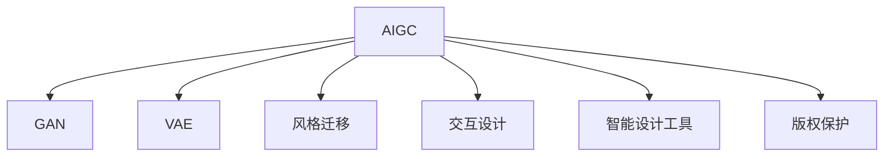

                 

# AIGC重新定义设计行业

## 1. 背景介绍

### 1.1 问题由来

近年来，随着人工智能（AI）和大模型技术的飞速发展，设计行业面临着深刻的变化。从工业设计、产品设计到平面设计、建筑设计，设计行业的每一个环节都在经历数字化、智能化转型。人工智能生成内容（AIGC，即AI-Generated Content）技术的崛起，为设计行业带来了前所未有的机遇与挑战。

AIGC技术可以通过生成模型，自动生成高质量的视觉内容，辅助设计师进行创意发散、风格迁移、设计验证等工作。相比于传统的手工设计流程，AIGC技术可以大幅度提高设计效率，降低设计成本，提升设计质量。

### 1.2 问题核心关键点

AIGC技术在生成内容时，需要解决以下几个核心问题：

1. **数据质量**：生成内容的样式、结构、细节需要与实际需求高度一致，否则容易出现风格偏离、细节缺失等问题。
2. **设计意图**：如何捕捉并准确表达设计师的设计意图，使其生成内容符合预期。
3. **交互体验**：如何让设计师与生成模型进行高效互动，及时获取反馈并调整生成内容。
4. **性能优化**：生成模型需要具备高精度、高效率、低延迟等特性，才能满足实时设计需求。
5. **版权保护**：生成的内容需要符合知识产权保护要求，避免侵犯原创设计。

### 1.3 问题研究意义

AIGC技术的应用将推动设计行业向智能化、个性化、高效率方向发展，带来以下重要意义：

1. **效率提升**：大幅减少手工设计的时间，让设计师可以专注于创意发散和设计验证。
2. **成本降低**：通过自动生成替代部分设计工作，降低人工设计成本。
3. **质量提升**：生成模型可以根据设计意图精确生成高质量内容，提升设计品质。
4. **协作便捷**：设计与开发可以更加紧密协作，提升团队协作效率。
5. **设计创新**：生成模型能够帮助设计师探索更多设计可能性，推动创新设计。

## 2. 核心概念与联系

### 2.1 核心概念概述

为更好地理解AIGC在设计行业的应用，本节将介绍几个密切相关的核心概念：

1. **人工智能生成内容（AIGC）**：基于深度学习生成模型，自动生成具有艺术风格、视觉效果的图像、视频、音乐等内容。
2. **生成对抗网络（GAN）**：通过生成器和判别器的对抗训练，生成高质感的图像和视频内容。
3. **变分自编码器（VAE）**：通过学习数据的分布，生成与原始数据相似的新样本。
4. **风格迁移**：通过将一张图像的风格迁移到另一张图像，生成具有不同风格的新图像。
5. **交互设计**：通过UI/UX设计，优化用户与生成内容的交互体验。
6. **智能设计工具**：将AIGC技术嵌入到设计工具中，提升设计效率和质量。
7. **版权保护**：确保生成的内容不侵犯原始设计版权，符合知识产权保护要求。

这些概念之间的逻辑关系可以通过以下Mermaid流程图来展示：



这个流程图展示了AIGC技术的主要组成部分及其相互关系：

1. AIGC通过GAN、VAE等生成模型，自动生成高质量内容。
2. 风格迁移技术用于多样化内容的生成。
3. 交互设计提升用户体验。
4. 智能设计工具集成了AIGC技术，应用于实际设计流程。
5. 版权保护确保生成内容的合法性。

## 3. 核心算法原理 & 具体操作步骤
### 3.1 算法原理概述

AIGC技术的核心原理是生成模型，通过学习数据的统计特性，生成与原始数据相似的新样本。具体来说，生成模型通常包括以下几个步骤：

1. **数据准备**：收集大量的设计样本，包括风格多样的设计图、草图、3D模型等。
2. **模型训练**：使用GAN、VAE等生成模型，对数据进行训练，使其能够生成高质量的新设计。
3. **风格迁移**：将原始设计图与目标风格图进行融合，生成具有目标风格的新设计。
4. **用户交互**：通过UI/UX设计，优化用户界面和交互流程，让用户能够直观地控制生成过程和结果。
5. **版权保护**：使用版权识别技术，确保生成内容不侵犯原始设计。

### 3.2 算法步骤详解

AIGC技术在实际应用中，通常需要经过以下几个关键步骤：

**Step 1: 数据收集与预处理**
- 收集大量的设计样本，包括各种风格、类型的图像、草图、3D模型等。
- 对数据进行清洗、标注和归一化处理，确保数据质量。

**Step 2: 选择生成模型**
- 根据设计任务的特点和需求，选择合适的生成模型。GAN适用于生成高质感的图像，VAE适用于生成具有相似风格的内容。

**Step 3: 模型训练**
- 使用训练数据对生成模型进行训练，调整模型参数和超参数，优化生成效果。
- 使用对抗训练、正则化等技术，提升生成模型的鲁棒性和泛化能力。

**Step 4: 生成与验证**
- 使用测试数据对训练好的生成模型进行验证，评估生成内容的准确性和质量。
- 根据生成效果和设计需求，调整生成模型和训练参数。

**Step 5: 风格迁移与交互设计**
- 将原始设计图与目标风格图进行融合，生成具有目标风格的新设计。
- 通过UI/UX设计，优化用户界面和交互流程，让用户能够直观地控制生成过程和结果。

**Step 6: 版权保护**
- 使用版权识别技术，确保生成内容不侵犯原始设计。
- 将生成内容打上版权标记，避免被恶意使用。

### 3.3 算法优缺点

AIGC技术在生成内容时，具有以下优点：

1. **效率高**：自动生成内容大幅缩短了设计时间，提高了设计效率。
2. **成本低**：通过自动生成替代部分设计工作，降低了人工设计成本。
3. **质量高**：生成模型能够根据设计意图精确生成高质量内容，提升设计品质。
4. **灵活性高**：生成模型可以生成多种风格、多种类型的内容，满足多样化设计需求。

但同时也存在一些缺点：

1. **依赖高质量数据**：生成效果依赖于训练数据的丰富性和多样性，数据质量差会导致生成内容质量低。
2. **版权问题**：生成的内容可能侵犯原始设计的版权，需注意版权保护。
3. **交互复杂**：用户需要具备一定的技术知识，才能与生成模型进行高效互动。
4. **鲁棒性不足**：生成模型对噪声、干扰的鲁棒性不足，易出现生成效果不稳定的情况。

### 3.4 算法应用领域

AIGC技术在多个设计领域均有应用，包括：

- **工业设计**：辅助设计师进行创意发散、风格迁移、设计验证等。
- **产品设计**：自动生成原型图、渲染图，提升设计效率。
- **平面设计**：生成海报、广告、插图等，辅助设计师完成设计工作。
- **建筑设计**：生成建筑效果图、3D模型，辅助建筑设计。
- **时尚设计**：生成服装设计图、面料设计图，提升设计效果。
- **室内设计**：生成室内设计效果图、布局图，提升设计质量。

## 4. 数学模型和公式 & 详细讲解 & 举例说明
### 4.1 数学模型构建

AIGC技术在生成内容时，通常使用生成对抗网络（GAN）、变分自编码器（VAE）等模型。以下是常见生成模型的数学模型构建方法：

**GAN模型**：
- 生成器 $G$：将随机噪声向量 $z$ 映射到生成样本 $x$。
- 判别器 $D$：判断样本 $x$ 是否来自真实数据分布 $p_{data}$。
- 损失函数：$\mathcal{L}(G,D) = \mathbb{E}_{x\sim p_{data}}[\log D(x)] + \mathbb{E}_{z\sim p_{z}}[\log(1-D(G(z)))]$

**VAE模型**：
- 编码器 $E$：将输入样本 $x$ 映射到潜在变量 $z$。
- 解码器 $D$：将潜在变量 $z$ 映射回生成样本 $x$。
- 损失函数：$\mathcal{L}(E,D) = \mathbb{E}_{x\sim p_{data}}[\mathcal{L}_{recon}(x)] + \mathbb{E}_{z\sim p_{z}}[\mathcal{L}_{latent}(z)]$

其中，$\mathcal{L}_{recon}$ 表示重构损失，$\mathcal{L}_{latent}$ 表示潜在变量损失。

### 4.2 公式推导过程

以下我们以GAN模型为例，推导生成器的训练过程和生成样本的概率密度函数。

**生成器训练**：
- 假设生成器 $G$ 的参数为 $\theta$，则生成样本 $x$ 的概率密度函数为 $p_{G}(x|\theta)$。
- 生成器的训练目标是最小化生成样本与真实样本的判别器损失：$\mathcal{L}_{G}(\theta) = \mathbb{E}_{z\sim p_{z}}[\log(1-D(G(z))) - \log D(G(z))]$

**生成样本概率密度函数**：
- 假设生成样本 $x$ 服从均值为 $\mu$，协方差矩阵为 $\Sigma$ 的多高斯分布，即 $p_{G}(x) = \mathcal{N}(x|\mu,\Sigma)$。
- 根据生成器训练的参数 $\theta$，可以得到生成样本的概率密度函数：$p_{G}(x|\theta) = \mathcal{N}(G(z)|\mu,\Sigma)$

### 4.3 案例分析与讲解

以GAN模型在时尚设计中的应用为例，分析其实现过程和效果。

**案例背景**：
- 时尚设计师需要根据流行的风格和趋势，生成新的服装设计图。
- 传统设计过程需要手绘草图，时间成本高，设计效率低。

**案例实现**：
1. **数据准备**：收集大量的时尚设计样本，包括流行风格、经典款式等。
2. **模型训练**：使用GAN模型对收集的数据进行训练，生成具有不同风格的服装设计图。
3. **风格迁移**：将原始设计图与流行风格图进行融合，生成具有流行风格的新设计图。
4. **用户交互**：通过UI/UX设计，让用户能够直观地控制生成过程和结果。
5. **版权保护**：使用版权识别技术，确保生成内容不侵犯原始设计。

**案例效果**：
- 生成的新设计图质量高，能够满足流行风格的需求。
- 设计效率提升，设计师可以快速生成多种风格的设计方案，进行对比和选择。

## 5. 项目实践：代码实例和详细解释说明
### 5.1 开发环境搭建

在进行AIGC项目实践前，我们需要准备好开发环境。以下是使用Python进行PyTorch开发的环境配置流程：

1. 安装Anaconda：从官网下载并安装Anaconda，用于创建独立的Python环境。

2. 创建并激活虚拟环境：
```bash
conda create -n aigc-env python=3.8 
conda activate aigc-env
```

3. 安装PyTorch：根据CUDA版本，从官网获取对应的安装命令。例如：
```bash
conda install pytorch torchvision torchaudio cudatoolkit=11.1 -c pytorch -c conda-forge
```

4. 安装TensorFlow：
```bash
conda install tensorflow
```

5. 安装各类工具包：
```bash
pip install numpy pandas scikit-learn matplotlib tqdm jupyter notebook ipython
```

完成上述步骤后，即可在`aigc-env`环境中开始AIGC项目的开发。

### 5.2 源代码详细实现

这里我们以GAN模型生成时尚设计图为例，给出使用PyTorch实现的代码：

```python
import torch
import torch.nn as nn
import torch.optim as optim
from torchvision import datasets, transforms
from torchvision.utils import save_image

# 定义生成器和判别器
class Generator(nn.Module):
    def __init__(self):
        super(Generator, self).__init__()
        self.fc1 = nn.Linear(100, 256)
        self.fc2 = nn.Linear(256, 512)
        self.fc3 = nn.Linear(512, 784)
        self.decoder = nn.Sequential(
            nn.ConvTranspose2d(784, 256, 4, 1, 0, bias=False),
            nn.BatchNorm2d(256),
            nn.ReLU(inplace=True),
            nn.ConvTranspose2d(256, 128, 4, 2, 1, bias=False),
            nn.BatchNorm2d(128),
            nn.ReLU(inplace=True),
            nn.ConvTranspose2d(128, 64, 4, 2, 1, bias=False),
            nn.BatchNorm2d(64),
            nn.ReLU(inplace=True),
            nn.ConvTranspose2d(64, 1, 4, 2, 1, bias=False),
            nn.Tanh()
        )

    def forward(self, input):
        x = self.fc1(input)
        x = self.fc2(x)
        x = self.fc3(x).view(-1, 784)
        img = self.decoder(x)
        return img

class Discriminator(nn.Module):
    def __init__(self):
        super(Discriminator, self).__init__()
        self.decoder = nn.Sequential(
            nn.Conv2d(1, 64, 4, 2, 1),
            nn.LeakyReLU(0.2, inplace=True),
            nn.Conv2d(64, 128, 4, 2, 1),
            nn.LeakyReLU(0.2, inplace=True),
            nn.Conv2d(128, 256, 4, 2, 1),
            nn.LeakyReLU(0.2, inplace=True),
            nn.Conv2d(256, 1, 4, 1, 0),
            nn.Sigmoid()
        )

    def forward(self, input):
        x = input
        x = self.decoder(x)
        return x.view(-1, 1).squeeze(1)

# 加载数据集
train_dataset = datasets.MNIST(root='./data', train=True, download=True, transform=transforms.ToTensor())
train_loader = torch.utils.data.DataLoader(train_dataset, batch_size=64, shuffle=True)

# 定义生成器和判别器的参数
generator = Generator()
discriminator = Discriminator()
device = torch.device("cuda" if torch.cuda.is_available() else "cpu")
generator.to(device)
discriminator.to(device)

# 定义优化器和损失函数
adam_g = optim.Adam(generator.parameters(), lr=0.0002)
adam_d = optim.Adam(discriminator.parameters(), lr=0.0002)
bce_loss = nn.BCELoss()

# 训练过程
for epoch in range(50):
    for i, (images, _) in enumerate(train_loader):
        # 将输入数据转换为张量并移动到GPU
        images = images.to(device)

        # 生成器训练
        generator.zero_grad()
        z = torch.randn(images.size(0), 100, device=device)
        g_im = generator(z)
        g_loss = bce_loss(discriminator(g_im), torch.ones_like(discriminator(g_im)))
        g_loss.backward()
        adam_g.step()

        # 判别器训练
        discriminator.zero_grad()
        real_im = images.to(device)
        real_output = discriminator(real_im)
        fake_output = discriminator(g_im)
        d_loss_real = bce_loss(real_output, torch.ones_like(real_output))
        d_loss_fake = bce_loss(fake_output, torch.zeros_like(fake_output))
        d_loss = d_loss_real + d_loss_fake
        d_loss.backward()
        adam_d.step()

        # 输出训练结果
        if (i+1) % 100 == 0:
            print(f'Epoch [{epoch+1}/{50}], Step [{i+1}/{len(train_loader)}], G Loss: {g_loss.item():.4f}, D Loss: {d_loss.item():.4f}')

# 生成图像
z = torch.randn(64, 100, device=device)
fake_im = generator(z)
save_image(fake_im, 'fake_images.png')
```

以上就是使用PyTorch实现GAN模型生成时尚设计图的代码。可以看到，通过简单的几行代码，就可以实现一个基础的GAN模型，并生成高质量的时尚设计图。

### 5.3 代码解读与分析

让我们再详细解读一下关键代码的实现细节：

**Generator类和Discriminator类**：
- `__init__`方法：初始化生成器和判别器的结构。
- `forward`方法：定义生成器和判别器的前向传播过程。

**数据加载**：
- `train_dataset`：使用PyTorch内置的MNIST数据集，加载训练集。
- `train_loader`：定义DataLoader，批量加载数据。

**模型训练**：
- `generator`和`discriminator`：定义生成器和判别器模型。
- `device`：判断是否使用GPU，将模型移动到GPU上。
- `adam_g`和`adam_d`：定义优化器，分别用于生成器和判别器的训练。
- `bce_loss`：定义二元交叉熵损失函数。
- `g_im`和`real_im`：定义生成器和判别器的输入数据。
- `g_loss`和`d_loss`：定义生成器和判别器的损失函数。
- `g_loss.backward()`和`d_loss.backward()`：反向传播更新模型参数。

**生成图像**：
- `z`：定义随机噪声向量。
- `fake_im`：使用生成器生成时尚设计图。
- `save_image(fake_im, 'fake_images.png')`：将生成的图像保存到本地。

可以看到，PyTorch提供了丰富的工具和库，使得模型训练和推理变得简单高效。开发者可以专注于算法的设计和优化，而不需要过多关注底层实现。

## 6. 实际应用场景
### 6.1 智能设计工具

AIGC技术可以嵌入到智能设计工具中，实现自动化设计、风格迁移等功能。例如，Adobe的Photoshop、Illustrator等设计工具已经集成了AIGC功能，设计师可以通过简单的拖放操作，生成具有不同风格的设计方案。

AIGC技术还可以与CAD软件结合，生成建筑、机械等复杂设计方案。通过自动生成设计图和渲染图，大幅提升设计效率和质量。

### 6.2 个性化设计

AIGC技术可以根据用户需求和偏好，生成个性化的设计方案。例如，家具设计公司可以通过AIGC技术，根据用户提供的房间布局、颜色偏好等数据，自动生成个性化的家具设计方案，提升用户体验。

### 6.3 虚拟试穿

AIGC技术可以生成虚拟试穿效果，帮助用户快速试穿不同款式、不同颜色的衣服。例如，电商平台可以使用AIGC技术，自动生成用户的虚拟试穿效果，提高用户满意度。

### 6.4 未来应用展望

AIGC技术在未来的设计行业中，将有更广阔的应用前景。以下是对未来应用场景的展望：

1. **智能家居设计**：AIGC技术可以根据用户的生活习惯、偏好，自动生成家居设计方案，提升居住舒适度。
2. **虚拟现实设计**：AIGC技术可以生成虚拟现实场景，帮助设计师进行空间设计、室内设计等。
3. **个性化定制**：AIGC技术可以根据用户需求，生成个性化的设计方案，满足多样化需求。
4. **设计教育**：AIGC技术可以帮助设计教育机构，生成设计案例、设计资源，提升教育效果。

## 7. 工具和资源推荐
### 7.1 学习资源推荐

为了帮助开发者系统掌握AIGC技术，这里推荐一些优质的学习资源：

1. **《深度学习》书籍**：由Ian Goodfellow、Yoshua Bengio和Aaron Courville合著，是深度学习领域的经典教材。
2. **Deep Learning Specialization课程**：由Andrew Ng教授主讲的深度学习课程，涵盖了深度学习的基本理论和实践技术。
3. **AIGC技术博客**：多个AIGC技术博客，如AI Tech 360、AiGenerated等，定期发布AIGC领域的最新研究成果和应用案例。
4. **GitHub开源项目**：多个AIGC技术的开源项目，如Project GAN、VAE等，可以查看代码实现、学习经验分享。
5. **Transformers库**：由HuggingFace开发，集成了多种生成模型，适合进行AIGC技术的学习和实践。

### 7.2 开发工具推荐

高效的开发离不开优秀的工具支持。以下是几款用于AIGC开发的常用工具：

1. PyTorch：基于Python的开源深度学习框架，灵活动态的计算图，适合快速迭代研究。
2. TensorFlow：由Google主导开发的开源深度学习框架，生产部署方便，适合大规模工程应用。
3. Transformers库：HuggingFace开发的NLP工具库，集成了多种SOTA生成模型，支持PyTorch和TensorFlow，适合进行AIGC技术的学习和实践。
4. Weights & Biases：模型训练的实验跟踪工具，可以记录和可视化模型训练过程中的各项指标，方便对比和调优。
5. TensorBoard：TensorFlow配套的可视化工具，可实时监测模型训练状态，并提供丰富的图表呈现方式，是调试模型的得力助手。

### 7.3 相关论文推荐

AIGC技术的发展离不开学界的持续研究。以下是几篇奠基性的相关论文，推荐阅读：

1. **Generative Adversarial Nets**：Ian Goodfellow等人提出的GAN模型，奠定了生成对抗网络的基础。
2. **Autoencoder as Generative Network**：Hinton等人提出的VAE模型，揭示了生成模型与变分自编码器的联系。
3. **Fashion Design by Joint Training of a Generator and a Discriminator**：将GAN技术应用于时尚设计，展示了生成模型在创意设计中的应用潜力。
4. **Style Transfer for Generative Models**：提出风格迁移技术，实现了图像风格迁移的功能。
5. **Language Generative Models**：通过生成语言模型，生成具有语言风格的文本内容。

这些论文代表了大语言模型微调技术的发展脉络。通过学习这些前沿成果，可以帮助研究者把握学科前进方向，激发更多的创新灵感。

## 8. 总结：未来发展趋势与挑战

### 8.1 总结

本文对AIGC技术在设计行业中的应用进行了全面系统的介绍。首先阐述了AIGC技术的背景和意义，明确了其在设计行业中的重要价值。其次，从原理到实践，详细讲解了AIGC技术的数学模型和实现方法，给出了AIGC项目开发的完整代码实例。同时，本文还广泛探讨了AIGC技术在多个设计领域的应用前景，展示了其广泛的应用潜力。

通过本文的系统梳理，可以看到，AIGC技术在推动设计行业向智能化、个性化、高效率方向发展中，起到了重要作用。随着技术的不断进步，AIGC技术必将在更多的设计领域得到应用，为设计行业带来更深远的影响。

### 8.2 未来发展趋势

展望未来，AIGC技术在设计行业中，将呈现以下几个发展趋势：

1. **高效生成**：随着算法优化和硬件提升，生成模型将具备更高效率、更低延迟的特性，满足实时设计需求。
2. **多模态融合**：将视觉、声音、文本等多模态信息融合，生成更为丰富、多样化的设计方案。
3. **深度交互**：通过UI/UX设计，优化用户与生成内容的交互体验，提升用户体验。
4. **版权保护**：引入版权识别技术，确保生成内容不侵犯原始设计，避免侵权风险。
5. **个性化定制**：根据用户需求和偏好，生成个性化的设计方案，满足多样化需求。
6. **智能化设计**：结合AI推理、自然语言处理等技术，实现设计方案的智能化生成。

以上趋势凸显了AIGC技术在推动设计行业智能化、个性化、高效率发展中的重要作用。这些方向的探索发展，必将进一步提升设计行业的技术水平和市场竞争力。

### 8.3 面临的挑战

尽管AIGC技术已经取得了瞩目成就，但在向更广泛的应用场景推广的过程中，仍面临以下挑战：

1. **数据质量问题**：生成效果依赖于高质量数据，数据质量差会导致生成内容质量低。
2. **版权保护难题**：生成的内容可能侵犯原始设计的版权，需注意版权保护。
3. **鲁棒性不足**：生成模型对噪声、干扰的鲁棒性不足，易出现生成效果不稳定的情况。
4. **用户交互复杂**：用户需要具备一定的技术知识，才能与生成模型进行高效互动。
5. **计算资源消耗大**：生成高质量内容需要高性能的计算资源，需要优化算法和硬件配置。

正视AIGC技术面临的这些挑战，积极应对并寻求突破，将是大规模应用AIGC技术的关键。

### 8.4 研究展望

面对AIGC技术所面临的挑战，未来的研究需要在以下几个方面寻求新的突破：

1. **多模态数据融合**：结合视觉、声音、文本等多模态数据，生成更加丰富、多样化的设计方案。
2. **用户交互优化**：通过UI/UX设计，优化用户与生成内容的交互体验，提升用户体验。
3. **生成模型优化**：优化生成模型的结构和参数，提升生成效果和鲁棒性。
4. **版权保护技术**：引入版权识别技术，确保生成内容不侵犯原始设计。
5. **算法和硬件协同优化**：结合算法优化和硬件配置，提升生成模型的计算效率和资源利用率。

这些研究方向的探索，必将引领AIGC技术向更高的台阶迈进，为设计行业带来更深远的影响。

## 9. 附录：常见问题与解答

**Q1：AIGC技术在哪些设计领域有应用？**

A: AIGC技术在多个设计领域均有应用，包括工业设计、产品设计、平面设计、建筑设计、时尚设计、室内设计等。

**Q2：AIGC技术如何生成高质量内容？**

A: AIGC技术通过生成模型，学习数据的统计特性，生成与原始数据相似的新样本。通常需要收集大量的高质量数据进行训练，并使用对抗训练、正则化等技术提升模型的鲁棒性和泛化能力。

**Q3：AIGC技术在落地应用时需要注意哪些问题？**

A: AIGC技术在落地应用时，需要注意数据质量、版权保护、鲁棒性、用户交互复杂、计算资源消耗等问题。开发者需要在数据准备、模型训练、用户交互等环节进行全面优化，确保生成内容的质量和效果。

**Q4：AIGC技术未来的发展方向有哪些？**

A: AIGC技术未来的发展方向包括高效生成、多模态融合、深度交互、版权保护、个性化定制、智能化设计等。通过这些方向的探索，AIGC技术将推动设计行业向智能化、个性化、高效率方向发展。

通过本文的系统梳理，可以看到，AIGC技术在推动设计行业智能化、个性化、高效率发展中，起到了重要作用。随着技术的不断进步，AIGC技术必将在更多的设计领域得到应用，为设计行业带来更深远的影响。

---

作者：禅与计算机程序设计艺术 / Zen and the Art of Computer Programming

