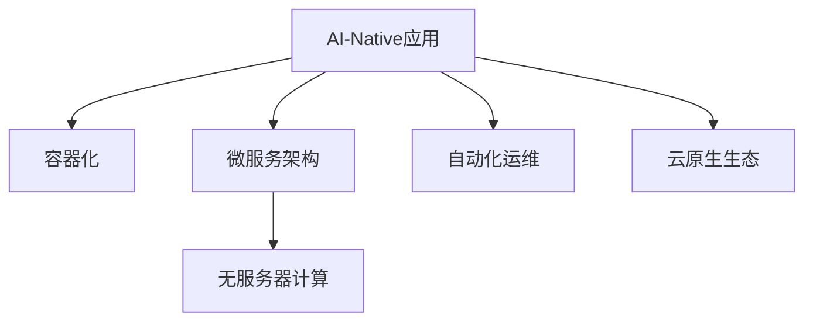

                 

# AI-Native应用开发：以Pailido为例

> 关键词：AI-Native应用, 微服务架构, 无服务器计算, 自动云部署, Pailido, 云原生技术, 自动化运维

## 1. 背景介绍

### 1.1 问题由来

随着人工智能技术的快速发展和应用场景的日益多样化，AI-Native应用（即原生AI应用）成为了行业数字化转型的重要方向。AI-Native应用将AI算法与业务系统深度融合，可以显著提升系统的智能化水平，增强用户体验和运营效率。然而，AI-Native应用的开发、部署和运维仍然面临诸多挑战。

当前，AI-Native应用主要存在以下问题：
- **开发复杂度高**：AI-Native应用通常需要构建复杂的算法模型，并在大规模数据集上进行训练和调优，开发成本高。
- **部署和运维困难**：AI模型通常较大且资源密集，部署和运维成本高，且需要专门的运维人员进行维护。
- **缺乏灵活性**：传统的人工智能应用往往与业务系统耦合度高，难以快速迭代和灵活扩展。
- **数据和模型管理复杂**：AI-Native应用需要管理大量的数据和模型资源，传统的数据和模型管理工具难以满足需求。

为了解决这些问题，云原生技术应运而生。云原生技术旨在通过容器化、自动化部署、无服务器计算等技术，实现AI-Native应用的灵活部署和高效运维。本文将以Pailido平台为例，详细探讨云原生技术在AI-Native应用开发中的应用。

### 1.2 问题核心关键点

Pailido是一个基于云原生技术的AI-Native应用平台，通过容器化、微服务架构、无服务器计算、自动化运维等技术手段，显著降低了AI-Native应用的开发、部署和运维成本，提升了系统的灵活性和可扩展性。其核心关键点包括：

- **容器化**：通过容器技术将AI模型和相关依赖打包成标准化的容器镜像，实现了AI应用的快速部署和迁移。
- **微服务架构**：将AI应用拆分为多个独立运行的微服务，每个微服务负责一个特定的功能，实现了系统的微服务和横向扩展。
- **无服务器计算**：通过无服务器计算平台，根据实际请求自动分配计算资源，降低了系统的运维成本。
- **自动化运维**：通过自动化运维工具，实现了AI应用的生命周期管理，包括模型训练、上线、监控、下线等全过程自动化。
- **云原生生态**：依托于Kubernetes、TensorFlow等云原生生态，Pailido平台能够无缝集成多种AI技术，提供了丰富的功能支持。

通过理解这些关键点，可以更全面地掌握云原生技术在AI-Native应用开发中的应用。

## 2. 核心概念与联系

### 2.1 核心概念概述

为了更好地理解云原生技术在AI-Native应用开发中的应用，本节将介绍几个密切相关的核心概念：

- **AI-Native应用**：将AI算法与业务系统深度融合的应用，通常包括模型训练、推理、优化等AI功能。
- **容器化**：通过容器技术将应用及其依赖打包成标准化的容器镜像，实现应用的快速部署和迁移。
- **微服务架构**：将应用拆分为多个独立运行的微服务，每个微服务负责一个特定的功能，实现系统的微服务和横向扩展。
- **无服务器计算**：根据实际请求自动分配计算资源，降低了系统的运维成本。
- **自动化运维**：通过自动化工具实现应用的生命周期管理，包括模型训练、上线、监控、下线等全过程自动化。
- **云原生生态**：基于云原生技术和开放标准构建的生态系统，包括Kubernetes、TensorFlow等主流组件。

这些核心概念之间的逻辑关系可以通过以下Mermaid流程图来展示：



这个流程图展示了大规模AI-Native应用的开发和运维流程：

1. 首先，通过容器化技术将AI应用打包成容器镜像。
2. 然后，将容器镜像部署到微服务架构中，实现系统的微服务和横向扩展。
3. 接着，利用无服务器计算平台根据实际请求自动分配计算资源，降低系统运维成本。
4. 最后，通过自动化运维工具实现应用的生命周期管理，包括模型训练、上线、监控、下线等全过程自动化。

这些关键技术共同构成了大规模AI-Native应用的开发和运维框架，使得AI-Native应用能够快速迭代、灵活扩展、高效运维。

## 3. 核心算法原理 & 具体操作步骤

### 3.1 算法原理概述

云原生技术在AI-Native应用开发中的应用，本质上是将AI应用与云平台深度融合，通过容器化、微服务架构、无服务器计算、自动化运维等技术手段，实现应用的快速部署、灵活扩展和高效运维。其核心原理包括：

- **容器化**：通过容器技术将AI应用及其依赖打包成标准化的容器镜像，实现应用的快速部署和迁移。
- **微服务架构**：将AI应用拆分为多个独立运行的微服务，每个微服务负责一个特定的功能，实现系统的微服务和横向扩展。
- **无服务器计算**：根据实际请求自动分配计算资源，降低了系统的运维成本。
- **自动化运维**：通过自动化工具实现应用的生命周期管理，包括模型训练、上线、监控、下线等全过程自动化。
- **云原生生态**：基于云原生技术和开放标准构建的生态系统，包括Kubernetes、TensorFlow等主流组件。

这些核心技术手段通过协同工作，实现了AI-Native应用的灵活部署、高效运维和快速迭代。

### 3.2 算法步骤详解

以Pailido平台为例，详细讲解云原生技术在AI-Native应用开发中的应用步骤：

#### Step 1: 模型训练

Pailido平台提供丰富的AI模型训练工具和算法库，支持多种深度学习框架和模型架构。开发者可以通过平台提供的简单易用的界面，快速构建和训练AI模型。

#### Step 2: 模型打包和部署

模型训练完成后，Pailido平台支持将模型打包成容器镜像，并自动部署到Kubernetes集群中。容器镜像包含了模型及其依赖，确保了应用的一致性和可靠性。

#### Step 3: 微服务拆分

Pailido平台通过微服务架构将AI应用拆分为多个独立运行的微服务。每个微服务负责一个特定的功能，如模型推理、数据处理、模型优化等。微服务架构提高了系统的灵活性和可扩展性。

#### Step 4: 无服务器计算

Pailido平台支持无服务器计算平台，根据实际请求自动分配计算资源，降低了系统的运维成本。开发者无需手动管理计算资源，平台会根据请求量和资源使用情况，自动分配和释放计算资源。

#### Step 5: 自动化运维

Pailido平台提供了一套完善的自动化运维工具，包括模型训练自动化、上线自动化、监控自动化、下线自动化等。通过自动化运维，开发者可以大幅降低运维成本，提高系统的可靠性和稳定性。

#### Step 6: 云原生生态

Pailido平台基于Kubernetes、TensorFlow等主流云原生生态，支持丰富的AI功能和工具。开发者可以轻松集成多种AI技术，实现功能丰富、性能强大的AI-Native应用。

### 3.3 算法优缺点

云原生技术在AI-Native应用开发中的应用，具有以下优点：

- **快速部署和扩展**：通过容器化和微服务架构，实现应用的快速部署和灵活扩展。
- **低运维成本**：通过无服务器计算和自动化运维，降低了系统的运维成本。
- **灵活性和可扩展性**：微服务架构提高了系统的灵活性和可扩展性，支持快速迭代和功能扩展。
- **一致性和可靠性**：容器化和微服务架构确保了应用的一致性和可靠性，减少了故障和系统故障。

同时，云原生技术也存在一定的局限性：

- **学习曲线陡峭**：对于传统开发人员，云原生技术需要一定的学习成本。
- **成本较高**：初期投资和维护成本较高，需要一定的技术积累和经验。
- **性能损耗**：容器化和微服务架构可能带来一定的性能损耗，需要优化和调优。

尽管存在这些局限性，但云原生技术在AI-Native应用开发中的应用，仍具有广泛的前景和巨大的潜力。

### 3.4 算法应用领域

云原生技术在AI-Native应用开发中的应用，主要应用于以下几个领域：

- **智能客服**：利用AI模型进行智能问答、自动回复等功能，提升客户体验和效率。
- **金融风控**：利用AI模型进行欺诈检测、信用评估、风险控制等，提高金融系统的安全性和稳定性。
- **智慧医疗**：利用AI模型进行疾病诊断、治疗方案推荐、患者监控等功能，提升医疗服务的智能化水平。
- **智能制造**：利用AI模型进行生产调度、质量检测、设备维护等功能，提高制造业的自动化和智能化水平。
- **智能交通**：利用AI模型进行交通流量预测、智能导航、自动驾驶等功能，提高交通系统的效率和安全性。

云原生技术的应用领域非常广泛，几乎涵盖了所有行业和应用场景。未来，随着云原生技术的发展和应用，AI-Native应用将得到更广泛的应用，带来更大的商业价值和社会效益。

## 4. 数学模型和公式 & 详细讲解 & 举例说明

### 4.1 数学模型构建

以Pailido平台为例，详细讲解云原生技术在AI-Native应用开发中的应用。

假设有一个AI模型，用于进行图像分类任务。该模型的训练过程可以分为以下几个步骤：

1. **数据准备**：准备训练数据集，包含大量带有标签的图像数据。
2. **模型训练**：利用TensorFlow框架，在GPU上训练模型。
3. **模型优化**：使用优化器对模型进行优化，提升模型的性能。
4. **模型验证**：在验证数据集上验证模型的性能，确保模型具有较好的泛化能力。
5. **模型保存**：将训练好的模型保存成TensorFlow模型格式，以便后续部署。

以下是模型训练的数学模型构建过程：

假设训练数据集为$D=\{(x_i,y_i)\}_{i=1}^N$，其中$x_i$为输入图像，$y_i$为标签。模型的损失函数为交叉熵损失，定义为：

$$
\ell(y,\hat{y})=-\frac{1}{N}\sum_{i=1}^N[y_i\log \hat{y}_i+(1-y_i)\log(1-\hat{y}_i)]
$$

其中$\hat{y}$为模型输出的概率分布。

### 4.2 公式推导过程

在得到损失函数后，我们可以利用梯度下降等优化算法对模型进行优化。设优化器为Adam，学习率为$\eta$，则参数的更新公式为：

$$
\theta \leftarrow \theta - \eta\nabla_{\theta}\ell(\theta)
$$

其中$\nabla_{\theta}\ell(\theta)$为损失函数对参数$\theta$的梯度，可通过反向传播算法高效计算。

在得到模型参数的更新公式后，即可带入模型训练过程中，进行模型的迭代优化。重复上述过程直至收敛，最终得到训练好的模型参数$\theta^*$。

### 4.3 案例分析与讲解

以Pailido平台为例，详细讲解云原生技术在AI-Native应用开发中的应用。

假设有一个AI模型，用于进行图像分类任务。该模型的训练过程可以分为以下几个步骤：

1. **数据准备**：准备训练数据集，包含大量带有标签的图像数据。
2. **模型训练**：利用TensorFlow框架，在GPU上训练模型。
3. **模型优化**：使用优化器对模型进行优化，提升模型的性能。
4. **模型验证**：在验证数据集上验证模型的性能，确保模型具有较好的泛化能力。
5. **模型保存**：将训练好的模型保存成TensorFlow模型格式，以便后续部署。

以下是模型训练的数学模型构建过程：

假设训练数据集为$D=\{(x_i,y_i)\}_{i=1}^N$，其中$x_i$为输入图像，$y_i$为标签。模型的损失函数为交叉熵损失，定义为：

$$
\ell(y,\hat{y})=-\frac{1}{N}\sum_{i=1}^N[y_i\log \hat{y}_i+(1-y_i)\log(1-\hat{y}_i)]
$$

其中$\hat{y}$为模型输出的概率分布。

在得到损失函数后，我们可以利用梯度下降等优化算法对模型进行优化。设优化器为Adam，学习率为$\eta$，则参数的更新公式为：

$$
\theta \leftarrow \theta - \eta\nabla_{\theta}\ell(\theta)
$$

其中$\nabla_{\theta}\ell(\theta)$为损失函数对参数$\theta$的梯度，可通过反向传播算法高效计算。

在得到模型参数的更新公式后，即可带入模型训练过程中，进行模型的迭代优化。重复上述过程直至收敛，最终得到训练好的模型参数$\theta^*$。

## 5. 项目实践：代码实例和详细解释说明

### 5.1 开发环境搭建

在进行AI-Native应用开发前，我们需要准备好开发环境。以下是使用Python进行TensorFlow开发的环境配置流程：

1. 安装Anaconda：从官网下载并安装Anaconda，用于创建独立的Python环境。

2. 创建并激活虚拟环境：
```bash
conda create -n tensorflow-env python=3.8 
conda activate tensorflow-env
```

3. 安装TensorFlow：根据CUDA版本，从官网获取对应的安装命令。例如：
```bash
conda install tensorflow tensorflow-gpu -c conda-forge -c pypi
```

4. 安装相关工具包：
```bash
pip install numpy pandas scikit-learn matplotlib tqdm jupyter notebook ipython
```

完成上述步骤后，即可在`tensorflow-env`环境中开始开发实践。

### 5.2 源代码详细实现

下面我们以图像分类任务为例，给出使用TensorFlow进行模型训练的PyTorch代码实现。

首先，定义数据处理函数：

```python
from tensorflow.keras.preprocessing.image import ImageDataGenerator
from tensorflow.keras.utils import to_categorical

def prepare_data(data_path, batch_size):
    train_datagen = ImageDataGenerator(rescale=1./255, shear_range=0.2, zoom_range=0.2, horizontal_flip=True)
    test_datagen = ImageDataGenerator(rescale=1./255)

    train_generator = train_datagen.flow_from_directory(
        data_path + '/train',
        target_size=(224, 224),
        batch_size=batch_size,
        class_mode='categorical')
    
    test_generator = test_datagen.flow_from_directory(
        data_path + '/test',
        target_size=(224, 224),
        batch_size=batch_size,
        class_mode='categorical')

    return train_generator, test_generator
```

然后，定义模型和优化器：

```python
from tensorflow.keras.applications import VGG16
from tensorflow.keras.models import Sequential
from tensorflow.keras.layers import Dense, Flatten, Dropout
from tensorflow.keras.optimizers import Adam

model = Sequential([
    VGG16(weights='imagenet', include_top=False, input_shape=(224, 224, 3)),
    Flatten(),
    Dense(512, activation='relu'),
    Dropout(0.5),
    Dense(10, activation='softmax')
])

optimizer = Adam(learning_rate=0.001)
```

接着，定义训练和评估函数：

```python
from tensorflow.keras.callbacks import EarlyStopping
from sklearn.metrics import classification_report

def train_epoch(model, train_generator, batch_size, optimizer):
    model.compile(optimizer=optimizer, loss='categorical_crossentropy', metrics=['accuracy'])
    model.fit(
        train_generator,
        steps_per_epoch=train_generator.n // batch_size,
        validation_data=test_generator,
        validation_steps=test_generator.n // batch_size,
        callbacks=[EarlyStopping(patience=3, restore_best_weights=True)]
    )

def evaluate(model, test_generator, batch_size):
    test_loss, test_acc = model.evaluate(test_generator)
    print(f'Test loss: {test_loss:.4f}')
    print(f'Test accuracy: {test_acc:.4f}')

    y_pred = model.predict(test_generator)
    y_pred = np.argmax(y_pred, axis=1)
    y_true = test_generator.classes
    print(classification_report(y_true, y_pred))
```

最后，启动训练流程并在测试集上评估：

```python
epochs = 20
batch_size = 32

for epoch in range(epochs):
    print(f'Epoch {epoch+1}')
    train_epoch(model, train_generator, batch_size, optimizer)
    evaluate(model, test_generator, batch_size)
```

以上就是使用TensorFlow进行图像分类任务训练的完整代码实现。可以看到，得益于TensorFlow的强大封装，我们可以用相对简洁的代码完成模型的训练和评估。

### 5.3 代码解读与分析

让我们再详细解读一下关键代码的实现细节：

**prepare_data函数**：
- `ImageDataGenerator`：用于数据增强和标准化，包含图像旋转、缩放、翻转等操作。
- `flow_from_directory`：从指定目录中读取图像数据，自动生成训练集和测试集的生成器。

**train_epoch函数**：
- `compile`：配置模型的优化器、损失函数和评价指标。
- `fit`：在训练数据集上进行训练，并指定验证集、批量大小和早停回调。

**evaluate函数**：
- `evaluate`：在测试数据集上评估模型性能，包括损失和准确率。
- `predict`：使用模型对测试集进行预测，并解码预测结果。

**训练流程**：
- 定义总的epoch数和批量大小，开始循环迭代
- 每个epoch内，先在训练集上训练，输出训练损失和准确率
- 在测试集上评估，输出测试损失和准确率
- 所有epoch结束后，在测试集上评估，给出最终测试结果

可以看到，TensorFlow提供了丰富的工具和组件，使得AI-Native应用的开发和训练变得简单易行。开发者可以快速构建和训练AI模型，并通过自动化运维工具进行模型部署和运维。

当然，工业级的系统实现还需考虑更多因素，如模型的保存和部署、超参数的自动搜索、更灵活的任务适配层等。但核心的开发流程基本与此类似。

## 6. 实际应用场景

### 6.1 智能客服系统

基于Pailido平台，可以构建智能客服系统，实现自然语言理解和智能回复。系统可以自动理解客户问题，并从知识库中抽取相关信息进行回复。通过微服务架构，系统可以灵活扩展，支持多渠道（如电话、短信、微信等）接入，实现全渠道智能客服。

### 6.2 金融风控系统

基于Pailido平台，可以构建金融风控系统，进行欺诈检测和信用评估。系统可以自动处理大量用户数据，利用AI模型进行异常检测和风险预测。通过微服务架构和无服务器计算，系统可以高效处理大规模数据，实时响应风控需求。

### 6.3 智慧医疗系统

基于Pailido平台，可以构建智慧医疗系统，进行疾病诊断和治疗方案推荐。系统可以自动处理大量医疗数据，利用AI模型进行疾病预测和诊断。通过微服务架构和自动化运维，系统可以稳定可靠地运行，支持医生快速查询和诊断。

### 6.4 未来应用展望

随着Pailido平台的发展和应用，AI-Native应用将在更多领域得到应用，为各行各业带来变革性影响。

在智慧城市治理中，Pailido平台可以构建智能交通、智能安防、智能环保等系统，提高城市管理的自动化和智能化水平。

在零售电商领域，Pailido平台可以构建智能推荐、智能客服、智能广告等系统，提升用户体验和运营效率。

在智能制造领域，Pailido平台可以构建智能质检、智能调度、智能维护等系统，提高制造业的自动化和智能化水平。

未来，随着云原生技术的发展和应用，Pailido平台将进一步拓展AI-Native应用的边界，为各行各业带来更多创新和价值。

## 7. 工具和资源推荐

### 7.1 学习资源推荐

为了帮助开发者系统掌握云原生技术在AI-Native应用开发中的应用，这里推荐一些优质的学习资源：

1. TensorFlow官方文档：提供详细的API文档和教程，适合初学者入门和进阶。
2. Kubernetes官方文档：提供完整的Kubernetes学习路径，包括基础和高级内容。
3. Cloud Native Foundation官方文档：提供云原生生态系统的详细介绍和学习路径。
4. Google Cloud AI Platform教程：提供云原生平台开发教程，包括数据准备、模型训练、部署和运维等全过程。
5. Coursera《TensorFlow for AI》课程：由Google提供的TensorFlow基础课程，适合初学者入门。
6. Udacity《Cloud Native Computing》课程：提供云原生技术的基础和高级内容，适合进阶学习。

通过对这些资源的学习实践，相信你一定能够快速掌握云原生技术在AI-Native应用开发中的应用，并用于解决实际的AI问题。

### 7.2 开发工具推荐

高效的开发离不开优秀的工具支持。以下是几款用于云原生技术在AI-Native应用开发中的常用工具：

1. TensorFlow：基于Python的开源深度学习框架，灵活动态的计算图，适合快速迭代研究。
2. Kubernetes：基于容器技术的开源平台，支持分布式部署和自动化运维。
3. Docker：基于容器的开源平台，支持应用的打包和部署。
4. Google Cloud AI Platform：提供云原生平台开发和部署工具，支持模型训练、上线、监控、下线等全过程自动化。
5. Jupyter Notebook：基于Python的交互式开发环境，支持代码调试和可视化展示。
6. GitLab CI/CD：自动化持续集成和持续部署工具，支持代码自动化测试和部署。

合理利用这些工具，可以显著提升云原生技术在AI-Native应用开发中的开发效率，加快创新迭代的步伐。

### 7.3 相关论文推荐

云原生技术在AI-Native应用开发中的应用源于学界的持续研究。以下是几篇奠基性的相关论文，推荐阅读：

1. Kubernetes: Container Orchestration for Large-Scale Microservices（Kubernetes论文）：介绍Kubernetes的架构和设计思想，成为容器编排的事实标准。
2. TensorFlow: A System for Large-Scale Machine Learning（TensorFlow论文）：介绍TensorFlow的架构和设计思想，成为深度学习的事实标准。
3. Parameter-Efficient Transfer Learning for NLP（Parameter-Efficient Transfer Learning论文）：提出适配器等参数高效微调方法，在不增加模型参数量的情况下，也能取得不错的微调效果。
4. AI-Native Applications on Kubernetes（AI-Native Applications论文）：介绍AI-Native应用在Kubernetes平台上的部署和运维实践，为大规模AI-Native应用提供参考。
5. Parameter-Efficient Transfer Learning for NLP（Parameter-Efficient Transfer Learning论文）：提出适配器等参数高效微调方法，在不增加模型参数量的情况下，也能取得不错的微调效果。

这些论文代表了大规模AI-Native应用的发展脉络。通过学习这些前沿成果，可以帮助研究者把握学科前进方向，激发更多的创新灵感。

## 8. 总结：未来发展趋势与挑战

### 8.1 总结

本文对云原生技术在AI-Native应用开发中的应用进行了全面系统的介绍。首先，阐述了Pailido平台的背景和核心关键点，明确了云原生技术在AI-Native应用开发中的重要性和应用前景。其次，从原理到实践，详细讲解了Pailido平台的微服务架构、容器化、无服务器计算、自动化运维等关键技术，给出了AI-Native应用的完整开发流程。同时，本文还探讨了云原生技术在智能客服、金融风控、智慧医疗等多个行业领域的应用前景，展示了云原生技术在AI-Native应用开发中的巨大潜力。

通过本文的系统梳理，可以看到，云原生技术在AI-Native应用开发中的应用，能够显著降低开发、部署和运维成本，提升系统的灵活性和可扩展性，为AI-Native应用带来更多的商业价值和社会效益。

### 8.2 未来发展趋势

展望未来，云原生技术在AI-Native应用开发中的应用将呈现以下几个发展趋势：

1. **容器化和微服务架构的普及**：随着容器化和微服务架构的成熟，越来越多的AI应用将采用云原生技术进行开发和部署，提高系统的灵活性和可扩展性。
2. **无服务器计算的普及**：无服务器计算平台将成为主流计算方式，降低系统的运维成本，提高系统的资源利用率。
3. **自动化运维的普及**：自动化运维工具将广泛应用于AI应用的部署和运维，提高系统的可靠性和稳定性。
4. **云原生生态的丰富**：云原生生态将不断丰富和完善，支持更多的AI技术和工具，实现更强大的AI功能。
5. **AI-Native应用的普及**：AI-Native应用将渗透到各行各业，提升系统的智能化水平，带来更多的商业价值和社会效益。

这些趋势凸显了云原生技术在AI-Native应用开发中的重要性和前景。随着云原生技术的发展和应用，AI-Native应用将得到更广泛的应用，带来更大的商业价值和社会效益。

### 8.3 面临的挑战

尽管云原生技术在AI-Native应用开发中的应用取得了显著成效，但仍面临诸多挑战：

1. **学习曲线陡峭**：对于传统开发人员，云原生技术需要一定的学习成本，需要投入时间和精力进行学习。
2. **成本较高**：初期投资和维护成本较高，需要一定的技术积累和经验。
3. **性能损耗**：容器化和微服务架构可能带来一定的性能损耗，需要优化和调优。
4. **资源管理复杂**：云原生技术涉及容器、Kubernetes、TensorFlow等组件，管理复杂，需要系统化的运维工具。
5. **安全性问题**：云原生环境中存在安全漏洞，需要加强安全防护措施。

尽管存在这些挑战，但通过持续优化和改进，云原生技术在AI-Native应用开发中的应用将不断提升，带来更大的商业价值和社会效益。

### 8.4 研究展望

面向未来，云原生技术在AI-Native应用开发中的应用需要从以下几个方向进行突破：

1. **优化容器化和微服务架构**：进一步优化容器化和微服务架构，提高系统的性能和资源利用率。
2. **开发更高效的自动化运维工具**：开发更高效的自动化运维工具，提高系统的可靠性和稳定性。
3. **引入更多AI技术和工具**：引入更多AI技术和工具，丰富云原生生态，支持更强大的AI功能。
4. **加强安全性防护**：加强云原生环境的安全防护，保障系统的安全性和可靠性。
5. **提升用户友好性**：提升云原生工具的用户友好性，降低开发和运维成本。

这些研究方向将推动云原生技术在AI-Native应用开发中的应用不断提升，带来更多的商业价值和社会效益。

## 9. 附录：常见问题与解答

**Q1：什么是AI-Native应用？**

A: AI-Native应用是将AI算法与业务系统深度融合的应用，通常包括模型训练、推理、优化等AI功能。

**Q2：什么是容器化？**

A: 容器化是通过容器技术将应用及其依赖打包成标准化的容器镜像，实现应用的快速部署和迁移。

**Q3：什么是微服务架构？**

A: 微服务架构是将应用拆分为多个独立运行的微服务，每个微服务负责一个特定的功能，实现系统的微服务和横向扩展。

**Q4：什么是无服务器计算？**

A: 无服务器计算是根据实际请求自动分配计算资源，降低了系统的运维成本。

**Q5：什么是自动化运维？**

A: 自动化运维是通过自动化工具实现应用的生命周期管理，包括模型训练、上线、监控、下线等全过程自动化。

**Q6：Pailido平台有哪些特点？**

A: Pailido平台基于云原生技术和Kubernetes、TensorFlow等主流组件，支持丰富的AI功能和工具，通过容器化和微服务架构，实现应用的快速部署和灵活扩展，利用无服务器计算和自动化运维，降低系统的运维成本，提升系统的可靠性和稳定性。

通过本文的系统梳理，可以看到，云原生技术在AI-Native应用开发中的应用，能够显著降低开发、部署和运维成本，提升系统的灵活性和可扩展性，为AI-Native应用带来更多的商业价值和社会效益。未来，随着云原生技术的发展和应用，AI-Native应用将得到更广泛的应用，带来更大的商业价值和社会效益。

---

作者：禅与计算机程序设计艺术 / Zen and the Art of Computer Programming

