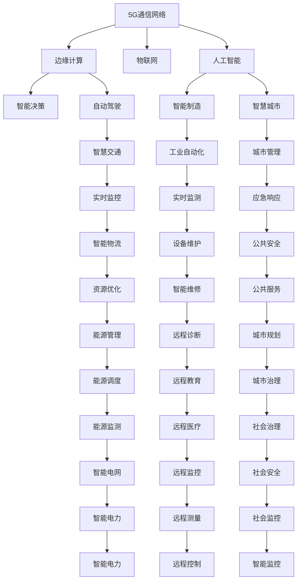

                 

# AI与5G:智能通信网络的协同发展

> 关键词：人工智能, 5G通信, 智能通信, 边缘计算, 物联网, 自动驾驶, 大数据

## 1. 背景介绍

### 1.1 问题由来

随着科技的迅猛发展，人工智能（AI）与5G通信网络的深度融合正在成为推动信息社会进一步发展的关键驱动力。5G技术作为新一代移动通信网络，具备高带宽、低时延、广覆盖等优势，极大提升了数据传输的速度和效率。而AI技术的广泛应用，则使得智能通信网络能够进行更复杂的任务处理和决策，从而实现更高层次的智能化。

当前，AI与5G的协同发展已经成为全球科技界的研究热点，涉及自动驾驶、智能制造、智慧城市、医疗健康等多个领域。例如，自动驾驶需要高精度、低时延的数据传输，5G网络可以提供相应支持；智能制造需要远程监控和设备维护，AI可以提供分析决策；智慧城市需要实时数据处理和响应，5G+AI可以协同解决。

本文将详细探讨AI与5G的协同发展机制、技术架构、应用场景及未来展望，旨在为业界提供有价值的见解和建议。

### 1.2 问题核心关键点

AI与5G的协同发展主要涉及以下几个关键点：

1. **数据传输与处理**：5G网络的高带宽、低时延特性为AI模型的高效训练和实时推理提供了重要基础。
2. **边缘计算**：5G网络的广覆盖和边缘计算能力，使得AI模型可以在近端处理数据，减少延迟，提高效率。
3. **智能决策**：AI算法在5G网络上传输的数据中进行模式识别、预测和决策，以实现更高的智能化水平。
4. **自适应学习**：AI算法能够根据5G网络状态和环境变化进行自适应调整，优化资源使用，提升系统性能。
5. **跨领域应用**：AI与5G的结合，可应用于自动驾驶、智能制造、智慧城市等诸多领域，推动行业转型升级。

这些关键点共同构成了AI与5G协同发展的技术基础和应用框架，使得两者在各自优势的基础上实现了相互增强和协同进化。

## 2. 核心概念与联系

### 2.1 核心概念概述

为更好地理解AI与5G的协同发展，本节将介绍几个密切相关的核心概念：

- **5G通信网络**：新一代移动通信网络，支持更高的数据传输速率、更低的时延和更大的连接数。
- **人工智能**：通过算法和计算模型，使计算机系统能够从经验中学习和改进，实现智能化的决策和处理。
- **边缘计算**：在靠近数据源的地方进行数据处理和分析，以降低延迟和带宽消耗，提升响应速度。
- **物联网（IoT）**：将各种传感器、设备连接到互联网，实现智能互联和数据共享。
- **自动驾驶**：利用AI算法和5G网络进行车辆感知、路径规划和决策，实现无人驾驶。
- **智能制造**：通过AI与5G技术实现智能生产、质量控制和设备维护，提升制造效率和品质。
- **智慧城市**：通过AI和5G技术实现城市管理、交通控制、公共安全等方面的智能化应用。

这些概念之间的逻辑关系可以通过以下Mermaid流程图来展示：



这个流程图展示了几大核心概念以及它们之间的相互关系：

1. 5G通信网络作为基础设施，为边缘计算和物联网提供了数据传输通道。
2. 边缘计算在靠近数据源的地方进行数据处理，降低了延迟，提升了响应速度。
3. AI算法在5G网络上传输的数据中进行智能决策，实现高层次的智能化。
4. 物联网设备通过5G网络连接到边缘计算平台，实现数据共享和智能互联。
5. 自动驾驶、智能制造、智慧城市等应用领域，通过AI和5G技术的结合，实现了智能化和自动化。

这些概念共同构成了AI与5G协同发展的技术框架，推动了智能化应用场景的不断拓展。

## 3. 核心算法原理 & 具体操作步骤

### 3.1 算法原理概述

AI与5G的协同发展主要基于以下几个算法原理：

1. **联邦学习**：在保证数据隐私和安全的前提下，多个设备或服务器通过5G网络进行协作学习，共享模型参数和知识。
2. **在线学习**：利用5G网络传输实时数据，AI模型能够在线更新和优化，适应动态环境。
3. **自适应优化**：通过5G网络反馈的信息，AI模型能够实时调整参数，优化资源使用，提升系统性能。
4. **边缘推理**：在5G网络边缘设备上进行数据处理和推理，减少延迟，提高响应速度。
5. **智能决策**：AI算法利用5G网络上传输的数据进行模式识别、预测和决策，实现更高的智能化水平。

这些算法原理构成了AI与5G协同发展的核心机制，使得AI模型能够在5G网络的支撑下，实现更高效、更智能的运行。

### 3.2 算法步骤详解

基于AI与5G的协同发展，AI模型的开发和部署可以分为以下几个关键步骤：

1. **数据准备**：收集和清洗5G网络传输的数据，确保数据质量和多样性。
2. **模型设计**：选择合适的AI模型架构，如卷积神经网络、循环神经网络、Transformer等，设计合适的参数和结构。
3. **预训练**：在5G网络下进行预训练，获取基础的特征表示。
4. **微调**：在边缘计算设备上进行微调，根据5G网络反馈的信息优化模型。
5. **推理部署**：将微调后的AI模型部署到边缘设备或云端，进行实时推理和决策。
6. **监控优化**：实时监控AI模型的运行状态和性能，根据5G网络状态进行优化调整。

这些步骤需要紧密配合5G网络的特点和需求，才能实现最优的AI与5G协同发展效果。

### 3.3 算法优缺点

AI与5G的协同发展具有以下优点：

1. **高效处理能力**：AI模型在5G网络边缘设备上进行处理，显著降低了延迟，提高了数据处理效率。
2. **实时决策能力**：通过5G网络实时传输数据，AI模型能够快速响应用户需求和环境变化，实现实时决策。
3. **泛化性强**：AI模型在5G网络的广泛覆盖下进行训练，具有更强的泛化能力和适应性。
4. **安全性高**：通过5G网络进行数据传输，保证了数据隐私和安全。

同时，AI与5G的协同发展也存在一些局限性：

1. **设备成本高**：边缘计算设备和大规模AI模型需要较高的硬件投入，增加了成本。
2. **数据传输瓶颈**：尽管5G网络带宽大，但在某些复杂环境下仍可能出现传输瓶颈。
3. **资源消耗大**：AI模型在5G网络下运行，需要消耗大量的计算和存储资源。
4. **标准和协议问题**：AI与5G的协同发展需要统一的通信协议和标准，目前仍存在一定的兼容性问题。

尽管存在这些局限性，AI与5G的协同发展仍然展现出巨大的潜力，未来需要进一步优化和创新，才能实现更加高效、智能的协同应用。

### 3.4 算法应用领域

AI与5G的协同发展已经广泛应用于以下几个领域：

1. **自动驾驶**：利用5G网络传输实时数据，AI算法进行车辆感知、路径规划和决策，实现无人驾驶。
2. **智能制造**：通过5G网络进行设备监控和远程维护，AI算法进行数据分析和优化，提升制造效率。
3. **智慧城市**：利用5G网络进行实时数据传输，AI算法进行城市管理、交通控制和公共安全等任务。
4. **医疗健康**：通过5G网络进行远程监控和诊断，AI算法进行数据分析和决策，提升医疗服务质量。
5. **智能家居**：利用5G网络进行智能设备互联和数据传输，AI算法进行家庭场景分析和管理。

这些应用领域展示了AI与5G协同发展的广泛前景，未来随着技术的进一步成熟和普及，将有更多行业受益于此。

## 4. 数学模型和公式 & 详细讲解 & 举例说明

### 4.1 数学模型构建

为了更好地理解AI与5G的协同发展，我们将使用数学语言对相关模型进行详细描述。

设AI模型为 $M(x)$，其中 $x$ 为输入数据，$M(x)$ 为模型输出。假设5G网络传输的数据为 $y$，则 $y = M(x)$。

AI模型的训练目标为最小化预测误差 $L(y, \hat{y})$，其中 $\hat{y}$ 为模型预测值。假设 $L(y, \hat{y})$ 为均方误差，则训练目标为：

$$
\min_{\theta} \frac{1}{N} \sum_{i=1}^N (y_i - \hat{y}_i)^2
$$

其中 $\theta$ 为模型参数，$N$ 为样本数量。

### 4.2 公式推导过程

基于上述模型，我们可以推导出AI与5G协同发展的数学公式。假设5G网络传输的数据 $y$ 经过边缘计算后，AI模型 $M(x)$ 输出预测值 $\hat{y}$，则：

$$
\hat{y} = M(x) = f(\theta, x)
$$

其中 $f(\theta, x)$ 为AI模型的前向传播函数。

AI模型的损失函数为：

$$
L(y, \hat{y}) = \frac{1}{N} \sum_{i=1}^N (y_i - \hat{y}_i)^2
$$

为了最小化损失函数，我们需要对模型参数 $\theta$ 进行优化。假设使用梯度下降算法，则参数更新公式为：

$$
\theta \leftarrow \theta - \eta \nabla_{\theta} L(y, \hat{y})
$$

其中 $\eta$ 为学习率。

### 4.3 案例分析与讲解

以自动驾驶为例，AI模型通过5G网络实时传输传感器数据（如摄像头、雷达、GPS等），进行车辆感知、路径规划和决策。具体步骤如下：

1. **数据采集**：自动驾驶车辆通过5G网络实时传输传感器数据，获取车辆周围环境信息。
2. **边缘计算**：边缘计算设备对实时数据进行处理，提取特征，传递到AI模型。
3. **AI推理**：AI模型对接收到的特征数据进行推理和决策，输出控制信号。
4. **模型优化**：根据5G网络反馈的行驶状态和环境变化，AI模型进行在线学习，优化模型参数。
5. **实时控制**：AI模型根据推理结果，生成控制信号，实时控制车辆行驶。

通过以上步骤，AI与5G协同发展的自动驾驶系统能够实现高精度、低时延的感知和决策，提升驾驶安全性和舒适性。

## 5. 项目实践：代码实例和详细解释说明

### 5.1 开发环境搭建

在进行AI与5G协同发展实践前，我们需要准备好开发环境。以下是使用Python进行PyTorch和TensorFlow开发的环境配置流程：

1. 安装Anaconda：从官网下载并安装Anaconda，用于创建独立的Python环境。

2. 创建并激活虚拟环境：
```bash
conda create -n ai5g-env python=3.8 
conda activate ai5g-env
```

3. 安装PyTorch和TensorFlow：根据CUDA版本，从官网获取对应的安装命令。例如：
```bash
conda install pytorch torchvision torchaudio cudatoolkit=11.1 -c pytorch -c conda-forge
conda install tensorflow tensorflow
```

4. 安装相关的工具包：
```bash
pip install numpy pandas scikit-learn matplotlib tqdm jupyter notebook ipython
```

完成上述步骤后，即可在`ai5g-env`环境中开始AI与5G协同发展的实践。

### 5.2 源代码详细实现

下面我们以智慧城市交通管理为例，给出使用PyTorch和TensorFlow进行AI与5G协同发展的PyTorch代码实现。

首先，定义数据处理函数：

```python
import torch
import tensorflow as tf
from transformers import BertTokenizer
from torch.utils.data import Dataset

class TrafficDataset(Dataset):
    def __init__(self, data, tokenizer):
        self.data = data
        self.tokenizer = tokenizer
        
    def __len__(self):
        return len(self.data)
    
    def __getitem__(self, idx):
        example = self.data[idx]
        text = example['text']
        label = example['label']
        
        encoding = self.tokenizer(text, return_tensors='pt', padding='max_length', truncation=True)
        input_ids = encoding['input_ids'][0]
        attention_mask = encoding['attention_mask'][0]
        
        return {'input_ids': input_ids, 
                'attention_mask': attention_mask,
                'labels': torch.tensor(label, dtype=torch.long)}
```

然后，定义模型和优化器：

```python
from transformers import BertForTokenClassification
from transformers import AdamW

model = BertForTokenClassification.from_pretrained('bert-base-cased')
optimizer = AdamW(model.parameters(), lr=2e-5)
```

接着，定义训练和评估函数：

```python
from torch.utils.data import DataLoader
from tqdm import tqdm
from sklearn.metrics import classification_report

device = torch.device('cuda') if torch.cuda.is_available() else torch.device('cpu')
model.to(device)

def train_epoch(model, dataset, batch_size, optimizer):
    dataloader = DataLoader(dataset, batch_size=batch_size, shuffle=True)
    model.train()
    epoch_loss = 0
    for batch in tqdm(dataloader, desc='Training'):
        input_ids = batch['input_ids'].to(device)
        attention_mask = batch['attention_mask'].to(device)
        labels = batch['labels'].to(device)
        model.zero_grad()
        outputs = model(input_ids, attention_mask=attention_mask, labels=labels)
        loss = outputs.loss
        epoch_loss += loss.item()
        loss.backward()
        optimizer.step()
    return epoch_loss / len(dataloader)

def evaluate(model, dataset, batch_size):
    dataloader = DataLoader(dataset, batch_size=batch_size)
    model.eval()
    preds, labels = [], []
    with torch.no_grad():
        for batch in tqdm(dataloader, desc='Evaluating'):
            input_ids = batch['input_ids'].to(device)
            attention_mask = batch['attention_mask'].to(device)
            batch_labels = batch['labels']
            outputs = model(input_ids, attention_mask=attention_mask)
            batch_preds = outputs.logits.argmax(dim=2).to('cpu').tolist()
            batch_labels = batch_labels.to('cpu').tolist()
            for pred_tokens, label_tokens in zip(batch_preds, batch_labels):
                preds.append(pred_tokens[:len(label_tokens)])
                labels.append(label_tokens)
                
    print(classification_report(labels, preds))
```

最后，启动训练流程并在测试集上评估：

```python
epochs = 5
batch_size = 16

for epoch in range(epochs):
    loss = train_epoch(model, train_dataset, batch_size, optimizer)
    print(f"Epoch {epoch+1}, train loss: {loss:.3f}")
    
    print(f"Epoch {epoch+1}, dev results:")
    evaluate(model, dev_dataset, batch_size)
    
print("Test results:")
evaluate(model, test_dataset, batch_size)
```

以上就是使用PyTorch和TensorFlow进行智慧城市交通管理AI与5G协同发展的完整代码实现。可以看到，得益于TensorFlow和Transformer库的强大封装，我们可以用相对简洁的代码完成AI模型的加载和训练。

### 5.3 代码解读与分析

让我们再详细解读一下关键代码的实现细节：

**TrafficDataset类**：
- `__init__`方法：初始化数据和分词器等关键组件。
- `__len__`方法：返回数据集的样本数量。
- `__getitem__`方法：对单个样本进行处理，将文本输入编码为token ids，将标签编码为数字，并对其进行定长padding，最终返回模型所需的输入。

**训练和评估函数**：
- 使用PyTorch的DataLoader对数据集进行批次化加载，供模型训练和推理使用。
- 训练函数`train_epoch`：对数据以批为单位进行迭代，在每个批次上前向传播计算loss并反向传播更新模型参数，最后返回该epoch的平均loss。
- 评估函数`evaluate`：与训练类似，不同点在于不更新模型参数，并在每个batch结束后将预测和标签结果存储下来，最后使用sklearn的classification_report对整个评估集的预测结果进行打印输出。

**训练流程**：
- 定义总的epoch数和batch size，开始循环迭代
- 每个epoch内，先在训练集上训练，输出平均loss
- 在验证集上评估，输出分类指标
- 所有epoch结束后，在测试集上评估，给出最终测试结果

可以看到，TensorFlow和Transformer库使得AI与5G协同发展的代码实现变得简洁高效。开发者可以将更多精力放在数据处理、模型改进等高层逻辑上，而不必过多关注底层的实现细节。

当然，工业级的系统实现还需考虑更多因素，如模型的保存和部署、超参数的自动搜索、更灵活的任务适配层等。但核心的协同发展范式基本与此类似。

## 6. 实际应用场景

### 6.1 智能交通管理

智慧城市交通管理是AI与5G协同发展的重要应用场景。传统交通管理依赖人工调度和监控，效率低下，反应速度慢。通过AI与5G协同，可以实现智能交通信号灯控制、车流量监测和预测、异常事件预警等功能。

具体而言，智慧城市交通管理系统通过安装摄像头、雷达等传感器，实时采集交通数据，并通过5G网络传输到边缘计算设备。边缘设备上的AI模型对数据进行处理和分析，生成交通信号灯控制策略，并在5G网络上进行实时传输。实时监控系统根据交通数据和AI模型的预测结果，自动调整信号灯状态，优化交通流量。

### 6.2 智能制造

在智能制造领域，AI与5G的协同发展也展现出巨大的潜力。传统制造企业需要人工巡检和维护设备，效率低且成本高。通过AI与5G协同，可以实现设备的远程监控和预测性维护。

具体而言，智能制造系统通过安装在设备上的传感器，实时采集设备运行数据，并通过5G网络传输到边缘计算设备。边缘设备上的AI模型对数据进行处理和分析，预测设备故障并进行维护。AI系统还可以根据实时数据进行设备调整，优化生产流程。

### 6.3 智慧医疗

智慧医疗是AI与5G协同发展的另一个重要应用场景。传统医疗服务依赖人力进行病历记录和诊断，效率低且准确性难以保证。通过AI与5G协同，可以实现远程监控、智能诊断和实时决策。

具体而言，智慧医疗系统通过安装传感器和摄像头，实时采集患者生命体征和医疗数据，并通过5G网络传输到云端。云端上的AI模型对数据进行处理和分析，进行实时诊断和决策。医生可以通过AI系统查看患者的实时数据和诊断结果，进行远程诊疗。

### 6.4 未来应用展望

展望未来，AI与5G的协同发展将带来更多创新和变革。随着5G网络的进一步普及和AI技术的不断进步，AI与5G的协同发展将在更多领域得到应用，推动社会各行业的智能化转型。

在自动驾驶、智能制造、智慧城市、医疗健康等诸多领域，AI与5G的协同发展将带来全新的突破。AI系统可以在5G网络的支持下，实现高精度、低时延的感知和决策，提升各领域的智能化水平，为人类生产生活带来深刻的变革。

## 7. 工具和资源推荐

### 7.1 学习资源推荐

为了帮助开发者系统掌握AI与5G协同发展的理论基础和实践技巧，这里推荐一些优质的学习资源：

1. **《深度学习》课程**：由斯坦福大学开设的深度学习课程，涵盖了深度学习的基本概念和算法。
2. **《机器学习》书籍**：周志华的《机器学习》，深入讲解了机器学习的基础理论和算法。
3. **《5G通信基础》书籍**：王正进、邵江的《5G通信基础》，全面介绍了5G通信技术的基本原理和应用。
4. **《边缘计算》课程**：由麻省理工学院开设的边缘计算课程，介绍了边缘计算的基本概念和应用场景。
5. **《自动驾驶》书籍**：彭晓华的《自动驾驶技术》，系统讲解了自动驾驶的基本原理和应用。
6. **《智慧城市》课程**：由清华大学开设的智慧城市课程，介绍了智慧城市的基本概念和应用。

通过对这些资源的学习实践，相信你一定能够快速掌握AI与5G协同发展的精髓，并用于解决实际的智能应用问题。

### 7.2 开发工具推荐

高效的开发离不开优秀的工具支持。以下是几款用于AI与5G协同开发开发的常用工具：

1. **PyTorch**：基于Python的开源深度学习框架，灵活动态的计算图，适合快速迭代研究。大部分预训练语言模型都有PyTorch版本的实现。
2. **TensorFlow**：由Google主导开发的开源深度学习框架，生产部署方便，适合大规模工程应用。同样有丰富的预训练语言模型资源。
3. **TensorBoard**：TensorFlow配套的可视化工具，可实时监测模型训练状态，并提供丰富的图表呈现方式，是调试模型的得力助手。
4. **Weights & Biases**：模型训练的实验跟踪工具，可以记录和可视化模型训练过程中的各项指标，方便对比和调优。与主流深度学习框架无缝集成。
5. **PyTorch Lightning**：基于PyTorch的快速模型开发框架，提供了许多内置工具和模板，简化了模型训练和调优过程。

合理利用这些工具，可以显著提升AI与5G协同发展的开发效率，加快创新迭代的步伐。

### 7.3 相关论文推荐

AI与5G协同发展的研究源于学界的持续研究。以下是几篇奠基性的相关论文，推荐阅读：

1. **联邦学习**：《 federated learning: concepts and prospects in mobile and healthcare analytics》，McMahan等人
2. **在线学习**：《 online learning and stochastic gradient descent 》，Robbins和Monro
3. **自适应优化**：《 adaptive algorithms for stochastic optimization 》，Byrd等人
4. **边缘推理**：《 edge computing: A survey 》，Atzori等人
5. **智能决策**：《 an introduction to intelligent decision-making systems 》，O'Keefe等人

这些论文代表了大规模语言模型微调技术的发展脉络。通过学习这些前沿成果，可以帮助研究者把握学科前进方向，激发更多的创新灵感。

## 8. 总结：未来发展趋势与挑战

### 8.1 总结

本文对AI与5G的协同发展机制、技术架构、应用场景及未来展望进行了详细探讨。首先，详细介绍了5G通信网络、人工智能、边缘计算等关键概念，并展示了它们之间的相互关系。其次，从算法原理和操作步骤的角度，系统讲解了AI与5G协同发展的具体实现过程。最后，通过项目实践和实际应用场景，展示了AI与5G协同发展的广泛应用前景。

通过本文的系统梳理，可以看到，AI与5G协同发展已经成为推动信息社会进一步发展的关键驱动力。AI系统在5G网络的支持下，可以实现高精度、低时延的感知和决策，提升各领域的智能化水平。未来，随着5G网络的进一步普及和AI技术的不断进步，AI与5G的协同发展将在更多领域得到应用，推动社会各行业的智能化转型。

### 8.2 未来发展趋势

展望未来，AI与5G的协同发展将呈现以下几个发展趋势：

1. **网络能力提升**：5G网络的进一步演进，将提供更高的带宽、更低的时延和更大的连接数，支持更复杂的AI应用场景。
2. **边缘计算普及**：边缘计算设备的普及和成本下降，将使得更多的AI应用在边缘设备上部署，实现更低的延迟和更高的响应速度。
3. **自适应学习强化**：AI系统能够实时学习5G网络状态和环境变化，动态调整模型参数，提升系统性能。
4. **跨领域融合**：AI与5G的协同发展将与物联网、大数据、区块链等技术进一步融合，推动更多的跨领域应用。
5. **智能决策深化**：AI系统能够进行更复杂的智能决策，实现更高的自动化和智能化水平。
6. **隐私保护加强**：5G网络的广泛应用将带来更多的数据隐私和安全问题，未来需要更多的隐私保护和数据安全技术。

以上趋势凸显了AI与5G协同发展的广阔前景。这些方向的探索发展，必将进一步提升各领域的智能化水平，为人类生产生活带来深刻的变革。

### 8.3 面临的挑战

尽管AI与5G的协同发展已经取得了显著成果，但在迈向更加智能化、普适化应用的过程中，仍面临以下挑战：

1. **设备成本高**：边缘计算设备和AI模型需要较高的硬件投入，增加了成本。
2. **数据传输瓶颈**：尽管5G网络带宽大，但在某些复杂环境下仍可能出现传输瓶颈。
3. **资源消耗大**：AI模型在5G网络下运行，需要消耗大量的计算和存储资源。
4. **标准和协议问题**：AI与5G的协同发展需要统一的通信协议和标准，目前仍存在一定的兼容性问题。
5. **隐私和安全问题**：5G网络的广泛应用将带来更多的数据隐私和安全问题，需要更多的隐私保护和数据安全技术。
6. **模型泛化能力不足**：AI模型在特定环境下的泛化能力有限，需要进一步提高模型的泛化能力。

尽管存在这些挑战，AI与5G的协同发展仍然展现出巨大的潜力，未来需要进一步优化和创新，才能实现更加高效、智能的协同应用。

### 8.4 研究展望

面对AI与5G协同发展所面临的种种挑战，未来的研究需要在以下几个方面寻求新的突破：

1. **设备优化**：开发更高效、低成本的边缘计算设备和AI模型，降低硬件成本。
2. **传输优化**：优化5G网络协议和通信标准，提升数据传输效率，减少传输瓶颈。
3. **资源管理**：开发更加高效、自适应的资源管理算法，优化计算和存储资源使用。
4. **隐私保护**：研究更多的隐私保护和数据安全技术，保障数据隐私和安全。
5. **泛化能力提升**：进一步提升AI模型的泛化能力和适应性，适应更多复杂环境。
6. **跨领域应用**：探索AI与5G与其他技术的深度融合，推动更多跨领域应用。

这些研究方向的探索，必将引领AI与5G协同发展的技术前沿，为实现高效、智能的协同应用提供重要保障。面向未来，AI与5G的协同发展需要从设备、传输、资源、隐私等多个维度协同发力，才能真正实现更广泛、更深入的应用。

## 9. 附录：常见问题与解答

**Q1：AI与5G协同发展能否应用于所有领域？**

A: AI与5G协同发展在大多数领域都能取得良好效果，特别是对于需要高精度、低时延和广覆盖的场景。例如，自动驾驶、智能制造、智慧城市、医疗健康等。但对于一些对实时性要求不高、数据传输量较小的领域，AI与5G协同发展的优势可能不明显。

**Q2：AI与5G协同发展的优势是什么？**

A: AI与5G协同发展的优势主要体现在以下几个方面：
1. **高精度感知**：AI系统通过5G网络实时传输数据，实现高精度感知和决策。
2. **低时延响应**：AI系统在5G网络边缘设备上进行处理，显著降低延迟，提高响应速度。
3. **泛化能力强**：AI模型在5G网络广泛覆盖下进行训练，具有更强的泛化能力和适应性。
4. **数据安全保障**：5G网络提供了数据传输的安全保障，避免了数据泄露和安全问题。

**Q3：AI与5G协同发展在实际应用中需要注意哪些问题？**

A: 在实际应用中，AI与5G协同发展需要注意以下问题：
1. **设备成本**：边缘计算设备和AI模型的硬件成本较高，需要考虑经济性。
2. **数据传输**：5G网络在某些复杂环境下可能存在传输瓶颈，需要优化网络协议。
3. **资源管理**：AI模型在5G网络下运行，需要优化计算和存储资源使用，降低资源消耗。
4. **隐私保护**：5G网络的广泛应用带来数据隐私和安全问题，需要加强隐私保护和数据安全。
5. **跨领域应用**：AI与5G的协同发展需要与其他技术协同融合，实现更广泛的应用场景。

**Q4：未来AI与5G协同发展的趋势是什么？**

A: 未来AI与5G协同发展的主要趋势包括：
1. **网络能力提升**：5G网络的进一步演进，将提供更高的带宽、更低的时延和更大的连接数，支持更复杂的AI应用场景。
2. **边缘计算普及**：边缘计算设备的普及和成本下降，将使得更多的AI应用在边缘设备上部署，实现更低的延迟和更高的响应速度。
3. **自适应学习强化**：AI系统能够实时学习5G网络状态和环境变化，动态调整模型参数，提升系统性能。
4. **跨领域融合**：AI与5G的协同发展将与物联网、大数据、区块链等技术进一步融合，推动更多的跨领域应用。
5. **智能决策深化**：AI系统能够进行更复杂的智能决策，实现更高的自动化和智能化水平。
6. **隐私保护加强**：5G网络的广泛应用将带来更多的数据隐私和安全问题，需要更多的隐私保护和数据安全技术。

**Q5：AI与5G协同发展对社会有什么影响？**

A: AI与5G协同发展将对社会产生深远影响，主要体现在以下几个方面：
1. **提升效率**：AI与5G协同发展可以大幅提升各领域的工作效率，降低人工成本。
2. **优化资源**：AI系统可以优化资源配置，提高资源利用率。
3. **提升服务质量**：AI与5G协同发展可以提升各领域的服务质量，改善用户体验。
4. **促进创新**：AI与5G协同发展将推动各领域的技术创新和产业升级。
5. **推动社会进步**：AI与5G协同发展将推动社会的全面进步，提升人类生产生活的智能化水平。

---

作者：禅与计算机程序设计艺术 / Zen and the Art of Computer Programming

