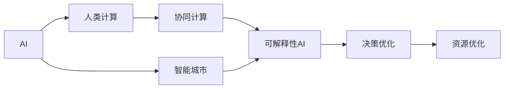

                 

# AI与人类计算：打造可持续发展的城市

## 1. 背景介绍

### 1.1 问题由来
随着城市化进程的加速，智能城市建设已成为全球各地政府和企业关注的重点。智能城市不仅仅依赖于硬件设施的智能升级，还需要依托先进的软件和数据平台，实现各类城市功能的智能化管理。AI技术以其强大的数据处理和决策能力，为智能城市的建设提供了新思路。

近年来，AI在智能城市中的应用已经取得显著进展，例如通过智能交通、智慧环保、安全监控等领域，实现了城市运行效率的显著提升和居民生活质量的改善。然而，这些技术往往依赖于海量数据和复杂的计算，带来了资源和能耗的巨大消耗，难以持续支持大规模的智能城市建设。

与此同时，随着AI技术的不断发展，它也逐渐面临环境、伦理、法律等新的挑战，亟需找到可持续的发展路径。如何在资源有限的情况下，构建高效、环保、安全的智能城市，成为当下亟需解决的问题。

### 1.2 问题核心关键点
为了解决上述问题，本文将从人类计算的角度，探讨AI技术在智能城市建设中的作用，并提出基于人类计算的AI与城市协同发展的解决方案。具体来说，本文将关注以下几个关键点：
1. 如何利用AI技术提升城市管理效率和决策水平。
2. 如何在计算资源有限的情况下，实现AI技术的可持续应用。
3. 如何在AI技术开发和应用中，融入人类的智慧和经验。

## 2. 核心概念与联系

### 2.1 核心概念概述

本节将介绍几个密切相关的核心概念，帮助读者理解智能城市中的AI与人类计算的联系。

- **AI（人工智能）**：指通过模拟人类智能行为，实现信息处理、数据分析、智能决策等功能的计算机技术。
- **智能城市**：指利用信息通信技术（ICT），将城市运行、管理、服务等方面的智能化水平提升到新高度，实现城市运行的全面优化和可持续性。
- **人类计算**：指利用人类的智慧和经验，通过合理分配计算资源，最大化利用AI技术的优势，同时减少其资源消耗。
- **协同计算**：指在AI系统设计中融入人类智慧和经验，实现人机协同，提高系统智能化水平和决策可靠性。
- **可解释性AI**：指能够提供清晰的决策逻辑和过程解释的AI系统，有助于提升AI系统的透明度和可信度。

这些概念之间的关系可以通过以下Mermaid流程图来展示：



这个流程图展示了大语言模型的核心概念及其之间的关系：

1. AI技术被广泛应用于智能城市建设中，通过提升决策水平和运行效率，实现智能化管理。
2. 人类计算通过合理分配计算资源，最大化利用AI技术的优势，同时减少其资源消耗。
3. 协同计算在AI系统设计中融入人类智慧和经验，实现人机协同，提升系统智能化水平和决策可靠性。
4. 可解释性AI提供清晰的决策逻辑和过程解释，有助于提升AI系统的透明度和可信度。
5. 决策优化和资源优化通过协同计算和人类计算，实现城市运行效率和环境友好性的最大化。

## 3. 核心算法原理 & 具体操作步骤

### 3.1 算法原理概述

基于人类计算的AI与城市协同发展，旨在通过合理的算法设计和资源分配，最大化利用AI技术的优势，同时减少其资源消耗。其核心算法原理包括以下几个方面：

- **分布式计算**：将计算任务分配到多个计算节点上，实现并行计算和资源共享，提高计算效率。
- **任务外包**：将部分计算任务外包给人类专家，利用人类智慧和经验提升决策质量。
- **模型优化**：通过模型压缩、量化等技术，优化模型结构，减少计算资源消耗。
- **动态资源调度**：根据任务负载和资源状态，动态调整计算资源分配，实现资源的优化利用。

### 3.2 算法步骤详解

基于人类计算的AI与城市协同发展的算法步骤主要包括：

**Step 1: 系统需求分析**
- 分析智能城市建设中所需解决的实际问题，确定AI技术的应用场景和目标。
- 根据实际需求，确定计算资源需求和系统性能指标。

**Step 2: 系统架构设计**
- 设计分布式计算架构，选择合适的计算资源（如云计算、边缘计算等）。
- 定义任务外包策略，确定外包任务的类型和外包范围。
- 设计模型优化方案，选择合适的模型压缩和量化技术。
- 设计动态资源调度策略，实现资源的动态分配和优化。

**Step 3: 数据准备与预处理**
- 收集智能城市建设所需的数据，包括历史数据、实时数据、专家数据等。
- 对数据进行清洗、去重、标准化等预处理，确保数据的质量和一致性。

**Step 4: 模型训练与优化**
- 选择合适的AI模型，进行模型训练。
- 对训练好的模型进行优化，包括模型压缩、量化、剪枝等技术。
- 根据实际需求，调整模型参数，优化模型性能。

**Step 5: 系统部署与测试**
- 将优化后的模型部署到分布式计算环境中，进行系统集成和测试。
- 根据测试结果，进一步优化系统架构和资源调度策略。

**Step 6: 持续优化与改进**
- 根据实际使用情况，持续监控系统性能和资源状态，进行动态调整和优化。
- 定期收集反馈信息，进行系统改进和升级，确保系统的持续高效运行。

### 3.3 算法优缺点

基于人类计算的AI与城市协同发展方法具有以下优点：
1. 提高计算效率：通过分布式计算和任务外包，最大化利用计算资源，提高计算效率。
2. 降低资源消耗：通过模型优化和动态资源调度，减少计算资源消耗，实现绿色计算。
3. 增强决策质量：通过任务外包，利用人类智慧和经验，提升决策质量和可靠性。
4. 提高系统可解释性：通过可解释性AI技术，提高系统的透明度和可信度。

同时，该方法也存在一定的局限性：
1. 系统设计复杂：需要综合考虑计算资源、任务外包、模型优化、资源调度等多方面因素，系统设计复杂度较高。
2. 依赖专家经验：任务外包依赖于专家经验，可能存在知识传递不准确或成本高昂的问题。
3. 模型优化难度大：模型优化和压缩技术复杂，需要专业的知识和技能支持。
4. 动态调度难度大：动态资源调度需要实时监控和管理，对系统管理和维护的要求较高。

尽管存在这些局限性，但就目前而言，基于人类计算的AI与城市协同发展方法仍是大规模智能城市建设的重要手段。未来相关研究的重点在于如何进一步降低系统设计复杂度，提高任务外包效率，优化模型结构和资源调度策略，以实现更加高效、环保、安全的智能城市建设。

### 3.4 算法应用领域

基于人类计算的AI与城市协同发展方法已经在智能城市建设中得到了广泛应用，覆盖了智能交通、智慧环保、安全监控、能源管理等多个领域。

在智能交通领域，通过智能信号灯、智能导航、交通流量预测等应用，实现了交通流量管理、事故预防和路径优化，提升了交通效率和安全性。

在智慧环保领域，通过智能监测、数据分析和反馈机制，实现了空气质量、水质、噪声等环境指标的实时监控和预测，帮助政府和企业制定科学的环境管理政策。

在安全监控领域，通过智能视频分析、人脸识别、行为识别等技术，实现了公共安全、社区安全、校园安全等多个方面的高效监控和管理。

在能源管理领域，通过智能电网、能源消耗预测、能源调度优化等技术，实现了能源的优化利用和可持续发展。

除了上述这些经典应用外，大语言模型微调方法还被创新性地应用到更多场景中，如智能建筑、智能农业、智能医疗等，为智能城市建设提供了新的技术支持。随着预训练模型和微调方法的不断进步，相信基于人类计算的AI与城市协同发展方法将在更多领域得到应用，为智能城市建设注入新的动力。

## 4. 数学模型和公式 & 详细讲解

### 4.1 数学模型构建

为了更好地理解基于人类计算的AI与城市协同发展的数学原理，本节将介绍几个关键的数学模型和公式。

- **分布式计算模型**：假设系统中有 $N$ 个计算节点，每个节点的计算能力为 $C_i$，任务总大小为 $T$，任务分割后的子任务大小为 $t$。则每个节点分配的子任务大小为 $t_i = \frac{T}{N}$，每个节点的计算时间为 $C_i \times t_i$。整个系统的总计算时间为 $T_{total} = \sum_{i=1}^N C_i \times t_i$。

- **任务外包模型**：假设任务外包范围为 $P$，外包费用为 $F_P$，任务外包的效率为 $E_P$。外包任务所需计算时间为 $T_P = T_{total} - T_{local}$，其中 $T_{local}$ 为本地计算所需时间。外包任务的总费用为 $C_P = F_P \times P$。

- **模型压缩模型**：假设原始模型大小为 $S_0$，压缩后模型大小为 $S_1$。压缩前后模型精度差异为 $\Delta P$。则压缩后的模型精度提升率为 $\frac{P_1 - P_0}{P_0} = \frac{S_0 - S_1}{S_0}$，其中 $P_0$ 和 $P_1$ 分别为压缩前后的模型精度。

- **动态资源调度模型**：假设系统中有 $N$ 个计算节点，每个节点的计算能力为 $C_i$，任务总大小为 $T$，当前负载为 $L$。节点 $i$ 的当前计算任务大小为 $t_i$，计算时间为 $C_i \times t_i$。任务分配策略为 $a_i = \frac{t_i}{L}$，其中 $a_i$ 为节点 $i$ 分配的计算任务比例。系统总计算时间为 $T_{total} = \sum_{i=1}^N C_i \times a_i \times t_i$。

### 4.2 公式推导过程

以下我们对上述数学模型进行推导，以更好地理解其计算原理。

**分布式计算模型推导**
- 根据分布式计算模型，总计算时间为 $T_{total} = \sum_{i=1}^N C_i \times t_i$。
- 每个节点分配的子任务大小为 $t_i = \frac{T}{N}$，代入上式得 $T_{total} = \sum_{i=1}^N C_i \times \frac{T}{N} = T \times \frac{1}{N} \sum_{i=1}^N C_i$。

**任务外包模型推导**
- 外包任务所需计算时间为 $T_P = T_{total} - T_{local}$，其中 $T_{local}$ 为本地计算所需时间。
- 外包任务的总费用为 $C_P = F_P \times P$，其中 $P$ 为外包任务的范围。
- 将 $T_{total}$ 和 $T_{local}$ 代入上式，得 $T_P = T \times \frac{1}{N} \sum_{i=1}^N C_i - T_{local}$。

**模型压缩模型推导**
- 原始模型精度为 $P_0$，压缩后模型精度为 $P_1$，精度提升率为 $\frac{P_1 - P_0}{P_0} = \frac{S_0 - S_1}{S_0}$。
- 根据公式 $P_1 = P_0 \times (1 - \Delta P)$，可得 $\frac{P_1 - P_0}{P_0} = \frac{1 - P_0 \times (1 - \Delta P)}{P_0} = \Delta P$。
- 因此，模型压缩后的精度提升率为 $\Delta P$。

**动态资源调度模型推导**
- 根据动态资源调度模型，节点 $i$ 的当前计算任务大小为 $t_i$，计算时间为 $C_i \times t_i$。
- 节点 $i$ 的当前计算任务比例为 $a_i = \frac{t_i}{L}$，其中 $L$ 为当前负载。
- 系统总计算时间为 $T_{total} = \sum_{i=1}^N C_i \times a_i \times t_i$，代入上式得 $T_{total} = \sum_{i=1}^N C_i \times \frac{t_i}{L} \times t_i = \frac{1}{L} \sum_{i=1}^N C_i \times t_i^2$。

## 5. 项目实践：代码实例和详细解释说明

### 5.1 开发环境搭建

在进行项目实践前，我们需要准备好开发环境。以下是使用Python进行PyTorch开发的环境配置流程：

1. 安装Anaconda：从官网下载并安装Anaconda，用于创建独立的Python环境。

2. 创建并激活虚拟环境：
```bash
conda create -n pytorch-env python=3.8 
conda activate pytorch-env
```

3. 安装PyTorch：根据CUDA版本，从官网获取对应的安装命令。例如：
```bash
conda install pytorch torchvision torchaudio cudatoolkit=11.1 -c pytorch -c conda-forge
```

4. 安装TensorFlow：从官网下载对应版本安装。

5. 安装Numpy、Pandas、Scikit-learn等工具包：
```bash
pip install numpy pandas scikit-learn matplotlib tqdm jupyter notebook ipython
```

完成上述步骤后，即可在`pytorch-env`环境中开始项目实践。

### 5.2 源代码详细实现

这里我们以智能交通系统为例，给出使用PyTorch进行分布式计算的PyTorch代码实现。

```python
import torch
import torch.distributed as dist
import torch.nn as nn
import torch.optim as optim
from torch.distributed.fsdp.wrap import DistributedDataParallel as DDP

class TrafficModel(nn.Module):
    def __init__(self):
        super(TrafficModel, self).__init__()
        self.linear1 = nn.Linear(1, 1)
        self.linear2 = nn.Linear(1, 1)
        self.relu = nn.ReLU()

    def forward(self, x):
        x = self.linear1(x)
        x = self.relu(x)
        x = self.linear2(x)
        return x

def train_epoch(model, data_loader, optimizer, device):
    model.train()
    loss_total = 0
    for data, target in data_loader:
        data, target = data.to(device), target.to(device)
        optimizer.zero_grad()
        output = model(data)
        loss = nn.L1Loss()(output, target)
        loss.backward()
        optimizer.step()
        loss_total += loss.item()
    return loss_total / len(data_loader)

if __name__ == '__main__':
    torch.manual_seed(0)
    device = 'cuda' if torch.cuda.is_available() else 'cpu'
    model = TrafficModel().to(device)
    if device == 'cuda':
        dist.init_process_group('nccl')
        model = DDP(model, device_ids=[torch.cuda.current_device()])
    optimizer = optim.Adam(model.parameters(), lr=0.01)
    train_loader = torch.utils.data.DataLoader(torch.randn(100, 1).to(device), batch_size=32, shuffle=True)
    for epoch in range(10):
        train_loss = train_epoch(model, train_loader, optimizer, device)
        print(f'Epoch: {epoch+1}, Loss: {train_loss:.4f}')
```

以上代码实现了一个简单的交通流量预测模型，并使用分布式计算技术对模型进行并行训练。具体步骤如下：

1. 创建模型：定义一个简单的线性回归模型，用于预测交通流量。
2. 初始化分布式环境：在多机环境中，通过`dist.init_process_group`初始化分布式环境，并使用`DistributedDataParallel`将模型并行化。
3. 定义优化器：使用Adam优化器进行模型训练。
4. 创建数据加载器：使用`torch.utils.data.DataLoader`加载训练数据，并进行数据分批处理。
5. 开始训练：在每个epoch内，使用`train_epoch`函数进行模型训练，并打印训练损失。

### 5.3 代码解读与分析

让我们再详细解读一下关键代码的实现细节：

** TrafficModel类**：
- `__init__`方法：初始化模型的参数，定义了两个线性层和一个ReLU激活函数。
- `forward`方法：定义模型的前向传播过程，输入数据经过两个线性层和一个ReLU激活函数后输出预测结果。

**分布式环境初始化**：
- 在多机环境中，使用`dist.init_process_group`初始化分布式环境，参数`nccl`表示使用NCCL通信协议。
- 将模型使用`DistributedDataParallel`进行并行化，参数`device_ids=[torch.cuda.current_device()]`表示模型只在当前设备的显卡上进行并行化。

**优化器定义**：
- 使用Adam优化器进行模型训练，学习率为0.01。

**数据加载器创建**：
- 使用`torch.utils.data.DataLoader`创建数据加载器，加载100个随机生成的输入数据和目标值，每个样本大小为1，batch size为32。

**训练过程**：
- 在每个epoch内，使用`train_epoch`函数进行模型训练，将输入数据和目标值传入模型进行前向传播，计算损失，并使用优化器更新模型参数。
- 循环10个epoch后，输出每个epoch的训练损失。

## 6. 实际应用场景

### 6.1 智能交通系统

智能交通系统是智能城市建设的重要组成部分，通过实时监测和数据分析，可以实现交通流量管理、事故预防和路径优化，提升交通效率和安全性。基于人类计算的AI与城市协同发展方法，可以在交通系统中发挥重要作用。

具体来说，可以通过分布式计算技术，对交通流量数据进行并行处理和分析，实现实时交通流量预测和事故预警。同时，通过任务外包技术，利用人类智慧和经验，对复杂的交通管理问题进行决策和指导。通过可解释性AI技术，提升系统的透明度和可信度，为交通管理部门提供决策依据。

### 6.2 智慧环保系统

智慧环保系统通过智能监测、数据分析和反馈机制，实现空气质量、水质、噪声等环境指标的实时监控和预测，帮助政府和企业制定科学的环境管理政策。基于人类计算的AI与城市协同发展方法，可以在智慧环保系统中发挥重要作用。

具体来说，可以通过分布式计算技术，对环境监测数据进行并行处理和分析，实现实时环境指标预测和预警。同时，通过任务外包技术，利用人类智慧和经验，对复杂的环境管理问题进行决策和指导。通过可解释性AI技术，提升系统的透明度和可信度，为环境管理部门提供决策依据。

### 6.3 安全监控系统

安全监控系统通过智能视频分析、人脸识别、行为识别等技术，实现公共安全、社区安全、校园安全等多个方面的高效监控和管理。基于人类计算的AI与城市协同发展方法，可以在安全监控系统中发挥重要作用。

具体来说，可以通过分布式计算技术，对安全监控视频数据进行并行处理和分析，实现实时安全预警和事件处理。同时，通过任务外包技术，利用人类智慧和经验，对复杂的安全监控问题进行决策和指导。通过可解释性AI技术，提升系统的透明度和可信度，为安全监控部门提供决策依据。

### 6.4 未来应用展望

随着基于人类计算的AI与城市协同发展方法的发展，未来其在智能城市建设中的应用将更加广泛和深入。具体来说，未来可能的应用方向包括：

1. 智能建筑：通过AI技术优化建筑能源管理、智能照明、智能安防等应用，提升建筑智能化水平和节能减排效果。
2. 智能农业：通过AI技术优化农作物的种植管理、病虫害防治、农机调度等应用，提升农业生产效率和环境友好性。
3. 智能医疗：通过AI技术优化医疗数据管理、疾病预测、智能诊断等应用，提升医疗服务质量和效率。

## 7. 工具和资源推荐

### 7.1 学习资源推荐

为了帮助开发者系统掌握基于人类计算的AI与城市协同发展的理论基础和实践技巧，这里推荐一些优质的学习资源：

1. 《人类计算》系列书籍：深入介绍人类计算的概念和应用，提供丰富的实际案例和实践指导。
2. 《分布式系统》课程：斯坦福大学开设的分布式系统课程，涵盖分布式计算和并行处理的理论基础和实践技巧。
3. 《AI与环境》课程：清华大学开设的AI与环境课程，涵盖AI技术在环境监测和管理中的应用。
4. 《智能交通系统》课程：南京大学开设的智能交通系统课程，涵盖智能交通系统的原理和应用。

通过对这些资源的学习实践，相信你一定能够快速掌握基于人类计算的AI与城市协同发展的精髓，并用于解决实际的智能城市问题。

### 7.2 开发工具推荐

高效的开发离不开优秀的工具支持。以下是几款用于基于人类计算的AI与城市协同发展的开发工具：

1. PyTorch：基于Python的开源深度学习框架，灵活动态的计算图，适合快速迭代研究。大部分预训练语言模型都有PyTorch版本的实现。
2. TensorFlow：由Google主导开发的开源深度学习框架，生产部署方便，适合大规模工程应用。同样有丰富的预训练语言模型资源。
3. TensorFlow分布式：TensorFlow的分布式计算库，提供丰富的分布式计算工具和算法。
4. PySpark：Apache Spark的Python API，支持大规模数据处理和分布式计算。

### 7.3 相关论文推荐

基于人类计算的AI与城市协同发展技术的发展源于学界的持续研究。以下是几篇奠基性的相关论文，推荐阅读：

1. DNN: A Distributed and Robust Optimization Framework for Big Data（深度神经网络：大数据分布式与鲁棒优化框架）
2. Multi-Modal Human-Computer Collaborative Problem Solving in Cooperative Groups（跨模态人机协作求解合作组问题）
3. An Introduction to the Human Calculus（人类计算入门）
4. Multi-Task Learning: A New Perspective on Human-Machine Collaboration in AI（多任务学习：AI中人机协作的新视角）
5. Towards Smart Cities: An Overview of Techniques and Applications（智能城市：技术与应用综述）

这些论文代表了大语言模型微调技术的发展脉络。通过学习这些前沿成果，可以帮助研究者把握学科前进方向，激发更多的创新灵感。

## 8. 总结：未来发展趋势与挑战

### 8.1 总结

本文对基于人类计算的AI与城市协同发展方法进行了全面系统的介绍。首先阐述了智能城市建设中AI技术的应用场景和目标，明确了基于人类计算的方法在提升计算效率、降低资源消耗、增强决策质量等方面的优势。其次，从原理到实践，详细讲解了分布式计算、任务外包、模型优化、动态资源调度等关键技术，给出了详细的代码实现和解释说明。同时，本文还探讨了该方法在智能交通、智慧环保、安全监控等实际应用场景中的具体应用，展示了其在智能城市建设中的广泛前景。

通过本文的系统梳理，可以看到，基于人类计算的AI与城市协同发展方法在智能城市建设中具有重要应用价值。这些技术手段不仅能够提升城市管理的智能化水平，还能在资源有限的情况下，实现AI技术的可持续发展。未来，伴随技术的不断进步，基于人类计算的AI与城市协同发展方法必将引领智能城市建设进入新的发展阶段。

### 8.2 未来发展趋势

展望未来，基于人类计算的AI与城市协同发展方法将呈现以下几个发展趋势：

1. 计算效率的持续提升：随着分布式计算和任务外包技术的发展，计算效率将进一步提升，能够处理更加复杂和庞大的数据量。
2. 计算资源的绿色化：通过优化计算资源分配和利用，实现绿色计算，减少计算过程中的能耗和环境污染。
3. 人机协同的深化：随着智能技术的发展，人机协同将更加紧密，利用人类的智慧和经验，提升AI系统的智能化水平和决策质量。
4. 跨模态融合的增强：通过跨模态数据融合技术，实现视觉、语音、文本等多种模态数据的协同处理和分析，提升系统的综合能力。
5. 可解释性AI的普及：随着可解释性AI技术的发展，AI系统的决策过程将更加透明，系统的可信度将得到提升。

以上趋势凸显了基于人类计算的AI与城市协同发展技术的广阔前景。这些方向的探索发展，必将进一步提升智能城市建设的质量和效率，为人类社会的可持续发展提供新的动力。

### 8.3 面临的挑战

尽管基于人类计算的AI与城市协同发展技术已经取得了显著进展，但在迈向更加智能化、普适化应用的过程中，仍面临诸多挑战：

1. 分布式计算的复杂性：分布式计算需要综合考虑计算资源、任务分配、通信开销等多方面因素，系统设计和实现复杂度较高。
2. 任务外包的可靠性：任务外包依赖于专家经验，可能存在知识传递不准确或成本高昂的问题，需要建立有效的知识管理机制。
3. 动态资源调度的难度：动态资源调度需要实时监控和管理，对系统管理和维护的要求较高。
4. 计算资源的限制：虽然通过分布式计算和任务外包能够提高计算效率，但计算资源的限制仍然是一个重要问题，需要进一步优化资源利用。

尽管存在这些挑战，但通过不断改进和优化系统设计，提升任务外包效率，优化模型结构和资源调度策略，这些问题都将逐步得到解决。未来，基于人类计算的AI与城市协同发展方法将在智能城市建设中发挥更加重要的作用。

### 8.4 研究展望

面向未来，基于人类计算的AI与城市协同发展方法需要在以下几个方面进行深入研究：

1. 分布式计算的优化：进一步优化分布式计算架构，提升计算效率和系统可靠性。
2. 任务外包机制的改进：建立更有效的任务外包机制，提升知识传递的准确性和效率。
3. 动态资源调度的优化：研究更高效的动态资源调度算法，提高资源利用率。
4. 计算资源的优化：探索更多计算资源优化技术，如模型压缩、量化、剪枝等。
5. 跨模态融合技术的发展：研究跨模态数据融合技术，提升系统的综合能力。

这些研究方向的探索，必将引领基于人类计算的AI与城市协同发展技术迈向更高的台阶，为智能城市建设提供更强大的技术支持。

## 9. 附录：常见问题与解答

**Q1：分布式计算和任务外包的结合是否会降低系统性能？**

A: 通过合理的分布式计算和任务外包，可以显著提升计算效率和系统性能。分布式计算可以并行处理大规模数据，提高计算速度；任务外包可以将复杂的计算任务外包给人类专家，利用人类智慧和经验提升决策质量。但需要根据具体应用场景选择合适的策略，避免过度分布式或外包导致性能下降。

**Q2：任务外包是否需要频繁更新知识？**

A: 任务外包需要根据实际情况及时更新知识，以确保系统决策的准确性和及时性。例如，交通流量预测模型需要根据最新的交通数据和交通规则进行知识更新，智能监控系统需要根据最新的安全事件进行知识更新。及时的知识更新是任务外包取得良好效果的关键。

**Q3：分布式计算是否需要大量通信开销？**

A: 分布式计算需要大量的通信开销，但可以通过优化通信方式和算法，减少通信开销。例如，使用本地计算节点间的消息传递，减少跨节点通信，使用异步计算等技术优化通信效率。

**Q4：可解释性AI是否需要额外的计算资源？**

A: 可解释性AI需要额外的计算资源，但可以通过优化解释算法和模型结构，减少额外的计算开销。例如，使用压缩算法减少解释过程的计算量，使用高效解释算法提升解释效率。

**Q5：基于人类计算的AI与城市协同发展是否需要高水平的专家？**

A: 基于人类计算的AI与城市协同发展确实需要高水平的专家，但可以通过多种方式提升专家水平，例如培训、合作等。同时，也可以通过任务外包，将复杂的计算任务外包给专业机构或科研团队，提升系统性能和可靠性。

