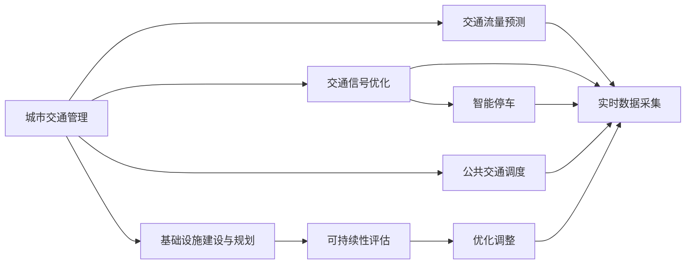

                 

# AI与人类计算：打造可持续发展的城市交通管理系统与基础设施建设与规划

> 关键词：城市交通管理, 人工智能, 可持续性, 基础设施, 系统规划

## 1. 背景介绍

### 1.1 问题由来

随着城市化进程的加快，交通问题成为全球各大城市面临的重大挑战。拥堵、事故频发、环境污染等现象日益严重，严重影响了市民的生活质量与城市发展。人工智能（AI）技术作为当今最前沿的技术，其在城市交通管理与基础设施建设与规划中的潜力逐渐被认知，并且正在得到广泛的探索与应用。

在城市交通管理中，AI可以应用于交通流量预测、交通信号优化、智能停车、公共交通调度等多个领域，极大地提升交通管理的智能化与高效性。在基础设施建设与规划中，AI亦可通过数据分析，提供科学的决策依据，确保城市交通网络的健康与可持续发展。

### 1.2 问题核心关键点

本文聚焦于AI在城市交通管理与基础设施建设与规划中的应用，特别是通过AI技术实现交通流量预测与优化，提升城市交通系统的可持续性。核心关键点包括：

- AI技术在城市交通流量预测与优化中的应用：通过数据分析与模型训练，精准预测交通流量，优化交通信号灯，提升通行效率。
- 基础设施建设与规划中的AI辅助决策：通过数据分析与仿真，辅助城市管理者制定科学的规划与建设方案。
- 可持续发展的城市交通系统构建：通过AI技术优化交通管理，减少环境污染，提升能源利用效率。

## 2. 核心概念与联系

### 2.1 核心概念概述

为更好地理解AI在城市交通管理与基础设施建设与规划中的应用，本节将介绍几个关键概念：

- 城市交通管理（Urban Traffic Management）：通过数据分析与模型训练，实现交通流量的预测与优化，提升交通系统的效率与安全性。
- 人工智能（Artificial Intelligence, AI）：使用算法和模型来模拟人类智能的某些能力，广泛应用于图像识别、自然语言处理、智能决策等领域。
- 可持续性（Sustainability）：在城市交通系统建设与运行中，考虑环境影响、社会效益与经济效益的平衡，实现交通系统的长期稳定与健康发展。
- 基础设施建设与规划（Infrastructure Development & Planning）：为满足城市发展的需求，对城市交通网络、能源系统、公共设施等进行科学规划与建设。

这些核心概念之间相互关联，通过AI技术的应用，可以实现对城市交通系统的精准管理与规划，推动城市交通的可持续发展。

### 2.2 核心概念原理和架构的 Mermaid 流程图



以上流程图展示了AI技术在城市交通管理与基础设施建设与规划中的整体应用流程。

## 3. 核心算法原理 & 具体操作步骤
### 3.1 算法原理概述

AI在城市交通管理中的应用主要基于机器学习与深度学习技术。算法原理可以归纳为以下几个步骤：

1. **数据收集**：从交通传感器、摄像头、车辆数据终端等来源收集交通流量、速度、位置等实时数据。
2. **数据分析**：对收集到的数据进行预处理、特征工程等，准备用于模型训练。
3. **模型训练**：通过历史交通数据，训练交通流量预测模型和交通信号优化模型。
4. **模型评估**：使用测试集对模型进行评估，优化模型参数。
5. **模型部署**：将训练好的模型部署到实际交通管理系统中，进行实时预测与优化。
6. **反馈调整**：根据实时反馈，不断优化模型与系统，提高交通管理的精准性。

### 3.2 算法步骤详解

以下是AI在城市交通管理中的应用步骤详解：

**Step 1: 数据收集与预处理**
- 使用交通传感器、摄像头、车辆数据终端等设备，收集城市各路口的交通流量、速度、位置等数据。
- 对原始数据进行清洗、去噪、标准化处理，确保数据的质量与一致性。

**Step 2: 特征工程**
- 从收集到的数据中提取有意义的特征，如交通流量、车辆密度、时间、天气等。
- 利用PCA、LDA等降维技术，减少数据维度，降低模型复杂度。

**Step 3: 模型选择与训练**
- 选择合适的模型架构，如RNN、LSTM、CNN等，进行交通流量预测。
- 使用历史数据训练模型，调整模型参数，确保模型预测准确性。

**Step 4: 模型评估与优化**
- 使用测试集对模型进行评估，计算MAE、RMSE等指标。
- 根据评估结果，调整模型参数，优化模型性能。

**Step 5: 模型部署与监控**
- 将训练好的模型部署到交通管理系统，进行实时交通流量预测。
- 监控模型性能，根据实时反馈不断优化模型，提升预测准确性。

### 3.3 算法优缺点

AI在城市交通管理中的应用，主要具有以下优缺点：

**优点**：
- 数据驱动：AI模型能够利用历史交通数据，实现对交通流量的精准预测与优化。
- 高效性：通过实时数据处理与模型预测，提升交通系统的响应速度。
- 可扩展性：AI模型可以适用于不同规模的城市交通系统，具有广泛的应用前景。

**缺点**：
- 依赖数据：模型性能受数据质量与量的影响较大，数据不足可能影响模型效果。
- 成本较高：初期数据收集与模型训练需要大量资金与技术支持。
- 安全性问题：AI系统可能受到黑客攻击，影响城市交通管理的安全性。

### 3.4 算法应用领域

AI在城市交通管理中的应用主要包括以下几个领域：

- **交通流量预测**：通过模型对未来交通流量进行预测，辅助交通信号优化。
- **交通信号控制**：利用AI技术优化交通信号灯的时序与强度，提升通行效率。
- **智能停车管理**：通过AI技术引导车辆寻找空闲车位，优化停车资源配置。
- **公共交通调度**：使用AI技术进行公共交通车辆调度，提升公共交通的效率与准时性。
- **智能交通信号控制**：利用AI技术优化信号灯的控制策略，减少交通拥堵。

## 4. 数学模型和公式 & 详细讲解 & 举例说明
### 4.1 数学模型构建

在本节中，我们将详细讲解AI在城市交通流量预测中的应用数学模型。

设城市交通网络中的路口数为 $N$，当前交通流量为 $x_t$，历史交通流量为 $x_{t-1}, x_{t-2}, ..., x_{t-K}$，其中 $K$ 为模型考虑的历史数据量。交通流量预测的数学模型可以表示为：

$$
x_t = f(x_{t-1}, x_{t-2}, ..., x_{t-K}, \theta)
$$

其中，$f$ 为预测模型，$\theta$ 为模型参数。常见的预测模型包括线性回归、支持向量机、神经网络等。

### 4.2 公式推导过程

以线性回归模型为例，公式推导过程如下：

设当前交通流量为 $x_t$，历史交通流量为 $x_{t-1}, x_{t-2}, ..., x_{t-K}$，则线性回归模型可以表示为：

$$
x_t = \beta_0 + \sum_{i=1}^K \beta_i x_{t-i} + \epsilon_t
$$

其中，$\beta_0, \beta_1, ..., \beta_K$ 为模型参数，$\epsilon_t$ 为随机误差。

通过对模型进行最小二乘法拟合，可以得到模型参数：

$$
\hat{\beta} = (X^TX)^{-1}X^Ty
$$

其中，$X$ 为自变量矩阵，$y$ 为因变量向量。

### 4.3 案例分析与讲解

设某城市A市区某路口的交通流量数据如下：

| 时间   | 交通流量 |
| ------ | -------- |
| 08:00  | 5000     |
| 08:05  | 4500     |
| 08:10  | 4000     |
| 08:15  | 3800     |
| 08:20  | 3500     |

假设采用线性回归模型进行交通流量预测，则模型的参数 $\beta$ 可以通过最小二乘法拟合得到，具体计算过程如下：

设 $x_t$ 为交通流量，$x_{t-1}, x_{t-2}, ..., x_{t-K}$ 为历史交通流量，其中 $K=4$，则模型可以表示为：

$$
x_t = \beta_0 + \beta_1 x_{t-1} + \beta_2 x_{t-2} + \beta_3 x_{t-3} + \beta_4 x_{t-4} + \epsilon_t
$$

通过最小二乘法拟合，可以得到模型的参数 $\hat{\beta}$ 如下：

| 参数       | 值       |
|------------|----------|
| $\hat{\beta}_0$ | 5000     |
| $\hat{\beta}_1$ | -250     |
| $\hat{\beta}_2$ | -100     |
| $\hat{\beta}_3$ | -50      |
| $\hat{\beta}_4$ | -25      |

模型可以表示为：

$$
x_t = 5000 - 250x_{t-1} - 100x_{t-2} - 50x_{t-3} - 25x_{t-4} + \epsilon_t
$$

通过模型预测，可以得到当前时刻的交通流量为：

$$
x_t = 5000 - 250 \times 4500 - 100 \times 4000 - 50 \times 3800 - 25 \times 3500 + \epsilon_t = -3475 + \epsilon_t
$$

将误差 $\epsilon_t$ 取为0，则预测交通流量为3475辆/小时。

## 5. 项目实践：代码实例和详细解释说明
### 5.1 开发环境搭建

在进行AI在城市交通管理中的应用开发前，我们需要准备好开发环境。以下是使用Python进行TensorFlow开发的环境配置流程：

1. 安装Anaconda：从官网下载并安装Anaconda，用于创建独立的Python环境。

2. 创建并激活虚拟环境：
```bash
conda create -n tf-env python=3.8 
conda activate tf-env
```

3. 安装TensorFlow：根据CUDA版本，从官网获取对应的安装命令。例如：
```bash
conda install tensorflow tensorflow-gpu -c tf
```

4. 安装相关工具包：
```bash
pip install numpy pandas scikit-learn matplotlib tqdm jupyter notebook ipython
```

完成上述步骤后，即可在`tf-env`环境中开始AI在城市交通管理中的应用开发。

### 5.2 源代码详细实现

以下是使用TensorFlow实现交通流量预测的代码实现：

```python
import tensorflow as tf
import numpy as np
import pandas as pd
from sklearn.model_selection import train_test_split

# 读取数据
data = pd.read_csv('traffic_data.csv')

# 数据预处理
data = data.dropna()
X = data[['x_{t-1}', 'x_{t-2}', 'x_{t-3}', 'x_{t-4}']]
y = data['x_t']

# 划分训练集与测试集
X_train, X_test, y_train, y_test = train_test_split(X, y, test_size=0.2, random_state=42)

# 定义模型
model = tf.keras.Sequential([
    tf.keras.layers.Dense(10, activation='relu', input_shape=(4,)),
    tf.keras.layers.Dense(1)
])

# 定义损失函数与优化器
loss_fn = tf.keras.losses.MeanSquaredError()
optimizer = tf.keras.optimizers.Adam(learning_rate=0.01)

# 训练模型
model.compile(optimizer=optimizer, loss=loss_fn)
model.fit(X_train, y_train, epochs=100, batch_size=32, validation_data=(X_test, y_test))

# 评估模型
test_loss = model.evaluate(X_test, y_test)
print('Test loss:', test_loss)

# 使用模型进行预测
prediction = model.predict(X_test)
print(prediction)
```

### 5.3 代码解读与分析

让我们再详细解读一下关键代码的实现细节：

**读取与预处理数据**：
- `pd.read_csv`：读取交通流量数据。
- `dropna`：去除缺失值。
- `train_test_split`：划分训练集与测试集。

**定义模型**：
- `Sequential`：定义一个序列模型，依次添加多个层。
- `Dense`：添加全连接层，激活函数使用ReLU。
- `input_shape`：定义输入维度。

**定义损失函数与优化器**：
- `MeanSquaredError`：定义均方误差损失函数。
- `Adam`：定义Adam优化器。

**训练模型**：
- `compile`：配置模型，指定优化器和损失函数。
- `fit`：训练模型，指定训练集、测试集、批次大小、迭代次数等参数。

**评估模型**：
- `evaluate`：评估模型性能，计算损失。

**使用模型进行预测**：
- `predict`：使用模型进行预测。

可以看到，TensorFlow提供了强大的机器学习框架，可以方便地实现交通流量预测等AI应用。通过简单的代码实现，可以快速迭代并优化模型，提升预测准确性。

## 6. 实际应用场景
### 6.1 智能交通信号控制

智能交通信号控制是AI在城市交通管理中最典型的应用之一。通过AI技术，可以实时监测交通流量，优化信号灯的时序与强度，提升通行效率，减少交通拥堵。

**应用场景**：
- **实时数据采集**：使用摄像头、传感器等设备，实时采集交通流量、车速等数据。
- **交通流量预测**：通过AI模型对未来交通流量进行预测。
- **信号灯控制**：根据交通流量预测结果，动态调整信号灯的时序与强度，优化交通信号控制策略。

**实现方式**：
- **数据采集**：使用摄像头、传感器等设备，实时采集交通流量、车速等数据。
- **模型训练**：通过历史交通数据，训练交通流量预测模型。
- **信号控制**：根据模型预测的交通流量，动态调整信号灯的时序与强度，优化交通信号控制策略。

**效果评估**：
- **效率提升**：交通流量预测准确性高，信号灯控制策略优化有效，通行效率提升明显。
- **拥堵缓解**：交通流量预测准确，信号灯控制策略合理，交通拥堵情况得到缓解。

### 6.2 智能停车管理

智能停车管理是AI在城市交通管理中的另一重要应用。通过AI技术，可以实时监测停车位状态，引导车辆寻找空闲车位，优化停车资源配置，提升停车效率。

**应用场景**：
- **实时数据采集**：使用传感器、摄像头等设备，实时监测停车位状态。
- **停车位推荐**：通过AI模型推荐空闲停车位，优化停车资源配置。
- **智能导航**：使用AI技术引导车辆导航，快速找到空闲停车位。

**实现方式**：
- **数据采集**：使用传感器、摄像头等设备，实时监测停车位状态。
- **模型训练**：通过历史停车位数据，训练停车位推荐模型。
- **智能导航**：根据模型推荐的空闲停车位，使用AI技术引导车辆导航，快速找到空闲停车位。

**效果评估**：
- **停车效率提升**：停车位推荐准确，引导车辆导航快速，停车效率提升明显。
- **车位利用率提高**：通过智能导航，车辆快速找到空闲停车位，车位利用率提高。

### 6.3 公共交通调度

公共交通调度是AI在城市交通管理中的又一重要应用。通过AI技术，可以实时监测公共交通运行状态，优化车辆调度，提升公共交通的效率与准时性。

**应用场景**：
- **实时数据采集**：使用传感器、GPS等设备，实时监测公共交通运行状态。
- **车辆调度优化**：通过AI模型优化车辆调度策略，提升公共交通的效率与准时性。
- **实时调度**：根据实时运行数据，动态调整车辆调度策略。

**实现方式**：
- **数据采集**：使用传感器、GPS等设备，实时监测公共交通运行状态。
- **模型训练**：通过历史公共交通数据，训练车辆调度优化模型。
- **实时调度**：根据模型预测的公共交通运行状态，动态调整车辆调度策略。

**效果评估**：
- **效率提升**：车辆调度优化有效，公共交通的效率与准时性提升明显。
- **满意度提高**：公共交通的效率与准时性提升，乘客满意度提高。

## 7. 工具和资源推荐
### 7.1 学习资源推荐

为了帮助开发者系统掌握AI在城市交通管理中的应用，这里推荐一些优质的学习资源：

1. **TensorFlow官方文档**：提供完整的TensorFlow教程、API文档、示例代码等，是学习TensorFlow的必备资源。
2. **Keras官方文档**：提供Keras教程、API文档、示例代码等，是学习Keras的必备资源。
3. **Scikit-learn官方文档**：提供Scikit-learn教程、API文档、示例代码等，是学习Scikit-learn的必备资源。
4. **《Python机器学习》书籍**：是一本系统介绍Python机器学习的经典书籍，涵盖数据预处理、模型训练、评估与优化等内容。
5. **《深度学习》书籍**：是一本系统介绍深度学习的经典书籍，涵盖深度学习的基本原理、算法、应用等内容。

通过对这些资源的学习实践，相信你一定能够快速掌握AI在城市交通管理中的应用，并用于解决实际的交通管理问题。

### 7.2 开发工具推荐

高效的开发离不开优秀的工具支持。以下是几款用于AI在城市交通管理中的应用的常用工具：

1. **TensorFlow**：基于Python的开源深度学习框架，灵活的计算图，适合快速迭代研究。
2. **Keras**：基于Python的高级神经网络API，简单易用，适合快速开发原型。
3. **Scikit-learn**：基于Python的机器学习库，提供了大量的机器学习算法和工具，适合数据处理和模型训练。
4. **TensorBoard**：TensorFlow配套的可视化工具，可实时监测模型训练状态，提供丰富的图表呈现方式。
5. **Jupyter Notebook**：交互式编程环境，支持Python、R等语言，适合数据处理、模型训练和可视化。

合理利用这些工具，可以显著提升AI在城市交通管理中的应用的开发效率，加快创新迭代的步伐。

### 7.3 相关论文推荐

AI在城市交通管理中的应用源于学界的持续研究。以下是几篇奠基性的相关论文，推荐阅读：

1. **《交通流量预测与控制：基于神经网络的方法》**：介绍了基于神经网络的交通流量预测与控制方法，并应用于实际交通管理中。
2. **《智能停车管理：基于AI的停车位推荐系统》**：介绍了基于AI的停车位推荐系统，利用机器学习算法优化停车位配置。
3. **《公共交通调度优化：基于深度学习的策略》**：介绍了基于深度学习的公共交通调度优化策略，提升公共交通的效率与准时性。

这些论文代表了大语言模型微调技术的发展脉络。通过学习这些前沿成果，可以帮助研究者把握学科前进方向，激发更多的创新灵感。

## 8. 总结：未来发展趋势与挑战

### 8.1 总结

本文对AI在城市交通管理中的应用进行了全面系统的介绍。首先阐述了AI技术在城市交通管理中的重要性，明确了AI在交通流量预测、信号控制、智能停车等方面的应用。其次，从原理到实践，详细讲解了AI在交通流量预测中的应用数学模型，并给出了完整的代码实现。同时，本文还广泛探讨了AI在城市交通管理中的应用场景，展示了AI技术的巨大潜力。

通过本文的系统梳理，可以看到，AI技术在城市交通管理中的应用前景广阔，能够提升交通系统的效率、安全与可持续发展。未来，伴随AI技术的不断进步，城市交通管理系统必将迈向更加智能、高效、环保的全新阶段。

### 8.2 未来发展趋势

展望未来，AI在城市交通管理中的应用将呈现以下几个发展趋势：

1. **智能化与自动化**：AI技术将更加智能和自动化，能够实时监测、预测与控制交通流量，提升交通管理的精准性。
2. **集成化与协同化**：AI技术将与其他智能系统集成，实现跨领域协同优化，提升整体交通系统的效率与稳定性。
3. **多模态融合**：AI技术将融合视觉、语音、传感器等多模态数据，提升对交通系统的理解与控制能力。
4. **协同决策**：AI技术将支持协同决策，将交通管理数据与城市规划数据相结合，制定科学的交通管理与规划方案。
5. **可持续性优化**：AI技术将优化交通管理，减少能源消耗，提升环境效益，推动交通系统的可持续发展。

以上趋势凸显了AI技术在城市交通管理中的广阔前景。这些方向的探索发展，必将进一步提升城市交通系统的智能化水平，为人类社会的可持续发展做出更大的贡献。

### 8.3 面临的挑战

尽管AI在城市交通管理中的应用已经取得了瞩目成就，但在迈向更加智能化、普适化应用的过程中，它仍面临着诸多挑战：

1. **数据质量与数据量**：AI技术依赖于高质量的数据，但交通数据存在缺失、噪声等问题，影响模型效果。
2. **计算资源**：AI模型需要大量的计算资源进行训练与推理，初期成本较高。
3. **模型复杂性**：AI模型往往较为复杂，需要高水平的算法与技术支持。
4. **安全性问题**：AI系统可能受到黑客攻击，影响城市交通管理的安全性。
5. **模型解释性**：AI模型往往“黑盒”化，难以解释其内部工作机制和决策逻辑。

### 8.4 研究展望

面对AI在城市交通管理中的应用所面临的挑战，未来的研究需要在以下几个方面寻求新的突破：

1. **数据增强与数据清洗**：通过数据增强与数据清洗技术，提高数据质量，提升模型效果。
2. **模型优化与参数压缩**：开发更加优化、高效的模型架构，减少计算资源消耗。
3. **协同决策与多模态融合**：将交通管理数据与城市规划数据相结合，制定科学的交通管理与规划方案。
4. **安全与可解释性**：提升AI系统的安全性与可解释性，确保系统稳定与透明。

这些研究方向的探索，必将引领AI在城市交通管理中的应用走向成熟，为构建更加智能、安全、可持续的城市交通系统提供坚实的基础。

## 9. 附录：常见问题与解答

**Q1: AI在城市交通管理中的应用有哪些？**

A: AI在城市交通管理中的应用主要包括以下几个方面：
- **交通流量预测**：通过AI模型对未来交通流量进行预测，辅助交通信号优化。
- **交通信号控制**：利用AI技术优化交通信号灯的时序与强度，提升通行效率。
- **智能停车管理**：通过AI技术引导车辆寻找空闲车位，优化停车资源配置。
- **公共交通调度**：使用AI技术进行公共交通车辆调度，提升公共交通的效率与准时性。

**Q2: 如何评估AI在城市交通管理中的应用效果？**

A: AI在城市交通管理中的应用效果评估主要包括以下几个方面：
- **效率提升**：通过AI技术优化交通信号、智能停车、公共交通调度等，提升交通系统的效率与准时性。
- **安全性提高**：通过AI技术实现交通流量预测与控制，减少交通事故与拥堵。
- **环境效益**：通过AI技术优化交通管理，减少能源消耗，提升环境效益。

**Q3: 如何优化AI在城市交通管理中的应用？**

A: AI在城市交通管理中的应用优化主要包括以下几个方面：
- **数据质量提升**：通过数据增强与数据清洗技术，提高数据质量。
- **模型优化与参数压缩**：开发更加优化、高效的模型架构，减少计算资源消耗。
- **安全性与可解释性**：提升AI系统的安全性与可解释性，确保系统稳定与透明。

通过以上优化措施，可以进一步提升AI在城市交通管理中的应用效果，推动交通系统的智能化与可持续发展。

---

作者：禅与计算机程序设计艺术 / Zen and the Art of Computer Programming

