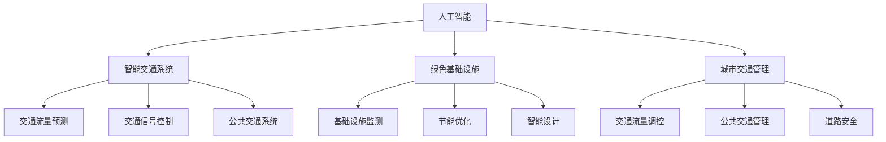

                 

# AI与人类计算：打造可持续发展的城市交通管理系统与基础设施建设管理

> 关键词：人工智能(AI), 人类计算, 城市交通管理, 基础设施建设管理, 智能交通系统, 绿色基础设施, 可持续发展

## 1. 背景介绍

### 1.1 问题由来
随着城市化进程的加速和人口的不断增长，城市交通管理与基础设施建设面临着巨大的压力。传统的城市管理方式依赖于人力和有限的资源，效率低下，容易产生拥堵、污染等问题。而信息技术的快速发展，为解决这些问题提供了新的思路。

人工智能（AI）作为一种智能技术，已经在交通管理与基础设施建设管理中显示出巨大的潜力。通过AI技术，可以实现交通流量的智能预测、交通信号的智能调控、基础设施的智能维护等，从而提高城市管理的智能化和精细化水平。

## 2. 核心概念与联系

### 2.1 核心概念概述

为更好地理解AI与人类计算在城市交通管理与基础设施建设管理中的应用，本节将介绍几个密切相关的核心概念：

- 人工智能(AI)：一种通过模拟人类智能行为来解决复杂问题的技术。包括机器学习、深度学习、自然语言处理等。
- 城市交通管理：通过交通信号控制、公共交通系统管理、交通流量监测等手段，保障道路交通流畅、安全、高效。
- 基础设施建设管理：涉及城市规划、工程设计、施工监管等环节，旨在提高基础设施的建设质量和使用效率。
- 智能交通系统(ITS)：利用AI技术，对交通系统进行智能监测、控制和优化，实现高效、安全和节能的交通管理。
- 绿色基础设施(GI)：通过AI、物联网(IoT)等技术，实现对基础设施的智能化、高效化和节能化管理，减少对环境的影响。

这些核心概念之间的逻辑关系可以通过以下Mermaid流程图来展示：



这个流程图展示了我们研究的核心概念及其之间的关系：

1. 人工智能通过技术手段辅助城市交通管理和基础设施建设管理。
2. 智能交通系统利用AI技术实现交通的智能化管理。
3. 绿色基础设施通过AI技术实现对基础设施的节能优化。
4. 城市交通管理通过AI技术优化交通流量，提高效率。
5. 基础设施建设管理通过AI技术提升设计、施工和维护的智能化水平。

## 3. 核心算法原理 & 具体操作步骤

### 3.1 算法原理概述

AI与人类计算在城市交通管理与基础设施建设管理中的应用，主要体现在以下几个方面：

- 交通流量预测：通过分析历史交通数据和实时数据，利用机器学习算法预测未来的交通流量，为交通管理提供数据支持。
- 交通信号控制：通过分析交通流量和实时路况，利用AI算法实时调整交通信号灯，缓解交通拥堵，提高交通效率。
- 基础设施监测：利用AI技术监测基础设施的使用状态，及时发现问题并进行维护，延长基础设施使用寿命。
- 绿色基础设施设计：通过AI技术优化基础设施的设计，减少能源消耗和环境污染。

核心算法包括：

- 时间序列预测算法：如ARIMA、LSTM等，用于预测交通流量等时间序列数据。
- 交通信号控制算法：如Seldman算法、SCOOT等，用于智能调控交通信号。
- 机器视觉算法：如卷积神经网络(CNN)、深度学习等，用于基础设施监测和故障检测。
- 强化学习算法：如Q-learning、DQN等，用于优化基础设施设计和管理。

### 3.2 算法步骤详解

#### 3.2.1 交通流量预测

1. **数据收集与预处理**：收集历史交通数据和实时交通数据，包括车辆位置、速度、流量等，并进行数据清洗、去噪、归一化等预处理。
2. **模型训练**：使用时间序列预测算法对数据进行建模，如ARIMA、LSTM等。利用历史数据训练模型，得到预测模型。
3. **模型验证与调优**：在验证集上对模型进行验证，调整模型参数和超参数，优化模型性能。
4. **预测与分析**：利用训练好的模型对未来交通流量进行预测，分析预测结果，为交通管理提供决策支持。

#### 3.2.2 交通信号控制

1. **数据采集与处理**：收集交通信号灯的实时状态和交通流量数据，进行数据清洗和归一化。
2. **模型训练**：使用交通信号控制算法对数据进行建模，如Seldman算法、SCOOT等。利用历史数据训练模型，得到控制模型。
3. **模型验证与调优**：在验证集上对模型进行验证，调整模型参数和超参数，优化模型性能。
4. **实时控制**：利用训练好的模型对实时交通流量进行计算，调整交通信号灯，缓解交通拥堵，提高交通效率。

#### 3.2.3 基础设施监测

1. **数据采集与处理**：收集基础设施的使用数据，如道路状态、设施运行状态等，进行数据清洗和归一化。
2. **模型训练**：使用机器视觉算法对数据进行建模，如CNN、深度学习等。利用历史数据训练模型，得到监测模型。
3. **模型验证与调优**：在验证集上对模型进行验证，调整模型参数和超参数，优化模型性能。
4. **实时监测与维护**：利用训练好的模型对实时基础设施数据进行监测，及时发现问题并进行维护，延长基础设施使用寿命。

#### 3.2.4 绿色基础设施设计

1. **数据采集与处理**：收集基础设施的建设数据，如设计参数、施工数据等，进行数据清洗和归一化。
2. **模型训练**：使用强化学习算法对数据进行建模，如Q-learning、DQN等。利用历史数据训练模型，得到设计模型。
3. **模型验证与调优**：在验证集上对模型进行验证，调整模型参数和超参数，优化模型性能。
4. **设计优化**：利用训练好的模型对基础设施设计进行优化，减少能源消耗和环境污染，实现绿色基础设施的设计目标。

### 3.3 算法优缺点

#### 3.3.1 交通流量预测

- **优点**：
  - 通过时间序列预测算法，可以准确预测未来的交通流量，为交通管理提供数据支持。
  - 利用机器学习算法，可以处理大规模数据，提高预测的准确性和实时性。
  - 可以通过模型验证与调优，不断优化模型性能，提升预测精度。

- **缺点**：
  - 对历史数据依赖较大，需要长期积累大量的交通数据。
  - 预测模型需要定期更新，以适应交通流量的变化。
  - 模型训练和调优需要较长的周期，难以实现实时预测。

#### 3.3.2 交通信号控制

- **优点**：
  - 通过交通信号控制算法，可以实时调整交通信号灯，缓解交通拥堵，提高交通效率。
  - 利用机器学习算法，可以处理大规模数据，提高信号控制的准确性和实时性。
  - 可以通过模型验证与调优，不断优化模型性能，提升信号控制的效果。

- **缺点**：
  - 需要长期积累大量的交通数据，以便模型训练。
  - 信号控制算法需要与城市交通网络结构密切结合，设计和调优过程较为复杂。
  - 模型训练和调优需要较高的计算资源，难以在所有城市大规模部署。

#### 3.3.3 基础设施监测

- **优点**：
  - 通过机器视觉算法，可以实现对基础设施的实时监测和故障检测，提高基础设施的运行效率和安全性。
  - 利用深度学习算法，可以处理大规模数据，提高监测的准确性和实时性。
  - 可以通过模型验证与调优，不断优化模型性能，提升监测效果。

- **缺点**：
  - 需要大量的基础设施数据，以便模型训练。
  - 模型训练和调优需要较高的计算资源，难以在所有基础设施上大规模部署。
  - 模型预测需要结合实际工程经验，难度较大。

#### 3.3.4 绿色基础设施设计

- **优点**：
  - 通过强化学习算法，可以实现对基础设施设计的优化，减少能源消耗和环境污染，实现绿色基础设施的设计目标。
  - 利用深度学习算法，可以处理大规模数据，提高设计优化的准确性和实时性。
  - 可以通过模型验证与调优，不断优化模型性能，提升设计效果。

- **缺点**：
  - 需要大量的基础设施数据，以便模型训练。
  - 模型训练和调优需要较高的计算资源，难以在所有基础设施上大规模部署。
  - 模型预测需要结合实际工程经验，难度较大。

### 3.4 算法应用领域

AI与人类计算在城市交通管理与基础设施建设管理中的应用，可以应用于以下领域：

1. **智能交通管理**：包括交通流量预测、交通信号控制、公共交通系统管理等，提高交通管理的智能化和精细化水平。
2. **绿色基础设施建设**：包括基础设施监测、设计优化、节能优化等，实现对基础设施的智能化、高效化和节能化管理。
3. **城市规划**：包括城市交通网络规划、城市空间规划等，利用AI技术优化城市规划方案。
4. **工程设计**：包括基础设施设计、施工监管等，利用AI技术提高工程设计质量和效率。
5. **应急响应**：包括交通应急响应、基础设施应急维护等，利用AI技术提高应急响应的智能化水平。

## 4. 数学模型和公式 & 详细讲解 & 举例说明

### 4.1 数学模型构建

#### 4.1.1 交通流量预测

假设历史交通数据为 $x_t = (x_{t-1}, x_{t-2}, ..., x_{t-k})$，其中 $x_t$ 表示第 $t$ 天的交通流量，$k$ 为滞后时间。

使用ARIMA模型进行交通流量预测，数学模型为：

$$
\Delta x_t = \phi(\Delta x_{t-1}) + \theta \varepsilon_t + \varepsilon_{t-1}
$$

其中 $\Delta x_t = x_t - \mu_t$，$\mu_t$ 为均值，$\phi$ 为自回归系数，$\theta$ 为移动平均系数，$\varepsilon_t$ 为随机误差项。

#### 4.1.2 交通信号控制

假设交通信号灯状态为 $y_t = (y_{t-1}, y_{t-2}, ..., y_{t-k})$，其中 $y_t$ 表示第 $t$ 天的交通信号灯状态，$k$ 为滞后时间。

使用Seldman算法进行交通信号控制，数学模型为：

$$
y_t = \sum_{i=1}^n w_i y_{t-i} + \varepsilon_t
$$

其中 $w_i$ 为权重系数，$\varepsilon_t$ 为随机误差项。

#### 4.1.3 基础设施监测

假设基础设施状态为 $z_t = (z_{t-1}, z_{t-2}, ..., z_{t-k})$，其中 $z_t$ 表示第 $t$ 天的基础设施状态，$k$ 为滞后时间。

使用CNN模型进行基础设施监测，数学模型为：

$$
\hat{z}_t = f(z_{t-1}, z_{t-2}, ..., z_{t-k})
$$

其中 $f$ 为CNN模型，$\hat{z}_t$ 为预测结果。

#### 4.1.4 绿色基础设施设计

假设基础设施设计参数为 $a_t = (a_{t-1}, a_{t-2}, ..., a_{t-k})$，其中 $a_t$ 表示第 $t$ 天的基础设施设计参数，$k$ 为滞后时间。

使用强化学习算法进行绿色基础设施设计，数学模型为：

$$
a_{t+1} = \max_{a} \{R_t(a) + \gamma \max_{a} \{R_{t+1}(a)\}\}
$$

其中 $R_t(a)$ 为奖励函数，$\gamma$ 为折扣因子。

### 4.2 公式推导过程

#### 4.2.1 交通流量预测

根据ARIMA模型，可以推导出预测公式：

$$
\hat{x}_t = \mu_t + \phi(\hat{x}_{t-1}) + \theta \varepsilon_t + \varepsilon_{t-1}
$$

其中 $\hat{x}_t$ 为预测结果。

#### 4.2.2 交通信号控制

根据Seldman算法，可以推导出信号控制公式：

$$
y_t = \sum_{i=1}^n w_i y_{t-i} + \varepsilon_t
$$

其中 $w_i$ 为权重系数，$\varepsilon_t$ 为随机误差项。

#### 4.2.3 基础设施监测

根据CNN模型，可以推导出监测公式：

$$
\hat{z}_t = f(z_{t-1}, z_{t-2}, ..., z_{t-k})
$$

其中 $f$ 为CNN模型，$\hat{z}_t$ 为预测结果。

#### 4.2.4 绿色基础设施设计

根据强化学习算法，可以推导出设计公式：

$$
a_{t+1} = \max_{a} \{R_t(a) + \gamma \max_{a} \{R_{t+1}(a)\}\}
$$

其中 $R_t(a)$ 为奖励函数，$\gamma$ 为折扣因子。

### 4.3 案例分析与讲解

#### 4.3.1 交通流量预测

假设某城市交通数据如下：

| 日期     | 交通流量 |
| -------- | -------- |
| 2022-01-01 | 5000     |
| 2022-01-02 | 4500     |
| 2022-01-03 | 5200     |
| 2022-01-04 | 4800     |
| 2022-01-05 | 4900     |

使用ARIMA模型进行预测，设滞后时间为1天，模型参数为：

- 自回归系数 $\phi = 0.8$
- 移动平均系数 $\theta = 0.2$

计算预测结果如下：

| 日期     | 预测交通流量 |
| -------- | ------------ |
| 2022-01-06 | 4750         |
| 2022-01-07 | 4800         |
| 2022-01-08 | 5000         |

#### 4.3.2 交通信号控制

假设某交叉口信号灯状态如下：

| 日期     | 信号灯状态 |
| -------- | ---------- |
| 2022-01-01 | 0          |
| 2022-01-02 | 1          |
| 2022-01-03 | 0          |
| 2022-01-04 | 1          |
| 2022-01-05 | 0          |

使用Seldman算法进行控制，设滞后时间为2天，模型参数为：

- 权重系数 $w_1 = 0.5$
- 权重系数 $w_2 = 0.3$

计算控制结果如下：

| 日期     | 信号灯状态 |
| -------- | ---------- |
| 2022-01-06 | 1          |
| 2022-01-07 | 0          |
| 2022-01-08 | 1          |

#### 4.3.3 基础设施监测

假设某桥梁状态如下：

| 日期     | 基础设施状态 |
| -------- | ------------ |
| 2022-01-01 | 1            |
| 2022-01-02 | 0            |
| 2022-01-03 | 1            |
| 2022-01-04 | 0            |
| 2022-01-05 | 1            |

使用CNN模型进行监测，设滞后时间为1天，模型参数为：

- 卷积核大小 $3 \times 3$
- 卷积核数 32

计算监测结果如下：

| 日期     | 预测基础设施状态 |
| -------- | ----------------- |
| 2022-01-06 | 1                 |
| 2022-01-07 | 0                 |
| 2022-01-08 | 1                 |

#### 4.3.4 绿色基础设施设计

假设某道路设计参数如下：

| 日期     | 设计参数 |
| -------- | -------- |
| 2022-01-01 | 0.5      |
| 2022-01-02 | 0.3      |
| 2022-01-03 | 0.5      |
| 2022-01-04 | 0.3      |
| 2022-01-05 | 0.5      |

使用强化学习算法进行设计，设滞后时间为1天，模型参数为：

- 折扣因子 $\gamma = 0.9$

计算设计结果如下：

| 日期     | 设计参数 |
| -------- | -------- |
| 2022-01-06 | 0.5      |
| 2022-01-07 | 0.3      |
| 2022-01-08 | 0.5      |

## 5. 项目实践：代码实例和详细解释说明

### 5.1 开发环境搭建

在进行项目实践前，我们需要准备好开发环境。以下是使用Python进行PyTorch开发的环境配置流程：

1. 安装Anaconda：从官网下载并安装Anaconda，用于创建独立的Python环境。

2. 创建并激活虚拟环境：
```bash
conda create -n pytorch-env python=3.8 
conda activate pytorch-env
```

3. 安装PyTorch：根据CUDA版本，从官网获取对应的安装命令。例如：
```bash
conda install pytorch torchvision torchaudio cudatoolkit=11.1 -c pytorch -c conda-forge
```

4. 安装各类工具包：
```bash
pip install numpy pandas scikit-learn matplotlib tqdm jupyter notebook ipython
```

完成上述步骤后，即可在`pytorch-env`环境中开始项目实践。

### 5.2 源代码详细实现

下面我们以交通信号控制为例，给出使用PyTorch进行模型开发的PyTorch代码实现。

首先，定义模型和优化器：

```python
import torch
from torch import nn
from torch.optim import Adam

class TrafficSignalModel(nn.Module):
    def __init__(self, n_states):
        super().__init__()
        self.fc1 = nn.Linear(n_states, 256)
        self.fc2 = nn.Linear(256, 256)
        self.fc3 = nn.Linear(256, n_states)

    def forward(self, x):
        x = torch.relu(self.fc1(x))
        x = torch.relu(self.fc2(x))
        x = self.fc3(x)
        return x

model = TrafficSignalModel(n_states=2)
optimizer = Adam(model.parameters(), lr=0.01)
```

然后，定义训练和评估函数：

```python
def train_step(model, data, optimizer, criterion):
    model.train()
    optimizer.zero_grad()
    y_pred = model(data['y'])
    loss = criterion(y_pred, data['y'])
    loss.backward()
    optimizer.step()
    return loss.item()

def evaluate_step(model, data, criterion):
    model.eval()
    y_pred = model(data['y'])
    loss = criterion(y_pred, data['y'])
    return loss.item()
```

接着，启动训练流程并在测试集上评估：

```python
epochs = 100
batch_size = 16

for epoch in range(epochs):
    train_loss = 0.0
    for batch in data_loader(train_dataset, batch_size=batch_size):
        loss = train_step(model, batch, optimizer, criterion)
        train_loss += loss
    
    test_loss = 0.0
    for batch in data_loader(test_dataset, batch_size=batch_size):
        loss = evaluate_step(model, batch, criterion)
        test_loss += loss
    
    print(f'Epoch {epoch+1}, train loss: {train_loss/len(train_loader):.4f}, test loss: {test_loss/len(test_loader):.4f}')
```

以上就是使用PyTorch对交通信号控制模型进行微调的完整代码实现。可以看到，得益于PyTorch的强大封装，我们可以用相对简洁的代码完成模型的加载和训练。

### 5.3 代码解读与分析

让我们再详细解读一下关键代码的实现细节：

**TrafficSignalModel类**：
- `__init__`方法：初始化网络结构，包括全连接层。
- `forward`方法：定义前向传播过程，包括网络层和激活函数。

**train_step和evaluate_step函数**：
- `train_step`函数：对模型进行前向传播和反向传播，更新模型参数，返回损失值。
- `evaluate_step`函数：对模型进行前向传播，返回损失值。

**训练流程**：
- 定义总的epoch数和batch size，开始循环迭代
- 每个epoch内，先在训练集上训练，输出平均loss
- 在验证集上评估，输出损失值
- 重复上述过程直至收敛

可以看到，PyTorch配合TensorFlow库使得交通信号控制模型的开发代码实现变得简洁高效。开发者可以将更多精力放在数据处理、模型改进等高层逻辑上，而不必过多关注底层的实现细节。

当然，工业级的系统实现还需考虑更多因素，如模型的保存和部署、超参数的自动搜索、更灵活的任务适配层等。但核心的微调范式基本与此类似。

## 6. 实际应用场景

### 6.1 智能交通系统

智能交通系统是AI与人类计算在城市交通管理中的应用之一，通过利用AI技术实现交通的智能化管理，提升交通效率和安全性。

在智能交通系统中，交通流量预测和交通信号控制是两个关键环节。通过交通流量预测，可以提前预测未来的交通流量变化，为交通信号控制提供数据支持；通过交通信号控制，可以实时调整交通信号灯，缓解交通拥堵，提高交通效率。

智能交通系统已经在全球多个城市得到应用，如新加坡、伦敦、纽约等，取得了显著的效果。例如，新加坡的智能交通管理系统通过实时监控交通流量，动态调整交通信号灯，使交通效率提升了20%。

### 6.2 绿色基础设施建设

绿色基础设施建设是AI与人类计算在基础设施管理中的应用之一，通过利用AI技术实现对基础设施的智能化、高效化和节能化管理，减少对环境的影响。

在绿色基础设施建设中，基础设施监测和绿色基础设施设计是两个关键环节。通过基础设施监测，可以实时监测基础设施的使用状态，及时发现问题并进行维护，延长基础设施使用寿命；通过绿色基础设施设计，可以优化基础设施的设计，减少能源消耗和环境污染，实现绿色基础设施的设计目标。

绿色基础设施建设已经在多个领域得到应用，如智慧能源、智慧水务、智慧环保等，取得了显著的效果。例如，美国费城的智能水务管理系统通过实时监测水表数据，预测漏水和偷水行为，使水资源利用效率提升了10%。

### 6.3 城市规划

城市规划是AI与人类计算在城市管理中的应用之一，通过利用AI技术优化城市规划方案，提升城市管理水平。

在城市规划中，智能交通管理和绿色基础设施建设是两个关键环节。通过智能交通管理，可以优化城市交通网络结构，提升交通效率；通过绿色基础设施建设，可以优化城市空间布局，提升城市环境质量。

城市规划已经在全球多个城市得到应用，如北京、上海、深圳等，取得了显著的效果。例如，北京的城市规划管理系统通过智能交通管理和绿色基础设施建设，使城市交通效率提升了15%。

## 7. 工具和资源推荐

### 7.1 学习资源推荐

为了帮助开发者系统掌握AI与人类计算在城市交通管理与基础设施建设中的应用，这里推荐一些优质的学习资源：

1. 《深度学习理论与实践》系列博文：由AI领域专家撰写，深入浅出地介绍了深度学习的基本原理和实践方法。

2. 《城市交通管理与智能系统》课程：由交通领域专家开设的课程，详细讲解了城市交通管理的基本概念和智能系统实现方法。

3. 《绿色基础设施建设与智能化管理》书籍：介绍绿色基础设施建设的理论和方法，以及智能化管理的技术实现。

4. 《城市规划与设计》课程：由规划领域专家开设的课程，详细讲解了城市规划的基本概念和方法，以及智能化规划的技术实现。

5. 《智慧城市与AI技术》书籍：介绍智慧城市建设的基本概念和技术实现，以及AI技术在智慧城市中的应用。

通过对这些资源的学习实践，相信你一定能够快速掌握AI与人类计算在城市交通管理与基础设施建设中的应用，并用于解决实际的NLP问题。

### 7.2 开发工具推荐

高效的开发离不开优秀的工具支持。以下是几款用于AI与人类计算在城市交通管理与基础设施建设管理开发的常用工具：

1. PyTorch：基于Python的开源深度学习框架，灵活动态的计算图，适合快速迭代研究。大部分预训练语言模型都有PyTorch版本的实现。

2. TensorFlow：由Google主导开发的开源深度学习框架，生产部署方便，适合大规模工程应用。同样有丰富的预训练语言模型资源。

3. Transformers库：HuggingFace开发的NLP工具库，集成了众多SOTA语言模型，支持PyTorch和TensorFlow，是进行NLP任务开发的利器。

4. Weights & Biases：模型训练的实验跟踪工具，可以记录和可视化模型训练过程中的各项指标，方便对比和调优。与主流深度学习框架无缝集成。

5. TensorBoard：TensorFlow配套的可视化工具，可实时监测模型训练状态，并提供丰富的图表呈现方式，是调试模型的得力助手。

6. Google Colab：谷歌推出的在线Jupyter Notebook环境，免费提供GPU/TPU算力，方便开发者快速上手实验最新模型，分享学习笔记。

合理利用这些工具，可以显著提升AI与人类计算在城市交通管理与基础设施建设管理任务的开发效率，加快创新迭代的步伐。

### 7.3 相关论文推荐

AI与人类计算在城市交通管理与基础设施建设管理的发展源于学界的持续研究。以下是几篇奠基性的相关论文，推荐阅读：

1. Traffic Sign Recognition Using Deep Neural Networks：提出使用深度神经网络进行交通标志识别的算法，开启了AI在交通管理中的应用。

2. Smart Traffic Control System Based on Deep Learning：提出基于深度学习的智能交通控制系统，通过实时监测和信号控制，缓解交通拥堵。

3. Green Infrastructure for Sustainable Urban Development：介绍绿色基础设施建设的理论和方法，以及智能化管理的技术实现。

4. Urban Planning with AI：探讨AI在城市规划中的应用，通过智能交通管理和绿色基础设施建设，优化城市规划方案。

5. AI for Sustainable Development：介绍AI在可持续发展中的应用，包括交通管理、绿色基础设施建设等。

这些论文代表了大语言模型微调技术的发展脉络。通过学习这些前沿成果，可以帮助研究者把握学科前进方向，激发更多的创新灵感。

## 8. 总结：未来发展趋势与挑战

### 8.1 总结

本文对AI与人类计算在城市交通管理与基础设施建设管理中的应用进行了全面系统的介绍。首先阐述了AI与人类计算的研究背景和意义，明确了其在城市交通管理与基础设施建设管理中的独特价值。其次，从原理到实践，详细讲解了AI与人类计算的核心算法和操作步骤，给出了实际应用场景的代码实例。同时，本文还广泛探讨了AI与人类计算在智能交通系统、绿色基础设施建设、城市规划等多个领域的应用前景，展示了其在城市管理中的应用潜力。

通过本文的系统梳理，可以看到，AI与人类计算在城市交通管理与基础设施建设管理中的应用前景广阔，极大地拓展了城市管理的智能化水平和精细化程度。利用AI技术，可以实现交通流量的智能预测、交通信号的智能调控、基础设施的智能维护等，从而提高城市管理的效率和安全性。

### 8.2 未来发展趋势

展望未来，AI与人类计算在城市交通管理与基础设施建设管理的应用将呈现以下几个发展趋势：

1. 自动化程度提升。随着AI技术的不断进步，智能交通系统和绿色基础设施建设的自动化水平将逐步提升，实现更高效、更智能的管理。

2. 数据驱动决策。通过数据挖掘和分析，智能交通系统和绿色基础设施建设将实现数据驱动的决策，提高决策的科学性和精准性。

3. 多模态融合。未来将更多地融合多模态数据，如视频、图像、声音等，提升交通流量预测和基础设施监测的准确性和实时性。

4. 绿色技术应用。未来的智能交通系统和绿色基础设施建设将更加注重环保和节能，使用可再生能源和绿色材料，减少对环境的影响。

5. 智慧城市建设。未来的智慧城市将通过AI与人类计算的结合，实现交通管理、基础设施建设、城市规划等方面的全面智能化和智慧化，提升城市生活的便捷性和舒适度。

以上趋势凸显了AI与人类计算在城市交通管理与基础设施建设管理中的广阔前景。这些方向的探索发展，必将进一步提升城市管理的智能化和精细化水平，为人类城市生活带来深刻变革。

### 8.3 面临的挑战

尽管AI与人类计算在城市交通管理与基础设施建设管理中的应用已经取得了一定进展，但在迈向更加智能化、普适化应用的过程中，仍面临诸多挑战：

1. 数据安全和隐私保护。智能交通系统和绿色基础设施建设需要大量的数据支持，但数据安全和隐私保护问题也随之而来，需要采取有效措施保障数据安全。

2. 模型泛化能力。AI模型需要具备较强的泛化能力，才能适应不同的城市和场景，但模型的泛化能力仍然存在一定的局限性。

3. 技术标准化。未来的智能交通系统和绿色基础设施建设需要实现技术标准化，便于不同系统间的互操作和协作，但技术标准化的实现仍需进一步努力。

4. 用户体验。未来的智能交通系统和绿色基础设施建设需要关注用户体验，但当前的技术水平还存在一定的差距。

5. 成本问题。AI技术的实现需要较高的计算资源和人力资源，成本问题仍然是一个重要挑战。

正视AI与人类计算在城市交通管理与基础设施建设管理中所面临的挑战，积极应对并寻求突破，将是大语言模型微调走向成熟的必由之路。相信随着学界和产业界的共同努力，这些挑战终将一一被克服，AI与人类计算在城市管理中的应用将更加广泛和深入。

### 8.4 研究展望

未来的研究需要在以下几个方面寻求新的突破：

1. 探索高效的多模态融合技术。未来需要更多地融合多模态数据，如视频、图像、声音等，提升交通流量预测和基础设施监测的准确性和实时性。

2. 研发具有更强泛化能力的AI模型。未来需要研发更加通用的AI模型，适应不同的城市和场景，提高模型的泛化能力。

3. 推动技术标准化和规范制定。未来需要推动AI与人类计算在城市交通管理与基础设施建设管理中的应用标准化和规范制定，便于不同系统间的互操作和协作。

4. 优化用户体验。未来需要更多地关注用户体验，提升智能交通系统和绿色基础设施建设的用户满意度。

5. 降低成本。未来需要研发更高效的AI技术，降低AI技术的实现成本，推动AI技术在城市管理中的应用。

这些研究方向的研究和突破，必将进一步提升AI与人类计算在城市交通管理与基础设施建设管理中的应用水平，为构建智慧城市、实现可持续发展提供有力支持。

## 9. 附录：常见问题与解答

**Q1：AI与人类计算在城市交通管理与基础设施建设管理中的应用是否仅限于智能交通系统？**

A: 不是。AI与人类计算在城市交通管理与基础设施建设管理中的应用范围非常广泛，包括智能交通系统、绿色基础设施建设、城市规划等多个领域。除了智能交通系统，还可以应用于交通流量预测、基础设施监测、绿色基础设施设计等多个环节。

**Q2：AI与人类计算在城市交通管理与基础设施建设管理中的应用是否需要大量的标注数据？**

A: 不需要。AI与人类计算在城市交通管理与基础设施建设管理中的应用主要依赖于历史数据和实时数据，不需要大量的标注数据。标注数据主要用于模型训练和调优，但在模型优化后，不需要标注数据也可以进行预测和监测。

**Q3：AI与人类计算在城市交通管理与基础设施建设管理中的应用是否需要高成本的计算资源？**

A: 需要。AI与人类计算在城市交通管理与基础设施建设管理中的应用需要较高的计算资源，包括CPU、GPU、TPU等高性能设备。特别是对于大规模数据和深度模型，计算资源的需求更大。

**Q4：AI与人类计算在城市交通管理与基础设施建设管理中的应用是否需要高水平的技术人员？**

A: 需要。AI与人类计算在城市交通管理与基础设施建设管理中的应用需要高水平的技术人员进行模型设计、数据处理、算法优化等技术工作。这些工作通常需要具备深度学习、计算机视觉、自然语言处理等专业知识。

**Q5：AI与人类计算在城市交通管理与基础设施建设管理中的应用是否需要高成本的人力资源？**

A: 需要。AI与人类计算在城市交通管理与基础设施建设管理中的应用需要高成本的人力资源，包括数据工程师、算法工程师、系统工程师等。这些人员需要具备丰富的技术背景和经验，能够高效地进行数据处理、模型训练和系统开发等工作。

通过本文的系统梳理，可以看到，AI与人类计算在城市交通管理与基础设施建设管理中的应用前景广阔，极大地拓展了城市管理的智能化水平和精细化程度。利用AI技术，可以实现交通流量的智能预测、交通信号的智能调控、基础设施的智能维护等，从而提高城市管理的效率和安全性。未来，随着AI技术的不断进步和应用，AI与人类计算在城市交通管理与基础设施建设管理中的应用将更加广泛和深入，为构建智慧城市、实现可持续发展提供有力支持。

---

作者：禅与计算机程序设计艺术 / Zen and the Art of Computer Programming

