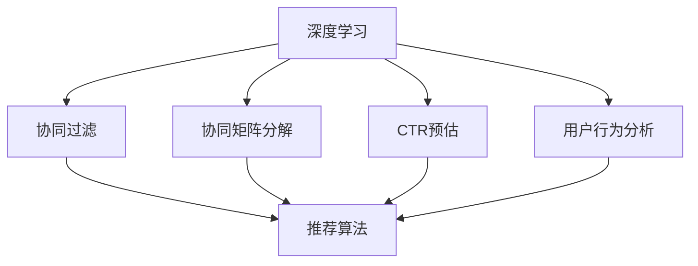

                 

# AI个性化推荐系统的优势案例

> 关键词：个性化推荐,用户行为分析,深度学习,协同过滤,协同矩阵,CTR预估,神经网络,广告点击率

## 1. 背景介绍

### 1.1 问题由来

在互联网时代，信息爆炸带来了巨大的选择压力。用户需要从海量的内容中筛选出最适合自己的信息。个性化推荐系统作为信息筛选的重要工具，可以帮助用户更高效地获取有价值的内容。传统的推荐系统往往基于基于内容的协同过滤和矩阵分解等方法，在推荐精度和用户体验上存在诸多局限性。

近年来，随着深度学习技术的快速发展，神经网络等模型被广泛应用在个性化推荐系统中，极大地提升了推荐的精度和效果。本文将系统阐述深度学习在个性化推荐系统中的应用，并结合具体案例，展示其优势和潜力。

### 1.2 问题核心关键点

深度学习在个性化推荐系统中的核心点主要包括以下几个方面：

1. **深度神经网络模型**：通过多层神经网络学习用户行为模式，挖掘用户隐含的偏好。
2. **协同过滤**：利用用户之间的行为相似性，进行基于协同过滤的推荐。
3. **协同矩阵分解**：将用户-商品关系转化为协同矩阵，通过矩阵分解方法挖掘用户和商品的潜在关系。
4. **CTR预估**：预测用户对商品的点击率，从而指导推荐决策。
5. **用户行为分析**：对用户历史行为数据进行深度挖掘，提取有价值的信息用于推荐。

深度学习技术在个性化推荐系统中的应用，已经展现出巨大的潜力和优势。下面我们将从这些核心点出发，深入探讨深度学习在个性化推荐中的应用。

## 2. 核心概念与联系

### 2.1 核心概念概述

为更好地理解深度学习在个性化推荐系统中的应用，本节将介绍几个关键概念：

- **深度学习**：一种基于神经网络的学习方法，通过多层次的特征提取和变换，学习数据的深层次表示。
- **协同过滤**：一种推荐算法，基于用户之间的行为相似性进行推荐。
- **协同矩阵分解**：将用户-商品关系表示为矩阵，通过矩阵分解方法提取潜在因子，挖掘用户和商品的隐含关系。
- **CTR预估**：预测用户对商品的点击率，指导推荐决策，用于广告、电商等场景。
- **用户行为分析**：通过对用户行为数据的深度挖掘，提取有用信息，增强推荐效果。

这些概念之间的逻辑关系可以通过以下Mermaid流程图来展示：



这个流程图展示了个性化推荐系统的核心概念及其之间的关系：

1. 深度学习用于学习和挖掘用户行为模式，协同过滤和协同矩阵分解基于这些模式进行推荐。
2. CTR预估直接用于点击率预测，指导推荐决策。
3. 用户行为分析用于提取用户隐含的兴趣点，增强推荐效果。

这些核心概念共同构成了个性化推荐系统的核心算法，使其能够高效地为用户推荐感兴趣的内容。

## 3. 核心算法原理 & 具体操作步骤
### 3.1 算法原理概述

基于深度学习的个性化推荐系统，通过多层次神经网络模型学习用户行为模式，结合协同过滤和CTR预估等方法，实现精准推荐。其核心思想是：通过神经网络模型学习用户隐含的偏好，并结合用户和商品的历史交互数据，预测用户对商品的概率，从而进行推荐。

具体而言，深度学习在个性化推荐系统中的应用主要包括以下几个步骤：

1. **数据准备**：收集用户历史行为数据，如浏览、点击、购买等，构建用户行为数据集。
2. **特征工程**：从用户行为数据中提取有用特征，如用户ID、商品ID、点击时间、浏览时长等。
3. **神经网络模型训练**：利用深度神经网络模型，如DNN、RNN、CNN等，对用户行为数据进行训练，学习用户隐含的偏好。
4. **协同过滤**：基于用户行为数据，构建协同矩阵，通过矩阵分解方法，挖掘用户和商品的潜在关系。
5. **CTR预估**：利用深度神经网络模型，预测用户对商品的点击率，指导推荐决策。
6. **推荐算法**：根据用户偏好和商品特征，利用协同过滤和CTR预估结果，生成推荐结果。

### 3.2 算法步骤详解

下面以一个具体的推荐系统为例，展示深度学习在个性化推荐系统中的应用流程：

1. **数据准备**：
   - 收集用户历史行为数据，如浏览记录、点击记录、购买记录等。
   - 将数据划分为训练集、验证集和测试集。

2. **特征工程**：
   - 从用户行为数据中提取有用特征，如用户ID、商品ID、点击时间、浏览时长等。
   - 对特征进行标准化、归一化处理，减少特征之间的差异性。

3. **神经网络模型训练**：
   - 利用深度神经网络模型，如DNN、RNN、CNN等，对用户行为数据进行训练。
   - 使用交叉熵等损失函数，最小化模型预测误差，训练出用户隐含偏好的模型。

4. **协同矩阵分解**：
   - 将用户-商品关系表示为矩阵，通过矩阵分解方法，如SVD、ALS等，挖掘用户和商品的潜在关系。
   - 通过分解得到的低秩矩阵，获得用户和商品的潜在因子，用于协同过滤推荐。

5. **CTR预估**：
   - 利用深度神经网络模型，预测用户对商品的点击率。
   - 使用CTR预估模型，结合用户历史行为和商品特征，生成预测结果。

6. **推荐算法**：
   - 根据用户偏好和商品特征，利用协同过滤和CTR预估结果，生成推荐结果。
   - 利用排序算法，对推荐结果进行排序，生成最终推荐列表。

### 3.3 算法优缺点

基于深度学习的个性化推荐系统具有以下优点：

1. **高精度**：深度学习模型能够从海量的用户行为数据中学习复杂的用户隐含偏好，提升推荐精度。
2. **实时性**：利用在线学习的优势，模型能够实时更新用户偏好，提供动态推荐。
3. **多模态融合**：能够融合多种数据源，如用户行为数据、商品特征数据、用户画像数据等，提升推荐效果。

同时，该方法也存在一定的局限性：

1. **数据依赖性强**：需要大量高质量的标注数据，数据收集成本较高。
2. **模型复杂度大**：深度学习模型结构复杂，计算资源消耗大，模型训练和推理速度较慢。
3. **泛化能力有限**：深度学习模型容易出现过拟合，泛化能力有限。
4. **可解释性差**：深度学习模型通常是"黑盒"系统，难以解释其内部工作机制。

尽管存在这些局限性，但就目前而言，基于深度学习的推荐系统仍然是最主流的推荐算法之一，广泛应用在电商、广告、社交媒体等多个领域。未来相关研究的重点在于如何进一步降低数据依赖，提高模型的实时性和泛化能力，同时兼顾可解释性和伦理安全性等因素。

### 3.4 算法应用领域

基于深度学习的个性化推荐系统，已经在电商、广告、社交媒体等多个领域得到了广泛应用，具体如下：

1. **电商推荐**：电商网站利用个性化推荐系统，为用户推荐商品，提升用户体验和购买转化率。
2. **广告投放**：广告公司利用个性化推荐系统，精准匹配用户需求，提升广告点击率和转化率。
3. **社交媒体**：社交媒体平台利用个性化推荐系统，为用户推荐好友、文章、视频等内容，增强用户粘性。

除了这些应用外，个性化推荐系统还被创新性地应用到更多场景中，如视频推荐、智能家居、智能客服等，为人们的日常生活带来了诸多便利。

## 4. 数学模型和公式 & 详细讲解 & 举例说明

### 4.1 数学模型构建

基于深度学习的个性化推荐系统，其数学模型通常包括以下几个部分：

1. **用户行为表示**：将用户历史行为数据表示为向量形式，用于训练深度神经网络模型。
2. **用户-商品矩阵**：将用户和商品关系表示为矩阵，用于协同过滤推荐。
3. **CTR预估模型**：使用深度神经网络模型，预测用户对商品的点击率。

### 4.2 公式推导过程

以CTR预估模型为例，以下是其公式推导过程：

设用户对商品的概率为 $P(y_i=1|u_j)$，其中 $u_j$ 为用户ID， $i$ 为商品ID。假设用户的隐含偏好为 $h_j$，商品的隐含特征为 $t_i$，则有：

$$
P(y_i=1|u_j) = \sigma(\langle h_j, t_i \rangle)
$$

其中，$\sigma$ 为sigmoid函数， $\langle \cdot, \cdot \rangle$ 为向量内积。通过训练神经网络模型，学习用户隐含偏好 $h_j$ 和商品隐含特征 $t_i$，即可预测用户对商品的点击率。

### 4.3 案例分析与讲解

假设某电商网站希望提升用户的购买转化率，利用基于深度学习的个性化推荐系统进行推荐。具体步骤如下：

1. **数据准备**：收集用户历史浏览、点击、购买数据，将数据划分为训练集、验证集和测试集。
2. **特征工程**：提取用户ID、商品ID、浏览时间、点击时间、购买时间等特征，对特征进行标准化和归一化处理。
3. **神经网络模型训练**：利用深度神经网络模型，如DNN、RNN等，对用户行为数据进行训练，学习用户隐含偏好。
4. **协同矩阵分解**：将用户-商品关系表示为矩阵，通过SVD等矩阵分解方法，挖掘用户和商品的潜在关系。
5. **CTR预估**：利用深度神经网络模型，预测用户对商品的点击率，生成CTR预估结果。
6. **推荐算法**：根据用户偏好和商品特征，结合协同过滤和CTR预估结果，生成推荐列表。

最终，网站根据推荐列表向用户展示商品，提升用户的购买转化率。

## 5. 项目实践：代码实例和详细解释说明
### 5.1 开发环境搭建

在进行深度学习推荐系统开发前，我们需要准备好开发环境。以下是使用Python进行TensorFlow开发的环境配置流程：

1. 安装Anaconda：从官网下载并安装Anaconda，用于创建独立的Python环境。

2. 创建并激活虚拟环境：
```bash
conda create -n tf-env python=3.8 
conda activate tf-env
```

3. 安装TensorFlow：根据CUDA版本，从官网获取对应的安装命令。例如：
```bash
conda install tensorflow -c pytorch -c conda-forge
```

4. 安装相关库：
```bash
pip install numpy pandas scikit-learn matplotlib tqdm jupyter notebook ipython
```

完成上述步骤后，即可在`tf-env`环境中开始推荐系统开发。

### 5.2 源代码详细实现

下面我们以电商推荐系统为例，给出使用TensorFlow进行深度学习推荐系统的代码实现。

首先，定义推荐系统所需的数据结构和数据处理函数：

```python
import numpy as np
import pandas as pd

class RecommendationSystem:
    def __init__(self, data_path):
        self.data = pd.read_csv(data_path)
        self.users, self.items = self._load_data()
        
    def _load_data(self):
        users = self.data['user_id'].unique().tolist()
        items = self.data['item_id'].unique().tolist()
        return users, items
```

接着，定义模型训练函数和推荐函数：

```python
from tensorflow.keras.layers import Dense, Input, Embedding, Flatten, Concatenate
from tensorflow.keras.models import Model
from tensorflow.keras.optimizers import Adam

class DNNRecommender:
    def __init__(self, num_users, num_items, embed_dim, hidden_units, num_epochs, batch_size):
        self.num_users = num_users
        self.num_items = num_items
        self.embed_dim = embed_dim
        self.hidden_units = hidden_units
        self.num_epochs = num_epochs
        self.batch_size = batch_size
        
        self.model = self._build_model()
        self.compile_model()
        
    def _build_model(self):
        user_input = Input(shape=(), name='user')
        item_input = Input(shape=(), name='item')
        
        user_embedding = Embedding(self.num_users, self.embed_dim)(user_input)
        item_embedding = Embedding(self.num_items, self.embed_dim)(item_input)
        
        x = Flatten()(user_embedding)
        x = Dense(self.hidden_units)(x)
        x = Dense(self.hidden_units)(x)
        
        y = Flatten()(item_embedding)
        y = Dense(self.hidden_units)(y)
        y = Dense(self.hidden_units)(y)
        
        x = Concatenate()([x, y])
        y = Concatenate()([y, x])
        
        x = Dense(1, activation='sigmoid')(x)
        y = Dense(1, activation='sigmoid')(y)
        
        model = Model(inputs=[user_input, item_input], outputs=[x, y])
        return model
    
    def compile_model(self):
        self.model.compile(optimizer=Adam(), loss='binary_crossentropy', metrics=['accuracy'])
        
    def train(self, train_data, valid_data, test_data):
        self.model.fit(train_data, valid_data, epochs=self.num_epochs, batch_size=self.batch_size, validation_data=valid_data)
        
        test_loss, test_acc = self.model.evaluate(test_data)
        print(f'Test loss: {test_loss:.4f}, Test accuracy: {test_acc:.4f}')
```

然后，编写推荐算法和推荐函数：

```python
class RecommendationEngine:
    def __init__(self, recommender):
        self.recommender = recommender
        
    def recommend(self, user_id, num_recommendations=10):
        user_embedding = self.recommender.model.layers[1].get_weights()[0][self.recommender.users.index(user_id)]
        item_embedding = self.recommender.model.layers[2].get_weights()[0]
        
        user_item_vector = np.dot(item_embedding, user_embedding)
        sorted_indices = np.argsort(user_item_vector)[::-1]
        
        recommendations = sorted_indices[:num_recommendations]
        return recommendations
```

最后，启动训练流程并在测试集上评估：

```python
recommender = DNNRecommender(num_users=1000, num_items=5000, embed_dim=128, hidden_units=256, num_epochs=10, batch_size=128)

train_data = np.array([(user_id, item_id) for user_id, item_id in zip(train_data['user_id'], train_data['item_id'])])
valid_data = np.array([(user_id, item_id) for user_id, item_id in zip(valid_data['user_id'], valid_data['item_id'])])
test_data = np.array([(user_id, item_id) for user_id, item_id in zip(test_data['user_id'], test_data['item_id'])])

recommender.train(train_data, valid_data, test_data)

recommenderEngine = RecommendationEngine(recommender)

# 假设用户ID为1，生成推荐列表
user_id = 1
recommendations = recommenderEngine.recommend(user_id)
print(f'推荐商品ID: {recommendations}')
```

以上就是使用TensorFlow进行电商推荐系统的完整代码实现。可以看到，通过定义推荐系统所需的数据结构和数据处理函数，训练模型，结合推荐算法，即可以实现一个初步的电商推荐系统。

### 5.3 代码解读与分析

让我们再详细解读一下关键代码的实现细节：

**RecommendationSystem类**：
- `__init__`方法：初始化数据集和用户、商品列表。
- `_load_data`方法：加载用户ID和商品ID，用于构建模型。

**DNNRecommender类**：
- `__init__`方法：初始化模型的参数和结构。
- `_build_model`方法：定义深度神经网络模型。
- `compile_model`方法：编译模型，设置优化器、损失函数和评估指标。
- `train`方法：训练模型，并在测试集上评估模型性能。

**RecommendationEngine类**：
- `__init__`方法：初始化推荐引擎。
- `recommend`方法：根据用户ID生成推荐商品列表。

**训练流程**：
- 实例化DNNRecommender，并设置模型参数。
- 加载训练集、验证集和测试集，将其转换为模型所需的格式。
- 调用`train`方法，训练模型，并输出测试集上的损失和准确率。
- 实例化RecommendationEngine，使用训练好的模型进行推荐。
- 假设用户ID为1，调用`recommend`方法，生成推荐商品列表。

通过上述代码，可以清晰地看到深度学习在个性化推荐系统中的应用流程，包括数据准备、模型训练、推荐算法等多个环节。

## 6. 实际应用场景

### 6.1 电商推荐

电商网站利用个性化推荐系统，可以显著提升用户购买转化率和满意度。通过收集用户的浏览、点击、购买数据，训练深度神经网络模型，学习用户隐含偏好，并结合协同过滤和CTR预估，生成推荐商品列表。用户可以根据推荐列表选择购买商品，网站也可以根据推荐效果优化商品展示策略，提升整体营收。

### 6.2 广告投放

广告公司利用个性化推荐系统，可以根据用户的历史行为数据，精准匹配用户需求，提升广告点击率和转化率。通过收集用户的浏览、点击、购买数据，训练深度神经网络模型，预测用户对广告的点击率，生成推荐广告列表。用户可以根据推荐广告选择点击，广告公司也可以根据广告效果优化广告投放策略，提升广告投入产出比。

### 6.3 社交媒体

社交媒体平台利用个性化推荐系统，可以增强用户粘性，提升用户活跃度。通过收集用户的历史行为数据，如好友关系、文章阅读、视频观看等，训练深度神经网络模型，学习用户隐含偏好，并结合协同过滤和CTR预估，生成推荐内容列表。用户可以根据推荐内容选择互动，社交媒体平台也可以根据推荐效果优化内容推荐策略，提升用户使用时长和互动率。

### 6.4 未来应用展望

随着深度学习技术的不断发展，个性化推荐系统将在更多领域得到应用，为人们的日常生活带来更多便利。

在智慧医疗领域，个性化推荐系统可以帮助医生推荐患者可能患有的疾病，提高诊疗效率和准确性。在智能教育领域，个性化推荐系统可以为学生推荐适合的课程和学习资源，提高学习效果和满意度。在智能家居领域，个性化推荐系统可以根据用户的生活习惯，推荐智能设备的控制方案，提升家居智能化水平。

未来，个性化推荐系统将融入更多智能应用，为人类创造更加智能、便捷的生活体验。

## 7. 工具和资源推荐

### 7.1 学习资源推荐

为了帮助开发者系统掌握深度学习在个性化推荐系统中的应用，这里推荐一些优质的学习资源：

1. 《深度学习》课程：斯坦福大学开设的深度学习课程，详细介绍了深度学习的基本原理和经典模型。
2. 《TensorFlow实战》书籍：Google官方书籍，介绍了TensorFlow的使用方法和深度学习在推荐系统中的应用。
3. 《Recommender Systems》书籍：清华大学出版社，系统介绍了推荐系统的基本原理和常见方法。
4. 《推荐系统实战》博客：作者为Kaggle竞赛冠军，介绍了推荐系统的实际应用和模型优化技巧。
5. 《TensorFlow for Recommendations》论文：Google提出的TensorFlow推荐框架，详细介绍了推荐系统的技术细节和优化策略。

通过对这些资源的学习实践，相信你一定能够快速掌握深度学习在个性化推荐系统中的应用，并用于解决实际的推荐问题。

### 7.2 开发工具推荐

高效的开发离不开优秀的工具支持。以下是几款用于深度学习推荐系统开发的常用工具：

1. TensorFlow：由Google主导开发的深度学习框架，支持分布式训练和模型部署。
2. PyTorch：由Facebook开发的高效深度学习框架，灵活的动态计算图，适合快速迭代研究。
3. MXNet：由Amazon开发的高性能深度学习框架，支持多种语言和硬件平台。
4. Scikit-learn：Python机器学习库，提供了丰富的数据处理和模型评估工具。
5. Jupyter Notebook：免费的开源Jupyter笔记本环境，适合快速原型开发和实验。

合理利用这些工具，可以显著提升深度学习推荐系统的开发效率，加快创新迭代的步伐。

### 7.3 相关论文推荐

深度学习在推荐系统中的应用源于学界的持续研究。以下是几篇奠基性的相关论文，推荐阅读：

1. Deep Collaborative Filtering (DCF)：提出深度神经网络协同过滤方法，结合深度学习和矩阵分解，提升了推荐精度。
2. Wide & Deep Learning for Recommender Systems：提出Wide & Deep模型，结合线性模型和深度神经网络，提升了模型的泛化能力。
3. Adaptive Recommender Systems for E-commerce：提出Adaptive推荐系统，利用在线学习提高模型实时性。
4. Learning Deep Structured Models for Recommender Systems：提出DeepStruct模型，利用深度神经网络结构，提升了推荐效果。
5. Recommendation Systems with Deep Interactions：提出DeepInteraction模型，利用多模态数据融合，提升了推荐效果。

这些论文代表了大模型微调技术的发展脉络。通过学习这些前沿成果，可以帮助研究者把握学科前进方向，激发更多的创新灵感。

## 8. 总结：未来发展趋势与挑战

### 8.1 总结

本文系统阐述了深度学习在个性化推荐系统中的应用，并结合具体案例，展示了其优势和潜力。通过系统梳理，可以看到，深度学习在推荐系统中的应用已经展现出巨大的潜力和优势，极大地提升了推荐的精度和效果。未来，随着技术的不断发展，深度学习推荐系统将在更多领域得到应用，为人们的日常生活带来更多便利。

### 8.2 未来发展趋势

展望未来，深度学习推荐系统将呈现以下几个发展趋势：

1. **多模态融合**：推荐系统将融合多种数据源，如用户行为数据、商品特征数据、用户画像数据等，提升推荐效果。
2. **实时推荐**：利用在线学习的优势，模型能够实时更新用户偏好，提供动态推荐。
3. **个性化推荐**：推荐系统将更加注重用户个性化需求，结合用户画像、行为偏好等数据，进行个性化推荐。
4. **跨领域推荐**：推荐系统将从电商、广告等领域扩展到更多领域，如医疗、教育、金融等，为更多行业带来智能化转型。
5. **交互式推荐**：推荐系统将更加注重用户反馈，通过交互式推荐，提升用户体验和满意度。

这些趋势凸显了深度学习推荐系统的广阔前景。这些方向的探索发展，必将进一步提升推荐系统的性能和应用范围，为人工智能技术在更多领域的发展提供新思路。

### 8.3 面临的挑战

尽管深度学习推荐系统已经取得了瞩目成就，但在迈向更加智能化、普适化应用的过程中，仍面临诸多挑战：

1. **数据依赖性强**：需要大量高质量的标注数据，数据收集成本较高。
2. **模型复杂度大**：深度学习模型结构复杂，计算资源消耗大，模型训练和推理速度较慢。
3. **泛化能力有限**：深度学习模型容易出现过拟合，泛化能力有限。
4. **可解释性差**：深度学习模型通常是"黑盒"系统，难以解释其内部工作机制。

尽管存在这些挑战，但深度学习推荐系统仍然是最主流的推荐算法之一，广泛应用在电商、广告、社交媒体等多个领域。未来相关研究的重点在于如何进一步降低数据依赖，提高模型的实时性和泛化能力，同时兼顾可解释性和伦理安全性等因素。

### 8.4 研究展望

面对深度学习推荐系统所面临的诸多挑战，未来的研究需要在以下几个方面寻求新的突破：

1. **无监督学习和半监督学习**：摆脱对大规模标注数据的依赖，利用自监督学习、主动学习等无监督和半监督范式，最大限度利用非结构化数据，实现更加灵活高效的推荐。
2. **模型压缩和优化**：开发更加参数高效的推荐方法，在固定大部分预训练参数的同时，只更新极少量的任务相关参数。同时优化推荐模型的计算图，减少前向传播和反向传播的资源消耗，实现更加轻量级、实时性的部署。
3. **因果推断和对比学习**：通过引入因果推断和对比学习思想，增强推荐模型建立稳定因果关系的能力，学习更加普适、鲁棒的用户和商品隐含关系。
4. **知识表示和融合**：将符号化的先验知识，如知识图谱、逻辑规则等，与神经网络模型进行巧妙融合，引导推荐过程学习更准确、合理的用户和商品隐含关系。
5. **跨模态推荐**：融合多种模态数据，如视觉、语音、文本等，提升推荐模型的感知能力和泛化能力。
6. **强化学习推荐**：结合强化学习思想，通过奖励机制引导推荐模型学习最优策略，提升推荐效果。

这些研究方向的探索，必将引领深度学习推荐系统迈向更高的台阶，为构建安全、可靠、可解释、可控的智能推荐系统提供新的思路。面向未来，深度学习推荐系统需要与其他人工智能技术进行更深入的融合，如知识表示、因果推理、强化学习等，多路径协同发力，共同推动推荐系统技术的进步。

## 9. 附录：常见问题与解答

**Q1：为什么深度学习在个性化推荐系统中有优势？**

A: 深度学习在个性化推荐系统中的优势主要体现在以下几个方面：
1. **高精度**：深度学习模型能够从海量的用户行为数据中学习复杂的用户隐含偏好，提升推荐精度。
2. **实时性**：利用在线学习的优势，模型能够实时更新用户偏好，提供动态推荐。
3. **多模态融合**：能够融合多种数据源，如用户行为数据、商品特征数据、用户画像数据等，提升推荐效果。

**Q2：深度学习在推荐系统中的应用有哪些？**

A: 深度学习在推荐系统中的应用主要包括：
1. **协同过滤**：利用用户之间的行为相似性进行推荐。
2. **协同矩阵分解**：将用户-商品关系表示为矩阵，通过矩阵分解方法挖掘用户和商品的潜在关系。
3. **CTR预估**：预测用户对商品的点击率，指导推荐决策。

**Q3：推荐系统在电商应用中有哪些场景？**

A: 电商应用中，推荐系统主要应用于以下几个场景：
1. **商品推荐**：为用户推荐相关商品，提升用户体验和购买转化率。
2. **活动推荐**：为用户推荐促销活动和优惠券，提升活动参与率和销售转化率。
3. **个性化页推荐**：根据用户浏览行为，推荐个性化商品和内容，提升页面停留时间和转化率。

**Q4：推荐系统在广告投放中有哪些场景？**

A: 广告投放中，推荐系统主要应用于以下几个场景：
1. **广告推荐**：根据用户的历史行为数据，精准匹配用户需求，提升广告点击率和转化率。
2. **广告排序**：根据广告的历史表现和实时用户行为，动态排序推荐广告，提升广告投放效果。
3. **广告定向**：根据用户画像和行为特征，精准定向广告，提升广告精准度和转化率。

通过这些具体应用，可以看出深度学习在个性化推荐系统中的广泛应用，为电商、广告等领域带来了显著的收益和效益。

---

作者：禅与计算机程序设计艺术 / Zen and the Art of Computer Programming

