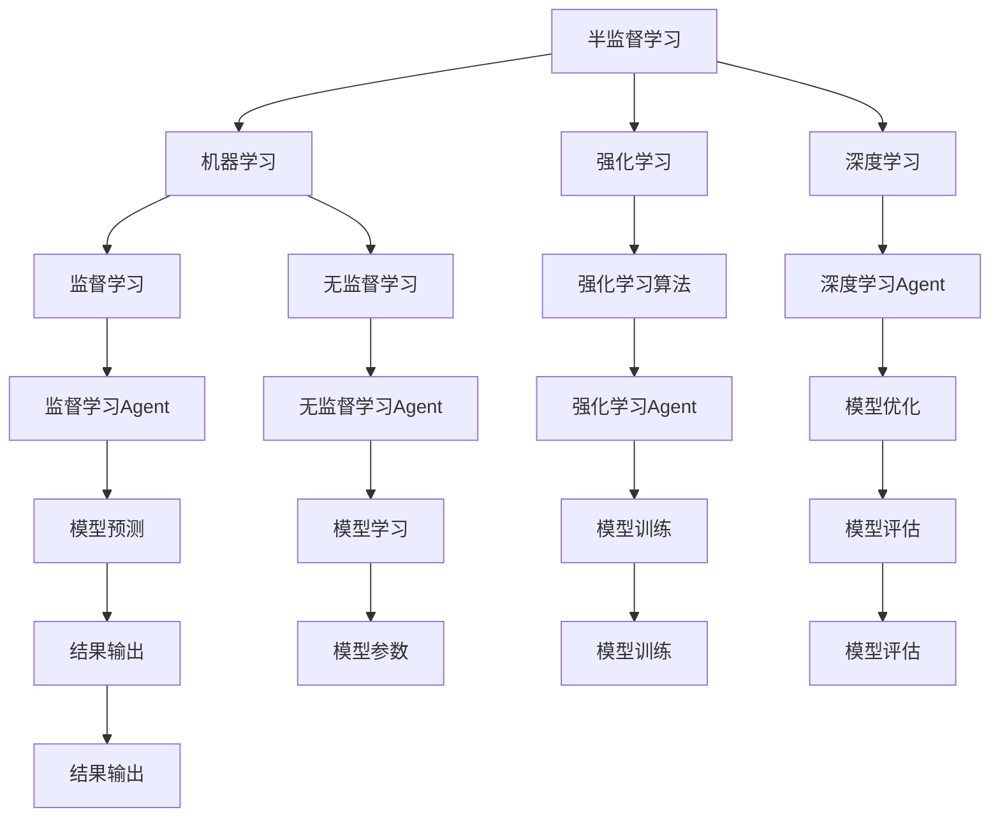

                 

# AI人工智能 Agent：使用半监督学习进行预测

> 关键词：AI, Agent, 半监督学习, 预测, 机器学习, 强化学习, 深度学习, 监督学习, 无监督学习, 迁移学习, 强化学习算法, 强化学习Agent, 模型优化

## 1. 背景介绍

### 1.1 问题由来
在人工智能(AI)领域，预测任务历来是研究的热点。通过模型学习历史数据，预测未来事件或变量，不仅可以提高决策的准确性和效率，还能极大地推动各个行业的智能化转型。然而，构建高质量的预测模型，需要大量的标注数据。在标注成本高昂且数据稀缺的情况下，如何提升模型的预测效果，一直是学界和产业界关注的焦点。

### 1.2 问题核心关键点
半监督学习（Semi-Supervised Learning, SSL）是一种有效缓解标注数据短缺问题的方法，其基本思想是在少量标注数据和大量无标签数据上联合训练模型，从而获得优异的预测性能。通过将监督学习和无监督学习相结合，SSL能够利用未标注数据的丰富信息，优化模型参数，降低标注成本，提高泛化能力。

### 1.3 问题研究意义
半监督学习在AI预测任务中的应用，有助于：

1. 降低开发成本：利用未标注数据，显著减少标注数据的需求，从而降低模型的开发和维护成本。
2. 提升预测效果：通过联合训练，充分挖掘未标注数据中的信息，增强模型的泛化能力和预测精度。
3. 加速技术创新：SSL作为一种前沿技术，推动了AI领域的理论研究与应用创新，为更多新算法的出现提供了平台。
4. 促进产业应用：通过改进预测模型的效果，提高各行各业智能化水平，提升业务运营效率。

## 2. 核心概念与联系

### 2.1 核心概念概述

为了更好地理解半监督学习在AI预测任务中的应用，本节将介绍几个密切相关的核心概念：

- 半监督学习(Semi-Supervised Learning, SSL)：在少量标注数据和大量无标签数据上联合训练模型，从而提高预测能力的方法。
- 机器学习(Machine Learning, ML)：通过数据训练模型，使其能够自动化的预测未知数据的输出。
- 强化学习(Reinforcement Learning, RL)：通过与环境交互，使模型学习最优决策策略的AI学习范式。
- 深度学习(Deep Learning, DL)：通过构建多层神经网络模型，模拟人类大脑的神经网络结构，实现复杂任务的高效求解。
- 监督学习(Supervised Learning, SL)：利用已标注数据训练模型，使其能够对新的标注数据进行预测。
- 无监督学习(Unsupervised Learning, USSL)：利用未标注数据训练模型，发现数据中的潜在结构和模式。
- 迁移学习(Transfer Learning, TL)：将一个领域学习到的知识迁移到另一个领域，以提高新任务的预测能力。

这些概念之间的逻辑关系可以通过以下Mermaid流程图来展示：



这个流程图展示了一些核心概念之间的关系：

1. 半监督学习与其他机器学习方法的关系：半监督学习融合了监督学习和无监督学习的优点。
2. 强化学习Agent与其他Agent的关系：强化学习Agent可以结合无监督学习和监督学习Agent的特点，通过与环境的交互优化模型。
3. 深度学习Agent与其他Agent的关系：深度学习Agent利用神经网络的强大表达能力，提升模型预测能力。
4. 模型优化与模型训练的关系：模型优化通过不断调整模型参数，提升模型的预测效果。
5. 模型预测与结果输出的关系：模型预测基于训练好的模型进行输出。
6. 无监督学习Agent与模型学习的关系：无监督学习Agent挖掘未标注数据的潜在模式，帮助模型学习。

这些概念共同构成了AI预测任务的理论基础，为模型的训练和预测提供了指导。

## 3. 核心算法原理 & 具体操作步骤
### 3.1 算法原理概述

半监督学习的核心思想是在少量标注数据和大量无标签数据上联合训练模型，通过最大化模型在标注数据上的损失，同时最小化模型在无标签数据上的损失，来提升模型的泛化能力。

假设存在一个标注数据集 $D_s$ 和无标签数据集 $D_u$，其中 $D_s=\{(x_i,y_i)\}_{i=1}^N$，$D_u=\{x_i\}_{i=1}^{M}$。半监督学习的目标是通过联合训练模型 $f(x)$ 和标注数据上的损失函数 $L_s$ 和无标签数据上的损失函数 $L_u$，优化模型的参数 $\theta$。

数学上，目标函数可以表示为：

$$
\min_{\theta} \mathcal{L}(\theta) = \lambda_s L_s(f(x_i,y_i)) + \lambda_u L_u(f(x_i))
$$

其中 $\lambda_s$ 和 $\lambda_u$ 为损失函数的权值，用于控制标注数据和无标签数据的相对重要性。

在实际应用中，通常采用期望最大化(Expectation Maximization, EM)算法或图半监督学习(Graph-based Semi-supervised Learning)等方法进行模型训练。这些算法通过迭代优化，不断更新模型参数，最大化目标函数，从而提升模型的预测能力。

### 3.2 算法步骤详解

半监督学习在AI预测任务中的应用，一般包括以下几个关键步骤：

**Step 1: 数据准备**
- 收集少量标注数据 $D_s$ 和大量无标签数据 $D_u$。标注数据需包含预测变量 $y$ 和对应的输入变量 $x$。

**Step 2: 选择合适的模型**
- 根据任务类型，选择适合的预测模型 $f(x)$，如线性回归、支持向量机、神经网络等。

**Step 3: 设计损失函数**
- 根据任务需求，设计合适的损失函数 $L_s$ 和 $L_u$。对于回归任务，可以使用均方误差损失；对于分类任务，可以使用交叉熵损失。

**Step 4: 初始化模型**
- 将模型 $f(x)$ 的参数 $\theta$ 初始化为随机值或预设值。

**Step 5: 联合训练**
- 在标注数据 $D_s$ 上使用监督学习算法训练模型，同时在无标签数据 $D_u$ 上使用无监督学习算法优化模型。
- 通过迭代优化，不断调整模型参数 $\theta$，最大化目标函数 $\mathcal{L}(\theta)$。

**Step 6: 模型评估与验证**
- 在验证集上评估模型性能，选择最佳模型作为最终模型。
- 在测试集上进一步验证模型的泛化能力。

**Step 7: 模型应用**
- 将训练好的模型应用于实际预测任务，生成预测结果。

### 3.3 算法优缺点

半监督学习在AI预测任务中的应用，具有以下优点：

1. 数据利用率高：利用未标注数据，显著降低标注成本，提升数据利用率。
2. 泛化能力强：通过联合训练，模型能够更好地捕捉数据中的潜在模式和结构。
3. 模型性能提升：通过增加数据量，提升模型在标注数据上的预测能力。

同时，半监督学习也存在以下缺点：

1. 模型选择困难：选择合适的模型和损失函数对模型性能至关重要，但需要领域知识。
2. 参数优化复杂：需要优化更多参数，增加训练复杂度。
3. 数据质量要求高：未标注数据质量对模型性能影响较大，需保证数据质量。

尽管存在这些缺点，半监督学习在处理标注数据稀缺问题上具有独特的优势，成为AI预测任务中不可或缺的一部分。

### 3.4 算法应用领域

半监督学习在AI预测任务中的应用，覆盖了多个领域，具体如下：

- 金融预测：如股票价格预测、信用风险评估等。通过联合训练标注和未标注数据，提升模型的预测能力。
- 医学诊断：如疾病预测、基因表达分析等。利用未标注基因数据，优化模型在标注数据上的诊断效果。
- 自然语言处理：如文本分类、情感分析、命名实体识别等。通过联合训练大量未标注文本数据，提升模型的分类和生成能力。
- 图像处理：如物体识别、图像分割等。利用未标注图像数据，优化模型在标注数据上的分类和分割效果。
- 推荐系统：如用户行为预测、商品推荐等。通过联合训练用户历史行为数据和未标注数据，提升推荐系统的精准度。

除了这些应用领域，半监督学习还在更多领域展示了其潜力，如社交网络分析、安全监控、工业制造等，为各行各业智能化转型提供了有力支撑。

## 4. 数学模型和公式 & 详细讲解 & 举例说明

### 4.1 数学模型构建

在半监督学习中，我们通常采用自编码器(Autoencoder)作为基础模型。自编码器的目标是将输入数据 $x$ 映射到潜在表示 $z$，再从潜在表示 $z$ 映射回原始数据 $x$，最小化两者之间的差异。其损失函数可以表示为：

$$
L(x,z) = ||x-z||^2 + ||z-x||^2
$$

其中 $||x-z||^2$ 和 $||z-x||^2$ 分别表示输入和输出的重构误差。在标注数据 $D_s$ 上，我们添加监督信号 $y$，损失函数可以表示为：

$$
L_s(x,y,z,\theta) = L(x,z,\theta) + \lambda_s \ell(f(x,y),y)
$$

其中 $\ell$ 为标注数据的损失函数，如交叉熵损失。在无标签数据 $D_u$ 上，我们添加无监督信号 $p(z|x)$，损失函数可以表示为：

$$
L_u(x,z,\theta) = L(x,z,\theta) + \lambda_u D_{KL}(p(z|x)||q(z|x))
$$

其中 $p(z|x)$ 为生成数据的概率分布，$q(z|x)$ 为模型预测的分布。$D_{KL}$ 为KL散度，用于衡量两个分布的差异。

### 4.2 公式推导过程

以下是自编码器在半监督学习中的应用，进行公式推导：

**Step 1: 标注数据上的损失函数推导**

对于标注数据 $D_s$，假设存在 $N$ 个样本，目标函数可以表示为：

$$
\min_{\theta} \mathcal{L}(\theta) = \frac{1}{N} \sum_{i=1}^N L_s(x_i,y_i,z_i,\theta)
$$

其中 $x_i$ 和 $y_i$ 分别为输入和标签，$z_i$ 为模型预测的潜在表示。

在自编码器中，输入数据 $x_i$ 首先通过编码器 $f(x)$ 映射到潜在表示 $z_i$，然后通过解码器 $g(z)$ 映射回原始数据 $x_i'$。目标函数可以表示为：

$$
L_s(x_i,y_i,z_i,\theta) = ||x_i-z_i||^2 + \lambda_s \ell(f(x_i),y_i)
$$

**Step 2: 无标签数据上的损失函数推导**

对于无标签数据 $D_u$，假设存在 $M$ 个样本，目标函数可以表示为：

$$
\min_{\theta} \mathcal{L}(\theta) = \frac{1}{M} \sum_{i=1}^M L_u(x_i,z_i,\theta)
$$

其中 $x_i$ 为输入数据，$z_i$ 为模型预测的潜在表示。

在自编码器中，输入数据 $x_i$ 首先通过编码器 $f(x)$ 映射到潜在表示 $z_i$，然后通过解码器 $g(z)$ 映射回原始数据 $x_i'$。目标函数可以表示为：

$$
L_u(x_i,z_i,\theta) = ||x_i-z_i||^2 + \lambda_u D_{KL}(p(z|x_i)||q(z|x_i))
$$

其中 $p(z|x_i)$ 为生成数据的概率分布，$q(z|x_i)$ 为模型预测的分布。$D_{KL}$ 为KL散度，用于衡量两个分布的差异。

**Step 3: 联合训练**

联合训练目标函数可以表示为：

$$
\min_{\theta} \mathcal{L}(\theta) = \frac{1}{N} \sum_{i=1}^N L_s(x_i,y_i,z_i,\theta) + \frac{1}{M} \sum_{i=1}^M L_u(x_i,z_i,\theta)
$$

通过优化联合训练目标函数，最大化模型在标注数据上的损失，同时最小化模型在无标签数据上的损失，从而提升模型的泛化能力。

### 4.3 案例分析与讲解

以股票价格预测为例，展示半监督学习在金融预测中的应用：

假设我们收集到了 1000 个已标注的股票价格数据和 10000 个未标注的股票价格数据。我们选择了线性回归模型作为基础模型，标注数据和未标注数据的损失函数分别为：

$$
L_s(x,y,z,\theta) = ||x-z||^2 + \lambda_s (y - f(x))^2
$$

$$
L_u(x,z,\theta) = ||x-z||^2 + \lambda_u D_{KL}(p(z|x)||q(z|x))
$$

其中 $x$ 为股票价格，$y$ 为实际价格，$z$ 为模型预测的潜在表示，$f(x)$ 为线性回归函数，$p(z|x)$ 为生成数据的概率分布，$q(z|x)$ 为模型预测的分布。

在联合训练过程中，我们通过优化目标函数：

$$
\min_{\theta} \mathcal{L}(\theta) = \frac{1}{1000} \sum_{i=1}^{1000} L_s(x_i,y_i,z_i,\theta) + \frac{1}{10000} \sum_{i=1}^{10000} L_u(x_i,z_i,\theta)
$$

通过不断调整模型参数 $\theta$，最大化模型在标注数据上的损失，同时最小化模型在无标签数据上的损失，最终得到一个能够在标注数据和未标注数据上都表现良好的预测模型。

## 5. 项目实践：代码实例和详细解释说明
### 5.1 开发环境搭建

在进行半监督学习项目实践前，我们需要准备好开发环境。以下是使用Python进行PyTorch开发的环境配置流程：

1. 安装Anaconda：从官网下载并安装Anaconda，用于创建独立的Python环境。

2. 创建并激活虚拟环境：
```bash
conda create -n pytorch-env python=3.8 
conda activate pytorch-env
```

3. 安装PyTorch：根据CUDA版本，从官网获取对应的安装命令。例如：
```bash
conda install pytorch torchvision torchaudio cudatoolkit=11.1 -c pytorch -c conda-forge
```

4. 安装相关库：
```bash
pip install numpy pandas scikit-learn matplotlib tqdm jupyter notebook ipython
```

5. 安装必要的Python包：
```bash
pip install torch torchvision
```

完成上述步骤后，即可在`pytorch-env`环境中开始半监督学习实践。

### 5.2 源代码详细实现

下面我们以半监督学习在金融预测中的应用为例，给出使用PyTorch实现自编码器的代码实现。

首先，定义自编码器模型：

```python
import torch
import torch.nn as nn

class Autoencoder(nn.Module):
    def __init__(self, input_size, hidden_size):
        super(Autoencoder, self).__init__()
        self.encoder = nn.Sequential(
            nn.Linear(input_size, hidden_size),
            nn.ReLU()
        )
        self.decoder = nn.Sequential(
            nn.Linear(hidden_size, input_size),
            nn.Sigmoid()
        )
    
    def forward(self, x):
        x = self.encoder(x)
        x = self.decoder(x)
        return x
```

然后，定义半监督学习训练函数：

```python
def semi_supervised_train(data, model, device, learning_rate, num_epochs, batch_size):
    criterion = nn.MSELoss()
    optimizer = torch.optim.Adam(model.parameters(), lr=learning_rate)
    
    for epoch in range(num_epochs):
        for batch_idx, (x, y) in enumerate(data.train_loader(batch_size)):
            x = x.to(device)
            y = y.to(device)
            optimizer.zero_grad()
            recon_x = model(x)
            loss = criterion(recon_x, x)
            loss.backward()
            optimizer.step()
        print('Epoch [%d/%d], Loss: %.4f' % (epoch+1, num_epochs, loss.item()))
```

最后，启动半监督学习训练流程：

```python
# 加载数据集
train_dataset = ...
val_dataset = ...
test_dataset = ...
train_loader = ...
val_loader = ...
test_loader = ...
```

```python
# 定义模型和设备
model = Autoencoder(input_size, hidden_size)
device = torch.device('cuda') if torch.cuda.is_available() else torch.device('cpu')
model.to(device)

# 定义超参数
learning_rate = 0.001
num_epochs = 100
batch_size = 64

# 训练模型
semi_supervised_train(train_loader, model, device, learning_rate, num_epochs, batch_size)

# 在测试集上评估模型性能
test_loss = semi_supervised_train(test_loader, model, device, learning_rate, 1, batch_size)
print('Test Loss: %.4f' % test_loss)
```

以上就是使用PyTorch实现自编码器并进行半监督学习的完整代码实现。可以看到，PyTorch提供了强大的深度学习框架，方便开发者实现复杂的半监督学习模型。

### 5.3 代码解读与分析

让我们再详细解读一下关键代码的实现细节：

**Autoencoder类**：
- `__init__`方法：初始化编码器和解码器，包含线性层和激活函数。
- `forward`方法：前向传播计算，先通过编码器映射到潜在表示，再通过解码器映射回原始数据。

**semi_supervised_train函数**：
- 定义损失函数和优化器：均方误差损失函数和Adam优化器。
- 通过迭代优化，不断调整模型参数，最小化损失函数。
- 在每个epoch结束后，打印当前损失。

**训练流程**：
- 加载训练数据集、验证数据集和测试数据集。
- 定义模型和设备。
- 定义超参数。
- 训练模型。
- 在测试集上评估模型性能。

可以看到，PyTorch配合深度学习框架，使得半监督学习的实现变得简洁高效。开发者可以将更多精力放在数据处理、模型改进等高层逻辑上，而不必过多关注底层的实现细节。

当然，工业级的系统实现还需考虑更多因素，如模型的保存和部署、超参数的自动搜索、更灵活的任务适配层等。但核心的半监督学习范式基本与此类似。

## 6. 实际应用场景
### 6.1 金融预测

在金融领域，预测市场趋势、股票价格、信用风险等，具有重要的实际意义。传统的金融预测方法，往往需要大量历史数据进行统计分析，模型复杂且难以解释。半监督学习提供了更为简洁有效的解决方案，利用未标注数据提升预测效果。

具体而言，可以收集金融市场的历史数据和未标注的交易数据，将历史数据作为标注数据，构建自编码器模型。在训练过程中，将标注数据和未标注数据联合训练，优化模型参数。训练好的模型即可用于预测未来市场趋势、股票价格等金融变量。

### 6.2 医学诊断

在医疗领域，诊断疾病的准确性直接关系到患者的健康和生命安全。传统的诊断方法，依赖于医生经验，存在主观性和误差。半监督学习提供了更为客观、可靠的解决方案，通过联合训练未标注基因数据和标注病历数据，提升诊断模型效果。

具体而言，可以收集大量的医疗病历和未标注基因数据，将病历数据作为标注数据，构建自编码器模型。在训练过程中，将标注数据和未标注数据联合训练，优化模型参数。训练好的模型即可用于疾病预测和基因表达分析，辅助医生诊断和治疗。

### 6.3 自然语言处理

在自然语言处理领域，预测文本的情感、主题、命名实体等，具有重要的实际意义。传统的处理方法，需要大量人工标注数据，成本高且效果有限。半监督学习提供了更为高效、成本低的解决方案，通过联合训练未标注文本数据和标注数据，提升预测模型效果。

具体而言，可以收集大量的未标注文本数据和标注数据，构建自编码器模型。在训练过程中，将标注数据和未标注数据联合训练，优化模型参数。训练好的模型即可用于情感分析、文本分类等任务，提升文本处理的智能化水平。

### 6.4 未来应用展望

随着半监督学习技术的不断发展，其在AI预测任务中的应用将更为广泛，带来更多行业变革：

- 智能制造：通过联合训练未标注生产数据和标注数据，提升制造过程的预测和优化能力，提高生产效率。
- 智慧城市：通过联合训练未标注交通数据和标注数据，提升城市交通的预测和优化能力，提高城市管理水平。
- 环境监测：通过联合训练未标注环境数据和标注数据，提升环境监测的预测和优化能力，保护生态环境。
- 生物医药：通过联合训练未标注基因数据和标注数据，提升疾病的预测和诊断能力，推动医疗技术的发展。

半监督学习在更多领域展示了其潜力，为各行各业智能化转型提供了有力支撑。相信随着技术的日益成熟，半监督学习必将在更多应用场景中发挥重要作用，推动AI技术的不断进步。

## 7. 工具和资源推荐
### 7.1 学习资源推荐

为了帮助开发者系统掌握半监督学习在AI预测任务中的应用，这里推荐一些优质的学习资源：

1. 《Semi-Supervised Learning with Deep Generative Models》论文：展示了半监督学习在自编码器中的应用，提供了详细的算法推导和实验结果。
2. Coursera《机器学习》课程：斯坦福大学开设的机器学习经典课程，详细介绍了监督学习和无监督学习的原理和方法。
3. 《Deep Learning for Good》书籍：TensorFlow官方出版的书籍，涵盖了半监督学习、迁移学习等前沿主题。
4. PyTorch官方文档：提供了详细的半监督学习API接口和样例代码，是上手实践的最佳参考。
5. Kaggle竞赛：参加半监督学习相关的Kaggle竞赛，实践解决实际问题，提升学习效果。

通过对这些资源的学习实践，相信你一定能够快速掌握半监督学习的精髓，并用于解决实际的AI预测问题。

### 7.2 开发工具推荐

高效的开发离不开优秀的工具支持。以下是几款用于半监督学习开发的常用工具：

1. PyTorch：基于Python的开源深度学习框架，支持灵活的计算图，适合快速迭代研究。
2. TensorFlow：由Google主导开发的开源深度学习框架，生产部署方便，适合大规模工程应用。
3. Keras：基于Python的深度学习框架，易于使用，提供了丰富的预训练模型和API接口。
4. H2O.ai：企业级机器学习平台，支持半监督学习、深度学习等技术，提供一站式解决方案。
5. Scikit-learn：基于Python的机器学习库，支持多种监督学习和无监督学习算法。

合理利用这些工具，可以显著提升半监督学习的开发效率，加快创新迭代的步伐。

### 7.3 相关论文推荐

半监督学习在AI预测任务中的应用，受到了学界和产业界的广泛关注。以下是几篇奠基性的相关论文，推荐阅读：

1. Semi-Supervised Learning with Deep Generative Models：展示了半监督学习在自编码器中的应用，提供了详细的算法推导和实验结果。
2. Generative Adversarial Nets（即GAN）：提出了生成对抗网络，利用生成器和判别器联合训练，提升生成模型的效果。
3. Semi-Supervised Learning for Scientific Discovery：展示了半监督学习在科学发现中的应用，提供了详细的实验结果和分析。
4. Deep Learning for Unsupervised Learning：展示了深度学习在无监督学习中的应用，提供了详细的算法推导和实验结果。
5. Self-Training with Adversarial Cohort Learning：展示了半监督学习在自训练中的应用，提供了详细的算法推导和实验结果。

这些论文代表了大语言模型微调技术的发展脉络。通过学习这些前沿成果，可以帮助研究者把握学科前进方向，激发更多的创新灵感。

## 8. 总结：未来发展趋势与挑战

### 8.1 总结

本文对基于半监督学习在AI预测任务中的应用进行了全面系统的介绍。首先阐述了半监督学习的基本原理和应用意义，明确了半监督学习在标注数据稀缺情况下的独特价值。其次，从原理到实践，详细讲解了半监督学习的数学原理和关键步骤，给出了半监督学习任务开发的完整代码实例。同时，本文还广泛探讨了半监督学习在金融预测、医学诊断、自然语言处理等多个领域的应用前景，展示了半监督学习的巨大潜力。

通过本文的系统梳理，可以看到，半监督学习在处理标注数据稀缺问题上具有独特的优势，成为AI预测任务中不可或缺的一部分。其在大规模未标注数据上的高效利用，显著降低了标注成本，提升了模型性能。未来，伴随技术的不断发展，半监督学习必将在更多应用场景中发挥重要作用，推动AI技术的不断进步。

### 8.2 未来发展趋势

展望未来，半监督学习在AI预测任务中的应用将呈现以下几个发展趋势：

1. 数据利用率提升：通过联合训练未标注数据，进一步提升数据利用率，降低标注成本。
2. 模型泛化能力增强：通过联合训练未标注数据，提升模型在标注数据上的泛化能力和预测效果。
3. 多模态预测方法涌现：结合图像、语音、文本等多种模态数据，提升预测模型的准确性和鲁棒性。
4. 自动化超参数优化：通过自动化调参，提升模型训练效率和效果，降低人工调参成本。
5. 集成多种半监督方法：将半监督学习与迁移学习、深度强化学习等方法结合，提升预测模型的效果和鲁棒性。

这些趋势凸显了半监督学习在AI预测任务中的重要地位，为更多行业智能化转型提供了有力支撑。相信随着技术的不断进步，半监督学习必将在更广泛的应用领域中发挥重要作用，推动AI技术的全面落地。

### 8.3 面临的挑战

尽管半监督学习在AI预测任务中的应用取得了显著进展，但在迈向更加智能化、普适化应用的过程中，它仍面临着诸多挑战：

1. 数据质量要求高：未标注数据的质量直接影响模型性能，需保证数据质量。
2. 模型选择困难：选择合适的模型和损失函数对模型性能至关重要，但需要领域知识。
3. 训练复杂度高：半监督学习需要优化更多参数，增加训练复杂度。
4. 解释性不足：半监督学习模型往往缺乏解释性，难以理解模型的决策过程。
5. 应用场景局限：半监督学习在特定领域的应用效果有限，需结合领域特点进行优化。

尽管存在这些挑战，半监督学习在处理标注数据稀缺问题上具有独特的优势，成为AI预测任务中不可或缺的一部分。相信随着技术的不断成熟，这些挑战终将一一被克服，半监督学习必将在更多应用场景中发挥重要作用，推动AI技术的不断进步。

### 8.4 研究展望

未来，半监督学习在AI预测任务中的应用方向可以集中在以下几个方面：

1. 引入更多的先验知识：将符号化的先验知识，如知识图谱、逻辑规则等，与半监督学习模型结合，引导模型学习更准确、合理的预测结果。
2. 结合强化学习：利用强化学习的思想，通过与环境的交互，进一步提升半监督学习模型的预测能力。
3. 引入因果推断：通过引入因果推断的思想，增强模型的因果关系，提高预测的可靠性和鲁棒性。
4. 引入图半监督学习：利用图结构优化半监督学习算法，提升模型的预测效果和解释性。
5. 引入多模态数据融合：结合图像、语音、文本等多种模态数据，提升预测模型的准确性和鲁棒性。

这些研究方向将进一步推动半监督学习技术的发展，为AI预测任务提供更为强大的支持。相信随着技术的不断进步，半监督学习必将在更多应用场景中发挥重要作用，推动AI技术的全面落地。

## 9. 附录：常见问题与解答

**Q1：半监督学习在标注数据稀缺的情况下，如何提升模型性能？**

A: 半监督学习通过联合训练未标注数据和标注数据，利用未标注数据的丰富信息，提升模型泛化能力和预测效果。具体而言，可以通过以下方法提升模型性能：

1. 数据增强：通过回译、近义替换等方式扩充训练集。
2. 自编码器模型：通过自编码器构建潜在表示，利用潜在表示优化标注数据上的损失函数。
3. 联合训练策略：在标注数据和未标注数据上交替训练，提升模型泛化能力。
4. 无监督学习技术：利用无监督学习技术，如自生成模型，挖掘未标注数据的潜在模式。

这些方法可以在标注数据稀缺的情况下，显著提升半监督学习模型的预测性能。

**Q2：半监督学习在处理高维数据时，如何提升模型性能？**

A: 高维数据在半监督学习中，往往会导致维度灾难和计算负担加重。为提升模型性能，可以采用以下方法：

1. 特征选择：通过特征选择技术，降低数据的维度，减少计算负担。
2. 低秩分解：利用低秩分解技术，将高维数据转化为低维表示，提升模型效率。
3. 自编码器模型：利用自编码器模型，学习数据的潜在表示，降低计算负担。
4. 稀疏表示学习：利用稀疏表示学习技术，压缩高维数据，提升模型性能。

这些方法可以在处理高维数据时，显著提升半监督学习模型的预测性能。

**Q3：半监督学习在处理缺失数据时，如何提升模型性能？**

A: 处理缺失数据是半监督学习中的一个常见问题。为提升模型性能，可以采用以下方法：

1. 数据补全：利用插值、回归等方法，补全缺失数据，提升模型训练效果。
2. 多任务学习：将缺失数据与其他任务的数据联合训练，提升模型泛化能力。
3. 自编码器模型：利用自编码器模型，学习数据的潜在表示，补全缺失数据。
4. 数据融合：利用数据融合技术，结合缺失数据和非缺失数据，提升模型性能。

这些方法可以在处理缺失数据时，显著提升半监督学习模型的预测性能。

**Q4：半监督学习在处理非结构化数据时，如何提升模型性能？**

A: 半监督学习在处理非结构化数据时，需要将其转化为结构化数据进行训练。为提升模型性能，可以采用以下方法：

1. 特征提取：利用自然语言处理、计算机视觉等技术，提取非结构化数据的特征。
2. 自编码器模型：利用自编码器模型，学习非结构化数据的潜在表示，提升模型性能。
3. 多模态数据融合：结合图像、语音、文本等多种模态数据，提升模型预测效果。
4. 数据增强：通过数据增强技术，扩充非结构化数据的训练集，提升模型泛化能力。

这些方法可以在处理非结构化数据时，显著提升半监督学习模型的预测性能。

**Q5：半监督学习在处理复杂数据分布时，如何提升模型性能？**

A: 处理复杂数据分布是半监督学习中的另一个常见问题。为提升模型性能，可以采用以下方法：

1. 数据生成模型：利用数据生成模型，生成复杂数据分布的样本，提升模型训练效果。
2. 自生成模型：利用自生成模型，生成复杂数据分布的样本，提升模型泛化能力。
3. 多任务学习：将复杂数据分布与其他任务的数据联合训练，提升模型泛化能力。
4. 数据融合：利用数据融合技术，结合复杂数据分布和非复杂数据分布，提升模型性能。

这些方法可以在处理复杂数据分布时，显著提升半监督学习模型的预测性能。

---

作者：禅与计算机程序设计艺术 / Zen and the Art of Computer Programming

