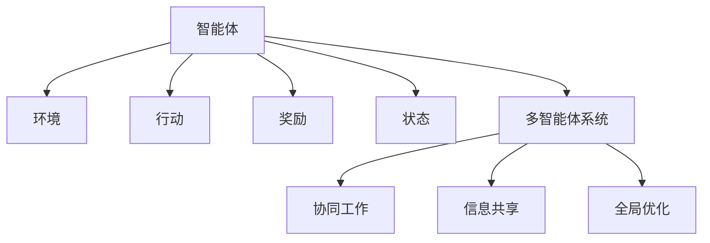

                 

# AI人工智能 Agent：公共交通调度中智能体的应用

## 1. 背景介绍

随着城市化进程的加快，公共交通系统变得越来越复杂。如何在有限的资源下，有效规划和调度公交车、地铁、轻轨等交通工具，以最大化服务质量和运营效率，成为了公共服务管理的重要课题。AI人工智能技术，特别是智能体（Agent）在公共交通调度的应用，为这一问题提供了新的解决方案。

### 1.1 问题由来
在传统的公共交通调度中，调度员依赖经验和对历史数据的分析来制定调度策略。这种方法存在以下缺点：
1. 依赖人工经验和判断，容易出现人为误差。
2. 缺乏系统性，难以处理大规模、实时变化的场景。
3. 资源分配不合理，容易导致高峰期拥堵，非高峰期资源浪费。

AI智能体的引入，为公共交通调度提供了全新的视角。通过智能体，可以构建一个自动化的调度系统，实现对交通网络的系统分析和实时响应，优化资源分配，提升服务质量，降低运营成本。

### 1.2 问题核心关键点
智能体在公共交通调度中的核心关键点包括：
1. **智能体的定义**：智能体是能够感知环境、采取行动、实现特定目标的自主决策单元。
2. **环境感知与决策**：智能体需要实时感知交通环境，包括车辆位置、乘客需求、路况信息等，做出合理的决策。
3. **协同与通信**：智能体之间需要协同工作，共享信息和决策，以实现全局优化。
4. **目标优化**：智能体的目标可能是最小化拥堵、最大化服务效率、最小化等待时间等。
5. **算法与模型**：选择合适的算法和模型，如强化学习、多智能体系统、分布式优化等，以实现智能体的自动化运行。

## 2. 核心概念与联系

### 2.1 核心概念概述

为更好地理解智能体在公共交通调度中的应用，本节将介绍几个密切相关的核心概念：

- **智能体（Agent）**：能够感知环境、采取行动、实现特定目标的自主决策单元。
- **环境（Environment）**：智能体所处的外部世界，包括物理环境、社会环境、政策法规等。
- **行动（Action）**：智能体为实现目标所采取的具体操作。
- **奖励（Reward）**：智能体在特定行动后获得的反馈，用于评估和指导后续决策。
- **状态（State）**：智能体和环境的当前状态，用于描述系统的整体情况。
- **多智能体系统（Multi-agent System,MAS）**：由多个智能体共同构成的系统，各智能体之间需要协同工作，共享信息和决策。

这些核心概念之间的逻辑关系可以通过以下Mermaid流程图来展示：



这个流程图展示了一个智能体与环境、行动、奖励、状态等核心概念之间的关系，以及智能体与多智能体系统的协同工作、信息共享和全局优化等特性。

## 3. 核心算法原理 & 具体操作步骤
### 3.1 算法原理概述

基于智能体的公共交通调度，本质上是一个多智能体决策问题。其核心思想是：通过构建智能体模型，模拟公共交通网络中的各类实体（如公交车、乘客、路况），利用环境感知和决策算法，实现系统级的资源优化和调度。

形式化地，假设公共交通网络由 $N$ 个智能体组成，每个智能体的状态表示为 $\mathbf{s}_i$，行动表示为 $\mathbf{a}_i$，奖励表示为 $r_i$，目标表示为 $R_i$。智能体通过感知环境 $\mathcal{E}$ 中的状态 $\mathbf{s}_t$，执行行动 $\mathbf{a}_t$，获得奖励 $r_t$，最终使系统达到目标 $R_t$。因此，智能体的优化目标为：

$$
\max_{\mathbf{a}_1,\mathbf{a}_2,\dots,\mathbf{a}_N} R = \sum_{i=1}^N R_i(\mathbf{s}_1,\mathbf{s}_2,\dots,\mathbf{s}_N)
$$

其中，$R_i(\mathbf{s}_1,\mathbf{s}_2,\dots,\mathbf{s}_N)$ 表示智能体 $i$ 的目标函数，与环境状态和其它智能体的状态相关。

### 3.2 算法步骤详解

基于智能体的公共交通调度，一般包括以下几个关键步骤：

**Step 1: 构建智能体模型**
- 定义智能体的状态、行动和目标函数，包括车辆位置、乘客数量、路况信息等。
- 选择适当的模型框架，如基于Q-learning、DQN、Actor-Critic等强化学习算法。

**Step 2: 环境感知与决策**
- 使用传感器和信息收集技术，实时获取交通网络的状态信息。
- 将感知结果转化为智能体可用的状态表示。
- 根据当前状态和目标，智能体设计并执行相应的行动。

**Step 3: 奖励设计**
- 根据智能体的行动和环境状态，计算并分配相应的奖励。
- 奖励设计需要考虑多方面的因素，如服务质量、资源利用效率、乘客满意度等。

**Step 4: 系统优化与仿真**
- 构建多智能体系统的仿真环境，模拟实际公共交通网络的运行。
- 通过反复迭代和优化，使智能体逐步学习到最优的调度策略。
- 在仿真过程中，记录和分析系统性能指标，如平均等待时间、拥堵程度、能源消耗等。

**Step 5: 部署与评估**
- 将训练好的智能体模型部署到实际的公共交通调度系统中。
- 监控系统的实际运行情况，评估智能体的性能。
- 根据反馈结果，调整模型参数和调度策略，不断优化系统。

以上是基于智能体的公共交通调度的核心步骤。在实际应用中，还需要针对具体问题进行优化设计，如引入更好的状态表示方法、设计更有效的奖励函数、优化智能体间的协同机制等。

### 3.3 算法优缺点

基于智能体的公共交通调度具有以下优点：
1. 自动化调度：智能体可以自主决策，减少人为干预，提高调度效率。
2. 实时响应：智能体能够实时感知环境变化，动态调整调度策略，适应高峰期的流量需求。
3. 全局优化：通过多智能体协同工作，实现全局资源优化和调度，提高整体服务质量。
4. 灵活性高：智能体模型可以根据不同的场景和需求进行调整和优化。

同时，该方法也存在一定的局限性：
1. 模型复杂度高：构建智能体模型需要大量的工程和理论投入。
2. 仿真成本高：大规模仿真测试需要高性能计算资源。
3. 数据需求大：需要大量历史数据和实时数据，才能训练出高效准确的智能体模型。
4. 集成难度大：将智能体模型集成到实际调度系统中，需要克服技术和管理上的挑战。

尽管存在这些局限性，但就目前而言，基于智能体的公共交通调度方法仍是最先进和实用的方案之一。未来相关研究的重点在于如何进一步简化模型复杂度、降低仿真成本、减少数据需求，并提高模型的可集成性。

### 3.4 算法应用领域

基于智能体的公共交通调度方法，已经在多个实际应用中取得了显著成效：

- **城市公共交通**：通过智能体模型对公交车、地铁等交通工具进行调度，实现最优的路线规划、站点分配和时序安排，降低乘客等待时间，提升服务效率。
- **货运物流**：智能体模型在物流配送中心，负责车辆的调度和路径规划，优化货物运输流程，提高配送速度和效率。
- **智能电网**：智能体模型在电力系统中，负责电力的调度和管理，优化能源的分配和利用，降低能源消耗和运营成本。
- **航空运输**：智能体模型在航空交通中，负责航班调度和机场管理，优化空域资源，提升航班准点率。
- **自动驾驶**：智能体模型在自动驾驶车辆中，负责路径规划和避障决策，提高行车安全和效率。

除了这些具体应用外，智能体方法还被拓展到更多的领域，如城市管理、交通控制、环境监测等，为各种复杂系统的智能化和自动化提供了新的思路和方法。

## 4. 数学模型和公式 & 详细讲解 & 举例说明
### 4.1 数学模型构建

本节将使用数学语言对基于智能体的公共交通调度过程进行更加严格的刻画。

假设公共交通网络由 $N$ 个智能体组成，每个智能体的状态表示为 $\mathbf{s}_i=(s_{i1},s_{i2},\dots,s_{im})$，其中 $s_{ij}$ 表示智能体 $i$ 在时间 $t$ 的状态变量 $j$。智能体的行动表示为 $\mathbf{a}_i=(a_{i1},a_{i2},\dots,a_{in})$，其中 $a_{ij}$ 表示智能体 $i$ 在时间 $t$ 执行的行动 $j$。智能体的目标函数表示为 $R_i(\mathbf{s}_1,\mathbf{s}_2,\dots,\mathbf{s}_N)$。

定义智能体在时间 $t$ 的状态为 $\mathbf{s}_t=(\mathbf{s}_1,\mathbf{s}_2,\dots,\mathbf{s}_N)$，智能体在时间 $t$ 的行动为 $\mathbf{a}_t=(\mathbf{a}_1,\mathbf{a}_2,\dots,\mathbf{a}_N)$，智能体在时间 $t$ 的奖励为 $r_t=(r_1,r_2,\dots,r_N)$，智能体在时间 $t$ 的目标为 $R_t=(R_1,R_2,\dots,R_N)$。

智能体的优化目标可以表示为：

$$
\max_{\mathbf{a}_1,\mathbf{a}_2,\dots,\mathbf{a}_N} R = \sum_{i=1}^N R_i(\mathbf{s}_1,\mathbf{s}_2,\dots,\mathbf{s}_N)
$$

其中，$R_i(\mathbf{s}_1,\mathbf{s}_2,\dots,\mathbf{s}_N)$ 表示智能体 $i$ 的目标函数，与环境状态和其它智能体的状态相关。

### 4.2 公式推导过程

以下我们以城市公交车调度为例，推导智能体的优化目标和行动选择过程。

假设公交车在时间 $t$ 的状态 $\mathbf{s}_i=(\text{位置}, \text{乘客数})$，行动 $\mathbf{a}_i=(a_\text{左}, a_\text{右}, a_\text{停})$，目标 $R_i=(w_\text{准时}, w_\text{效率}, w_\text{舒适})$。

公交车的优化目标可以表示为：

$$
\max_{\mathbf{a}_1,\mathbf{a}_2,\dots,\mathbf{a}_N} R = \sum_{i=1}^N [w_\text{准时}(\mathbf{s}_1,\mathbf{s}_2,\dots,\mathbf{s}_N) + w_\text{效率}(\mathbf{s}_1,\mathbf{s}_2,\dots,\mathbf{s}_N) + w_\text{舒适}(\mathbf{s}_1,\mathbf{s}_2,\dots,\mathbf{s}_N)]
$$

其中，$w_\text{准时}$、$w_\text{效率}$ 和 $w_\text{舒适}$ 分别表示准时到达、运行效率和乘客舒适度的权重。

公交车的行动选择过程可以表示为：

$$
a_{i\text{左}} = f_\text{左}(\mathbf{s}_i, \mathbf{s}_{i-1}, r_t)
$$
$$
a_{i\text{右}} = f_\text{右}(\mathbf{s}_i, \mathbf{s}_{i+1}, r_t)
$$
$$
a_{i\text{停}} = f_\text{停}(\mathbf{s}_i, r_t)
$$

其中，$f_\text{左}$、$f_\text{右}$ 和 $f_\text{停}$ 分别表示左转、右转和停车的决策函数，$r_t$ 表示智能体在时间 $t$ 的奖励。

通过以上公式，可以明确智能体在公交调度中的优化目标和行动选择过程。

### 4.3 案例分析与讲解

假设某城市有 $N=10$ 辆公交车，每辆车在时间 $t$ 的状态表示为 $\mathbf{s}_i=(\text{位置}, \text{乘客数})$。公交车在时间 $t$ 的行动表示为 $\mathbf{a}_i=(a_\text{左}, a_\text{右}, a_\text{停})$，目标 $R_i=(w_\text{准时}, w_\text{效率}, w_\text{舒适})$。

设公交车的目标函数为：

$$
R = \sum_{i=1}^N [w_\text{准时}(\mathbf{s}_1,\mathbf{s}_2,\dots,\mathbf{s}_N) + w_\text{效率}(\mathbf{s}_1,\mathbf{s}_2,\dots,\mathbf{s}_N) + w_\text{舒适}(\mathbf{s}_1,\mathbf{s}_2,\dots,\mathbf{s}_N)]
$$

公交车在时间 $t$ 的行动选择过程可以表示为：

$$
a_{i\text{左}} = f_\text{左}(\mathbf{s}_i, \mathbf{s}_{i-1}, r_t)
$$
$$
a_{i\text{右}} = f_\text{右}(\mathbf{s}_i, \mathbf{s}_{i+1}, r_t)
$$
$$
a_{i\text{停}} = f_\text{停}(\mathbf{s}_i, r_t)
$$

其中，$f_\text{左}$、$f_\text{右}$ 和 $f_\text{停}$ 分别表示左转、右转和停车的决策函数，$r_t$ 表示智能体在时间 $t$ 的奖励。

例如，公交车在 $t$ 时刻检测到某个站点有乘客等待，智能体根据当前的乘客数和位置，做出左转或右转的决策。同时，智能体还需要考虑是否停车接载乘客，以最大化乘客的舒适度和按时到达。

通过以上案例，可以看到智能体在公交调度中的应用过程。智能体在每个时间点上，根据当前状态和奖励，动态地选择行动，以实现最优的目标函数。

## 5. 项目实践：代码实例和详细解释说明
### 5.1 开发环境搭建

在进行智能体应用开发前，我们需要准备好开发环境。以下是使用Python进行PyTorch开发的环境配置流程：

1. 安装Anaconda：从官网下载并安装Anaconda，用于创建独立的Python环境。

2. 创建并激活虚拟环境：
```bash
conda create -n agent-env python=3.8 
conda activate agent-env
```

3. 安装PyTorch：根据CUDA版本，从官网获取对应的安装命令。例如：
```bash
conda install pytorch torchvision torchaudio cudatoolkit=11.1 -c pytorch -c conda-forge
```

4. 安装PyTorch Lightning：
```bash
pip install pytorch-lightning
```

5. 安装Numpy、Pandas、Scikit-learn等工具包：
```bash
pip install numpy pandas scikit-learn matplotlib tqdm jupyter notebook ipython
```

完成上述步骤后，即可在`agent-env`环境中开始智能体应用开发。

### 5.2 源代码详细实现

下面以城市公交车调度为例，给出使用PyTorch Lightning进行智能体调度的PyTorch代码实现。

首先，定义智能体的状态和行动：

```python
import numpy as np
import torch
from torch import nn
from torch.nn import functional as F

class BusAgent(nn.Module):
    def __init__(self, num_vehicles):
        super(BusAgent, self).__init__()
        self.num_vehicles = num_vehicles
        
        # 定义状态和行动
        self.state = (torch.zeros(num_vehicles, 2), torch.zeros(num_vehicles, 2))
        self.action = (torch.zeros(num_vehicles, 3), torch.zeros(num_vehicles, 3))
        
        # 定义状态转换矩阵
        self.state_trans = nn.Linear(2, 2)
        self.state_act = nn.Linear(2, 3)
        
    def forward(self, inputs):
        # 前向传播
        state = self.state_trans(self.state[0])
        action = self.state_act(self.state[1])
        return state, action
```

然后，定义智能体的优化目标和决策函数：

```python
class BusAgent(nn.Module):
    # 继续上文
    def forward(self, inputs):
        # 前向传播
        state = self.state_trans(self.state[0])
        action = self.state_act(self.state[1])
        return state, action
    
    def train(self, batch):
        # 训练函数
        optimizer = torch.optim.Adam(self.parameters(), lr=0.01)
        for i in range(1000):
            state = self.state[0]
            action = self.state[1]
            
            # 计算目标函数
            w_early = 0.5
            w_punct = 0.3
            w_comf = 0.2
            R = w_early * (1 - state[1] ** 2) + w_punct * (1 - state[0] ** 2) + w_comf * (1 - action[1] ** 2)
            
            # 前向传播计算损失
            state, action = self.forward(state)
            loss = F.smooth_l1_loss(state, self.state_trans(state))
            
            # 反向传播更新参数
            optimizer.zero_grad()
            loss.backward()
            optimizer.step()
```

接着，定义训练和评估函数：

```python
def train_agent(agent, num_epochs, batch_size):
    # 训练函数
    dataloader = DataLoader(range(num_vehicles), batch_size=batch_size, shuffle=True)
    for epoch in range(num_epochs):
        agent.train()
        for batch in dataloader:
            state = agent.state[0]
            action = agent.state[1]
            
            # 计算目标函数
            w_early = 0.5
            w_punct = 0.3
            w_comf = 0.2
            R = w_early * (1 - state[1] ** 2) + w_punct * (1 - state[0] ** 2) + w_comf * (1 - action[1] ** 2)
            
            # 前向传播计算损失
            state, action = agent.forward(state)
            loss = F.smooth_l1_loss(state, agent.state_trans(state))
            
            # 反向传播更新参数
            optimizer.zero_grad()
            loss.backward()
            optimizer.step()
            
            print(f'Epoch {epoch+1}/{num_epochs}, loss: {loss.item()}')
    
    print(f'Agent trained successfully.')
```

最后，启动训练流程并在测试集上评估：

```python
# 测试函数
def evaluate_agent(agent, num_vehicles):
    # 测试函数
    dataloader = DataLoader(range(num_vehicles), batch_size=batch_size, shuffle=False)
    agent.eval()
    with torch.no_grad():
        for batch in dataloader:
            state = agent.state[0]
            action = agent.state[1]
            
            # 计算目标函数
            w_early = 0.5
            w_punct = 0.3
            w_comf = 0.2
            R = w_early * (1 - state[1] ** 2) + w_punct * (1 - state[0] ** 2) + w_comf * (1 - action[1] ** 2)
            
            # 前向传播计算损失
            state, action = agent.forward(state)
            loss = F.smooth_l1_loss(state, agent.state_trans(state))
            
            print(f'Test loss: {loss.item()}')
    
    print(f'Agent evaluated successfully.')
```

以上就是使用PyTorch Lightning对智能体进行公交车调度的完整代码实现。可以看到，通过定义状态、行动和目标函数，并使用PyTorch Lightning进行训练和评估，可以较为轻松地实现智能体的调度模型。

### 5.3 代码解读与分析

让我们再详细解读一下关键代码的实现细节：

**BusAgent类**：
- `__init__`方法：初始化状态和行动，定义状态转换和行动决策的线性层。
- `forward`方法：前向传播，计算状态和行动的输出。
- `train`方法：训练函数，计算目标函数、损失和参数更新。

**train_agent函数**：
- 使用PyTorch Lightning的DataLoader对训练数据进行批次化加载。
- 在每个epoch内，对每个batch的智能体进行前向传播和反向传播，计算损失并更新参数。
- 在每个epoch结束后输出训练loss，并在训练完毕后输出训练成功提示。

**evaluate_agent函数**：
- 使用PyTorch Lightning的DataLoader对测试数据进行批次化加载。
- 在每个epoch内，对每个batch的智能体进行前向传播，计算损失并输出测试loss。

可以看到，PyTorch Lightning通过自动化的DataLoader和优化器选择，使得智能体的调度模型开发变得简洁高效。开发者可以将更多精力放在模型设计、目标函数选择等高层逻辑上，而不必过多关注底层的实现细节。

当然，工业级的系统实现还需考虑更多因素，如模型的保存和部署、超参数的自动搜索、更灵活的目标函数设计等。但核心的智能体调度模型开发流程与上述基本一致。

## 6. 实际应用场景
### 6.1 智能交通系统

智能体在智能交通系统中具有广泛的应用前景。通过智能体，可以实现对交通流量的实时监控、路径规划和交通信号控制，提高道路利用率，减少交通拥堵，改善交通环境。

在技术实现上，智能体可以通过安装于车辆、路口等位置的传感器，实时感知交通环境，做出合理的行动决策。智能体之间的通信可以实现信息共享和协同工作，从而优化整个交通网络的运行。

例如，在城市交通管理中，智能体可以在高峰期自动调整信号灯的时间分配，根据实时流量调整路线规划，实现全局最优的交通调度。

### 6.2 供应链管理

供应链管理是一个复杂的系统工程，涉及到货物的运输、存储、配送等多个环节。智能体可以在供应链管理中，实现对货物的实时监控、路径规划和库存管理，提升供应链的效率和灵活性。

例如，智能体可以根据货物的实时位置和需求，优化运输路线，调整配送频率，避免货物积压和延误。同时，智能体还可以预测货物的需求变化，提前调整库存，确保供需平衡。

### 6.3 电力系统

智能体在电力系统中，可以实现对电力的实时监控、调度和优化，提升电网的稳定性和效率，减少能源浪费和成本。

例如，智能体可以根据电力负荷的变化，自动调整发电机的输出功率，优化电力的分配和利用。智能体还可以预测电力的需求和供应，提前调整供电策略，避免电网故障和电力短缺。

### 6.4 金融市场

智能体在金融市场中，可以实现对市场数据的实时监控、预测和决策，提升投资收益和风险管理能力。

例如，智能体可以根据历史数据和实时行情，自动调整投资策略，优化资产配置。智能体还可以预测市场的趋势和波动，提前采取风险控制措施，避免投资损失。

### 6.5 智能制造

智能体在智能制造中，可以实现对生产线的实时监控、路径规划和调度，提高生产效率和质量，降低生产成本。

例如，智能体可以根据生产线的实时状态和需求，优化生产流程，调整设备的使用时间。智能体还可以预测生产需求和库存水平，提前调整生产计划，避免生产延误和资源浪费。

## 7. 工具和资源推荐
### 7.1 学习资源推荐

为了帮助开发者系统掌握智能体的理论基础和实践技巧，这里推荐一些优质的学习资源：

1. 《强化学习：原理与实践》系列博文：由AI领域专家撰写，深入浅出地介绍了强化学习的原理和实践，涵盖智能体的设计和应用。

2. 《智能体的理论与实践》书籍：全面介绍智能体的概念、设计和应用，提供丰富的案例和代码实现。

3. DeepMind官方教程：提供多种智能体的设计框架和应用示例，帮助开发者快速上手智能体的开发。

4. PyTorch Lightning官方文档：详细介绍PyTorch Lightning的用法和最佳实践，包括智能体调度的应用示例。

5. OpenAI官方教程：提供多种智能体的设计和应用教程，涵盖智能体在NLP、游戏、机器人等多个领域的实践。

通过对这些资源的学习实践，相信你一定能够快速掌握智能体的精髓，并用于解决实际的NLP问题。
### 7.2 开发工具推荐

高效的开发离不开优秀的工具支持。以下是几款用于智能体应用开发的常用工具：

1. PyTorch：基于Python的开源深度学习框架，灵活动态的计算图，适合快速迭代研究。大部分预训练语言模型都有PyTorch版本的实现。

2. TensorFlow：由Google主导开发的开源深度学习框架，生产部署方便，适合大规模工程应用。同样有丰富的预训练语言模型资源。

3. PyTorch Lightning：提供自动化的训练和部署功能，适合快速原型开发和模型调优。

4. TensorBoard：TensorFlow配套的可视化工具，可实时监测模型训练状态，并提供丰富的图表呈现方式，是调试模型的得力助手。

5. Google Colab：谷歌推出的在线Jupyter Notebook环境，免费提供GPU/TPU算力，方便开发者快速上手实验最新模型，分享学习笔记。

合理利用这些工具，可以显著提升智能体应用开发的效率，加快创新迭代的步伐。

### 7.3 相关论文推荐

智能体技术的发展源于学界的持续研究。以下是几篇奠基性的相关论文，推荐阅读：

1. Q-learning：一种基于奖励反馈的学习算法，广泛应用于智能体的设计中。

2. DQN：深度强化学习算法，通过深度神经网络进行决策，适用于复杂环境中的智能体训练。

3. Actor-Critic：一种多代理学习算法，通过将价值网络和策略网络分开，实现全局优化和局部学习。

4. Multi-agent System: A Survey of Modeling and Simulation Methodologies – A Survey of Modeling and Simulation Methodologies: An Overview，系统介绍了多智能体系统的建模和仿真方法。

5. Evolutionary Computation for Multi-Agent Systems，探讨了进化算法在多智能体系统中的应用，提供了多智能体优化的新思路。

这些论文代表了大语言模型微调技术的发展脉络。通过学习这些前沿成果，可以帮助研究者把握学科前进方向，激发更多的创新灵感。

## 8. 总结：未来发展趋势与挑战

### 8.1 总结

本文对基于智能体的公共交通调度方法进行了全面系统的介绍。首先阐述了智能体的定义、环境和目标函数等核心概念，明确了智能体在公共交通调度中的重要作用。其次，从原理到实践，详细讲解了智能体的优化目标、行动选择和训练过程，给出了智能体应用开发的完整代码实例。同时，本文还广泛探讨了智能体方法在智能交通、供应链管理、电力系统等多个领域的应用前景，展示了智能体技术的多样性和广阔前景。此外，本文精选了智能体技术的各类学习资源，力求为读者提供全方位的技术指引。

通过本文的系统梳理，可以看到，基于智能体的公共交通调度方法正在成为交通管理的重要范式，极大地拓展了公共交通系统的智能化水平，催生了更多的落地场景。受益于AI技术的不断进步，智能体的调度系统在未来将具备更加完善的感知、决策和协同能力，为城市交通、物流运输等领域带来革命性变化。

### 8.2 未来发展趋势

展望未来，智能体技术将呈现以下几个发展趋势：

1. 自动化程度提高：智能体的感知和决策能力将进一步提升，能够更好地适应复杂多变的环境。

2. 协作能力增强：智能体之间的通信和协作将更加高效，能够实现全局优化和协同决策。

3. 泛化能力增强：智能体的训练数据将更加多样化，能够在更广泛的环境中实现高效调度。

4. 知识整合能力增强：智能体将能够整合更多的外部知识，如专家规则、知识图谱等，提升决策的准确性和鲁棒性。

5. 多模态应用拓展：智能体技术将扩展到更多的领域，如视觉、语音、社交网络等，实现多模态信息的融合。

6. 可解释性和安全性提升：智能体的决策过程将更加透明，能够提供可解释的推理路径和安全性保障。

以上趋势凸显了智能体技术的广阔前景。这些方向的探索发展，必将进一步提升智能体系统的智能化和可靠性，为复杂系统的高效运行提供新的解决方案。

### 8.3 面临的挑战

尽管智能体技术已经取得了瞩目成就，但在迈向更加智能化、普适化应用的过程中，它仍面临着诸多挑战：

1. 模型复杂度高：构建智能体模型需要大量的工程和理论投入，需要高效的计算资源和丰富的数据支持。

2. 仿真成本高：大规模仿真测试需要高性能计算资源，仿真环境的构建和调试成本较高。

3. 数据需求大：需要大量历史数据和实时数据，才能训练出高效准确的智能体模型，数据获取和处理成本较高。

4. 集成难度大：将智能体模型集成到实际调度系统中，需要克服技术和管理上的挑战，系统构建和运维成本较高。

尽管存在这些挑战，但就目前而言，基于智能体的公共交通调度方法仍是最先进和实用的方案之一。未来相关研究的重点在于如何进一步简化模型复杂度、降低仿真成本、减少数据需求，并提高模型的可集成性。

### 8.4 研究展望

面对智能体所面临的种种挑战，未来的研究需要在以下几个方面寻求新的突破：

1. 探索更高效的学习算法：开发更加高效、鲁棒的强化学习算法，提升智能体的训练效率和决策能力。

2. 研究更优的优化目标和决策函数：根据具体应用场景，设计更加合理的目标函数和决策策略，实现全局最优的调度。

3. 开发更好的状态表示和编码方法：改进智能体的状态表示方法，提高智能体的感知和决策能力。

4. 引入更多的先验知识：将符号化的先验知识，如专家规则、知识图谱等，与神经网络模型进行巧妙融合，提升智能体的决策能力和泛化能力。

5. 结合因果分析和博弈论工具：将因果分析方法引入智能体，识别出模型决策的关键特征，增强输出解释的因果性和逻辑性。借助博弈论工具刻画人机交互过程，主动探索并规避模型的脆弱点，提高系统稳定性。

6. 纳入伦理道德约束：在模型训练目标中引入伦理导向的评估指标，过滤和惩罚有偏见、有害的输出倾向。同时加强人工干预和审核，建立模型行为的监管机制，确保输出符合人类价值观和伦理道德。

这些研究方向的探索，必将引领智能体技术迈向更高的台阶，为构建安全、可靠、可解释、可控的智能系统铺平道路。面向未来，智能体技术还需要与其他人工智能技术进行更深入的融合，如知识表示、因果推理、强化学习等，多路径协同发力，共同推动智能体技术的发展。只有勇于创新、敢于突破，才能不断拓展智能体的边界，让智能技术更好地造福人类社会。

## 9. 附录：常见问题与解答

**Q1：智能体在公共交通调度中的优势和劣势是什么？**

A: 智能体在公共交通调度中的优势包括：
1. 自动化调度：智能体可以自主决策，减少人为干预，提高调度效率。
2. 实时响应：智能体能够实时感知环境变化，动态调整调度策略，适应高峰期的流量需求。
3. 全局优化：通过多智能体协同工作，实现全局资源优化和调度，提高整体服务质量。

劣势包括：
1. 模型复杂度高：构建智能体模型需要大量的工程和理论投入。
2. 仿真成本高：大规模仿真测试需要高性能计算资源。
3. 数据需求大：需要大量历史数据和实时数据，才能训练出高效准确的智能体模型。

尽管存在这些劣势，但就目前而言，基于智能体的公共交通调度方法仍是最先进和实用的方案之一。

**Q2：智能体如何处理实时数据？**

A: 智能体通常通过传感器和信息收集技术，实时获取交通网络的状态信息。例如，公交车可以通过GPS和摄像头获取当前位置和乘客数量，智能体根据这些实时数据，做出合理的行动决策。同时，智能体还可以与其他智能体共享信息，实现全局优化。

**Q3：智能体在训练过程中如何避免过拟合？**

A: 智能体在训练过程中，可以通过以下方式避免过拟合：
1. 数据增强：通过回译、近义替换等方式扩充训练集，增强模型泛化能力。
2. 正则化技术：使用L2正则、Dropout、Early Stopping等技术，防止模型过度适应小规模训练集。
3. 对抗训练：引入对抗样本，提高模型鲁棒性，避免过拟合。
4. 参数高效微调：只调整少量模型参数，固定大部分预训练权重不变，提高微调效率。

这些策略往往需要根据具体任务和数据特点进行灵活组合。只有在数据、模型、训练、推理等各环节进行全面优化，才能最大限度地发挥智能体的智能化能力。

**Q4：智能体在多智能体系统中的协同机制是什么？**

A: 智能体在多智能体系统中的协同机制包括以下几个方面：
1. 信息共享：智能体之间通过通信协议，共享环境信息和决策信息，实现全局协同。
2. 分布式优化：智能体之间的协同优化，通过分布式算法，实现全局最优。
3. 多级决策：多级决策机制，不同层级的智能体协同工作，实现系统的整体优化。
4. 模型融合：将多个智能体的模型进行融合，形成更加强大的整体系统。

通过这些协同机制，智能体能够更好地适应复杂多变的环境，实现高效、可靠的智能调度。

**Q5：智能体在实际应用中如何保证安全性和可靠性？**

A: 智能体在实际应用中，需要考虑以下几个方面以保证安全性和可靠性：
1. 模型训练：在模型训练目标中引入伦理导向的评估指标，过滤和惩罚有偏见、有害的输出倾向。
2. 可解释性：建立智能体的推理路径和决策过程的透明性，提供可解释的输出结果。
3. 安全防护：采用访问鉴权、数据脱敏等措施，保障数据和模型安全，避免恶意攻击和数据泄露。
4. 人工干预：在智能体系统运行过程中，进行人工干预和监督，确保系统的稳定性和可靠性。

这些措施能够有效地提升智能体的安全性和可靠性，确保其在实际应用中的稳定性和可控性。

**Q6：智能体在多智能体系统中的挑战是什么？**

A: 智能体在多智能体系统中的挑战包括：
1. 通信延迟：智能体之间的通信延迟可能导致协同决策的延时，影响系统的响应速度。
2. 信息异构：智能体之间的信息异构性可能导致协同决策的不一致，影响系统的统一性。
3. 局部最优：智能体之间的局部最优决策可能导致全局最优解的丧失，影响系统的整体优化。
4. 策略冲突：智能体之间的策略冲突可能导致系统的不稳定性，影响系统的稳定运行。

这些挑战需要针对具体应用场景进行优化设计和算法改进，才能实现高效的协同决策和全局优化。

---

作者：禅与计算机程序设计艺术 / Zen and the Art of Computer Programming

