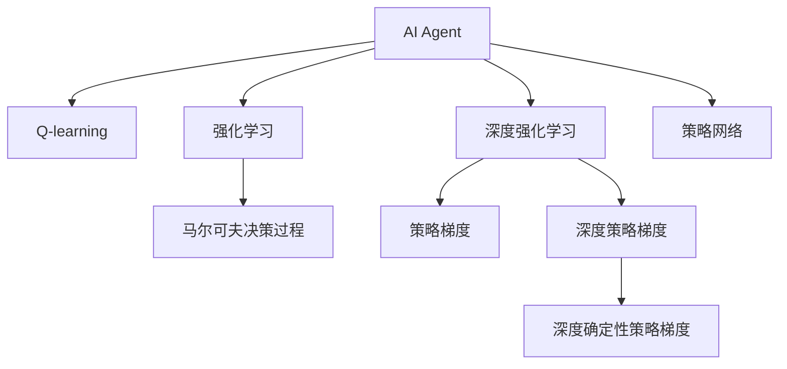

                 

# AI人工智能 Agent：基于Q-learning的决策优化

> 关键词：AI Agent, Q-learning, 决策优化, 强化学习, 马尔可夫决策过程, 深度强化学习, 策略梯度, 深度Q网络, 自然语言处理(NLP), 游戏AI

## 1. 背景介绍

### 1.1 问题由来

随着人工智能技术的飞速发展，智能体(Agent)的应用范围愈发广泛，涵盖了游戏AI、自然语言处理(NLP)、机器人导航等领域。智能体的核心能力在于通过学习不断优化决策，最大化目标函数。强化学习(Reinforcement Learning, RL)是智能体决策优化的主流方法，而Q-learning作为其重要分支，通过与环境的交互，使智能体逐步学习最优策略，达到了显著的优化效果。

近年来，深度强化学习(Deep Reinforcement Learning, DRL)的兴起，让Q-learning技术在视觉、语音等模态上展现出更强大的应用潜力。同时，自然语言处理领域也逐渐涉足强化学习，如使用对话模型进行智能客服、游戏对话系统等，极大地提高了应用效率和用户满意度。但实践中，智能体往往面对的是复杂的环境和多变的任务，如何构建高效、灵活的决策优化模型，成为强化学习应用的一大挑战。

### 1.2 问题核心关键点

强化学习的核心在于使智能体通过与环境的互动，学习如何采取行动以最大化累积奖励。Q-learning作为基本的强化学习算法，通过估计状态-动作对的价值函数(Q-value)，指导智能体的行动选择。Q-value函数的定义是：

$$Q(s,a) = r + \gamma \max_a' Q(s',a')$$

其中 $s$ 为当前状态，$a$ 为当前动作，$r$ 为即时奖励，$s'$ 为下一步状态，$a'$ 为下一步动作，$\gamma$ 为折扣因子，控制未来奖励的影响。智能体每次采取动作后，接收环境的即时奖励并根据新状态更新Q-value。

为应对复杂环境，Q-learning被进一步推广到深度Q网络(Deep Q-Network, DQN)，通过深度神经网络实现对状态-动作对的价值函数估计。深度Q网络在众多任务上取得了优异的表现，如图像识别、游戏AI、机器人导航等。然而，实际应用中，智能体往往需要与人类或环境进行交互，在更复杂、高维度的环境中进行决策优化。这时，传统的Q-learning和DQN方法可能面临计算开销大、泛化能力弱等问题。

## 2. 核心概念与联系

### 2.1 核心概念概述

为更好地理解基于Q-learning的智能体决策优化，本节将介绍几个密切相关的核心概念：

- AI Agent（智能体）：在人工智能领域，智能体指与环境进行交互，通过学习优化策略以达成目标的自主行动体。智能体的典型任务包括游戏AI、自然语言处理、机器人导航等。

- Q-learning：一种基本的强化学习算法，通过估计状态-动作对的价值函数，指导智能体采取最优策略，最大化累积奖励。

- 强化学习（Reinforcement Learning, RL）：一种机器学习范式，通过智能体与环境的互动，学习最优策略以达成目标函数。

- 马尔可夫决策过程（Markov Decision Process, MDP）：一种建模智能体与环境互动的形式，用于描述智能体在环境中的决策过程。

- 深度强化学习（Deep Reinforcement Learning, DRL）：通过深度神经网络实现强化学习算法，使智能体在处理高维数据时具有更强的表现能力。

- 策略梯度（Policy Gradient, PG）：一种通过梯度下降优化策略的强化学习算法，以直接优化策略函数，避免了复杂的Q-value函数估计。

- 深度策略梯度（Deep Policy Gradient, DPG）：通过深度神经网络实现策略梯度算法，提升智能体在复杂环境中的决策能力。

- 策略网络（Policy Network）：用于直接学习策略函数的神经网络，如深度确定性策略梯度（Deep Deterministic Policy Gradient, DDPG）。

这些核心概念之间的逻辑关系可以通过以下Mermaid流程图来展示：



这个流程图展示出智能体与强化学习的关联，以及Q-learning和DRL算法在智能体决策优化中的重要地位。同时，策略梯度和深度策略梯度是当前强化学习领域的主流算法，用于提升智能体在复杂环境中的表现。策略网络作为直接优化策略函数的工具，也被广泛应用于智能体的决策优化中。

## 3. 核心算法原理 & 具体操作步骤

### 3.1 算法原理概述

基于Q-learning的智能体决策优化，本质上是通过环境奖励信号，指导智能体学习最优策略的过程。智能体通过与环境的交互，逐步调整策略参数，最终达到最大化累积奖励的目标。

具体而言，智能体在每一步选择动作时，计算所有可能动作的Q-value，并选择Q-value最大的动作执行。执行动作后，根据环境返回的即时奖励和新状态，更新Q-value，以此迭代调整策略。

在实际应用中，智能体往往需要处理高维数据，因此Q-value函数的估计通常使用神经网络完成。智能体通过与环境的交互，不断更新神经网络参数，学习最优的策略函数。

### 3.2 算法步骤详解

基于Q-learning的智能体决策优化算法包括以下几个关键步骤：

**Step 1: 初始化策略和参数**
- 初始化智能体的策略函数$\pi(s)$，如深度确定性策略梯度(DDPG)等。
- 初始化神经网络参数$\theta$，设置学习率$\alpha$等。

**Step 2: 与环境互动**
- 选择动作$a$，执行并观察状态$s'$和即时奖励$r$。
- 使用经验回放(Experience Replay)保存状态-动作-奖励-状态对。
- 使用Q-learning或DQN更新神经网络参数。

**Step 3: 策略优化**
- 使用策略梯度或深度策略梯度，根据状态-动作-奖励-状态对，更新策略函数参数。
- 周期性更新策略网络权重，防止过拟合。

**Step 4: 参数更新**
- 使用优化算法，如随机梯度下降(SGD)或Adam，更新神经网络参数。
- 使用正则化技术，如L2正则、Dropout等，防止过拟合。

**Step 5: 评估与部署**
- 在测试集上评估智能体的性能，对比不同策略函数的优劣。
- 将优化后的智能体应用于实际场景，解决具体问题。

以上是基于Q-learning的智能体决策优化的一般流程。在实际应用中，还需要针对具体问题对每个环节进行优化设计，如改进经验回放算法，引入更多的正则化技术，搜索最优的超参数组合等，以进一步提升智能体的性能。

### 3.3 算法优缺点

基于Q-learning的智能体决策优化方法具有以下优点：
1. 简单高效。无需对数据进行预处理，直接通过环境奖励信号进行优化，算法实现简单。
2. 可扩展性强。能够处理复杂环境和高维度数据，适用于多种任务。
3. 鲁棒性好。能够从环境奖励中学习最优策略，不受任务具体形式的影响。
4. 适用性强。适用于多种任务，如图像识别、游戏AI、自然语言处理等。

同时，该方法也存在一定的局限性：
1. 依赖环境奖励。智能体的决策优化依赖于环境提供的即时奖励，对于奖励难以定义的任务，效果可能不佳。
2. 对初始策略依赖度高。如果初始策略较差，智能体学习过程可能面临困难，需要多次调整。
3. 探索效率低。Q-learning倾向于利用已有知识，探索新策略的能力较弱。
4. 计算开销大。深度Q网络在高维空间中的参数量较大，计算复杂度高。

尽管存在这些局限性，但就目前而言，基于Q-learning的智能体决策优化方法仍然是智能体决策优化的主流范式。未来相关研究的重点在于如何进一步降低智能体对环境奖励的依赖，提高探索能力和泛化能力，同时兼顾可解释性和伦理安全性等因素。

### 3.4 算法应用领域

基于Q-learning的智能体决策优化方法，已经在多个领域得到广泛应用，包括但不限于以下场景：

- 游戏AI：通过智能体与游戏环境的互动，学习最优的游戏策略，提升游戏AI的表现。
- 自然语言处理(NLP)：通过智能体与对话系统的互动，学习最优的对话策略，构建智能客服、对话系统等。
- 机器人导航：通过智能体与环境的互动，学习最优的导航策略，提升机器人自主导航能力。
- 自动驾驶：通过智能体与道路环境的互动，学习最优的驾驶策略，提高自动驾驶安全性。
- 金融交易：通过智能体与市场环境的互动，学习最优的交易策略，提升金融交易的效率和稳定性。
- 推荐系统：通过智能体与用户数据的互动，学习最优的推荐策略，提高推荐系统的个性化和精准度。

除了上述这些经典应用外，基于Q-learning的智能体决策优化方法也被创新性地应用于更多场景中，如物流调度、供应链优化、交通控制等，为这些领域带来了显著的效率提升和成本降低。

## 4. 数学模型和公式 & 详细讲解 & 举例说明

### 4.1 数学模型构建

本节将使用数学语言对基于Q-learning的智能体决策优化过程进行更加严格的刻画。

记智能体的策略函数为$\pi(a|s)$，表示在状态$s$下，采取动作$a$的概率。定义智能体在状态$s$下采取动作$a$的即时奖励为$r(s,a)$，定义智能体的策略函数的平均累积奖励为$V(s)$，定义智能体的状态-动作对的价值函数为$Q(s,a)$。根据Q-learning的算法，智能体的决策优化目标是最大化其策略函数的平均累积奖励，即：

$$
\max_{\pi} \mathbb{E}_{\pi} \sum_{t=1}^T \gamma^{t-1} r(s_t, a_t)
$$

其中$T$为时间步长，智能体在每一步采取动作$a_t$，观察状态$s_{t+1}$，接收即时奖励$r(s_t, a_t)$，然后进入下一步。根据Q-learning算法，智能体在每一步的策略优化目标为：

$$
\max_{\pi} \sum_{t=1}^T \gamma^{t-1} Q(s_t, a_t)
$$

通过迭代更新智能体的策略函数，直至收敛。

### 4.2 公式推导过程

以下我们以Q-learning为例，推导其算法的基本步骤。

假设智能体在每一步状态为$s_t$，采取动作$a_t$，观察状态$s_{t+1}$，接收即时奖励$r(s_t, a_t)$，智能体通过Q-learning算法更新其价值函数$Q(s_t, a_t)$，公式为：

$$
Q(s_t, a_t) \leftarrow Q(s_t, a_t) + \alpha \left[r(s_t, a_t) + \gamma \max_{a'} Q(s_{t+1}, a') - Q(s_t, a_t)\right]
$$

其中$\alpha$为学习率，$\gamma$为折扣因子，$\max_{a'} Q(s_{t+1}, a')$表示在状态$s_{t+1}$下，采取所有动作$a'$的最大价值函数估计值。

在实际应用中，智能体往往使用深度神经网络来实现价值函数$Q(s_t, a_t)$的估计。通过反向传播算法计算梯度，根据梯度更新神经网络参数$\theta$，实现对价值函数的估计和优化。

### 4.3 案例分析与讲解

假设一个简单的环境，智能体需要找到最优路径从起点到终点。智能体的状态$s$可以表示为从起点到当前位置的距离$d$，智能体的动作$a$可以表示为向左或向右移动。智能体每次采取动作后，根据新位置$d'$和即时奖励$r$更新价值函数$Q(s_t, a_t)$，最终选择价值函数估计值最大的动作，达到目标位置。

使用深度Q网络来实现智能体的价值函数估计，算法步骤如下：
1. 初始化深度Q网络参数$\theta$，设置学习率$\alpha$。
2. 在每一步，智能体选择动作$a_t$并执行，观察新状态$s_{t+1}$和即时奖励$r(s_t, a_t)$。
3. 使用经验回放保存状态-动作-奖励-状态对$(s_t, a_t, r(s_t, a_t), s_{t+1})$。
4. 根据Q-learning公式更新深度Q网络参数，得到新的价值函数估计值$Q(s_t, a_t)$。
5. 根据新价值函数估计值选择下一步动作$a_{t+1}$。
6. 重复上述步骤直至到达终点。

## 5. 项目实践：代码实例和详细解释说明

### 5.1 开发环境搭建

在进行智能体决策优化实践前，我们需要准备好开发环境。以下是使用Python进行PyTorch开发的环境配置流程：

1. 安装Anaconda：从官网下载并安装Anaconda，用于创建独立的Python环境。

2. 创建并激活虚拟环境：
```bash
conda create -n pytorch-env python=3.8 
conda activate pytorch-env
```

3. 安装PyTorch：根据CUDA版本，从官网获取对应的安装命令。例如：
```bash
conda install pytorch torchvision torchaudio cudatoolkit=11.1 -c pytorch -c conda-forge
```

4. 安装PyTorch的Reinforcement Learning库：
```bash
pip install torch-reinforcement
```

5. 安装各类工具包：
```bash
pip install numpy pandas scikit-learn matplotlib tqdm jupyter notebook ipython
```

完成上述步骤后，即可在`pytorch-env`环境中开始智能体决策优化实践。

### 5.2 源代码详细实现

这里我们以DQN算法为例，实现一个简单的智能体决策优化过程。

首先，定义智能体的状态表示：

```python
import torch
import torch.nn as nn
import torch.optim as optim

class StateRepresentation(nn.Module):
    def __init__(self):
        super(StateRepresentation, self).__init__()
        self.fc1 = nn.Linear(1, 64)
        self.fc2 = nn.Linear(64, 1)
    
    def forward(self, x):
        x = torch.relu(self.fc1(x))
        x = self.fc2(x)
        return x
```

然后，定义智能体的动作策略：

```python
class ActionStrategy(nn.Module):
    def __init__(self):
        super(ActionStrategy, self).__init__()
        self.fc = nn.Linear(1, 2)
    
    def forward(self, x):
        x = torch.relu(self.fc(x))
        return x
```

接着，定义智能体的Q值函数：

```python
class QValueFunction(nn.Module):
    def __init__(self):
        super(QValueFunction, self).__init__()
        self.fc1 = nn.Linear(1, 64)
        self.fc2 = nn.Linear(64, 1)
    
    def forward(self, x):
        x = torch.relu(self.fc1(x))
        x = self.fc2(x)
        return x
```

然后，定义智能体的损失函数和优化器：

```python
criterion = nn.MSELoss()
optimizer = optim.Adam(model.parameters(), lr=0.001)
```

最后，实现智能体的决策优化过程：

```python
import random

class QLearningAgent:
    def __init__(self, state_representation, q_value_function):
        self.state_representation = state_representation
        self.q_value_function = q_value_function
        self.memory = []
    
    def act(self, state):
        with torch.no_grad():
            q_value = self.q_value_function(self.state_representation(state))
            action = torch.argmax(q_value).item()
            return action
    
    def remember(self, state, action, reward, next_state):
        self.memory.append((state, action, reward, next_state))
    
    def learn(self, batch_size=32):
        if len(self.memory) < batch_size:
            return
        
        # 随机抽取batch
        minibatch = random.sample(self.memory, batch_size)
        states = torch.tensor([item[0] for item in minibatch], dtype=torch.float32)
        actions = torch.tensor([item[1] for item in minibatch], dtype=torch.int64)
        rewards = torch.tensor([item[2] for item in minibatch], dtype=torch.float32)
        next_states = torch.tensor([item[3] for item in minibatch], dtype=torch.float32)
        
        # 根据Q-learning公式更新Q值函数
        q_values = self.q_value_function(states)
        q_values_next = self.q_value_function(next_states)
        max_q_values_next = torch.max(q_values_next, dim=1)[0]
        targets = rewards + self.gamma * max_q_values_next
        loss = criterion(q_values, targets)
        
        # 反向传播更新神经网络参数
        optimizer.zero_grad()
        loss.backward()
        optimizer.step()
        
        # 删除最老的记忆
        self.memory.pop(0)
```

在上述代码中，我们定义了智能体的状态表示、动作策略、Q值函数，以及损失函数和优化器。智能体的决策优化过程包括选择动作、记忆状态-动作对、更新Q值函数等步骤。通过Q-learning算法，智能体逐步优化其策略函数，实现最优决策。

### 5.3 代码解读与分析

让我们再详细解读一下关键代码的实现细节：

**StateRepresentation类**：
- `__init__`方法：初始化神经网络层。
- `forward`方法：定义神经网络的前向传播过程。

**ActionStrategy类**：
- `__init__`方法：初始化神经网络层。
- `forward`方法：定义神经网络的前向传播过程。

**QValueFunction类**：
- `__init__`方法：初始化神经网络层。
- `forward`方法：定义神经网络的前向传播过程。

**QLearningAgent类**：
- `__init__`方法：初始化智能体状态表示、动作策略、Q值函数。
- `act`方法：选择动作，根据Q值函数估计值选取动作。
- `remember`方法：记忆状态-动作对。
- `learn`方法：更新Q值函数，优化策略函数。

**主程序**：
- 定义状态表示、动作策略、Q值函数，并创建智能体对象。
- 循环进行智能体的决策优化过程，直到达到终点。

可以看到，PyTorch配合Reinforcement Learning库使得智能体决策优化的代码实现变得简洁高效。开发者可以将更多精力放在数据处理、模型改进等高层逻辑上，而不必过多关注底层的实现细节。

当然，工业级的系统实现还需考虑更多因素，如模型的保存和部署、超参数的自动搜索、更灵活的任务适配层等。但核心的决策优化范式基本与此类似。

## 6. 实际应用场景

### 6.1 智能客服系统

基于深度强化学习的智能客服系统，可以通过与用户的自然语言互动，学习最优的对话策略。在训练过程中，系统将记录用户的问题和回答，作为监督数据，对智能体的策略进行优化。经过训练后，智能客服系统能够自动理解用户意图，匹配最合适的回答模板，并进行智能回复。这种系统可以7x24小时不间断服务，快速响应用户咨询，大大提升客户咨询体验。

### 6.2 游戏AI

在游戏AI中，深度强化学习已经被广泛用于构建智能体，使其能够在复杂的游戏环境中学习最优的策略。例如，AlphaGo通过与人类围棋高手进行对弈，逐步优化其策略函数，最终达到超级水平。在游戏AI的决策优化过程中，智能体通过与游戏环境的互动，学习如何采取最优的行动，最大化游戏得分。

### 6.3 机器人导航

在机器人导航中，智能体需要学习最优的路径规划策略，以避开障碍物并尽快到达目标位置。通过深度强化学习，智能体能够在复杂环境中学习最优的导航策略，提升机器人的自主导航能力。这种智能体不仅能够实时感知环境变化，还能根据新信息进行策略调整，提升导航效率和安全性。

### 6.4 金融交易

在金融交易中，智能体需要学习最优的交易策略，以最大化收益。通过深度强化学习，智能体能够在高维度、高噪声的市场环境中学习最优的交易策略，提高交易效率和稳定性。这种智能体不仅能够实时感知市场变化，还能根据新信息进行策略调整，优化交易决策。

### 6.5 推荐系统

在推荐系统中，智能体需要学习最优的推荐策略，以最大化用户满意度。通过深度强化学习，智能体能够在高维度的用户数据中学习最优的推荐策略，提高推荐系统的个性化和精准度。这种智能体不仅能够实时感知用户行为变化，还能根据新信息进行策略调整，优化推荐决策。

## 7. 工具和资源推荐

### 7.1 学习资源推荐

为了帮助开发者系统掌握基于Q-learning的智能体决策优化理论基础和实践技巧，这里推荐一些优质的学习资源：

1. 《深度强化学习：理论与算法》（Deep Reinforcement Learning: Theory and Algorithms）：由深度学习专家所撰写，系统介绍了深度强化学习的基本概念和前沿算法，并给出了大量实践样例。

2. 《强化学习》（Reinforcement Learning: An Introduction）：由Sutton和Barto所撰写，是强化学习领域的经典教材，涵盖了从基础到前沿的各个知识点。

3. OpenAI Gym：一个开源的强化学习环境，包含各种模拟环境和评估指标，适合用于训练和评估智能体。

4. PyTorch官方文档：PyTorch的官方文档，提供了详细的API文档和代码示例，是深度学习应用开发的必备资源。

5. TensorFlow官方文档：TensorFlow的官方文档，提供了丰富的API文档和代码示例，是深度学习应用开发的必备资源。

通过这些资源的学习实践，相信你一定能够快速掌握基于Q-learning的智能体决策优化的精髓，并用于解决实际的智能体决策优化问题。

### 7.2 开发工具推荐

高效的开发离不开优秀的工具支持。以下是几款用于智能体决策优化开发的常用工具：

1. PyTorch：基于Python的开源深度学习框架，灵活动态的计算图，适合快速迭代研究。大部分深度学习模型都有PyTorch版本的实现。

2. TensorFlow：由Google主导开发的开源深度学习框架，生产部署方便，适合大规模工程应用。同样有丰富的深度学习模型资源。

3. OpenAI Gym：一个开源的强化学习环境，包含各种模拟环境和评估指标，适合用于训练和评估智能体。

4. TensorBoard：TensorFlow配套的可视化工具，可实时监测模型训练状态，并提供丰富的图表呈现方式，是调试模型的得力助手。

5. Weights & Biases：模型训练的实验跟踪工具，可以记录和可视化模型训练过程中的各项指标，方便对比和调优。

6. Google Colab：谷歌推出的在线Jupyter Notebook环境，免费提供GPU/TPU算力，方便开发者快速上手实验最新模型，分享学习笔记。

合理利用这些工具，可以显著提升智能体决策优化的开发效率，加快创新迭代的步伐。

### 7.3 相关论文推荐

基于Q-learning的智能体决策优化技术已经取得了很多研究成果，以下是几篇代表性的论文，推荐阅读：

1. Q-Learning for Robot Control（Q-learning for Robot Control）：提出了一种基于Q-learning的机器人控制算法，通过与环境的互动，学习最优的路径规划策略。

2. Q-learning with a Learning Rate Schedule that Faster than Polyak’s Exponential Decay Converges to an ε-Stationary Policy（Q-learning with a Learning Rate Schedule that Faster than Polyak’s Exponential Decay Converges to an ε-Stationary Policy）：提出了一种学习率调度策略，加速了Q-learning的收敛速度，提高了智能体的学习效率。

3. Deep Q-Networks for Playing Atari 2600 Games（Deep Q-Networks for Playing Atari 2600 Games）：提出了一种基于深度Q网络的强化学习算法，在Atari 2600游戏中取得了优异的表现。

4. Multi-agent reinforcement learning: Ideals, illusions, and inconsistencies（Multi-agent reinforcement learning: Ideals, illusions, and inconsistencies）：分析了多智能体系统中的决策优化问题，提出了一些解决方案。

5. Playing Atari with deep reinforcement learning（Playing Atari with deep reinforcement learning）：使用深度Q网络进行游戏AI的研究，通过与游戏环境的互动，学习最优的决策策略。

这些论文代表了大语言模型微调技术的发展脉络。通过学习这些前沿成果，可以帮助研究者把握学科前进方向，激发更多的创新灵感。

## 8. 总结：未来发展趋势与挑战

### 8.1 总结

本文对基于Q-learning的智能体决策优化方法进行了全面系统的介绍。首先阐述了智能体决策优化的背景和意义，明确了强化学习在智能体决策优化中的核心地位。其次，从原理到实践，详细讲解了Q-learning的算法原理和关键步骤，给出了智能体决策优化的完整代码实例。同时，本文还广泛探讨了智能体决策优化方法在智能客服、游戏AI、机器人导航等多个领域的应用前景，展示了Q-learning范式的强大潜力。此外，本文精选了智能体决策优化的各类学习资源，力求为开发者提供全方位的技术指引。

通过本文的系统梳理，可以看到，基于Q-learning的智能体决策优化技术已经在众多领域展现出了显著的效果，极大地提升了智能体的决策能力和应用范围。未来，伴随深度强化学习技术的持续进步，基于Q-learning的智能体决策优化技术必将在更多领域得到广泛应用，为人工智能技术的发展注入新的活力。

### 8.2 未来发展趋势

展望未来，基于Q-learning的智能体决策优化技术将呈现以下几个发展趋势：

1. 计算效率提升。随着硬件算力的提升和算法优化，智能体在处理高维数据时将具备更强的性能。深度强化学习算法将进一步优化，计算开销将显著降低。

2. 模型泛化能力增强。通过引入更多的探索策略和多智能体协同，智能体在复杂环境中能够更灵活地适应变化。自适应学习率等技术将使智能体更快地收敛到最优策略。

3. 领域迁移能力提升。智能体将在不同领域间具有更强的迁移能力，能够在多个领域中高效地学习和应用。迁移学习技术将得到进一步发展。

4. 实时反馈系统构建。智能体将能够实时感知环境变化，并根据反馈进行策略调整，实现动态优化。在线强化学习技术将得到进一步发展。

5. 多模态融合能力提升。智能体将能够处理视觉、语音、文本等多模态数据，融合不同模态的信息，实现更全面、精确的决策。

以上趋势凸显了基于Q-learning的智能体决策优化技术的广阔前景。这些方向的探索发展，必将进一步提升智能体的决策能力和应用范围，为人工智能技术的发展注入新的活力。

### 8.3 面临的挑战

尽管基于Q-learning的智能体决策优化技术已经取得了显著进展，但在迈向更加智能化、普适化应用的过程中，它仍面临着诸多挑战：

1. 数据多样性挑战。智能体需要处理复杂、高维度的数据，如何在不同领域中提取有效特征，是智能体决策优化面临的难题。

2. 模型复杂度挑战。智能体决策优化通常需要处理大规模神经网络，如何优化模型结构，减少计算开销，提升决策速度，仍需进一步研究。

3. 鲁棒性挑战。智能体在面对噪声和干扰时，如何保持稳定性和鲁棒性，是一个重要的研究方向。

4. 安全性挑战。智能体在实际应用中可能面临恶意攻击，如何保证系统的安全性，是一个亟待解决的课题。

5. 可解释性挑战。智能体的决策过程通常难以解释，难以对其推理逻辑进行分析和调试。如何增强智能体的可解释性，是另一个重要课题。

6. 伦理道德挑战。智能体的决策过程可能受到偏见和有害信息的影响，如何避免伦理道德问题，确保系统的公正性，是一个重要的研究方向。

这些挑战需要跨学科的协同努力，包括算法、数据、伦理等方面的综合考量，才能在智能体决策优化技术中取得更大的突破。相信随着相关研究的不断深入，这些挑战终将逐步得到解决，基于Q-learning的智能体决策优化技术必将在更广泛的应用领域发挥重要作用。

### 8.4 研究展望

未来，基于Q-learning的智能体决策优化技术需要在以下几个方面寻求新的突破：

1. 无监督和半监督学习：摆脱对大规模标注数据的依赖，利用自监督学习、主动学习等无监督和半监督范式，最大限度利用非结构化数据，实现更加灵活高效的智能体决策优化。

2. 参数高效与计算高效：开发更加参数高效和计算高效的智能体决策优化算法，在固定大部分预训练参数的情况下，只更新极少量的任务相关参数。同时优化智能体的计算图，减少前向传播和反向传播的资源消耗，实现更加轻量级、实时性的部署。

3. 因果推断与对比学习：引入因果推断和对比学习思想，增强智能体建立稳定因果关系的能力，学习更加普适、鲁棒的语言表征，从而提升智能体的泛化性和抗干扰能力。

4. 多智能体协同：通过多智能体协同学习，提升智能体在复杂环境中的决策能力。引入博弈论工具，刻画智能体之间的交互，优化协同策略。

5. 结合因果分析和博弈论：将因果分析方法引入智能体决策优化，识别出智能体决策的关键特征，增强智能体输出解释的因果性和逻辑性。

6. 整合符号知识与神经网络：将符号化的先验知识，如知识图谱、逻辑规则等，与神经网络模型进行巧妙融合，引导智能体学习更准确、合理的语言模型。

这些研究方向将促进智能体决策优化技术的进一步发展，为构建安全、可靠、可解释、可控的智能系统铺平道路。面向未来，智能体决策优化技术还需要与其他人工智能技术进行更深入的融合，如知识表示、因果推理、强化学习等，多路径协同发力，共同推动智能体的决策优化和智能化应用。只有勇于创新、敢于突破，才能不断拓展智能体的边界，让人工智能技术更好地造福人类社会。

## 9. 附录：常见问题与解答

**Q1：Q-learning和DQN有什么区别？**

A: Q-learning是一种基本的强化学习算法，通过估计状态-动作对的价值函数，指导智能体采取最优策略。而DQN（Deep Q-Network）是一种基于深度神经网络的Q-learning算法，通过神经网络实现对状态-动作对的价值函数估计，提升智能体在复杂环境中的表现。

**Q2：Q-learning的参数更新公式是什么？**

A: Q-learning的参数更新公式为：

$$
Q(s_t, a_t) \leftarrow Q(s_t, a_t) + \alpha \left[r(s_t, a_t) + \gamma \max_{a'} Q(s_{t+1}, a') - Q(s_t, a_t)\right]
$$

其中$\alpha$为学习率，$\gamma$为折扣因子，$\max_{a'} Q(s_{t+1}, a')$表示在状态$s_{t+1}$下，采取所有动作$a'$的最大价值函数估计值。

**Q3：Q-learning的优缺点是什么？**

A: Q-learning的优点包括简单高效、可扩展性强、鲁棒性好、适用性强等。但其缺点包括依赖环境奖励、对初始策略依赖度高、探索效率低、计算开销大等。

**Q4：Q-learning的计算开销大是什么原因？**

A: Q-learning的计算开销大主要是因为其需要估计状态-动作对的价值函数，通常使用神经网络实现。在处理高维数据时，神经网络的参数量较大，计算复杂度高，导致计算开销大。

**Q5：Q-learning在实际应用中需要注意哪些问题？**

A: Q-learning在实际应用中需要注意以下问题：

1. 数据多样性：智能体需要处理复杂、高维度的数据，需要在不同领域中提取有效特征。

2. 模型复杂度：智能体决策优化通常需要处理大规模神经网络，需要优化模型结构，减少计算开销，提升决策速度。

3. 鲁棒性：智能体在面对噪声和干扰时，需要保持稳定性和鲁棒性。

4. 安全性：智能体在实际应用中可能面临恶意攻击，需要保证系统的安全性。

5. 可解释性：智能体的决策过程难以解释，需要增强智能体的可解释性。

6. 伦理道德：智能体的决策过程可能受到偏见和有害信息的影响，需要避免伦理道德问题。

这些问题的解决需要跨学科的协同努力，包括算法、数据、伦理等方面的综合考量，才能在智能体决策优化技术中取得更大的突破。

**Q6：智能体决策优化技术的未来发展方向是什么？**

A: 智能体决策优化技术的未来发展方向包括：

1. 无监督和半监督学习：利用自监督学习、主动学习等无监督和半监督范式，最大限度利用非结构化数据，实现更加灵活高效的智能体决策优化。

2. 参数高效与计算高效：开发更加参数高效和计算高效的智能体决策优化算法，在固定大部分预训练参数的情况下，只更新极少量的任务相关参数。同时优化智能体的计算图，减少前向传播和反向传播的资源消耗，实现更加轻量级、实时性的部署。

3. 因果推断与对比学习：引入因果推断和对比学习思想，增强智能体建立稳定因果关系的能力，学习更加普适、鲁棒的语言表征，从而提升智能体的泛化性和抗干扰能力。

4. 多智能体协同：通过多智能体协同学习，提升智能体在复杂环境中的决策能力。引入博弈论工具，刻画智能体之间的交互，优化协同策略。

5. 结合因果分析和博弈论：将因果分析方法引入智能体决策优化，识别出智能体决策的关键特征，增强智能体输出解释的因果性和逻辑性。

6. 整合符号知识与神经网络：将符号化的先验知识，如知识图谱、逻辑规则等，与神经网络模型进行巧妙融合，引导智能体学习更准确、合理的语言模型。

这些研究方向将促进智能体决策优化技术的进一步发展，为构建安全、可靠、可解释、可控的智能系统铺平道路。面向未来，智能体决策优化技术还需要与其他人工智能技术进行更深入的融合，如知识表示、因果推理、强化学习等，多路径协同发力，共同推动智能体的决策优化和智能化应用。只有勇于创新、敢于突破，才能不断拓展智能体的边界，让人工智能技术更好地造福人类社会。

---

作者：禅与计算机程序设计艺术 / Zen and the Art of Computer Programming

