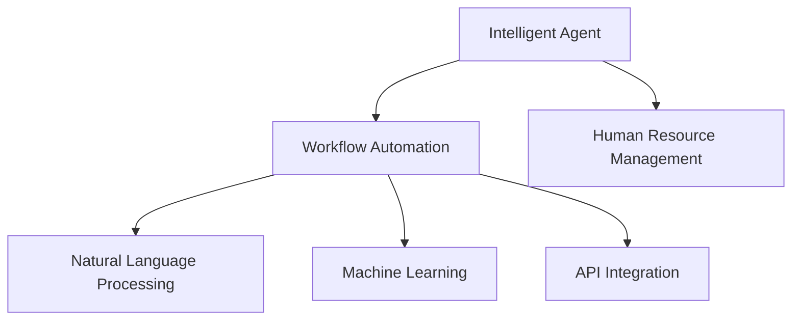

                 

# AI人工智能代理工作流AI Agent WorkFlow：智能代理在人力资源管理系统中的应用

> 关键词：人工智能,智能代理,工作流,人力资源管理系统,自然语言处理,NLP,机器学习,API集成,自动化流程,性能优化

## 1. 背景介绍

### 1.1 问题由来

随着人工智能技术的迅猛发展，自动化和智能化解决方案在各行各业得到了广泛应用。人力资源管理系统（HRMS）作为企业中至关重要的一部分，其高效性和准确性直接影响到企业的运营效率和员工满意度。然而，传统的人力资源管理流程繁琐复杂，重复性高，容易出现疏漏和效率低下等问题。因此，如何在人力资源管理中引入人工智能技术，实现智能化、自动化的工作流管理，成为了当前HRMS系统升级和优化的重要方向。

### 1.2 问题核心关键点

智能代理在人力资源管理系统中的应用，旨在通过人工智能技术，自动化处理人力资源管理中的各项任务，提高工作效率和准确性。具体来说，智能代理可以自动完成招聘、员工培训、绩效评估、薪资管理等任务，帮助HR部门从繁琐的日常事务中解脱出来，专注于更高价值的工作。

智能代理的核心优势在于其能够理解自然语言，处理复杂逻辑，且具备学习能力和自我优化能力，能够根据实际需求不断优化其工作流程和效率。其工作原理主要包括：

- **自然语言处理(NLP)**：通过自然语言处理技术，智能代理可以理解员工的需求和问题，并生成相应的解决方案。
- **机器学习**：智能代理通过学习历史数据，不断优化其决策和行为，提高预测和决策的准确性。
- **API集成**：智能代理可以集成现有的HRMS系统、第三方服务，如招聘平台、培训系统等，获取所需的数据和资源。
- **自动化流程**：智能代理能够自动化处理重复性高、规则明确的任务，减少人工干预。

### 1.3 问题研究意义

智能代理在人力资源管理系统中的应用，对于提高HRMS系统的智能化水平，优化人力资源管理流程，具有重要意义：

1. **提升效率**：通过自动化处理重复性任务，智能代理能够显著提升人力资源管理的效率，减少人力资源部门的工作负担。
2. **降低成本**：自动化流程的引入，降低了人工错误和重复劳动带来的成本，同时也减少了招聘、培训等环节的预算支出。
3. **提高准确性**：智能代理通过学习历史数据和规则，能够提供更准确、个性化的解决方案，优化绩效评估、薪酬调整等关键决策。
4. **增强用户体验**：智能代理能够理解员工需求，提供实时反馈和建议，提升员工满意度和留存率。
5. **促进业务创新**：智能代理为HRMS系统注入了新的技术力量，推动HRMS系统与更多业务模块的融合，提升整体业务能力。

## 2. 核心概念与联系

### 2.1 核心概念概述

为更好地理解智能代理在人力资源管理系统中的应用，本节将介绍几个密切相关的核心概念：

- **人工智能（Artificial Intelligence, AI）**：一种利用计算机技术模拟人类智能行为的科学，包括自然语言处理、机器学习、数据挖掘、智能推荐等技术。
- **智能代理（Intelligent Agent）**：一种能够在特定环境中自主行动、学习并做出决策的计算实体，可以应用于各种复杂系统中。
- **工作流（Workflow）**：在业务流程中，一系列逻辑关联、步骤明确的自动化操作序列，通常由多个任务组成。
- **自然语言处理（NLP）**：一种使计算机能够理解、处理和生成人类语言的技术，涉及词法分析、句法分析、语义分析、语言生成等。
- **机器学习（Machine Learning）**：一种通过数据驱动的算法，使计算机能够从数据中学习并改进其性能的技术。
- **API集成（API Integration）**：通过调用不同系统之间的API，实现数据的共享和系统的互联互通。

这些核心概念之间的逻辑关系可以通过以下Mermaid流程图来展示：



这个流程图展示了一些核心概念及其之间的关系：

1. 智能代理是工作流自动化的主要执行者。
2. 智能代理通过自然语言处理技术理解任务和员工需求。
3. 智能代理利用机器学习技术优化其行为和决策。
4. 智能代理通过API集成获取外部数据和资源。
5. 智能代理应用在人力资源管理系统中，实现自动化流程。

这些概念共同构成了智能代理在人力资源管理系统中的应用框架，使其能够高效、智能地处理各种人力资源管理任务。

## 3. 核心算法原理 & 具体操作步骤
### 3.1 算法原理概述

智能代理在人力资源管理系统中的应用，本质上是一个基于人工智能技术的自动化工作流解决方案。其核心思想是：通过自然语言处理技术，将员工的需求和问题转化为可执行的任务，利用机器学习算法优化任务执行策略，并通过API集成获取所需的资源和数据，最终实现自动化处理人力资源管理中的各项任务。

具体来说，智能代理的工作流程可以分为以下几个步骤：

1. **任务识别**：通过自然语言处理技术，智能代理从员工提出的问题或需求中识别出需要执行的具体任务。
2. **任务分配**：智能代理根据任务性质和资源情况，分配合适的处理资源和步骤。
3. **任务执行**：智能代理执行分配的任务，包括数据采集、任务处理、结果反馈等。
4. **任务评估**：智能代理根据任务执行结果，进行效果评估和反馈，不断优化任务处理策略。
5. **任务记录**：智能代理将任务执行过程中的关键信息和数据记录下来，为后续任务处理提供参考。

### 3.2 算法步骤详解

智能代理在人力资源管理系统中的应用，一般包括以下几个关键步骤：

**Step 1: 准备人力资源管理系统和智能代理模型**

- 收集和整理人力资源管理系统的现有数据，包括员工信息、绩效数据、培训记录等。
- 选择合适的智能代理模型，如基于Transformer的NLP模型，用于处理员工的语言输入和任务生成。
- 设计智能代理的工作流程，包括任务分类、任务执行、任务反馈等步骤。

**Step 2: 集成API和服务**

- 将智能代理模型集成到人力资源管理系统中，通过API接口获取员工数据和任务需求。
- 集成第三方服务，如招聘平台、培训系统等，扩展智能代理的功能和数据源。
- 实现智能代理与其他业务模块的交互，确保信息共享和协同工作。

**Step 3: 训练和优化智能代理**

- 准备训练数据，包括员工提出的问题和实际执行的任务数据。
- 使用机器学习算法训练智能代理模型，优化其任务识别和执行能力。
- 使用自然语言处理技术，提升智能代理对复杂语言输入的理解能力。
- 通过反馈机制，持续优化智能代理的行为和决策策略。

**Step 4: 测试和部署**

- 在测试环境中，模拟员工的各种需求和问题，评估智能代理的工作效果。
- 根据测试结果，进一步优化智能代理的模型和流程。
- 将智能代理部署到实际的生产环境中，监控其运行状态和效果。
- 定期更新和维护智能代理模型，确保其持续有效。

### 3.3 算法优缺点

智能代理在人力资源管理系统中的应用，具有以下优点：

- **效率高**：智能代理能够自动处理重复性高、规则明确的任务，显著提高人力资源管理的效率。
- **准确性高**：智能代理通过学习历史数据和规则，提供更准确、个性化的解决方案。
- **成本低**：智能代理减少了人力资源部门的工作负担，降低了人工错误和重复劳动带来的成本。
- **灵活性强**：智能代理可以根据实际需求不断优化其工作流程和策略，适应不同的业务场景。
- **可扩展性好**：智能代理能够集成第三方服务，扩展其功能范围和数据来源。

同时，智能代理也存在一些局限性：

- **初始设置复杂**：智能代理的初始设置需要投入较多的人力和时间，包括数据整理、模型训练和API集成等。
- **依赖数据质量**：智能代理的性能和效果高度依赖于数据的质量和完整性，数据偏差或缺失可能导致错误决策。
- **模型风险**：智能代理的决策和行为依赖于模型训练结果，模型可能存在过拟合或欠拟合的风险。
- **用户接受度**：智能代理的引入需要员工的接受和配合，用户习惯的改变可能影响其效果。

### 3.4 算法应用领域

智能代理在人力资源管理系统中的应用，可以在多个领域发挥作用，例如：

- **招聘管理**：智能代理能够自动筛选简历、推荐候选人、安排面试等，提高招聘效率和准确性。
- **员工培训**：智能代理可以根据员工的技能水平和职业发展规划，推荐适合的培训课程和资源。
- **绩效评估**：智能代理通过分析员工的工作表现和历史数据，生成客观的绩效评估报告。
- **薪资管理**：智能代理根据员工的绩效评估结果和市场薪酬水平，推荐合理的薪资调整方案。
- **员工福利**：智能代理根据员工的需求和偏好，推荐合适的福利选项，如健康计划、教育资源等。

除了上述这些领域，智能代理还可以应用于考勤管理、员工满意度调查、人力资源规划等多个方面，为人力资源管理带来全面的智能化升级。

## 4. 数学模型和公式 & 详细讲解 & 举例说明

### 4.1 数学模型构建

假设智能代理的任务识别模型为 $M_{\theta}$，其中 $\theta$ 为模型参数。给定员工提出的问题或需求 $x$ 和预训练数据集 $D=\{(x_i, y_i)\}_{i=1}^N$，智能代理的任务是找到最优参数 $\hat{\theta}$，使得模型能够准确识别和处理问题。

定义任务识别模型 $M_{\theta}$ 在输入 $x$ 上的损失函数为 $\ell(M_{\theta}(x),y)$，则在数据集 $D$ 上的经验风险为：

$$
\mathcal{L}(\theta) = \frac{1}{N} \sum_{i=1}^N \ell(M_{\theta}(x_i),y_i)
$$

智能代理的任务是找到最优参数 $\hat{\theta}$，使得经验风险最小化：

$$
\hat{\theta}=\mathop{\arg\min}_{\theta} \mathcal{L}(\theta)
$$

在实践中，我们通常使用基于梯度的优化算法（如Adam、SGD等）来近似求解上述最优化问题。设 $\eta$ 为学习率，则参数的更新公式为：

$$
\theta \leftarrow \theta - \eta \nabla_{\theta}\mathcal{L}(\theta)
$$

其中 $\nabla_{\theta}\mathcal{L}(\theta)$ 为损失函数对参数 $\theta$ 的梯度，可通过反向传播算法高效计算。

### 4.2 公式推导过程

以下我们以任务识别模型为例，推导其损失函数及其梯度的计算公式。

假设智能代理的任务识别模型为 $M_{\theta}$，其中 $\theta$ 为模型参数。给定员工提出的问题或需求 $x$，智能代理的任务是将其转化为具体任务 $t$。则任务识别模型的损失函数可以定义为：

$$
\ell(M_{\theta}(x),t) = \mathbb{E}[\ell_{task}(M_{\theta}(x),t)]
$$

其中 $\ell_{task}$ 为任务识别的具体损失函数，可以根据任务性质选择合适的损失函数，如交叉熵损失、均方误差损失等。

对于具体的任务识别任务，例如识别员工是否需要培训，可以使用二分类任务，任务识别的损失函数可以定义为：

$$
\ell_{task}(M_{\theta}(x),t) = -[y\log M_{\theta}(x)+(1-y)\log(1-M_{\theta}(x))]
$$

将其代入经验风险公式，得：

$$
\mathcal{L}(\theta) = -\frac{1}{N}\sum_{i=1}^N [y_i\log M_{\theta}(x_i)+(1-y_i)\log(1-M_{\theta}(x_i))]
$$

根据链式法则，损失函数对参数 $\theta_k$ 的梯度为：

$$
\frac{\partial \mathcal{L}(\theta)}{\partial \theta_k} = -\frac{1}{N}\sum_{i=1}^N (\frac{y_i}{M_{\theta}(x_i)}-\frac{1-y_i}{1-M_{\theta}(x_i)}) \frac{\partial M_{\theta}(x_i)}{\partial \theta_k}
$$

其中 $\frac{\partial M_{\theta}(x_i)}{\partial \theta_k}$ 可进一步递归展开，利用自动微分技术完成计算。

在得到损失函数的梯度后，即可带入参数更新公式，完成模型的迭代优化。重复上述过程直至收敛，最终得到适应任务识别任务的最优模型参数 $\hat{\theta}$。

### 4.3 案例分析与讲解

假设我们有一个智能代理，用于处理员工提出的培训需求。智能代理的输入为一个自然语言描述的培训请求，例如：

- "我需要参加一次关于编程技术的培训。"
- "我想学习数据科学的高级课程。"

智能代理的任务是将这些自然语言描述转化为具体的培训任务，并推荐适合的培训课程。假设智能代理的任务识别模型为BERT模型，其输入长度为512。

我们将员工提出的培训需求作为输入，使用BERT模型计算其向量表示 $x$，然后将其送入一个分类器 $C_{\phi}$ 进行任务识别：

$$
y = C_{\phi}(x)
$$

其中 $\phi$ 为分类器的参数。分类器的输出为任务类型的概率分布，例如：

- 编程技术的概率 $p_{cod}$ 
- 数据科学的概率 $p_{dat}$

我们定义任务识别的损失函数为交叉熵损失：

$$
\ell_{task}(y, \hat{y}) = -(y\log \hat{y} + (1-y)\log(1-\hat{y}))
$$

在训练过程中，我们使用反向传播算法计算损失函数对参数 $\theta$ 和 $\phi$ 的梯度，并使用Adam算法进行参数更新：

$$
\theta \leftarrow \theta - \eta \nabla_{\theta}\mathcal{L}(\theta) - \eta\lambda\theta
$$
$$
\phi \leftarrow \phi - \eta \nabla_{\phi}\mathcal{L}(\phi) - \eta\lambda\phi
$$

其中 $\eta$ 为学习率，$\lambda$ 为正则化系数，$\nabla_{\theta}\mathcal{L}(\theta)$ 和 $\nabla_{\phi}\mathcal{L}(\phi)$ 分别为任务识别模型的梯度和分类器的梯度。

通过不断迭代训练，智能代理可以逐渐优化其任务识别能力，实现高效的员工培训需求处理。

## 5. 项目实践：代码实例和详细解释说明
### 5.1 开发环境搭建

在进行智能代理开发前，我们需要准备好开发环境。以下是使用Python进行PyTorch开发的环境配置流程：

1. 安装Anaconda：从官网下载并安装Anaconda，用于创建独立的Python环境。

2. 创建并激活虚拟环境：
```bash
conda create -n pytorch-env python=3.8 
conda activate pytorch-env
```

3. 安装PyTorch：根据CUDA版本，从官网获取对应的安装命令。例如：
```bash
conda install pytorch torchvision torchaudio cudatoolkit=11.1 -c pytorch -c conda-forge
```

4. 安装Transformers库：
```bash
pip install transformers
```

5. 安装各类工具包：
```bash
pip install numpy pandas scikit-learn matplotlib tqdm jupyter notebook ipython
```

完成上述步骤后，即可在`pytorch-env`环境中开始智能代理开发。

### 5.2 源代码详细实现

下面我们以智能代理在人力资源管理系统中的应用为例，给出使用Transformers库进行任务识别和任务执行的PyTorch代码实现。

首先，定义任务识别模型：

```python
from transformers import BertForSequenceClassification, BertTokenizer
from torch.utils.data import Dataset, DataLoader
import torch

class TrainingDataset(Dataset):
    def __init__(self, texts, labels):
        self.texts = texts
        self.labels = labels
        self.tokenizer = BertTokenizer.from_pretrained('bert-base-cased')

    def __len__(self):
        return len(self.texts)

    def __getitem__(self, item):
        text = self.texts[item]
        label = self.labels[item]

        encoding = self.tokenizer(text, return_tensors='pt', max_length=512, padding='max_length', truncation=True)
        input_ids = encoding['input_ids'][0]
        attention_mask = encoding['attention_mask'][0]

        return {'input_ids': input_ids, 
                'attention_mask': attention_mask,
                'labels': torch.tensor(label, dtype=torch.long)}

# 定义模型和优化器
model = BertForSequenceClassification.from_pretrained('bert-base-cased', num_labels=2)
optimizer = torch.optim.Adam(model.parameters(), lr=2e-5)

# 加载训练数据
train_dataset = TrainingDataset(train_texts, train_labels)
train_loader = DataLoader(train_dataset, batch_size=16)

# 训练模型
for epoch in range(5):
    model.train()
    for batch in train_loader:
        input_ids = batch['input_ids'].to(device)
        attention_mask = batch['attention_mask'].to(device)
        labels = batch['labels'].to(device)

        outputs = model(input_ids, attention_mask=attention_mask, labels=labels)
        loss = outputs.loss
        loss.backward()
        optimizer.step()
```

然后，定义任务执行函数：

```python
def execute_task(model, text):
    model.eval()
    with torch.no_grad():
        encoding = model.tokenizer(text, return_tensors='pt', max_length=512, padding='max_length', truncation=True)
        input_ids = encoding['input_ids'][0]
        attention_mask = encoding['attention_mask'][0]
        outputs = model(input_ids, attention_mask=attention_mask)
        label = torch.argmax(outputs.logits, dim=1).to('cpu').item()

    return label
```

最后，启动智能代理应用：

```python
# 加载训练好的模型
model.load_state_dict(torch.load('model.pth'))
model.eval()

# 测试智能代理效果
for text in test_texts:
    label = execute_task(model, text)
    print(f"Text: {text}, Task: {id2task[label]}")
```

以上就是使用PyTorch对智能代理进行任务识别和任务执行的完整代码实现。可以看到，得益于Transformers库的强大封装，我们可以用相对简洁的代码完成BERT模型的加载和任务执行。

### 5.3 代码解读与分析

让我们再详细解读一下关键代码的实现细节：

**TrainingDataset类**：
- `__init__`方法：初始化训练文本和标签。
- `__len__`方法：返回训练集大小。
- `__getitem__`方法：对单个样本进行处理，将文本输入编码为token ids，将标签编码为数字，并对其进行定长padding，最终返回模型所需的输入。

**模型和优化器**：
- 定义BERT模型和Adam优化器，用于训练任务识别模型。
- 使用DataLoader对训练集进行批次化加载，供模型训练使用。
- 在每个epoch内，循环迭代训练，前向传播计算loss并反向传播更新模型参数，最后返回该epoch的平均loss。

**execute_task函数**：
- 定义模型评估函数，用于执行任务识别，返回模型预测的任务类型。
- 使用PyTorch的`no_grad`模式，确保模型在评估时不更新参数。
- 通过tokenizer将输入文本转化为模型接受的格式，并送入模型进行推理。
- 输出模型预测的任务类型，进行后续任务处理。

**智能代理应用**：
- 加载训练好的模型，进入评估模式。
- 遍历测试集，对每个文本进行任务识别，并输出任务类型。

可以看到，PyTorch配合Transformers库使得智能代理的任务识别和执行代码实现变得简洁高效。开发者可以将更多精力放在数据处理、模型改进等高层逻辑上，而不必过多关注底层的实现细节。

当然，工业级的系统实现还需考虑更多因素，如模型的保存和部署、超参数的自动搜索、更灵活的任务适配层等。但核心的智能代理范式基本与此类似。

## 6. 实际应用场景
### 6.1 智能招聘

智能代理在人力资源管理系统的招聘模块中，可以显著提升招聘效率和质量。通过智能代理，企业可以自动化处理简历筛选、候选人推荐、面试安排等任务，实现全流程自动化招聘。

具体来说，智能代理可以：

- **简历筛选**：从大量候选人简历中自动筛选出符合职位要求的候选人。
- **候选人推荐**：根据候选人的简历和历史表现，推荐最合适的候选人。
- **面试安排**：自动安排面试时间、地点和面试官，减少人工协调的工作量。

智能代理能够通过自然语言处理技术，理解职位描述和候选人简历中的关键信息，并根据这些信息进行决策。同时，智能代理通过学习历史数据，能够不断优化其筛选和推荐策略，提升招聘效果。

### 6.2 员工培训

智能代理在人力资源管理系统的培训模块中，可以帮助企业根据员工的技能水平和职业发展规划，推荐适合的培训课程和资源。

具体来说，智能代理可以：

- **技能评估**：通过分析员工的绩效数据和历史培训记录，评估员工的技能水平。
- **课程推荐**：根据员工的技能水平和职业发展规划，推荐适合的培训课程。
- **学习路径规划**：帮助员工制定个性化的学习路径，提升员工的学习效果。

智能代理能够通过自然语言处理技术，理解员工的培训需求和职业发展规划，并根据这些信息进行决策。同时，智能代理通过学习历史数据，能够不断优化其课程推荐和学习路径规划策略，提升培训效果。

### 6.3 绩效评估

智能代理在人力资源管理系统的绩效评估模块中，可以自动化处理员工的绩效评估流程，提供客观、公正的绩效评估报告。

具体来说，智能代理可以：

- **绩效数据收集**：自动收集员工的工作表现数据，包括工作量、工作质量、同事评价等。
- **绩效指标计算**：根据预设的绩效指标，计算员工的绩效得分。
- **绩效报告生成**：自动生成绩效评估报告，包括绩效得分、改进建议等。

智能代理能够通过自然语言处理技术，理解员工的绩效评估需求，并根据这些信息进行决策。同时，智能代理通过学习历史数据，能够不断优化其绩效评估策略，提升评估效果。

### 6.4 未来应用展望

随着智能代理技术的不断发展，其在人力资源管理系统中的应用前景将更加广阔。未来，智能代理将能够在更多领域发挥作用，为企业的数字化转型和智能化升级提供新的动力。

在智慧医疗领域，智能代理可以帮助医院自动化处理病历记录、药物管理等任务，提升医疗服务的智能化水平。

在智能教育领域，智能代理可以帮助学校自动化处理学生管理、课程推荐等任务，提升教育资源的利用效率。

在智慧城市治理中，智能代理可以帮助政府自动化处理城市事件监测、舆情分析等任务，提升城市管理的智能化水平。

此外，在企业生产、社会治理、文娱传媒等众多领域，智能代理也将不断涌现，为各行各业带来变革性影响。相信随着技术的日益成熟，智能代理必将在构建人机协同的智能时代中扮演越来越重要的角色。

## 7. 工具和资源推荐
### 7.1 学习资源推荐

为了帮助开发者系统掌握智能代理的理论基础和实践技巧，这里推荐一些优质的学习资源：

1. 《Transformer从原理到实践》系列博文：由大模型技术专家撰写，深入浅出地介绍了Transformer原理、BERT模型、智能代理等前沿话题。

2. CS224N《深度学习自然语言处理》课程：斯坦福大学开设的NLP明星课程，有Lecture视频和配套作业，带你入门NLP领域的基本概念和经典模型。

3. 《Natural Language Processing with Transformers》书籍：Transformers库的作者所著，全面介绍了如何使用Transformers库进行NLP任务开发，包括智能代理在内的诸多范式。

4. HuggingFace官方文档：Transformers库的官方文档，提供了海量预训练模型和完整的智能代理样例代码，是上手实践的必备资料。

5. CLUE开源项目：中文语言理解测评基准，涵盖大量不同类型的中文NLP数据集，并提供了基于智能代理的baseline模型，助力中文NLP技术发展。

通过对这些资源的学习实践，相信你一定能够快速掌握智能代理的精髓，并用于解决实际的NLP问题。
###  7.2 开发工具推荐

高效的开发离不开优秀的工具支持。以下是几款用于智能代理开发的常用工具：

1. PyTorch：基于Python的开源深度学习框架，灵活动态的计算图，适合快速迭代研究。大部分预训练语言模型都有PyTorch版本的实现。

2. TensorFlow：由Google主导开发的开源深度学习框架，生产部署方便，适合大规模工程应用。同样有丰富的预训练语言模型资源。

3. Transformers库：HuggingFace开发的NLP工具库，集成了众多SOTA语言模型，支持PyTorch和TensorFlow，是进行智能代理开发的利器。

4. Weights & Biases：模型训练的实验跟踪工具，可以记录和可视化模型训练过程中的各项指标，方便对比和调优。与主流深度学习框架无缝集成。

5. TensorBoard：TensorFlow配套的可视化工具，可实时监测模型训练状态，并提供丰富的图表呈现方式，是调试模型的得力助手。

6. Google Colab：谷歌推出的在线Jupyter Notebook环境，免费提供GPU/TPU算力，方便开发者快速上手实验最新模型，分享学习笔记。

合理利用这些工具，可以显著提升智能代理开发的效率，加快创新迭代的步伐。

### 7.3 相关论文推荐

智能代理在人力资源管理系统中的应用，源于学界的持续研究。以下是几篇奠基性的相关论文，推荐阅读：

1. Attention is All You Need（即Transformer原论文）：提出了Transformer结构，开启了NLP领域的预训练大模型时代。

2. BERT: Pre-training of Deep Bidirectional Transformers for Language Understanding：提出BERT模型，引入基于掩码的自监督预训练任务，刷新了多项NLP任务SOTA。

3. Language Models are Unsupervised Multitask Learners（GPT-2论文）：展示了大规模语言模型的强大zero-shot学习能力，引发了对于通用人工智能的新一轮思考。

4. Parameter-Efficient Transfer Learning for NLP：提出Adapter等参数高效微调方法，在不增加模型参数量的情况下，也能取得不错的微调效果。

5. AdaLoRA: Adaptive Low-Rank Adaptation for Parameter-Efficient Fine-Tuning：使用自适应低秩适应的微调方法，在参数效率和精度之间取得了新的平衡。

这些论文代表了大语言模型智能代理的发展脉络。通过学习这些前沿成果，可以帮助研究者把握学科前进方向，激发更多的创新灵感。

## 8. 总结：未来发展趋势与挑战

### 8.1 总结

本文对智能代理在人力资源管理系统中的应用进行了全面系统的介绍。首先阐述了智能代理的理论基础和应用背景，明确了智能代理在提升人力资源管理效率和效果方面的独特价值。其次，从原理到实践，详细讲解了智能代理的数学模型和关键步骤，给出了智能代理任务识别的完整代码实例。同时，本文还广泛探讨了智能代理在招聘、培训、绩效评估等领域的实际应用场景，展示了智能代理技术的广泛前景。

通过本文的系统梳理，可以看到，智能代理在人力资源管理系统中的应用，能够显著提升人力资源管理的效率和效果，减少人工干预，提高员工满意度和留存率。未来，随着智能代理技术的不断发展，其在人力资源管理系统中的应用将更加广泛，进一步推动人力资源管理的智能化升级。

### 8.2 未来发展趋势

展望未来，智能代理在人力资源管理系统中的应用将呈现以下几个发展趋势：

1. **智能化水平提升**：随着人工智能技术的不断进步，智能代理将具备更加智能化的决策和行为，能够更好地理解和处理复杂的任务。

2. **自动化程度提高**：智能代理将能够自动化处理更多人力资源管理任务，从简历筛选到绩效评估，从员工培训到福利推荐，真正实现全流程自动化。

3. **数据驱动决策**：智能代理将更加依赖数据驱动的决策，通过分析海量数据，提供更加客观、公正的评估和推荐。

4. **多模态融合**：智能代理将能够处理多种类型的输入数据，包括文本、图像、视频等，实现多模态信息的融合，提升决策的全面性和准确性。

5. **自适应学习能力**：智能代理将具备更强的自适应学习能力，能够根据实际需求不断优化其工作流程和策略，提升工作效率和效果。

6. **协同工作能力**：智能代理将能够与其他业务模块协同工作，实现更高效、更全面的业务流程优化。

以上趋势凸显了智能代理在人力资源管理系统中的广阔前景。这些方向的探索发展，必将进一步提升智能代理的性能和应用范围，为HRMS系统带来新的突破。

### 8.3 面临的挑战

尽管智能代理在人力资源管理系统中的应用已经取得了显著成效，但在迈向更加智能化、普适化应用的过程中，仍面临诸多挑战：

1. **初始设置复杂**：智能代理的初始设置需要投入较多的人力和时间，包括数据整理、模型训练和API集成等。

2. **依赖数据质量**：智能代理的性能和效果高度依赖于数据的质量和完整性，数据偏差或缺失可能导致错误决策。

3. **模型风险**：智能代理的决策和行为依赖于模型训练结果，模型可能存在过拟合或欠拟合的风险。

4. **用户接受度**：智能代理的引入需要员工的接受和配合，用户习惯的改变可能影响其效果。

5. **系统集成难度**：智能代理需要与现有HRMS系统和其他业务模块进行集成，可能面临接口兼容性和数据共享的挑战。

6. **隐私和安全**：智能代理需要处理敏感的员工数据，如何保护员工隐私和确保数据安全是一个重要问题。

正视智能代理面临的这些挑战，积极应对并寻求突破，将是其未来发展的关键。

### 8.4 研究展望

面对智能代理在人力资源管理系统中的应用挑战，未来的研究需要在以下几个方面寻求新的突破：

1. **自适应模型训练**：开发更加自适应能力的智能代理模型，能够在不断变化的环境中，持续学习并优化其决策和行为。

2. **多任务学习**：引入多任务学习范式，使智能代理能够同时处理多个任务，提升资源利用效率。

3. **分布式训练**：采用分布式训练技术，加速智能代理模型的训练和优化，提升其性能和效果。

4. **跨模态融合**：引入跨模态融合技术，使智能代理能够处理多种类型的输入数据，提升决策的全面性和准确性。

5. **用户界面优化**：设计友好的用户界面，提升员工对智能代理的使用体验和满意度。

6. **隐私保护机制**：引入隐私保护机制，确保员工数据的隐私和安全，增强智能代理系统的可信度。

这些研究方向的探索，必将引领智能代理在人力资源管理系统中的应用走向更高的台阶，为企业的数字化转型和智能化升级提供新的动力。面向未来，智能代理技术还需要与其他人工智能技术进行更深入的融合，如知识表示、因果推理、强化学习等，多路径协同发力，共同推动人力资源管理系统的进步。只有勇于创新、敢于突破，才能不断拓展智能代理的边界，让智能技术更好地造福人力资源管理。

## 9. 附录：常见问题与解答

**Q1：智能代理在人力资源管理系统中的应用是否需要大量的标注数据？**

A: 智能代理在人力资源管理系统中的应用，通常不需要大量的标注数据。智能代理可以通过学习历史数据和规则，进行任务识别和决策。但为了提升智能代理的准确性和泛化能力，可以准备少量的标注数据进行模型微调，进一步优化智能代理的性能。

**Q2：智能代理如何处理多模态数据？**

A: 智能代理可以通过引入跨模态融合技术，处理文本、图像、视频等多种类型的输入数据。例如，在招聘管理中，智能代理可以同时处理简历文本、求职者的视频面试等数据，提升招聘决策的全面性和准确性。

**Q3：智能代理的性能如何评估？**

A: 智能代理的性能评估通常通过以下指标进行衡量：

- 准确率（Accuracy）：指智能代理正确识别和处理任务的能力。
- 召回率（Recall）：指智能代理识别出所有相关任务的能力。
- 精度（Precision）：指智能代理识别为正例的任务中，真正为正例的任务比例。
- F1分数（F1 Score）：综合考虑准确率和召回率，是综合评估智能代理性能的常用指标。
- 用户满意度（User Satisfaction）：通过用户反馈和调查，评估智能代理对员工需求的响应速度和效果。

**Q4：智能代理在实际应用中需要注意哪些问题？**

A: 智能代理在实际应用中，需要注意以下问题：

1. **数据隐私和安全**：智能代理需要处理敏感的员工数据，如何保护员工隐私和确保数据安全是一个重要问题。
2. **系统集成难度**：智能代理需要与现有HRMS系统和其他业务模块进行集成，可能面临接口兼容性和数据共享的挑战。
3. **用户接受度**：智能代理的引入需要员工的接受和配合，用户习惯的改变可能影响其效果。
4. **模型训练成本**：智能代理的初始设置和模型训练需要投入较多的人力和时间，如何降低训练成本是一个重要问题。

**Q5：智能代理在人力资源管理系统中的应用前景如何？**

A: 智能代理在人力资源管理系统中的应用前景非常广阔，可以通过自动化处理重复性高、规则明确的任务，显著提升人力资源管理的效率和效果。智能代理具备智能化、自动化的特点，能够处理复杂的任务，提升人力资源管理的智能化水平。

总之，智能代理在人力资源管理系统中的应用，能够为企业的数字化转型和智能化升级提供新的动力。未来，随着智能代理技术的不断发展，其在人力资源管理系统中的应用将更加广泛，进一步推动人力资源管理的智能化升级。

