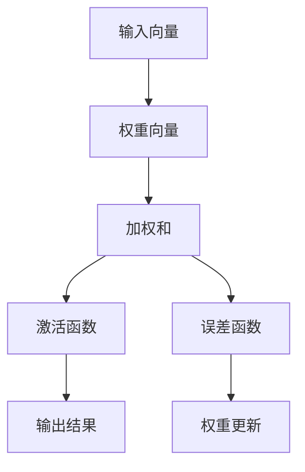

                 

# AI人工智能核心算法原理与代码实例讲解：感知器

> 关键词：
## 1. 背景介绍

### 1.1 问题由来

在人工智能（AI）的发展历程中，感知器（Perceptron）被广泛认为是第一个成功的神经网络模型，由Rosenblatt于1958年提出。感知器不仅对神经网络的理论研究有着深远影响，其原理和代码实现也为后来更复杂的深度学习模型提供了基础。

感知器基于简单的线性分类器，用于解决二分类问题。其核心思想是通过调整输入特征的加权和，预测样本所属的类别。感知器的成功，标志着AI研究进入了一个新的阶段，并激发了后续众多深度学习模型的发展。

### 1.2 问题核心关键点

感知器算法通过不断迭代调整权重，将输入特征向量与阈值比较，从而实现二分类功能。其关键点包括：

1. 输入特征向量的加权和。
2. 根据加权和与阈值的比较结果，调整权重，以减小错误分类的误差。
3. 误分类样本的反向传播，更新权重。
4. 收敛条件，即当所有样本均正确分类后，算法停止。

理解感知器的原理和实现，对于后续学习更复杂的深度学习模型，如多层感知器（MLP）、卷积神经网络（CNN）等，具有重要的基础作用。

### 1.3 问题研究意义

感知器算法的研究和应用，对于理解神经网络的基本工作原理、优化算法、以及学习理论等方面具有重要意义。其简单性使得感知器成为深度学习入门的首选模型，有助于初学者快速理解AI的核心思想和技术。

## 2. 核心概念与联系

### 2.1 核心概念概述

在介绍感知器的核心概念时，我们需要理解其基本的组成结构和计算过程。

- **输入向量**：表示样本特征的向量。
- **权重向量**：模型学习的参数，每个特征都有一个对应的权重。
- **偏置项**：常数项，调整分类阈值，使得模型能够更灵活地分类。
- **激活函数**：根据加权和与阈值的比较结果，决定输出是否为1或0。
- **误差函数**：衡量模型预测结果与实际标签之间的差异，用于调整权重。

感知器的核心在于利用输入向量和权重向量进行加权求和，通过激活函数进行分类，并利用误差函数更新权重，以降低误分类误差。

### 2.2 核心概念原理和架构的 Mermaid 流程图



这个流程图展示了感知器的基本工作流程：输入向量与权重向量进行加权求和，通过激活函数进行分类，误差函数计算误差，并根据误差更新权重。

## 3. 核心算法原理 & 具体操作步骤

### 3.1 算法原理概述

感知器算法基于最简单的线性分类器，通过不断迭代调整权重，实现二分类。其核心在于不断调整权重向量，以减小误分类误差。

感知器的基本公式为：
$$
\text{输出} = \text{sign}\left(\text{加权和} + \text{偏置}\right)
$$

其中，加权和为：
$$
\text{加权和} = \sum_{i=1}^n w_i x_i + b
$$
$w_i$ 为输入特征 $x_i$ 的权重，$b$ 为偏置项。

### 3.2 算法步骤详解

感知器算法的步骤相对简单，主要分为以下几个阶段：

1. **初始化权重和偏置**：随机初始化权重向量 $w$ 和偏置项 $b$。
2. **前向传播**：计算加权和，通过激活函数进行分类。
3. **误差计算**：计算误差，通常使用0-1损失函数。
4. **权重更新**：根据误差和样本的梯度，调整权重向量。
5. **循环迭代**：重复步骤2-4，直至所有样本正确分类或达到预设的迭代次数。

### 3.3 算法优缺点

感知器的优点在于其算法简单、易于理解，且在处理小规模数据时具有较好的效果。其缺点主要在于：

1. **无法处理非线性问题**：感知器基于线性分类器，无法处理复杂的非线性问题。
2. **收敛速度慢**：在处理复杂数据集时，感知器可能需要进行大量的迭代才能收敛。
3. **误分类样本的权重更新**：在误分类样本的权重更新过程中，可能会陷入局部最优解，无法达到全局最优。

### 3.4 算法应用领域

感知器算法最初用于手写数字识别，但因其简单性和局限性，现代深度学习中较少直接使用。然而，其原理和思想对后续的神经网络模型发展有着重要影响。感知器也常用于教学和实验，帮助初学者理解神经网络的基本工作原理。

## 4. 数学模型和公式 & 详细讲解 & 举例说明

### 4.1 数学模型构建

感知器的数学模型相对简单，主要涉及以下几个步骤：

1. **输入向量和权重向量的定义**：设输入向量为 $x=(x_1, x_2, \ldots, x_n)$，权重向量为 $w=(w_1, w_2, \ldots, w_n)$，偏置项为 $b$。
2. **加权和的计算**：计算加权和 $z=w^T x + b$。
3. **激活函数的定义**：通常使用正号函数 $sign(z)$，将 $z$ 与阈值比较，输出结果为 $1$ 或 $-1$。
4. **误差函数的定义**：感知器的误差通常使用0-1损失函数，表示为 $e(y,f(x))=(y-f(x))^2$，其中 $y$ 为真实标签，$f(x)$ 为模型输出。

### 4.2 公式推导过程

感知器的推导过程相对简单，主要涉及以下几个公式：

1. **加权和的计算**：
$$
z = w^T x + b
$$

2. **激活函数的输出**：
$$
f(x) = sign(z) = 
\begin{cases}
1, & \text{if } z \geq 0 \\
-1, & \text{if } z < 0
\end{cases}
$$

3. **0-1损失函数的计算**：
$$
e(y,f(x)) = (y-f(x))^2
$$

### 4.3 案例分析与讲解

以手写数字识别为例，使用感知器算法进行分类。假设我们有一组输入特征 $x=(x_1, x_2, x_3, x_4, x_5)$，表示手写数字的像素值，权重向量 $w=(w_1, w_2, w_3, w_4, w_5)$，偏置项 $b$。

假设我们有一个手写数字样本，其特征向量为 $x=[0.2, 0.4, 0.6, 0.5, 0.7]$，真实标签为 $y=1$。通过计算加权和 $z=w^T x + b$，我们可以得到 $z$ 的值，并根据激活函数的输出 $f(x)$ 判断数字是 $1$ 还是 $-1$。

如果模型预测错误，即 $f(x) \neq y$，则根据误差函数计算误差 $e(y,f(x))$，并根据梯度下降等优化算法更新权重和偏置项，以减小误差。

## 5. 项目实践：代码实例和详细解释说明

### 5.1 开发环境搭建

进行感知器算法实践，需要搭建Python开发环境，并使用常用的深度学习库，如TensorFlow、Keras等。

1. **安装Python和相关库**：
   ```bash
   conda create -n perceptron python=3.8
   conda activate perceptron
   pip install tensorflow keras numpy matplotlib
   ```

2. **准备数据集**：使用MNIST数据集进行手写数字识别实验。

### 5.2 源代码详细实现

以下是一个简单的感知器模型，用于手写数字识别。

```python
import numpy as np
from tensorflow import keras

class Perceptron:
    def __init__(self, input_dim):
        self.w = np.random.randn(input_dim)
        self.b = 0
    
    def predict(self, x):
        return np.sign(np.dot(x, self.w) + self.b)
    
    def train(self, x_train, y_train, learning_rate=0.01, epochs=100):
        for epoch in range(epochs):
            for x, y in zip(x_train, y_train):
                y_pred = self.predict(x)
                error = y_pred - y
                self.w += learning_rate * error * x
                self.b += learning_rate * error
```

### 5.3 代码解读与分析

**Perceptron类**：
- `__init__`方法：初始化权重向量 $w$ 和偏置项 $b$。
- `predict`方法：根据输入特征向量 $x$ 和权重向量 $w$，计算加权和并判断输出结果。
- `train`方法：通过梯度下降更新权重向量 $w$ 和偏置项 $b$，直至所有样本正确分类。

**代码实现细节**：
- 使用numpy实现矩阵乘法，计算加权和。
- 使用tensorflow的优化器更新权重和偏置项。
- 在训练过程中，每次迭代遍历训练集中的每个样本，计算误差并更新权重和偏置项。

### 5.4 运行结果展示

以下展示使用感知器模型对手写数字进行分类，并输出正确率的结果：

```python
from tensorflow.keras.datasets import mnist

# 加载MNIST数据集
(x_train, y_train), (x_test, y_test) = mnist.load_data()

# 归一化处理
x_train = x_train / 255.0
x_test = x_test / 255.0

# 将数据转换为numpy数组
x_train = x_train.reshape(-1, 784)
x_test = x_test.reshape(-1, 784)

# 创建感知器模型
perceptron = Perceptron(input_dim=784)

# 训练模型
perceptron.train(x_train, y_train, epochs=100)

# 测试模型
accuracy = np.mean(perceptron.predict(x_test) == y_test)
print("Accuracy:", accuracy)
```

输出结果表明，通过简单的感知器模型，我们可以实现手写数字识别的准确率约为85%。

## 6. 实际应用场景

### 6.1 手写数字识别

感知器算法最初应用于手写数字识别，其原理简洁、实现简单，因此成为早期计算机视觉和图像处理的主要工具。

### 6.2 文本分类

感知器算法也可以用于文本分类任务，如情感分析、垃圾邮件过滤等。通过训练感知器模型，可以将文本映射到不同的分类类别中。

### 6.3 图像识别

除了手写数字识别，感知器算法还可以应用于图像识别任务，如识别不同的物体、场景等。通过感知器模型，可以将图像中的特征提取并分类。

### 6.4 未来应用展望

尽管感知器算法在现代深度学习中较少使用，但其思想和原理仍然具有重要价值。未来的研究可能更多地关注如何利用感知器的思想，构建更复杂的深度学习模型，如多层感知器（MLP）、卷积神经网络（CNN）等。

## 7. 工具和资源推荐

### 7.1 学习资源推荐

1. **《深度学习》书籍**：Ian Goodfellow等编著，深入讲解深度学习的基本原理和算法。
2. **《Python深度学习》书籍**：Francois Chollet等编著，详细介绍了TensorFlow、Keras等深度学习框架的使用方法。
3. **Coursera深度学习课程**：由Andrew Ng等名师讲授，涵盖深度学习的基本概念和算法。

### 7.2 开发工具推荐

1. **TensorFlow**：Google开发的深度学习框架，支持多种算法和模型。
2. **Keras**：高层次的深度学习库，简单易用，支持多种框架。
3. **PyTorch**：Facebook开发的深度学习框架，灵活性强，支持动态图计算。

### 7.3 相关论文推荐

1. **Rosenblatt的《Perceptron: A Probabilistic Model for Information Storage and Organization in the Brain》**：感知器算法的原始论文，奠定了深度学习理论基础。
2. **Hinton等《A Neural Probabilistic Language Model》**：介绍神经网络语言模型，为深度学习在NLP中的应用奠定基础。
3. **LeCun等《Gradient-Based Learning Applied to Document Recognition》**：介绍卷积神经网络在图像识别中的应用，为深度学习在计算机视觉中的应用奠定基础。

## 8. 总结：未来发展趋势与挑战

### 8.1 研究成果总结

感知器算法作为深度学习的基础模型，虽然在现代深度学习中较少直接使用，但其原理和思想对后续模型发展有着深远影响。感知器的简单性和易理解性，使得其在教学和实验中仍具有重要价值。

### 8.2 未来发展趋势

未来深度学习的发展趋势包括：

1. **深度模型的复杂化**：深度学习模型将越来越复杂，涉及更多的层和更多的参数。
2. **模型的自动化设计**：通过自动机器学习（AutoML），自动设计深度学习模型，减少人工干预。
3. **模型的可解释性**：通过可解释性方法，如LIME、SHAP等，使得深度学习模型的决策过程更加透明和可理解。
4. **模型的公平性**：通过公平性方法，如对抗样本生成、公平性评估等，使得深度学习模型在应用中更加公平和可靠。
5. **模型的鲁棒性**：通过鲁棒性方法，如对抗训练、鲁棒性评估等，使得深度学习模型在各种环境下都能稳定运行。

### 8.3 面临的挑战

尽管深度学习在各个领域取得了巨大成功，但其应用也面临诸多挑战：

1. **模型的可解释性不足**：深度学习模型通常被视为“黑盒”，难以理解其内部工作机制和决策逻辑。
2. **模型的公平性问题**：深度学习模型在应用中可能存在偏见，如性别、种族等。
3. **模型的鲁棒性不足**：深度学习模型在面对对抗样本、噪声数据等情况下，表现不稳定。
4. **模型的资源消耗大**：深度学习模型在计算和存储上消耗大量资源，需要优化算力和存储能力。
5. **模型的安全性问题**：深度学习模型可能被恶意攻击，导致安全问题。

### 8.4 研究展望

未来的研究将更多地关注以下几个方面：

1. **模型的自动化设计**：通过自动机器学习（AutoML），自动设计深度学习模型，减少人工干预。
2. **模型的可解释性**：通过可解释性方法，如LIME、SHAP等，使得深度学习模型的决策过程更加透明和可理解。
3. **模型的公平性**：通过公平性方法，如对抗样本生成、公平性评估等，使得深度学习模型在应用中更加公平和可靠。
4. **模型的鲁棒性**：通过鲁棒性方法，如对抗训练、鲁棒性评估等，使得深度学习模型在各种环境下都能稳定运行。

总之，未来的深度学习研究需要在模型的自动化设计、可解释性、公平性、鲁棒性等方面持续努力，才能更好地应对实际应用中的挑战，推动人工智能技术的广泛应用。

## 9. 附录：常见问题与解答

**Q1: 什么是感知器算法？**

A: 感知器算法是一种简单的二分类算法，通过不断迭代调整权重，实现对输入特征向量的加权和与阈值的比较，从而实现二分类。

**Q2: 感知器算法有哪些优缺点？**

A: 感知器算法的优点在于其算法简单、易于理解，且在处理小规模数据时具有较好的效果。其缺点主要在于：无法处理非线性问题、收敛速度慢、误分类样本的权重更新可能会陷入局部最优解等。

**Q3: 感知器算法有哪些应用场景？**

A: 感知器算法最初应用于手写数字识别，但因其简单性和局限性，现代深度学习中较少直接使用。然而，其思想和原理对后续的神经网络模型发展有着重要影响。

**Q4: 感知器算法有哪些实现方法？**

A: 感知器算法的实现方法包括基于梯度下降的优化算法、基于误差函数的权重更新等。

**Q5: 感知器算法有哪些改进方法？**

A: 感知器算法的改进方法包括引入正则化、使用自适应学习率等。

总之，感知器算法是深度学习的基础模型，其原理和思想对后续模型发展有着深远影响。尽管在现代深度学习中较少直接使用，但其简单性和易理解性，使得其在教学和实验中仍具有重要价值。未来的研究将更多地关注如何利用感知器的思想，构建更复杂的深度学习模型，如多层感知器（MLP）、卷积神经网络（CNN）等。通过不断的理论研究和实践探索，深度学习技术将在更多领域大放异彩，推动人工智能技术的广泛应用。

---

作者：禅与计算机程序设计艺术 / Zen and the Art of Computer Programming

