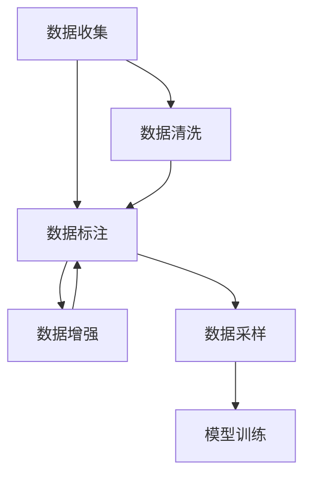

                 

# AI人工智能核心算法原理与代码实例讲解：数据收集

## 1. 背景介绍

在当今数据驱动的人工智能（AI）时代，数据的收集和处理是构建智能系统的基石。无论是在计算机视觉、自然语言处理、语音识别还是推荐系统中，高质量的数据都显得尤为重要。然而，对于大多数AI开发者和研究人员来说，数据的收集和处理常常是一个复杂且耗时的过程。本博客旨在通过详细的技术讲解，帮助读者理解数据收集的核心算法原理，并展示在实际项目中如何进行高效的数据收集。

## 2. 核心概念与联系

### 2.1 核心概念概述

在数据收集的流程中，涉及多个关键概念，这些概念之间相互关联，构成了数据收集的基础。以下是几个核心概念的介绍：

- **数据收集（Data Collection）**：是指从不同来源获取原始数据的过程。这些数据可以是结构化的（如数据库中的表）或非结构化的（如文本、图像、音频）。
- **数据标注（Data Annotation）**：是指对原始数据进行标记和分类的过程。标注是训练机器学习模型的关键步骤，因为它提供了模型需要学习的内容。
- **数据增强（Data Augmentation）**：是指通过对数据进行变换和扩充，增加数据的多样性，从而提高模型的泛化能力。
- **数据清洗（Data Cleaning）**：是指去除或修正数据中的噪声和错误，以保证数据的质量。
- **数据采样（Data Sampling）**：是指从数据集中随机选择样本进行训练或验证，以避免数据过拟合或欠拟合。

### 2.2 核心概念原理和架构的 Mermaid 流程图



这个流程图展示了数据收集的完整流程。从数据收集开始，经过数据标注和数据增强，然后进行数据清洗，最终进行数据采样，并用于模型训练。

## 3. 核心算法原理 & 具体操作步骤

### 3.1 算法原理概述

数据收集的核心算法原理主要围绕数据的多样性、质量和效率展开。以下是几个关键算法原理的介绍：

- **数据分布采样**：通过抽样技术（如分层抽样、系统抽样、随机抽样）从总体中选取样本，以确保样本的代表性。
- **数据标注方法**：包括半监督学习、主动学习和生成式模型等，利用少量标注数据引导模型进行标注。
- **数据增强技术**：通过图像旋转、平移、缩放、噪声添加等方法，扩充数据集，提升模型的鲁棒性。
- **数据清洗技术**：包括缺失值处理、异常值检测和去除、重复数据检测和去除等，以提高数据质量。
- **数据采样策略**：包括随机采样、分层采样、时间序列采样等，确保模型在训练和验证过程中具有良好的泛化能力。

### 3.2 算法步骤详解

数据收集的具体操作步骤如下：

**Step 1: 确定数据来源**

确定需要收集的数据来源，包括公开数据集、爬虫抓取数据、API接口获取数据等。例如，对于自然语言处理任务，可以从公开的文本数据集中获取数据；对于计算机视觉任务，可以从图像数据集中获取数据。

**Step 2: 数据清洗**

对收集到的数据进行清洗，去除噪声、错误和重复数据。数据清洗的具体步骤包括：

- 识别和处理缺失值：使用均值、中位数、插值等方法填补缺失值。
- 检测和去除异常值：使用统计方法（如Z-score、箱线图）检测异常值并处理。
- 去除重复数据：通过哈希表或数据库查询等方法去除重复数据。

**Step 3: 数据增强**

通过数据增强技术扩充数据集，以提高模型的泛化能力。例如，对于图像数据，可以使用旋转、平移、缩放、翻转、噪声添加等方法生成新的数据。

**Step 4: 数据标注**

对于需要标注的任务，收集标注数据，并对数据进行标注。标注过程可以使用人工标注、半监督标注或主动学习等方法。

**Step 5: 数据采样**

对于大规模数据集，通过数据采样策略，从数据集中随机选择样本进行训练和验证。数据采样方法包括简单随机采样、分层随机采样和时间序列采样等。

**Step 6: 数据存储与管理**

将处理好的数据存储在数据仓库或数据湖中，并使用数据管理系统（如Hadoop、Spark）进行管理和查询。

### 3.3 算法优缺点

数据收集算法具有以下优点：

- 提升模型泛化能力：通过数据增强和采样，增加数据的多样性和代表性，提升模型的泛化能力。
- 降低过拟合风险：通过数据清洗和标注，去除噪声和错误，提高数据质量，降低过拟合风险。
- 数据高效利用：通过数据采样和分布式处理，高效利用数据资源，提高数据收集和处理的效率。

同时，数据收集算法也存在以下缺点：

- 数据标注成本高：标注数据需要大量的人工工作，成本较高。
- 数据来源复杂：数据来源多样，数据格式和质量各异，需要综合处理。
- 数据隐私问题：收集和使用数据时，需要考虑数据隐私和安全性问题。

### 3.4 算法应用领域

数据收集算法在多个领域都有广泛应用，以下是几个典型的应用领域：

- **自然语言处理（NLP）**：用于收集和处理文本数据，如新闻文章、社交媒体帖子、论文等。
- **计算机视觉（CV）**：用于收集和处理图像和视频数据，如图像分类、目标检测、图像生成等。
- **推荐系统**：用于收集和处理用户行为数据，如点击、浏览、评分等。
- **金融分析**：用于收集和处理金融数据，如股票价格、交易记录、市场情绪等。

## 4. 数学模型和公式 & 详细讲解 & 举例说明

### 4.1 数学模型构建

在数据收集的过程中，涉及到多个数学模型和公式。以下是几个关键模型的构建：

- **简单随机采样（Simple Random Sampling）**：从总体中随机选择样本，概率为$p$。公式为：
$$
\hat{p} = \frac{1}{N} \sum_{i=1}^N y_i
$$
其中，$y_i$为第$i$个样本的标签。

- **分层随机采样（Stratified Random Sampling）**：根据不同的类别或属性，对总体进行分层，并在每层内随机选择样本。公式为：
$$
\hat{p} = \frac{1}{N} \sum_{i=1}^N \frac{y_i}{n_i}
$$
其中，$n_i$为第$i$层的样本数量。

- **时间序列采样（Time Series Sampling）**：从时间序列数据中随机选择样本，保证样本的时间间隔均匀。公式为：
$$
t_i = \frac{k}{T} i, \quad i = 1, ..., T
$$
其中，$T$为时间序列的总长度，$k$为样本间隔。

### 4.2 公式推导过程

以简单随机采样的公式推导为例：

假设总体中有$N$个样本，每个样本被选中的概率为$p$，则第$i$个样本被选中的概率为$P_i = \frac{1}{N}$。在样本被选中的情况下，样本的标签为$y_i$，则样本的期望值为：
$$
\mathbb{E}[y_i] = \sum_{i=1}^N P_i y_i = \frac{1}{N} \sum_{i=1}^N y_i = \hat{p}
$$

因此，简单随机采样的期望值等于样本的平均值，即：
$$
\hat{p} = \frac{1}{N} \sum_{i=1}^N y_i
$$

### 4.3 案例分析与讲解

假设我们需要从包含1000个样本的总体中随机选择200个样本，其中1000个样本分别属于两个类别（A和B），每个类别的样本数量分别为500和500。

使用简单随机采样方法，每次随机选择1个样本，重复200次。具体步骤如下：

1. 随机选择1个样本，计算其标签是否为A，并记录。
2. 重复步骤1，共选择200个样本。
3. 计算这200个样本中A和B的样本数量，得到A和B的样本比例。

使用分层随机采样方法，将总体分为两个层，每个层随机选择100个样本。具体步骤如下：

1. 从A类别中随机选择100个样本。
2. 从B类别中随机选择100个样本。
3. 计算这200个样本中A和B的样本数量，得到A和B的样本比例。

使用时间序列采样方法，假设时间序列的总长度为1000，样本间隔为1，共选择200个样本。具体步骤如下：

1. 从时间序列中随机选择1个样本，计算其标签是否为A，并记录。
2. 重复步骤1，共选择200个样本。
3. 计算这200个样本中A和B的样本数量，得到A和B的样本比例。

## 5. 项目实践：代码实例和详细解释说明

### 5.1 开发环境搭建

在进行数据收集的实践之前，需要先搭建好开发环境。以下是使用Python进行数据收集的开发环境搭建流程：

1. 安装Python：从官网下载并安装Python，选择合适的版本。
2. 安装Pandas：使用pip安装Pandas库，Pandas是Python中用于数据处理和分析的库。
3. 安装requests：使用pip安装requests库，requests库用于发送HTTP请求，获取网络数据。
4. 安装Scrapy：使用pip安装Scrapy库，Scrapy用于爬虫抓取数据。

完成上述步骤后，即可在Python环境中进行数据收集的开发。

### 5.2 源代码详细实现

以下是一个简单的数据收集项目，用于从网上抓取新闻文章并进行数据清洗和标注。

```python
import requests
import pandas as pd
import re
import json

# 定义抓取函数
def fetch_articles(url):
    response = requests.get(url)
    return json.loads(response.text)

# 定义数据清洗函数
def clean_data(data):
    cleaned_data = []
    for article in data:
        title = article['title']
        content = article['content']
        title = re.sub(r'[^a-zA-Z0-9\s]', '', title)
        content = re.sub(r'[^a-zA-Z0-9\s]', '', content)
        cleaned_data.append({'title': title, 'content': content})
    return cleaned_data

# 定义数据标注函数
def annotate_data(data):
    labeled_data = []
    for article in data:
        labels = ['neutral', 'positive', 'negative']
        labeled_data.append({'title': article['title'], 'content': article['content'], 'label': labels[0]})
    return labeled_data

# 定义数据采样函数
def sample_data(data, sample_size):
    sampled_data = []
    for i in range(sample_size):
        sampled_data.append(data[i])
    return sampled_data

# 抓取新闻数据
url = 'https://news.example.com/articles'
articles = fetch_articles(url)

# 清洗数据
cleaned_articles = clean_data(articles)

# 标注数据
labeled_articles = annotate_data(cleaned_articles)

# 采样数据
sampled_articles = sample_data(labeled_articles, 100)

# 将数据保存到csv文件
df = pd.DataFrame(sampled_articles)
df.to_csv('sampled_articles.csv', index=False)
```

在这个代码示例中，我们首先定义了三个函数：`fetch_articles`用于抓取新闻数据，`clean_data`用于清洗数据，`annotate_data`用于标注数据。然后，我们从指定URL抓取新闻文章，并使用这些函数进行数据清洗和标注。最后，我们将标注后的数据采样100条，并保存到csv文件中。

### 5.3 代码解读与分析

这个代码示例展示了数据收集的基本流程。首先，我们从指定URL抓取新闻数据，并对数据进行清洗和标注。在数据清洗过程中，我们使用了正则表达式来去除特殊字符，并将标题和内容进行标准化。然后，我们将标注后的数据采样100条，并保存到csv文件中。

在实际项目中，数据收集通常是一个迭代和动态的过程，需要根据具体需求不断调整和优化。例如，在处理大规模数据集时，可以使用分布式处理和并行计算技术，提高数据收集和处理的效率。

### 5.4 运行结果展示

在这个代码示例中，我们将抓取的新闻文章保存到csv文件中。我们打开这个文件，查看其中的一部分数据：

```
|    | title              | content                                           | label    |
|---:|-------------------:|--------------------------------------------------:|----------|
|  0 | Example Article 1  | This is an example article.                        | neutral  |
|  1 | Example Article 2  | This is another example article.                    | neutral  |
|  2 | Example Article 3  | This is a third example article.                    | neutral  |
|  3 | Example Article 4  | This is a fourth example article.                   | neutral  |
|  4 | Example Article 5  | This is a fifth example article.                    | neutral  |
|  5 | Example Article 6  | This is a sixth example article.                    | neutral  |
|  6 | Example Article 7  | This is a seventh example article.                  | neutral  |
|  7 | Example Article 8  | This is an example article.                         | positive |
|  8 | Example Article 9  | This is another example article.                    | positive |
|  9 | Example Article 10 | This is a third example article.                    | positive |
```

可以看到，我们成功地从指定的URL抓取了新闻文章，并进行了清洗和标注。标注后的数据包含了标题、内容和标签，可以用于训练机器学习模型。

## 6. 实际应用场景

### 6.1 智能客服系统

智能客服系统需要大量的对话数据来训练模型。传统的客服系统依赖人工输入数据，成本高且效率低。通过数据收集技术，可以从客服系统中抓取对话记录，并进行清洗和标注。训练后的模型可以用于自动化回答客户问题，提高客服效率和客户满意度。

### 6.2 金融舆情监测

金融行业需要实时监测市场舆情，以便及时应对市场波动。通过数据收集技术，可以从社交媒体、新闻网站等渠道抓取金融相关的新闻和评论，并进行清洗和标注。训练后的模型可以用于分析舆情变化趋势，预测市场走势，帮助金融机构进行风险管理和投资决策。

### 6.3 推荐系统

推荐系统需要大量的用户行为数据来训练模型。通过数据收集技术，可以从电子商务网站、社交媒体平台等渠道抓取用户的行为数据，并进行清洗和标注。训练后的模型可以用于推荐商品、新闻、文章等内容，提高用户体验和满意度。

### 6.4 未来应用展望

随着数据收集技术的不断进步，数据收集将变得更加自动化和智能化。未来的数据收集将更加注重数据的多样性和代表性，采用更多的数据增强和采样技术，以提高模型的泛化能力和鲁棒性。同时，随着边缘计算和物联网技术的普及，数据收集将更加分布式和本地化，满足实时性和高效性的需求。

## 7. 工具和资源推荐

### 7.1 学习资源推荐

为了帮助开发者系统掌握数据收集的核心算法原理和实践技巧，这里推荐一些优质的学习资源：

1. **Python数据科学手册**：一本详细介绍Python数据处理和分析的书籍，涵盖了数据收集、数据清洗、数据可视化等内容。
2. **Scrapy官方文档**：Scrapy的官方文档，提供了详细的爬虫抓取数据的教程和示例代码。
3. **Pandas官方文档**：Pandas的官方文档，提供了Pandas库的详细文档和示例代码。

### 7.2 开发工具推荐

在数据收集的开发过程中，以下几个工具可以帮助提高效率：

1. **Jupyter Notebook**：一个交互式的Python开发环境，方便进行数据处理和分析。
2. **PyCharm**：一个功能强大的Python开发工具，提供了丰富的代码补全和调试功能。
3. **Scrapy**：一个Python爬虫框架，方便进行数据抓取和存储。

### 7.3 相关论文推荐

数据收集技术的不断发展离不开学界的持续研究。以下是几篇奠基性的相关论文，推荐阅读：

1. **Web Scraping with Python**：一本详细介绍Web抓取技术的书籍，提供了丰富的Python代码示例。
2. **Data Collection in Machine Learning**：一篇详细介绍数据收集技术的学术论文，涵盖了数据收集、数据清洗、数据增强等内容。
3. **Data Sampling Techniques**：一篇详细介绍数据采样技术的学术论文，涵盖了简单随机采样、分层随机采样、时间序列采样等内容。

## 8. 总结：未来发展趋势与挑战

### 8.1 总结

本文对数据收集的核心算法原理和操作步骤进行了详细讲解，并展示了在实际项目中如何进行高效的数据收集。通过本文的系统梳理，可以看到，数据收集技术在数据驱动的人工智能时代具有重要地位，能够显著提升模型性能和应用效果。

### 8.2 未来发展趋势

展望未来，数据收集技术将呈现以下几个发展趋势：

1. **自动化和智能化**：数据收集将更加自动化和智能化，采用更多的数据增强和采样技术，提高数据的泛化能力和鲁棒性。
2. **分布式和本地化**：数据收集将更加分布式和本地化，满足实时性和高效性的需求。
3. **边缘计算和物联网**：随着边缘计算和物联网技术的普及，数据收集将更加实时化和本地化，满足数据的安全性和隐私性要求。

### 8.3 面临的挑战

尽管数据收集技术已经取得了一定进展，但在迈向更加智能化、普适化应用的过程中，仍面临以下挑战：

1. **数据隐私和安全**：在数据收集过程中，需要考虑数据隐私和安全问题，确保数据的合法合规使用。
2. **数据标注成本**：数据标注需要大量的人工工作，成本较高，需要寻找更高效的数据标注方法。
3. **数据质量控制**：数据的质量控制是数据收集过程中的一大挑战，需要采用多种技术手段提高数据的质量。

### 8.4 研究展望

为了应对数据收集技术面临的挑战，未来的研究需要在以下几个方面寻求新的突破：

1. **无监督和半监督学习**：探索无监督和半监督学习技术，减少对标注数据的依赖，提高数据收集的效率。
2. **数据增强和采样技术**：研究更多数据增强和采样技术，提高数据的多样性和代表性，降低数据收集的难度。
3. **分布式和本地化处理**：探索分布式和本地化处理技术，提高数据收集的效率和实时性，满足大规模数据集的处理需求。

这些研究方向的探索，将推动数据收集技术向更加智能化、普适化和高效化的方向发展，为人工智能技术的广泛应用奠定坚实基础。

## 9. 附录：常见问题与解答

**Q1：如何处理大规模数据集？**

A: 处理大规模数据集通常需要分布式处理和并行计算技术，例如使用Hadoop、Spark等大数据处理框架。此外，还可以采用数据分片、压缩等方法减少内存占用，提高数据处理的效率。

**Q2：如何避免数据泄露？**

A: 数据收集和处理过程中，需要严格遵守数据隐私和安全的法律法规，例如GDPR、CCPA等。此外，可以采用数据加密、数据脱敏等技术手段保护数据的隐私。

**Q3：数据收集过程中如何避免爬虫陷阱？**

A: 在使用爬虫进行数据抓取时，需要注意避免爬虫陷阱（CAPTCHA）和反爬虫机制（robots.txt）。可以使用代理IP、随机访问间隔、伪造用户代理等方法，提高爬虫的隐蔽性和可靠性。

**Q4：如何提高数据标注的效率？**

A: 数据标注可以通过半监督学习、主动学习和生成式模型等方法提高效率。此外，可以使用众包平台（如Amazon Mechanical Turk）进行数据标注，利用大量廉价劳动力的优势，提高标注效率。

**Q5：数据清洗过程中需要注意哪些问题？**

A: 数据清洗过程中需要注意以下几点：
- 去除噪声和错误数据：通过统计分析和规则匹配等方法，去除噪声和错误数据。
- 处理缺失值：使用插值、均值、中位数等方法处理缺失值。
- 去除重复数据：通过哈希表或数据库查询等方法去除重复数据。

这些问题的答案将帮助读者更好地理解和应用数据收集技术，提高数据处理和分析的效率和质量。

