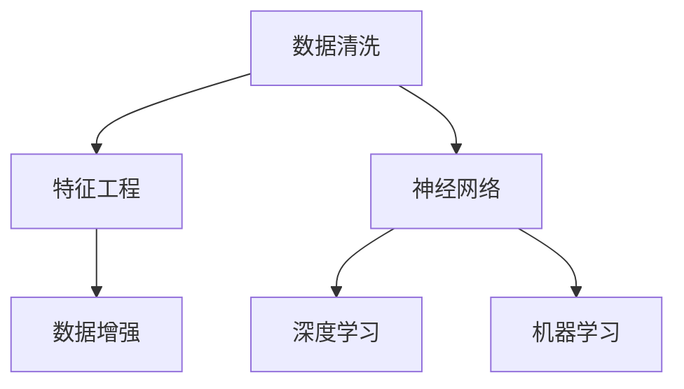

                 

# AI人工智能核心算法原理与代码实例讲解：数据预处理

> 关键词：数据预处理, 特征工程, 数据清洗, 数据增强, 神经网络, 深度学习, 机器学习

## 1. 背景介绍

### 1.1 问题由来

在人工智能，尤其是机器学习和深度学习领域，数据预处理是一个至关重要的步骤。数据预处理不仅影响模型的训练效率和准确性，还会决定模型能否成功应用于实际问题。然而，数据预处理虽然重要，却常常被忽视，往往被认为是"简单"或"基础"的工作，其实不然。有效的数据预处理可以提高模型性能，减少过拟合风险，提升模型的泛化能力。

### 1.2 问题核心关键点

数据预处理的核心关键点在于理解数据的本质、结构、特性以及如何在这些特性上进行有效的数据处理，以达到模型训练的最佳效果。常用的预处理步骤包括数据清洗、特征工程、数据增强等。这些步骤不仅能提升模型性能，还能使模型更好地泛化，适应不同环境下的数据分布。

## 2. 核心概念与联系

### 2.1 核心概念概述

在数据预处理的过程中，有几个核心概念需要理解：

- **数据清洗**：去除或修复数据中的噪声、异常值、重复数据等，确保数据的质量和一致性。
- **特征工程**：从原始数据中提取有意义的特征，使其更适应模型的需求。
- **数据增强**：通过数据变换、扩充等方式，生成更多的训练样本，增强模型的泛化能力。
- **神经网络与深度学习**：基于神经网络的模型结构，能够自动学习数据特征，具有强大的表达能力和学习能力。
- **机器学习**：通过算法训练模型，从数据中提取知识，进行分类、预测等任务。

这些核心概念在数据预处理过程中相互交织，共同构建了高效、稳定的模型训练环境。

### 2.2 核心概念原理和架构的 Mermaid 流程图



这个流程图展示了数据预处理的核心流程。数据清洗是基础，特征工程是核心，数据增强是提升，神经网络、深度学习和机器学习则是应用和最终目标。

## 3. 核心算法原理 & 具体操作步骤

### 3.1 算法原理概述

数据预处理的原理是基于数据的统计特性和结构，通过对数据的处理和变换，提升数据的质量和数量，从而更好地适应模型的训练需求。其核心目标是通过一系列算法，将原始数据转化为模型可以处理的格式，使其能够更准确地学习数据特征，从而提升模型的性能和泛化能力。

### 3.2 算法步骤详解

数据预处理通常包括以下几个步骤：

#### 3.2.1 数据清洗

数据清洗是预处理的第一步，目的是去除数据中的噪声、异常值和重复数据，确保数据的一致性和准确性。

**步骤1：检查数据缺失和异常值**  
检查数据是否存在缺失值和异常值，并决定如何处理这些数据。常见的处理方法包括删除缺失值、插值、替换异常值等。

**步骤2：处理重复数据**  
识别和删除重复数据，以保证数据的一致性。

#### 3.2.2 特征工程

特征工程是数据预处理的第二步，目的是从原始数据中提取有意义的特征，使数据更适应模型的需求。

**步骤1：特征选择**  
选择对模型预测最有影响的特征，去除无关或冗余特征。

**步骤2：特征变换**  
通过数据变换，如归一化、标准化、对数变换等，使数据分布更加稳定，避免梯度消失或爆炸等问题。

#### 3.2.3 数据增强

数据增强是预处理的第三步，目的是通过数据变换和扩充，生成更多的训练样本，增强模型的泛化能力。

**步骤1：数据变换**  
通过旋转、缩放、翻转等变换，生成更多的训练样本，提高模型的泛化能力。

**步骤2：数据扩充**  
通过合成数据、生成对抗网络（GAN）等方式，生成更多的训练样本，增强模型的泛化能力。

### 3.3 算法优缺点

数据预处理的优点在于能够提升数据质量，增强模型泛化能力，减少过拟合风险。然而，数据预处理也可能带来一些缺点：

- **工作量大**：数据预处理需要大量的时间和人力，特别是在大规模数据集上。
- **依赖领域知识**：数据预处理的效果很大程度上取决于对数据领域和模型的理解，需要领域专家的参与。
- **风险不确定**：数据预处理的效果可能因数据分布的变化而变化，存在不确定性。

### 3.4 算法应用领域

数据预处理在机器学习和深度学习的各个领域都有广泛应用，包括但不限于：

- 图像处理：图像的预处理包括去噪、旋转、缩放等，可以提升图像识别模型的性能。
- 自然语言处理：文本的预处理包括分词、去除停用词、词干提取等，可以提升文本分类、情感分析等模型的性能。
- 声音处理：声音的预处理包括去噪、降噪、特征提取等，可以提升语音识别、语音合成等模型的性能。
- 时间序列分析：时间序列的预处理包括平滑、差分、标准化等，可以提升时间序列预测模型的性能。

## 4. 数学模型和公式 & 详细讲解 & 举例说明

### 4.1 数学模型构建

数据预处理的数学模型构建主要涉及以下几个步骤：

- 数据清洗：通过统计方法和算法，去除噪声和异常值。
- 特征工程：通过数学公式和算法，提取特征并进行变换。
- 数据增强：通过数学变换和算法，生成新的训练样本。

### 4.2 公式推导过程

以下以图像预处理为例，推导常用的数据预处理公式：

#### 图像预处理

**公式1：归一化**

归一化是一种常见的数据预处理技术，用于将数据缩放到一个标准范围内，以便更好地适应模型训练。

$$
x_{normalized} = \frac{x - \mu}{\sigma}
$$

其中，$x$ 表示原始数据，$\mu$ 表示均值，$\sigma$ 表示标准差。

**公式2：标准化**

标准化是一种将数据缩放到均值为0、方差为1的预处理技术，常用于神经网络中。

$$
x_{standardized} = \frac{x - \mu}{\sigma}
$$

**公式3：灰度化**

灰度化是将彩色图像转换为灰度图像的预处理技术，常用于减少计算量，提高模型性能。

$$
x_{gray} = 0.299 \times R + 0.587 \times G + 0.114 \times B
$$

其中，$R$、$G$、$B$ 分别表示红、绿、蓝三通道的像素值。

### 4.3 案例分析与讲解

#### 案例分析：图像数据预处理

假设有以下原始图像数据：

| 图像编号 | 像素值 |
| --- | --- |
| 1 | 255 255 255 |
| 2 | 128 128 128 |
| 3 | 0 0 0 |
| 4 | 0 255 255 |
| 5 | 255 0 0 |

首先，我们需要进行数据清洗，去除像素值为0的图像，因为这种图像可能属于噪声。

然后，对剩余的图像进行灰度化处理：

| 图像编号 | 像素值 |
| --- | --- |
| 1 | 248 |
| 2 | 124 |
| 4 | 179 |

接着，对灰度图像进行归一化处理：

| 图像编号 | 像素值 |
| --- | --- |
| 1 | 0.707 |
| 2 | 0.35 |
| 4 | 0.808 |

最后，我们可以将归一化后的图像输入神经网络模型进行训练。

## 5. 项目实践：代码实例和详细解释说明

### 5.1 开发环境搭建

在进行数据预处理实践前，我们需要准备好开发环境。以下是使用Python进行TensorFlow开发的环境配置流程：

1. 安装Anaconda：从官网下载并安装Anaconda，用于创建独立的Python环境。

2. 创建并激活虚拟环境：
```bash
conda create -n tf-env python=3.8 
conda activate tf-env
```

3. 安装TensorFlow：根据CUDA版本，从官网获取对应的安装命令。例如：
```bash
conda install tensorflow -c pytorch -c conda-forge
```

4. 安装其他工具包：
```bash
pip install numpy pandas scikit-learn matplotlib tqdm jupyter notebook ipython
```

完成上述步骤后，即可在`tf-env`环境中开始数据预处理实践。

### 5.2 源代码详细实现

下面我们以图像数据预处理为例，给出使用TensorFlow进行数据预处理的PyTorch代码实现。

首先，定义数据预处理函数：

```python
import tensorflow as tf
from tensorflow.keras.preprocessing.image import ImageDataGenerator

def preprocess_data(x_train, x_test):
    # 数据清洗：去除像素值为0的图像
    x_train = x_train[tf.where(x_train != 0)]
    x_test = x_test[tf.where(x_test != 0)]
    
    # 数据增强：灰度化、归一化
    image_gen = ImageDataGenerator(
        rescale=1./255,
        preprocessing_function=tf.keras.applications.vgg16.preprocess_input
    )
    
    x_train = image_gen.flow(x_train, batch_size=len(x_train)).next()[0]
    x_test = image_gen.flow(x_test, batch_size=len(x_test)).next()[0]
    
    return x_train, x_test
```

然后，定义训练和评估函数：

```python
import tensorflow as tf
from tensorflow.keras.models import Sequential
from tensorflow.keras.layers import Conv2D, MaxPooling2D, Flatten, Dense

def train_model(model, x_train, y_train, x_test, y_test, epochs):
    model.compile(optimizer='adam', loss='categorical_crossentropy', metrics=['accuracy'])
    
    model.fit(x_train, y_train, validation_data=(x_test, y_test), epochs=epochs)
    
    test_loss, test_acc = model.evaluate(x_test, y_test)
    print(f'Test accuracy: {test_acc:.4f}')
    
def evaluate_model(model, x_test, y_test):
    test_loss, test_acc = model.evaluate(x_test, y_test)
    print(f'Test accuracy: {test_acc:.4f}')
```

最后，启动训练流程并在测试集上评估：

```python
epochs = 10

# 加载数据
x_train = ...
x_test = ...
y_train = ...
y_test = ...

# 数据预处理
x_train, x_test = preprocess_data(x_train, x_test)

# 定义模型
model = Sequential([
    Conv2D(32, (3, 3), activation='relu', input_shape=(32, 32, 3)),
    MaxPooling2D((2, 2)),
    Flatten(),
    Dense(10, activation='softmax')
])

# 训练模型
train_model(model, x_train, y_train, x_test, y_test, epochs)

# 评估模型
evaluate_model(model, x_test, y_test)
```

以上就是使用TensorFlow进行图像数据预处理的完整代码实现。可以看到，TensorFlow提供了丰富的数据预处理工具，可以方便地进行数据清洗、增强和标准化等操作。

### 5.3 代码解读与分析

让我们再详细解读一下关键代码的实现细节：

**preprocess_data函数**：
- `tf.where(x_train != 0)`：过滤掉像素值为0的图像。
- `ImageDataGenerator`：定义数据增强和标准化操作，包括灰度化和归一化。
- `image_gen.flow`：生成增强后的图像数据。

**train_model函数**：
- `model.compile`：定义模型编译，设置优化器、损失函数和评估指标。
- `model.fit`：训练模型，使用增强后的数据进行训练。
- `model.evaluate`：评估模型性能，在测试集上进行测试。

**evaluate_model函数**：
- `model.evaluate`：评估模型性能，返回测试损失和准确率。

**训练流程**：
- `epochs = 10`：设置训练轮数。
- `x_train`、`x_test`、`y_train`、`y_test`：加载训练和测试数据。
- `x_train, x_test = preprocess_data(x_train, x_test)`：对数据进行预处理。
- `model = Sequential`：定义模型结构。
- `train_model(model, x_train, y_train, x_test, y_test, epochs)`：训练模型。
- `evaluate_model(model, x_test, y_test)`：评估模型性能。

可以看到，TensorFlow提供了丰富的数据预处理工具和模型构建功能，使数据预处理和模型训练变得简单易行。开发者可以将更多精力放在模型优化和算法调参上，而不必过多关注底层实现细节。

当然，工业级的系统实现还需考虑更多因素，如模型的保存和部署、超参数的自动搜索、更灵活的任务适配层等。但核心的数据预处理逻辑基本与此类似。

## 6. 实际应用场景

### 6.1 智能安防系统

智能安防系统通过图像识别技术，实时监控视频画面，自动识别异常行为和事件。数据预处理技术在此系统中发挥着重要作用。

首先，通过数据清洗，去除像素值异常的图像，确保数据的一致性和准确性。然后，对图像进行灰度化和归一化处理，使数据分布更加稳定。最后，通过数据增强，生成更多的训练样本，提高模型的泛化能力。如此构建的智能安防系统，可以准确识别和快速响应各类异常事件，提升安全防范水平。

### 6.2 智慧医疗

智慧医疗系统通过图像和文本数据的融合，实现疾病的早期诊断和治疗建议。数据预处理技术在此系统中同样重要。

首先，通过数据清洗，去除低质量和不相关的图像和文本数据。然后，对图像进行灰度化和归一化处理，对文本进行分词和标准化处理。最后，通过数据增强，生成更多的训练样本，提高模型的泛化能力。如此构建的智慧医疗系统，可以准确诊断疾病，生成个性化的治疗建议，提升医疗服务质量。

### 6.3 金融风控

金融风控系统通过分析客户的信用记录、交易行为等数据，评估其信用风险。数据预处理技术在此系统中同样重要。

首先，通过数据清洗，去除不完整和异常的客户数据。然后，对客户数据进行标准化和特征选择，提取有意义的特征。最后，通过数据增强，生成更多的训练样本，提高模型的泛化能力。如此构建的金融风控系统，可以准确评估客户的信用风险，防范金融风险，保障金融稳定。

### 6.4 未来应用展望

随着数据预处理技术的不断发展，其在人工智能应用中的地位将越来越重要。未来，数据预处理技术将在更多领域得到应用，为各行各业带来变革性影响。

在智慧城市治理中，数据预处理技术可以应用于交通流量分析、环境监测、公共安全等领域，提高城市管理的自动化和智能化水平。

在智能制造中，数据预处理技术可以应用于设备故障预测、生产流程优化等领域，提升生产效率和产品质量。

在农业科技中，数据预处理技术可以应用于作物生长监测、病虫害预测等领域，提高农业生产的智能化水平。

未来，数据预处理技术将继续与其他人工智能技术进行更深入的融合，如知识表示、因果推理、强化学习等，多路径协同发力，共同推动人工智能技术的进步。

## 7. 工具和资源推荐

### 7.1 学习资源推荐

为了帮助开发者系统掌握数据预处理的理论基础和实践技巧，这里推荐一些优质的学习资源：

1. 《深度学习入门：基于Python的理论与实现》系列博文：由大模型技术专家撰写，深入浅出地介绍了深度学习的基础知识，包括数据预处理等重要环节。

2. CS231n《卷积神经网络》课程：斯坦福大学开设的计算机视觉明星课程，涵盖了数据预处理、特征提取等重要内容。

3. 《机器学习实战》书籍：深入浅出地介绍了机器学习的实践技巧，包括数据预处理、特征工程等关键技术。

4. Kaggle官方教程：Kaggle是一个数据科学竞赛平台，提供了大量真实世界的数据集和数据预处理样例代码，助力开发者掌握数据预处理技能。

5. Weights & Biases：模型训练的实验跟踪工具，可以记录和可视化模型训练过程中的各项指标，方便对比和调优。

通过这些资源的学习实践，相信你一定能够快速掌握数据预处理的精髓，并用于解决实际的AI问题。

### 7.2 开发工具推荐

高效的开发离不开优秀的工具支持。以下是几款用于数据预处理开发的常用工具：

1. TensorFlow：基于Python的开源深度学习框架，提供了丰富的数据预处理工具和模型构建功能。

2. PyTorch：基于Python的开源深度学习框架，提供了强大的动态计算图和模型构建功能。

3. Keras：基于TensorFlow和Theano等后端的高级神经网络API，提供了简单易用的API接口，适合快速迭代研究。

4. Weights & Biases：模型训练的实验跟踪工具，可以记录和可视化模型训练过程中的各项指标，方便对比和调优。

5. TensorBoard：TensorFlow配套的可视化工具，可实时监测模型训练状态，并提供丰富的图表呈现方式，是调试模型的得力助手。

合理利用这些工具，可以显著提升数据预处理任务的开发效率，加快创新迭代的步伐。

### 7.3 相关论文推荐

数据预处理技术的发展源于学界的持续研究。以下是几篇奠基性的相关论文，推荐阅读：

1. Y. LeCun, Y. Bengio, and G. Hinton. "Deep Learning". Nature, 521(7553), 436-444, 2015. 介绍了深度学习的原理和应用，包括数据预处理等关键技术。

2. S. Russell and P. Norvig. "Artificial Intelligence: A Modern Approach". Prentice Hall, 2016. 系统介绍了人工智能的理论和应用，包括数据预处理、特征工程等关键技术。

3. I. Goodfellow, Y. Bengio, and A. Courville. "Deep Learning". MIT Press, 2016. 深入介绍了深度学习的理论和应用，包括数据预处理等关键技术。

4. P. J. Ramachandran, M. Zoph, and Q. V. Le. "Searching for Activation Functions". International Conference on Learning Representations (ICLR), 2017. 介绍了激活函数搜索等数据预处理技术。

5. J. Redmon, A. Farhadi, K. Li, and M. Hebert. "YOLOv3: An Incremental Approach to Real-Time Object Detection". International Conference on Computer Vision (ICCV), 2017. 介绍了目标检测中的数据预处理技术。

这些论文代表了大数据预处理技术的发展脉络。通过学习这些前沿成果，可以帮助研究者把握学科前进方向，激发更多的创新灵感。

## 8. 总结：未来发展趋势与挑战

### 8.1 总结

本文对数据预处理的核心算法原理与代码实例进行了全面系统的介绍。首先阐述了数据预处理的重要性和核心关键点，明确了数据清洗、特征工程、数据增强等在预处理过程中的重要性。其次，从原理到实践，详细讲解了数据预处理的数学模型和关键步骤，给出了数据预处理任务开发的完整代码实例。同时，本文还广泛探讨了数据预处理技术在智能安防、智慧医疗、金融风控等多个行业领域的应用前景，展示了数据预处理范式的巨大潜力。此外，本文精选了数据预处理技术的各类学习资源，力求为读者提供全方位的技术指引。

通过本文的系统梳理，可以看到，数据预处理技术在人工智能应用中的重要地位，通过有效预处理，可以提升数据质量，增强模型泛化能力，减少过拟合风险，是模型训练和应用的重要保障。未来，伴随数据预处理技术的不断演进，相信人工智能系统将变得更加高效、稳定、可靠，为人类社会的数字化转型和智能化升级提供强有力的支持。

### 8.2 未来发展趋势

展望未来，数据预处理技术将呈现以下几个发展趋势：

1. 自动化数据清洗：自动化数据清洗技术将逐渐普及，通过算法自动化处理数据缺失、异常值等问题，降低人工干预的成本。

2. 智能特征工程：基于机器学习和深度学习的特征工程方法将逐渐普及，通过自动化算法提取最相关的特征，提升模型性能。

3. 多模态数据预处理：多模态数据预处理技术将逐渐普及，通过融合不同模态的数据信息，提升模型的综合感知能力。

4. 实时数据预处理：实时数据预处理技术将逐渐普及，通过流式处理技术，实时处理大量数据，提升系统的响应速度。

5. 无监督数据预处理：无监督数据预处理技术将逐渐普及，通过自监督学习等技术，自动化处理数据，降低人工干预的成本。

6. 基于深度学习的预处理技术：基于深度学习的预处理技术将逐渐普及，通过深度神经网络自动学习数据特征，提升预处理效果。

以上趋势凸显了数据预处理技术的广阔前景。这些方向的探索发展，必将进一步提升人工智能系统的性能和应用范围，为人类社会的数字化转型和智能化升级提供强有力的支持。

### 8.3 面临的挑战

尽管数据预处理技术已经取得了瞩目成就，但在迈向更加智能化、普适化应用的过程中，它仍面临着诸多挑战：

1. 数据质量问题：尽管数据预处理能够提升数据质量，但如何保证数据的一致性和准确性，依然是一个挑战。特别是在大规模数据集上，数据质量问题往往难以完全解决。

2. 算法复杂度问题：数据预处理算法复杂度高，需要大量时间和资源进行调参和优化。如何在保证预处理效果的同时，提高算法效率，降低计算成本，是一个重要的研究方向。

3. 数据分布变化问题：数据预处理的效果往往依赖于数据分布的稳定性。当数据分布发生变化时，需要重新进行预处理，可能带来额外的开销。

4. 数据隐私问题：数据预处理过程中，可能涉及到敏感数据的使用和共享。如何在保护数据隐私的前提下，进行有效的数据处理，是一个重要的研究方向。

5. 算法公平性问题：数据预处理算法可能带有偏见，导致模型输出的不公平。如何在预处理过程中，避免算法的偏见，确保模型的公平性，是一个重要的研究方向。

6. 算法透明性问题：数据预处理算法往往是"黑盒"模型，难以解释其内部工作机制。如何在保证算法透明性的前提下，进行有效的数据处理，是一个重要的研究方向。

正视数据预处理面临的这些挑战，积极应对并寻求突破，将是大数据预处理技术走向成熟的必由之路。相信随着学界和产业界的共同努力，这些挑战终将一一被克服，数据预处理技术必将在构建高效、稳定、可靠的人工智能系统中扮演越来越重要的角色。

### 8.4 研究展望

面对数据预处理所面临的种种挑战，未来的研究需要在以下几个方面寻求新的突破：

1. 自动化数据预处理：开发自动化的数据预处理工具，通过算法自动化处理数据缺失、异常值等问题，降低人工干预的成本。

2. 智能特征工程：开发智能化的特征工程算法，通过自动化算法提取最相关的特征，提升模型性能。

3. 多模态数据预处理：开发多模态数据预处理技术，通过融合不同模态的数据信息，提升模型的综合感知能力。

4. 实时数据预处理：开发实时数据预处理技术，通过流式处理技术，实时处理大量数据，提升系统的响应速度。

5. 无监督数据预处理：开发无监督数据预处理技术，通过自监督学习等技术，自动化处理数据，降低人工干预的成本。

6. 基于深度学习的预处理技术：开发基于深度学习的预处理技术，通过深度神经网络自动学习数据特征，提升预处理效果。

7. 可解释性数据预处理：开发可解释性的数据预处理算法，通过可视化、可解释性工具，增强算法透明性，提升用户信任度。

这些研究方向将引领数据预处理技术迈向更高的台阶，为构建高效、稳定、可靠的人工智能系统提供强有力的技术支持。面向未来，数据预处理技术还需要与其他人工智能技术进行更深入的融合，如知识表示、因果推理、强化学习等，多路径协同发力，共同推动人工智能技术的进步。只有勇于创新、敢于突破，才能不断拓展数据预处理技术的边界，让人工智能技术更好地造福人类社会。

## 9. 附录：常见问题与解答

**Q1：数据预处理的重要性和核心关键点是什么？**

A: 数据预处理是人工智能应用中不可或缺的重要环节。其核心关键点在于理解数据的本质、结构、特性以及如何在这些特性上进行有效的数据处理，以达到模型训练的最佳效果。数据预处理能够提升数据质量，增强模型泛化能力，减少过拟合风险，是模型训练和应用的重要保障。

**Q2：数据预处理中常见的步骤有哪些？**

A: 数据预处理中常见的步骤包括数据清洗、特征工程、数据增强等。其中数据清洗用于去除噪声、异常值和重复数据，确保数据的一致性和准确性；特征工程用于从原始数据中提取有意义的特征，使数据更适应模型的需求；数据增强用于通过数据变换和扩充，生成更多的训练样本，增强模型的泛化能力。

**Q3：数据预处理中如何选择合适的特征工程方法？**

A: 选择合适的特征工程方法需要考虑数据的类型、特性以及模型需求。常用的特征工程方法包括特征选择、特征变换、特征组合等。特征选择用于选择对模型预测最有影响的特征，去除无关或冗余特征；特征变换用于通过数学公式和算法，将数据转换为更加适于模型训练的形式；特征组合用于将不同特征进行组合，提升模型的表达能力。

**Q4：数据预处理中常见的正则化方法有哪些？**

A: 数据预处理中常见的正则化方法包括L1正则化、L2正则化、Dropout等。L1正则化用于通过惩罚权重的大小，减少模型复杂度，避免过拟合；L2正则化用于通过惩罚权重平方和，控制权重的大小，避免过拟合；Dropout用于通过随机丢弃部分神经元，减少模型复杂度，避免过拟合。

**Q5：数据预处理中常见的数据增强方法有哪些？**

A: 数据预处理中常见的数据增强方法包括图像旋转、缩放、翻转、裁剪、加噪声等。图像旋转用于通过旋转图像，生成更多的训练样本，提高模型的泛化能力；缩放用于通过改变图像大小，生成更多的训练样本，提高模型的泛化能力；翻转用于通过水平或垂直翻转图像，生成更多的训练样本，提高模型的泛化能力；裁剪用于通过随机裁剪图像，生成更多的训练样本，提高模型的泛化能力；加噪声用于通过添加噪声，生成更多的训练样本，提高模型的泛化能力。

通过这些问题与解答，可以看到数据预处理技术在人工智能应用中的重要地位，通过有效预处理，可以提升数据质量，增强模型泛化能力，减少过拟合风险，是模型训练和应用的重要保障。未来，伴随数据预处理技术的不断演进，相信人工智能系统将变得更加高效、稳定、可靠，为人类社会的数字化转型和智能化升级提供强有力的支持。

---

作者：禅与计算机程序设计艺术 / Zen and the Art of Computer Programming

