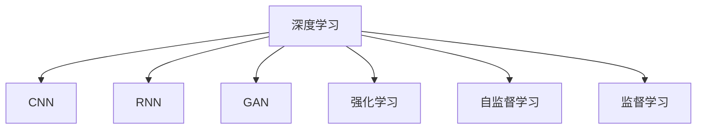

                 

# AI人工智能核心算法原理与代码实例讲解：模式识别

> 关键词：模式识别,神经网络,卷积神经网络(CNN),循环神经网络(RNN),生成对抗网络(GAN),强化学习,自监督学习,监督学习,代码实例

## 1. 背景介绍

### 1.1 问题由来
人工智能(Artificial Intelligence, AI)是计算机科学的前沿领域，旨在模拟和扩展人类智能。其中，模式识别（Pattern Recognition）作为AI的重要分支，通过计算机对数据进行特征提取和分类，广泛应用于图像识别、语音识别、自然语言处理等领域。

模式识别的核心任务是从给定数据中自动识别特定模式或结构，从而实现分类、预测、识别等目标。随着深度学习技术的迅猛发展，神经网络尤其是卷积神经网络（Convolutional Neural Network, CNN）和循环神经网络（Recurrent Neural Network, RNN）等架构在模式识别领域取得了显著成果。

### 1.2 问题核心关键点
模式识别中的核心问题是如何在大量数据中找到有效的特征并进行分类。传统的统计模式识别方法依赖于手工提取的特征和经典机器学习算法，但这些方法存在特征工程繁琐、泛化能力有限等问题。深度学习方法通过神经网络架构自动学习特征，大幅提升了模式的识别能力。

当前，基于神经网络的深度学习模型已成为模式识别的主要方法。例如，卷积神经网络（CNN）在图像识别领域表现出色，循环神经网络（RNN）在语音识别和自然语言处理方面有广泛应用，生成对抗网络（GAN）在图像生成和风格转换中展示出巨大潜力。

### 1.3 问题研究意义
模式识别技术在医疗诊断、安防监控、自动驾驶、智能制造等领域有着广泛的应用，能够极大地提升数据处理和决策的效率与准确性。深度学习模型，尤其是神经网络模型，通过自动学习特征，减少了特征工程的工作量，提升了模式的识别能力。

掌握模式识别的核心算法及其代码实现，对于从事AI领域的研究和工程开发具有重要意义：

1. 减少特征工程工作量：神经网络模型自动提取数据特征，无需手工设计和提取特征，提升了开发效率。
2. 提高模式识别准确率：深度学习模型具有强大的自适应能力，能够在复杂数据中自动学习有效的特征表示，从而提升识别准确率。
3. 促进技术创新：深度学习模型的不断发展，带来了新的算法和架构，如生成对抗网络（GAN）、自监督学习、强化学习等，这些技术能够进一步推动模式识别技术的前沿发展。
4. 提升应用效果：模式识别技术的成功应用，可以带来显著的经济效益和社会价值，如医疗诊断的精确度提升，自动驾驶的安全性保障等。
5. 加速产业化进程：随着技术的不断成熟和优化，模式识别技术将更容易被各行各业所采用，推动AI技术的产业化升级。

## 2. 核心概念与联系

### 2.1 核心概念概述

为更好地理解深度学习在模式识别中的应用，本节将介绍几个密切相关的核心概念：

- 深度学习：通过构建多层神经网络，自动学习数据中的特征和规律。其核心思想是多层网络通过非线性变换捕捉数据的多层次特征。
- 卷积神经网络（CNN）：一种专门处理网格状数据（如图像和视频）的神经网络架构，通过卷积、池化等操作提取局部特征。
- 循环神经网络（RNN）：一种处理序列数据的神经网络，能够捕捉时间维度上的依赖关系，广泛用于语音识别、自然语言处理等任务。
- 生成对抗网络（GAN）：由生成器和判别器组成的对抗性网络，用于生成逼真的图像、视频等数据。
- 强化学习：通过奖励机制训练模型，使其在特定环境中自主学习最佳决策策略，广泛应用于游戏、机器人等领域。
- 自监督学习：利用数据本身的结构信息进行训练，无需显式标注数据，适用于数据标注成本高的情况。
- 监督学习：利用已标注数据训练模型，适用于数据标注齐全的任务。

这些核心概念之间的逻辑关系可以通过以下Mermaid流程图来展示：



这个流程图展示了深度学习在模式识别领域中的不同应用范式：

1. CNN用于处理网格状数据，适用于图像和视频等任务。
2. RNN用于处理序列数据，适用于语音和文本等任务。
3. GAN用于生成逼真数据，适用于图像生成和风格转换等任务。
4. 强化学习用于在特定环境中自主学习决策策略。
5. 自监督学习利用数据本身的结构信息进行训练。
6. 监督学习利用已标注数据训练模型。

这些概念共同构成了深度学习在模式识别中的核心框架，使得模型能够从大量数据中自动学习并提取有效的特征。

## 3. 核心算法原理 & 具体操作步骤
### 3.1 算法原理概述

深度学习模型在模式识别中的应用，基于多层神经网络对数据进行特征提取和分类。其核心思想是通过多层非线性变换，自动学习并提取数据中的隐含特征。

以卷积神经网络（CNN）为例，其核心在于通过卷积操作提取局部特征，并通过池化操作对特征进行压缩和降维，最终将特征输入全连接层进行分类。

### 3.2 算法步骤详解

深度学习模型在模式识别中的应用，一般包括以下几个关键步骤：

**Step 1: 准备数据集**
- 收集并准备训练、验证和测试数据集。确保数据集质量，并进行预处理，如归一化、数据增强等。

**Step 2: 设计神经网络架构**
- 根据任务类型，选择合适的神经网络架构。如图像识别任务可以使用卷积神经网络（CNN），序列数据可以使用循环神经网络（RNN）。
- 确定网络的结构和参数，如层数、节点数、激活函数等。

**Step 3: 设置训练参数**
- 选择合适的优化器及其参数，如Adam、SGD等，设置学习率、批大小、迭代轮数等。
- 设置正则化技术及强度，包括权重衰减、Dropout、Early Stopping等。

**Step 4: 执行梯度训练**
- 将训练集数据分批次输入模型，前向传播计算损失函数。
- 反向传播计算参数梯度，根据设定的优化算法和学习率更新模型参数。
- 周期性在验证集上评估模型性能，根据性能指标决定是否触发 Early Stopping。
- 重复上述步骤直到满足预设的迭代轮数或 Early Stopping 条件。

**Step 5: 测试和部署**
- 在测试集上评估模型性能，对比训练前后的精度提升。
- 使用模型对新样本进行推理预测，集成到实际的应用系统中。

以上是深度学习模型在模式识别中的一般流程。在实际应用中，还需要针对具体任务的特点，对模型架构和训练过程进行优化设计，如改进损失函数，引入更多的正则化技术，搜索最优的超参数组合等，以进一步提升模型性能。

### 3.3 算法优缺点

深度学习模型在模式识别中的应用，具有以下优点：

1. 自动提取特征：深度学习模型能够自动学习数据的隐含特征，减少了特征工程的工作量。
2. 泛化能力强：深度学习模型通过多层非线性变换，具备较强的泛化能力，能在复杂数据中自动学习有效的特征表示。
3. 可解释性差：深度学习模型通常被视为"黑盒"系统，难以解释其内部工作机制和决策逻辑。
4. 计算资源消耗高：深度学习模型参数量庞大，计算和存储资源消耗较大。
5. 过拟合风险：深度学习模型容易过拟合，特别是在训练数据较少的情况下。

尽管存在这些局限性，但深度学习模型在模式识别中依然具有显著优势，特别是在处理大规模复杂数据时表现出色。未来相关研究的重点在于如何进一步降低过拟合风险，提高模型的泛化能力和可解释性，同时兼顾计算资源消耗和训练效率。

### 3.4 算法应用领域

深度学习模型在模式识别中的应用，已经涵盖了几乎所有常见任务，例如：

- 图像分类：如物体识别、人脸识别、车辆识别等。通过训练模型区分不同类别的图像。
- 图像分割：将图像划分为不同区域，如医学图像的器官分割、卫星图像的地理区域划分等。
- 物体检测：在图像中检测出特定物体的位置和大小，如行人检测、目标跟踪等。
- 语音识别：将语音信号转换为文本，如自动语音识别（ASR）、语音合成（TTS）等。
- 文本分类：如情感分析、主题分类、意图识别等。通过训练模型对文本进行分类。
- 机器翻译：将源语言文本翻译成目标语言。通过训练模型进行语言间的映射。
- 自然语言处理（NLP）：如命名实体识别、关系抽取、问答系统等。通过训练模型理解文本内容和结构。

除了上述这些经典任务外，深度学习模型还被创新性地应用到更多场景中，如可控图像生成、图像风格转换、自然语言生成、生成对抗网络等，为模式识别技术带来了全新的突破。随着深度学习模型的不断进步，相信模式识别技术将在更广阔的应用领域大放异彩。

## 4. 数学模型和公式 & 详细讲解 & 举例说明

### 4.1 数学模型构建

深度学习模型在模式识别中的应用，通常使用多层神经网络对数据进行特征提取和分类。以卷积神经网络（CNN）为例，其核心在于通过卷积操作提取局部特征，并通过池化操作对特征进行压缩和降维，最终将特征输入全连接层进行分类。

卷积神经网络（CNN）的数学模型构建如下：

- 输入数据 $X$ 为 $n \times h \times w \times c$ 的张量，表示 $n$ 个样本、$h \times w$ 的图像尺寸、$c$ 个通道的图像数据。
- 卷积核 $W$ 为 $k \times k \times c \times o$ 的张量，表示 $k \times k$ 的卷积核大小、$c$ 个输入通道、$o$ 个输出通道。
- 卷积操作 $C$ 定义为 $X$ 和 $W$ 的内积，计算方式为：
  $$
  C(X,W) = \sum_{i,j} W_{i,j} \star X_{i,j}
  $$
  其中 $\star$ 表示卷积操作。

### 4.2 公式推导过程

以图像分类任务为例，推导卷积神经网络（CNN）的损失函数及其梯度计算公式。

假设模型在图像 $X$ 上的输出为 $Z$，表示 $n \times 1 \times 1 \times c$ 的张量。假设 $L$ 为交叉熵损失函数，则模型在训练集 $D$ 上的经验风险为：
  $$
  \mathcal{L}(W) = -\frac{1}{N}\sum_{i=1}^N \log P(Y_i | X_i, W)
  $$

其中 $N$ 为训练集大小，$Y_i$ 为图像 $X_i$ 的真实标签，$P(Y_i | X_i, W)$ 为模型在图像 $X_i$ 上的预测概率。

根据链式法则，损失函数对参数 $W$ 的梯度为：
  $$
  \nabla_{W}\mathcal{L}(W) = -\frac{1}{N}\sum_{i=1}^N \frac{\partial \log P(Y_i | X_i, W)}{\partial W}
  $$

在得到损失函数的梯度后，即可带入参数更新公式，完成模型的迭代优化。重复上述过程直至收敛，最终得到适应训练集 $D$ 的最优卷积核 $W^*$。

### 4.3 案例分析与讲解

以手写数字识别为例，使用卷积神经网络（CNN）进行训练和测试。

首先，准备训练数据集和测试数据集，将图像数据归一化至 $[0,1]$ 区间。然后，设计CNN模型架构，包括卷积层、池化层、全连接层等。

在训练过程中，设置适当的优化器和学习率，使用交叉熵损失函数进行训练。周期性在验证集上评估模型性能，以调整学习率和训练参数。

测试时，将测试集数据输入模型，计算预测结果与真实标签之间的交叉熵，输出模型在测试集上的精度和准确率。

使用TensorFlow或PyTorch等深度学习框架，可以实现上述过程的代码实现。以下是一个使用TensorFlow实现的手写数字识别CNN模型代码示例：

```python
import tensorflow as tf
from tensorflow.keras import layers, models

# 定义模型架构
model = models.Sequential()
model.add(layers.Conv2D(32, (3, 3), activation='relu', input_shape=(28, 28, 1)))
model.add(layers.MaxPooling2D((2, 2)))
model.add(layers.Flatten())
model.add(layers.Dense(10, activation='softmax'))

# 编译模型
model.compile(optimizer='adam',
              loss='sparse_categorical_crossentropy',
              metrics=['accuracy'])

# 训练模型
model.fit(train_images, train_labels, epochs=5, batch_size=64)

# 测试模型
test_loss, test_acc = model.evaluate(test_images, test_labels)
print('Test accuracy:', test_acc)
```

通过上述代码示例，可以看到TensorFlow的便捷性和易用性，只需简单几行代码，即可实现手写数字识别的CNN模型训练和测试。

## 5. 项目实践：代码实例和详细解释说明
### 5.1 开发环境搭建

在进行模式识别项目实践前，我们需要准备好开发环境。以下是使用Python进行TensorFlow开发的环境配置流程：

1. 安装Anaconda：从官网下载并安装Anaconda，用于创建独立的Python环境。

2. 创建并激活虚拟环境：
```bash
conda create -n tf-env python=3.8 
conda activate tf-env
```

3. 安装TensorFlow：
```bash
pip install tensorflow
```

4. 安装TensorFlow Addons：用于扩展TensorFlow的功能，如卷积层、正则化等。
```bash
pip install tensorflow-addons
```

5. 安装各类工具包：
```bash
pip install numpy pandas scikit-learn matplotlib tqdm jupyter notebook ipython
```

完成上述步骤后，即可在`tf-env`环境中开始模式识别实践。

### 5.2 源代码详细实现

下面我们以手写数字识别任务为例，给出使用TensorFlow实现卷积神经网络（CNN）的代码实现。

首先，定义手写数字识别数据处理函数：

```python
import numpy as np
import matplotlib.pyplot as plt
from tensorflow.keras.datasets import mnist
from tensorflow.keras.utils import to_categorical

def load_data():
    (x_train, y_train), (x_test, y_test) = mnist.load_data()
    x_train = x_train.reshape(-1, 28, 28, 1) / 255.0
    x_test = x_test.reshape(-1, 28, 28, 1) / 255.0
    y_train = to_categorical(y_train)
    y_test = to_categorical(y_test)
    return x_train, y_train, x_test, y_test
```

然后，定义卷积神经网络（CNN）模型：

```python
from tensorflow.keras.models import Sequential
from tensorflow.keras.layers import Conv2D, MaxPooling2D, Flatten, Dense, Dropout

model = Sequential([
    Conv2D(32, (3, 3), activation='relu', input_shape=(28, 28, 1)),
    MaxPooling2D((2, 2)),
    Dropout(0.25),
    Flatten(),
    Dense(128, activation='relu'),
    Dropout(0.5),
    Dense(10, activation='softmax')
])
```

接着，定义训练和评估函数：

```python
from tensorflow.keras.optimizers import Adam
from tensorflow.keras.metrics import Accuracy

def train(model, x_train, y_train, x_test, y_test):
    model.compile(optimizer=Adam(), loss='categorical_crossentropy', metrics=[Accuracy()])
    model.fit(x_train, y_train, validation_data=(x_test, y_test), epochs=10, batch_size=64)

    test_loss, test_acc = model.evaluate(x_test, y_test)
    print('Test accuracy:', test_acc)
```

最后，启动训练流程并在测试集上评估：

```python
x_train, y_train, x_test, y_test = load_data()

train(model, x_train, y_train, x_test, y_test)
```

以上就是使用TensorFlow实现手写数字识别任务的完整代码实现。可以看到，借助TensorFlow的便捷封装，我们可以用相对简洁的代码完成CNN模型的搭建和训练。

### 5.3 代码解读与分析

让我们再详细解读一下关键代码的实现细节：

**load_data函数**：
- 加载MNIST手写数字数据集，并进行数据预处理和归一化。
- 将图像数据转换为3D张量，并使用one-hot编码进行标签处理。

**模型定义**：
- 定义一个包含卷积层、池化层、全连接层的CNN模型。
- 在全连接层之间插入Dropout层，以防止过拟合。

**train函数**：
- 编译模型，使用Adam优化器和交叉熵损失函数。
- 在训练集上进行模型训练，周期性在验证集上评估模型性能。
- 在测试集上评估模型性能，输出最终测试准确率。

**训练流程**：
- 加载数据集，定义CNN模型。
- 在训练集上训练模型，并打印测试集上的准确率。

可以看到，TensorFlow的封装使得CNN模型的搭建和训练变得简单易用，开发者可以更多地关注模型设计、数据处理等高层逻辑。

当然，工业级的系统实现还需考虑更多因素，如模型的保存和部署、超参数的自动搜索、更灵活的任务适配层等。但核心的CNN训练过程基本与此类似。

## 6. 实际应用场景
### 6.1 智能监控

模式识别技术在智能监控领域有着广泛应用，可以自动识别监控视频中的异常行为，如入侵、火情、车辆违规等。通过训练模型，识别监控视频中的特定物体或场景，及时发出警报，提高监控系统的智能化水平。

在技术实现上，可以收集并标注监控视频中的各类异常事件，将视频帧作为训练数据，训练CNN模型进行行为识别。微调后的模型能够实时分析视频流，检测出异常事件并触发警报。

### 6.2 自动驾驶

自动驾驶技术需要实时分析车辆周围环境，如识别行人、车辆、道路标志等，以进行智能驾驶决策。模式识别技术能够处理摄像头和激光雷达等传感器获取的数据，通过CNN等深度学习模型进行场景理解。

在技术实现上，可以收集并标注各类驾驶场景的数据，训练CNN模型进行物体识别和场景理解。微调后的模型能够实时分析传感器数据，为自动驾驶系统提供准确的感知信息。

### 6.3 医学影像诊断

医学影像诊断需要自动识别影像中的异常结构，如肿瘤、病灶等。模式识别技术能够处理CT、MRI等医学影像数据，通过CNN模型进行病灶识别和分割。

在技术实现上，可以收集并标注各类医学影像数据，训练CNN模型进行病灶识别和分割。微调后的模型能够实时分析医学影像，辅助医生进行诊断和治疗。

### 6.4 未来应用展望

随着模式识别技术的不断发展，未来将在更多领域得到应用，为人类生产生活方式带来深远影响。

在智慧城市治理中，模式识别技术可以用于智能交通管理、环境监测、公共安全等领域，提升城市管理的智能化水平。

在智能家居领域，模式识别技术能够自动识别家庭成员的身份和行为，提供个性化的智能服务。

在农业领域，模式识别技术可以用于作物识别、病虫害检测等，提高农业生产效率和智能化水平。

此外，在教育、娱乐、金融等多个领域，模式识别技术也将不断涌现，为各行各业带来新的机遇和挑战。相信随着技术的不断进步，模式识别技术将在更多领域大放异彩，推动社会的数字化转型和智能化升级。

## 7. 工具和资源推荐
### 7.1 学习资源推荐

为了帮助开发者系统掌握深度学习在模式识别中的应用，这里推荐一些优质的学习资源：

1. 《深度学习》系列书籍：Ian Goodfellow、Yoshua Bengio 和 Aaron Courville 合著的《深度学习》书籍，全面介绍了深度学习的理论和实践。

2. CS231n《卷积神经网络》课程：斯坦福大学开设的深度学习课程，涵盖卷积神经网络的原理和应用。

3. DeepLearning.ai课程：由Andrew Ng主导的深度学习课程，适合初学者和进阶者。

4. PyTorch官方文档：PyTorch的官方文档，提供了丰富的深度学习框架和代码示例，是入门的最佳资源。

5. TensorFlow官方文档：TensorFlow的官方文档，提供了详尽的深度学习框架和API文档，适合深入学习。

6. Coursera深度学习课程：Coursera提供的深度学习课程，涵盖从基础到高级的深度学习知识，适合自学和在线学习。

通过对这些资源的学习实践，相信你一定能够快速掌握深度学习在模式识别中的应用，并用于解决实际的AI问题。

### 7.2 开发工具推荐

高效的开发离不开优秀的工具支持。以下是几款用于深度学习在模式识别中开发的工具：

1. PyTorch：基于Python的开源深度学习框架，灵活动态的计算图，适合快速迭代研究。

2. TensorFlow：由Google主导开发的开源深度学习框架，生产部署方便，适合大规模工程应用。

3. Keras：高层次深度学习框架，提供了便捷的API接口，适合初学者快速上手。

4. MXNet：由亚马逊开发的深度学习框架，支持多种编程语言，适合分布式训练。

5. Jupyter Notebook：交互式开发环境，支持代码编写、数据可视化和在线协作。

6. Visual Studio Code：流行的代码编辑器，支持Python开发，提供了丰富的扩展和插件。

合理利用这些工具，可以显著提升深度学习在模式识别中的开发效率，加快创新迭代的步伐。

### 7.3 相关论文推荐

深度学习在模式识别领域的发展得益于学界的持续研究。以下是几篇奠基性的相关论文，推荐阅读：

1. Convolutional Neural Networks for Images with Labels in the Wild（AlexNet论文）：提出了卷积神经网络（CNN），并展示了其在图像分类任务上的出色表现。

2. ImageNet Classification with Deep Convolutional Neural Networks：利用大规模数据集ImageNet训练CNN模型，展示了深度学习在图像识别领域的应用潜力。

3. Rethinking the Inception Architecture for Computer Vision：提出了Inception模块，提升了CNN模型在图像识别任务上的性能。

4. Recurrent Neural Network for Image Caption Generation：提出了LSTM网络，用于生成图像描述，展示了深度学习在自然语言处理领域的应用潜力。

5. Generative Adversarial Nets：提出生成对抗网络（GAN），用于生成逼真的图像和视频，展示了深度学习在图像生成领域的应用潜力。

6. AlphaGo Zero：利用深度强化学习算法，开发了具有超凡水平的下围棋程序，展示了深度学习在游戏领域的应用潜力。

这些论文代表了深度学习在模式识别领域的发展脉络。通过学习这些前沿成果，可以帮助研究者把握学科前进方向，激发更多的创新灵感。

## 8. 总结：未来发展趋势与挑战

### 8.1 总结

本文对深度学习在模式识别中的应用进行了全面系统的介绍。首先阐述了模式识别任务的背景和深度学习模型在其中的重要性，明确了深度学习模型在特征提取和分类方面的显著优势。其次，从原理到实践，详细讲解了CNN、RNN等深度学习模型在模式识别中的数学模型构建和算法实现，给出了具体代码示例。同时，本文还广泛探讨了深度学习模型在智能监控、自动驾驶、医学影像等多个领域的应用前景，展示了深度学习技术在各个场景中的巨大潜力。

通过本文的系统梳理，可以看到，深度学习在模式识别中的应用已经深入到多个行业，显著提升了数据处理和决策的效率与准确性。深度学习模型的自动特征提取能力，使得开发者能够快速构建高性能的模式识别系统，推动AI技术的产业化进程。

### 8.2 未来发展趋势

深度学习在模式识别领域将呈现以下几个发展趋势：

1. 模型规模持续增大。随着算力成本的下降和数据规模的扩张，深度学习模型尤其是卷积神经网络（CNN）和循环神经网络（RNN）等架构的参数量还将持续增长。超大规模模型蕴含的丰富特征表示，有望支撑更加复杂多变的模式识别任务。

2. 模型结构更加多样。除了传统的CNN和RNN，未来将涌现更多结构新颖的深度学习模型，如Transformer、Capsule Network等，这些模型具有更强的表征能力和泛化能力。

3. 迁移学习能力提升。迁移学习是深度学习的重要范式，未来的模型将具备更强的跨任务迁移能力，能够在更少的数据上取得更好的性能。

4. 自监督学习普及。自监督学习利用数据本身的结构信息进行训练，能够在不依赖大量标注数据的情况下，提升模型的泛化能力。

5. 联合学习兴起。联合学习能够在分布式系统中进行模型训练，减少数据传输和计算资源消耗，提升模型的可扩展性和鲁棒性。

6. 模型压缩和加速优化。深度学习模型的计算资源消耗较大，未来的研究将更多关注模型压缩和加速优化，提升模型的计算效率和可部署性。

以上趋势凸显了深度学习在模式识别领域的广泛应用前景，这些方向的探索发展，必将进一步提升模式识别技术的前沿水平，为各行各业带来新的突破。

### 8.3 面临的挑战

尽管深度学习在模式识别领域已经取得了显著成果，但在迈向更加智能化、普适化应用的过程中，它仍面临着诸多挑战：

1. 数据标注成本高：高质量标注数据是深度学习模型的基础，但标注成本较高，特别是在小样本场景下，获取足够标注数据成为瓶颈。如何降低数据标注成本，利用无监督和半监督学习技术，是未来的研究方向。

2. 模型泛化能力有限：深度学习模型容易过拟合，特别是在数据分布变化较大的情况下。如何在保证模型性能的同时，提升其泛化能力和鲁棒性，是未来需要解决的关键问题。

3. 可解释性不足：深度学习模型通常被视为"黑盒"系统，难以解释其内部工作机制和决策逻辑。如何提升模型的可解释性，使其更容易被理解和接受，是未来需要解决的重要课题。

4. 计算资源消耗高：深度学习模型参数量庞大，计算和存储资源消耗较大。如何在保证模型性能的同时，减少计算资源消耗，提升模型的可部署性，是未来需要解决的关键问题。

5. 数据隐私和安全问题：深度学习模型在处理数据时需要保护用户隐私，避免数据泄露。如何在保护隐私的同时，保证模型的性能和安全性，是未来需要解决的重要问题。

6. 伦理和社会影响：深度学习模型的广泛应用可能会带来新的伦理和社会问题，如算法偏见、就业影响等。如何在技术应用中兼顾伦理和社会责任，是未来需要解决的重要课题。

面对这些挑战，未来的研究需要在模型结构、训练策略、数据获取等多个方面进行全面优化，才能使深度学习在模式识别领域取得更大的突破。

### 8.4 研究展望

面对深度学习在模式识别领域面临的挑战，未来的研究需要在以下几个方面寻求新的突破：

1. 探索更多的深度学习架构。研究新型神经网络架构，如Transformer、Capsule Network等，以提升模型的表征能力和泛化能力。

2. 研究更多的深度学习训练方法。研究自监督学习、联合学习等无监督和半监督学习技术，以降低数据标注成本，提升模型泛化能力。

3. 研究更高效的模型压缩和加速方法。研究模型裁剪、量化、稀疏化等方法，以提升模型的计算效率和可部署性。

4. 研究更强的模型可解释性技术。研究模型可视化、解释性生成等方法，以提升模型的可解释性和可信度。

5. 研究更安全的模型训练和应用方法。研究数据隐私保护、模型鲁棒性提升等技术，以提升模型的安全性和可靠性。

6. 研究更符合伦理和社会责任的模型应用方法。研究模型偏见消除、就业影响评估等技术，以确保模型应用的伦理和社会责任。

这些研究方向的研究突破，必将进一步提升深度学习在模式识别领域的应用效果，推动AI技术的产业化升级。面向未来，深度学习在模式识别领域的研究和应用还需要与伦理、社会、隐私等多个学科进行更深入的融合，才能真正实现技术与人文价值的统一。

## 9. 附录：常见问题与解答

**Q1：深度学习模型在模式识别中存在哪些缺点？**

A: 深度学习模型在模式识别中的应用，存在以下缺点：

1. 可解释性差：深度学习模型通常被视为"黑盒"系统，难以解释其内部工作机制和决策逻辑。

2. 数据标注成本高：高质量标注数据是深度学习模型的基础，但标注成本较高，特别是在小样本场景下，获取足够标注数据成为瓶颈。

3. 模型泛化能力有限：深度学习模型容易过拟合，特别是在数据分布变化较大的情况下。

4. 计算资源消耗高：深度学习模型参数量庞大，计算和存储资源消耗较大。

5. 模型鲁棒性不足：深度学习模型面对域外数据时，泛化性能往往大打折扣。

6. 模型训练时间长：深度学习模型通常需要大量的计算资源和时间进行训练，特别是在大规模数据集上。

这些缺点在一定程度上限制了深度学习模型在模式识别中的应用，但通过不断的研究和优化，这些问题的解决前景仍然光明。

**Q2：如何使用深度学习模型进行模式识别？**

A: 使用深度学习模型进行模式识别，一般包括以下几个关键步骤：

1. 数据准备：收集并准备训练、验证和测试数据集，进行数据预处理和归一化。

2. 模型设计：选择合适的深度学习模型架构，如卷积神经网络（CNN）、循环神经网络（RNN）等，并进行模型参数的设定。

3. 模型训练：使用深度学习框架如TensorFlow、PyTorch等进行模型训练，选择合适的优化器和学习率，定义损失函数，进行前向传播和反向传播，更新模型参数。

4. 模型评估：在验证集上评估模型性能，调整超参数，确保模型泛化能力。

5. 模型测试：在测试集上评估模型性能，输出最终测试结果。

6. 模型部署：将训练好的模型保存，并集成到实际的应用系统中，进行模型的实时推理和预测。

通过上述步骤，可以构建高效、准确的深度学习模型，实现模式识别任务。

**Q3：深度学习模型在模式识别中常用的模型架构有哪些？**

A: 深度学习模型在模式识别中常用的模型架构包括以下几种：

1. 卷积神经网络（CNN）：专门处理网格状数据，如图像和视频等，通过卷积和池化操作提取局部特征。

2. 循环神经网络（RNN）：处理序列数据，如语音和文本等，能够捕捉时间维度上的依赖关系。

3. 生成对抗网络（GAN）：由生成器和判别器组成的对抗性网络，用于生成逼真的图像和视频等数据。

4. 深度信念网络（DBN）：多层受限玻尔兹曼机组成的深度学习模型，能够自动学习数据分布。

5. 多层感知机（MLP）：全连接神经网络，用于处理高维数据和分类任务。

6. 卷积循环神经网络（CRNN）：结合卷积和循环神经网络，用于处理序列和网格混合的数据。

这些模型架构在不同的模式识别任务中都有广泛应用，开发者可以根据具体任务选择适合的模型。

**Q4：深度学习模型在模式识别中的常见问题有哪些？**

A: 深度学习模型在模式识别中常见的有以下几个问题：

1. 过拟合：模型在训练数据上表现良好，但在测试数据上性能下降。

2. 欠拟合：模型无法捕捉数据中的复杂模式，表现较差。

3. 计算资源消耗高：深度学习模型参数量庞大，计算和存储资源消耗较大。

4. 可解释性差：深度学习模型通常被视为"黑盒"系统，难以解释其内部工作机制和决策逻辑。

5. 数据标注成本高：高质量标注数据是深度学习模型的基础，但标注成本较高，特别是在小样本场景下，获取足够标注数据成为瓶颈。

6. 模型泛化能力有限：深度学习模型容易过拟合，特别是在数据分布变化较大的情况下。

面对这些问题，需要在数据预处理、模型设计、训练策略等方面进行全面优化，以提升模型的性能和可解释性。

**Q5：深度学习模型在模式识别中的应用场景有哪些？**

A: 深度学习模型在模式识别中的应用场景包括以下几个方面：

1. 图像识别：如物体识别、人脸识别、车辆识别等，通过训练模型区分不同类别的图像。

2. 图像分割：将图像划分为不同区域，如医学图像的器官分割、卫星图像的地理区域划分等。

3. 物体检测：在图像中检测出特定物体的位置和大小，如行人检测、目标跟踪等。

4. 语音识别：将语音信号转换为文本，如自动语音识别（ASR）、语音合成（TTS）等。

5. 文本分类：如情感分析、主题分类、意图识别等，通过训练模型对文本进行分类。

6. 机器翻译：将源语言文本翻译成目标语言，通过训练模型进行语言间的映射。

7. 自然语言处理（NLP）：如命名实体识别、关系抽取、问答系统等，通过训练模型理解文本内容和结构。

除了上述这些经典任务外，深度学习模型还被创新性地应用到更多场景中，如可控图像生成、图像风格转换、自然语言生成、生成对抗网络等，为模式识别技术带来了全新的突破。

**Q6：如何降低深度学习模型的过拟合风险？**

A: 降低深度学习模型的过拟合风险，可以从以下几个方面入手：

1. 数据增强：通过回译、近义替换等方式扩充训练集。

2. 正则化：使用L2正则、Dropout、Early Stopping等技术，防止模型过度适应小规模训练集。

3. 参数高效微调：只调整少量参数，固定大部分预训练权重不变，以提高微调效率，避免过拟合。

4. 对抗训练：加入对抗样本，提高模型鲁棒性。

5. 混合精度训练：使用混合精度（如FP16）加速训练，减少计算资源消耗。

6. 模型裁剪：去除不必要的层和参数，减小模型尺寸，加快推理速度。

这些方法往往需要根据具体任务和数据特点进行灵活组合，通过不断调整模型参数和训练策略，可以有效降低过拟合风险，提升模型泛化能力。

---

作者：禅与计算机程序设计艺术 / Zen and the Art of Computer Programming

