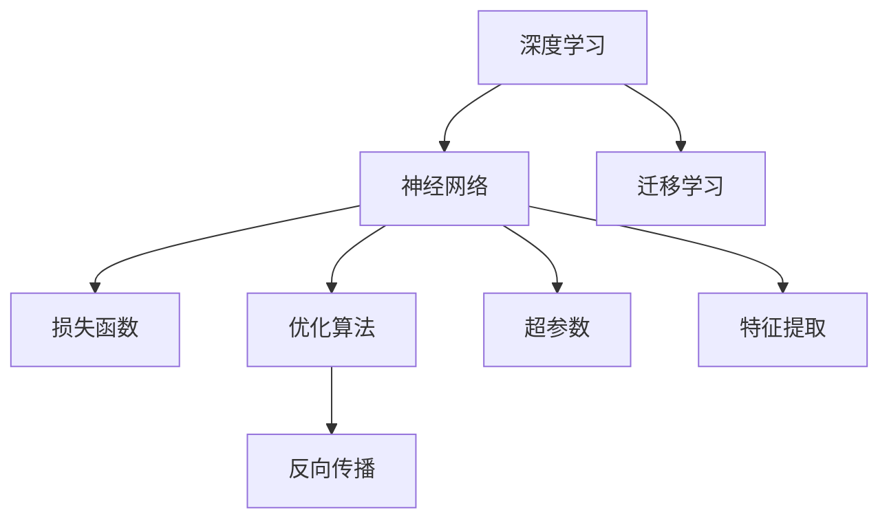

                 

# AI人工智能核心算法原理与代码实例讲解：通用问题求解

> 关键词：AI算法，通用问题求解，核心算法原理，代码实例，应用场景

## 1. 背景介绍

### 1.1 问题由来
在现代人工智能(AI)领域，核心算法的研究与应用始终是推动技术进步的关键因素。随着深度学习、强化学习、迁移学习等技术的快速发展，AI算法日益复杂，并在自然语言处理、计算机视觉、智能推荐、自动驾驶等多个领域得到了广泛应用。然而，无论是理论研究还是工程实践，核心算法的理解和应用始终是一项重要的任务。

本博客旨在系统介绍AI核心算法的原理与实现，包括通用问题求解、深度学习、强化学习、迁移学习等关键算法。通过深入浅出的讲解，读者将能掌握这些算法的核心思想、数学模型和代码实现，并了解其在实际应用中的成功案例。

### 1.2 问题核心关键点
本博客将涵盖以下几个核心问题：

1. 深度学习的核心算法原理是什么？
2. 如何通过代码实例实现深度学习算法？
3. 深度学习算法在实际应用中哪些领域表现出色？
4. 深度学习算法在应用过程中需要注意哪些问题？
5. 深度学习算法未来的发展趋势有哪些？

## 2. 核心概念与联系

### 2.1 核心概念概述

为了更好地理解核心算法，本节将介绍几个密切相关的核心概念：

- **深度学习**：一种基于多层神经网络的学习方法，通过多个层次的特征提取和转换，实现复杂的模式识别和决策。
- **神经网络**：由大量神经元组成的网络结构，通过前向传播和反向传播算法进行训练。
- **损失函数**：用于衡量模型预测与真实标签之间差异的函数，指导模型的优化方向。
- **优化算法**：如梯度下降法、Adam等，通过迭代更新模型参数，最小化损失函数。
- **反向传播**：一种用于计算神经网络中每个参数对损失函数的贡献的算法。
- **超参数**：需要人工设置的参数，如学习率、批大小等，影响模型的训练效果。
- **特征提取**：通过网络结构将原始数据映射为高层次的特征表示。
- **迁移学习**：通过预训练模型对新任务进行微调，利用已有的知识加快模型学习。

这些核心概念之间的逻辑关系可以通过以下Mermaid流程图来展示：



这个流程图展示了几大核心概念及其之间的关系：

1. 深度学习依赖神经网络进行特征提取和转换。
2. 损失函数指导模型优化，优化算法实现参数更新。
3. 反向传播计算每个参数的梯度，以便优化。
4. 超参数影响模型的训练过程。
5. 特征提取是神经网络的核心功能之一。
6. 迁移学习利用预训练模型的知识，加速新任务的模型训练。

## 3. 核心算法原理 & 具体操作步骤
### 3.1 算法原理概述

深度学习算法的核心在于通过多层神经网络对数据进行特征提取和转换，并通过优化算法不断更新模型参数，最小化损失函数。

以最简单的前馈神经网络为例，其基本结构包括输入层、若干隐藏层和输出层。每个神经元接收前一层的输出，通过加权求和和激活函数进行计算，然后将结果传递给下一层。网络的输出即为模型对输入数据的预测结果。

在训练过程中，通过前向传播计算模型预测结果，计算损失函数，然后通过反向传播计算每个参数对损失函数的贡献，更新模型参数。这个过程反复迭代，直到损失函数收敛或达到预设的训练轮数。

### 3.2 算法步骤详解

深度学习算法的训练过程包括以下几个关键步骤：

**Step 1: 数据准备**
- 收集和处理训练数据，包括数据预处理、特征提取等。
- 将数据划分为训练集、验证集和测试集。

**Step 2: 模型构建**
- 选择合适的神经网络结构，如全连接神经网络、卷积神经网络(CNN)、循环神经网络(RNN)等。
- 设置模型的超参数，如学习率、批大小、激活函数等。
- 定义损失函数，如均方误差(MSE)、交叉熵损失等。

**Step 3: 模型训练**
- 使用优化算法(如Adam、SGD等)进行模型训练，最小化损失函数。
- 通过反向传播计算每个参数的梯度，并根据学习率更新参数。
- 在每个epoch结束后，使用验证集评估模型性能，避免过拟合。
- 重复训练过程，直到损失函数收敛或达到预设轮数。

**Step 4: 模型评估与优化**
- 使用测试集评估模型性能，比较模型在不同任务上的表现。
- 根据评估结果，调整模型结构或超参数，进一步优化模型。

### 3.3 算法优缺点

深度学习算法具有以下优点：

1. 能够处理复杂的非线性关系。
2. 特征提取能力强，能够从原始数据中提取高层次的特征表示。
3. 在许多实际应用中取得了非常好的效果。

同时，深度学习算法也存在以下缺点：

1. 训练过程需要大量的标注数据。
2. 模型结构复杂，难以解释和调试。
3. 对硬件要求高，需要高性能的计算资源。
4. 容易过拟合，特别是在训练数据较少的情况下。

尽管存在这些局限性，但深度学习算法在许多实际应用中取得了巨大的成功，例如在图像识别、语音识别、自然语言处理等领域。

### 3.4 算法应用领域

深度学习算法已经在多个领域得到了广泛的应用，包括：

1. 计算机视觉：如图像分类、目标检测、图像分割等。
2. 自然语言处理：如机器翻译、文本分类、情感分析等。
3. 语音识别：如自动语音识别、语音合成等。
4. 机器人控制：如智能机器人、自动驾驶等。
5. 推荐系统：如商品推荐、内容推荐等。

## 4. 数学模型和公式 & 详细讲解 & 举例说明

### 4.1 数学模型构建

深度学习算法的数学模型通常包括以下几个部分：

1. 输入层：$x_1, x_2, ..., x_n$。
2. 隐藏层：$h_1, h_2, ..., h_m$。
3. 输出层：$y_1, y_2, ..., y_p$。
4. 参数：权重矩阵$W_1, W_2, ..., W_n$和偏置向量$b_1, b_2, ..., b_m$。

其中，每个神经元的计算过程可以表示为：

$$
h_i = \sigma(\sum_{j=1}^n w_{ij}x_j + b_i)
$$

其中$\sigma$为激活函数，可以是sigmoid、ReLU等。

网络的输出为：

$$
y = \sum_{j=1}^p w_{pj}h_j + b_p
$$

### 4.2 公式推导过程

以一个简单的全连接神经网络为例，其前向传播和反向传播过程如下：

**前向传播：**

输入层：$x_1, x_2, ..., x_n$

第一隐藏层：$h_1 = \sigma(\sum_{j=1}^n w_{11}x_j + b_1)$

第二隐藏层：$h_2 = \sigma(\sum_{j=1}^n w_{21}h_1 + b_2)$

输出层：$y = \sum_{j=1}^p w_{pj}h_j + b_p$

**反向传播：**

定义损失函数：

$$
L = \frac{1}{2}(y - \hat{y})^2
$$

其中$y$为真实标签，$\hat{y}$为模型预测结果。

梯度下降法的更新公式为：

$$
w_j \leftarrow w_j - \eta \frac{\partial L}{\partial w_j}
$$

$$
b_i \leftarrow b_i - \eta \frac{\partial L}{\partial b_i}
$$

其中$\eta$为学习率。

通过反向传播，可以计算每个参数的梯度，并根据梯度更新模型参数，最小化损失函数。

### 4.3 案例分析与讲解

以图像分类任务为例，使用深度学习算法进行模型训练和评估。

**数据准备：**
- 收集图像数据集，并进行预处理。
- 将数据划分为训练集、验证集和测试集。

**模型构建：**
- 使用卷积神经网络(CNN)作为模型结构。
- 设置模型的超参数，如学习率、批大小等。
- 定义交叉熵损失函数。

**模型训练：**
- 使用Adam优化算法进行模型训练。
- 通过反向传播计算每个参数的梯度，并根据学习率更新参数。
- 在每个epoch结束后，使用验证集评估模型性能，避免过拟合。
- 重复训练过程，直到损失函数收敛或达到预设轮数。

**模型评估：**
- 使用测试集评估模型性能，比较模型在不同类别上的分类准确率。
- 根据评估结果，调整模型结构或超参数，进一步优化模型。

## 5. 项目实践：代码实例和详细解释说明

### 5.1 开发环境搭建

在进行深度学习算法开发前，我们需要准备好开发环境。以下是使用Python进行TensorFlow开发的环境配置流程：

1. 安装Anaconda：从官网下载并安装Anaconda，用于创建独立的Python环境。

2. 创建并激活虚拟环境：
```bash
conda create -n tf-env python=3.8 
conda activate tf-env
```

3. 安装TensorFlow：根据CUDA版本，从官网获取对应的安装命令。例如：
```bash
pip install tensorflow
```

4. 安装TensorBoard：TensorFlow配套的可视化工具，用于实时监测模型训练状态。
```bash
pip install tensorboard
```

5. 安装各类工具包：
```bash
pip install numpy pandas scikit-learn matplotlib tqdm jupyter notebook ipython
```

完成上述步骤后，即可在`tf-env`环境中开始深度学习算法的开发实践。

### 5.2 源代码详细实现

下面我们以图像分类任务为例，给出使用TensorFlow实现卷积神经网络的PyTorch代码实现。

首先，定义卷积神经网络的结构：

```python
import tensorflow as tf

class CNN(tf.keras.Model):
    def __init__(self):
        super(CNN, self).__init__()
        self.conv1 = tf.keras.layers.Conv2D(32, (3, 3), activation='relu')
        self.pool1 = tf.keras.layers.MaxPooling2D((2, 2))
        self.conv2 = tf.keras.layers.Conv2D(64, (3, 3), activation='relu')
        self.pool2 = tf.keras.layers.MaxPooling2D((2, 2))
        self.flatten = tf.keras.layers.Flatten()
        self.dense1 = tf.keras.layers.Dense(64, activation='relu')
        self.dense2 = tf.keras.layers.Dense(10, activation='softmax')

    def call(self, inputs):
        x = self.conv1(inputs)
        x = self.pool1(x)
        x = self.conv2(x)
        x = self.pool2(x)
        x = self.flatten(x)
        x = self.dense1(x)
        return self.dense2(x)
```

然后，定义训练和评估函数：

```python
import tensorflow as tf

train_dataset = ...
val_dataset = ...
test_dataset = ...

model = CNN()

# 设置优化器
optimizer = tf.keras.optimizers.Adam()

# 定义损失函数
loss_fn = tf.keras.losses.SparseCategoricalCrossentropy(from_logits=True)

# 定义准确率计算函数
def accuracy(y_true, y_pred):
    return tf.reduce_mean(tf.cast(tf.equal(y_true, tf.argmax(y_pred, axis=-1)), tf.float32))

# 训练函数
def train_epoch(model, dataset, batch_size, optimizer):
    model.train()
    for batch in dataset.batch(batch_size):
        inputs, labels = batch
        with tf.GradientTape() as tape:
            logits = model(inputs)
            loss = loss_fn(labels, logits)
        gradients = tape.gradient(loss, model.trainable_variables)
        optimizer.apply_gradients(zip(gradients, model.trainable_variables))

# 评估函数
def evaluate(model, dataset, batch_size):
    model.eval()
    correct = 0
    total = 0
    for batch in dataset.batch(batch_size):
        inputs, labels = batch
        logits = model(inputs)
        predictions = tf.argmax(logits, axis=-1)
        total += len(labels)
        correct += tf.reduce_sum(tf.cast(tf.equal(predictions, labels), tf.float32))
    accuracy = correct / total
    return accuracy
```

最后，启动训练流程并在测试集上评估：

```python
epochs = 10
batch_size = 32

for epoch in range(epochs):
    train_epoch(model, train_dataset, batch_size, optimizer)
    accuracy = evaluate(model, val_dataset, batch_size)
    print(f"Epoch {epoch+1}, validation accuracy: {accuracy}")
    
print(f"Final validation accuracy: {evaluate(model, val_dataset, batch_size)}")
```

以上就是使用TensorFlow实现卷积神经网络的基本代码。可以看到，通过TensorFlow提供的高级API，可以快速搭建和训练深度学习模型，实现复杂的图像分类任务。

### 5.3 代码解读与分析

让我们再详细解读一下关键代码的实现细节：

**CNN类**：
- `__init__`方法：初始化卷积层、池化层、全连接层等网络结构。
- `call`方法：定义前向传播过程，通过多个卷积、池化和全连接层对输入数据进行特征提取和转换。

**训练函数**：
- 使用TensorFlow的`tf.keras.Model`类定义模型结构。
- 通过`tf.keras.optimizers.Adam`设置优化器，并计算模型损失函数。
- 使用`tf.GradientTape`计算梯度，并使用`optimizer.apply_gradients`更新模型参数。
- 在每个epoch结束后，使用验证集评估模型性能。

**评估函数**：
- 使用`tf.argmax`计算预测标签。
- 通过`tf.reduce_sum`计算准确率。

**训练流程**：
- 循环训练多个epoch。
- 在每个epoch内，使用训练集进行模型训练。
- 在每个epoch结束后，使用验证集评估模型性能。

## 6. 实际应用场景
### 6.1 智能推荐系统

智能推荐系统是深度学习算法的重要应用场景之一。通过分析用户的历史行为数据，深度学习模型可以推荐用户感兴趣的商品、内容等，提升用户体验。

在技术实现上，可以收集用户浏览、点击、购买等行为数据，提取和用户交互的物品标题、描述、标签等文本内容。将文本内容作为模型输入，用户的后续行为（如是否点击、购买等）作为监督信号，在此基础上微调预训练语言模型。微调后的模型能够从文本内容中准确把握用户的兴趣点。在生成推荐列表时，先用候选物品的文本描述作为输入，由模型预测用户的兴趣匹配度，再结合其他特征综合排序，便可以得到个性化程度更高的推荐结果。

### 6.2 语音识别

语音识别是深度学习在信号处理和自然语言处理领域的经典应用。深度学习模型可以学习语音信号的特征表示，并将其映射为文本，实现自动语音识别。

在技术实现上，可以收集大量的语音数据，使用MFCC等特征提取方法将语音信号转换为频谱特征。将频谱特征作为输入，使用深度学习模型进行特征提取和分类。常用的模型包括卷积神经网络(CNN)和循环神经网络(RNN)等。训练过程中，可以使用交叉熵损失函数，优化器如Adam等。

### 6.3 医学影像诊断

医学影像诊断是深度学习在医疗领域的重要应用。深度学习模型可以学习医学影像的特征表示，辅助医生进行疾病的诊断和治疗。

在技术实现上，可以收集大量的医学影像数据，包括CT、MRI、X光等。将影像数据作为输入，使用卷积神经网络(CNN)等模型进行特征提取和分类。训练过程中，可以使用Dice Loss等损失函数，优化器如Adam等。

### 6.4 未来应用展望

深度学习算法在许多领域都取得了显著的成功，未来仍有很大的发展空间。

1. 模型的可解释性：未来的深度学习模型将更加注重可解释性，能够解释模型的决策过程，提升模型的可信度。
2. 模型的通用性：未来的深度学习模型将更加通用，能够处理多种类型的数据，如文本、图像、语音等。
3. 模型的高效性：未来的深度学习模型将更加高效，能够在更短的时间内完成训练和推理。
4. 模型的可扩展性：未来的深度学习模型将更加可扩展，能够处理更大的数据集和更复杂的任务。

## 7. 工具和资源推荐
### 7.1 学习资源推荐

为了帮助开发者系统掌握深度学习算法的原理和应用，这里推荐一些优质的学习资源：

1. 《深度学习》书籍：Ian Goodfellow等所著，全面介绍了深度学习的基本原理、模型架构和应用。
2. CS231n《深度学习与计算机视觉》课程：斯坦福大学开设的计算机视觉课程，涵盖深度学习在计算机视觉中的应用。
3. CS224n《自然语言处理》课程：斯坦福大学开设的自然语言处理课程，涵盖深度学习在自然语言处理中的应用。
4. CS294《深度学习与强化学习》课程：斯坦福大学开设的强化学习课程，涵盖深度学习在强化学习中的应用。
5. DeepLearning.AI课程：Andrew Ng创办的在线深度学习课程，涵盖深度学习的理论和实践。
6. Kaggle竞赛：Kaggle平台上的各种深度学习竞赛，可以实战练习深度学习算法。

通过对这些资源的学习实践，相信你一定能够快速掌握深度学习算法的精髓，并用于解决实际的AI问题。

### 7.2 开发工具推荐

高效的开发离不开优秀的工具支持。以下是几款用于深度学习算法开发的常用工具：

1. PyTorch：基于Python的开源深度学习框架，支持动态计算图，适合快速迭代研究。
2. TensorFlow：由Google主导开发的开源深度学习框架，生产部署方便，适合大规模工程应用。
3. Keras：高级神经网络API，可以简化模型的搭建和训练过程。
4. TensorBoard：TensorFlow配套的可视化工具，实时监测模型训练状态。
5. Weights & Biases：模型训练的实验跟踪工具，记录和可视化模型训练过程中的各项指标。
6. Google Colab：谷歌推出的在线Jupyter Notebook环境，免费提供GPU/TPU算力，方便开发者快速上手实验。

合理利用这些工具，可以显著提升深度学习算法的开发效率，加快创新迭代的步伐。

### 7.3 相关论文推荐

深度学习算法的发展源于学界的持续研究。以下是几篇奠基性的相关论文，推荐阅读：

1. AlexNet：深度学习领域的开创性工作，使用卷积神经网络在ImageNet数据集上取得了巨大的成功。
2. ResNet：提出残差连接，解决了深度神经网络训练中的梯度消失问题。
3. VGGNet：提出多层的卷积神经网络，大大提高了模型的准确率。
4. RNN：循环神经网络在自然语言处理和语音识别领域取得了显著的成功。
5. LSTM：长短期记忆网络，解决了传统RNN在处理长序列数据时的梯度消失问题。
6. Transformer：Transformer模型在自然语言处理领域取得了巨大的成功，提出了自注意力机制。

这些论文代表了大深度学习算法的发展脉络。通过学习这些前沿成果，可以帮助研究者把握学科前进方向，激发更多的创新灵感。

## 8. 总结：未来发展趋势与挑战
### 8.1 总结

本文对深度学习核心算法的原理与实现进行了全面系统的介绍。首先，阐述了深度学习在AI领域的重要性，介绍了深度学习的基本原理、网络结构和优化算法。其次，通过代码实例，详细讲解了深度学习算法在实际应用中的实现过程，展示了其在图像分类、语音识别、医学影像诊断等领域的成功案例。最后，探讨了深度学习算法未来的发展趋势和面临的挑战，展望了其在更多领域的应用前景。

通过本文的系统梳理，可以看到，深度学习算法作为AI领域的核心技术，已经在许多实际应用中取得了显著的成功。未来，随着算力、数据和模型的不断进步，深度学习算法将在更多领域得到应用，为人类认知智能的进化带来深远影响。

### 8.2 未来发展趋势

深度学习算法在许多领域都取得了显著的成功，未来仍有很大的发展空间。

1. 模型的可解释性：未来的深度学习模型将更加注重可解释性，能够解释模型的决策过程，提升模型的可信度。
2. 模型的通用性：未来的深度学习模型将更加通用，能够处理多种类型的数据，如文本、图像、语音等。
3. 模型的高效性：未来的深度学习模型将更加高效，能够在更短的时间内完成训练和推理。
4. 模型的可扩展性：未来的深度学习模型将更加可扩展，能够处理更大的数据集和更复杂的任务。

### 8.3 面临的挑战

尽管深度学习算法已经取得了显著的成功，但在迈向更加智能化、普适化应用的过程中，它仍面临着诸多挑战：

1. 标注成本瓶颈：深度学习算法需要大量的标注数据，特别是在长尾应用场景，难以获得充足的高质量标注数据，成为制约深度学习性能的瓶颈。
2. 模型鲁棒性不足：深度学习模型面对域外数据时，泛化性能往往大打折扣。对于测试样本的微小扰动，深度学习模型的预测也容易发生波动。
3. 推理效率有待提高：深度学习模型虽然精度高，但在实际部署时往往面临推理速度慢、内存占用大等效率问题。
4. 可解释性亟需加强：深度学习模型通常是一个"黑盒"系统，难以解释其内部工作机制和决策逻辑。
5. 安全性有待保障：深度学习模型可能会学习到有偏见、有害的信息，传递到下游任务，产生误导性、歧视性的输出，给实际应用带来安全隐患。
6. 知识整合能力不足：现有的深度学习模型往往局限于任务内数据，难以灵活吸收和运用更广泛的先验知识。

尽管面临这些挑战，但深度学习算法在许多实际应用中取得了显著的成功，未来仍有很大的发展空间。相信随着学界和产业界的共同努力，这些挑战终将一一被克服，深度学习算法必将在更多领域得到应用，为人类认知智能的进化带来深远影响。

### 8.4 研究展望

面向未来，深度学习算法需要在以下几个方面寻求新的突破：

1. 探索无监督和半监督学习算法：摆脱对大规模标注数据的依赖，利用自监督学习、主动学习等无监督和半监督范式，最大限度利用非结构化数据。
2. 研究高效模型架构：开发更加高效、轻量级的深度学习模型，如MobileNet、EfficientNet等，满足实际应用中的资源限制。
3. 融合因果和对比学习范式：通过引入因果推断和对比学习思想，增强深度学习模型的泛化能力和鲁棒性。
4. 引入更多先验知识：将符号化的先验知识，如知识图谱、逻辑规则等，与深度学习模型进行巧妙融合，提升模型的理解和推理能力。
5. 结合因果分析和博弈论工具：通过因果分析方法识别模型决策的关键特征，增强输出解释的因果性和逻辑性，利用博弈论工具刻画人机交互过程，主动探索并规避模型的脆弱点，提高系统稳定性。
6. 纳入伦理道德约束：在模型训练目标中引入伦理导向的评估指标，过滤和惩罚有偏见、有害的输出倾向，加强人工干预和审核，建立模型行为的监管机制，确保输出符合人类价值观和伦理道德。

这些研究方向的探索，必将引领深度学习算法迈向更高的台阶，为构建安全、可靠、可解释、可控的智能系统铺平道路。面向未来，深度学习算法还需要与其他人工智能技术进行更深入的融合，如知识表示、因果推理、强化学习等，多路径协同发力，共同推动自然语言理解和智能交互系统的进步。只有勇于创新、敢于突破，才能不断拓展深度学习算法的边界，让智能技术更好地造福人类社会。

## 9. 附录：常见问题与解答

**Q1：深度学习算法是否适用于所有AI任务？**

A: 深度学习算法在许多AI任务中都取得了显著的成功，但在某些任务中可能效果不佳，如需要高度符号化知识和推理的任务。此时需要结合其他AI技术，如规则引擎、知识图谱等，共同解决复杂问题。

**Q2：如何优化深度学习算法的训练过程？**

A: 优化深度学习算法的训练过程可以从以下几个方面入手：
1. 数据增强：通过数据扩充、变换等方式增加训练数据的多样性。
2. 正则化：使用L2正则、Dropout、早停等技术防止过拟合。
3. 迁移学习：利用已有模型的知识，加快新模型的训练。
4. 学习率调优：通过学习率调优策略，如自适应学习率、学习率衰减等，优化模型训练过程。
5. 模型压缩：通过剪枝、量化等方法减少模型参数量，提高训练和推理效率。

这些优化方法需要根据具体任务和数据特点进行灵活组合，才能最大限度地提升深度学习算法的性能。

**Q3：深度学习算法在实际应用中需要注意哪些问题？**

A: 深度学习算法在实际应用中需要注意以下问题：
1. 数据质量：深度学习算法对数据质量要求高，需要保证数据标注准确、多样、覆盖全面。
2. 模型复杂度：深度学习模型复杂度高，需要高计算资源和内存支持。
3. 过拟合问题：深度学习算法容易过拟合，需要正则化和早停等技术避免过拟合。
4. 可解释性问题：深度学习模型通常是一个"黑盒"系统，需要结合其他技术（如解释性模型）提升模型可解释性。
5. 安全性问题：深度学习模型可能会学习到有害信息，需要建立模型行为监管机制。

这些问题需要在模型设计、训练和部署过程中加以关注，确保深度学习算法在实际应用中的可靠性和安全性。

---

作者：禅与计算机程序设计艺术 / Zen and the Art of Computer Programming

