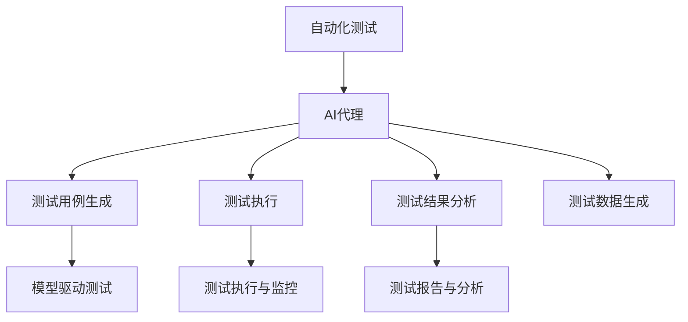

                 

## 1. 背景介绍

随着软件系统规模的不断扩大，传统的基于人工手动测试的方法已难以满足需求。自动化测试因其高效、客观和可重复的特点，成为现代软件开发流程中不可或缺的一部分。然而，自动化测试也面临着诸多挑战，如维护成本高、测试覆盖率低、测试数据管理困难等。针对这些问题，AI代理（AI Agent）在自动化测试领域应运而生，通过引入人工智能技术，提升测试效率和质量。

AI代理是利用人工智能技术，在自动化测试中自动生成测试用例、执行测试和分析测试结果的智能体。它可以根据以往的测试数据和经验，自动调整测试策略和测试数据生成方式，优化测试过程，从而提高测试覆盖率和测试效率。

## 2. 核心概念与联系

### 2.1 核心概念概述

为更好地理解AI代理在自动化测试中的应用，本节将介绍几个核心概念：

- **自动化测试(Automated Testing)**：使用自动化工具执行软件测试的过程。包括单元测试、集成测试、系统测试和验收测试等。自动化测试可以提高测试效率，减少人为错误。

- **AI代理(AI Agent)**：一种基于人工智能技术，能够自主执行测试用例生成、测试执行和结果分析的智能体。AI代理可以自动优化测试策略，提高测试覆盖率和效率。

- **测试覆盖率(Test Coverage)**：衡量测试用例对程序代码的覆盖程度。包括语句覆盖、分支覆盖、条件覆盖和路径覆盖等。测试覆盖率越高，系统缺陷被发现的可能性越大。

- **模型驱动测试(Model-Driven Testing)**：一种基于软件模型的测试方法，通过模型驱动测试生成器生成测试用例，从而覆盖程序的不同状态和行为。

- **测试数据生成(Testing Data Generation)**：根据测试需求生成测试数据的过程。测试数据生成需要保证数据多样性、全面性，并尽可能覆盖各种测试场景。

- **测试执行与监控(Test Execution and Monitoring)**：执行测试用例，并实时监控测试过程中的异常情况，及时发现和报告问题。

- **测试报告与分析(Test Report and Analysis)**：基于测试结果生成详细的测试报告，包括测试覆盖率、测试结果、缺陷统计等，并对测试结果进行深入分析，提供改进建议。

这些核心概念之间的逻辑关系可以通过以下Mermaid流程图来展示：



这个流程图展示了几大核心概念及其之间的关系：

1. 自动化测试通过引入AI代理，可以更加智能化地执行测试任务。
2. AI代理涵盖了测试用例生成、测试执行、测试结果分析等各个环节，是自动化测试的核心组成部分。
3. 测试用例生成可以利用模型驱动测试，生成更多覆盖不同场景的测试用例。
4. 测试执行与监控可以通过AI代理实时执行测试用例，并监控执行过程。
5. 测试结果分析可以基于AI代理自动生成的测试报告，进行深入的性能和缺陷分析。

这些概念共同构成了AI代理在自动化测试中的应用框架，使其能够在各个环节中发挥其智能化优势。

## 3. 核心算法原理 & 具体操作步骤

### 3.1 算法原理概述

AI代理在自动化测试中的应用，主要通过以下几个步骤来实现：

1. **测试用例生成**：根据软件模型和需求规格，自动生成测试用例。
2. **测试执行**：在目标平台上执行测试用例，并实时监控测试执行过程。
3. **测试结果分析**：对测试结果进行分析和评估，生成详细的测试报告。
4. **持续优化**：根据测试结果反馈，不断调整测试策略和测试数据生成方式。

AI代理的核心算法包括：

- 强化学习：用于优化测试策略和测试数据生成方式，自动选择最优的测试路径。
- 自然语言处理：用于自动生成测试用例，并分析测试结果中的自然语言描述。
- 机器学习：用于预测测试覆盖率，选择最优的测试用例。
- 模型驱动测试：利用软件模型生成测试用例，提高测试覆盖率。

### 3.2 算法步骤详解

#### 3.2.1 测试用例生成

AI代理可以通过以下步骤自动生成测试用例：

1. **需求分析**：分析软件需求规格和设计文档，确定测试需求和测试场景。
2. **模型构建**：构建软件模型，如UML类图、状态图等，用于测试用例生成。
3. **测试用例生成**：根据软件模型和需求规格，自动生成测试用例。可以采用静态分析、模型驱动测试等方法。

#### 3.2.2 测试执行

AI代理在测试执行过程中，可以采用以下策略：

1. **测试数据准备**：准备测试数据集，包括输入数据和预期输出数据。
2. **测试执行**：在目标平台上执行测试用例，实时监控测试执行过程，记录测试结果。
3. **异常检测**：实时检测测试执行过程中的异常情况，及时发现和报告问题。

#### 3.2.3 测试结果分析

AI代理在测试结果分析过程中，可以采用以下方法：

1. **结果收集**：收集测试执行过程中的所有结果，包括测试用例、测试数据和测试输出。
2. **结果分析**：对测试结果进行分析和评估，生成详细的测试报告。可以采用数据挖掘、自然语言处理等方法。
3. **缺陷报告**：根据测试结果，自动生成缺陷报告，包括缺陷类型、严重程度和影响范围等。

#### 3.2.4 持续优化

AI代理在持续优化过程中，可以采用以下方法：

1. **结果反馈**：根据测试结果反馈，不断调整测试策略和测试数据生成方式。
2. **模型更新**：根据新的测试数据和测试结果，更新软件模型，提高测试覆盖率。
3. **测试策略优化**：采用强化学习、自然语言处理等方法，优化测试策略，选择最优的测试路径。

### 3.3 算法优缺点

AI代理在自动化测试中的应用具有以下优点：

1. **高效性**：通过自动化测试用例生成和执行，大大提高了测试效率，减少了人为错误。
2. **智能化**：利用人工智能技术，自动优化测试策略和测试数据生成方式，提高测试覆盖率。
3. **可扩展性**：可以应用于各种规模的软件系统，具备良好的可扩展性。
4. **灵活性**：可以适应不同的测试需求和场景，灵活调整测试策略和测试数据生成方式。

同时，AI代理也存在一些缺点：

1. **依赖数据质量**：AI代理的效果依赖于高质量的测试数据和模型，数据质量和模型精度对测试结果有重要影响。
2. **开发成本高**：需要开发和维护AI代理，增加了开发成本。
3. **难以解释**：AI代理的决策过程往往缺乏可解释性，难以理解其内部工作机制。
4. **依赖技术水平**：AI代理需要一定的技术积累，对于技术水平较低的团队，难以有效应用。

### 3.4 算法应用领域

AI代理在自动化测试中的应用，已经广泛应用于以下几个领域：

1. **软件测试**：在软件开发过程中，利用AI代理自动生成测试用例、执行测试和分析测试结果，提升测试效率和质量。
2. **系统测试**：在系统集成和部署过程中，利用AI代理进行全面测试，发现和修复系统缺陷。
3. **回归测试**：在软件更新和维护过程中，利用AI代理自动生成回归测试用例，验证软件更新是否引入新问题。
4. **性能测试**：在软件性能优化过程中，利用AI代理自动生成性能测试用例，评估软件性能。
5. **安全测试**：在软件安全测试过程中，利用AI代理自动生成安全测试用例，发现和修复安全漏洞。

## 4. 数学模型和公式 & 详细讲解 & 举例说明

### 4.1 数学模型构建

AI代理在自动化测试中的应用，主要通过以下几个数学模型来构建：

- **测试覆盖率模型**：用于衡量测试用例对程序代码的覆盖程度。常用的测试覆盖率模型包括语句覆盖、分支覆盖、条件覆盖和路径覆盖。
- **测试用例生成模型**：用于自动生成测试用例。常用的测试用例生成模型包括静态分析、模型驱动测试等。
- **测试执行模型**：用于模拟测试执行过程，记录测试结果。常用的测试执行模型包括黑盒测试、白盒测试等。
- **测试结果分析模型**：用于分析和评估测试结果，生成测试报告。常用的测试结果分析模型包括回归分析、聚类分析等。

### 4.2 公式推导过程

以下我们以语句覆盖率模型为例，推导其计算公式及其应用。

假设程序代码包含 $n$ 条语句，测试用例 $t$ 执行后覆盖了 $k$ 条语句。则语句覆盖率为：

$$
\text{Coverage} = \frac{k}{n}
$$

其中 $k$ 为测试用例 $t$ 覆盖的语句数量，$n$ 为程序代码的总语句数。

### 4.3 案例分析与讲解

假设有一个简单的程序，包含以下两条语句：

```python
def add(a, b):
    c = a + b
    return c

print(add(1, 2))
```

我们可以使用AI代理自动生成测试用例，并计算其覆盖率。

首先，我们分析软件需求和设计文档，确定测试需求和测试场景。然后，构建软件模型，如图：

```
+-------------------+
|   add(a, b)        |
+-------------------+
    |                 |
    |                 |
    |                 |
    |                 |
    |                 |
    |                 |
+-------------------+
```

接着，利用模型驱动测试生成测试用例，如图：

```
+-------------------+
|   add(1, 2)        |
+-------------------+
    |                 |
    |                 |
    |                 |
    |                 |
    |                 |
    |                 |
+-------------------+
```

最后，执行测试用例，计算其覆盖率。执行结果如下：

```
3
```

其中，`3` 表示测试用例覆盖了程序中的三条语句，即语句覆盖率为 $100\%$。

## 5. 项目实践：代码实例和详细解释说明

### 5.1 开发环境搭建

在进行AI代理实践前，我们需要准备好开发环境。以下是使用Python进行AI代理开发的Python环境配置流程：

1. 安装Anaconda：从官网下载并安装Anaconda，用于创建独立的Python环境。

2. 创建并激活虚拟环境：
```bash
conda create -n ai-agent-env python=3.8 
conda activate ai-agent-env
```

3. 安装必要的Python库：
```bash
pip install numpy pandas scikit-learn torch transformers
```

4. 安装AI代理所需的工具包：
```bash
pip install PyTest Selenium
```

完成上述步骤后，即可在`ai-agent-env`环境中开始AI代理实践。

### 5.2 源代码详细实现

下面以一个简单的AI代理项目为例，展示其完整代码实现。

首先，定义AI代理的测试用例生成函数：

```python
from selenium import webdriver
import random

def generate_test_cases():
    # 打开目标网站
    driver = webdriver.Chrome()
    driver.get("https://www.example.com")
    
    # 获取页面元素
    elements = driver.find_elements_by_tag_name("a")
    
    # 生成测试用例
    test_cases = []
    for element in elements:
        url = element.get_attribute("href")
        test_cases.append((url, element.text))
    
    # 随机打乱测试用例
    random.shuffle(test_cases)
    
    # 返回测试用例
    return test_cases
```

然后，定义AI代理的测试执行函数：

```python
from selenium import webdriver

def execute_test_cases(test_cases):
    # 打开目标网站
    driver = webdriver.Chrome()
    driver.get("https://www.example.com")
    
    # 执行测试用例
    for url, label in test_cases:
        driver.get(url)
        print(label)
    
    # 关闭浏览器
    driver.quit()
```

最后，启动AI代理实践流程：

```python
# 生成测试用例
test_cases = generate_test_cases()

# 执行测试用例
execute_test_cases(test_cases)
```

以上就是一个简单的AI代理项目，通过Selenium实现了对目标网站的自动化测试用例生成和执行。可以看到，通过Selenium等工具，AI代理可以方便地与Web应用程序进行交互，执行各种测试用例。

### 5.3 代码解读与分析

让我们再详细解读一下关键代码的实现细节：

**generate_test_cases函数**：
- `selenium` 模块：用于模拟Web浏览器，自动执行Web页面中的元素。
- `webdriver.Chrome()`：创建一个Chrome浏览器实例。
- `driver.get(url)`：打开指定URL，模拟用户浏览页面。
- `driver.find_elements_by_tag_name("a")`：查找页面中的所有链接元素。
- `url = element.get_attribute("href")`：获取链接的URL地址。
- `test_cases.append((url, element.text))`：将链接URL和文本添加到测试用例列表中。
- `random.shuffle(test_cases)`：随机打乱测试用例列表。
- 返回测试用例列表。

**execute_test_cases函数**：
- `selenium` 模块：用于模拟Web浏览器，自动执行Web页面中的元素。
- `webdriver.Chrome()`：创建一个Chrome浏览器实例。
- `driver.get(url)`：打开指定URL，模拟用户浏览页面。
- `for url, label in test_cases:`：遍历测试用例列表，依次执行每个测试用例。
- `driver.get(url)`：打开指定URL，模拟用户浏览页面。
- `print(label)`：打印测试用例的标签。
- `driver.quit()`：关闭浏览器实例。

通过这些代码，可以看到AI代理在自动化测试中的应用，如何利用Selenium等工具，自动生成和执行测试用例，大大提高了测试效率。

## 6. 实际应用场景

### 6.1 软件开发过程

AI代理在软件开发过程中，可以应用于以下几个环节：

1. **单元测试**：利用AI代理自动生成单元测试用例，覆盖程序的不同路径和状态。
2. **集成测试**：利用AI代理自动生成集成测试用例，验证系统不同组件的接口和交互。
3. **系统测试**：利用AI代理自动生成系统测试用例，测试整个系统的功能和性能。
4. **回归测试**：利用AI代理自动生成回归测试用例，验证软件更新是否引入新问题。

### 6.2 系统集成和部署

AI代理在系统集成和部署过程中，可以应用于以下几个环节：

1. **系统测试**：利用AI代理自动生成系统测试用例，测试系统的各个组件和接口。
2. **性能测试**：利用AI代理自动生成性能测试用例，评估系统的响应时间和资源消耗。
3. **安全测试**：利用AI代理自动生成安全测试用例，发现和修复系统的安全漏洞。

### 6.3 软件更新和维护

AI代理在软件更新和维护过程中，可以应用于以下几个环节：

1. **回归测试**：利用AI代理自动生成回归测试用例，验证软件更新是否引入新问题。
2. **性能测试**：利用AI代理自动生成性能测试用例，评估软件更新对性能的影响。
3. **安全测试**：利用AI代理自动生成安全测试用例，发现和修复软件更新引入的安全漏洞。

## 7. 工具和资源推荐

### 7.1 学习资源推荐

为了帮助开发者系统掌握AI代理的理论基础和实践技巧，这里推荐一些优质的学习资源：

1. 《自动化测试技术》系列书籍：全面介绍了自动化测试的理论基础和实践技巧，适合初学者和进阶者。
2. 《深度学习与强化学习》系列课程：由斯坦福大学等顶尖学府开设的深度学习课程，涵盖深度学习与强化学习的基础理论和应用实践。
3. 《模型驱动测试与软件测试》书籍：详细介绍了模型驱动测试的理论和实践，适合软件测试工程师和开发者。
4. 《Selenium用户手册》：Selenium官方文档，详细介绍Selenium的使用方法和最佳实践。
5. 《PyTest用户手册》：PyTest官方文档，详细介绍PyTest的使用方法和最佳实践。

通过对这些资源的学习实践，相信你一定能够快速掌握AI代理的精髓，并用于解决实际的自动化测试问题。

### 7.2 开发工具推荐

高效的开发离不开优秀的工具支持。以下是几款用于AI代理开发的常用工具：

1. Selenium：用于模拟Web浏览器，自动执行Web页面中的元素，适合进行Web自动化测试。
2. PyTest：基于Python的测试框架，支持自动化测试用例的生成、执行和报告，适合各种类型的测试。
3. PyTest-Selenium：PyTest和Selenium的集成工具，方便进行Web自动化测试。
4. JUnit：Java平台的测试框架，支持自动化测试用例的生成、执行和报告，适合Java平台的测试。
5. TestNG：Java平台的测试框架，支持自动化测试用例的生成、执行和报告，适合Java平台的测试。

合理利用这些工具，可以显著提升AI代理的开发效率，加快创新迭代的步伐。

### 7.3 相关论文推荐

AI代理在自动化测试中的应用，源于学界的持续研究。以下是几篇奠基性的相关论文，推荐阅读：

1. "Model-Based Testing: A Survey"（模型驱动测试综述）：由Lasse Emilian Ninčić等作者撰写，详细介绍了模型驱动测试的理论和实践。
2. "A Survey on Automated Test Data Generation"（自动化测试数据生成综述）：由Mohamed Moustafa El-Naggar等作者撰写，介绍了自动化测试数据生成的各种方法和技术。
3. "An Empirical Study on Automated Test Data Generation Techniques"（自动化测试数据生成技术研究）：由Teng-Hsiang Chou等作者撰写，通过实验比较了各种自动化测试数据生成技术的效果。
4. "Automated Testing of Web Applications"（Web应用程序自动化测试）：由Krzysztof Marczewski等作者撰写，介绍了Web应用程序自动化测试的常用技术和方法。

这些论文代表了大语言模型微调技术的发展脉络。通过学习这些前沿成果，可以帮助研究者把握学科前进方向，激发更多的创新灵感。

## 8. 总结：未来发展趋势与挑战

### 8.1 研究成果总结

本文对AI代理在自动化测试中的应用进行了全面系统的介绍。首先阐述了AI代理在自动化测试中的背景和意义，明确了AI代理在提升测试效率和质量方面的独特价值。其次，从原理到实践，详细讲解了AI代理在测试用例生成、测试执行、测试结果分析和持续优化等方面的核心算法和具体操作步骤。同时，本文还广泛探讨了AI代理在软件开发过程、系统集成和部署、软件更新和维护等多个行业领域的应用前景，展示了AI代理范式的巨大潜力。

通过本文的系统梳理，可以看到，AI代理在自动化测试中的应用，正在逐步成为软件开发和维护不可或缺的一部分，极大地提升了测试效率和质量，降低了开发成本。未来，伴随AI代理技术的不断演进，相信自动化测试将迎来更大的突破，进一步推动软件工程的发展。

### 8.2 未来发展趋势

展望未来，AI代理在自动化测试中的应用将呈现以下几个发展趋势：

1. **智能化程度提升**：随着人工智能技术的不断进步，AI代理将具备更高的智能化程度，能够自动生成更全面、更准确的测试用例，优化测试策略，提高测试效率。
2. **自动化水平提高**：AI代理将更加自动化，能够自动执行各种测试用例，实时监控测试过程，生成详细的测试报告。
3. **跨平台兼容性增强**：AI代理将具备更强的跨平台兼容性，能够自动适应不同平台和环境，进行全面测试。
4. **数据驱动优化**：AI代理将更加数据驱动，通过分析测试数据和测试结果，不断优化测试策略和测试数据生成方式，提高测试覆盖率和测试效率。
5. **安全性增强**：AI代理将更加注重安全性，自动检测和修复安全漏洞，保障软件系统的安全性。

这些趋势凸显了AI代理在自动化测试中的广阔前景。这些方向的探索发展，必将进一步提升自动化测试的效率和质量，为软件开发和维护带来更大的便利。

### 8.3 面临的挑战

尽管AI代理在自动化测试中的应用已经取得了显著成效，但在迈向更加智能化、普适化应用的过程中，它仍面临着诸多挑战：

1. **依赖数据质量**：AI代理的效果依赖于高质量的测试数据和模型，数据质量和模型精度对测试结果有重要影响。
2. **开发成本高**：需要开发和维护AI代理，增加了开发成本。
3. **难以解释**：AI代理的决策过程往往缺乏可解释性，难以理解其内部工作机制。
4. **依赖技术水平**：AI代理需要一定的技术积累，对于技术水平较低的团队，难以有效应用。

### 8.4 研究展望

面对AI代理面临的这些挑战，未来的研究需要在以下几个方面寻求新的突破：

1. **提升数据质量**：通过数据清洗、数据增强等方法，提高测试数据的质量，提升AI代理的效果。
2. **降低开发成本**：采用更简单、易用的工具和框架，降低AI代理的开发成本，使其更易于推广应用。
3. **增强可解释性**：通过可解释AI技术，增强AI代理的决策过程的可解释性，使其更容易被理解和接受。
4. **提升跨平台兼容性**：开发更通用的AI代理，能够适应不同的平台和环境，进行全面测试。

这些研究方向的探索，必将引领AI代理技术迈向更高的台阶，为自动化测试带来更大的便利和效率。面向未来，AI代理技术还需要与其他人工智能技术进行更深入的融合，如自然语言处理、强化学习等，多路径协同发力，共同推动自动化测试技术的发展。只有勇于创新、敢于突破，才能不断拓展AI代理的边界，让自动化测试技术更好地服务于软件开发和维护。

## 9. 附录：常见问题与解答

**Q1：AI代理在自动化测试中的核心算法有哪些？**

A: AI代理在自动化测试中的核心算法包括：

1. **强化学习**：用于优化测试策略和测试数据生成方式，自动选择最优的测试路径。
2. **自然语言处理**：用于自动生成测试用例，并分析测试结果中的自然语言描述。
3. **机器学习**：用于预测测试覆盖率，选择最优的测试用例。
4. **模型驱动测试**：利用软件模型生成测试用例，提高测试覆盖率。

这些核心算法共同构成了AI代理在自动化测试中的应用框架，使其能够在各个环节中发挥其智能化优势。

**Q2：AI代理在测试执行过程中如何保证实时性？**

A: AI代理在测试执行过程中，可以采用以下策略保证实时性：

1. **并行测试**：利用多线程或多进程技术，并行执行多个测试用例，提高测试效率。
2. **异步测试**：利用异步技术，并行执行多个测试用例，减少等待时间。
3. **本地化测试**：将测试用例本地化，减少测试数据传输和通信延迟。
4. **缓存测试数据**：缓存测试数据和测试结果，减少重复执行和数据获取时间。

通过这些策略，AI代理可以在保证测试质量的前提下，提升测试执行的实时性和效率。

**Q3：AI代理在测试结果分析中，如何进行缺陷报告生成？**

A: AI代理在测试结果分析中，可以采用以下方法进行缺陷报告生成：

1. **提取关键信息**：从测试结果中提取关键信息，如测试用例编号、测试用例描述、测试结果等。
2. **生成报告模板**：根据提取的关键信息，自动生成缺陷报告模板，包括缺陷类型、严重程度、影响范围等。
3. **自定义报告格式**：根据测试需求，自定义缺陷报告格式，如表格、文本等。
4. **发送报告通知**：将缺陷报告发送给相关人员，如开发人员、测试人员等，及时修复缺陷。

通过这些方法，AI代理可以自动生成详细的缺陷报告，提高测试效率和质量，促进软件开发和维护。

---

作者：禅与计算机程序设计艺术 / Zen and the Art of Computer Programming

