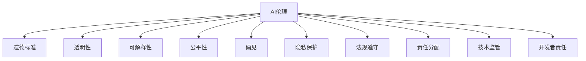

                 

# AI伦理：在开发过程中的重要考量

> 关键词：AI伦理,道德标准,透明性,可解释性,公平性,偏见,隐私保护,法规遵守,责任分配,技术监管,开发者责任,社会影响

## 1. 背景介绍

随着人工智能(AI)技术的迅猛发展，AI系统的应用范围不断扩大，影响深远。从自动驾驶汽车到智能推荐系统，从医疗诊断到金融风控，AI在各领域的应用为人类社会带来了巨大的便利和效率提升。然而，AI技术在带来利益的同时，也引发了一系列伦理道德问题。从算法偏见、数据隐私到行为控制，从决策透明度到责任归属，AI的伦理考量日益成为公众和政策制定者关注的焦点。本文将从开发者的视角出发，探讨AI伦理在开发过程中的重要考量，提出相应的解决策略，旨在促进AI技术的健康发展和负责任的应用。

## 2. 核心概念与联系

### 2.1 核心概念概述

为更好地理解AI伦理在开发过程中的应用，本节将介绍几个关键伦理概念及其相互关系：

- **AI伦理**：指在AI技术的开发和应用过程中，需要遵循的道德规范和行为准则，涉及公平性、透明度、隐私保护等。

- **道德标准**：用于判断AI系统行为是否符合伦理道德的基本准则，如不伤害原则、公正性原则等。

- **透明性**：要求AI系统的操作过程和决策依据可以被清晰理解和解释，便于审查和监督。

- **可解释性**：指AI系统的决策和行为能够被解释和理解，确保其可信度和公平性。

- **公平性**：要求AI系统在各种人群中的表现一致，避免对特定群体产生不利影响。

- **偏见**：指AI系统在训练和运行过程中，由于数据和算法缺陷导致的不公平现象，可能表现为性别、种族、地域等方面的歧视。

- **隐私保护**：要求AI系统在数据收集和处理过程中，保护用户隐私，避免个人信息泄露。

- **法规遵守**：指AI系统在开发和应用过程中，需遵守相关的法律法规，确保合法合规。

- **责任分配**：指在AI系统出现错误或不当行为时，如何分配责任和追究责任的问题。

- **技术监管**：指政府和行业监管机构对AI技术的监控和管理，确保其健康发展。

- **开发者责任**：指开发者在AI系统开发和维护过程中，需承担的伦理道德责任。

这些概念相互联系，共同构成了AI伦理在开发和应用过程中的基本框架。

### 2.2 核心概念原理和架构的 Mermaid 流程图



这个流程图展示了AI伦理在开发过程中的核心概念及其相互关系。开发者需要在设计、开发和部署AI系统时，综合考虑这些伦理要求，确保系统符合基本的伦理道德标准。

## 3. 核心算法原理 & 具体操作步骤

### 3.1 算法原理概述

AI伦理在开发过程中的核心算法原理，主要体现在以下几个方面：

- **道德标准集成**：在模型设计阶段，将道德标准转化为可量化的目标和约束，指导模型的训练和优化。

- **透明性增强**：使用可解释模型或增强模型可解释性，确保模型的决策过程可以被理解和审查。

- **偏见检测与缓解**：在模型训练和评估过程中，检测和缓解算法偏见，确保模型对不同群体的公平性。

- **隐私保护技术**：采用差分隐私、联邦学习等技术，保护用户数据隐私，避免数据泄露风险。

- **法规合规性检查**：在模型部署前，对模型进行法规合规性检查，确保其符合相关法律法规。

- **责任分配机制**：建立明确的责任分配机制，确保在AI系统出现错误或不当行为时，能够追溯和追究责任。

### 3.2 算法步骤详解

基于上述核心原理，AI伦理在开发过程中的操作步骤可以归纳如下：

**Step 1: 制定伦理框架**

开发者首先需要制定一套符合行业和法律要求的伦理框架，明确AI系统的道德标准和行为准则。这包括但不限于隐私保护、数据使用、算法公正性、透明度等。

**Step 2: 集成道德标准**

在模型设计阶段，将道德标准转化为模型训练的目标和约束，如公平性、隐私保护、法规合规性等。确保模型训练过程中，始终遵循这些伦理要求。

**Step 3: 增强透明性和可解释性**

使用可解释性高的模型或增强模型可解释性，如采用LIME、SHAP等方法，解释模型的决策过程，确保其透明性和可信度。

**Step 4: 检测和缓解偏见**

在数据预处理和模型训练过程中，使用偏见检测工具，如IBM的AI Fairness 360、Google的What-If等，检测和缓解算法偏见，确保模型在不同群体中表现一致。

**Step 5: 保护用户隐私**

采用差分隐私、联邦学习等隐私保护技术，保护用户数据隐私，避免数据泄露风险。同时，在设计隐私政策时，确保用户知情同意和数据匿名化处理。

**Step 6: 法规合规性检查**

在模型部署前，对模型进行法规合规性检查，确保其符合相关法律法规，如GDPR、CCPA等。同时，建立合规性评估流程，定期审查和更新模型。

**Step 7: 建立责任分配机制**

在模型开发过程中，明确各方的责任和义务，建立清晰的责任分配机制。在模型出现错误或不当行为时，能够追溯和追究责任，确保系统的透明性和责任可追溯性。

### 3.3 算法优缺点

基于上述算法原理和操作步骤，AI伦理在开发过程中具有以下优点：

- **提高信任度**：通过透明性和可解释性，提高AI系统的可信度和用户信任度。

- **确保公平性**：通过检测和缓解偏见，确保AI系统在不同群体中的公平性，避免歧视和偏见。

- **保护用户隐私**：通过隐私保护技术，保护用户数据隐私，避免数据泄露风险。

- **合规性保障**：通过法规合规性检查，确保AI系统符合法律法规要求，降低法律风险。

- **责任可追溯性**：通过建立责任分配机制，明确各方的责任和义务，确保系统出错时的责任可追溯性。

然而，这些算法也存在一些局限性：

- **技术复杂性**：增强透明性和可解释性、检测和缓解偏见等操作，需要借助复杂的技术手段，增加了开发成本和复杂度。

- **隐私保护挑战**：差分隐私和联邦学习等技术，虽然能有效保护隐私，但可能影响模型性能和数据利用效率。

- **法规适用性**：不同地区的法律法规差异较大，AI系统的合规性检查可能面临一定的法律风险。

- **责任界定困难**：AI系统涉及多方协作和复杂交互，责任分配机制的建立和执行可能面临一定的挑战。

### 3.4 算法应用领域

AI伦理在开发过程中的应用范围非常广泛，涵盖以下几个主要领域：

- **医疗健康**：在医疗诊断和推荐系统中，确保数据隐私和算法公平性，避免医疗决策偏见，保障患者权益。

- **金融科技**：在信用评估和风险控制中，保护用户隐私，确保算法公正性，避免金融歧视。

- **智能推荐**：在个性化推荐系统中，保护用户隐私，避免推荐偏见，提高用户体验。

- **公共安全**：在视频监控和智能分析中，保护个人隐私，确保算法公正性，避免滥用数据。

- **教育科技**：在智能教育系统中，保护学生隐私，确保算法公平性，避免教育资源分配不均。

- **自动驾驶**：在自动驾驶系统中，确保算法公正性，保护行人安全，避免技术滥用。

以上领域只是AI伦理应用的一部分，随着AI技术的进一步发展，其伦理考量将覆盖更多应用场景，成为推动技术健康发展的重要保障。

## 4. 数学模型和公式 & 详细讲解 & 举例说明

### 4.1 数学模型构建

AI伦理的数学模型构建，主要关注以下几个方面：

- **公平性**：使用统计学方法，评估模型在不同群体中的表现一致性。例如，使用ROC曲线和AUC指标评估模型的公平性。

- **透明性**：使用模型可解释性技术，如LIME、SHAP等，解释模型的决策过程。例如，使用局部线性模型(LIME)解释预测结果。

- **隐私保护**：使用差分隐私技术，保护用户数据隐私。例如，使用拉普拉斯机制和均匀噪声机制进行隐私保护。

- **法规合规性**：使用合规性检查工具，确保模型符合法律法规要求。例如，使用GDPR合规性检查工具进行合规性评估。

### 4.2 公式推导过程

以下以公平性评估为例，推导模型的公平性指标：

假设有一个二分类任务，模型预测结果为 $y = f(x)$，其中 $f(x)$ 表示模型对输入 $x$ 的预测概率。假设模型在两个群体 $A$ 和 $B$ 上的表现不一致，希望通过公平性指标 $F$ 来评估模型的不公平程度。

定义两个群体的样本分别为 $(x_A, y_A)$ 和 $(x_B, y_B)$，其中 $y_A$ 和 $y_B$ 分别表示群体 $A$ 和 $B$ 的样本标签。假设两个群体在样本数量上均衡，即 $n_A = n_B = n$。

根据公平性定义，模型在两个群体上的表现一致，即对两个群体的预测概率一致，可以表示为：

$$
\frac{1}{n} \sum_{i=1}^n f(x_A^i) = \frac{1}{n} \sum_{i=1}^n f(x_B^i)
$$

将上述公式代入模型预测概率，并使用交叉熵损失函数，可以得到公平性指标 $F$ 的计算公式：

$$
F = -\frac{1}{2n} \sum_{i=1}^n (y_A^i \log f(x_A^i) + (1-y_A^i) \log (1-f(x_A^i)) - y_B^i \log f(x_B^i) - (1-y_B^i) \log (1-f(x_B^i)))
$$

将公平性指标 $F$ 最小化，即：

$$
\min_F F
$$

即可得到公平性优化目标。在实际应用中，可以使用优化算法（如梯度下降、Adam等）最小化公平性指标 $F$，实现模型公平性的提升。

### 4.3 案例分析与讲解

假设有一个自动贷款审批系统，该系统基于用户的历史贷款记录和基本信息进行信用评估。然而，系统在男性和女性用户中的表现不一致，导致女性用户被拒绝贷款的概率较高。为了检测和缓解这一偏见，可以采用以下步骤：

**Step 1: 数据预处理**

收集历史贷款记录和用户基本信息，包括性别、年龄、收入等。对数据进行清洗和预处理，去除异常值和噪声数据，确保数据质量。

**Step 2: 模型训练**

在处理后的数据集上，使用支持向量机(SVM)或随机森林等算法进行训练，得到初始信用评估模型。

**Step 3: 偏见检测**

使用AI Fairness 360等偏见检测工具，检测模型在男性和女性用户中的表现差异，输出偏见分数。如果偏见分数较高，表示模型存在偏见。

**Step 4: 缓解偏见**

根据偏见检测结果，使用公平性优化方法，如重新采样、权重调整等，缓解模型的偏见，提升模型在不同群体中的公平性。

**Step 5: 模型评估**

在处理后的数据集上，使用测试集评估模型在男性和女性用户中的表现，确保模型在不同群体中的公平性。

## 5. 项目实践：代码实例和详细解释说明

### 5.1 开发环境搭建

在进行AI伦理实践前，我们需要准备好开发环境。以下是使用Python进行AI伦理开发的常用环境配置流程：

1. 安装Python：从官网下载并安装Python，建议安装最新版本。

2. 安装相关库：使用pip安装必要的库，如TensorFlow、PyTorch、Scikit-learn、Pandas等。

3. 设置工作环境：使用conda或virtualenv创建虚拟环境，以隔离不同的项目需求。

4. 使用编辑器：如Jupyter Notebook、Visual Studio Code等，编写和运行代码。

完成上述步骤后，即可在虚拟环境中开始AI伦理实践。

### 5.2 源代码详细实现

这里我们以公平性评估为例，给出一个使用Python实现的AI伦理代码实例：

```python
import numpy as np
from sklearn.metrics import roc_auc_score

# 定义两个群体的样本
x_A = np.array([[1, 2, 3], [4, 5, 6], [7, 8, 9], [10, 11, 12]])
x_B = np.array([[13, 14, 15], [16, 17, 18], [19, 20, 21], [22, 23, 24]])

y_A = np.array([1, 0, 0, 1])
y_B = np.array([1, 1, 0, 0])

# 定义模型
def f(x):
    return 1 / (1 + np.exp(-np.dot(x, w)))

# 训练模型
w = np.random.randn(3)
for i in range(1000):
    for x, y in zip([x_A, x_B], [y_A, y_B]):
        loss = -y * np.log(f(x)) - (1 - y) * np.log(1 - f(x))
        w -= learning_rate * np.dot(grad(loss), x)

# 计算公平性指标
pred_A = f(x_A)
pred_B = f(x_B)
auc_A = roc_auc_score(y_A, pred_A)
auc_B = roc_auc_score(y_B, pred_B)
F = (auc_A + auc_B) / 2

print("公平性指标 F:", F)
```

### 5.3 代码解读与分析

以上代码实现了基于二分类模型的公平性评估。其中，使用了二分类模型进行训练，并计算了两个群体在模型上的表现一致性。

**代码解析**：

1. 首先定义了两个群体的样本 $x_A$ 和 $x_B$，以及对应的标签 $y_A$ 和 $y_B$。
2. 定义了模型函数 $f(x)$，使用线性回归模型进行训练。
3. 使用梯度下降法训练模型，最小化交叉熵损失函数。
4. 计算了模型在两个群体上的表现一致性，使用ROC曲线下的面积(AUC)作为公平性指标 $F$。
5. 输出公平性指标 $F$ 的值。

**关键步骤说明**：

1. **样本定义**：将数据分为两个群体，分别定义 $x_A$ 和 $x_B$，以及对应的标签 $y_A$ 和 $y_B$。
2. **模型训练**：使用线性回归模型进行训练，并使用梯度下降法最小化交叉熵损失函数。
3. **公平性评估**：计算模型在两个群体上的表现一致性，使用ROC曲线下的面积(AUC)作为公平性指标 $F$。

## 6. 实际应用场景

### 6.1 智能医疗

在智能医疗领域，AI伦理的应用尤为重要。医疗诊断和治疗决策涉及患者隐私和生命安全，伦理道德要求极高。例如，基于AI的影像诊断系统需要在隐私保护和算法公正性方面进行严格把控，确保患者数据不被滥用，诊断结果公平可信。

**具体应用**：

- **隐私保护**：在影像数据收集和存储过程中，采用差分隐私和联邦学习等技术，保护患者隐私，避免数据泄露风险。
- **算法公正性**：确保不同群体（如男性、女性、老年人群体等）在影像诊断中的表现一致，避免诊断偏见，提高诊断准确性。
- **法规合规性**：确保影像诊断系统符合GDPR等法律法规要求，保护患者权益，避免法律风险。

### 6.2 金融科技

金融科技领域的应用场景复杂多样，涉及大量敏感数据和金融决策，AI伦理的考量也尤为关键。例如，基于AI的信用评估系统需要在公平性、透明性和隐私保护方面进行严格把控，确保金融决策的公平性和可信度。

**具体应用**：

- **公平性**：在信用评估中，确保不同性别、年龄、地域等群体的信用评估结果一致，避免金融歧视。
- **透明性**：在信用评估过程中，确保模型的决策过程透明，用户能够理解模型如何进行信用评估，增强用户信任。
- **隐私保护**：在信用评估过程中，保护用户隐私，避免数据泄露风险，确保用户数据安全。

### 6.3 智能推荐

在智能推荐领域，AI伦理的考量主要集中在用户隐私和算法公平性方面。例如，基于AI的个性化推荐系统需要在隐私保护和算法公正性方面进行严格把控，确保推荐结果公平可信。

**具体应用**：

- **隐私保护**：在推荐算法中，保护用户隐私，避免用户数据被滥用，确保用户数据安全。
- **算法公正性**：确保不同用户群体（如不同年龄段、不同地域等）在推荐结果中的表现一致，避免推荐偏见，提高推荐效果。

## 7. 工具和资源推荐

### 7.1 学习资源推荐

为了帮助开发者系统掌握AI伦理的理论基础和实践技巧，这里推荐一些优质的学习资源：

1. 《AI伦理：道德、透明性和公平性》（AICube, 2019）：全面介绍了AI伦理的基本概念、伦理框架和实践方法，适合入门学习。

2. 《数据科学中的伦理与责任》（Coursera, 2021）：由数据科学家讲解数据科学中的伦理和责任问题，涵盖隐私保护、算法偏见、法规合规性等主题。

3. 《AI伦理指南》（IEEE, 2019）：提供了AI伦理的全面指南，涵盖数据隐私、公平性、透明性等方面，适合实践应用。

4. 《AI与伦理：道德、透明性和责任》（Google, 2019）：Google发布的AI伦理指南，涵盖AI伦理的基本概念、实践方法、工具等，适合技术应用。

5. 《AI伦理：从原则到实践》（DeepMind, 2020）：DeepMind发布的AI伦理指南，涵盖AI伦理的基本原则、实践方法、工具等，适合技术应用。

通过对这些资源的学习实践，相信你一定能够快速掌握AI伦理的精髓，并用于解决实际的伦理问题。

### 7.2 开发工具推荐

高效的开发离不开优秀的工具支持。以下是几款用于AI伦理开发的常用工具：

1. TensorFlow：开源深度学习框架，支持多种算法模型，适合AI伦理的建模和训练。

2. PyTorch：开源深度学习框架，支持动态计算图，适合AI伦理的模型构建和训练。

3. Scikit-learn：开源机器学习库，提供多种算法模型和工具，适合AI伦理的数据处理和评估。

4. Jupyter Notebook：开源笔记本工具，支持Python代码的交互式开发和展示，适合AI伦理的实验和研究。

5. Google Colab：Google提供的云端Jupyter Notebook环境，免费提供GPU/TPU算力，适合AI伦理的快速实验和分享。

合理利用这些工具，可以显著提升AI伦理的开发效率，加快创新迭代的步伐。

### 7.3 相关论文推荐

AI伦理的研究源于学界的持续探索。以下是几篇奠基性的相关论文，推荐阅读：

1. "Fairness in Machine Learning: From Theory to Practice"（Proceedings of the IEEE, 2019）：该论文综述了公平性在机器学习中的理论和实践，提出了多种公平性评估和缓解方法。

2. "Ethics and Governance of Artificial Intelligence"（Towards AI Ethical and Fair Development, 2020）：该论文探讨了AI伦理的基本原则和实践方法，提出了AI伦理的治理框架。

3. "Privacy-Preserving Deep Learning"（IEEE Transactions on Knowledge and Data Engineering, 2020）：该论文综述了隐私保护在深度学习中的应用，提出了多种隐私保护技术。

4. "AI Ethical Responsibility Framework"（IEEE, 2019）：该论文提出了AI伦理的基本框架，涵盖隐私保护、公平性、透明性等方面，适合实践应用。

5. "Human-AI Ethics Governance"（Nature, 2019）：该论文探讨了AI伦理的治理问题，提出了多方参与、透明公正的治理框架。

这些论文代表了大AI伦理的发展脉络。通过学习这些前沿成果，可以帮助研究者把握学科前进方向，激发更多的创新灵感。

## 8. 总结：未来发展趋势与挑战

### 8.1 研究成果总结

本文对AI伦理在开发过程中的重要考量进行了全面系统的介绍。首先阐述了AI伦理的基本概念和应用场景，明确了AI伦理在开发和应用过程中的基本框架。其次，从道德标准、透明性、可解释性、公平性、偏见、隐私保护、法规遵守、责任分配、技术监管等多个方面，详细讲解了AI伦理的数学模型和操作步骤。同时，本文还广泛探讨了AI伦理在医疗健康、金融科技、智能推荐等多个行业领域的应用前景，展示了AI伦理的广阔前景。

通过本文的系统梳理，可以看到，AI伦理在开发过程中的重要考量，已经成为推动AI技术健康发展的重要保障。这些伦理要求，不仅有助于提升AI系统的可信度和公平性，还能保障用户隐私和数据安全，确保AI技术的合规性和责任可追溯性。未来，伴随AI技术的进一步发展，伦理考量将覆盖更多应用场景，成为推动技术健康发展的重要力量。

### 8.2 未来发展趋势

展望未来，AI伦理在开发过程中将呈现以下几个发展趋势：

1. **法规与伦理的深度融合**：随着AI技术的广泛应用，法规与伦理的深度融合将成为必然趋势。政府和行业监管机构将进一步加强对AI技术的法律规范，确保AI技术的健康发展。

2. **透明性与可解释性的普及**：越来越多的AI系统将采用可解释性高的模型，确保其决策过程透明，增强用户信任。

3. **公平性算法的广泛应用**：在数据科学和机器学习领域，公平性算法将得到更广泛的应用，检测和缓解算法偏见，确保AI系统在不同群体中的公平性。

4. **隐私保护技术的不断创新**：差分隐私、联邦学习等隐私保护技术将不断创新，保护用户数据隐私，避免数据泄露风险。

5. **责任分配机制的完善**：在AI系统开发和应用过程中，建立清晰的责任分配机制，确保在AI系统出现错误或不当行为时，能够追溯和追究责任，增强系统的透明性和责任可追溯性。

6. **伦理教育的普及**：随着AI技术的普及，伦理教育将成为AI从业人员的基本要求，提高从业人员的伦理意识和责任意识。

以上趋势凸显了AI伦理在开发过程中的重要性和必要性。这些方向的探索发展，将进一步推动AI技术的健康发展，为构建安全、可靠、可解释、可控的智能系统铺平道路。

### 8.3 面临的挑战

尽管AI伦理在开发过程中已经取得了一定的进展，但在迈向更加智能化、普适化应用的过程中，仍然面临诸多挑战：

1. **法规适用性挑战**：不同地区的法律法规差异较大，AI系统的合规性检查可能面临一定的法律风险。

2. **隐私保护技术挑战**：差分隐私和联邦学习等隐私保护技术，虽然能有效保护隐私，但可能影响模型性能和数据利用效率。

3. **公平性检测与缓解挑战**：检测和缓解算法偏见，确保模型在不同群体中的公平性，需要借助复杂的技术手段，增加了开发成本和复杂度。

4. **责任界定困难**：AI系统涉及多方协作和复杂交互，责任分配机制的建立和执行可能面临一定的挑战。

5. **伦理框架的适应性**：不同领域和应用场景对AI伦理的考量各不相同，需要构建灵活适应的伦理框架。

6. **技术复杂性**：增强透明性和可解释性、检测和缓解偏见等操作，需要借助复杂的技术手段，增加了开发成本和复杂度。

正视AI伦理在开发过程中面临的这些挑战，积极应对并寻求突破，将是大规模AI系统落地应用的重要保障。相信随着学界和产业界的共同努力，这些挑战终将一一被克服，AI伦理将为构建安全、可靠、可解释、可控的智能系统提供重要保障。

### 8.4 研究展望

面对AI伦理在开发过程中面临的挑战，未来的研究需要在以下几个方面寻求新的突破：

1. **伦理框架的灵活性**：构建灵活适应的伦理框架，适应不同领域和应用场景的伦理要求，增强AI技术的普适性和实用性。

2. **隐私保护技术的创新**：开发更加高效、安全的隐私保护技术，保护用户数据隐私，避免数据泄露风险。

3. **公平性算法的优化**：开发更加高效、公平的公平性算法，检测和缓解算法偏见，确保AI系统在不同群体中的公平性。

4. **透明性和可解释性的提升**：开发更加高效、可解释的AI模型，增强模型的透明性和可解释性，确保模型决策的公平性和可信度。

5. **责任分配机制的完善**：建立清晰的责任分配机制，明确各方的责任和义务，确保系统出错时的责任可追溯性，增强系统的透明性和责任可追溯性。

6. **伦理教育的普及**：提高AI从业人员的伦理意识和责任意识，推动伦理教育的普及，提升AI技术的健康发展。

这些研究方向的探索，将进一步推动AI伦理的发展，为构建安全、可靠、可解释、可控的智能系统提供重要保障。面向未来，AI伦理将与AI技术深度融合，共同推动技术健康发展，造福全人类。

## 9. 附录：常见问题与解答

**Q1：AI伦理在开发过程中是否需要遵守法律法规？**

A: 是的，AI伦理在开发过程中必须遵守相关法律法规。例如，在医疗、金融等高风险领域，AI系统必须符合GDPR、CCPA等法律法规，保护用户隐私和数据安全，确保合法合规。

**Q2：AI伦理在开发过程中是否需要考虑技术复杂性？**

A: 是的，AI伦理在开发过程中必须考虑技术复杂性。增强透明性和可解释性、检测和缓解偏见等操作，需要借助复杂的技术手段，增加了开发成本和复杂度。开发者需要权衡技术复杂性和伦理要求之间的关系，选择合适的方法和技术。

**Q3：AI伦理在开发过程中是否需要考虑公平性？**

A: 是的，AI伦理在开发过程中必须考虑公平性。确保AI系统在不同群体中的表现一致，避免算法偏见，提高系统的公平性和可信度。

**Q4：AI伦理在开发过程中是否需要考虑隐私保护？**

A: 是的，AI伦理在开发过程中必须考虑隐私保护。在数据收集和处理过程中，保护用户隐私，避免数据泄露风险，确保用户数据安全。

**Q5：AI伦理在开发过程中是否需要考虑法规合规性？**

A: 是的，AI伦理在开发过程中必须考虑法规合规性。确保AI系统符合相关法律法规要求，避免法律风险，保障用户权益。

**Q6：AI伦理在开发过程中是否需要考虑责任分配？**

A: 是的，AI伦理在开发过程中必须考虑责任分配。建立清晰的责任分配机制，确保在AI系统出现错误或不当行为时，能够追溯和追究责任，增强系统的透明性和责任可追溯性。

通过本文的系统梳理，可以看到，AI伦理在开发过程中的重要考量，已经成为推动AI技术健康发展的重要保障。这些伦理要求，不仅有助于提升AI系统的可信度和公平性，还能保障用户隐私和数据安全，确保AI技术的合规性和责任可追溯性。未来，伴随AI技术的进一步发展，伦理考量将覆盖更多应用场景，成为推动技术健康发展的重要力量。

---

作者：禅与计算机程序设计艺术 / Zen and the Art of Computer Programming

