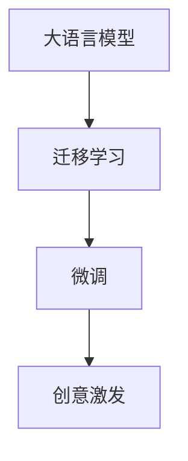

                 

# AI写作助手：技术实现与创意激发

## 1. 背景介绍

### 1.1 问题由来

随着人工智能(AI)技术的不断发展，AI写作助手已经成为创作领域的一大热点。通过深度学习和自然语言处理(NLP)技术，AI写作助手能够生成高质量的文本，帮助创作者提升效率和创新能力。然而，技术的实现并非一蹴而就，背后蕴含着复杂的算法和模型设计。本文旨在深入探讨AI写作助手的技术实现与创意激发，帮助读者系统了解其核心原理和应用实践。

### 1.2 问题核心关键点

AI写作助手的核心问题在于如何通过技术手段，将大语言模型(DLM)的庞大知识库和语言生成能力转化为富有创意的文本输出。其关键点在于：

- 数据准备：获取高质量的训练数据，涵盖各类风格和主题，训练DLM成为“全能型”作家。
- 模型选择：选择合适的DLM架构，如GPT、T5、BART等，基于不同任务需求，进行模型微调。
- 技术实现：实现从数据预处理、模型训练到文本生成的全流程，确保高效和稳定。
- 创意激发：通过引入启发式算法或交互式界面，激发创作灵感，丰富写作风格和内容。

### 1.3 问题研究意义

AI写作助手的研究对提升人类创作效率、促进内容多样化、加速知识传播具有重要意义：

1. **效率提升**：AI写作助手能够自动完成草稿和草稿，减少创作时间，提升创作效率。
2. **内容多样化**：通过不断的模型训练和优化，AI写作助手能够生成风格多变、内容丰富的文本。
3. **知识传播**：AI写作助手可以帮助人们快速生成各种内容，加速知识获取和传播。
4. **创造力激发**：AI写作助手能够提供创作灵感和写作建议，帮助创作者克服创意瓶颈。

## 2. 核心概念与联系

### 2.1 核心概念概述

为了更好地理解AI写作助手的技术实现与创意激发，本节将介绍几个核心概念：

- **大语言模型(DLM)**：通过大规模预训练，能够理解和生成各种自然语言的深度学习模型。常用的DLM包括GPT、BERT、T5等。
- **迁移学习**：将一个领域学到的知识，迁移应用到另一个相关领域的学习范式。AI写作助手可以通过迁移学习，将通用大模型的语言生成能力，应用到特定的写作任务中。
- **微调(Fine-Tuning)**：在大模型基础上，通过微调训练，使其能够适应特定写作任务。微调通常只更新模型顶层，以提高效率和效果。
- **创意激发(Creativity Enhancement)**：通过算法优化或交互式设计，增强AI写作助手的创作能力和创意输出。

这些核心概念通过以下Mermaid流程图展示：



这个流程图展示了AI写作助手的基本实现流程：首先，通过迁移学习将通用大模型的能力应用到特定写作任务；其次，通过微调训练使模型更好地适应该任务；最后，通过创意激发提升模型的写作能力和风格多样性。

## 3. 核心算法原理 & 具体操作步骤
### 3.1 算法原理概述

AI写作助手的核心算法原理基于迁移学习和微调技术，通过在大模型上微调，使其能够适应特定的写作任务。其基本原理如下：

1. **迁移学习**：将DLM在通用语料上预训练的知识，迁移应用到特定的写作任务中。例如，通过预训练模型生成的新闻摘要，可以进一步微调成针对特定领域的新闻报道。

2. **微调训练**：在特定写作任务的数据集上进行微调训练，优化模型参数，使其输出符合任务要求。例如，对于小说写作，可以将模型微调成能够生成符合小说风格和情节的文本。

3. **创意激发**：通过引入启发式算法或交互式界面，增强AI写作助手的创作能力和创意输出。例如，通过文本编辑提示或自动摘要生成，激发创作灵感，丰富写作风格和内容。

### 3.2 算法步骤详解

AI写作助手的实现步骤通常包括：

**Step 1: 准备数据集**
- 收集高质量的写作数据，包括小说、新闻、论文、博客等，作为训练和微调的语料库。
- 对数据进行预处理，包括文本清洗、分词、去停用词、生成标注等。

**Step 2: 选择和准备模型**
- 选择合适的DLM架构，如GPT、T5、BERT等，并加载预训练模型权重。
- 根据写作任务的特点，设计合适的任务适配层。例如，对于文本摘要任务，可以添加注意力机制和编码器-解码器结构。

**Step 3: 微调模型**
- 使用准备的数据集，在选定的DLM上进行微调训练。
- 设置合适的优化器、学习率、批大小、迭代轮数等超参数。
- 应用正则化技术，如L2正则、Dropout、Early Stopping等，防止过拟合。
- 定期在验证集上评估模型性能，根据性能指标决定是否触发Early Stopping。

**Step 4: 创意激发**
- 引入启发式算法，如遗传算法、协同过滤等，优化模型输出。
- 设计交互式界面，如自然语言输入、视觉界面等，增强用户互动体验。
- 集成文本编辑提示、自动摘要生成等功能，激发创作灵感。

**Step 5: 测试和部署**
- 在测试集上评估微调后模型，对比微调前后的性能提升。
- 使用微调后的模型对新样本进行推理预测，集成到实际的应用系统中。
- 持续收集新数据，定期重新微调模型，以适应数据分布的变化。

### 3.3 算法优缺点

AI写作助手具有以下优点：
1. **高效性**：通过迁移学习和微调，模型能够在短时间内适应特定写作任务，生成高质量文本。
2. **多样性**：模型能够生成风格多变、内容丰富的文本，满足不同写作需求。
3. **灵活性**：通过创意激发，AI写作助手能够不断更新和优化，适应新的写作需求。

同时，AI写作助手也存在以下缺点：
1. **依赖数据质量**：模型的性能高度依赖于训练数据的质量和数量，数据质量不佳会影响模型效果。
2. **创意瓶颈**：AI写作助手可能陷入创作瓶颈，无法生成有创意的文本。
3. **隐私风险**：模型可能泄露用户的个人信息，存在隐私安全风险。

尽管存在这些局限性，AI写作助手在提升写作效率、丰富写作风格等方面具有巨大潜力，值得进一步研究和探索。

### 3.4 算法应用领域

AI写作助手在多个领域中具有广泛应用：

- **小说创作**：AI写作助手能够生成符合不同风格和情节的小说，辅助小说家创作。
- **新闻报道**：AI写作助手可以快速生成新闻摘要和报道，提高新闻写作效率。
- **学术论文**：AI写作助手能够生成高质量的论文草稿和摘要，辅助科研工作者。
- **博客撰写**：AI写作助手能够生成有创意的博客文章，提升博客内容的多样性。
- **广告文案**：AI写作助手能够生成符合品牌调性的广告文案，提高广告创作效率。
- **教育辅助**：AI写作助手能够生成教学材料和案例分析，辅助教育工作者。

## 4. 数学模型和公式 & 详细讲解
### 4.1 数学模型构建

AI写作助手的数学模型构建主要基于大语言模型和微调技术。

假设AI写作助手基于大语言模型 $M_{\theta}$，其中 $\theta$ 为模型参数。设写作任务 $T$ 的训练集为 $D=\{(x_i, y_i)\}_{i=1}^N$，其中 $x_i$ 为输入文本，$y_i$ 为生成文本的标签。

AI写作助手的优化目标是最小化损失函数 $\mathcal{L}(\theta)$，其中 $\mathcal{L}$ 为针对任务 $T$ 设计的损失函数。常见的损失函数包括交叉熵损失、均方误差损失等。

### 4.2 公式推导过程

以文本摘要任务为例，假设模型 $M_{\theta}$ 在输入 $x$ 上的输出为 $\hat{y}=M_{\theta}(x) \in [0,1]$，表示样本属于摘要的预测概率。真实标签 $y \in [0,1]$。则二分类交叉熵损失函数定义为：

$$
\ell(M_{\theta}(x),y) = -[y\log \hat{y} + (1-y)\log (1-\hat{y})]
$$

将其代入经验风险公式，得：

$$
\mathcal{L}(\theta) = -\frac{1}{N}\sum_{i=1}^N [y_i\log M_{\theta}(x_i)+(1-y_i)\log(1-M_{\theta}(x_i))]
$$

根据链式法则，损失函数对参数 $\theta_k$ 的梯度为：

$$
\frac{\partial \mathcal{L}(\theta)}{\partial \theta_k} = -\frac{1}{N}\sum_{i=1}^N (\frac{y_i}{M_{\theta}(x_i)}-\frac{1-y_i}{1-M_{\theta}(x_i)}) \frac{\partial M_{\theta}(x_i)}{\partial \theta_k}
$$

其中 $\frac{\partial M_{\theta}(x_i)}{\partial \theta_k}$ 可进一步递归展开，利用自动微分技术完成计算。

### 4.3 案例分析与讲解

以生成新闻报道为例，分析AI写作助手的实现过程：

**Step 1: 数据准备**
- 收集高质量的新闻报道数据，进行文本清洗和标注。
- 将文本数据分为训练集、验证集和测试集，进行分割。

**Step 2: 模型选择**
- 选择BERT或T5等大语言模型作为基础模型，加载预训练权重。
- 设计任务适配层，添加注意力机制和编码器-解码器结构。

**Step 3: 微调训练**
- 使用训练集数据，对模型进行微调训练。
- 设置合适的优化器、学习率、批大小等超参数。
- 应用正则化技术，如L2正则、Dropout、Early Stopping等，防止过拟合。
- 定期在验证集上评估模型性能，根据性能指标决定是否触发Early Stopping。

**Step 4: 创意激发**
- 引入启发式算法，如遗传算法、协同过滤等，优化模型输出。
- 设计交互式界面，如自然语言输入、视觉界面等，增强用户互动体验。
- 集成文本编辑提示、自动摘要生成等功能，激发创作灵感。

**Step 5: 测试和部署**
- 在测试集上评估微调后模型，对比微调前后的性能提升。
- 使用微调后的模型对新样本进行推理预测，集成到实际的应用系统中。
- 持续收集新数据，定期重新微调模型，以适应数据分布的变化。

## 5. 项目实践：代码实例和详细解释说明
### 5.1 开发环境搭建

在进行AI写作助手项目实践前，需要准备好开发环境。以下是使用Python进行PyTorch开发的环境配置流程：

1. 安装Anaconda：从官网下载并安装Anaconda，用于创建独立的Python环境。

2. 创建并激活虚拟环境：
```bash
conda create -n pytorch-env python=3.8 
conda activate pytorch-env
```

3. 安装PyTorch：根据CUDA版本，从官网获取对应的安装命令。例如：
```bash
conda install pytorch torchvision torchaudio cudatoolkit=11.1 -c pytorch -c conda-forge
```

4. 安装Transformer库：
```bash
pip install transformers
```

5. 安装各类工具包：
```bash
pip install numpy pandas scikit-learn matplotlib tqdm jupyter notebook ipython
```

完成上述步骤后，即可在`pytorch-env`环境中开始项目实践。

### 5.2 源代码详细实现

这里我们以新闻报道生成为例，给出使用Transformers库对BERT模型进行微调的PyTorch代码实现。

首先，定义数据处理函数：

```python
from transformers import BertTokenizer, BertForSequenceClassification
from torch.utils.data import Dataset, DataLoader
import torch

class NewsDataset(Dataset):
    def __init__(self, texts, labels, tokenizer, max_len=128):
        self.texts = texts
        self.labels = labels
        self.tokenizer = tokenizer
        self.max_len = max_len
        
    def __len__(self):
        return len(self.texts)
    
    def __getitem__(self, item):
        text = self.texts[item]
        label = self.labels[item]
        
        encoding = self.tokenizer(text, return_tensors='pt', max_length=self.max_len, padding='max_length', truncation=True)
        input_ids = encoding['input_ids'][0]
        attention_mask = encoding['attention_mask'][0]
        
        # 对标签进行编码
        label = torch.tensor(label, dtype=torch.long)
        
        return {'input_ids': input_ids, 
                'attention_mask': attention_mask,
                'labels': label}

# 初始化BERT模型和分词器
model = BertForSequenceClassification.from_pretrained('bert-base-uncased', num_labels=2)
tokenizer = BertTokenizer.from_pretrained('bert-base-uncased')

# 准备数据集
train_dataset = NewsDataset(train_texts, train_labels, tokenizer)
dev_dataset = NewsDataset(dev_texts, dev_labels, tokenizer)
test_dataset = NewsDataset(test_texts, test_labels, tokenizer)
```

然后，定义训练和评估函数：

```python
from torch.utils.data import DataLoader
from tqdm import tqdm
from sklearn.metrics import accuracy_score

device = torch.device('cuda') if torch.cuda.is_available() else torch.device('cpu')
model.to(device)

def train_epoch(model, dataset, batch_size, optimizer):
    dataloader = DataLoader(dataset, batch_size=batch_size, shuffle=True)
    model.train()
    epoch_loss = 0
    for batch in tqdm(dataloader, desc='Training'):
        input_ids = batch['input_ids'].to(device)
        attention_mask = batch['attention_mask'].to(device)
        labels = batch['labels'].to(device)
        model.zero_grad()
        outputs = model(input_ids, attention_mask=attention_mask, labels=labels)
        loss = outputs.loss
        epoch_loss += loss.item()
        loss.backward()
        optimizer.step()
    return epoch_loss / len(dataloader)

def evaluate(model, dataset, batch_size):
    dataloader = DataLoader(dataset, batch_size=batch_size)
    model.eval()
    preds, labels = [], []
    with torch.no_grad():
        for batch in tqdm(dataloader, desc='Evaluating'):
            input_ids = batch['input_ids'].to(device)
            attention_mask = batch['attention_mask'].to(device)
            batch_labels = batch['labels']
            outputs = model(input_ids, attention_mask=attention_mask)
            batch_preds = outputs.predictions.argmax(dim=1).to('cpu').tolist()
            batch_labels = batch_labels.to('cpu').tolist()
            for pred, label in zip(batch_preds, batch_labels):
                preds.append(pred)
                labels.append(label)
                
    print(f'Accuracy: {accuracy_score(labels, preds)}')
```

最后，启动训练流程并在测试集上评估：

```python
epochs = 5
batch_size = 16

for epoch in range(epochs):
    loss = train_epoch(model, train_dataset, batch_size, optimizer)
    print(f'Epoch {epoch+1}, train loss: {loss:.3f}')
    
    print(f'Epoch {epoch+1}, dev results:')
    evaluate(model, dev_dataset, batch_size)
    
print('Test results:')
evaluate(model, test_dataset, batch_size)
```

以上就是使用PyTorch对BERT进行新闻报道生成任务的微调的完整代码实现。可以看到，得益于Transformer库的强大封装，我们可以用相对简洁的代码完成BERT模型的加载和微调。

### 5.3 代码解读与分析

让我们再详细解读一下关键代码的实现细节：

**NewsDataset类**：
- `__init__`方法：初始化文本、标签、分词器等关键组件。
- `__len__`方法：返回数据集的样本数量。
- `__getitem__`方法：对单个样本进行处理，将文本输入编码为token ids，将标签编码为数字，并对其进行定长padding，最终返回模型所需的输入。

**BERT模型和分词器**：
- 使用BertForSequenceClassification和BertTokenizer从预训练模型中加载模型和分词器，设置任务标签的数量。

**训练和评估函数**：
- 使用PyTorch的DataLoader对数据集进行批次化加载，供模型训练和推理使用。
- 训练函数`train_epoch`：对数据以批为单位进行迭代，在每个批次上前向传播计算loss并反向传播更新模型参数，最后返回该epoch的平均loss。
- 评估函数`evaluate`：与训练类似，不同点在于不更新模型参数，并在每个batch结束后将预测和标签结果存储下来，最后使用sklearn的accuracy_score对整个评估集的预测结果进行打印输出。

**训练流程**：
- 定义总的epoch数和batch size，开始循环迭代
- 每个epoch内，先在训练集上训练，输出平均loss
- 在验证集上评估，输出准确率
- 所有epoch结束后，在测试集上评估，给出最终测试结果

可以看到，PyTorch配合Transformer库使得BERT微调的新闻报道生成任务的代码实现变得简洁高效。开发者可以将更多精力放在数据处理、模型改进等高层逻辑上，而不必过多关注底层的实现细节。

当然，工业级的系统实现还需考虑更多因素，如模型的保存和部署、超参数的自动搜索、更灵活的任务适配层等。但核心的微调范式基本与此类似。

## 6. 实际应用场景
### 6.1 智能客服系统

基于AI写作助手的智能客服系统，可以广泛应用于智能客服系统的构建。传统客服往往需要配备大量人力，高峰期响应缓慢，且一致性和专业性难以保证。而使用AI写作助手生成的智能回复，可以7x24小时不间断服务，快速响应客户咨询，用自然流畅的语言解答各类常见问题。

在技术实现上，可以收集企业内部的历史客服对话记录，将问题和最佳答复构建成监督数据，在此基础上对AI写作助手进行微调。微调后的AI写作助手能够自动理解用户意图，匹配最合适的答案模板进行回复。对于客户提出的新问题，还可以接入检索系统实时搜索相关内容，动态组织生成回答。如此构建的智能客服系统，能大幅提升客户咨询体验和问题解决效率。

### 6.2 金融舆情监测

金融机构需要实时监测市场舆论动向，以便及时应对负面信息传播，规避金融风险。传统的人工监测方式成本高、效率低，难以应对网络时代海量信息爆发的挑战。基于AI写作助手的文本分类和情感分析技术，为金融舆情监测提供了新的解决方案。

具体而言，可以收集金融领域相关的新闻、报道、评论等文本数据，并对其进行主题标注和情感标注。在此基础上对AI写作助手进行微调，使其能够自动判断文本属于何种主题，情感倾向是正面、中性还是负面。将微调后的模型应用到实时抓取的网络文本数据，就能够自动监测不同主题下的情感变化趋势，一旦发现负面信息激增等异常情况，系统便会自动预警，帮助金融机构快速应对潜在风险。

### 6.3 个性化推荐系统

当前的推荐系统往往只依赖用户的历史行为数据进行物品推荐，无法深入理解用户的真实兴趣偏好。基于AI写作助手的个性化推荐系统可以更好地挖掘用户行为背后的语义信息，从而提供更精准、多样的推荐内容。

在实践中，可以收集用户浏览、点击、评论、分享等行为数据，提取和用户交互的物品标题、描述、标签等文本内容。将文本内容作为模型输入，用户的后续行为（如是否点击、购买等）作为监督信号，在此基础上微调AI写作助手。微调后的AI写作助手能够从文本内容中准确把握用户的兴趣点。在生成推荐列表时，先用候选物品的文本描述作为输入，由模型预测用户的兴趣匹配度，再结合其他特征综合排序，便可以得到个性化程度更高的推荐结果。

### 6.4 未来应用展望

随着AI写作助手技术的不断发展，其在更多领域的应用前景将更加广阔。

在智慧医疗领域，基于AI写作助手的医疗问答、病历分析、药物研发等应用将提升医疗服务的智能化水平，辅助医生诊疗，加速新药开发进程。

在智能教育领域，AI写作助手可应用于作业批改、学情分析、知识推荐等方面，因材施教，促进教育公平，提高教学质量。

在智慧城市治理中，AI写作助手可应用于城市事件监测、舆情分析、应急指挥等环节，提高城市管理的自动化和智能化水平，构建更安全、高效的未来城市。

此外，在企业生产、社会治理、文娱传媒等众多领域，基于AI写作助手的人工智能应用也将不断涌现，为经济社会发展注入新的动力。相信随着技术的日益成熟，AI写作助手必将在构建人机协同的智能时代中扮演越来越重要的角色。

## 7. 工具和资源推荐
### 7.1 学习资源推荐

为了帮助开发者系统掌握AI写作助手的理论基础和实践技巧，这里推荐一些优质的学习资源：

1. 《深度学习与自然语言处理》系列博文：由大模型技术专家撰写，深入浅出地介绍了深度学习、自然语言处理的基本概念和经典模型。

2. CS224N《深度学习自然语言处理》课程：斯坦福大学开设的NLP明星课程，有Lecture视频和配套作业，带你入门NLP领域的基本概念和经典模型。

3. 《自然语言处理与深度学习》书籍：清华大学出版社出版的经典教材，全面介绍了自然语言处理、深度学习的基本原理和应用实例。

4. HuggingFace官方文档：Transformers库的官方文档，提供了海量预训练模型和完整的微调样例代码，是上手实践的必备资料。

5. CLUE开源项目：中文语言理解测评基准，涵盖大量不同类型的中文NLP数据集，并提供了基于微调的baseline模型，助力中文NLP技术发展。

通过对这些资源的学习实践，相信你一定能够快速掌握AI写作助手的核心原理和应用实践。

### 7.2 开发工具推荐

高效的开发离不开优秀的工具支持。以下是几款用于AI写作助手开发的常用工具：

1. PyTorch：基于Python的开源深度学习框架，灵活动态的计算图，适合快速迭代研究。大部分预训练语言模型都有PyTorch版本的实现。

2. TensorFlow：由Google主导开发的开源深度学习框架，生产部署方便，适合大规模工程应用。同样有丰富的预训练语言模型资源。

3. Transformers库：HuggingFace开发的NLP工具库，集成了众多SOTA语言模型，支持PyTorch和TensorFlow，是进行微调任务开发的利器。

4. Weights & Biases：模型训练的实验跟踪工具，可以记录和可视化模型训练过程中的各项指标，方便对比和调优。与主流深度学习框架无缝集成。

5. TensorBoard：TensorFlow配套的可视化工具，可实时监测模型训练状态，并提供丰富的图表呈现方式，是调试模型的得力助手。

6. Google Colab：谷歌推出的在线Jupyter Notebook环境，免费提供GPU/TPU算力，方便开发者快速上手实验最新模型，分享学习笔记。

合理利用这些工具，可以显著提升AI写作助手的开发效率，加快创新迭代的步伐。

### 7.3 相关论文推荐

AI写作助手的研究对提升人类创作效率、促进内容多样化、加速知识传播具有重要意义。以下是几篇奠基性的相关论文，推荐阅读：

1. Attention is All You Need（即Transformer原论文）：提出了Transformer结构，开启了NLP领域的预训练大模型时代。

2. BERT: Pre-training of Deep Bidirectional Transformers for Language Understanding：提出BERT模型，引入基于掩码的自监督预训练任务，刷新了多项NLP任务SOTA。

3. Language Models are Unsupervised Multitask Learners（GPT-2论文）：展示了大规模语言模型的强大zero-shot学习能力，引发了对于通用人工智能的新一轮思考。

4. Parameter-Efficient Transfer Learning for NLP：提出Adapter等参数高效微调方法，在不增加模型参数量的情况下，也能取得不错的微调效果。

5. Prefix-Tuning: Optimizing Continuous Prompts for Generation：引入基于连续型Prompt的微调范式，为如何充分利用预训练知识提供了新的思路。

6. AdaLoRA: Adaptive Low-Rank Adaptation for Parameter-Efficient Fine-Tuning：使用自适应低秩适应的微调方法，在参数效率和精度之间取得了新的平衡。

这些论文代表了大语言模型微调技术的发展脉络。通过学习这些前沿成果，可以帮助研究者把握学科前进方向，激发更多的创新灵感。

## 8. 总结：未来发展趋势与挑战

### 8.1 总结

本文对AI写作助手的技术实现与创意激发进行了全面系统的介绍。首先阐述了AI写作助手的背景、核心概念及其联系，明确了AI写作助手在提升创作效率、丰富内容多样性、加速知识传播等方面的研究意义。其次，从原理到实践，详细讲解了AI写作助手的数学模型构建、公式推导过程和案例分析，给出了AI写作助手项目开发的完整代码实例。同时，本文还广泛探讨了AI写作助手在智能客服、金融舆情监测、个性化推荐等多个领域的应用前景，展示了AI写作助手技术的广阔前景。

通过本文的系统梳理，可以看到，AI写作助手技术已经从概念到实践，取得了显著进展，将在更多领域得到应用，为人类认知智能的进化带来深远影响。

### 8.2 未来发展趋势

展望未来，AI写作助手技术将呈现以下几个发展趋势：

1. **模型规模持续增大**：随着算力成本的下降和数据规模的扩张，预训练语言模型的参数量还将持续增长。超大规模语言模型蕴含的丰富语言知识，有望支撑更加复杂多变的写作任务。

2. **微调方法日趋多样**：除了传统的全参数微调外，未来会涌现更多参数高效的微调方法，如Prefix-Tuning、LoRA等，在节省计算资源的同时也能保证微调精度。

3. **持续学习成为常态**：随着数据分布的不断变化，AI写作助手也需要持续学习新知识以保持性能。如何在不遗忘原有知识的同时，高效吸收新样本信息，将成为重要的研究课题。

4. **标注样本需求降低**：受启发于提示学习(Prompt-based Learning)的思路，未来的AI写作助手将更好地利用大模型的语言理解能力，通过更加巧妙的任务描述，在更少的标注样本上也能实现理想的微调效果。

5. **多模态微调崛起**：当前的AI写作助手主要聚焦于纯文本数据，未来会进一步拓展到图像、视频、语音等多模态数据微调。多模态信息的融合，将显著提升语言模型对现实世界的理解和建模能力。

6. **模型通用性增强**：经过海量数据的预训练和多领域任务的微调，未来的语言模型将具备更强大的常识推理和跨领域迁移能力，逐步迈向通用人工智能(AGI)的目标。

以上趋势凸显了AI写作助手技术的广阔前景。这些方向的探索发展，必将进一步提升AI写作助手的性能和应用范围，为人类认知智能的进化带来深远影响。

### 8.3 面临的挑战

尽管AI写作助手技术已经取得了瞩目成就，但在迈向更加智能化、普适化应用的过程中，它仍面临着诸多挑战：

1. **标注成本瓶颈**：模型的性能高度依赖于训练数据的质量和数量，数据质量不佳会影响模型效果。如何进一步降低AI写作助手对标注样本的依赖，将是一大难题。

2. **模型鲁棒性不足**：AI写作助手可能陷入创作瓶颈，无法生成有创意的文本。此外，模型面对域外数据时，泛化性能往往大打折扣。如何提高AI写作助手的鲁棒性，避免灾难性遗忘，还需要更多理论和实践的积累。

3. **推理效率有待提高**：虽然AI写作助手在生成文本方面表现出色，但在实际部署时往往面临推理速度慢、内存占用大等效率问题。如何在保证性能的同时，简化模型结构，提升推理速度，优化资源占用，将是重要的优化方向。

4. **可解释性亟需加强**：AI写作助手生成文本的内部机制复杂，难以解释其内部工作机制和决策逻辑。对于医疗、金融等高风险应用，算法的可解释性和可审计性尤为重要。如何赋予AI写作助手更强的可解释性，将是亟待攻克的难题。

5. **安全性有待保障**：AI写作助手生成的文本可能存在有害信息，如误导性、歧视性等，给实际应用带来安全隐患。如何从数据和算法层面消除模型偏见，避免恶意用途，确保输出的安全性，也将是重要的研究课题。

6. **知识整合能力不足**：当前的AI写作助手往往局限于任务内数据，难以灵活吸收和运用更广泛的先验知识。如何让AI写作助手更好地与外部知识库、规则库等专家知识结合，形成更加全面、准确的信息整合能力，还有很大的想象空间。

正视AI写作助手面临的这些挑战，积极应对并寻求突破，将是大语言模型微调技术迈向成熟的必由之路。相信随着学界和产业界的共同努力，这些挑战终将一一被克服，AI写作助手必将在构建人机协同的智能时代中扮演越来越重要的角色。

### 8.4 研究展望

面向未来，AI写作助手技术需要在以下几个方面寻求新的突破：

1. **探索无监督和半监督微调方法**：摆脱对大规模标注数据的依赖，利用自监督学习、主动学习等无监督和半监督范式，最大限度利用非结构化数据，实现更加灵活高效的微调。

2. **研究参数高效和计算高效的微调范式**：开发更加参数高效的微调方法，在固定大部分预训练参数的同时，只更新极少量的任务相关参数。同时优化微调模型的计算图，减少前向传播和反向传播的资源消耗，实现更加轻量级、实时性的部署。

3. **融合因果和对比学习范式**：通过引入因果推断和对比学习思想，增强AI写作助手建立稳定因果关系的能力，学习更加普适、鲁棒的语言表征，从而提升模型泛化性和抗干扰能力。

4. **引入更多先验知识**：将符号化的先验知识，如知识图谱、逻辑规则等，与神经网络模型进行巧妙融合，引导AI写作助手学习更准确、合理的语言模型。同时加强不同模态数据的整合，实现视觉、语音等多模态信息与文本信息的协同建模。

5. **结合因果分析和博弈论工具**：将因果分析方法引入AI写作助手，识别出模型决策的关键特征，增强输出解释的因果性和逻辑性。借助博弈论工具刻画人机交互过程，主动探索并规避模型的脆弱点，提高系统稳定性。

6. **纳入伦理道德约束**：在模型训练目标中引入伦理导向的评估指标，过滤和惩罚有偏见、有害的输出倾向。同时加强人工干预和审核，建立模型行为的监管机制，确保输出符合人类价值观和伦理道德。

这些研究方向的探索，必将引领AI写作助手技术迈向更高的台阶，为构建安全、可靠、可解释、可控的智能系统铺平道路。面向未来，AI写作助手技术还需要与其他人工智能技术进行更深入的融合，如知识表示、因果推理、强化学习等，多路径协同发力，共同推动自然语言理解和智能交互系统的进步。只有勇于创新、敢于突破，才能不断拓展语言模型的边界，让智能技术更好地造福人类社会。

