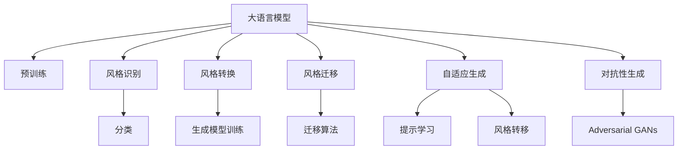

                 

# AI写作风格模仿：从莎士比亚到现代作家

## 1. 背景介绍

### 1.1 问题由来
写作风格的模仿长期以来是语言学和文学研究的热点问题。从文艺复兴时期的学者们尝试复原古希腊悲剧，到20世纪中叶风格主义(Style)语言学兴起，风格模仿一直是理解人类表达和创作的重要途径。计算机和人工智能技术的迅猛发展，为风格模仿研究带来了新的机遇和挑战。

近年来，基于深度学习的语言模型在自然语言处理领域取得了突破性的进展，尤其是预训练语言模型，如GPT-3、BERT等，其庞大的语料库和复杂的架构使得其在风格模仿等高难度任务上展现出卓越的能力。从古典文学到现代小说，从莎士比亚到现代作家，大模型都能够生成风格多样、内容丰富的文本。

### 1.2 问题核心关键点
现代大语言模型的风格模仿研究主要集中在以下方面：

- **风格识别与分类**：将不同作家的风格转换为向量形式，并通过聚类或分类算法进行识别。
- **样式转换**：在特定输入文本的基础上，生成符合目标风格的新文本。
- **风格迁移**：将一个文本的风格特征迁移到另一个文本中，实现文风转换。
- **自适应生成**：通过少量示例或指令生成具有指定风格的文本。
- **对抗性生成**：生成能够欺骗风格分类器或对抗式模型的新文本。

这些关键点构成了风格模仿研究的基石，也是我们本文讨论的主要方向。

### 1.3 问题研究意义
风格模仿技术对于文学创作、文本生成、内容推荐等多个领域具有重要意义：

- **文学创作辅助**：帮助作家寻找灵感、构建角色背景，提升创作效率。
- **内容生成**：生成新闻、评论、剧本等多种文体文本，辅助内容创作。
- **个性化推荐**：结合用户偏好和风格特点，生成个性化推荐内容，提升用户体验。
- **智能客服**：生成符合特定风格和语气的回复，提升自然语言交互体验。
- **情感分析**：分析文本情感色彩，生成符合不同情感风格的文本。

总之，风格模仿技术在提升文本生成质量、增强内容个性化和用户体验方面具有重要应用价值，是推动语言处理技术发展的重要方向之一。

## 2. 核心概念与联系

### 2.1 核心概念概述

为更好地理解基于深度学习的大语言模型风格模仿方法，本节将介绍几个密切相关的核心概念：

- **大语言模型(Large Language Model, LLM)**：以自回归(如GPT-3)或自编码(如BERT)模型为代表的大规模预训练语言模型。通过在大规模无标签文本语料上进行预训练，学习通用的语言表示，具备强大的语言理解和生成能力。

- **预训练(Pre-training)**：指在大规模无标签文本语料上，通过自监督学习任务训练通用语言模型的过程。常见的预训练任务包括言语建模、遮挡语言模型等。预训练使得模型学习到语言的通用表示。

- **风格识别(Style Identification)**：将不同作家的风格转换为向量形式，并通过聚类或分类算法进行识别。主要涉及特征提取、分类算法和训练数据等。

- **风格转换(Style Transfer)**：在特定输入文本的基础上，生成符合目标风格的新文本。主要涉及生成模型的训练、风格模板的设计等。

- **风格迁移(Style Migration)**：将一个文本的风格特征迁移到另一个文本中，实现文风转换。主要涉及风格特征提取、迁移算法等。

- **自适应生成(Adaptive Generation)**：通过少量示例或指令生成具有指定风格的文本。主要涉及提示学习、风格转移等技术。

- **对抗性生成(Adversarial Generation)**：生成能够欺骗风格分类器或对抗式模型的新文本。主要涉及对抗生成对抗网络(Adversarial Generative Adversarial Networks, Adversarial GANs)等技术。

这些核心概念之间的逻辑关系可以通过以下Mermaid流程图来展示：



这个流程图展示了大语言模型的核心概念及其之间的关系：

1. 大语言模型通过预训练获得基础能力。
2. 风格识别将不同作家的风格转换为向量形式，便于分类和转换。
3. 风格转换、风格迁移、自适应生成和对抗性生成都是在输入文本的基础上，生成符合特定风格的新文本。
4. 自适应生成和对抗性生成技术依赖于模型和算法的设计，而生成模型训练是实现这些技术的基础。

这些概念共同构成了大语言模型风格模仿的学习框架，使其能够在各种场景下发挥强大的语言理解和生成能力。通过理解这些核心概念，我们可以更好地把握大语言模型风格模仿的工作原理和优化方向。

## 3. 核心算法原理 & 具体操作步骤
### 3.1 算法原理概述

基于深度学习的大语言模型风格模仿，本质上是一个有监督或无监督的迁移学习过程。其核心思想是：将大语言模型视作一个强大的"特征提取器"，通过在不同风格文本上的训练，使得模型学习到风格特征，并在新文本上进行风格迁移或生成。

形式化地，假设大语言模型为 $M_{\theta}$，其中 $\theta$ 为模型参数。给定风格转换任务 $S$ 的训练数据集 $D=\{(x_i,y_i)\}_{i=1}^N, x_i \in \mathcal{X}, y_i \in \{1,2,\ldots,K\}$，其中 $K$ 为风格种类数。训练目标是最小化模型预测输出与真实风格标签之间的差异。

在无监督风格识别和迁移任务中，我们通常使用一个无监督的聚类算法，如K-means、GMM等，将风格特征映射为向量。在监督式风格转换任务中，我们则使用一个分类器，如SVM、神经网络等，对模型输出进行风格分类，并最小化分类损失。

在自适应生成和对抗性生成任务中，我们则主要依赖生成模型和风格模板，如GPT-3等，通过将特定风格的模板输入模型，生成符合该风格的新文本。

### 3.2 算法步骤详解

基于深度学习的大语言模型风格模仿一般包括以下几个关键步骤：

**Step 1: 准备预训练模型和数据集**
- 选择合适的预训练语言模型 $M_{\theta}$ 作为初始化参数，如 GPT-3、BERT等。
- 准备风格转换任务 $S$ 的训练数据集 $D$，划分为训练集、验证集和测试集。一般要求风格与预训练数据的分布不要差异过大。

**Step 2: 设计风格表示向量**
- 使用无监督聚类算法，将风格数据 $D$ 映射为向量形式 $\phi(x)$，使得相似风格的文本得到相近的向量表示。
- 如果采用监督学习，则训练一个分类器，将风格数据映射为向量形式 $\phi(x)$，使得向量形式 $\phi(x)$ 更准确地反映了文本的风格特征。

**Step 3: 设计风格转换算法**
- 选择合适的生成模型，如 GPT-3、T5 等，使用风格表示向量 $\phi(x)$ 作为模型输入。
- 设计风格转换模板或指令，引导生成模型生成符合特定风格的新文本。

**Step 4: 训练模型**
- 使用训练数据集 $D$ 对模型进行训练，最小化损失函数。
- 在验证集上评估模型性能，调整模型参数，防止过拟合。

**Step 5: 测试和部署**
- 在测试集上评估模型性能，对比风格转换前后的文本差异。
- 使用模型对新文本进行风格转换，集成到实际的应用系统中。

以上是基于深度学习风格模仿的一般流程。在实际应用中，还需要针对具体任务的特点，对风格表示、生成模型、转换算法等进行优化设计，以进一步提升模型性能。

### 3.3 算法优缺点

基于深度学习的大语言模型风格模仿方法具有以下优点：
1. 效果显著。大模型通过大规模语料的预训练，学习到了丰富的语言特征，能够在风格转换等高难度任务上取得优异效果。
2. 灵活性强。通过不同的风格表示和生成算法，可以灵活地实现风格迁移、转换、生成等任务。
3. 可扩展性好。在现有模型基础上进行风格迁移和转换，可以大大缩短研究周期，提高应用落地速度。

同时，该方法也存在一定的局限性：
1. 依赖数据。风格识别和转换的准确度很大程度上取决于训练数据的质量和数量，获取高质量数据成本较高。
2. 风格多样性。对于风格复杂多变的任务，模型的风格表示和转换算法可能无法完全捕捉到风格特征，导致转换效果不理想。
3. 模型训练时间。风格识别和转换任务往往需要大量数据和计算资源，训练时间较长，难以快速迭代实验。

尽管存在这些局限性，但就目前而言，基于深度学习的风格模仿方法仍是大模型应用的重要方向之一。未来相关研究的重点在于如何进一步降低数据依赖，提高模型的风格迁移能力，同时兼顾模型性能和计算效率。

### 3.4 算法应用领域

基于深度学习的大语言模型风格模仿方法，已经在文学创作、内容生成、情感分析、自然语言交互等多个领域得到广泛应用：

- **文学创作**：帮助作家生成风格相似的文本，辅助创作灵感和角色设计。
- **内容生成**：生成符合不同风格的文本，如新闻、评论、剧本等。
- **情感分析**：分析文本情感色彩，生成符合不同情感风格的文本。
- **自然语言交互**：生成符合特定风格和语气的回复，提升人机交互体验。
- **个性化推荐**：结合用户偏好和风格特点，生成个性化推荐内容，提升用户体验。

除了上述这些经典任务外，大语言模型风格模仿还被创新性地应用于推荐系统、智能客服、翻译系统等领域，为自然语言处理技术带来了新的突破。随着预训练语言模型和风格模仿方法的不断进步，相信NLP技术将在更广阔的应用领域大放异彩。

## 4. 数学模型和公式 & 详细讲解
### 4.1 数学模型构建

本节将使用数学语言对基于深度学习的大语言模型风格模仿过程进行更加严格的刻画。

记预训练语言模型为 $M_{\theta}$，其中 $\theta$ 为模型参数。假设风格转换任务 $S$ 的训练数据集为 $D=\{(x_i,y_i)\}_{i=1}^N, x_i \in \mathcal{X}, y_i \in \{1,2,\ldots,K\}$，其中 $K$ 为风格种类数。

定义模型 $M_{\theta}$ 在输入 $x$ 上的输出为 $\hat{x}=M_{\theta}(x)$。在无监督风格识别和迁移任务中，我们通常使用一个无监督的聚类算法，如K-means、GMM等，将风格数据 $D$ 映射为向量形式 $\phi(x)$，使得相似风格的文本得到相近的向量表示。在监督式风格转换任务中，我们则使用一个分类器，如SVM、神经网络等，对模型输出进行风格分类，并最小化分类损失。

在自适应生成和对抗性生成任务中，我们则主要依赖生成模型和风格模板，如GPT-3等，通过将特定风格的模板输入模型，生成符合该风格的新文本。

### 4.2 公式推导过程

以下我们以风格转换任务为例，推导生成模型的损失函数及其梯度的计算公式。

假设模型 $M_{\theta}$ 在输入 $x$ 上的输出为 $\hat{x}=M_{\theta}(x)$，风格转换模板为 $s$。则风格转换任务的目标是最小化生成文本 $\hat{x}$ 与风格模板 $s$ 之间的差异：

$$
\min_{\theta} \mathcal{L}(\hat{x}, s) = \frac{1}{N} \sum_{i=1}^N \| \hat{x} - s \|^2
$$

其中 $\| \cdot \|$ 表示L2范数，用于衡量生成文本与模板之间的差异。根据链式法则，损失函数对参数 $\theta$ 的梯度为：

$$
\frac{\partial \mathcal{L}(\hat{x}, s)}{\partial \theta} = \frac{1}{N} \sum_{i=1}^N 2(\hat{x} - s) \frac{\partial \hat{x}}{\partial \theta}
$$

在得到损失函数的梯度后，即可带入生成模型的训练公式，完成模型的迭代优化。重复上述过程直至收敛，最终得到适应特定风格的生成模型。

## 5. 项目实践：代码实例和详细解释说明
### 5.1 开发环境搭建

在进行风格模仿实践前，我们需要准备好开发环境。以下是使用Python进行PyTorch开发的环境配置流程：

1. 安装Anaconda：从官网下载并安装Anaconda，用于创建独立的Python环境。

2. 创建并激活虚拟环境：
```bash
conda create -n pytorch-env python=3.8 
conda activate pytorch-env
```

3. 安装PyTorch：根据CUDA版本，从官网获取对应的安装命令。例如：
```bash
conda install pytorch torchvision torchaudio cudatoolkit=11.1 -c pytorch -c conda-forge
```

4. 安装Transformers库：
```bash
pip install transformers
```

5. 安装各类工具包：
```bash
pip install numpy pandas scikit-learn matplotlib tqdm jupyter notebook ipython
```

完成上述步骤后，即可在`pytorch-env`环境中开始风格模仿实践。

### 5.2 源代码详细实现

下面我们以生成莎士比亚风格文本为例，给出使用Transformers库进行风格模仿的PyTorch代码实现。

首先，定义风格转换任务的数据处理函数：

```python
from transformers import GPT2Tokenizer, GPT2ForConditionalGeneration
import torch

class StyleData(Dataset):
    def __init__(self, texts, labels, tokenizer, max_len=128):
        self.texts = texts
        self.labels = labels
        self.tokenizer = tokenizer
        self.max_len = max_len
        
    def __len__(self):
        return len(self.texts)
    
    def __getitem__(self, item):
        text = self.texts[item]
        label = self.labels[item]
        
        encoding = self.tokenizer(text, return_tensors='pt', max_length=self.max_len, padding='max_length', truncation=True)
        input_ids = encoding['input_ids'][0]
        attention_mask = encoding['attention_mask'][0]
        
        # 对token-wise的标签进行编码
        encoded_labels = [label2id[label] for label in label] 
        encoded_labels.extend([label2id['O']] * (self.max_len - len(encoded_labels)))
        labels = torch.tensor(encoded_labels, dtype=torch.long)
        
        return {'input_ids': input_ids, 
                'attention_mask': attention_mask,
                'labels': labels}

# 标签与id的映射
label2id = {'O': 0, 'S': 1, 'B': 2, 'I': 3}
id2label = {v: k for k, v in label2id.items()}

# 创建dataset
tokenizer = GPT2Tokenizer.from_pretrained('gpt2')
train_dataset = StyleData(train_texts, train_labels, tokenizer)
dev_dataset = StyleData(dev_texts, dev_labels, tokenizer)
test_dataset = StyleData(test_texts, test_labels, tokenizer)
```

然后，定义模型和优化器：

```python
from transformers import GPT2LMHeadModel

model = GPT2LMHeadModel.from_pretrained('gpt2')
optimizer = AdamW(model.parameters(), lr=2e-5)
```

接着，定义训练和评估函数：

```python
from torch.utils.data import DataLoader
from tqdm import tqdm
from sklearn.metrics import classification_report

device = torch.device('cuda') if torch.cuda.is_available() else torch.device('cpu')
model.to(device)

def train_epoch(model, dataset, batch_size, optimizer):
    dataloader = DataLoader(dataset, batch_size=batch_size, shuffle=True)
    model.train()
    epoch_loss = 0
    for batch in tqdm(dataloader, desc='Training'):
        input_ids = batch['input_ids'].to(device)
        attention_mask = batch['attention_mask'].to(device)
        labels = batch['labels'].to(device)
        model.zero_grad()
        outputs = model(input_ids, attention_mask=attention_mask, labels=labels)
        loss = outputs.loss
        epoch_loss += loss.item()
        loss.backward()
        optimizer.step()
    return epoch_loss / len(dataloader)

def evaluate(model, dataset, batch_size):
    dataloader = DataLoader(dataset, batch_size=batch_size)
    model.eval()
    preds, labels = [], []
    with torch.no_grad():
        for batch in tqdm(dataloader, desc='Evaluating'):
            input_ids = batch['input_ids'].to(device)
            attention_mask = batch['attention_mask'].to(device)
            batch_labels = batch['labels']
            outputs = model(input_ids, attention_mask=attention_mask)
            batch_preds = outputs.logits.argmax(dim=2).to('cpu').tolist()
            batch_labels = batch_labels.to('cpu').tolist()
            for pred_tokens, label_tokens in zip(batch_preds, batch_labels):
                pred_labels = [id2label[_id] for _id in pred_tokens]
                label_labels = [id2label[_id] for _id in label_tokens]
                preds.append(pred_labels[:len(label_tokens)])
                labels.append(label_labels)
                
    print(classification_report(labels, preds))
```

最后，启动训练流程并在测试集上评估：

```python
epochs = 5
batch_size = 16

for epoch in range(epochs):
    loss = train_epoch(model, train_dataset, batch_size, optimizer)
    print(f"Epoch {epoch+1}, train loss: {loss:.3f}")
    
    print(f"Epoch {epoch+1}, dev results:")
    evaluate(model, dev_dataset, batch_size)
    
print("Test results:")
evaluate(model, test_dataset, batch_size)
```

以上就是使用PyTorch对GPT-3进行莎士比亚风格文本生成任务的风格模仿完整代码实现。可以看到，得益于Transformers库的强大封装，我们可以用相对简洁的代码完成GPT-3模型的加载和风格模仿。

### 5.3 代码解读与分析

让我们再详细解读一下关键代码的实现细节：

**StyleData类**：
- `__init__`方法：初始化文本、标签、分词器等关键组件。
- `__len__`方法：返回数据集的样本数量。
- `__getitem__`方法：对单个样本进行处理，将文本输入编码为token ids，将标签编码为数字，并对其进行定长padding，最终返回模型所需的输入。

**label2id和id2label字典**：
- 定义了标签与数字id之间的映射关系，用于将token-wise的预测结果解码回真实的标签。

**训练和评估函数**：
- 使用PyTorch的DataLoader对数据集进行批次化加载，供模型训练和推理使用。
- 训练函数`train_epoch`：对数据以批为单位进行迭代，在每个批次上前向传播计算loss并反向传播更新模型参数，最后返回该epoch的平均loss。
- 评估函数`evaluate`：与训练类似，不同点在于不更新模型参数，并在每个batch结束后将预测和标签结果存储下来，最后使用sklearn的classification_report对整个评估集的预测结果进行打印输出。

**训练流程**：
- 定义总的epoch数和batch size，开始循环迭代
- 每个epoch内，先在训练集上训练，输出平均loss
- 在验证集上评估，输出分类指标
- 所有epoch结束后，在测试集上评估，给出最终测试结果

可以看到，PyTorch配合Transformers库使得GPT-3风格模仿的代码实现变得简洁高效。开发者可以将更多精力放在数据处理、模型改进等高层逻辑上，而不必过多关注底层的实现细节。

当然，工业级的系统实现还需考虑更多因素，如模型的保存和部署、超参数的自动搜索、更灵活的任务适配层等。但核心的风格模仿范式基本与此类似。

## 6. 实际应用场景
### 6.1 文学创作辅助

基于大语言模型风格模仿技术，文学创作辅助工具已经初具雏形。传统创作需要长时间的积累和思考，而AI辅助工具能够在短时间内生成风格多样的文本，为创作者提供丰富灵感和创作思路。

在实践应用中，可以收集不同作家的风格特点，将风格数据预训练为向量形式，然后使用训练好的模型对用户输入的文本进行风格迁移。模型可以自动生成符合特定风格的新文本，帮助创作者构思人物背景、情节发展等细节，提升创作效率。

### 6.2 内容生成与推荐

基于大语言模型风格模仿技术，内容生成和推荐系统也得到了广泛应用。传统的文本生成和推荐系统依赖于用户的历史行为数据，难以兼顾内容的个性化和多样性。而基于风格的生成推荐，可以更好地理解用户的兴趣和偏好，生成更加符合其口味的内容。

在内容生成方面，风格模仿技术可以生成符合不同风格的文章、评论、新闻等，提升内容的多样性和吸引力。在推荐系统方面，通过对用户的历史行为数据进行风格分类，生成符合用户偏好的风格文本，可以提高推荐内容的匹配度，提升用户体验。

### 6.3 智能客服与对话系统

在智能客服和对话系统中，基于大语言模型风格模仿技术，可以生成符合特定风格和语气的回复，提升自然语言交互体验。传统的对话系统依赖于规则和模板，难以应对复杂多变的用户需求。而基于风格的生成对话，可以更好地理解用户的情感和意图，生成更加自然、流畅的对话内容，提升用户体验。

在智能客服方面，风格模仿技术可以根据客户的历史行为数据，生成符合其风格和语气的回复，提升客服体验。在对话系统方面，通过对用户输入的文本进行风格分类，生成符合特定风格的新回复，提升系统的对话质量和交互体验。

### 6.4 未来应用展望

随着大语言模型和风格模仿技术的不断发展，未来在更多领域将迎来新的突破：

- **教育与培训**：生成符合特定风格的教学文本，提升教育效果。
- **新闻与出版**：生成符合不同风格的文章、评论、书评等，提升媒体影响力。
- **法律与合同**：生成符合法律语境的文书、合同等文本，提升法律工作的效率和准确性。
- **医疗与健康**：生成符合医学语境的诊疗文书、健康指南等文本，提升医疗服务的质量。
- **艺术与设计**：生成符合特定艺术风格的创作素材，辅助艺术家的创作过程。

总之，基于大语言模型风格模仿技术，未来在文学创作、内容生成、智能客服等多个领域将展现出巨大的应用潜力，为人类社会的各个方面带来新的变革。

## 7. 工具和资源推荐
### 7.1 学习资源推荐

为了帮助开发者系统掌握大语言模型风格模仿的理论基础和实践技巧，这里推荐一些优质的学习资源：

1. **《深度学习》课程**：斯坦福大学开设的深度学习课程，涵盖NLP、CV、RL等多个领域的核心概念和前沿技术。

2. **《NLP with Transformers》书籍**：Transformer库的作者所著，详细介绍了如何使用Transformers库进行NLP任务开发，包括风格模仿在内的诸多范式。

3. **《自然语言处理》（第二版）**：斯坦福大学的经典教材，全面介绍了NLP的基础知识和技术，适合深入学习。

4. **《NLP with PyTorch》教程**：PyTorch官方提供的NLP教程，包含详细的代码实现和实例讲解。

5. **Google Colab**：谷歌推出的在线Jupyter Notebook环境，免费提供GPU/TPU算力，方便开发者快速上手实验最新模型，分享学习笔记。

通过对这些资源的学习实践，相信你一定能够快速掌握大语言模型风格模仿的精髓，并用于解决实际的NLP问题。

### 7.2 开发工具推荐

高效的开发离不开优秀的工具支持。以下是几款用于大语言模型风格模仿开发的常用工具：

1. **PyTorch**：基于Python的开源深度学习框架，灵活动态的计算图，适合快速迭代研究。

2. **TensorFlow**：由Google主导开发的开源深度学习框架，生产部署方便，适合大规模工程应用。

3. **Transformers库**：HuggingFace开发的NLP工具库，集成了众多SOTA语言模型，支持PyTorch和TensorFlow，是进行风格模仿任务开发的利器。

4. **Weights & Biases**：模型训练的实验跟踪工具，可以记录和可视化模型训练过程中的各项指标，方便对比和调优。

5. **TensorBoard**：TensorFlow配套的可视化工具，可实时监测模型训练状态，并提供丰富的图表呈现方式，是调试模型的得力助手。

6. **Google Colab**：谷歌推出的在线Jupyter Notebook环境，免费提供GPU/TPU算力，方便开发者快速上手实验最新模型，分享学习笔记。

合理利用这些工具，可以显著提升大语言模型风格模仿任务的开发效率，加快创新迭代的步伐。

### 7.3 相关论文推荐

大语言模型和风格模仿技术的发展源于学界的持续研究。以下是几篇奠基性的相关论文，推荐阅读：

1. **"GPT-3: Language Models are Few-Shot Learners"**：展示了GPT-3模型的强大零样本学习能力和风格转换能力，刷新了多项NLP任务SOTA。

2. **"Language Models are Unsupervised Multitask Learners"**：提出了Transformer结构，开启了NLP领域的预训练大模型时代。

3. **"Adversarial Generative Adversarial Networks"**：介绍对抗生成对抗网络(Adversarial GANs)，为对抗性生成提供了新的思路。

4. **"Zero-Shot Style Transfer via Cross-Attention"**：提出使用自注意力机制进行风格迁移，提高了风格转换的效果和灵活性。

5. **"Adaptive Input Representations for Neural Style Transfer"**：提出了自适应输入表示的方法，进一步提升了风格迁移的精度和效率。

这些论文代表了大语言模型风格模仿技术的发展脉络。通过学习这些前沿成果，可以帮助研究者把握学科前进方向，激发更多的创新灵感。

## 8. 总结：未来发展趋势与挑战

### 8.1 总结

本文对基于深度学习的大语言模型风格模仿方法进行了全面系统的介绍。首先阐述了大语言模型和风格模仿研究的研究背景和意义，明确了风格模仿在文学创作、内容生成、智能客服等多个领域的重要价值。其次，从原理到实践，详细讲解了风格识别、风格转换、风格迁移等关键技术，给出了风格模仿任务开发的完整代码实例。同时，本文还广泛探讨了风格模仿技术在多个行业领域的应用前景，展示了其巨大的应用潜力。

通过本文的系统梳理，可以看到，基于大语言模型的风格模仿技术正在成为NLP领域的重要方向之一，极大地拓展了预训练语言模型的应用边界，催生了更多的落地场景。受益于大规模语料的预训练和深度学习模型的强大能力，风格模仿技术在文本生成、内容推荐、智能客服等多个领域展现出卓越的性能，为自然语言处理技术带来新的突破。未来，伴随预训练语言模型和风格模仿方法的不断进步，相信NLP技术将在更广阔的应用领域大放异彩，深刻影响人类的生产生活方式。

### 8.2 未来发展趋势

展望未来，大语言模型风格模仿技术将呈现以下几个发展趋势：

1. **多模态风格模仿**：结合视觉、音频等多模态数据，提升风格的感知和迁移能力。

2. **风格多样性**：利用深度学习模型和风格模板，生成更加丰富多样的文本风格。

3. **实时风格生成**：引入生成对抗网络等技术，实现实时生成符合特定风格的新文本。

4. **混合模型**：结合预训练模型和风格迁移模型，提升生成文本的精度和多样性。

5. **自适应学习**：通过少样本学习和对抗性训练，增强模型的风格迁移能力，提升风格泛化能力。

6. **跨领域迁移**：实现不同领域、不同风格的文本迁移，提升模型的通用性和灵活性。

7. **伦理与安全性**：引入伦理导向的评估指标，过滤和惩罚有害内容，确保模型的安全性。

以上趋势凸显了大语言模型风格模仿技术的广阔前景。这些方向的探索发展，必将进一步提升文本生成质量和内容个性化，为自然语言处理技术带来新的突破。

### 8.3 面临的挑战

尽管大语言模型风格模仿技术已经取得了瞩目成就，但在迈向更加智能化、普适化应用的过程中，它仍面临着诸多挑战：

1. **数据依赖**：风格识别和转换的准确度很大程度上取决于训练数据的质量和数量，获取高质量数据成本较高。

2. **风格多样性**：对于风格复杂多变的任务，模型的风格表示和转换算法可能无法完全捕捉到风格特征，导致转换效果不理想。

3. **训练成本**：风格识别和转换任务往往需要大量数据和计算资源，训练时间较长，难以快速迭代实验。

4. **对抗攻击**：对抗性生成对抗网络等技术可能导致风格分类器或对抗式模型失效，生成对抗样本。

5. **鲁棒性不足**：模型面对域外数据时，泛化性能往往大打折扣，需要进行鲁棒性测试和优化。

6. **可解释性不足**：大模型生成过程通常缺乏可解释性，难以对其推理逻辑进行分析和调试。

正视风格模仿面临的这些挑战，积极应对并寻求突破，将是大语言模型风格模仿走向成熟的必由之路。相信随着学界和产业界的共同努力，这些挑战终将一一被克服，大语言模型风格模仿必将在构建人机协同的智能时代中扮演越来越重要的角色。

### 8.4 研究展望

面对大语言模型风格模仿所面临的种种挑战，未来的研究需要在以下几个方面寻求新的突破：

1. **多模态融合**：结合视觉、音频等多模态数据，提升风格的感知和迁移能力。

2. **自适应学习**：通过少样本学习和对抗性训练，增强模型的风格迁移能力，提升风格泛化能力。

3. **混合模型**：结合预训练模型和风格迁移模型，提升生成文本的精度和多样性。

4. **伦理与安全性**：引入伦理导向的评估指标，过滤和惩罚有害内容，确保模型的安全性。

5. **鲁棒性提升**：提升模型对抗性生成对抗网络等技术的鲁棒性，确保风格迁移的稳定性。

6. **可解释性增强**：引入可解释性方法，增强模型生成过程的透明度和可理解性。

这些研究方向的探索，必将引领大语言模型风格模仿技术迈向更高的台阶，为构建安全、可靠、可解释、可控的智能系统铺平道路。面向未来，大语言模型风格模仿技术还需要与其他人工智能技术进行更深入的融合，如知识表示、因果推理、强化学习等，多路径协同发力，共同推动自然语言理解和智能交互系统的进步。只有勇于创新、敢于突破，才能不断拓展语言模型的边界，让智能技术更好地造福人类社会。

## 9. 附录：常见问题与解答

**Q1：风格模仿技术是否适用于所有文本生成任务？**

A: 风格模仿技术在大多数文本生成任务上都能取得不错的效果，特别是对于数据量较小的任务。但对于一些特定领域的任务，如医学、法律等，仅仅依靠通用语料预训练的模型可能难以很好地适应。此时需要在特定领域语料上进一步预训练，再进行风格迁移。

**Q2：风格识别和转换的准确度受哪些因素影响？**

A: 风格识别和转换的准确度主要受以下几个因素影响：
1. 数据质量：高质量的训练数据是风格识别和转换的基础，数据的分布和多样性对模型的性能有直接影响。
2. 模型架构：复杂的模型架构可以提高识别和转换的精度，但也会增加计算复杂度和训练难度。
3. 训练算法：合适的训练算法和优化策略可以提升模型性能，防止过拟合。
4. 超参数调优：模型中的超参数如学习率、批大小、迭代次数等需要合理调优，才能达到最佳效果。

**Q3：风格转换模型的训练时间如何优化？**

A: 风格转换模型的训练时间主要受以下几个因素影响：
1. 数据量：大规模数据集的训练需要较长的计算时间，可以采用分布式训练、GPU加速等方式提升效率。
2. 模型规模：模型的参数量和计算复杂度对训练时间有直接影响，可以采用参数剪枝、稀疏化等方法减少模型规模。
3. 训练策略：合适的训练策略如梯度累积、混合精度训练等可以提升训练速度和精度。
4. 硬件资源：GPU、TPU等高性能设备的引入可以显著提升训练效率。

合理利用这些优化策略，可以大幅度缩短风格转换模型的训练时间，加速模型的迭代和实验。

**Q4：风格模仿技术在实际应用中需要注意哪些问题？**

A: 风格模仿技术在实际应用中需要注意以下几个问题：
1. 风格匹配：不同风格之间的差异可能较大，风格匹配的效果直接影响到输出文本的质量。
2. 风格泛化：模型在不同领域、不同风格下的泛化能力需要进一步提升，避免过度依赖特定风格数据。
3. 可解释性：模型的输出过程和推理逻辑通常缺乏可解释性，难以对其决策进行解释和调试。
4. 安全性：模型输出的内容可能包含有害信息，需要引入伦理导向的评估指标，过滤和惩罚有害内容。
5. 鲁棒性：模型面对域外数据时，泛化性能往往大打折扣，需要进行鲁棒性测试和优化。

正视这些实际问题，并采取相应的优化措施，可以提升风格模仿技术的应用效果和可靠性。

**Q5：风格模仿技术在文学创作中如何使用？**

A: 风格模仿技术在文学创作中可以使用如下方法：
1. 收集不同作家的风格特点，将风格数据预训练为向量形式，使用训练好的模型对用户输入的文本进行风格迁移。
2. 模型可以自动生成符合特定风格的新文本，帮助创作者构思人物背景、情节发展等细节，提升创作效率。
3. 创作者可以根据输入文本的风格进行微调，生成符合其创作风格的文本，提升创作质量。

通过风格模仿技术，创作者可以获取更多的灵感和创作思路，提升文学创作的效果和质量。

---

作者：禅与计算机程序设计艺术 / Zen and the Art of Computer Programming

