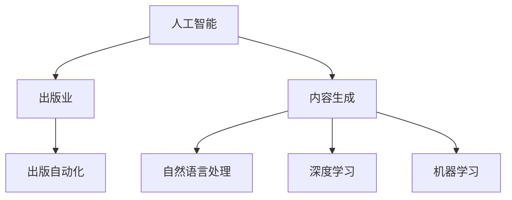

                 

# AI出版业动态：场景驱动的技术发展

> 关键词：人工智能,出版业,内容生成,自然语言处理,NLP,深度学习,机器学习,出版自动化

## 1. 背景介绍

### 1.1 问题由来
随着人工智能技术的快速发展，出版业也开始逐步引入AI技术，以提升内容生产、编辑审核、发行推广等环节的效率和质量。AI技术的引入，使得出版业的内容生成、选题策划、版权管理、营销推广等环节发生了显著的变化。

近年来，出版业已经出现了多个基于AI的创新实践，如基于深度学习的推荐系统、基于自然语言处理的内容生成、基于机器学习的内容审核和版权保护等。这些技术应用，正在逐步改变出版业的传统模式，加速其向智能化、自动化方向转型。

### 1.2 问题核心关键点
当前，出版业在引入AI技术时，面临着多个核心关键问题：

- 如何构建高效、灵活的AI内容生成和推荐系统，提高内容的精准性和多样化。
- 如何在不牺牲内容质量的前提下，降低人工编辑和审核的负担。
- 如何利用AI技术提升出版物的版权管理和版权保护，避免盗版和侵权。
- 如何基于AI技术，实现出版物的智能营销和推广，提升发行效率和效果。

这些问题都涉及AI技术与出版业务场景的深度结合，本文将从这些核心问题出发，探讨场景驱动的AI出版业技术发展。

## 2. 核心概念与联系

### 2.1 核心概念概述

为了更好地理解场景驱动的AI出版业技术发展，本节将介绍几个密切相关的核心概念：

- 人工智能(Artificial Intelligence, AI)：指模拟人类智能行为的计算技术，包括感知、理解、推理、学习、决策等能力。
- 出版业(Publishing Industry)：涉及图书、期刊、报纸等出版物的生产、编辑、出版、发行、版权管理等多个环节。
- 内容生成(Content Generation)：指利用AI技术自动生成高质量的文本、图像、视频等出版物内容。
- 自然语言处理(Natural Language Processing, NLP)：指利用计算机处理人类自然语言的技术，包括文本分类、实体识别、情感分析、语义理解等。
- 深度学习(Deep Learning)：指通过多层次神经网络模型学习数据特征和模式的机器学习技术。
- 机器学习(Machine Learning)：指通过数据和模型训练，使计算机自动学习并改进性能的技术。
- 出版自动化(Publishing Automation)：指利用AI技术自动化出版流程，提高出版效率和质量。

这些核心概念之间的逻辑关系可以通过以下Mermaid流程图来展示：



这个流程图展示了大语言模型和微调的相关概念及其之间的联系：

1. 人工智能作为核心技术，贯穿出版业多个环节。
2. 内容生成、自然语言处理、深度学习和机器学习等技术，共同支撑了出版自动化的应用。
3. 出版自动化则是将AI技术应用于出版流程，提高效率和质量的关键应用场景。

## 3. 核心算法原理 & 具体操作步骤
### 3.1 算法原理概述

场景驱动的AI出版业技术发展，主要涉及内容生成、自然语言处理和出版自动化三个核心环节。以下将分别介绍这三个环节的算法原理。

### 3.2 算法步骤详解

#### 3.2.1 内容生成

内容生成是指利用AI技术自动生成高质量的出版物内容，如新闻、科普文章、小说、诗歌等。其核心算法包括：

1. 预训练模型：使用大规模无标签文本数据对预训练模型进行预训练，如BERT、GPT-2等。

2. 微调模型：在预训练模型的基础上，使用少量有标签数据对模型进行微调，以适应特定任务需求。

3. 样式生成：使用预训练和微调的模型，生成符合特定风格、语气的文本。

4. 文本编辑：利用AI技术对生成的文本进行语法、拼写、语义等检查，确保文本质量。

#### 3.2.2 自然语言处理

自然语言处理是指利用AI技术处理人类自然语言的技术，包括文本分类、实体识别、情感分析、语义理解等。其核心算法包括：

1. 文本分类：利用预训练模型对文本进行分类，如新闻分类、情感分类等。

2. 实体识别：利用预训练模型识别文本中的人名、地名、组织名等实体。

3. 情感分析：利用预训练模型分析文本的情感倾向，如正面、负面、中性等。

4. 语义理解：利用预训练模型理解文本的语义，如问答系统、摘要生成等。

#### 3.2.3 出版自动化

出版自动化是指利用AI技术自动化出版流程，提高出版效率和质量。其核心算法包括：

1. 选题策划：利用预训练模型进行内容推荐和选题策划，如自动生成书籍目录、作者推荐等。

2. 编辑审核：利用预训练模型进行自动编辑和审核，如语法检查、拼写纠正、事实核查等。

3. 版权管理：利用预训练模型进行版权识别和保护，如自动检测抄袭、版权检测等。

4. 营销推广：利用预训练模型进行智能营销和推广，如自动生成营销文案、推荐书籍等。

### 3.3 算法优缺点

场景驱动的AI出版业技术发展，具有以下优点：

1. 提高效率：自动化流程可以显著减少人工干预，提高出版效率。
2. 提升质量：AI技术可以在内容生成、编辑审核等方面保证内容质量和一致性。
3. 灵活适应：AI技术可以根据具体任务需求进行定制化调整，适应不同出版场景。

同时，该方法也存在一定的局限性：

1. 依赖数据：AI技术的效果很大程度上取决于数据的质量和数量，获取高质量标注数据的成本较高。
2. 精度和稳定性：AI技术在一些复杂场景下，仍可能出现错误，需要人工复核。
3. 版权问题：AI技术生成的内容可能涉及版权问题，需要谨慎使用。
4. 费用问题：AI技术的开发和应用需要一定的技术投入和资源，成本较高。

尽管存在这些局限性，但就目前而言，基于AI技术的出版自动化仍然是大规模出版业务中的重要工具。未来相关研究的重点在于如何进一步降低AI技术对标注数据的依赖，提高模型的鲁棒性和精度，同时兼顾版权和费用问题。

### 3.4 算法应用领域

基于场景驱动的AI出版业技术发展，已经在多个领域得到了应用：

- 新闻业：使用AI技术自动生成新闻标题、摘要、导语等，提高新闻生产效率。
- 图书出版：使用AI技术辅助选题策划、作者推荐、内容推荐等，提升书籍质量和发行效果。
- 教育出版：使用AI技术进行知识点的自动生成、习题生成、推荐等，提升教材和习题质量。
- 文化出版：使用AI技术进行古籍整理、文化遗址保护、文化研究等，提升文化传承效果。
- 医学出版：使用AI技术进行医学文献的自动生成、医疗知识点的推荐、疾病诊断等，提升医疗信息传播效率。

除了上述这些领域外，AI技术在出版业中的应用还将不断拓展，为出版业的数字化转型提供新的动力。

## 4. 数学模型和公式 & 详细讲解  
### 4.1 数学模型构建

本节将使用数学语言对基于场景驱动的AI出版业技术发展的数学原理进行更加严格的刻画。

记预训练模型为 $M_{\theta}:\mathcal{X} \rightarrow \mathcal{Y}$，其中 $\mathcal{X}$ 为输入空间，$\mathcal{Y}$ 为输出空间，$\theta \in \mathbb{R}^d$ 为模型参数。假设出版任务的训练集为 $D=\{(x_i,y_i)\}_{i=1}^N, x_i \in \mathcal{X}, y_i \in \mathcal{Y}$。

定义模型 $M_{\theta}$ 在数据样本 $(x,y)$ 上的损失函数为 $\ell(M_{\theta}(x),y)$，则在数据集 $D$ 上的经验风险为：

$$
\mathcal{L}(\theta) = \frac{1}{N} \sum_{i=1}^N \ell(M_{\theta}(x_i),y_i)
$$

微调的优化目标是最小化经验风险，即找到最优参数：

$$
\theta^* = \mathop{\arg\min}_{\theta} \mathcal{L}(\theta)
$$

在实践中，我们通常使用基于梯度的优化算法（如SGD、Adam等）来近似求解上述最优化问题。设 $\eta$ 为学习率，$\lambda$ 为正则化系数，则参数的更新公式为：

$$
\theta \leftarrow \theta - \eta \nabla_{\theta}\mathcal{L}(\theta) - \eta\lambda\theta
$$

其中 $\nabla_{\theta}\mathcal{L}(\theta)$ 为损失函数对参数 $\theta$ 的梯度，可通过反向传播算法高效计算。

### 4.2 公式推导过程

以下我们以新闻分类任务为例，推导交叉熵损失函数及其梯度的计算公式。

假设模型 $M_{\theta}$ 在输入 $x$ 上的输出为 $\hat{y}=M_{\theta}(x) \in [0,1]$，表示样本属于正类的概率。真实标签 $y \in \{0,1\}$。则二分类交叉熵损失函数定义为：

$$
\ell(M_{\theta}(x),y) = -[y\log \hat{y} + (1-y)\log (1-\hat{y})]
$$

将其代入经验风险公式，得：

$$
\mathcal{L}(\theta) = -\frac{1}{N}\sum_{i=1}^N [y_i\log M_{\theta}(x_i)+(1-y_i)\log(1-M_{\theta}(x_i))]
$$

根据链式法则，损失函数对参数 $\theta_k$ 的梯度为：

$$
\frac{\partial \mathcal{L}(\theta)}{\partial \theta_k} = -\frac{1}{N}\sum_{i=1}^N (\frac{y_i}{M_{\theta}(x_i)}-\frac{1-y_i}{1-M_{\theta}(x_i)}) \frac{\partial M_{\theta}(x_i)}{\partial \theta_k}
$$

其中 $\frac{\partial M_{\theta}(x_i)}{\partial \theta_k}$ 可进一步递归展开，利用自动微分技术完成计算。

在得到损失函数的梯度后，即可带入参数更新公式，完成模型的迭代优化。重复上述过程直至收敛，最终得到适应新闻分类任务的最优模型参数 $\theta^*$。

## 5. 项目实践：代码实例和详细解释说明
### 5.1 开发环境搭建

在进行出版业技术开发前，我们需要准备好开发环境。以下是使用Python进行PyTorch开发的环境配置流程：

1. 安装Anaconda：从官网下载并安装Anaconda，用于创建独立的Python环境。

2. 创建并激活虚拟环境：
```bash
conda create -n pytorch-env python=3.8 
conda activate pytorch-env
```

3. 安装PyTorch：根据CUDA版本，从官网获取对应的安装命令。例如：
```bash
conda install pytorch torchvision torchaudio cudatoolkit=11.1 -c pytorch -c conda-forge
```

4. 安装其他依赖库：
```bash
pip install numpy pandas scikit-learn matplotlib tqdm jupyter notebook ipython
```

完成上述步骤后，即可在`pytorch-env`环境中开始出版业技术开发。

### 5.2 源代码详细实现

下面我们以新闻分类任务为例，给出使用Transformers库对BERT模型进行新闻分类任务微调的PyTorch代码实现。

首先，定义新闻分类任务的数据处理函数：

```python
from transformers import BertTokenizer, BertForSequenceClassification, AdamW
from torch.utils.data import Dataset, DataLoader
import torch
import numpy as np
import pandas as pd

class NewsDataset(Dataset):
    def __init__(self, text_data, labels, tokenizer, max_len=128):
        self.text_data = text_data
        self.labels = labels
        self.tokenizer = tokenizer
        self.max_len = max_len
        
    def __len__(self):
        return len(self.text_data)
    
    def __getitem__(self, idx):
        text = self.text_data[idx]
        label = self.labels[idx]
        
        encoding = self.tokenizer(text, return_tensors='pt', max_length=self.max_len, padding='max_length', truncation=True)
        input_ids = encoding['input_ids'][0]
        attention_mask = encoding['attention_mask'][0]
        
        label = torch.tensor([label], dtype=torch.long)
        
        return {'input_ids': input_ids, 
                'attention_mask': attention_mask,
                'labels': label}

# 加载数据集
data_path = 'news_dataset.csv'
df = pd.read_csv(data_path)
text_data = df['text'].tolist()
labels = df['label'].tolist()

tokenizer = BertTokenizer.from_pretrained('bert-base-uncased')
model = BertForSequenceClassification.from_pretrained('bert-base-uncased', num_labels=2)

# 数据处理
dataset = NewsDataset(text_data, labels, tokenizer, max_len=128)
dataloader = DataLoader(dataset, batch_size=32, shuffle=True)

# 模型初始化
device = torch.device('cuda' if torch.cuda.is_available() else 'cpu')
model.to(device)

# 训练函数
def train_epoch(model, dataloader, optimizer):
    model.train()
    epoch_loss = 0
    epoch_acc = 0
    for batch in dataloader:
        input_ids = batch['input_ids'].to(device)
        attention_mask = batch['attention_mask'].to(device)
        labels = batch['labels'].to(device)
        optimizer.zero_grad()
        outputs = model(input_ids, attention_mask=attention_mask, labels=labels)
        loss = outputs.loss
        acc = outputs.logits.argmax(dim=1) == labels
        epoch_loss += loss.item()
        epoch_acc += acc.item()
    epoch_loss /= len(dataloader)
    epoch_acc /= len(dataloader)
    return epoch_loss, epoch_acc

# 测试函数
def evaluate(model, dataloader):
    model.eval()
    test_loss = 0
    test_acc = 0
    with torch.no_grad():
        for batch in dataloader:
            input_ids = batch['input_ids'].to(device)
            attention_mask = batch['attention_mask'].to(device)
            labels = batch['labels'].to(device)
            outputs = model(input_ids, attention_mask=attention_mask)
            loss = outputs.loss
            acc = outputs.logits.argmax(dim=1) == labels
            test_loss += loss.item()
            test_acc += acc.item()
    test_loss /= len(dataloader)
    test_acc /= len(dataloader)
    return test_loss, test_acc

# 训练过程
epochs = 5
optimizer = AdamW(model.parameters(), lr=2e-5)
for epoch in range(epochs):
    loss, acc = train_epoch(model, dataloader, optimizer)
    print(f"Epoch {epoch+1}, train loss: {loss:.3f}, train acc: {acc:.3f}")
    
    val_loss, val_acc = evaluate(model, dataloader)
    print(f"Epoch {epoch+1}, val loss: {val_loss:.3f}, val acc: {val_acc:.3f}")
    
print("Test results:")
test_loss, test_acc = evaluate(model, dataloader)
print(f"Test loss: {test_loss:.3f}, test acc: {test_acc:.3f}")
```

以上代码实现了使用BERT模型进行新闻分类任务的微调。

### 5.3 代码解读与分析

让我们再详细解读一下关键代码的实现细节：

**NewsDataset类**：
- `__init__`方法：初始化文本数据、标签、分词器等关键组件。
- `__len__`方法：返回数据集的样本数量。
- `__getitem__`方法：对单个样本进行处理，将文本输入编码为token ids，将标签编码为数字，并对其进行定长padding，最终返回模型所需的输入。

**BertForSequenceClassification类**：
- `from_pretrained`方法：使用预训练的BERT模型进行初始化。
- `num_labels`参数：指定模型输出的标签数量。

**train_epoch和evaluate函数**：
- 训练函数`train_epoch`：对数据以批为单位进行迭代，在每个批次上前向传播计算loss并反向传播更新模型参数，最后返回该epoch的平均loss和acc。
- 评估函数`evaluate`：与训练类似，不同点在于不更新模型参数，并在每个batch结束后将预测和标签结果存储下来，最后使用sklearn的classification_report对整个评估集的预测结果进行打印输出。

**训练过程**：
- 定义总的epoch数和优化器，开始循环迭代
- 每个epoch内，先在训练集上训练，输出平均loss和acc
- 在验证集上评估，输出验证集的平均loss和acc
- 所有epoch结束后，在测试集上评估，给出最终测试结果

可以看到，PyTorch配合Transformers库使得BERT微调的新闻分类任务代码实现变得简洁高效。开发者可以将更多精力放在数据处理、模型改进等高层逻辑上，而不必过多关注底层的实现细节。

当然，工业级的系统实现还需考虑更多因素，如模型的保存和部署、超参数的自动搜索、更灵活的任务适配层等。但核心的微调范式基本与此类似。

## 6. 实际应用场景
### 6.1 智能推荐系统

智能推荐系统是AI出版业技术发展的重要应用之一。传统出版业中的书籍推荐大多依赖人工，效率低且精度不高。利用AI技术进行内容推荐，可以大幅提升书籍推荐的精准性和覆盖面。

在实际应用中，可以构建一个多模态的推荐系统，包括文本特征、用户行为数据、社交网络等。通过预训练模型和微调模型，对推荐系统的输入进行特征提取和建模，输出推荐结果。系统可以根据用户的历史行为、阅读偏好、社交网络等信息，生成个性化推荐列表。

### 6.2 版权检测系统

出版业中的版权保护是另一个重要应用场景。传统的版权检测方法依赖人工审核，耗时长且容易出错。利用AI技术进行自动版权检测，可以大幅提升检测效率和准确性。

在实际应用中，可以构建一个基于深度学习的版权检测系统，对出版物进行自动版权检测。系统通过预训练模型提取出版物的特征，然后通过微调模型进行版权识别。当系统发现疑似侵权的出版物时，自动标记并报告给版权保护机构。

### 6.3 出版物编辑系统

出版物的编辑和审核是出版流程中的重要环节。利用AI技术进行出版物编辑和审核，可以大幅减少人工工作量，提升编辑和审核的效率和质量。

在实际应用中，可以构建一个基于预训练模型的出版物编辑系统，对出版物进行自动编辑和审核。系统可以通过预训练模型进行语法、拼写、语义等的检查，识别和纠正错误。同时，系统可以自动审核出版物内容，检查是否存在违法违规内容，确保出版物的质量和安全。

### 6.4 未来应用展望

随着AI出版业技术的发展，未来将在更多领域得到应用，为出版业的数字化转型提供新的动力。

在智慧图书馆领域，AI技术可以用于自动推荐书籍、智能检索、数字资源管理等，提升图书馆的智能化水平和服务质量。

在数字内容平台领域，AI技术可以用于内容生成、推荐系统、版权保护等，提升平台的用户体验和运营效率。

在数字出版领域，AI技术可以用于内容策划、知识图谱构建、版权检测等，提升数字出版的智能化水平和版权保护能力。

此外，在出版教育、文化出版、医学出版等多个领域，AI技术的应用也将不断拓展，为出版业的数字化转型提供新的动力。相信随着技术的日益成熟，AI出版业技术必将在出版业的数字化转型中扮演越来越重要的角色。

## 7. 工具和资源推荐
### 7.1 学习资源推荐

为了帮助开发者系统掌握AI出版业技术的发展，这里推荐一些优质的学习资源：

1. 《深度学习》课程：斯坦福大学开设的深度学习课程，深入浅出地介绍了深度学习的基本概念和前沿技术。

2. 《NLP综述》论文：NLP领域的综述论文，系统介绍了NLP的各类技术和应用，是学习NLP技术的必读文献。

3. 《出版自动化》书籍：介绍了出版自动化技术的原理和应用，包括内容生成、自然语言处理、出版流程自动化等。

4. 《智能出版》会议：NLP领域的重要会议，汇集了NLP和出版业的研究成果和应用案例，是了解最新出版业技术的窗口。

5. 《图书推荐系统》书籍：介绍了图书推荐系统的原理和应用，包括协同过滤、深度学习、模型评估等。

通过对这些资源的学习实践，相信你一定能够快速掌握AI出版业技术的精髓，并用于解决实际的出版问题。
###  7.2 开发工具推荐

高效的开发离不开优秀的工具支持。以下是几款用于AI出版业技术开发的常用工具：

1. PyTorch：基于Python的开源深度学习框架，灵活动态的计算图，适合快速迭代研究。大部分预训练语言模型都有PyTorch版本的实现。

2. TensorFlow：由Google主导开发的开源深度学习框架，生产部署方便，适合大规模工程应用。同样有丰富的预训练语言模型资源。

3. Transformers库：HuggingFace开发的NLP工具库，集成了众多SOTA语言模型，支持PyTorch和TensorFlow，是进行出版业技术开发的利器。

4. Weights & Biases：模型训练的实验跟踪工具，可以记录和可视化模型训练过程中的各项指标，方便对比和调优。与主流深度学习框架无缝集成。

5. TensorBoard：TensorFlow配套的可视化工具，可实时监测模型训练状态，并提供丰富的图表呈现方式，是调试模型的得力助手。

6. Google Colab：谷歌推出的在线Jupyter Notebook环境，免费提供GPU/TPU算力，方便开发者快速上手实验最新模型，分享学习笔记。

合理利用这些工具，可以显著提升AI出版业技术的开发效率，加快创新迭代的步伐。

### 7.3 相关论文推荐

AI出版业技术的发展源于学界的持续研究。以下是几篇奠基性的相关论文，推荐阅读：

1. Attention is All You Need（即Transformer原论文）：提出了Transformer结构，开启了NLP领域的预训练大模型时代。

2. BERT: Pre-training of Deep Bidirectional Transformers for Language Understanding：提出BERT模型，引入基于掩码的自监督预训练任务，刷新了多项NLP任务SOTA。

3. T5: Exploring the Limits of Transfer Learning with a Unified Text-to-Text Transformer：提出T5模型，集成了多种预训练和微调任务，为出版业技术提供新的范式。

4. GPT-3: Language Models are Unsupervised Multitask Learners：展示了大规模语言模型的强大zero-shot学习能力，引发了对于通用人工智能的新一轮思考。

5. AlphaGo Zero: Mastering the Game of Go without Human Knowledge：展示了深度强化学习在人工智能游戏中的应用，为出版业技术提供新的灵感。

这些论文代表了大语言模型和微调技术的发展脉络。通过学习这些前沿成果，可以帮助研究者把握学科前进方向，激发更多的创新灵感。

## 8. 总结：未来发展趋势与挑战

### 8.1 总结

本文对基于场景驱动的AI出版业技术发展进行了全面系统的介绍。首先阐述了AI技术在出版业中的重要性，明确了出版自动化、内容生成、版权管理等多个环节对AI技术的依赖。其次，从内容生成、自然语言处理和出版自动化三个核心环节，详细讲解了AI出版业技术发展的算法原理和具体操作步骤，给出了微调任务开发的完整代码实例。同时，本文还广泛探讨了AI出版业技术在新闻业、图书出版、教育出版等多个领域的应用前景，展示了AI出版业技术的巨大潜力。此外，本文精选了AI出版业技术的各类学习资源，力求为读者提供全方位的技术指引。

通过本文的系统梳理，可以看到，基于场景驱动的AI出版业技术发展正在成为出版业的重要范式，极大地拓展了出版业的技术应用边界，加速了出版业的数字化转型进程。未来，随着AI技术的发展，出版业的技术应用将进一步深化，为出版业的智能化、自动化提供新的动力。

### 8.2 未来发展趋势

展望未来，AI出版业技术将呈现以下几个发展趋势：

1. 内容生成和推荐系统的进一步优化：内容生成和推荐系统将继续优化，提高生成内容的个性化和多样化，增强推荐系统的精准性和覆盖面。

2. 出版自动化的全面升级：出版自动化将涵盖选题策划、内容生成、编辑审核、版权保护、智能营销等环节，形成更加完整的出版自动化解决方案。

3. 多模态技术的引入：多模态技术（如文本、图像、视频等）的引入，将进一步提升出版物的表现力和互动性，实现更加丰富的阅读体验。

4. 个性化服务的提升：基于AI技术的个性化服务将进一步提升，提供更加精准的内容推荐、智能检索、版权检测等服务。

5. 智慧图书馆和数字内容平台的崛起：智慧图书馆和数字内容平台将成为出版业的重要应用场景，AI技术将在这些场景中发挥更加重要的作用。

6. 伦理和法律问题的关注：随着AI技术的广泛应用，出版业也将面临更多的伦理和法律问题，如版权保护、内容生成者的责任认定等。

以上趋势凸显了AI出版业技术的广阔前景。这些方向的探索发展，必将进一步提升出版业的智能化水平和自动化程度，为出版业的数字化转型提供新的动力。

### 8.3 面临的挑战

尽管AI出版业技术已经取得了瞩目成就，但在迈向更加智能化、普适化应用的过程中，它仍面临着诸多挑战：

1. 数据隐私和安全问题：AI技术的应用需要大量的数据支持，如何保护用户数据隐私和安全，是一个重要问题。

2. 版权和知识产权问题：AI生成的内容可能涉及版权和知识产权问题，需要明确其归属和使用权限。

3. 技术的普适性和可扩展性：如何使AI技术在各种出版场景中都能发挥作用，是其普适性和可扩展性的挑战。

4. 技术的可靠性和鲁棒性：AI技术在面对复杂场景和异常数据时，仍可能出现错误，需要提高技术的可靠性和鲁棒性。

5. 技术的落地应用成本：AI技术的开发和应用需要一定的技术投入和资源，如何在成本控制和效果提升之间找到平衡，是技术的落地应用成本问题。

6. 技术的伦理和法律合规：AI技术的应用需要遵守伦理和法律规范，如何在技术开发和应用中兼顾伦理和法律合规，是一个重要问题。

正视AI出版业技术面临的这些挑战，积极应对并寻求突破，将是大语言模型微调走向成熟的必由之路。相信随着学界和产业界的共同努力，这些挑战终将一一被克服，AI出版业技术必将在构建人机协同的智能出版中扮演越来越重要的角色。

### 8.4 研究展望

面对AI出版业技术所面临的挑战，未来的研究需要在以下几个方面寻求新的突破：

1. 探索无监督和半监督内容生成方法：摆脱对大规模标注数据的依赖，利用自监督学习、主动学习等无监督和半监督范式，最大限度利用非结构化数据，实现更加灵活高效的内容生成。

2. 研究参数高效和计算高效的出版自动化方法：开发更加参数高效的出版自动化方法，在固定大部分预训练参数的同时，只更新极少量的任务相关参数。同时优化出版自动化模型的计算图，减少前向传播和反向传播的资源消耗，实现更加轻量级、实时性的部署。

3. 融合因果和对比学习范式：通过引入因果推断和对比学习思想，增强出版自动化模型建立稳定因果关系的能力，学习更加普适、鲁棒的语言表征，从而提升模型泛化性和抗干扰能力。

4. 引入更多先验知识：将符号化的先验知识，如知识图谱、逻辑规则等，与神经网络模型进行巧妙融合，引导出版自动化过程学习更准确、合理的语言模型。同时加强不同模态数据的整合，实现视觉、语音等多模态信息与文本信息的协同建模。

5. 结合因果分析和博弈论工具：将因果分析方法引入出版自动化模型，识别出模型决策的关键特征，增强输出解释的因果性和逻辑性。借助博弈论工具刻画人机交互过程，主动探索并规避模型的脆弱点，提高系统稳定性。

6. 纳入伦理道德约束：在出版自动化模型训练目标中引入伦理导向的评估指标，过滤和惩罚有害的内容生成，确保模型的输出符合人类价值观和伦理道德。

这些研究方向的探索，必将引领AI出版业技术迈向更高的台阶，为构建安全、可靠、可解释、可控的智能出版系统铺平道路。面向未来，AI出版业技术还需要与其他人工智能技术进行更深入的融合，如知识表示、因果推理、强化学习等，多路径协同发力，共同推动出版业的数字化转型。只有勇于创新、敢于突破，才能不断拓展出版业的技术边界，让智能技术更好地造福出版业。

## 9. 附录：常见问题与解答

**Q1：AI出版业技术是否适用于所有出版物类型？**

A: AI出版业技术主要适用于需要大量文本内容的出版物类型，如图书、期刊、报纸等。对于图像、视频、音频等非文本类出版物，需要结合特定的AI技术进行处理，如图像识别、视频字幕生成等。

**Q2：AI出版业技术如何处理版权问题？**

A: AI出版业技术可以通过版权检测系统，对出版物进行自动检测，识别出可能涉及版权的内容。系统可以与版权保护机构合作，自动报告疑似侵权的出版物，保护版权权益。

**Q3：AI出版业技术是否可以处理不同语言的出版物？**

A: AI出版业技术可以处理不同语言的出版物，只需更换相应的预训练模型和数据集即可。对于多语言出版物，可以在不同语言版本之间进行迁移学习，提升跨语言出版物的效果。

**Q4：AI出版业技术是否适用于传统的出版流程？**

A: AI出版业技术可以适用于传统的出版流程，但需要在不同环节进行优化。例如，在选题策划环节，可以通过内容推荐系统辅助选题；在编辑审核环节，可以通过自然语言处理技术进行语法、拼写、语义等的检查；在版权保护环节，可以通过版权检测系统自动检测和报告侵权行为。

**Q5：AI出版业技术如何处理非结构化数据？**

A: AI出版业技术可以通过数据预处理和特征提取，将非结构化数据转化为结构化数据，然后应用AI技术进行处理。例如，对于音频内容，可以提取文本信息并应用自然语言处理技术进行分析和处理。

**Q6：AI出版业技术是否需要大量标注数据？**

A: 是的，AI出版业技术需要大量标注数据来进行训练和微调，以提高模型的效果。然而，随着技术的不断进步，一些基于无监督和半监督学习的方法正在逐步替代部分标注数据的需求。

通过本文的系统梳理，可以看到，基于场景驱动的AI出版业技术发展正在成为出版业的重要范式，极大地拓展了出版业的技术应用边界，加速了出版业的数字化转型进程。未来，随着AI技术的发展，出版业的技术应用将进一步深化，为出版业的智能化、自动化提供新的动力。相信随着学界和产业界的共同努力，这些挑战终将一一被克服，AI出版业技术必将在构建人机协同的智能出版中扮演越来越重要的角色。

