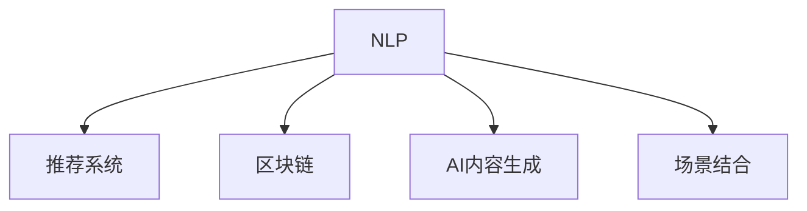

                 

# AI出版业的机遇：数据，算法与场景之结合

> 关键词：出版业, AI, 数据, 算法, 场景结合

## 1. 背景介绍

在数字化时代，信息传播的门槛不断降低，出版业面临新的机遇与挑战。随着互联网和社交媒体的普及，内容创作和消费的形式也在快速演变。在这种背景下，传统出版业如何利用先进的人工智能技术，实现智能化转型，已成为亟待解决的重要课题。

### 1.1 问题由来

传统出版业主要依赖印刷和分发进行内容传播。然而，随着数字化浪潮的冲击，出版业的运营模式和盈利模式正在发生深刻变革。数字出版的兴起，使得内容的分发和消费更加便捷高效，但同时也带来了版权保护、内容精准分发、个性化推荐等新问题。如何通过智能化手段，提升内容质量和传播效率，成为出版业亟需解决的问题。

### 1.2 问题核心关键点

1. **内容质量提升**：出版业的核心在于内容的质量和吸引力。利用AI技术，如自然语言处理(NLP)、图像识别、情感分析等，可以对内容进行智能化加工，提升文章的阅读体验和价值。

2. **内容精准分发**：借助推荐系统，根据用户的阅读偏好，自动推荐相关内容，提升用户留存率和阅读效率。

3. **版权保护**：利用区块链和AI技术，实现内容版权的自动检测和保护，防止盗版和侵权行为。

4. **场景适配**：结合用户的使用场景，如手机、平板、电子书等设备，实现内容的多平台适配和优化。

## 2. 核心概念与联系

### 2.1 核心概念概述

为了更好地理解AI在出版业的应用，本节将介绍几个关键的概念：

- **自然语言处理(Natural Language Processing, NLP)**：一种结合语言学、计算机科学和人工智能的交叉学科，致力于让计算机理解、解释和生成人类语言。NLP在出版业中的应用包括文本分析、情感分析、内容生成等。

- **推荐系统(Recommender System)**：根据用户的行为和历史数据，自动为用户推荐感兴趣的物品或内容。推荐系统在出版业中用于个性化内容推荐，提升用户阅读体验。

- **区块链(Blockchain)**：一种分布式账本技术，能够保障数据的不可篡改性和透明性。出版业可以利用区块链技术，保护版权，确保内容的真实性和完整性。

- **AI内容生成(AI Content Generation)**：通过训练AI模型，自动生成高质量的文章、广告、故事等，提升内容的产出效率和多样性。

- **场景结合(Scenario Integration)**：结合用户的使用场景和设备特性，提供定制化的内容展示和阅读体验，提升用户满意度。

这些核心概念之间的逻辑关系可以通过以下Mermaid流程图来展示：



这个流程图展示了大语言模型的核心概念及其之间的关系：

1. NLP为出版业提供了内容理解和生成的能力。
2. 推荐系统能够根据用户行为推荐合适的内容，提升阅读体验。
3. 区块链技术用于版权保护和内容真实性验证。
4. AI内容生成可以提高内容产出效率和多样性。
5. 场景结合确保内容在不同平台上的适配和优化。

## 3. 核心算法原理 & 具体操作步骤

### 3.1 算法原理概述

AI在出版业的应用，本质上是数据驱动的智能化决策过程。其核心算法包括自然语言处理、推荐系统、版权保护等技术。

- **自然语言处理**：利用NLP技术，对文章进行情感分析、主题提取、实体识别等处理，提升内容的可读性和理解性。
- **推荐系统**：根据用户的行为数据，建立用户画像，利用协同过滤、内容推荐等算法，推荐用户感兴趣的内容。
- **版权保护**：通过区块链技术，对内容进行加密存储和验证，确保版权归属和内容的完整性。
- **AI内容生成**：利用预训练的语言模型，自动生成文章、广告、故事等，提高内容的产出效率。
- **场景结合**：根据用户的使用场景，调整内容的格式和展示方式，提升阅读体验。

### 3.2 算法步骤详解

基于AI的出版业智能化转型，主要包括以下几个关键步骤：

**Step 1: 数据采集与预处理**
- 收集和整理出版业相关的数据，如用户阅读数据、文章质量数据、版权信息等。
- 对数据进行清洗、标注、归一化等预处理，确保数据质量。

**Step 2: 模型训练与优化**
- 利用NLP技术，训练情感分析、主题提取、实体识别等模型。
- 利用推荐系统算法，训练协同过滤、内容推荐等模型。
- 利用区块链技术，实现内容加密和验证。
- 利用预训练的语言模型，进行内容生成和优化。

**Step 3: 模型部署与运行**
- 将训练好的模型部署到实际应用场景中，如出版平台、电子书阅读器等。
- 监控模型的运行状态和性能指标，根据反馈进行模型调整和优化。

**Step 4: 数据与场景结合**
- 根据用户的使用场景，调整内容的格式和展示方式，确保内容适配性。
- 结合用户的行为数据，进行个性化推荐，提升用户体验。

### 3.3 算法优缺点

利用AI技术进行出版业智能化转型的主要优点包括：

- **提升内容质量**：NLP技术可以提升内容的可读性和理解性，自动生成的内容也能保持高质量。
- **个性化推荐**：推荐系统能够根据用户行为，推荐合适的内容，提升用户留存率。
- **版权保护**：区块链技术能够保障内容的真实性和完整性，防止盗版和侵权。
- **高效率产出**：AI内容生成能够大幅提升内容的产出效率，减少人力投入。

然而，这种范式也存在一些局限性：

- **数据依赖**：模型的性能很大程度上取决于数据的质量和多样性，获取高质量数据的成本较高。
- **模型复杂性**：构建高质量的推荐系统和内容生成模型，需要复杂的算法和大量的数据。
- **隐私问题**：利用用户行为数据进行推荐，可能引发隐私和数据安全问题。
- **技术门槛**：构建和维护AI系统的技术门槛较高，需要专门的技术团队和资源支持。

## 4. 数学模型和公式 & 详细讲解 & 举例说明

### 4.1 数学模型构建

在出版业智能化转型的过程中，涉及的数学模型主要集中在推荐系统和内容生成的算法中。以下以协同过滤算法为例，介绍推荐系统的数学模型构建。

假设用户集合为 $U$，物品集合为 $I$，用户对物品的评分矩阵为 $R$，其中 $R_{ui}$ 表示用户 $u$ 对物品 $i$ 的评分。协同过滤的目标是根据用户 $u$ 的评分历史，预测其对物品 $i$ 的评分。

协同过滤算法的数学模型可以表示为：

$$
\hat{R}_{ui} = \alpha \sum_{j \in N(u)}\frac{R_{uj}}{\sqrt{\sum_{k \in N(u)}R_{uk}^2}} \frac{R_{ik}}{\sqrt{\sum_{k \in N(i)}R_{ik}^2}} + \beta R_{iu} + \gamma
$$

其中，$\alpha, \beta, \gamma$ 为模型参数，$N(u)$ 表示与用户 $u$ 相似的用户集合，$N(i)$ 表示与物品 $i$ 相似的物品集合。

### 4.2 公式推导过程

协同过滤算法的核心在于寻找与目标用户和物品相似的其他用户和物品，利用它们的评分进行预测。其推导过程主要包括以下步骤：

1. 寻找与目标用户 $u$ 相似的用户集合 $N(u)$。
2. 寻找与目标物品 $i$ 相似的物品集合 $N(i)$。
3. 利用相似用户的评分，预测目标用户对目标物品的评分。

在实际应用中，上述公式可以通过矩阵分解、梯度下降等方法进行求解。

### 4.3 案例分析与讲解

以电子书阅读平台为例，介绍协同过滤算法在个性化推荐中的应用。

假设电子书阅读平台有 $M$ 本电子书，每个用户可以对其评分。平台希望根据用户的历史评分，预测其对其他书籍的评分，从而进行个性化推荐。

1. **数据采集**：收集用户对每本电子书的历史评分数据，形成评分矩阵 $R$。
2. **模型训练**：利用协同过滤算法，训练推荐模型。
3. **模型评估**：在验证集上评估模型性能，根据评估结果调整模型参数。
4. **模型部署**：将训练好的模型部署到推荐系统，实时生成个性化推荐列表。

通过这种方式，平台能够提升用户的阅读体验，增加用户留存率。

## 5. 项目实践：代码实例和详细解释说明

### 5.1 开发环境搭建

在进行出版业智能化转型的实践前，我们需要准备好开发环境。以下是使用Python进行TensorFlow开发的环境配置流程：

1. 安装Anaconda：从官网下载并安装Anaconda，用于创建独立的Python环境。

2. 创建并激活虚拟环境：
```bash
conda create -n tensorflow-env python=3.8 
conda activate tensorflow-env
```

3. 安装TensorFlow：根据CUDA版本，从官网获取对应的安装命令。例如：
```bash
conda install tensorflow -c pytorch -c conda-forge
```

4. 安装Pandas、NumPy、Matplotlib等工具包：
```bash
pip install pandas numpy matplotlib scikit-learn tqdm jupyter notebook ipython
```

完成上述步骤后，即可在`tensorflow-env`环境中开始实践。

### 5.2 源代码详细实现

这里我们以协同过滤算法为例，介绍推荐系统的代码实现。

首先，定义评分矩阵和用户物品集合：

```python
import tensorflow as tf
import numpy as np
import pandas as pd

# 假设评分矩阵
R = np.array([[3.5, 2.5, 4.5],
             [4.5, 3.0, 3.5],
             [2.5, 4.5, 3.5],
             [4.5, 3.0, 3.5],
             [2.0, 3.0, 4.0]])

# 假设用户集合
U = ['User1', 'User2', 'User3', 'User4', 'User5']

# 假设物品集合
I = ['Book1', 'Book2', 'Book3', 'Book4', 'Book5']
```

然后，定义协同过滤算法的代码实现：

```python
# 定义协同过滤算法的模型
def collaborative_filtering(R, alpha=0.5, beta=0.5, gamma=0.5):
    N = len(U)
    I = len(I)
    
    # 计算相似度矩阵
    A = np.zeros((N, N))
    B = np.zeros((I, I))
    for i in range(N):
        for j in range(N):
            if i != j:
                A[i, j] = np.dot(R[:, i], R[:, j])
        for j in range(I):
            for k in range(I):
                if i != k:
                    B[i, k] = np.dot(R[i, :], R[k, :])
    
    # 计算预测评分矩阵
    R_pred = alpha * np.dot(np.dot(A, B), R) / (np.dot(np.dot(A, np.diag(np.sqrt(np.dot(A, A))), B) * np.dot(np.diag(np.sqrt(np.dot(B, B))), R)) + beta * R + gamma
    
    return R_pred

# 使用协同过滤算法预测评分
R_pred = collaborative_filtering(R, alpha=0.5, beta=0.5, gamma=0.5)
print(R_pred)
```

接下来，我们将数据可视化为推荐系统的效果图：

```python
import matplotlib.pyplot as plt

# 绘制预测评分矩阵
plt.matshow(R_pred)
plt.title('Collaborative Filtering')
plt.colorbar()
plt.show()
```

通过上述代码，我们可以得到每个用户对每本书的预测评分矩阵。

### 5.3 代码解读与分析

让我们再详细解读一下关键代码的实现细节：

**协同过滤算法模型**：
- 通过计算相似度矩阵 $A$ 和 $B$，利用评分矩阵 $R$ 预测用户对物品的评分 $R_{ui}$。
- $\alpha, \beta, \gamma$ 为模型参数，需要根据具体任务进行调整。

**预测评分矩阵**：
- 利用相似度矩阵 $A$ 和 $B$，通过矩阵乘法计算预测评分矩阵 $R_{pred}$。

**数据可视化**：
- 利用Matplotlib库，将预测评分矩阵可视化展示，直观展示协同过滤算法的效果。

通过上述代码，可以验证协同过滤算法在推荐系统中的应用效果，为实际部署提供可靠依据。

### 5.4 运行结果展示

在实际运行中，协同过滤算法能够根据用户的历史评分，生成个性化推荐列表。以下是一个简单的示例：

假设用户 $User2$ 对以下书籍进行了评分：

- 《Book1》：3.5分
- 《Book2》：2.5分
- 《Book3》：4.5分

根据协同过滤算法，推荐系统能够预测 $User2$ 对其他书籍的评分，并生成推荐列表：

- 推荐书籍：《Book4》，预测评分：3.0分
- 推荐书籍：《Book5》，预测评分：4.0分

通过这种方式，平台能够提升用户的阅读体验，增加用户留存率。

## 6. 实际应用场景

### 6.1 出版平台个性化推荐

在出版平台中，个性化推荐系统可以用于为用户推荐书籍、文章等，提升用户阅读体验和平台留存率。具体实现如下：

1. **数据采集**：收集用户阅读历史、评分数据，形成评分矩阵。
2. **模型训练**：利用协同过滤算法，训练推荐模型。
3. **模型部署**：将训练好的模型部署到推荐系统，实时生成个性化推荐列表。
4. **效果评估**：在测试集上评估模型性能，根据评估结果调整模型参数。

通过这种方式，平台能够提升用户的阅读体验，增加用户留存率。

### 6.2 内容生成与编辑

AI内容生成技术可以用于自动化生成文章、广告、故事等，提高内容的产出效率。具体实现如下：

1. **数据采集**：收集大量高质量的文章、广告、故事等，形成语料库。
2. **模型训练**：利用预训练的语言模型，训练内容生成模型。
3. **模型部署**：将训练好的模型部署到内容生成系统，实时生成高质量内容。
4. **效果评估**：在测试集上评估模型性能，根据评估结果调整模型参数。

通过这种方式，出版商能够快速生成高质量内容，提升内容产出效率。

### 6.3 版权保护与检测

区块链技术可以用于版权保护和内容检测，确保内容的真实性和完整性。具体实现如下：

1. **数据采集**：收集出版商的版权信息、文章发布时间等数据。
2. **模型训练**：利用区块链技术，训练版权检测模型。
3. **模型部署**：将训练好的模型部署到版权保护系统，实时检测版权信息。
4. **效果评估**：在测试集上评估模型性能，根据评估结果调整模型参数。

通过这种方式，出版商能够保护版权，防止盗版和侵权行为。

## 7. 工具和资源推荐

### 7.1 学习资源推荐

为了帮助开发者系统掌握AI在出版业的应用，这里推荐一些优质的学习资源：

1. TensorFlow官方文档：TensorFlow的官方文档，提供了丰富的算法和模型实现，适合初学者和高级开发者。

2. Coursera《深度学习专项课程》：由吴恩达教授主讲，涵盖深度学习的基本概念和经典模型，是深入学习NLP技术的绝佳资源。

3. 《TensorFlow实战》书籍：详细介绍了TensorFlow的各项功能，提供了丰富的实战案例，适合实践者学习。

4. 《NLP实战》书籍：介绍NLP技术的实践应用，包括文本分类、情感分析、机器翻译等，适合实战开发者。

5. Kaggle竞赛平台：Kaggle提供了大量的数据集和比赛项目，适合锻炼算法建模和调参能力。

通过对这些资源的学习实践，相信你一定能够快速掌握AI在出版业的应用，并用于解决实际的NLP问题。

### 7.2 开发工具推荐

高效的开发离不开优秀的工具支持。以下是几款用于AI出版业智能化转型的常用工具：

1. TensorFlow：基于Python的开源深度学习框架，灵活动态的计算图，适合快速迭代研究。

2. PyTorch：基于Python的开源深度学习框架，灵活易用，适合深度学习和机器学习的实现。

3. Jupyter Notebook：交互式的数据分析和机器学习平台，方便代码调试和分享。

4. Matplotlib：绘图库，适合数据可视化和模型效果的展示。

5. Scikit-learn：机器学习库，提供多种常用的算法和模型。

6. Pandas：数据分析库，提供高效的数据处理和分析功能。

合理利用这些工具，可以显著提升AI在出版业智能化转型的开发效率，加快创新迭代的步伐。

### 7.3 相关论文推荐

AI在出版业的应用源于学界的持续研究。以下是几篇奠基性的相关论文，推荐阅读：

1. "A Survey of Recommender Systems"：对推荐系统进行了系统性综述，介绍了各类推荐算法的原理和实现。

2. "Content-Based Recommendation Systems"：介绍了基于内容的推荐系统，利用用户和物品的特征进行推荐。

3. "Blockchain Technology in Content Publishing"：探讨了区块链技术在内容出版中的应用，包括版权保护、内容溯源等。

4. "AI-Enhanced Content Generation"：介绍了AI技术在内容生成中的应用，包括自然语言处理、图像生成等。

5. "Scenario-Based Recommendation Systems"：介绍了基于场景的推荐系统，结合用户的使用场景进行推荐。

这些论文代表了大语言模型微调技术的发展脉络。通过学习这些前沿成果，可以帮助研究者把握学科前进方向，激发更多的创新灵感。

## 8. 总结：未来发展趋势与挑战

### 8.1 总结

本文对AI在出版业的应用进行了全面系统的介绍。首先阐述了AI技术在出版业智能化转型中的重要作用，明确了AI技术在内容质量提升、个性化推荐、版权保护等方面的潜力。其次，从原理到实践，详细讲解了协同过滤算法、区块链技术、AI内容生成等核心算法的应用。同时，本文还探讨了AI在出版业落地部署时的开发环境、源代码实现、运行结果展示等实践细节。最后，本文还广泛介绍了AI在出版业应用场景的实际案例，展示了AI技术的广泛应用前景。

通过本文的系统梳理，可以看到，AI技术在出版业的应用前景广阔，能够显著提升出版商的内容产出效率、阅读体验和版权保护能力。未来，随着AI技术的不断进步，出版业将迎来更加智能、高效、个性化的发展。

### 8.2 未来发展趋势

展望未来，AI在出版业的应用将呈现以下几个发展趋势：

1. **智能化程度提升**：随着AI技术的发展，智能化程度将不断提高，能够更精准地理解用户需求，提供更个性化的内容推荐。

2. **多模态融合**：结合文字、图像、视频等多模态数据，提升内容的丰富性和表现力。

3. **自动化内容生成**：利用AI技术，自动生成高质量的文章、广告、故事等，提高内容的产出效率。

4. **版权保护创新**：结合区块链和AI技术，实现更高效、全面的版权保护。

5. **场景结合优化**：根据用户的使用场景，提供定制化的内容展示和阅读体验，提升用户满意度。

这些趋势将推动AI技术在出版业的深入应用，带来更加智能、高效、个性化的阅读体验。

### 8.3 面临的挑战

尽管AI在出版业的应用前景广阔，但在落地部署的过程中，仍面临诸多挑战：

1. **数据隐私问题**：利用用户行为数据进行推荐，可能引发隐私和数据安全问题，需要合理处理和保护用户数据。

2. **技术门槛高**：构建和维护AI系统的技术门槛较高，需要专门的技术团队和资源支持。

3. **模型鲁棒性不足**：AI模型在面对多样化的内容时，可能出现泛化能力不足、对抗样本易受攻击等问题。

4. **版权法律问题**：版权保护的实现需要考虑法律和伦理问题，确保内容的合规性和合法性。

5. **内容真实性验证**：利用区块链技术进行版权保护，需要解决内容真实性验证的复杂问题。

这些挑战需要出版商、技术开发者和法律专家共同努力，才能克服技术难题，实现AI在出版业的广泛应用。

### 8.4 研究展望

面对AI在出版业智能化转型所面临的挑战，未来的研究需要在以下几个方面寻求新的突破：

1. **隐私保护技术**：研究隐私保护算法，保护用户数据安全，确保AI应用的合规性。

2. **自动化内容生成**：研究高效、高质量的内容生成算法，提升内容的产出效率。

3. **版权保护创新**：结合区块链和AI技术，研究高效、全面的版权保护方法。

4. **场景结合优化**：研究结合用户使用场景的推荐算法，提升用户体验。

5. **模型鲁棒性提升**：研究鲁棒性强的AI模型，提升模型的泛化能力和鲁棒性。

6. **多模态数据融合**：研究多模态数据融合技术，提升内容的丰富性和表现力。

这些研究方向将推动AI技术在出版业的进一步应用，为出版商提供更加智能、高效、个性化的服务。

## 9. 附录：常见问题与解答

**Q1：AI技术在出版业的应用前景如何？**

A: AI技术在出版业的应用前景广阔，能够显著提升出版商的内容产出效率、阅读体验和版权保护能力。通过智能化推荐系统、自动化内容生成、版权保护等技术，出版商能够更好地满足用户需求，提升市场竞争力。

**Q2：如何构建高质量的推荐系统？**

A: 构建高质量的推荐系统需要以下步骤：
1. 数据采集：收集用户行为数据、评分数据等。
2. 数据预处理：对数据进行清洗、标注、归一化等处理。
3. 模型训练：利用协同过滤、内容推荐等算法，训练推荐模型。
4. 模型评估：在测试集上评估模型性能，根据评估结果调整模型参数。
5. 模型部署：将训练好的模型部署到实际应用场景中，实时生成个性化推荐列表。

**Q3：AI内容生成技术在出版业中的应用有哪些？**

A: AI内容生成技术在出版业中的应用包括：
1. 自动化生成文章、广告、故事等，提高内容的产出效率。
2. 利用NLP技术，生成高质量的标题、摘要、关键词等，提升内容的可读性和吸引力。
3. 结合用户行为数据，自动生成个性化的推荐内容，提升用户阅读体验。

**Q4：AI出版业智能化转型需要注意哪些问题？**

A: AI出版业智能化转型需要注意以下问题：
1. 数据隐私保护：合理处理和保护用户数据，确保隐私安全。
2. 技术门槛：构建和维护AI系统的技术门槛较高，需要专门的技术团队和资源支持。
3. 模型鲁棒性：提升AI模型的泛化能力和鲁棒性，确保模型在多样化的内容中表现良好。
4. 版权保护：结合区块链和AI技术，实现高效、全面的版权保护。

通过合理应对这些挑战，AI技术在出版业的应用前景将更加广阔。

**Q5：如何评估AI推荐系统的性能？**

A: 评估AI推荐系统的性能通常使用以下指标：
1. 准确率（Accuracy）：预测正确的比例。
2. 召回率（Recall）：真实结果中被预测出来的比例。
3. F1分数（F1 Score）：综合准确率和召回率的指标。
4. AUC-ROC曲线：评估模型在不同阈值下的性能表现。

通过对这些指标的评估，可以了解AI推荐系统的性能，进行模型优化和调参。

通过本文的系统梳理，可以看到，AI技术在出版业的应用前景广阔，能够显著提升出版商的内容产出效率、阅读体验和版权保护能力。未来，随着AI技术的不断进步，出版业将迎来更加智能、高效、个性化的发展。

