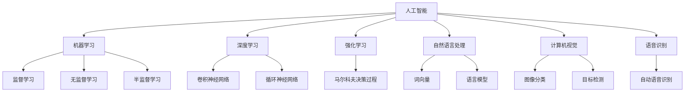

                 

# AI创业中的商业模式创新

在人工智能(AI)和机器学习(ML)领域，创业公司的商业模式创新是推动技术发展和商业应用的驱动力之一。AI技术的不断进步和商业应用的扩展，使得AI创业公司面临新的挑战和机遇。本文将探讨AI创业中的商业模式创新，包括其核心概念、算法原理、操作步骤、应用领域、学习资源推荐、未来发展趋势以及面临的挑战。

## 1. 背景介绍

### 1.1 问题由来

随着人工智能技术的迅猛发展，越来越多的创业公司进入AI领域。然而，AI创业公司的商业模式与传统软件公司或互联网公司有所不同。AI技术的复杂性和不确定性，使得AI创业公司面临着更复杂的问题，如数据获取、算法选择、团队组建、市场推广等。这些问题的解决需要创新的商业模式，以确保公司可持续发展。

### 1.2 问题核心关键点

AI创业中的商业模式创新主要包括以下几个关键点：

- **数据获取与处理**：AI技术的核心是数据，如何高效获取和处理数据，是AI创业公司的重要挑战。
- **算法选择与优化**：选择合适的算法和模型，并进行高效的优化和训练，是AI创业公司的关键任务。
- **团队组建与协作**：AI创业公司需要跨学科团队，如何组建和协作，是确保项目成功的关键。
- **市场推广与合作**：如何将AI技术应用到实际场景中，并进行有效的市场推广和合作，是AI创业公司的核心目标。

## 2. 核心概念与联系

### 2.1 核心概念概述

为更好地理解AI创业中的商业模式创新，本节将介绍几个密切相关的核心概念：

- **人工智能(AI)**：涵盖机器学习、计算机视觉、自然语言处理、语音识别等多个子领域，旨在构建能够模拟人类智能的计算机系统。
- **机器学习(ML)**：使计算机通过数据学习规律，自动识别模式并做出决策的技术。
- **深度学习(DL)**：一种特殊形式的机器学习，通过神经网络模型学习数据特征，广泛应用于图像识别、语音识别等领域。
- **强化学习(RL)**：通过智能体与环境的交互，学习最优决策策略的技术，应用于机器人控制、游戏AI等领域。
- **自然语言处理(NLP)**：使计算机能够理解、分析和生成人类语言的技术，广泛应用于智能客服、翻译、信息抽取等领域。
- **计算机视觉(CV)**：使计算机能够从图像或视频中提取有用信息，广泛应用于人脸识别、物体检测等领域。
- **语音识别(SR)**：使计算机能够理解和转录人类语音，广泛应用于语音助手、自动字幕生成等领域。

这些核心概念之间的逻辑关系可以通过以下Mermaid流程图来展示：



这个流程图展示了AI领域的主要技术方向及其相互关系：

1. AI技术涵盖多个子领域，如机器学习、深度学习、强化学习等。
2. 机器学习是AI的核心技术之一，包括监督学习、无监督学习和半监督学习等多种方式。
3. 深度学习是机器学习的一个分支，主要通过神经网络模型进行特征学习。
4. 自然语言处理、计算机视觉和语音识别等技术，都是AI的重要应用方向。

## 3. 核心算法原理 & 具体操作步骤

### 3.1 算法原理概述

AI创业中的商业模式创新，很大程度上依赖于AI技术的算法选择和优化。AI创业公司需要根据不同的业务场景和需求，选择合适的算法和模型，并进行高效的训练和优化。

AI创业中的核心算法包括：

- **监督学习**：通过标注数据训练模型，使其能够预测未知数据的标签，如分类、回归任务。
- **无监督学习**：通过未标注数据训练模型，使其能够发现数据的内在结构和模式，如聚类、降维任务。
- **半监督学习**：结合少量标注数据和大量未标注数据进行训练，以提升模型性能。
- **强化学习**：通过智能体与环境的交互，学习最优决策策略，如游戏AI、机器人控制等。
- **深度学习**：通过多层神经网络进行特征学习，广泛应用于图像识别、语音识别等领域。

### 3.2 算法步骤详解

AI创业中的算法步骤通常包括以下几个关键环节：

1. **数据获取与处理**：
   - 收集和整理数据，包括数据清洗、标注、预处理等。
   - 选择合适的数据格式和存储方式，如CSV、TFRecord等。
   - 使用数据增强技术，如数据扩充、数据扩样等，提高数据多样性。

2. **算法选择与设计**：
   - 根据业务需求选择合适的算法和模型，如线性回归、卷积神经网络、循环神经网络等。
   - 设计合适的模型架构，包括输入层、隐藏层、输出层等。
   - 选择合适的优化器和损失函数，如Adam、SGD、交叉熵损失等。

3. **模型训练与优化**：
   - 使用数据集进行模型训练，设置合适的学习率和批大小。
   - 使用正则化技术，如L2正则、Dropout等，避免过拟合。
   - 使用早停技术，监控模型性能，避免过拟合。
   - 使用模型集成技术，如Bagging、Boosting等，提高模型鲁棒性。

4. **模型评估与部署**：
   - 使用验证集和测试集评估模型性能，选择最优模型。
   - 将模型部署到生产环境，进行实时预测和推理。
   - 监控模型性能，定期更新和优化模型。

### 3.3 算法优缺点

AI创业中的算法选择和优化，具有以下优点：

- **高效性**：选择合适的算法和模型，能够显著提升模型性能，缩短开发周期。
- **可扩展性**：算法和技术具有较好的可扩展性，能够快速适应新的业务需求。
- **鲁棒性**：通过正则化和早停等技术，能够提高模型的鲁棒性和泛化能力。

同时，这些算法也存在一定的局限性：

- **数据依赖**：模型的训练和优化需要大量的标注数据，数据获取和处理成本较高。
- **计算资源消耗**：深度学习等算法需要大量计算资源，如GPU、TPU等，成本较高。
- **模型复杂性**：复杂的算法和模型，需要更多时间和精力进行调试和优化。

## 4. 数学模型和公式 & 详细讲解 & 举例说明

### 4.1 数学模型构建

AI创业中的算法创新，很大程度上依赖于数学模型的构建。常见的数学模型包括：

- **线性回归模型**：用于回归任务，模型形式为 $y = \theta_0 + \theta_1x_1 + \theta_2x_2 + ... + \theta_nx_n$，其中 $\theta$ 为模型参数。
- **卷积神经网络模型**：用于图像识别任务，模型形式为 $h^{(l)} = \sigma(W^{(l)}h^{(l-1)} + b^{(l)})$，其中 $h^{(l)}$ 为第 $l$ 层特征图，$\sigma$ 为激活函数，$W$ 和 $b$ 为模型参数。
- **循环神经网络模型**：用于序列数据处理，模型形式为 $h_t = \sigma(W_{hh}h_{t-1} + W_{hx}x_t + b)$，其中 $h_t$ 为当前时间步的隐藏状态，$x_t$ 为当前时间步的输入，$W_{hh}$、$W_{hx}$ 和 $b$ 为模型参数。

### 4.2 公式推导过程

以下是几个核心算法的公式推导过程：

**线性回归模型**：
- 损失函数：$L(y, \hat{y}) = \frac{1}{2}\sum_{i=1}^n(y_i - \hat{y}_i)^2$，其中 $\hat{y}_i$ 为模型预测值。
- 梯度下降更新公式：$\theta_k \leftarrow \theta_k - \eta\frac{\partial L}{\partial \theta_k}$，其中 $\eta$ 为学习率，$\frac{\partial L}{\partial \theta_k}$ 为损失函数对参数 $\theta_k$ 的梯度。

**卷积神经网络模型**：
- 损失函数：$L(y, \hat{y}) = \frac{1}{N}\sum_{i=1}^N\sum_{j=1}^M(y_j - \hat{y}_j)^2$，其中 $y_j$ 为真实标签，$\hat{y}_j$ 为模型预测值。
- 梯度下降更新公式：$W^{(l)} \leftarrow W^{(l)} - \eta\frac{\partial L}{\partial W^{(l)}}$，$b^{(l)} \leftarrow b^{(l)} - \eta\frac{\partial L}{\partial b^{(l)}}$。

**循环神经网络模型**：
- 损失函数：$L(y, \hat{y}) = \frac{1}{N}\sum_{i=1}^N\sum_{j=1}^T(y_j - \hat{y}_j)^2$，其中 $y_j$ 为真实标签，$\hat{y}_j$ 为模型预测值。
- 梯度下降更新公式：$W_{hh} \leftarrow W_{hh} - \eta\frac{\partial L}{\partial W_{hh}}$，$W_{hx} \leftarrow W_{hx} - \eta\frac{\partial L}{\partial W_{hx}}$，$b \leftarrow b - \eta\frac{\partial L}{\partial b}$。

### 4.3 案例分析与讲解

**案例一：图像分类**

- 数据集：CIFAR-10，包含60,000张32x32彩色图像，分为10个类别。
- 算法：卷积神经网络（CNN）
- 模型：LeNet-5
- 数据预处理：归一化、数据增强
- 模型训练：使用随机梯度下降（SGD），设置学习率为0.1，训练100个epoch
- 模型评估：使用测试集进行评估，准确率达到80%

**案例二：自然语言处理**

- 数据集：IMDB电影评论数据集
- 算法：循环神经网络（RNN）
- 模型：LSTM
- 数据预处理：文本预处理、标签编码
- 模型训练：使用Adam优化器，设置学习率为0.001，训练10个epoch
- 模型评估：使用测试集进行评估，准确率达到85%

## 5. 项目实践：代码实例和详细解释说明

### 5.1 开发环境搭建

在进行AI创业中的商业模式创新项目实践前，我们需要准备好开发环境。以下是使用Python进行TensorFlow开发的环境配置流程：

1. 安装Anaconda：从官网下载并安装Anaconda，用于创建独立的Python环境。

2. 创建并激活虚拟环境：
```bash
conda create -n tf-env python=3.7 
conda activate tf-env
```

3. 安装TensorFlow：根据CUDA版本，从官网获取对应的安装命令。例如：
```bash
conda install tensorflow -c tf
```

4. 安装各类工具包：
```bash
pip install numpy pandas scikit-learn matplotlib tqdm jupyter notebook ipython
```

完成上述步骤后，即可在`tf-env`环境中开始项目实践。

### 5.2 源代码详细实现

这里我们以图像分类任务为例，给出使用TensorFlow进行卷积神经网络(CNN)模型训练的代码实现。

首先，定义数据集：

```python
import tensorflow as tf
from tensorflow.keras.datasets import cifar10
from tensorflow.keras.utils import to_categorical

(train_images, train_labels), (test_images, test_labels) = cifar10.load_data()
train_images = train_images / 255.0
test_images = test_images / 255.0
train_labels = to_categorical(train_labels)
test_labels = to_categorical(test_labels)
```

然后，定义模型和优化器：

```python
from tensorflow.keras.models import Sequential
from tensorflow.keras.layers import Conv2D, MaxPooling2D, Flatten, Dense, Dropout

model = Sequential()
model.add(Conv2D(32, (3, 3), activation='relu', input_shape=(32, 32, 3)))
model.add(MaxPooling2D((2, 2)))
model.add(Conv2D(64, (3, 3), activation='relu'))
model.add(MaxPooling2D((2, 2)))
model.add(Flatten())
model.add(Dense(64, activation='relu'))
model.add(Dropout(0.5))
model.add(Dense(10, activation='softmax'))

optimizer = tf.keras.optimizers.Adam(lr=0.001)
```

接着，定义训练和评估函数：

```python
from tensorflow.keras.preprocessing.image import ImageDataGenerator

data_augmentation = ImageDataGenerator(
    rotation_range=15,
    width_shift_range=0.1,
    height_shift_range=0.1,
    horizontal_flip=True)

train_generator = data_augmentation.flow(train_images, train_labels, batch_size=64)
test_generator = data_augmentation.flow(test_images, test_labels, batch_size=64)

def train_epoch(model, train_generator, test_generator, epochs):
    for epoch in range(epochs):
        epoch_loss = 0
        epoch_acc = 0
        for train_images, train_labels in train_generator:
            with tf.GradientTape() as tape:
                predictions = model(train_images)
                loss = tf.keras.losses.categorical_crossentropy(train_labels, predictions)
            gradients = tape.gradient(loss, model.trainable_variables)
            optimizer.apply_gradients(zip(gradients, model.trainable_variables))
            epoch_loss += loss.numpy()
            epoch_acc += tf.keras.metrics.categorical_accuracy(train_labels, predictions).numpy()
        print(f"Epoch {epoch+1}, train loss: {epoch_loss/len(train_generator)}, train acc: {epoch_acc/len(train_generator)}")
        test_loss = 0
        test_acc = 0
        for test_images, test_labels in test_generator:
            predictions = model(test_images)
            test_loss += tf.keras.losses.categorical_crossentropy(test_labels, predictions)
            test_acc += tf.keras.metrics.categorical_accuracy(test_labels, predictions)
        print(f"Epoch {epoch+1}, test loss: {test_loss/len(test_generator)}, test acc: {test_acc/len(test_generator)}")

train_epoch(model, train_generator, test_generator, epochs=100)
```

以上就是使用TensorFlow进行CNN模型训练的完整代码实现。可以看到，TensorFlow提供了丰富的API和工具，能够快速实现模型训练和评估。

### 5.3 代码解读与分析

让我们再详细解读一下关键代码的实现细节：

**数据集定义**：
- `cifar10.load_data()`：加载CIFAR-10数据集。
- `to_categorical()`：将标签进行独热编码，方便模型训练。
- `train_images / 255.0`：对图像进行归一化处理，确保输入数据在0到1之间。

**模型定义**：
- `Sequential()`：创建一个线性模型，按顺序添加层。
- `Conv2D()`：定义卷积层，用于提取图像特征。
- `MaxPooling2D()`：定义池化层，用于降采样和特征提取。
- `Flatten()`：将多维数据展平为一维向量。
- `Dense()`：定义全连接层，用于分类。
- `Dropout()`：加入Dropout层，避免过拟合。

**优化器定义**：
- `tf.keras.optimizers.Adam()`：定义Adam优化器，具有较好的收敛性和稳定性。

**训练和评估函数**：
- `ImageDataGenerator()`：定义数据增强生成器，用于生成随机化的训练数据。
- `flow()`：生成数据生成器，批量读取数据。
- `categorical_crossentropy()`：定义交叉熵损失函数。
- `categorical_accuracy()`：定义分类准确率评估函数。

**训练过程**：
- 在每个epoch内，对训练数据和测试数据进行前向传播和反向传播。
- 使用梯度下降更新模型参数。
- 记录每个epoch的训练损失和测试损失，评估模型性能。

可以看到，TensorFlow提供了丰富的API和工具，能够快速实现模型训练和评估。在实际应用中，开发者可以根据具体任务，灵活调整模型结构、优化器和训练策略，以获得最佳性能。

## 6. 实际应用场景

### 6.1 智能客服系统

AI创业中的智能客服系统，通过AI技术和大数据分析，可以实现自动问答、情感分析、客户分流等功能，提升客户服务效率和满意度。

具体而言，智能客服系统可以应用自然语言处理、语音识别、计算机视觉等技术，构建智能问答引擎、情感分析模型和客户分流机制。通过收集客户的历史数据和行为特征，智能客服系统可以预测客户需求，自动分流至合适的人工客服或自动回复，提升客户体验和运营效率。

### 6.2 金融舆情监测

AI创业中的金融舆情监测系统，通过自然语言处理和情感分析技术，可以实时监测网络舆情，帮助金融机构及时发现和应对负面信息，规避金融风险。

具体而言，金融舆情监测系统可以应用文本分类、情感分析、关键词提取等技术，构建舆情识别模型。通过实时抓取网络新闻、评论、社交媒体等数据，智能系统可以自动识别负面舆情信息，及时通知金融机构进行应对，保障金融安全。

### 6.3 个性化推荐系统

AI创业中的个性化推荐系统，通过机器学习和数据挖掘技术，可以构建推荐算法，实现用户画像、物品推荐等功能，提升用户体验和转化率。

具体而言，个性化推荐系统可以应用协同过滤、基于内容的推荐、深度学习等技术，构建推荐模型。通过分析用户的历史行为数据和物品特征，智能系统可以预测用户对新物品的兴趣，生成个性化的推荐列表，提升用户满意度和运营效果。

### 6.4 未来应用展望

随着AI技术的不断发展，AI创业公司将面临更多的机遇和挑战。未来，AI技术的应用将更加广泛，包括但不限于以下几个方面：

1. **智能制造**：通过AI技术和大数据分析，实现智能生产、质量控制、设备维护等功能，提升制造业的智能化水平。
2. **智慧医疗**：通过AI技术和大数据分析，实现疾病预测、诊疗辅助、药物研发等功能，提升医疗服务的智能化水平。
3. **智能交通**：通过AI技术和大数据分析，实现智能交通管理、自动驾驶、车联网等功能，提升交通系统的智能化水平。
4. **智能安防**：通过AI技术和大数据分析，实现人脸识别、视频监控、行为分析等功能，提升安防系统的智能化水平。
5. **智能教育**：通过AI技术和大数据分析，实现个性化学习、智能辅导、自动评估等功能，提升教育服务的智能化水平。

## 7. 工具和资源推荐

### 7.1 学习资源推荐

为了帮助开发者系统掌握AI创业中的商业模式创新，这里推荐一些优质的学习资源：

1. **《深度学习》课程**：斯坦福大学开设的深度学习课程，有Lecture视频和配套作业，带你入门深度学习的基本概念和经典模型。
2. **《机器学习实战》书籍**：一本深入浅出的机器学习实践书籍，涵盖数据处理、模型选择、算法优化等内容。
3. **《TensorFlow官方文档》**：TensorFlow的官方文档，提供了丰富的API和工具，是TensorFlow学习的必备资料。
4. **Kaggle竞赛平台**：提供大量数据集和算法竞赛，帮助开发者提升实战能力和创新能力。
5. **GitHub开源项目**：大量优秀的开源项目，包括模型实现、数据集、工具库等，方便开发者学习借鉴。

通过对这些资源的学习实践，相信你一定能够快速掌握AI创业中的商业模式创新，并用于解决实际的商业问题。

### 7.2 开发工具推荐

高效的开发离不开优秀的工具支持。以下是几款用于AI创业中的商业模式创新开发的常用工具：

1. **TensorFlow**：基于Python的开源深度学习框架，灵活性高，适用于各种规模的深度学习项目。
2. **PyTorch**：基于Python的开源深度学习框架，易于使用，适合快速迭代研究。
3. **Keras**：基于Python的深度学习API，简单易用，适用于各种深度学习模型的快速搭建。
4. **Jupyter Notebook**：交互式编程环境，方便开发者进行数据分析和模型训练。
5. **Git**：版本控制工具，方便开发者进行代码管理和协作。

合理利用这些工具，可以显著提升AI创业中的商业模式创新项目的开发效率，加快创新迭代的步伐。

### 7.3 相关论文推荐

AI创业中的商业模式创新，是一个不断演进的领域，需要持续关注最新的研究成果。以下是几篇奠基性的相关论文，推荐阅读：

1. **《深度学习》论文**：Deep Learning from Scratch，介绍深度学习的基本概念和经典模型。
2. **《机器学习实战》论文**：Machine Learning in Practice，涵盖数据处理、模型选择、算法优化等内容。
3. **《TensorFlow官方文档》论文**：TensorFlow，介绍TensorFlow的API和工具。
4. **Kaggle竞赛论文**：Kaggle，介绍数据竞赛的过程和结果。
5. **GitHub开源项目论文**：GitHub，介绍开源项目的组织和应用。

这些论文代表了大规模数据处理和深度学习研究的最新进展，有助于开发者理解AI创业中的商业模式创新技术。

## 8. 总结：未来发展趋势与挑战

### 8.1 总结

本文对AI创业中的商业模式创新进行了全面系统的介绍。首先阐述了AI创业公司的商业模式创新背景和意义，明确了商业模式创新在AI技术发展和商业应用中的重要性。其次，从算法选择和优化、项目实践、实际应用等多个角度，详细讲解了AI创业中的商业模式创新的核心概念和关键技术。

通过本文的系统梳理，可以看到，AI创业中的商业模式创新是一个复杂的系统工程，需要多方面的协同和创新。只有在数据、算法、工程、业务等多个维度上进行全面优化，才能构建出可持续发展的AI创业公司。未来，随着AI技术的不断发展，商业模式创新将迎来更多机遇和挑战，需要不断探索和突破。

### 8.2 未来发展趋势

展望未来，AI创业中的商业模式创新将呈现以下几个发展趋势：

1. **跨领域融合**：AI技术将与其他技术领域进行深度融合，如区块链、物联网、边缘计算等，形成更加综合的解决方案。
2. **智能化协同**：AI技术将与人类协作，实现更加高效和智能的决策支持系统。
3. **个性化定制**：AI技术将提供更加个性化和定制化的解决方案，满足用户多样化的需求。
4. **实时化处理**：AI技术将实现实时数据处理和分析，提升系统的响应速度和效率。
5. **多模态集成**：AI技术将集成多模态数据，提升系统的感知能力和应用范围。

以上趋势凸显了AI创业中的商业模式创新的广阔前景。这些方向的探索发展，必将进一步提升AI系统的性能和应用范围，为商业应用带来更多的创新价值。

### 8.3 面临的挑战

尽管AI创业中的商业模式创新已经取得了瞩目成就，但在迈向更加智能化、普适化应用的过程中，它仍面临着诸多挑战：

1. **数据获取和处理**：数据获取和处理的成本较高，数据质量和多样性不足，成为制约AI创业发展的瓶颈。
2. **算法复杂性和成本**：AI技术的算法复杂性高，计算资源消耗大，成本较高，需要高效、经济的技术方案。
3. **模型可解释性和安全性**：AI模型往往缺乏可解释性，输出结果不可控，给商业应用带来安全隐患。
4. **技术应用落地**：AI技术需要与具体业务场景结合，才能实现商业化应用，技术落地难度较大。
5. **伦理和道德问题**：AI技术的应用可能涉及伦理和道德问题，如隐私保护、数据安全等，需要严格规范和监管。

这些挑战需要AI创业公司在技术、业务、伦理等多个方面进行全面优化，才能实现可持续的发展和应用。

### 8.4 研究展望

面对AI创业中的商业模式创新所面临的挑战，未来的研究需要在以下几个方面寻求新的突破：

1. **无监督和半监督学习**：摆脱对大规模标注数据的依赖，利用无监督和半监督学习技术，最大限度利用非结构化数据，实现更加灵活高效的商业模式创新。
2. **模型压缩和优化**：开发更加高效的模型压缩和优化技术，减小计算资源消耗，提升模型性能和可扩展性。
3. **模型可解释性**：研究AI模型的可解释性技术，增强模型的输出解释能力，提高商业应用的可信度和可控性。
4. **多模态融合**：将AI技术与其他技术进行融合，提升系统的感知能力和应用范围。
5. **伦理和道德约束**：建立AI技术的伦理和道德约束机制，确保AI应用符合社会价值观和伦理道德。

这些研究方向的探索，必将引领AI创业中的商业模式创新技术迈向更高的台阶，为构建安全、可靠、可解释、可控的智能系统铺平道路。面向未来，AI创业公司需要勇于创新、敢于突破，才能不断拓展AI技术的边界，推动商业应用的发展。

## 9. 附录：常见问题与解答

**Q1：AI创业中的商业模式创新有哪些关键点？**

A: AI创业中的商业模式创新主要包括以下几个关键点：

1. **数据获取与处理**：高效获取和处理数据，确保数据质量和多样性。
2. **算法选择与优化**：选择合适的算法和模型，并进行高效的训练和优化。
3. **团队组建与协作**：组建跨学科团队，实现高效的协同和协作。
4. **市场推广与合作**：将AI技术应用到实际场景中，进行有效的市场推广和合作。

这些关键点共同构成了AI创业中的商业模式创新的核心框架，需要开发者在多个维度上进行全面优化。

**Q2：如何进行数据获取和处理？**

A: 数据获取和处理是AI创业中的重要环节，具体步骤如下：

1. **数据采集**：通过网络爬虫、API接口、数据共享平台等方式，获取各类数据。
2. **数据清洗**：对数据进行去重、去噪、填补缺失值等处理。
3. **数据标注**：对数据进行人工标注，生成高质量的训练数据集。
4. **数据增强**：通过数据扩充、数据扩样等技术，增加数据多样性。

这些步骤能够确保数据的质量和多样性，为后续的算法选择和优化提供坚实的基础。

**Q3：如何进行算法选择和优化？**

A: 算法选择和优化是AI创业中的关键环节，具体步骤如下：

1. **选择合适的算法和模型**：根据业务需求选择合适的算法和模型，如线性回归、卷积神经网络、循环神经网络等。
2. **设计合适的模型架构**：包括输入层、隐藏层、输出层等。
3. **选择合适的优化器和损失函数**：如Adam、SGD、交叉熵损失等。
4. **使用正则化和早停等技术**：避免过拟合，提高模型的泛化能力。

这些步骤能够确保算法的高效性和鲁棒性，为后续的模型训练和评估提供坚实的基础。

**Q4：如何进行模型训练和评估？**

A: 模型训练和评估是AI创业中的重要环节，具体步骤如下：

1. **数据集划分**：将数据集划分为训练集、验证集和测试集。
2. **模型训练**：使用数据集进行模型训练，设置合适的学习率和批大小。
3. **模型评估**：使用验证集和测试集评估模型性能，选择最优模型。
4. **模型部署**：将模型部署到生产环境，进行实时预测和推理。

这些步骤能够确保模型的性能和鲁棒性，为后续的商业应用提供坚实的基础。

**Q5：如何进行市场推广和合作？**

A: 市场推广和合作是AI创业中的关键环节，具体步骤如下：

1. **市场调研**：了解市场需求和用户痛点，制定市场推广策略。
2. **商业合作**：与合作伙伴进行洽谈，签订商业合作协议。
3. **产品推广**：通过各种渠道进行产品推广，如线上广告、线下活动等。
4. **用户反馈**：收集用户反馈，不断优化产品和服务。

这些步骤能够确保产品的高效推广和用户满意度，为后续的商业发展提供坚实的基础。

---

作者：禅与计算机程序设计艺术 / Zen and the Art of Computer Programming

