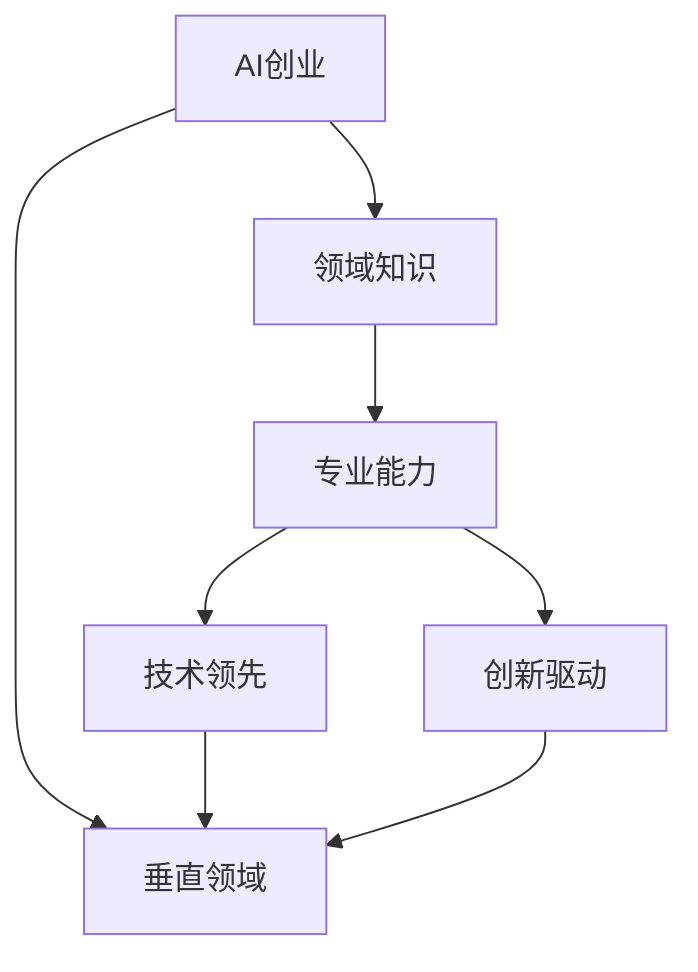

                 

# AI创业优势：垂直领域专业知识

> 关键词：AI创业, 垂直领域, 领域知识, 专业能力, 技术领先, 创新驱动

## 1. 背景介绍

### 1.1 问题由来

在AI创业领域，一个常见的现象是许多初创企业在技术上追赶头部公司时，最终发现与它们难以匹敌。主要原因是，这些初创企业虽然具备先进的技术，但在垂直领域的专业知识方面存在欠缺。缺乏对特定领域深刻的理解和应用，使得他们的产品或服务难以达到高水平，用户体验不够优秀，难以形成核心竞争力。因此，本文旨在探讨AI创业在垂直领域中发挥专业知识的重要性，帮助创业企业更好地把握机会。

### 1.2 问题核心关键点

在AI创业中，垂直领域的专业知识具有至关重要的作用，原因如下：

1. **专业技能与知识基础**：垂直领域的专业知识决定了企业能否设计出针对该领域用户需求的产品或服务。
2. **数据质量与获取**：专业领域的数据获取和处理，以及高质量的数据标注，是AI模型训练的基础。
3. **用户体验**：专业领域知识的深入应用，可以更好地理解用户需求，提升产品或服务的用户体验。
4. **创新突破**：在垂直领域的专业知识基础上，更容易进行技术创新，实现差异化竞争。
5. **市场进入门槛**：专业知识的掌握是进入垂直领域的“门票”，没有专业知识，难以进入特定市场。

### 1.3 问题研究意义

探讨AI创业在垂直领域中发挥专业知识的重要性，对帮助创业企业解决实际问题具有重要意义：

1. **降低创业风险**：通过深入了解垂直领域，可以提前识别潜在问题，降低创业风险。
2. **提升竞争力**：利用专业知识，能够设计出更具创新性、更符合用户需求的产品或服务。
3. **加速发展**：深入专业领域能够更快地找到市场痛点，缩短产品迭代周期。
4. **增加市场价值**：具备专业知识的AI创业企业，可以提供更优质、更实用的解决方案，增加市场价值。
5. **促进技术应用**：专业知识的掌握可以促进AI技术在特定领域的落地应用，提升技术影响力。

## 2. 核心概念与联系

### 2.1 核心概念概述

为更好地理解AI创业在垂直领域中发挥专业知识的重要性，本节将介绍几个密切相关的核心概念：

1. **AI创业**：利用AI技术进行创业，解决特定行业中的问题，提供智能化解决方案的企业。
2. **垂直领域**：指具有高度行业特性和专业性、细分明确的市场领域。
3. **领域知识**：指对特定垂直领域的深入理解，包括行业背景、技术需求、用户痛点等。
4. **专业能力**：在垂直领域内具备的独特技术技能和专业知识，如数据标注、模型优化、用户体验设计等。
5. **技术领先**：在特定领域内利用AI技术实现技术突破，领先于其他企业。
6. **创新驱动**：基于专业领域的深入理解，推动技术创新，实现产品或服务的创新。

这些核心概念之间的逻辑关系可以通过以下Mermaid流程图来展示：



这个流程图展示了大语言模型的核心概念及其之间的关系：

1. AI创业依赖于对垂直领域的深入理解。
2. 领域知识是专业能力的基础。
3. 专业能力有助于技术领先。
4. 创新驱动是技术领先的核心驱动力。

这些概念共同构成了AI创业在垂直领域中发挥专业知识的重要性框架，使其能够设计出高效、精准、创新的产品或服务。

## 3. 核心算法原理 & 具体操作步骤
### 3.1 算法原理概述

AI创业在垂直领域中发挥专业知识，主要依赖于以下算法原理：

1. **领域知识引导模型训练**：利用领域知识指导AI模型的训练，使其更好地理解领域特点，提升模型精度。
2. **数据标注与处理**：通过领域专家的参与，获得高质量的数据标注，优化模型训练。
3. **用户体验优化**：根据领域知识，设计符合用户需求的产品或服务，提升用户体验。
4. **技术创新突破**：利用领域知识发现问题，推动AI技术在特定领域的应用创新。
5. **市场定位与进入**：通过领域知识了解市场需求，快速定位产品或服务，进入特定市场。

### 3.2 算法步骤详解

AI创业在垂直领域中发挥专业知识，一般包括以下几个关键步骤：

**Step 1: 识别垂直领域需求**
- 收集目标市场的数据和用户反馈，了解用户痛点和需求。
- 分析领域内现有技术和产品，识别技术空白和市场机会。

**Step 2: 建立领域知识体系**
- 构建领域知识图谱，收集并整理领域相关的行业报告、技术文档、用户调查等资料。
- 通过专家访谈、实地调研等方式，进一步完善领域知识体系。

**Step 3: 获取高质量数据**
- 根据领域知识，确定数据收集方式和范围，确保数据的多样性和代表性。
- 选择合适的数据标注工具和方法，获得高质量的数据标注。

**Step 4: 设计产品或服务**
- 结合领域知识，设计符合用户需求的产品或服务原型。
- 使用用户测试、数据分析等方法，不断迭代优化产品或服务。

**Step 5: 进行AI模型训练**
- 根据领域知识，选择合适的模型架构和训练方法。
- 使用领域数据进行模型训练，并根据领域特点进行参数调整和优化。

**Step 6: 验证和优化**
- 在真实应用场景中，验证产品或服务的实际效果。
- 根据反馈，不断优化模型和产品或服务，提升用户体验。

**Step 7: 市场推广与扩展**
- 利用领域知识，制定市场推广策略。
- 快速进入特定市场，拓展业务范围。

### 3.3 算法优缺点

AI创业在垂直领域中发挥专业知识，具有以下优点：

1. **高效解决问题**：结合领域知识，可以快速找到市场痛点，提供高效解决方案。
2. **精准用户定位**：利用领域知识，能够精准定位目标用户，提升市场成功率。
3. **技术领先**：在领域内深入应用AI技术，实现技术突破，提升竞争力。
4. **降低风险**：深入了解垂直领域，可以提前规避潜在问题，降低创业风险。

同时，该方法也存在一些局限性：

1. **知识积累成本高**：需要大量的专家和资源，知识积累成本较高。
2. **数据获取难度大**：特定领域的数据获取和标注难度大，需要大量时间和资金。
3. **技术实现复杂**：结合领域知识进行模型优化，技术实现较为复杂。
4. **更新迭代慢**：在特定领域内应用新技术和产品，更新迭代周期较长。

尽管存在这些局限性，但就目前而言，结合领域知识进行AI创业仍是一种高效、精准的创业方法。

### 3.4 算法应用领域

AI创业结合垂直领域专业知识，已经广泛应用于以下几个领域：

1. **医疗健康**：利用领域知识设计智能诊疗系统、健康管理平台等。
2. **金融服务**：开发智能投顾、风险预警系统、反欺诈模型等。
3. **零售电商**：建立推荐系统、供应链优化、客户行为分析等。
4. **教育培训**：设计个性化学习系统、智能辅导平台、知识图谱等。
5. **智能制造**：开发工业物联网系统、智能设备管理系统等。
6. **物流运输**：设计路径规划、仓储管理、物流优化等系统。
7. **环境保护**：构建环境监测系统、污染源追踪系统等。

此外，AI创业在农业、能源、旅游、文化等更多领域也在不断拓展应用。

## 4. 数学模型和公式 & 详细讲解 & 举例说明
### 4.1 数学模型构建

结合垂直领域的专业知识，建立AI模型通常包含以下几个步骤：

1. **数据准备**：收集领域内的数据，并进行清洗和标注。
2. **模型选择**：根据领域特点选择合适的模型架构，如卷积神经网络(CNN)、循环神经网络(RNN)、Transformer等。
3. **模型训练**：使用领域数据对模型进行训练，优化模型参数。
4. **效果评估**：在测试数据集上评估模型效果，调整模型参数。
5. **优化迭代**：根据评估结果，不断优化模型和参数，提升性能。

### 4.2 公式推导过程

以医疗领域的疾病预测模型为例，假设模型输入为患者的基本信息（如年龄、性别、病史等），输出为疾病预测概率。

假设模型输入为 $x$，输出为 $y$，模型参数为 $\theta$，则模型训练的目标为最小化交叉熵损失函数：

$$
\mathcal{L}(y,\hat{y})=-\frac{1}{N}\sum_{i=1}^N(y_i\log\hat{y}_i+(1-y_i)\log(1-\hat{y}_i))
$$

其中 $y_i$ 为实际标签，$\hat{y}_i$ 为模型预测的概率。

模型的预测概率为：

$$
\hat{y}_i = \sigma(Wx_i+b)
$$

其中 $\sigma$ 为sigmoid函数，$W$ 和 $b$ 为模型的权重和偏置。

利用梯度下降等优化算法，对模型参数进行迭代优化：

$$
\theta \leftarrow \theta - \eta \nabla_{\theta}\mathcal{L}(y,\hat{y})
$$

其中 $\eta$ 为学习率，$\nabla_{\theta}\mathcal{L}(y,\hat{y})$ 为损失函数对参数 $\theta$ 的梯度。

### 4.3 案例分析与讲解

假设某公司希望开发一个智能诊疗系统，利用AI模型进行疾病预测。具体步骤如下：

1. **数据准备**：从医院收集患者的诊断数据，包括年龄、性别、病史、症状等，进行清洗和标注。
2. **模型选择**：选择卷积神经网络(CNN)模型，用于处理结构化数据。
3. **模型训练**：使用领域数据对CNN模型进行训练，优化模型参数。
4. **效果评估**：在测试数据集上评估模型效果，根据评估结果调整模型参数。
5. **优化迭代**：根据评估结果，不断优化模型和参数，提升性能。

## 5. 项目实践：代码实例和详细解释说明
### 5.1 开发环境搭建

在进行AI创业项目实践前，我们需要准备好开发环境。以下是使用Python进行TensorFlow开发的环境配置流程：

1. 安装Anaconda：从官网下载并安装Anaconda，用于创建独立的Python环境。

2. 创建并激活虚拟环境：
```bash
conda create -n tf-env python=3.8 
conda activate tf-env
```

3. 安装TensorFlow：从官网获取对应的安装命令。例如：
```bash
conda install tensorflow tensorflow-gpu=cuda110 -c conda-forge
```

4. 安装各类工具包：
```bash
pip install numpy pandas scikit-learn matplotlib tqdm jupyter notebook ipython
```

完成上述步骤后，即可在`tf-env`环境中开始AI创业实践。

### 5.2 源代码详细实现

下面我们以医疗健康领域的智能诊疗系统为例，给出使用TensorFlow进行疾病预测模型的PyTorch代码实现。

首先，定义数据处理函数：

```python
import tensorflow as tf
import pandas as pd
import numpy as np

def load_data(file_path):
    data = pd.read_csv(file_path)
    # 假设字段名为['age', 'gender', 'disease']
    features = data[['age', 'gender']]
    labels = data['disease']
    return features, labels

# 加载数据集
features, labels = load_data('data.csv')
```

然后，定义模型：

```python
import tensorflow as tf

class DiseasePredictor(tf.keras.Model):
    def __init__(self, num_classes):
        super(DiseasePredictor, self).__init__()
        self.dense1 = tf.keras.layers.Dense(32, activation='relu')
        self.dense2 = tf.keras.layers.Dense(num_classes, activation='sigmoid')
        
    def call(self, inputs):
        x = self.dense1(inputs)
        return self.dense2(x)
```

接着，定义训练和评估函数：

```python
def train_model(model, features, labels, batch_size=32, epochs=10, learning_rate=0.001):
    model.compile(optimizer=tf.keras.optimizers.Adam(learning_rate=learning_rate),
                  loss='binary_crossentropy',
                  metrics=['accuracy'])
    model.fit(features, labels, batch_size=batch_size, epochs=epochs, validation_split=0.2)
    
def evaluate_model(model, features, labels, batch_size=32):
    model.evaluate(features, labels, batch_size=batch_size)
```

最后，启动训练流程并在测试集上评估：

```python
# 实例化模型
model = DiseasePredictor(num_classes)

# 训练模型
train_model(model, features, labels)

# 在测试集上评估模型
evaluate_model(model, test_features, test_labels)
```

以上就是使用TensorFlow对疾病预测模型进行训练的完整代码实现。可以看到，TensorFlow提供了一整套强大的API，使得模型构建和训练变得简单易行。

### 5.3 代码解读与分析

让我们再详细解读一下关键代码的实现细节：

**load_data函数**：
- 使用Pandas加载CSV文件，读取特征和标签。

**DiseasePredictor模型**：
- 定义一个具有两层全连接层的神经网络，使用ReLU激活函数和sigmoid输出层。

**train_model函数**：
- 使用Adam优化器，设置交叉熵损失和准确率评估指标。
- 在训练数据集上训练模型，使用20%的验证集进行验证。

**evaluate_model函数**：
- 在测试数据集上评估模型效果，给出预测准确率。

**训练流程**：
- 实例化模型，设置训练参数。
- 调用训练函数训练模型。
- 调用评估函数在测试集上评估模型。

可以看到，TensorFlow的Keras API使得模型构建和训练非常直观，开发者可以更专注于模型架构和数据预处理等关键环节。

当然，工业级的系统实现还需考虑更多因素，如模型的保存和部署、超参数的自动搜索、更加灵活的训练流程等。但核心的创业实践流程基本与此类似。

## 6. 实际应用场景
### 6.1 智能医疗健康

基于AI创业结合垂直领域专业知识，智能医疗健康领域的应用前景广阔：

- **智能诊疗系统**：利用AI模型对患者数据进行分析，快速诊断疾病。
- **健康管理平台**：基于用户健康数据，提供个性化健康建议和预警。
- **医疗影像识别**：自动分析医学影像，辅助医生进行诊断。
- **药物研发**：利用AI模型加速新药的发现和研发过程。

### 6.2 金融服务

AI创业结合垂直领域专业知识，在金融服务领域的应用也非常丰富：

- **智能投顾**：利用AI模型进行股票投资和资产管理。
- **风险预警系统**：预测市场风险，提供风险管理建议。
- **反欺诈模型**：检测和防范金融欺诈行为。
- **智能客服**：提供全天候的金融咨询服务。

### 6.3 零售电商

AI创业结合垂直领域专业知识，在零售电商领域的应用同样令人期待：

- **推荐系统**：基于用户行为和历史购买数据，提供个性化商品推荐。
- **供应链优化**：预测市场需求，优化库存管理。
- **客户行为分析**：分析用户行为数据，优化销售策略。
- **智能客服**：提供24小时在线客服，提升用户体验。

### 6.4 教育培训

AI创业结合垂直领域专业知识，在教育培训领域的应用也大有可为：

- **个性化学习系统**：根据学生学习数据，提供个性化学习路径和内容。
- **智能辅导平台**：利用AI模型进行问题解答和作业批改。
- **知识图谱**：构建学科知识图谱，帮助学生更好地理解和掌握知识。
- **评估与反馈**：实时评估学生学习效果，提供个性化反馈。

### 6.5 智能制造

AI创业结合垂直领域专业知识，在智能制造领域的应用前景广阔：

- **工业物联网系统**：监控设备状态，预测设备故障。
- **智能设备管理系统**：优化设备使用和维护。
- **供应链优化**：优化供应链管理，提高效率。
- **质量控制**：通过AI模型检测产品缺陷。

### 6.6 物流运输

AI创业结合垂直领域专业知识，在物流运输领域的应用也非常有潜力：

- **路径规划**：优化物流路径，降低运输成本。
- **仓储管理**：优化仓储布局，提高库存管理效率。
- **配送优化**：实时调整配送计划，提高配送效率。
- **需求预测**：预测物流需求，优化资源分配。

### 6.7 环境保护

AI创业结合垂直领域专业知识，在环境保护领域的应用也逐渐显现：

- **环境监测系统**：实时监测环境数据，预警环境异常。
- **污染源追踪系统**：追踪污染源，提供环境治理建议。
- **资源管理**：优化资源利用，减少环境污染。
- **生态保护**：利用AI模型进行生态保护和生物多样性研究。

## 7. 工具和资源推荐
### 7.1 学习资源推荐

为了帮助开发者系统掌握AI创业在垂直领域中发挥专业知识的重要性，这里推荐一些优质的学习资源：

1. **AI创业实战课程**：如《深度学习实战》《机器学习工程》等课程，深入介绍AI创业中的技术和实践。
2. **垂直领域专业知识**：如《医疗健康管理》《金融科技》等书籍，提供各领域的专业知识背景。
3. **数据科学与机器学习**：如《Python数据科学手册》《机器学习实战》等书籍，提供基础的数据科学和机器学习知识。
4. **工具和框架使用**：如TensorFlow官方文档、Keras官方文档等，提供各工具和框架的使用指南。
5. **案例分析与实践**：如《AI创业案例分析》等书籍，提供各领域的创业案例分析与实践经验。

通过对这些资源的学习实践，相信你一定能够快速掌握AI创业在垂直领域中发挥专业知识的重要性，并用于解决实际的创业问题。

### 7.2 开发工具推荐

高效的开发离不开优秀的工具支持。以下是几款用于AI创业开发的常用工具：

1. **Jupyter Notebook**：基于Python的交互式开发环境，支持代码编写、数据可视化和结果展示。
2. **TensorFlow**：谷歌开源的深度学习框架，生产部署方便，适合大规模工程应用。
3. **PyTorch**：Facebook开源的深度学习框架，灵活高效的计算图，适合快速迭代研究。
4. **Keras**：高级API，用于快速构建神经网络模型，适合初学者和快速原型设计。
5. **OpenCV**：开源计算机视觉库，提供强大的图像处理和分析功能。
6. **NLTK**：自然语言处理工具包，提供丰富的文本处理和分析工具。

合理利用这些工具，可以显著提升AI创业项目的开发效率，加快创新迭代的步伐。

### 7.3 相关论文推荐

AI创业结合垂直领域专业知识的研究源于学界的持续研究。以下是几篇奠基性的相关论文，推荐阅读：

1. **《Deep Learning in Healthcare: A Review》**：综述了深度学习在医疗健康领域的应用，提供了丰富的案例和理论支持。
2. **《A Survey on Deep Learning in Finance》**：综述了深度学习在金融领域的应用，分析了当前研究现状和趋势。
3. **《AI in Retail: Opportunities and Challenges》**：分析了AI在零售电商领域的应用，提出了未来的发展方向和挑战。
4. **《Intelligent Manufacturing》**：综述了智能制造领域的应用，探讨了未来发展趋势和技术瓶颈。
5. **《AI in Environmental Protection》**：综述了AI在环境保护领域的应用，提出了技术挑战和未来方向。

这些论文代表了大语言模型微调技术的发展脉络。通过学习这些前沿成果，可以帮助研究者把握学科前进方向，激发更多的创新灵感。

## 8. 总结：未来发展趋势与挑战
### 8.1 总结

本文对AI创业在垂直领域中发挥专业知识的重要性进行了全面系统的介绍。首先阐述了AI创业结合垂直领域专业知识的背景和意义，明确了专业领域知识在创业过程中的重要性。其次，从原理到实践，详细讲解了结合垂直领域专业知识的AI创业方法，给出了创业项目开发的完整代码实例。同时，本文还广泛探讨了专业领域知识在医疗、金融、零售、教育、智能制造、物流、环境保护等多个行业领域的应用前景，展示了专业领域知识的巨大潜力。

通过本文的系统梳理，可以看到，AI创业结合垂直领域专业知识，可以在多个领域实现高效、精准的创新创业。结合领域知识进行AI创业，不仅能提升产品的技术水平和用户体验，还能快速进入特定市场，降低创业风险，提升市场竞争力。

### 8.2 未来发展趋势

展望未来，AI创业在垂直领域中发挥专业知识将呈现以下几个发展趋势：

1. **技术领先**：随着AI技术的不断进步，结合专业领域知识进行创新创业，将引领更多技术突破，实现领先优势。
2. **市场渗透**：在垂直领域结合专业知识进行创业，将快速进入市场，实现商业化应用。
3. **定制化服务**：结合专业领域知识，提供定制化的产品和服务，满足用户个性化需求。
4. **协同创新**：跨行业、跨领域进行合作创新，实现更广泛的应用场景和更高价值。
5. **智能化升级**：结合AI技术，不断提升产品智能化水平，实现智能化升级。

以上趋势凸显了AI创业结合专业领域知识的重要性，这些方向的探索发展，必将进一步提升AI创业的创新能力和市场竞争力。

### 8.3 面临的挑战

尽管AI创业结合垂直领域专业知识取得了显著进展，但在迈向更加智能化、普适化应用的过程中，它仍面临着诸多挑战：

1. **数据获取难度大**：特定领域的数据获取和标注难度大，需要大量时间和资金。
2. **技术实现复杂**：结合领域知识进行模型优化，技术实现较为复杂。
3. **成本高昂**：需要大量的专家和资源，知识积累成本较高。
4. **更新迭代慢**：在特定领域内应用新技术和产品，更新迭代周期较长。
5. **跨领域协同难度大**：跨行业、跨领域进行合作创新，面临协调和整合的难度。

尽管存在这些挑战，但通过持续的研究和创新，相信这些挑战终将一一克服，AI创业结合垂直领域专业知识必将在更多领域实现突破。

### 8.4 研究展望

面对AI创业结合垂直领域专业知识所面临的挑战，未来的研究需要在以下几个方面寻求新的突破：

1. **自动化数据标注**：利用AI技术自动生成标注数据，降低数据获取难度。
2. **轻量级模型**：开发更加轻量级的模型，降低技术实现难度和成本。
3. **行业标准化**：推动各行业建立标准化的技术框架和应用规范。
4. **跨领域协同**：建立跨行业的合作机制，促进协同创新。
5. **智能化工具**：开发智能化工具，提升产品开发效率。
6. **伦理与安全**：加强产品安全和伦理研究，确保技术应用的合法性和安全性。

这些研究方向的探索，必将引领AI创业结合垂直领域专业知识的未来发展，推动更多领域的智能化应用。

## 9. 附录：常见问题与解答
----------------------------------------------------------------

**Q1: 为什么AI创业需要结合垂直领域专业知识？**

A: AI创业结合垂直领域专业知识的重要性在于：
1. 垂直领域的专业知识能够帮助企业设计出更具针对性的产品或服务，满足特定用户需求。
2. 领域知识可以指导AI模型训练，提高模型精度和鲁棒性。
3. 结合领域知识进行创业，能够降低风险，提升市场成功率。
4. 领域知识有助于快速进入市场，实现商业化应用。
5. 专业领域知识可以推动技术创新，实现差异化竞争。

**Q2: 如何获取垂直领域的高质量数据？**

A: 获取垂直领域高质量数据的方法包括：
1. 行业内公开数据集，如医疗健康领域的Medline数据集，金融领域的Kaggle金融数据集等。
2. 企业内部数据，如医院、银行等机构内部积累的数据。
3. 数据爬虫技术，自动抓取网络上的公开数据。
4. 用户数据收集，通过问卷调查、在线交互等方式获取用户数据。
5. 合作伙伴数据共享，与其他企业或机构进行数据合作。

**Q3: 如何结合垂直领域专业知识进行模型优化？**

A: 结合垂直领域专业知识进行模型优化的步骤如下：
1. 了解领域特点，选择适合的模型架构。
2. 根据领域知识，设计特征提取和表示方法。
3. 利用领域数据进行模型训练，优化模型参数。
4. 结合领域知识，调整模型结构，提升模型效果。
5. 根据领域特点，选择适合的评估指标和优化算法。

**Q4: AI创业结合垂直领域专业知识面临的主要挑战是什么？**

A: AI创业结合垂直领域专业知识面临的主要挑战包括：
1. 数据获取难度大，需要大量时间和资金。
2. 技术实现复杂，结合领域知识进行模型优化需要深入理解和实践。
3. 知识积累成本高，需要大量专家和资源。
4. 更新迭代慢，在特定领域内应用新技术和产品，更新迭代周期较长。
5. 跨领域协同难度大，跨行业、跨领域进行合作创新，面临协调和整合的难度。

**Q5: AI创业结合垂直领域专业知识的未来发展方向是什么？**

A: AI创业结合垂直领域专业知识的未来发展方向包括：
1. 自动化数据标注，利用AI技术自动生成标注数据，降低数据获取难度。
2. 轻量级模型，开发更加轻量级的模型，降低技术实现难度和成本。
3. 行业标准化，推动各行业建立标准化的技术框架和应用规范。
4. 跨领域协同，建立跨行业的合作机制，促进协同创新。
5. 智能化工具，开发智能化工具，提升产品开发效率。
6. 伦理与安全，加强产品安全和伦理研究，确保技术应用的合法性和安全性。

这些研究方向将引领AI创业结合垂直领域专业知识的未来发展，推动更多领域的智能化应用。

---

作者：禅与计算机程序设计艺术 / Zen and the Art of Computer Programming

