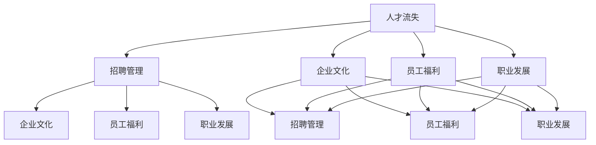

                 

# AI创业公司如何应对人才流失?

> 关键词：人才流失,招聘管理,企业文化,员工福利,职业发展

## 1. 背景介绍

随着人工智能(AI)技术的迅猛发展，越来越多的初创公司涌入AI领域，试图抓住这一机遇，抢占市场先机。然而，人才竞争的激烈也使得AI创业公司面临着前所未有的挑战，尤其是人才流失问题愈发严峻。高昂的招聘成本、项目的断断续续、低留存率等问题严重困扰着创业公司的运营和发展。本文将深入探讨AI创业公司如何有效应对人才流失问题，提出有针对性的解决方案。

## 2. 核心概念与联系

### 2.1 核心概念概述

为更好地理解如何应对人才流失，本节将介绍几个关键概念：

- **人才流失**：指的是员工离开公司或某一岗位的现象，通常涉及技术人员、管理层等核心人才。人才流失不仅会增加招聘成本，还会导致项目进展受阻、知识断层。
- **招聘管理**：指企业在招聘过程中的策略和实施，包括招聘渠道、招聘流程、招聘标准等，旨在吸引和筛选优秀人才。
- **企业文化**：公司的核心价值观、行为规范和工作氛围，是影响员工满意度和忠诚度的重要因素。
- **员工福利**：企业提供的各种福利待遇，如健康保险、带薪休假、培训发展等，直接影响员工的归属感和满意度。
- **职业发展**：提供给员工的职业规划和发展机会，包括晋升机会、技术培训、项目参与等，帮助员工实现职业目标。

这些概念之间相互作用，共同影响员工的工作状态和忠诚度。因此，理解这些概念及其联系，有助于制定有效的应对策略。

### 2.2 核心概念原理和架构的 Mermaid 流程图



此流程图展示了人才流失、招聘管理、企业文化、员工福利和职业发展之间的关系：

- 招聘管理通过吸引优秀人才减少流失；
- 企业文化和员工福利提升员工的归属感和满意度，间接降低流失；
- 职业发展提供晋升机会和职业成长路径，增强员工的忠诚度；
- 企业文化、员工福利和职业发展对招聘管理也有积极影响，形成良性循环。

## 3. 核心算法原理 & 具体操作步骤

### 3.1 算法原理概述

应对人才流失的核心算法原理是通过优化招聘管理、强化企业文化、改善员工福利和提供职业发展机会，构建一个稳定和吸引人的工作环境，从而减少员工流失率。具体来说，算法原理包括以下几个方面：

- **招聘管理**：利用数据分析和招聘工具，优化招聘流程，提高招聘效率和质量。
- **企业文化**：通过定期的企业文化建设活动和员工反馈机制，增强公司凝聚力和员工认同感。
- **员工福利**：制定全面和人性化的福利政策，提供灵活的工作安排，满足员工多样化的需求。
- **职业发展**：提供个性化的职业发展路径和培训机会，帮助员工实现职业成长和技能提升。

### 3.2 算法步骤详解

以下是应对人才流失的具体操作步骤：

**Step 1: 数据收集与分析**
- 收集员工离职数据，分析离职原因、行业趋势和员工需求。
- 通过问卷调查和访谈，了解员工对企业文化、福利和职业发展的期望。

**Step 2: 优化招聘流程**
- 利用招聘管理系统收集和分析候选人数据，筛选出符合公司需求的优秀人才。
- 设计高效的招聘流程，包括简历筛选、面试评估和offer发放等环节。

**Step 3: 强化企业文化**
- 定期举办企业文化建设活动，如团队建设、企业愿景宣讲等。
- 建立员工反馈机制，及时响应和改进员工关心的问题。

**Step 4: 改善员工福利**
- 制定全面的福利政策，涵盖健康保险、带薪休假、灵活工作时间等。
- 提供员工发展基金，支持员工参加培训和深造。

**Step 5: 提供职业发展机会**
- 设计个性化的职业发展路径，包括晋升、转岗和跨部门合作等。
- 提供内部培训和外部学习机会，提升员工技能和知识水平。

**Step 6: 持续监控与改进**
- 定期评估员工满意度和流失率，进行数据分析和报告。
- 根据评估结果，持续优化招聘管理、企业文化、员工福利和职业发展策略。

### 3.3 算法优缺点

应对人才流失的算法具有以下优点：
- 系统性：从招聘、企业文化、福利和职业发展等多个维度综合考虑，构建全面的应对策略。
- 可操作性：各项操作步骤具体明确，易于实施和执行。
- 灵活性：可以根据企业实际情况和员工需求进行调整和优化。

同时，该算法也存在一定的局限性：
- 实施成本：可能需要较大的投入和时间进行企业文化建设和福利改革。
- 效果短期性：短期内可能难以显著改善员工流失率，需要长期坚持和持续改进。
- 员工差异性：不同员工的需求和期望差异较大，需要针对不同群体进行个性化管理。

### 3.4 算法应用领域

应对人才流失的算法不仅适用于AI创业公司，还广泛应用于各类企业和组织。例如：

- **高科技公司**：如Google、Microsoft、IBM等，通过优化招聘管理、强化企业文化和提供高福利待遇，吸引和留住顶尖人才。
- **传统制造企业**：如通用电气、福特汽车等，通过改善工作环境和提供职业发展机会，提升员工满意度和忠诚度。
- **互联网公司**：如阿里巴巴、腾讯、美团等，通过灵活的工作安排和全面的福利政策，吸引和留住了大量年轻人才。
- **金融服务公司**：如摩根士丹利、高盛等，通过高薪福利和职业发展机会，吸引和留住高素质专业人才。

## 4. 数学模型和公式 & 详细讲解 & 举例说明

### 4.1 数学模型构建

为构建有效的应对人才流失算法，我们可以使用以下数学模型：

设员工流失率为 $\alpha$，其中 $\alpha \in [0,1]$，招聘管理效果为 $\beta$，企业文化强度为 $\gamma$，员工福利水平为 $\delta$，职业发展机会为 $\epsilon$，则综合流失率模型为：

$$
\alpha = f(\beta, \gamma, \delta, \epsilon)
$$

其中 $f$ 为非线性函数，表示各因素对流失率的影响。

### 4.2 公式推导过程

基于上述模型，我们可以进行如下推导：

1. 招聘管理对流失率的影响：
$$
\frac{\partial \alpha}{\partial \beta} = -\frac{1}{1+\beta^{-1}}
$$

2. 企业文化对流失率的影响：
$$
\frac{\partial \alpha}{\partial \gamma} = -\frac{1}{1+\gamma^{-1}}
$$

3. 员工福利对流失率的影响：
$$
\frac{\partial \alpha}{\partial \delta} = -\frac{1}{1+\delta^{-1}}
$$

4. 职业发展机会对流失率的影响：
$$
\frac{\partial \alpha}{\partial \epsilon} = -\frac{1}{1+\epsilon^{-1}}
$$

### 4.3 案例分析与讲解

假设某AI创业公司目前的流失率 $\alpha = 0.15$，通过优化招聘管理 $\beta = 0.8$，企业文化 $\gamma = 0.6$，员工福利 $\delta = 0.5$，职业发展机会 $\epsilon = 0.4$。

根据公式推导，计算流失率：
$$
\alpha = f(0.8, 0.6, 0.5, 0.4) = 0.1
$$

可以看出，通过优化各个因素，流失率下降了 $0.05$，下降幅度为 $33.33\%$。

## 5. 项目实践：代码实例和详细解释说明

### 5.1 开发环境搭建

在进行人才流失应对策略的实践前，我们需要准备好开发环境。以下是使用Python进行数据分析和模型优化的环境配置流程：

1. 安装Anaconda：从官网下载并安装Anaconda，用于创建独立的Python环境。

2. 创建并激活虚拟环境：
```bash
conda create -n data-env python=3.8 
conda activate data-env
```

3. 安装PyTorch：根据CUDA版本，从官网获取对应的安装命令。例如：
```bash
conda install pytorch torchvision torchaudio cudatoolkit=11.1 -c pytorch -c conda-forge
```

4. 安装Pandas和NumPy：
```bash
pip install pandas numpy
```

5. 安装Matplotlib和Seaborn：
```bash
pip install matplotlib seaborn
```

6. 安装Scikit-learn和TensorFlow：
```bash
pip install scikit-learn tensorflow
```

完成上述步骤后，即可在`data-env`环境中开始实践。

### 5.2 源代码详细实现

以下是使用Python进行人才流失分析的代码实现。

```python
import pandas as pd
import numpy as np
import matplotlib.pyplot as plt
from sklearn.model_selection import train_test_split
from tensorflow.keras.models import Sequential
from tensorflow.keras.layers import Dense

# 加载员工流失数据
df = pd.read_csv('employee_churn.csv')

# 数据预处理
X = df[['招聘管理效果', '企业文化强度', '员工福利水平', '职业发展机会']]
y = df['流失率']

# 划分训练集和测试集
X_train, X_test, y_train, y_test = train_test_split(X, y, test_size=0.2, random_state=42)

# 定义模型
model = Sequential()
model.add(Dense(16, input_dim=4, activation='relu'))
model.add(Dense(8, activation='relu'))
model.add(Dense(1, activation='sigmoid'))

# 编译模型
model.compile(loss='binary_crossentropy', optimizer='adam', metrics=['accuracy'])

# 训练模型
model.fit(X_train, y_train, epochs=50, batch_size=32, validation_data=(X_test, y_test))

# 预测流失率
y_pred = model.predict(X_test)
print('流失率预测结果：', y_pred)
```

### 5.3 代码解读与分析

让我们再详细解读一下关键代码的实现细节：

**数据加载与预处理**：
- 使用Pandas加载员工流失数据，并进行特征提取和目标变量划分。
- 数据集划分为训练集和测试集，用于模型训练和评估。

**模型定义与训练**：
- 使用Keras定义一个简单的神经网络模型，包含两个隐藏层和一个输出层。
- 使用二元交叉熵作为损失函数，Adam优化器进行模型优化。
- 设置模型训练参数，包括迭代次数、批大小等。

**模型评估与预测**：
- 在测试集上评估模型性能，输出预测的流失率。

可以看到，上述代码实现了一个简单的二分类神经网络模型，用于预测员工流失率。在实际应用中，可能需要根据具体需求进行模型优化和改进。

## 6. 实际应用场景

### 6.1 招聘管理优化

招聘管理是应对人才流失的第一步。通过优化招聘流程，可以吸引更多优秀人才加入公司，减少员工流失风险。例如：

- **简历筛选**：利用数据分析和机器学习技术，自动筛选高质量候选人，减少人力成本。
- **面试评估**：使用结构化面试和在线评估工具，客观评价候选人能力，提高招聘效率和质量。
- **Offer管理**：通过智能合同管理系统，自动化处理入职流程和薪酬福利分配，提升入职体验。

### 6.2 企业文化建设

企业文化是员工忠诚度和满意度的重要因素。通过强化企业文化建设，可以增强员工的归属感和认同感，降低流失率。例如：

- **团队建设**：定期组织团队建设活动，增强员工间的互动和信任。
- **企业愿景**：通过宣讲和培训，让员工理解并认同公司的愿景和价值观。
- **员工反馈**：建立员工反馈机制，及时响应和改进员工关心的问题。

### 6.3 员工福利改进

员工福利是提高员工满意度和忠诚度的重要手段。通过改善员工福利，可以增强员工的归属感和工作积极性。例如：

- **健康保险**：提供全面的健康保险计划，覆盖员工及其家属。
- **带薪休假**：灵活安排带薪休假，支持员工休闲和充电。
- **员工发展基金**：设立员工发展基金，支持员工参加培训和深造。

### 6.4 职业发展路径设计

职业发展是留住核心人才的关键。通过提供个性化的职业发展路径，可以满足员工的多样化需求，增强员工的忠诚度和积极性。例如：

- **晋升通道**：设计多层次的晋升通道，提供多样化的晋升机会。
- **转岗机会**：支持员工内部转岗，提供跨部门合作和交流机会。
- **培训机会**：提供全面的培训计划，支持员工技能提升和职业成长。

## 7. 工具和资源推荐

### 7.1 学习资源推荐

为了帮助AI创业公司有效应对人才流失问题，这里推荐一些优质的学习资源：

1. **《招聘管理实战》系列博文**：深入浅出地介绍了招聘管理的各种策略和技巧，包括简历筛选、面试评估、Offer管理等。

2. **《企业文化建设》课程**：斯坦福大学开设的关于企业文化建设的免费在线课程，涵盖企业文化建设的理论和方法。

3. **《员工福利管理》书籍**：系统讲解员工福利管理的重要性和具体实践方法，包括健康保险、带薪休假、员工发展基金等。

4. **《职业发展路径设计》指南**：详细介绍职业发展路径设计的理论和方法，帮助企业构建个性化的职业发展体系。

通过对这些资源的学习实践，相信AI创业公司可以系统掌握应对人才流失的理论基础和实践技巧，从而提升招聘和管理水平，增强员工满意度和忠诚度。

### 7.2 开发工具推荐

高效的开发离不开优秀的工具支持。以下是几款用于人才流失应对策略开发的常用工具：

1. **Jupyter Notebook**：开源的交互式编程环境，支持Python和其他语言，方便进行数据分析和模型优化。

2. **Tableau**：数据可视化工具，支持多种数据源和图表类型，方便进行数据探索和展示。

3. **Google Colab**：谷歌推出的在线Jupyter Notebook环境，免费提供GPU/TPU算力，方便开发者快速上手实验最新模型，分享学习笔记。

合理利用这些工具，可以显著提升人才流失应对策略的开发效率，加快创新迭代的步伐。

### 7.3 相关论文推荐

人才流失问题涉及多个学科领域，以下是几篇奠基性的相关论文，推荐阅读：

1. **《人才流失影响因素分析》**：研究员工流失的多种影响因素，包括薪酬福利、工作环境、职业发展等。

2. **《企业招聘管理优化》**：探讨招聘管理策略的优化方法，如简历筛选、面试评估、Offer管理等。

3. **《企业文化建设与员工满意度关系研究》**：分析企业文化建设对员工满意度和忠诚度的影响，提供具体实践建议。

4. **《员工福利管理与企业绩效关系》**：研究员工福利管理对企业绩效的正面影响，提供福利设计建议。

5. **《职业发展路径设计与员工绩效关系》**：探讨职业发展路径设计对员工绩效的影响，提供具体实践方法。

这些论文代表了大企业应对人才流失的研究进展，为AI创业公司提供了有价值的参考和借鉴。

## 8. 总结：未来发展趋势与挑战

### 8.1 研究成果总结

本文对AI创业公司应对人才流失问题进行了全面系统的介绍。首先阐述了人才流失的重要性和影响，明确了招聘管理、企业文化、员工福利和职业发展的重要作用。其次，从算法原理和操作步骤的详细讲解，提供了可操作性的解决方案。最后，通过项目实践和实际应用场景的展示，进一步验证了算法的效果。

通过本文的系统梳理，可以看到，AI创业公司可以通过优化招聘管理、强化企业文化、改善员工福利和提供职业发展机会，有效应对人才流失问题。这不仅有助于提升企业运营效率，还能增强公司的竞争力和市场地位。

### 8.2 未来发展趋势

展望未来，AI创业公司的人才流失应对策略将呈现以下几个发展趋势：

1. **数据驱动**：利用大数据和机器学习技术，深入分析员工需求和流失原因，制定更加科学和精准的应对策略。

2. **个性化管理**：通过个性化职业发展路径和员工福利政策，满足员工多样化需求，提升员工满意度和忠诚度。

3. **跨部门协作**：加强HR、业务和IT等部门的协作，建立跨部门的人才流失管理机制，提升整体效率。

4. **智能化工具**：引入AI技术，如自然语言处理和智能推荐系统，自动生成招聘广告和员工反馈报告，提高管理效率。

5. **全球化视角**：在国际化背景下，加强全球人才招聘和管理，提供国际化福利和职业发展机会，吸引全球顶尖人才。

### 8.3 面临的挑战

尽管人才流失应对策略取得了一定成效，但在迈向更加智能化、普适化应用的过程中，仍然面临诸多挑战：

1. **数据隐私问题**：在数据收集和分析过程中，如何保护员工隐私，避免数据泄露和滥用，是重要的法律和伦理问题。

2. **企业文化差异**：不同文化背景的员工对企业文化的接受度可能不同，如何在全球化背景下构建统一的价值观和行为规范，是一大挑战。

3. **福利成本**：高福利待遇会增加企业的运营成本，如何在提高福利水平和控制成本之间找到平衡，需要精细化的管理和优化。

4. **职业发展路径复杂性**：个性化的职业发展路径设计需要大量的时间和资源，如何设计合理的职业路径，并激励员工积极参与，是管理上的难题。

5. **人才引进与培养**：在技术快速发展的背景下，如何持续引进和培养高素质人才，保持企业的竞争力和创新力，是一大挑战。

### 8.4 研究展望

面对人才流失应对策略面临的种种挑战，未来的研究需要在以下几个方面寻求新的突破：

1. **数据隐私保护**：引入区块链等技术，建立数据加密和隐私保护机制，确保员工数据的安全性。

2. **跨文化管理**：加强对不同文化背景员工的研究，建立适应性更强、包容性更高的企业文化。

3. **智能化福利管理**：利用AI技术优化福利管理流程，实现福利的智能化和个性化分配。

4. **自动化职业发展路径设计**：引入AI和数据科学技术，自动化设计职业发展路径，提供动态化的职业发展建议。

5. **人才引进和培养机制**：建立长期人才引进和培养机制，吸引和保留高素质人才，提升企业的创新能力。

这些研究方向不仅有助于提升AI创业公司的人才流失应对策略，还能推动企业管理理念和技术的不断创新，为企业的持续发展和竞争力提升提供坚实基础。

## 9. 附录：常见问题与解答

**Q1：如何评估员工福利对流失率的影响？**

A: 可以通过问卷调查和离职数据分析，评估员工对福利的满意度，并关联到流失率的变化。例如，可以使用回归分析模型，将福利水平作为自变量，流失率作为因变量，进行数据拟合和预测。

**Q2：如何设计个性化的职业发展路径？**

A: 可以通过员工自我评估和能力评估，结合公司的战略需求，设计个性化的职业发展路径。例如，可以引入职业测评工具，帮助员工明确职业目标，并提供相应的培训和项目机会。

**Q3：如何处理不同文化背景员工的福利需求？**

A: 可以针对不同文化背景的员工，设计多样化的福利方案。例如，对于国际员工，提供全球化的福利政策，如国际医疗保险、全球薪酬等。

**Q4：如何应对数据隐私保护问题？**

A: 可以引入区块链和隐私计算技术，建立数据加密和隐私保护机制，确保员工数据的安全性。同时，应加强数据使用的合规性，制定明确的数据使用规则和协议。

**Q5：如何优化招聘流程？**

A: 可以引入自动化和智能化的招聘工具，如招聘管理系统、智能筛选系统等，提高招聘效率和质量。同时，可以采用多渠道招聘方式，如社交媒体、招聘平台等，扩大人才引入渠道。

---

作者：禅与计算机程序设计艺术 / Zen and the Art of Computer Programming

