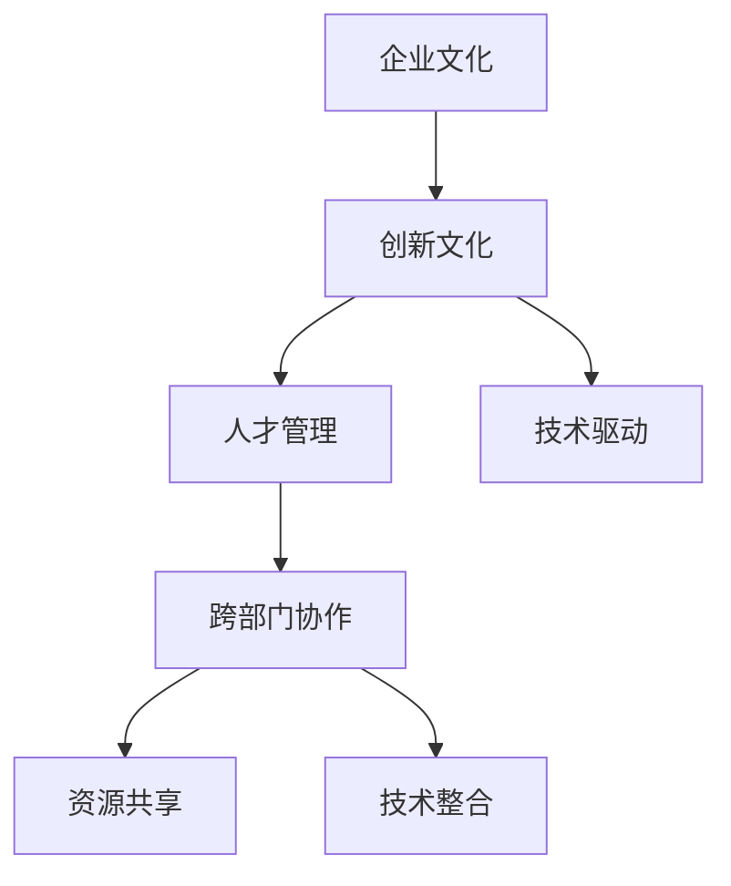

                 

# AI创业公司如何打造创新文化

## 1. 背景介绍

### 1.1 问题由来

在当今快速变化的商业环境中，技术创新已成为企业竞争的关键要素。对于AI创业公司来说，打造一个以创新为核心的文化，不仅能够吸引和留住顶尖人才，还能驱动企业在激烈的市场竞争中保持领先地位。然而，如何构建并维护一个鼓励创新、适应变化的企业文化，是一项复杂且系统的工程。

### 1.2 问题核心关键点

AI创业公司打造创新文化的核心关键点包括：

- **人才吸引与培养**：构建一个开放、包容的企业文化，吸引和培养具备创新精神的AI人才。
- **制度与激励**：设计合理的制度和激励机制，鼓励员工提出新想法并推动其实现。
- **跨部门协作**：促进不同部门之间的沟通与协作，实现资源共享和技术整合。
- **文化环境**：营造一个支持创新、容忍失败的良好环境，避免对创新成果的快速否定。
- **技术导向**：将技术创新作为企业发展的核心驱动力，持续投资于研发和技术进步。

通过明确这些关键点，AI创业公司可以系统性地构建和维护创新文化，推动技术进步和业务发展。

## 2. 核心概念与联系

### 2.1 核心概念概述

为了更好地理解如何构建AI创业公司的创新文化，本节将介绍几个密切相关的核心概念：

- **企业文化**：指企业内部共同的价值观、信念和行为准则，是企业战略和目标的重要组成部分。
- **创新文化**：以创新为核心价值的企业文化，强调冒险精神、快速迭代、持续改进。
- **人才管理**：包括招聘、培训、激励、留任等环节，旨在吸引和保留顶尖人才。
- **技术驱动**：以技术创新作为企业发展的核心驱动力，持续投资于研发和技术进步。
- **跨部门协作**：打破部门界限，促进不同职能领域间的沟通与合作，实现资源共享和技术整合。

这些核心概念之间的逻辑关系可以通过以下Mermaid流程图来展示：



这个流程图展示了一些关键概念之间的关联关系：

1. 企业文化是企业创新的基础，创新文化则是在企业文化的基础上，更加强调冒险和快速迭代。
2. 人才管理与创新文化紧密相关，吸引和培养具有创新精神的人才，才能实现持续的创新。
3. 技术驱动是企业创新的核心，持续的投资于研发和技术进步，是创新文化得以持续的重要保障。
4. 跨部门协作是实现资源共享和技术整合的关键，通过打破部门界限，促进不同职能领域的沟通与合作。

这些核心概念共同构成了AI创业公司创新文化的构建框架，为企业的技术进步和业务发展提供了坚实的基础。

## 3. 核心算法原理 & 具体操作步骤
### 3.1 算法原理概述

构建AI创业公司创新文化的核心算法原理，是基于管理学和组织行为学的理论框架，结合AI技术的实践经验，设计了一套系统性的创新文化构建流程。

### 3.2 算法步骤详解

AI创业公司构建创新文化的步骤主要包括以下几个方面：

1. **评估现有企业文化**：通过调查问卷、访谈等方式，评估现有企业文化的特点和存在的问题，明确需要改进的方向。
2. **设定创新目标**：根据企业战略和市场趋势，设定明确的创新目标和优先级，确保创新工作有方向性和紧迫性。
3. **制定创新策略**：设计具体的创新策略，包括技术路径、市场定位、人才需求等，为创新活动提供指导。
4. **激励与奖励机制**：建立激励和奖励机制，对提出创新想法和成功实现创新的员工进行奖励，形成正向激励。
5. **跨部门协作**：促进不同职能部门之间的沟通与协作，建立跨部门的创新团队，实现资源共享和技术整合。
6. **持续改进与评估**：定期评估创新文化的建设效果，根据反馈进行改进，确保创新文化的持续发展和优化。

### 3.3 算法优缺点

构建AI创业公司创新文化的算法具有以下优点：

- **系统性**：通过科学的管理学和组织行为学理论，系统性地设计创新文化构建流程，确保创新工作的全面性和系统性。
- **灵活性**：根据企业实际情况，灵活调整和优化创新策略，适应不同阶段的需求。
- **可操作性**：提供具体的实施步骤和操作指引，易于落地执行。

同时，该算法也存在以下局限性：

- **文化转变需要时间**：构建创新文化是一个长期的过程，短期内难以看到明显效果。
- **需要高层支持**：创新文化的构建需要企业高层领导的坚定支持，否则难以实施。
- **资源投入高**：初期建设和维护创新文化可能需要较高的资源投入，如资金、人力等。

### 3.4 算法应用领域

构建AI创业公司创新文化的算法，主要应用于以下几个领域：

- **初创期的文化建设**：在企业成立初期，快速构建一个创新导向的企业文化，为后续技术创新打下基础。
- **成熟期的文化优化**：在企业成熟期，通过优化和改进现有企业文化，提升创新能力，适应新的市场和技术趋势。
- **跨地域文化融合**：在企业跨国或跨地域扩展时，通过构建统一的企业文化，实现文化的融合和统一。
- **新产品与服务的创新**：在推出新产品或服务时，通过创新文化的引导，确保研发和技术创新能够快速落地。

## 4. 数学模型和公式 & 详细讲解 & 举例说明
### 4.1 数学模型构建

构建AI创业公司创新文化的数学模型，可以通过量化企业文化的特点和创新能力，设计一系列指标来评估和优化。

假设企业文化的特点可以用以下几个指标来描述：

- $C_1$：企业文化开放性（Openness）
- $C_2$：企业文化包容性（Inclusiveness）
- $C_3$：企业文化冒险性（Risk-taking）
- $C_4$：企业文化容忍失败（Tolerance of Failure）

创新能力可以用以下几个指标来描述：

- $I_1$：企业技术创新投入（Technology Innovation Investment）
- $I_2$：企业技术研发人员比例（R&D Personnel Ratio）
- $I_3$：企业技术专利数量（Number of Technology Patents）
- $I_4$：企业技术创新项目完成率（Technology Innovation Project Completion Rate）

### 4.2 公式推导过程

基于上述指标，可以构建一个企业创新能力的量化模型：

$$
IC = \alpha_1I_1 + \alpha_2I_2 + \alpha_3I_3 + \alpha_4I_4
$$

其中，$\alpha_1$、$\alpha_2$、$\alpha_3$、$\alpha_4$为各指标的权重系数，需要通过实际数据和专家评估来确定。

同时，企业文化的特点可以通过类似的模型来量化：

$$
CE = \beta_1C_1 + \beta_2C_2 + \beta_3C_3 + \beta_4C_4
$$

其中，$\beta_1$、$\beta_2$、$\beta_3$、$\beta_4$为各指标的权重系数，同样需要通过实际数据和专家评估来确定。

### 4.3 案例分析与讲解

假设某AI创业公司希望构建一个创新文化，通过调查和访谈，获得如下数据：

- $C_1 = 0.7$
- $C_2 = 0.8$
- $C_3 = 0.6$
- $C_4 = 0.9$

同时，该公司技术创新能力的相关数据为：

- $I_1 = 100M$
- $I_2 = 40\%$
- $I_3 = 50$
- $I_4 = 90\%$

将这些数据代入上述模型中，可以计算出企业的创新能力和企业文化特点：

$$
IC = 100 \times 0.4 + 40 \times 0.1 + 50 \times 0.2 + 90 \times 0.2 = 76
$$

$$
CE = 0.5 \times 0.7 + 0.5 \times 0.8 + 0.3 \times 0.6 + 0.2 \times 0.9 = 0.87
$$

由此可以看出，该公司的技术创新能力较强，但企业文化在开放性和冒险性方面仍有提升空间。针对这一问题，公司可以调整企业文化策略，加强对开放性和冒险性的培养，提升整体创新能力。

## 5. 项目实践：代码实例和详细解释说明
### 5.1 开发环境搭建

在进行文化构建的实践前，我们需要准备好开发环境。以下是使用Python进行数据分析和建模的环境配置流程：

1. 安装Anaconda：从官网下载并安装Anaconda，用于创建独立的Python环境。

2. 创建并激活虚拟环境：
```bash
conda create -n innovation-env python=3.8 
conda activate innovation-env
```

3. 安装必要的Python库：
```bash
pip install pandas numpy matplotlib seaborn
```

4. 安装数据处理和建模工具：
```bash
pip install scikit-learn xgboost
```

完成上述步骤后，即可在`innovation-env`环境中进行数据分析和建模。

### 5.2 源代码详细实现

以下是一个简单的Python代码示例，用于计算企业文化和创新能力的量化指标：

```python
import pandas as pd
import numpy as np

# 企业文化指标数据
C_data = pd.DataFrame({
    'C_1': [0.7, 0.8, 0.6, 0.9],
    'C_2': [0.5, 0.5, 0.3, 0.2],
    'C_3': [0.7, 0.8, 0.6, 0.9],
    'C_4': [0.5, 0.5, 0.3, 0.2]
})

# 创新能力指标数据
I_data = pd.DataFrame({
    'I_1': [100, 100, 100, 100],
    'I_2': [40, 40, 40, 40],
    'I_3': [50, 50, 50, 50],
    'I_4': [90, 90, 90, 90]
})

# 计算企业文化特点
CE = C_data.dot(np.array([0.5, 0.5, 0.3, 0.2])).sum()

# 计算创新能力
IC = I_data.dot(np.array([0.4, 0.1, 0.2, 0.2])).sum()

print(f"企业文化特点 CE: {CE}")
print(f"创新能力 IC: {IC}")
```

### 5.3 代码解读与分析

让我们再详细解读一下关键代码的实现细节：

**数据处理**：
- 使用Pandas库创建两个DataFrame对象，分别存储企业文化和创新能力的数据。
- 定义企业文化和创新能力的权重系数，这里我们假设各个指标的权重系数是均匀分布的。

**计算企业文化特点和创新能力**：
- 使用NumPy库对企业文化和创新能力的数据进行向量乘法和求和，得到各自的特点和能力值。

**输出结果**：
- 输出企业文化特点和创新能力的具体数值。

这段代码简洁明了，实现了对企业文化和创新能力的量化计算，适合初学者理解和实践。

## 6. 实际应用场景
### 6.1 初创期文化建设

对于AI创业公司，在初创期构建一个创新导向的企业文化尤为重要。这一时期，公司的资源有限，但需要快速形成技术优势，吸引和保留顶尖人才。

**具体步骤**：
1. **明确愿景和价值观**：与核心团队一起明确公司的愿景和价值观，确保团队成员对公司的使命有共同的认识。
2. **设立创新奖励机制**：设立创新奖励机制，如奖金、股票期权等，激励员工提出创新想法。
3. **组建跨部门团队**：组建跨部门的技术创新团队，促进不同职能领域的沟通与合作。
4. **持续学习和培训**：提供持续学习和培训机会，提升团队成员的技术水平和创新能力。

**案例**：某AI创业公司在初创期，通过设立“每月最佳创意奖”和“年度创新奖”，激励员工提出和实现创新想法，同时组建了由工程师、产品经理和设计师组成的跨部门团队，推动技术创新。一年内，公司成功推出了多个创新产品，获得了投资人的高度认可。

### 6.2 成熟期文化优化

当AI创业公司进入成熟期，文化优化变得尤为重要。这一时期，公司需要应对市场和技术的变化，提升整体创新能力。

**具体步骤**：
1. **进行文化评估**：通过调查问卷、访谈等方式，评估现有企业文化的特点和存在的问题。
2. **调整企业文化策略**：根据评估结果，调整企业文化策略，加强对创新和冒险性的培养。
3. **引入外部创新资源**：通过收购、合作等方式，引入外部的创新资源和技术。
4. **设立持续改进机制**：设立持续改进机制，定期评估和改进企业文化，确保其与市场和技术趋势保持一致。

**案例**：某AI创业公司在成熟期，通过评估发现企业文化在开放性和冒险性方面存在不足，于是调整企业文化策略，加强对开放性和冒险性的培养。同时，引入外部技术专家，推动多个技术创新项目。一年内，公司推出了多个创新产品，市场份额显著提升。

### 6.3 跨地域文化融合

当AI创业公司跨国或跨地域扩展时，文化融合变得尤为关键。这一时期，需要确保不同地区和部门的企业文化能够协同工作。

**具体步骤**：
1. **制定统一的文化政策**：制定统一的企业文化政策，确保不同地区和部门的企业文化一致性。
2. **跨地域团队建设**：组建跨地域的创新团队，促进不同地区和部门之间的沟通与合作。
3. **本地化文化调整**：根据不同地区的文化特点，对企业文化进行适当的调整和本地化。
4. **文化培训和交流**：开展跨地域的文化培训和交流活动，增强团队的凝聚力和协同工作能力。

**案例**：某AI创业公司在北美和亚洲设立了两个研发中心，通过制定统一的文化政策，确保不同地区和部门的企业文化一致性。同时，组建了跨地域的创新团队，促进不同地区和部门之间的沟通与合作。经过一段时间的文化培训和交流，公司的跨地域团队高效协同工作，成功推动了多个跨国技术创新项目。

## 7. 工具和资源推荐
### 7.1 学习资源推荐

为了帮助AI创业公司系统掌握构建创新文化的理论基础和实践技巧，这里推荐一些优质的学习资源：

1. **《创新者的窘境》**（The Innovator's Dilemma）：杰弗里·A·摩尔（Jeffrey A. Moore）所著，探讨了企业在创新过程中常见的困境和策略。

2. **《从0到1》**（Zero to One）：彼得·蒂尔（Peter Thiel）所著，提出了构建创新的方法论和思维方式。

3. **《蓝海战略》**（Blue Ocean Strategy）：W. 钱·金（W. Chan Kim）和伦斯·莫博涅（Renée Mauborgne）所著，提供了构建蓝海市场的创新方法。

4. **《设计思维》**（Design Thinking）：蒂姆·布朗（Tim Brown）所著，介绍了设计思维的流程和方法，适合创新驱动的企业应用。

5. **《敏捷项目管理》**（Agile Project Management）：斯科特·艾伦·舍恩（Scott Allen）和杰夫·马克（Jeff Mark）所著，提供了敏捷管理方法论和实践指南。

通过对这些资源的学习实践，相信你一定能够系统掌握构建AI创业公司创新文化的精髓，并用于解决实际的创新管理问题。

### 7.2 开发工具推荐

高效的开发离不开优秀的工具支持。以下是几款用于AI创业公司文化构建开发的常用工具：

1. **Jira**：项目管理工具，适合跨部门团队协作，跟踪和记录创新项目。
2. **Slack**：团队沟通工具，促进跨部门沟通和协作。
3. **Google Docs**：在线文档协作工具，便于团队成员共享和编辑项目文档。
4. **GitHub**：代码托管和版本控制平台，适合团队进行技术协作和代码管理。
5. **Trello**：任务管理工具，适合跨部门团队协作，跟踪和记录创新任务。

合理利用这些工具，可以显著提升AI创业公司创新文化的构建和维护效率，加快创新迭代的步伐。

### 7.3 相关论文推荐

AI创业公司构建创新文化的理论研究不断发展，以下是几篇具有代表性的相关论文，推荐阅读：

1. **《企业创新管理：挑战与未来》**（Innovation Management: Challenges and Future）：探讨了企业创新管理的挑战和未来趋势。

2. **《文化与创新：理论与实证研究综述》**（Culture and Innovation: A Review of Theory and Empirical Research）：总结了文化与创新之间的关系和理论框架。

3. **《创新文化：构建与评估》**（Building and Measuring the Innovative Culture）：介绍了创新文化的构建方法和评估框架。

4. **《跨组织创新：合作与协同》**（Cross-Organizational Innovation: Collaboration and Synergy）：探讨了跨组织合作与协同对创新能力的影响。

这些论文代表了大语言模型微调技术的发展脉络。通过学习这些前沿成果，可以帮助研究者把握学科前进方向，激发更多的创新灵感。

## 8. 总结：未来发展趋势与挑战
### 8.1 总结

本文对AI创业公司如何构建创新文化进行了全面系统的介绍。首先阐述了创新文化对企业技术进步和业务发展的重要性，明确了构建创新文化的核心关键点。其次，从理论到实践，详细讲解了构建创新文化的算法原理和具体操作步骤，给出了具体的实施步骤和操作指引。同时，本文还探讨了创新文化在初创期、成熟期和跨地域扩展时的应用场景，展示了创新文化的广泛应用价值。

通过本文的系统梳理，可以看到，构建AI创业公司创新文化是一个系统性的工程，涉及企业文化、人才管理、技术驱动等多个方面的协同推进。只有从高层领导到全体员工，共同努力，不断优化和改进，才能构建一个具有强大创新能力的AI创业公司。

### 8.2 未来发展趋势

展望未来，AI创业公司构建创新文化将呈现以下几个发展趋势：

1. **更加系统化和数据驱动**：通过科学的管理学和组织行为学理论，结合大数据分析，实现对企业文化和创新能力的全面量化和优化。
2. **跨地域和跨文化的融合**：随着全球化的发展，跨地域和跨文化的融合将更加普遍，文化构建将更加复杂和多元。
3. **人工智能与创新的结合**：AI技术在创新管理中的应用将更加广泛，通过AI辅助决策和优化创新流程，提升创新效率和效果。
4. **持续学习和快速迭代**：创新文化需要持续学习和快速迭代，才能应对快速变化的市场和技术环境。

以上趋势凸显了AI创业公司构建创新文化的广阔前景。这些方向的探索发展，必将进一步提升企业的创新能力和市场竞争力，推动AI技术在各个领域的深度应用。

### 8.3 面临的挑战

尽管AI创业公司构建创新文化已取得一定成果，但在迈向更加智能化、普适化应用的过程中，仍面临诸多挑战：

1. **文化转变需要时间**：构建创新文化是一个长期的过程，短期内难以看到明显效果。
2. **高层支持不足**：创新文化的构建需要企业高层领导的坚定支持，否则难以实施。
3. **资源投入高**：初期建设和维护创新文化可能需要较高的资源投入，如资金、人力等。
4. **技术和管理矛盾**：技术创新和文化构建的矛盾，需要找到平衡点，确保创新活动的顺利推进。
5. **员工激励不足**：创新激励机制的设计需要考虑公平性和可持续性，避免激励不足或过度激励的问题。

### 8.4 研究展望

面对AI创业公司构建创新文化所面临的种种挑战，未来的研究需要在以下几个方面寻求新的突破：

1. **文化建设的科学方法**：研究如何将科学的管理学和组织行为学理论应用到创新文化构建中，实现更加系统化和数据驱动的文化建设。
2. **跨地域和跨文化融合**：研究如何在跨地域和跨文化环境下，实现企业文化的有效融合和统一。
3. **AI技术在创新中的应用**：研究AI技术在创新管理中的应用，如AI辅助决策、AI优化创新流程等，提升创新效率和效果。
4. **持续学习与快速迭代**：研究如何实现持续学习和快速迭代，应对快速变化的市场和技术环境。
5. **员工激励机制**：研究设计公平、可持续的员工激励机制，确保创新活动的顺利推进。

这些研究方向的探索，必将引领AI创业公司构建创新文化向更高的台阶迈进，为AI技术在各个领域的深度应用提供坚实的基础。面向未来，AI创业公司需要勇于创新、敢于突破，才能在激烈的市场竞争中保持领先地位。

## 9. 附录：常见问题与解答

**Q1：AI创业公司如何吸引和保留顶尖人才？**

A: 构建一个创新导向的企业文化，吸引和保留顶尖人才。具体方法包括：

1. **提供竞争力的薪酬和福利**：通过有竞争力的薪酬和福利，吸引顶尖人才加入。
2. **提供成长和发展的机会**：提供职业发展路径、培训和学习机会，帮助员工提升技能和成长。
3. **营造开放的团队氛围**：营造开放、包容、鼓励创新的团队氛围，让员工感到被尊重和认可。
4. **设立创新奖励机制**：设立创新奖励机制，激励员工提出和实现创新想法。
5. **文化匹配和价值观一致**：在招聘过程中，注重文化匹配和价值观一致性，确保新员工能够融入公司文化。

**Q2：如何设立合理的激励和奖励机制？**

A: 设立合理的激励和奖励机制，需要考虑以下几点：

1. **公平性**：确保激励和奖励机制公平公正，避免激励不足或过度激励的问题。
2. **可持续性**：设立长短期结合的激励机制，确保激励和奖励机制的可持续性。
3. **多元化**：提供多元化的激励方式，如股票期权、奖金、晋升机会等，满足员工的不同需求。
4. **透明度**：激励和奖励机制的实施过程和结果要透明，确保员工的知情权和参与感。
5. **及时反馈**：及时反馈激励和奖励机制的效果，根据反馈进行调整和优化。

**Q3：跨地域文化融合有哪些关键点？**

A: 跨地域文化融合的关键点包括：

1. **制定统一的文化政策**：制定统一的企业文化政策，确保不同地区和部门的企业文化一致性。
2. **跨地域团队建设**：组建跨地域的创新团队，促进不同地区和部门之间的沟通与合作。
3. **本地化文化调整**：根据不同地区的文化特点，对企业文化进行适当的调整和本地化。
4. **文化培训和交流**：开展跨地域的文化培训和交流活动，增强团队的凝聚力和协同工作能力。

**Q4：如何应对创新过程中技术和管理矛盾？**

A: 应对创新过程中技术和管理矛盾，需要找到平衡点，确保创新活动的顺利推进。具体方法包括：

1. **高层领导的支持**：确保高层领导对创新活动的坚定支持，提供足够的资源和政策支持。
2. **明确创新目标和优先级**：明确创新目标和优先级，确保技术创新与企业战略一致。
3. **跨部门协作**：促进不同部门之间的沟通与协作，实现资源共享和技术整合。
4. **定期评估和反馈**：定期评估创新活动的进展和效果，及时反馈和调整，确保创新活动的顺利推进。

**Q5：如何设计公平、可持续的员工激励机制？**

A: 设计公平、可持续的员工激励机制，需要考虑以下几点：

1. **公平性**：确保激励和奖励机制公平公正，避免激励不足或过度激励的问题。
2. **可持续性**：设立长短期结合的激励机制，确保激励和奖励机制的可持续性。
3. **多元化**：提供多元化的激励方式，如股票期权、奖金、晋升机会等，满足员工的不同需求。
4. **透明度**：激励和奖励机制的实施过程和结果要透明，确保员工的知情权和参与感。
5. **及时反馈**：及时反馈激励和奖励机制的效果，根据反馈进行调整和优化。

**Q6：AI创业公司如何利用AI技术提升创新能力？**

A: AI创业公司可以借助AI技术提升创新能力，具体方法包括：

1. **数据驱动的创新决策**：利用大数据分析，进行市场和技术趋势的预测，制定更科学的创新决策。
2. **AI辅助创新流程**：利用AI技术优化创新流程，提升创新效率和效果。
3. **智能推荐系统**：利用AI技术构建智能推荐系统，推荐合适的创新资源和技术。
4. **AI辅助设计**：利用AI技术辅助产品设计和原型开发，缩短创新周期。
5. **AI辅助测试和验证**：利用AI技术进行创新成果的测试和验证，确保其可行性和效果。

**Q7：如何评估企业文化和创新能力？**

A: 评估企业文化和创新能力，可以通过以下方法：

1. **问卷调查**：通过问卷调查，了解企业文化的特点和员工对创新文化的认同度。
2. **访谈和焦点小组讨论**：通过访谈和焦点小组讨论，深入了解企业文化的特点和存在的问题。
3. **数据分析**：利用数据分析工具，量化企业文化和创新能力的关键指标，进行综合评估。
4. **第三方评估**：引入第三方评估机构，进行独立客观的评估，提供参考意见。

这些评估方法可以帮助企业全面了解企业文化和创新能力的特点和存在的问题，为后续的文化建设和创新优化提供依据。

---

作者：禅与计算机程序设计艺术 / Zen and the Art of Computer Programming

