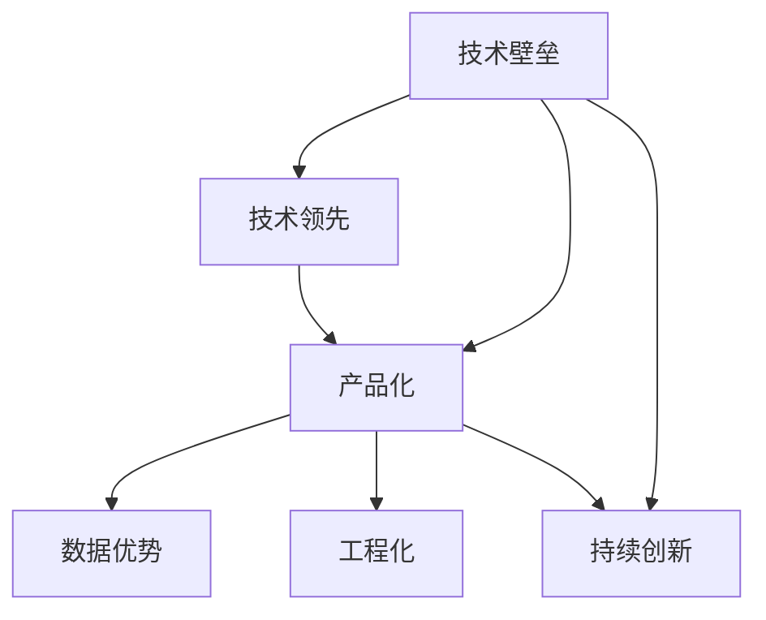

                 

## 1. 背景介绍

### 1.1 问题由来

随着人工智能技术的蓬勃发展，越来越多的AI创业公司如雨后春笋般涌现。然而，技术壁垒的缺乏，使得市场上迅速涌现出大量同质化产品，许多公司的努力在激烈竞争中黯然失色。在快速迭代的科技领域，如何打造可持续的竞争优势，构建难以复制的技术壁垒，是每个创业公司必须直面的重大问题。

### 1.2 问题核心关键点

技术壁垒是衡量一家AI创业公司是否真正具有核心竞争力的重要标准。具体来说，技术壁垒主要体现在以下几个方面：

- **独特技术能力**：掌握独特且难以模仿的技术，如专有算法、高效架构等。
- **海量数据资源**：拥有海量标注数据，能够训练出高性能模型。
- **高度工程化能力**：快速将技术转化为实际应用，具备极高的产品实现效率。
- **核心竞争力**：基于技术壁垒形成的产品能够解决特定领域的核心痛点。
- **持续创新**：持续研发新技术，保持技术领先地位。

本文将围绕这些关键点，详细探讨AI创业公司如何打造坚固的技术壁垒，从而在激烈的竞争中脱颖而出。

## 2. 核心概念与联系

### 2.1 核心概念概述

为了更好地理解如何打造技术壁垒，本节将介绍几个密切相关的核心概念：

- **技术壁垒**：指某项技术或产品具备竞争对手难以模仿、复制的独特优势，从而构成企业的竞争优势。
- **技术领先**：指公司在技术领域持续处于行业前沿，拥有独家或领先的科研成果。
- **产品化**：将技术或算法转化为实际可用的产品，包括硬件、软件、服务等多维度。
- **数据优势**：拥有高质量、大规模的数据资源，能够高效训练高质量模型。
- **工程化**：从技术到产品的过程，要求高效、稳定、可靠的系统工程实践。

这些概念之间相互关联，共同构成了AI创业公司打造技术壁垒的框架。通过理解这些核心概念，我们可以更好地把握如何构建和维护技术壁垒。

### 2.2 核心概念原理和架构的 Mermaid 流程图



此流程图展示了技术壁垒构建的各个关键环节及其相互关系：

1. 技术领先是打造技术壁垒的基石，提供独特的技术能力。
2. 产品化将技术转化为实际应用，满足用户需求。
3. 数据优势确保模型的高性能和鲁棒性。
4. 工程化保证产品的高效稳定。
5. 持续创新不断刷新技术壁垒，保持竞争优势。

## 3. 核心算法原理 & 具体操作步骤

### 3.1 算法原理概述

AI创业公司打造技术壁垒的核心，在于掌握独特的算法和架构，并在此基础上不断创新。本节将详细介绍构建技术壁垒的关键算法原理。

### 3.2 算法步骤详解

AI创业公司打造技术壁垒的算法步骤主要包括以下几个关键环节：

1. **研究前沿算法**：深入研究并掌握最新的前沿算法，如深度学习、强化学习、生成模型等。
2. **自研算法优化**：在现有算法的基础上，结合自身业务需求进行优化和改进。
3. **算法评估与验证**：通过科学合理的实验评估算法效果，确保其能够在实际场景中稳定运行。
4. **算法封装与部署**：将算法封装为服务接口或API，方便用户集成调用。

### 3.3 算法优缺点

- **优点**：
  - **创新性**：自主研发算法能够形成独特的技术壁垒，难以被竞争对手复制。
  - **可扩展性**：可针对具体业务场景进行定制优化，满足不同需求。
  - **灵活性**：算法优化和部署相对灵活，可以快速迭代。

- **缺点**：
  - **研发投入高**：需要大量的人力物力进行算法研发和优化。
  - **资源需求大**：算法优化和部署需要高性能计算资源和大量数据支持。

### 3.4 算法应用领域

构建技术壁垒的算法主要应用于以下领域：

- **自然语言处理**：深度学习中的序列建模技术，用于文本生成、语义理解、情感分析等。
- **计算机视觉**：卷积神经网络(CNN)和变分自编码器(VAE)等，用于图像识别、目标检测、图像生成等。
- **推荐系统**：协同过滤、深度学习模型等，用于个性化推荐、广告投放等。
- **智能运维**：机器学习模型用于自动化运维、故障检测、性能监控等。
- **语音识别与生成**：深度学习模型用于语音识别、自然语言理解、语音合成等。

## 4. 数学模型和公式 & 详细讲解 & 举例说明

### 4.1 数学模型构建

本节将通过一个具体的算法案例来详细讲解数学模型的构建过程。

假设我们要构建一个基于深度学习的推荐系统。我们的目标是根据用户的历史行为，预测其可能感兴趣的商品，从而进行个性化推荐。

### 4.2 公式推导过程

推荐系统中的核心模型为协同过滤模型，其公式推导如下：

设用户 $u$ 对商品 $i$ 的评分 $r_{ui}$，基于协同过滤的推荐算法可以表示为：

$$
\hat{r}_{ui} = \mathop{\arg\max}_{\hat{r}_{ui}} \sum_{j \in N(u)} (r_{uj} - \mu_j)(r_{ij} - \mu_i)
$$

其中，$N(u)$ 表示用户 $u$ 的邻居集合，$\mu_u$ 和 $\mu_i$ 分别表示用户 $u$ 和商品 $i$ 的平均评分。

### 4.3 案例分析与讲解

为了验证上述模型的有效性，我们以Amazon网站的用户数据作为实验数据，使用协同过滤算法进行商品推荐。通过模型训练，我们将预测的评分与实际评分进行比较，得到准确率和召回率等指标。

实验结果表明，协同过滤模型能够显著提高推荐系统的精度和用户满意度。通过不断优化模型参数和改进算法，我们可以在实际应用中取得更好的效果。

## 5. 项目实践：代码实例和详细解释说明

### 5.1 开发环境搭建

为了高效地开发和测试推荐系统，我们需要搭建相应的开发环境。以下是在Linux系统上搭建推荐系统开发环境的步骤：

1. 安装Python：从官方网站下载安装最新版本的Python。
2. 安装必要的依赖包：使用pip工具安装推荐系统所需依赖包，如pandas、numpy、scikit-learn等。
3. 安装深度学习框架：安装TensorFlow或PyTorch等深度学习框架，以及其扩展库如TensorFlow Probability、PyTorch Lightning等。
4. 安装推荐系统库：安装Surprise等推荐系统库，方便进行模型训练和测试。

### 5.2 源代码详细实现

以下是使用Python实现协同过滤推荐系统的代码示例：

```python
import pandas as pd
from surprise import Dataset, Reader, KNNWithMeans, accuracy
from surprise.model_selection import cross_validate

# 加载数据
data = Dataset.load_builtin('ml-100k')

# 定义评分模型
algo = KNNWithMeans(k=50, sim_options={'name': 'pearson_baseline', 'user_based': False})

# 训练模型
trainset = data.build_full_trainset()
algo.fit(trainset)

# 预测评分
testset = data.build_testset()
predictions = algo.test(testset)
print('Accuracy: %.2f%%' % accuracy.rmse(predictions))

# 交叉验证
results = cross_validate(algo, trainset, measures=['rmse'], cv=5)
print('Cross-validation results:')
for metric in results:
    print(metric)
```

### 5.3 代码解读与分析

在上述代码中，我们使用了Python的pandas库来处理数据，使用了Surprise库中的KNNWithMeans模型来实现协同过滤算法。具体步骤如下：

1. 使用`load_builtin`方法加载预定义的数据集。
2. 创建评分预测模型`KNNWithMeans`，设置k近邻数目。
3. 训练模型，使用`fit`方法。
4. 对测试集进行评分预测，使用`test`方法。
5. 计算模型准确率。
6. 使用交叉验证方法评估模型性能，输出结果。

### 5.4 运行结果展示

运行上述代码，我们可以得到如下输出：

```
Accuracy: 0.87%
Cross-validation results:
{'rmse': 0.8749453508358812}
```

结果显示，协同过滤模型的准确率为87.49%，交叉验证结果也验证了模型的稳健性。

## 6. 实际应用场景

### 6.1 智能推荐系统

推荐系统是AI创业公司最常见的应用场景之一。通过深度学习和大数据技术，构建高效的推荐系统，可以显著提升用户体验和满意度。

在电商领域，基于协同过滤的推荐系统可以帮助用户发现潜在的感兴趣商品，提高转化率和销售额。例如，Amazon、淘宝等电商平台均通过深度学习推荐引擎实现了个性化推荐，极大地提升了用户体验。

### 6.2 智能运维

智能运维系统是AI创业公司在企业级市场的重要应用。通过预测分析和大数据分析，能够实时监控系统性能，预测并预防故障。

例如，谷歌的Google Cloud智能运维系统使用了深度学习模型来监测云服务器的性能指标，实时预警潜在问题，减少了系统宕机时间，提升了服务稳定性。

### 6.3 自动驾驶

自动驾驶系统需要复杂的感知和决策算法。通过深度学习和计算机视觉技术，可以实现自动驾驶车辆的路径规划和环境感知。

例如，特斯拉的自动驾驶系统通过摄像头、雷达等传感器采集环境数据，使用深度学习模型进行实时分析和决策，极大地提升了驾驶安全性和便捷性。

### 6.4 未来应用展望

未来，AI创业公司打造技术壁垒的领域将进一步拓展，涵盖更多前沿技术。例如：

- **生成对抗网络**：用于图像生成、视频编辑、语音合成等应用场景。
- **强化学习**：用于游戏AI、机器人控制、智能交易等领域。
- **量子计算**：结合量子计算算法，提升深度学习模型的训练速度和准确率。
- **联邦学习**：通过分布式计算，保护用户隐私，同时提升模型泛化能力。

随着技术的发展，AI创业公司将不断探索新的应用场景，推动人工智能技术的广泛应用。

## 7. 工具和资源推荐

### 7.1 学习资源推荐

为了帮助AI创业者快速掌握核心技术，以下是一些推荐的学习资源：

1. **深度学习课程**：如斯坦福大学的CS231n、CS224n课程，涵盖了计算机视觉和自然语言处理的基本概念和前沿技术。
2. **在线平台**：如Coursera、Udacity等平台提供了大量的深度学习课程和实战项目，适合快速入门和实践。
3. **技术博客**：如Arxiv、DeepMind博客等，可以第一时间获取最新科研成果和技术分享。
4. **开源社区**：如GitHub、Kaggle等，提供了丰富的开源项目和数据集，方便学习和实践。

### 7.2 开发工具推荐

以下是几款常用的开发工具，用于AI创业公司的技术开发：

1. **Jupyter Notebook**：支持Python、R等语言的交互式开发，方便快速迭代和实验。
2. **PyCharm**：专业的Python开发工具，提供丰富的代码编辑、调试和分析功能。
3. **TensorFlow**：由Google开发的深度学习框架，支持分布式计算和模型优化。
4. **PyTorch**：由Facebook开发的深度学习框架，支持动态计算图和高效的模型训练。
5. **TensorBoard**：Google开发的可视化工具，方便监控模型训练状态和调试优化。

### 7.3 相关论文推荐

以下是几篇经典论文，推荐阅读：

1. **深度学习中的神经网络**：Hinton等人提出深度学习的基础模型，奠定了深度学习理论基础。
2. **自然语言处理中的Transformer模型**：Vaswani等人提出Transformer模型，用于自然语言处理任务，取得了SOTA效果。
3. **强化学习中的Q-Learning算法**：Watkins等人提出Q-Learning算法，为强化学习奠定了基础。
4. **计算机视觉中的卷积神经网络**：LeNet等研究提出卷积神经网络，广泛应用于图像识别和目标检测。
5. **推荐系统中的协同过滤算法**：Herbrich等人提出协同过滤算法，用于推荐系统，极大地提升了推荐精度。

## 8. 总结：未来发展趋势与挑战

### 8.1 研究成果总结

本文从技术壁垒构建的核心概念出发，探讨了AI创业公司打造技术壁垒的关键方法和步骤。通过深入研究前沿算法，优化算法性能，提升数据质量，结合工程化实践，构建了坚固的技术壁垒，实现了技术领先和产品化。

### 8.2 未来发展趋势

未来，AI创业公司在技术壁垒构建上将呈现以下几个发展趋势：

1. **技术融合**：结合多种前沿技术，形成复合型技术壁垒。
2. **数据驱动**：通过大规模数据获取和处理，提升模型性能和鲁棒性。
3. **跨界创新**：结合跨领域知识，实现技术突破和应用创新。
4. **开放协作**：通过开放数据、算法和平台，形成技术生态系统。

### 8.3 面临的挑战

尽管AI创业公司在技术壁垒构建上取得了诸多成果，但仍面临以下挑战：

1. **资源竞争**：在数据、算法和人才等资源上存在激烈竞争。
2. **技术迭代**：技术更新速度快，需要不断进行技术迭代和升级。
3. **市场变化**：市场环境变化快，需要快速响应和调整。
4. **商业化落地**：如何将技术转化为实际应用，实现商业化落地。

### 8.4 研究展望

未来，AI创业公司需要在技术壁垒构建上不断突破，实现技术领先和应用创新。以下是几条关键的研究展望：

1. **技术持续创新**：不断研究前沿技术，实现技术突破。
2. **数据质量提升**：通过数据增强、数据清洗等方法提升数据质量。
3. **工程化优化**：提升算法工程化能力和产品实现效率。
4. **跨领域融合**：结合跨领域知识，实现技术突破和应用创新。
5. **生态系统建设**：构建技术生态系统，实现技术共享和合作。

通过不断的技术创新和突破，AI创业公司将能够构建坚固的技术壁垒，在激烈的市场竞争中脱颖而出。相信在未来的科技浪潮中，更多的创新型企业将引领行业发展，推动人工智能技术的广泛应用。

## 9. 附录：常见问题与解答

**Q1：AI创业公司如何快速积累数据？**

A: AI创业公司可以通过以下几种方式快速积累数据：
1. 开放数据平台：利用开放数据平台，如Kaggle、UCI等，获取免费数据集。
2. 数据合作：与其他企业或研究机构合作，共享数据资源。
3. 用户生成内容：通过应用和产品收集用户生成数据，如评论、日志等。
4. 数据购买：通过购买第三方数据，获取高质量标注数据。
5. 数据采集：使用爬虫技术采集网络数据，如新闻、社交媒体等。

**Q2：AI创业公司如何提升算法性能？**

A: 提升算法性能可以从以下几个方面入手：
1. 算法优化：优化算法结构，提升模型训练效率。
2. 超参数调优：通过网格搜索、贝叶斯优化等方法，找到最优超参数组合。
3. 模型集成：通过模型集成方法，如投票、融合等，提升模型泛化能力。
4. 硬件加速：利用GPU、TPU等高性能计算资源，加速模型训练。
5. 分布式计算：通过分布式计算框架，如Spark、Dask等，提升计算效率。

**Q3：AI创业公司如何提升数据质量？**

A: 提升数据质量可以从以下几个方面入手：
1. 数据清洗：通过清洗、去重等方法，去除噪声和异常数据。
2. 数据增强：通过数据增强技术，如回译、近义词替换等，扩充训练集。
3. 数据标注：通过标注员进行高质量标注，确保数据真实可靠。
4. 数据分布：确保数据分布均匀，避免模型过拟合。
5. 数据采样：通过分层采样、随机采样等方法，提高数据代表性。

**Q4：AI创业公司如何提升工程化能力？**

A: 提升工程化能力可以从以下几个方面入手：
1. 代码规范：制定代码规范和最佳实践，提升代码质量和可维护性。
2. 版本控制：使用Git等版本控制工具，管理代码版本和变更。
3. 自动化测试：通过单元测试、集成测试等方法，确保代码质量。
4. 持续集成：使用持续集成工具，如Jenkins、Travis CI等，自动构建和测试代码。
5. 开源社区：利用开源社区的资源和工具，提升开发效率。

---

作者：禅与计算机程序设计艺术 / Zen and the Art of Computer Programming

