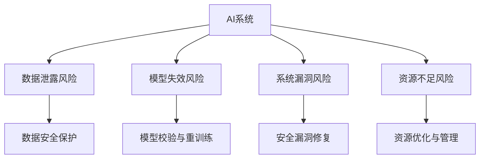

                 

# AI创业公司的技术风险管理

## 1. 背景介绍

### 1.1 问题由来

近年来，人工智能(AI)技术的应用日益广泛，AI创业公司如雨后春笋般涌现，推动了各行各业的智能化转型。然而，技术的高速发展也带来了诸多挑战，特别是在技术风险管理方面。AI系统的复杂性、多样性和不确定性使得风险管理变得更加复杂，需要系统性的方法和工具来应对。

### 1.2 问题核心关键点

AI创业公司面临的技术风险包括但不限于：算法偏见、数据泄露、模型失效、系统漏洞、资源不足等。这些问题可能对公司运营造成重大影响，甚至导致公司倒闭。因此，技术风险管理成为AI创业公司成功的关键因素之一。

### 1.3 问题研究意义

有效管理技术风险不仅能保障公司稳定运营，还能提升公司的市场竞争力。通过对技术风险的全面评估和应对，AI创业公司可以更好地应对外部环境变化，抓住市场机会，实现可持续发展。

## 2. 核心概念与联系

### 2.1 核心概念概述

为更好地理解AI创业公司的技术风险管理，本节将介绍几个密切相关的核心概念：

- AI系统：包括机器学习模型、深度学习模型、自然语言处理(NLP)模型等，用于解决特定问题或实现特定目标的算法。
- 数据泄露风险：指公司数据在传输、存储、处理过程中，未经授权被非法获取或篡改的风险。
- 模型失效风险：指模型在实际应用中无法正常工作，导致决策失误或结果错误的风险。
- 系统漏洞风险：指AI系统中的安全漏洞被攻击者利用，造成数据泄露、系统崩溃等风险。
- 资源不足风险：指公司资源（如计算能力、存储容量、人力资源等）无法满足AI系统运行的需求，影响系统性能的风险。

这些核心概念之间的逻辑关系可以通过以下Mermaid流程图来展示：



这个流程图展示了几大技术风险与相应的应对措施之间的联系：

1. AI系统通过数据泄露风险、模型失效风险、系统漏洞风险和资源不足风险等影响，影响其运行稳定性。
2. 通过数据安全保护、模型校验与重训练、安全漏洞修复和资源优化与管理等措施，降低风险，保障系统稳定运行。

## 3. 核心算法原理 & 具体操作步骤

### 3.1 算法原理概述

AI创业公司的技术风险管理通常包括风险评估、风险监控、风险应对等几个步骤。其核心思想是通过系统化的评估和监控机制，及时发现并处理风险，确保AI系统的稳定运行。

### 3.2 算法步骤详解

**Step 1: 风险评估**

- **风险识别**：对AI系统进行全面的安全检查，包括数据安全、模型性能、系统漏洞等方面。
- **风险分析**：利用定量和定性分析方法，评估风险的可能性和影响程度。
- **风险分类**：将识别和分析出的风险按严重程度和影响范围进行分类，确定优先级。

**Step 2: 风险监控**

- **关键指标监测**：实时监测AI系统的关键性能指标，如模型准确率、训练时间、内存占用等。
- **异常检测**：利用机器学习算法或规则引擎，检测异常行为或数据，及时预警。
- **日志记录**：记录系统运行日志，用于事后分析和事故追踪。

**Step 3: 风险应对**

- **应急响应**：制定应急预案，明确风险发生时的应急措施。
- **修复与优化**：对识别出的风险进行修复和优化，如数据加密、模型重训练、安全加固等。
- **资源调整**：根据系统负载，动态调整计算资源和存储容量，保障系统稳定运行。

### 3.3 算法优缺点

AI创业公司的技术风险管理具有以下优点：
1. 系统化：通过风险评估、监控和应对等系统化手段，全面管理风险。
2. 实时性：实时监控和及时响应，保障系统稳定性。
3. 预防性：通过风险评估和预防性措施，避免潜在风险。

同时，该方法也存在一些局限性：
1. 复杂性：风险评估和监控过程涉及多个环节，需要综合考虑多种因素，操作复杂。
2. 成本高：实施全面风险管理需要大量的资源投入，尤其是高阶人才和技术工具。
3. 依赖技术：风险管理和监控效果依赖于算法和工具的准确性和有效性，需要持续优化。

### 3.4 算法应用领域

AI创业公司的技术风险管理不仅适用于AI系统本身的风险管理，还适用于整个公司的技术生态系统。例如：

- **数据管理**：数据存储、传输、处理过程中的安全风险管理。
- **平台安全**：API接口、云服务、微服务等平台的安全风险管理。
- **运维监控**：实时监控系统性能、资源使用情况，及时发现和处理故障。
- **隐私合规**：确保公司数据处理符合GDPR等隐私保护法规。

## 4. 数学模型和公式 & 详细讲解 & 举例说明（备注：数学公式请使用latex格式，latex嵌入文中独立段落使用 $$，段落内使用 $)
### 4.1 数学模型构建

AI创业公司的技术风险管理涉及多方面的数学模型，以下是几个关键模型的构建：

**风险评估模型**：
$$
Risk = \sum_{i=1}^n (P_i \times I_i)
$$
其中 $Risk$ 为风险，$P_i$ 为第 $i$ 种风险的概率，$I_i$ 为第 $i$ 种风险的影响程度。

**异常检测模型**：
$$
D(x) = \sum_{i=1}^m |x_i - \mu_i|
$$
其中 $D(x)$ 为数据点 $x$ 与均值 $\mu_i$ 之间的距离，$m$ 为数据特征的数量。

**模型性能评估**：
$$
Accuracy = \frac{TP + TN}{TP + TN + FP + FN}
$$
其中 $Accuracy$ 为模型准确率，$TP$ 为真正例，$TN$ 为真负例，$FP$ 为假正例，$FN$ 为假负例。

### 4.2 公式推导过程

以上数学模型均可通过经典的统计学方法和机器学习算法进行推导和应用。以异常检测模型为例，我们通过计算数据点 $x$ 与均值 $\mu_i$ 之间的距离，来识别数据集中的异常点。

在实践中，可以利用K-means聚类、高斯分布拟合等方法进行数据特征的建模，并利用均值、方差等统计量计算距离。在K-means算法中，将数据点 $x$ 分为 $k$ 个类别，通过计算数据点与每个类别的距离，判断是否为异常点。

### 4.3 案例分析与讲解

假设一家AI创业公司正在开发一款语音识别应用。在风险评估过程中，发现数据泄露和模型失效是主要风险。数据泄露风险为 $P=0.1$，影响程度为 $I=10^6$；模型失效风险为 $P=0.2$，影响程度为 $I=10^5$。则总风险为：

$$
Risk = P_{泄露} \times I_{泄露} + P_{失效} \times I_{失效} = 0.1 \times 10^6 + 0.2 \times 10^5 = 11 \times 10^5
$$

为应对这些风险，公司可以采取以下措施：
- 加强数据加密和访问控制，降低数据泄露风险。
- 定期进行模型校验和重训练，避免模型失效风险。

## 5. 项目实践：代码实例和详细解释说明

### 5.1 开发环境搭建

在进行技术风险管理实践前，我们需要准备好开发环境。以下是使用Python进行K-means算法和异常检测的开发环境配置流程：

1. 安装Anaconda：从官网下载并安装Anaconda，用于创建独立的Python环境。

2. 创建并激活虚拟环境：
```bash
conda create -n py_env python=3.7 
conda activate py_env
```

3. 安装必要的Python库：
```bash
pip install numpy scipy scikit-learn matplotlib jupyter notebook
```

4. 安装K-means库：
```bash
pip install scikit-learn
```

完成上述步骤后，即可在`py_env`环境中开始代码实现。

### 5.2 源代码详细实现

这里我们以K-means算法为例，给出实现异常检测的Python代码：

```python
import numpy as np
from sklearn.cluster import KMeans
from sklearn.datasets import make_blobs

# 生成随机数据
X, _ = make_blobs(n_samples=1000, centers=3, n_features=2, random_state=42)

# 训练K-means模型
kmeans = KMeans(n_clusters=3, random_state=42)
kmeans.fit(X)

# 预测数据
y_pred = kmeans.predict(X)

# 计算数据点与各簇的平均距离
distances = np.sqrt((X - kmeans.cluster_centers_[kmeans.labels_]) ** 2).sum(axis=1)

# 找出异常点
outliers = np.where(distances > np.median(distances) * 1.5)[0]

print("异常点数：", len(outliers))
print("异常点：", X[outliers])
```

### 5.3 代码解读与分析

让我们再详细解读一下关键代码的实现细节：

**make_blobs函数**：
- 生成1000个数据点，分为3个簇，每个簇2维。

**KMeans模型**：
- 训练K-means模型，将其聚类为3个簇。

**预测和距离计算**：
- 预测数据点属于哪个簇。
- 计算数据点与每个簇的平均距离，得到离群点。

**异常点判断**：
- 根据中位数原则，判断是否为异常点。

可以看到，K-means算法的实现简单高效，通过离群点判断机制，可以及时发现数据集中的异常点。在实际应用中，可以根据具体问题，选择不同的算法和指标进行风险评估和监控。

## 6. 实际应用场景

### 6.1 智能客服系统

AI创业公司可以利用技术风险管理方法，构建稳定的智能客服系统。通过风险评估和监控，确保系统不受到数据泄露、模型失效等风险的影响，提高客服效率和用户体验。

### 6.2 金融数据分析

金融数据分析应用广泛，但数据敏感、风险高。AI创业公司可以采用技术风险管理方法，确保数据安全和模型性能，避免潜在的经济损失。

### 6.3 医疗健康系统

医疗健康系统对数据隐私和模型准确性要求极高。AI创业公司通过技术风险管理，保障患者数据安全，提升诊断准确率，提供高质量的医疗服务。

### 6.4 未来应用展望

随着AI技术的不断进步，技术风险管理的应用场景将更加丰富。未来，技术风险管理方法将进一步拓展，应用于更多行业和场景中，助力企业应对不确定性，实现可持续发展。

## 7. 工具和资源推荐

### 7.1 学习资源推荐

为帮助开发者掌握技术风险管理的方法和工具，这里推荐一些优质的学习资源：

1. 《AI安全：从原理到实践》系列博文：深入讲解AI系统中的安全问题及其应对方法。

2. Kaggle竞赛：参加Kaggle的机器学习竞赛，实战中学习风险管理技巧。

3. 《机器学习实战》书籍：介绍了机器学习算法的实现和优化，有助于理解异常检测等技术。

4. 《数据科学实战》书籍：涵盖了数据清洗、异常检测、模型评估等方面的实用技巧。

5. Coursera和Udacity等在线课程：提供从入门到高级的AI技术培训，系统学习风险管理知识。

通过对这些资源的学习实践，相信你一定能够掌握技术风险管理的基本技能，并用于解决实际的AI系统问题。

### 7.2 开发工具推荐

高效的开发离不开优秀的工具支持。以下是几款用于技术风险管理开发的常用工具：

1. Jupyter Notebook：用于数据处理、算法实现和结果展示，适合交互式编程。

2. TensorBoard：监控AI系统的运行状态，可视化模型性能和训练过程。

3. Weights & Biases：实验跟踪工具，记录和分析模型训练过程，优化超参数。

4. PyTorch和TensorFlow：深度学习框架，支持多种算法的实现和优化。

5. Apache Kafka：数据流处理系统，用于实时数据采集和传输。

6. ELK Stack：日志管理系统，用于记录和分析系统日志。

合理利用这些工具，可以显著提升技术风险管理的开发效率，加快创新迭代的步伐。

### 7.3 相关论文推荐

技术风险管理的研究始于学界的持续研究。以下是几篇奠基性的相关论文，推荐阅读：

1. "A Survey of Security and Privacy in Deep Learning"：概述了深度学习中的安全与隐私问题及其应对方法。

2. "Robustness and Adversarial Examples in Deep Learning"：讨论了深度学习模型的鲁棒性和对抗攻击问题，提出了一系列防御方法。

3. "Data Breaches: How to Keep Your Business Safe"：介绍了数据泄露的常见原因和应对策略，帮助企业保障数据安全。

4. "Machine Learning in Finance: From Credit Scoring to Predictive Analytics"：介绍了机器学习在金融领域的实际应用，讨论了相关的风险管理问题。

5. "Healthcare AI: Challenges, Risks, and Benefits"：讨论了AI在医疗领域的潜在风险和伦理问题，提出了相应的解决策略。

这些论文代表了大语言模型微调技术的发展脉络。通过学习这些前沿成果，可以帮助研究者把握学科前进方向，激发更多的创新灵感。

## 8. 总结：未来发展趋势与挑战

### 8.1 总结

本文对AI创业公司的技术风险管理进行了全面系统的介绍。首先阐述了技术风险管理的背景和意义，明确了风险管理在保障AI系统稳定运营中的重要性。其次，从原理到实践，详细讲解了风险评估、监控和应对的关键步骤，给出了技术风险管理任务开发的完整代码实例。同时，本文还广泛探讨了技术风险管理方法在智能客服、金融分析、医疗健康等多个领域的应用前景，展示了技术风险管理方法的巨大潜力。最后，本文精选了技术风险管理的各类学习资源，力求为读者提供全方位的技术指引。

通过本文的系统梳理，可以看到，技术风险管理在AI创业公司中的应用不可或缺。通过系统性的评估和监控机制，AI创业公司可以更好地应对外部环境变化，抓住市场机会，实现可持续发展。未来，伴随AI技术的不断演进，技术风险管理方法也将进一步完善和优化，成为AI系统成功的重要保障。

### 8.2 未来发展趋势

展望未来，AI创业公司的技术风险管理将呈现以下几个发展趋势：

1. 数据隐私保护。随着数据泄露风险的增加，数据隐私保护将成为技术风险管理的重要组成部分。企业将采用更严格的隐私保护措施，如数据加密、差分隐私等，确保数据安全。

2. 自动化风险监控。利用机器学习算法和大数据分析技术，实现自动化的风险监控和预警。AI系统将实时检测和报告异常行为，减少人工干预。

3. 模型鲁棒性增强。研究如何提高AI模型的鲁棒性，避免对抗攻击和数据扰动对模型的影响。在模型设计和训练过程中，加入鲁棒性测试和加固。

4. 跨领域风险管理。随着AI技术应用的拓展，技术风险管理将覆盖更多领域和场景。AI创业公司需要建立跨领域的风险管理框架，应对多样化的风险类型。

5. 多模型协同优化。技术风险管理将不再是单一模型的孤立风险管理，而是多模型协同优化的综合管理。通过联合优化，提升整体系统的鲁棒性和可靠性。

6. 风险治理和合规。建立健全的风险治理机制和合规框架，确保技术风险管理的有效性，避免法律和伦理风险。

以上趋势凸显了AI创业公司技术风险管理的广阔前景。这些方向的探索发展，必将进一步提升AI系统的性能和应用范围，为构建安全、可靠、可控的智能系统铺平道路。面向未来，技术风险管理需要与其他人工智能技术进行更深入的融合，如知识表示、因果推理、强化学习等，多路径协同发力，共同推动自然语言理解和智能交互系统的进步。

### 8.3 面临的挑战

尽管技术风险管理已经取得了瞩目成就，但在迈向更加智能化、普适化应用的过程中，它仍面临着诸多挑战：

1. 数据隐私保护难度大。在数据驱动的AI系统中，数据隐私保护变得越来越复杂，如何平衡隐私保护和数据利用是一大难题。

2. 模型鲁棒性仍有提升空间。尽管模型鲁棒性已有所改进，但面对更复杂、更高级的攻击手段，模型仍易受影响。

3. 资源优化成本高。AI系统对计算资源和存储资源的需求大，优化资源配置的成本高，且效果难以量化。

4. 技术风险的动态性。技术风险管理需要不断更新模型和算法，以应对不断变化的风险环境。

5. 技术人才短缺。AI系统的技术风险管理涉及多学科知识，对人才的需求多样且紧缺，难以找到合适的专业人才。

6. 法规合规复杂。不同国家和地区对数据保护和隐私合规的要求不同，AI创业公司需要投入大量资源进行合规。

正视技术风险管理面临的这些挑战，积极应对并寻求突破，将是大语言模型微调走向成熟的必由之路。相信随着学界和产业界的共同努力，这些挑战终将一一被克服，技术风险管理必将在构建安全、可靠、可控的智能系统中扮演越来越重要的角色。

### 8.4 研究展望

未来，技术风险管理的研究方向将更加深入和广泛。AI创业公司需要在以下几个方面寻求新的突破：

1. 探索新的隐私保护技术。如联邦学习、差分隐私等，在保护数据隐私的同时，仍能进行模型训练和优化。

2. 研发鲁棒性更强的新算法。如对抗训练、鲁棒回归等，提高模型对攻击的抵抗力和鲁棒性。

3. 融合多种风险管理技术。如因果推断、强化学习等，增强系统的整体鲁棒性和灵活性。

4. 构建综合的风险管理平台。将数据管理、模型训练、风险监控等环节整合，形成一体化的风险管理解决方案。

5. 完善风险管理的法律法规。与政府、行业组织合作，制定规范化的风险管理标准和操作指南。

这些研究方向的探索，必将引领技术风险管理技术迈向更高的台阶，为构建安全、可靠、可控的智能系统铺平道路。面向未来，技术风险管理需要与其他人工智能技术进行更深入的融合，如知识表示、因果推理、强化学习等，多路径协同发力，共同推动自然语言理解和智能交互系统的进步。

## 9. 附录：常见问题与解答

**Q1：技术风险管理如何平衡数据隐私和安全？**

A: 技术风险管理中，数据隐私保护和数据利用是一对矛盾。平衡这两者，需要采取以下策略：
1. 数据脱敏：对敏感数据进行脱敏处理，减少数据泄露风险。
2. 差分隐私：在数据收集和处理过程中加入噪声，保护用户隐私。
3. 联邦学习：在多节点分布式环境中，通过本地模型更新，保护数据隐私。
4. 访问控制：严格控制数据的访问权限，确保只有授权人员才能访问敏感数据。

**Q2：如何提高AI模型的鲁棒性？**

A: 提高AI模型的鲁棒性需要综合考虑以下几个方面：
1. 对抗训练：通过引入对抗样本，训练模型对攻击的抵抗能力。
2. 鲁棒回归：利用鲁棒回归算法，减少模型对异常数据的敏感性。
3. 特征选择：通过选择鲁棒性更强的特征，降低模型对异常值和噪声的依赖。
4. 模型集成：利用集成学习，提升模型的鲁棒性和泛化能力。

**Q3：如何优化AI系统的资源使用？**

A: 优化AI系统的资源使用需要从多个维度进行考虑：
1. 资源分配：根据AI系统负载，动态调整计算资源和存储容量，避免资源浪费。
2. 资源压缩：采用模型压缩和稀疏化存储等技术，减少资源消耗。
3. 多节点分布式计算：利用分布式计算框架，提高系统的计算效率。
4. 资源池管理：建立资源池管理机制，优化资源分配和调度。

**Q4：技术风险管理如何应对不断变化的风险环境？**

A: 技术风险管理需要不断更新模型和算法，以应对不断变化的风险环境：
1. 实时监控：实时监测AI系统的运行状态，及时发现异常行为和风险。
2. 动态优化：根据系统负载和风险变化，动态调整模型参数和超参数。
3. 持续改进：引入自动化和智能化工具，持续优化风险管理策略和模型。
4. 风险评估：定期进行风险评估，识别和应对潜在风险。

**Q5：技术风险管理如何实现跨领域应用？**

A: 实现跨领域的技术风险管理，需要综合考虑不同领域的风险特性和应用场景：
1. 通用框架：构建通用的技术风险管理框架，支持不同领域的应用。
2. 领域定制：根据具体领域的特点，定制化风险评估和监控策略。
3. 数据融合：利用多源数据，构建全面的风险管理模型。
4. 跨领域协同：与其他领域的风险管理技术进行协同，提升整体系统的鲁棒性。

通过这些方法和策略，AI创业公司可以更好地应对不同领域的技术风险，保障系统的稳定运行。总之，技术风险管理需要开发者根据具体问题，不断迭代和优化模型、数据和算法，方能得到理想的效果。

---

作者：禅与计算机程序设计艺术 / Zen and the Art of Computer Programming

