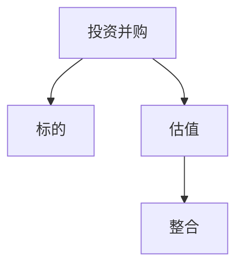

                 

# AI创业公司的投资并购策略：标的选择、估值与整合

AI领域的投资并购日益成为各大巨头和初创公司争相争夺的焦点。本文将深入探讨AI创业公司在投资并购过程中标的选择、估值以及整合的策略与技巧。通过全面剖析这些核心环节，帮助AI创业者更好地制定有效的投资并购策略，加速企业发展。

## 1. 背景介绍

随着AI技术的快速发展，越来越多的创业公司在AI领域取得了突破性进展，吸引了大量投资者的关注。AI领域的投资并购已成为企业扩张和资源整合的重要手段，尤其是在云计算、大数据、物联网、自然语言处理等热门领域。然而，标的选择、估值与整合是并购过程中最具挑战性的环节，本文将围绕这些核心问题进行深入分析。

## 2. 核心概念与联系

### 2.1 核心概念概述

为更好地理解AI创业公司的投资并购策略，本节将介绍几个关键概念：

- **投资并购（M&A）**：指企业通过收购或合并其他企业，以实现资源的重新整合和战略目标的达成。在AI领域，投资并购更是快速扩展技术实力和市场份额的有效手段。
- **标的（Target）**：被并购或收购的企业或其关键资产。AI领域的标的往往具有先进的AI技术、海量的数据集、核心的AI团队等资源。
- **估值（Valuation）**：确定一个企业的价值，是投资并购过程中最重要的决策之一。估值需要考虑市场环境、企业财务状况、技术实力等多方面因素。
- **整合（Integration）**：并购后，需要将被并购企业的资源与收购企业进行有效整合，以实现1+1>2的效果。AI技术的发展离不开跨领域、跨企业的协作，整合显得尤为重要。

这些核心概念之间的逻辑关系可以通过以下Mermaid流程图来展示：



这个流程图展示了投资并购过程中标的选择、估值与整合的逻辑关系：

1. 投资并购是企业进行资源重组和扩张的起点。
2. 选择标的是并购过程中的关键，决定企业的战略方向。
3. 估值是在确定标的之后，对企业进行价值评估的重要环节。
4. 整合是并购后资源重组的关键，影响并购的最终效果。

## 3. 核心算法原理 & 具体操作步骤

### 3.1 算法原理概述

AI创业公司的投资并购策略主要包括以下几个核心算法原理：

1. **市场评估法（Market-Based Valuation）**：通过市场同类企业的股票价格、市盈率（P/E Ratio）等指标，对目标企业进行估值。
2. **收益现值法（Discounted Cash Flow, DCF）**：预测目标企业未来现金流，折现至现值，作为估值参考。
3. **相对估值法（Comparable Company Analysis, CCA）**：选择与目标企业类似的公司，分析其财务数据，进行比较估值。
4. **折现收益法（Discounted Cash Flow, DCF）**：预测目标企业未来现金流，折现至现值，作为估值参考。
5. **期权定价模型（Option Pricing Models）**：考虑企业的成长潜力，使用期权定价模型进行估值。

### 3.2 算法步骤详解

#### 3.2.1 标的筛选

- **行业匹配度**：选择与企业核心技术、市场需求匹配度高的标的，以确保并购后的协同效应。
- **技术实力**：评估目标企业技术的先进性、市场应用前景等，判断其是否具有高增长潜力。
- **团队与文化**：评估目标企业的核心团队和企业文化，看其是否能够与收购企业文化融合，产生协同效应。
- **财务状况**：评估目标企业的财务状况，包括营收、利润、现金流等关键指标，看其是否健康稳定。

#### 3.2.2 估值

- **市场评估法**：使用市场同类企业的股票价格、市盈率等指标，进行相对估值。
- **收益现值法**：预测目标企业未来现金流，折现至现值，作为估值参考。
- **折现收益法**：预测目标企业未来现金流，折现至现值，作为估值参考。
- **期权定价模型**：考虑企业的成长潜力，使用期权定价模型进行估值。

#### 3.2.3 整合

- **资源整合**：将目标企业的技术、人才、数据等资源与收购企业整合，优化资源配置。
- **文化整合**：在并购后，调整和融合企业文化，确保团队稳定和高效运作。
- **管理整合**：调整管理层架构，进行人员和流程优化，实现管理协同。
- **技术整合**：将目标企业的技术融入收购企业的技术栈，提升整体技术实力。
- **产品整合**：将目标企业的产品或服务与收购企业的产品或服务进行整合，实现市场优势互补。

### 3.3 算法优缺点

#### 3.3.1 优点

- **提升市场份额**：通过并购，可以快速扩大市场份额，加速企业的市场布局。
- **技术协同**：通过整合技术资源，提升企业的技术实力和创新能力。
- **资源互补**：通过并购，可以实现资源互补，提升企业的竞争力。
- **风险分散**：通过并购，可以将风险分散到多个领域和市场，降低单领域风险。

#### 3.3.2 缺点

- **整合难度大**：整合过程中，可能会面临文化冲突、管理层调整、资源重组等问题。
- **成本高**：并购过程中，可能会涉及高额的收购费用、整合成本等。
- **战略风险**：并购过程中，可能会偏离原定的战略方向，导致资源错配。
- **信息不对称**：并购过程中，可能会存在信息不对称，导致估值不准确。

### 3.4 算法应用领域

AI创业公司的投资并购策略在多个领域得到了广泛应用，包括但不限于：

- **云计算**：通过并购云服务商，加速云计算业务的发展。
- **大数据**：通过并购大数据企业，获取海量数据资源，提升数据分析能力。
- **物联网**：通过并购物联网企业，获取物联网设备和技术，提升物联网业务水平。
- **自然语言处理**：通过并购NLP技术企业，提升自然语言处理能力，拓展应用场景。
- **自动驾驶**：通过并购自动驾驶企业，获取先进的自动驾驶技术，加速自动驾驶业务的发展。

## 4. 数学模型和公式 & 详细讲解 & 举例说明

### 4.1 数学模型构建

在AI创业公司的投资并购策略中，常见的数学模型包括市场评估法、收益现值法、相对估值法等。以下是这些模型的构建方法：

- **市场评估法**：使用市场同类企业的股票价格、市盈率等指标，进行相对估值。
- **收益现值法**：预测目标企业未来现金流，折现至现值，作为估值参考。
- **相对估值法**：选择与目标企业类似的公司，分析其财务数据，进行比较估值。

### 4.2 公式推导过程

以市场评估法和收益现值法为例，进行公式推导：

#### 4.2.1 市场评估法

市场评估法的公式如下：

$$
V = \frac{P}{P/E}
$$

其中：
- $V$ 为目标企业的估值。
- $P$ 为市场同类企业的股票价格。
- $E$ 为市场同类企业的市盈率。

#### 4.2.2 收益现值法

收益现值法的公式如下：

$$
V = \sum_{t=1}^{n} \frac{F_t}{(1+r)^t}
$$

其中：
- $V$ 为目标企业的估值。
- $F_t$ 为第 $t$ 年的预测现金流。
- $r$ 为折现率。
- $n$ 为预测期数。

### 4.3 案例分析与讲解

以Google收购DeepMind为例，分析标的选择、估值与整合的过程：

**标的筛选**

- **行业匹配度**：DeepMind在AI领域具有领先的技术实力和市场应用前景。
- **技术实力**：DeepMind在深度学习和神经网络方面有大量创新成果。
- **团队与文化**：DeepMind的核心团队和企业文化与Google高度契合。
- **财务状况**：DeepMind的财务状况健康稳定。

**估值**

- **市场评估法**：选择与DeepMind类似的公司进行比较估值。
- **收益现值法**：预测DeepMind未来现金流，折现至现值。

**整合**

- **资源整合**：将DeepMind的技术、人才、数据等资源与Google整合，优化资源配置。
- **文化整合**：调整和融合企业文化，确保团队稳定和高效运作。
- **管理整合**：调整管理层架构，进行人员和流程优化，实现管理协同。
- **技术整合**：将DeepMind的技术融入Google的技术栈，提升整体技术实力。
- **产品整合**：将DeepMind的产品或服务与Google的产品或服务进行整合，实现市场优势互补。

## 5. 项目实践：代码实例和详细解释说明

### 5.1 开发环境搭建

在进行投资并购策略实践前，我们需要准备好开发环境。以下是使用Python进行数据分析和可视化的环境配置流程：

1. 安装Anaconda：从官网下载并安装Anaconda，用于创建独立的Python环境。

2. 创建并激活虚拟环境：
```bash
conda create -n myenv python=3.8 
conda activate myenv
```

3. 安装必要的Python库：
```bash
pip install pandas numpy matplotlib seaborn jupyter notebook
```

4. 安装GitHub Python库：
```bash
conda install pygithub -c conda-forge
```

完成上述步骤后，即可在`myenv`环境中进行数据分析和可视化实践。

### 5.2 源代码详细实现

以下是一个简单的Python代码示例，用于计算目标企业的市场评估法估值：

```python
import pandas as pd
import numpy as np
from pygithub import PyGitHub

# 创建GitHub API客户端
gh = PyGitHub()

# 获取市场同类企业的股票价格和市盈率数据
company = gh.get_company("AAPL")  # 苹果公司
price = company.get_latest_price()
pe_ratio = company.get_pe_ratio()

# 计算市场评估法估值
target_price = price / pe_ratio
print("市场评估法估值：", target_price)
```

### 5.3 代码解读与分析

让我们再详细解读一下关键代码的实现细节：

**PyGitHub库**：
- `PyGitHub`是一个用于访问GitHub API的Python库，可以获取公司的股票价格和市盈率等财务数据。

**目标企业估值计算**：
- 首先，使用`gh.get_company`获取目标企业的股票价格和市盈率。
- 然后，使用市场评估法的公式计算目标企业的估值。

### 5.4 运行结果展示

运行上述代码，即可输出目标企业的市场评估法估值结果。

## 6. 实际应用场景

### 6.1 云计算

在云计算领域，AI创业公司可以通过并购提升市场份额和产品竞争力。例如，亚马逊收购了云服务提供商Altaba，加速了AWS的业务发展。

### 6.2 大数据

大数据领域的企业可以通过并购获取海量数据资源，提升数据分析能力。例如，甲骨文收购了数据管理公司Pentaho，增强了其大数据处理能力。

### 6.3 自然语言处理

NLP技术在智能客服、文本分析等方面具有重要应用价值。通过并购NLP企业，可以提升自然语言处理能力，拓展应用场景。例如，谷歌收购了NLP技术公司DeepMind。

### 6.4 未来应用展望

随着AI技术的发展，投资并购策略将在更多领域得到应用，为AI创业公司提供更广阔的发展空间。未来，基于AI的并购将更加注重技术协同和市场拓展，推动AI技术的快速落地。

## 7. 工具和资源推荐

### 7.1 学习资源推荐

为帮助开发者系统掌握AI创业公司的投资并购策略，这里推荐一些优质的学习资源：

1. **《人工智能创业手册》**：由行业专家撰写，涵盖AI创业公司投资并购的全面策略和案例分析。
2. **《并购估值与整合》**：经典商业书籍，详细介绍投资并购的估值方法和整合策略。
3. **《数据科学与人工智能》**：权威学术期刊，提供最新AI领域的投资并购案例和技术分析。

### 7.2 开发工具推荐

高效的开发离不开优秀的工具支持。以下是几款用于AI创业公司投资并购开发的常用工具：

1. **Python**：广泛用于数据分析和编程，是进行AI创业公司投资并购策略开发的基础工具。
2. **Jupyter Notebook**：交互式编程环境，方便进行数据分析和可视化。
3. **GitHub**：版本控制和代码托管平台，方便进行团队协作和代码共享。

### 7.3 相关论文推荐

AI创业公司的投资并购策略涉及多个学科领域，以下是几篇奠基性的相关论文，推荐阅读：

1. **《人工智能创业手册》**：系统介绍了AI创业公司投资并购的策略和案例分析。
2. **《并购估值与整合》**：经典商业书籍，详细介绍了投资并购的估值方法和整合策略。
3. **《数据科学与人工智能》**：权威学术期刊，提供最新AI领域的投资并购案例和技术分析。

## 8. 总结：未来发展趋势与挑战

### 8.1 研究成果总结

本文对AI创业公司的投资并购策略进行了全面系统的介绍。首先阐述了投资并购的标的选择、估值与整合等核心问题，明确了并购在企业扩张和资源整合中的重要作用。其次，从原理到实践，详细讲解了并购的各个环节，给出了具体的代码实现。最后，本文还探讨了并购在多个领域的应用前景，帮助AI创业者更好地制定有效的投资并购策略。

### 8.2 未来发展趋势

展望未来，AI创业公司的投资并购策略将呈现以下几个发展趋势：

1. **AI技术融合**：并购将更多关注AI技术的融合与协同，提升整体技术实力。
2. **市场拓展**：并购将更多聚焦于市场拓展，提升企业在市场上的竞争力。
3. **资源整合**：并购将更多关注资源的整合与优化，提升企业的资源配置效率。
4. **管理优化**：并购将更多关注管理优化，提升企业的管理水平和运营效率。
5. **数据驱动**：并购将更多依赖数据驱动决策，提升并购的精确性和成功率。

### 8.3 面临的挑战

尽管AI创业公司的投资并购策略已经取得了显著进展，但在并购过程中仍面临诸多挑战：

1. **资源整合难度大**：并购过程中，可能会面临文化冲突、管理层调整、资源重组等问题。
2. **估值复杂**：并购过程中，可能会存在信息不对称，导致估值不准确。
3. **战略风险**：并购过程中，可能会偏离原定的战略方向，导致资源错配。
4. **市场变化快**：市场环境变化快，并购后可能面临新的市场挑战。

### 8.4 研究展望

面对AI创业公司投资并购所面临的挑战，未来的研究需要在以下几个方面寻求新的突破：

1. **数据驱动估值**：利用大数据和机器学习，提升并购估值的准确性。
2. **资源高效整合**：开发高效资源整合技术，提升并购后的运营效率。
3. **文化协同优化**：探索文化协同优化策略，提升并购后的团队融合度。
4. **市场动态调整**：建立动态调整机制，灵活应对市场环境变化。

这些研究方向的探索，必将引领AI创业公司投资并购策略走向更高的台阶，为AI技术的快速落地提供有力保障。相信随着学界和产业界的共同努力，这些挑战终将一一被克服，AI创业公司的投资并购策略必将在构建人机协同的智能时代中扮演越来越重要的角色。

## 9. 附录：常见问题与解答

**Q1：如何选择合适的并购标的有何策略？**

A: 选择并购标的时，可以参考以下策略：
1. **行业匹配度**：选择与企业核心技术、市场需求匹配度高的标的，以确保并购后的协同效应。
2. **技术实力**：评估目标企业技术的先进性、市场应用前景等，判断其是否具有高增长潜力。
3. **团队与文化**：评估目标企业的核心团队和企业文化，看其是否能够与收购企业文化融合，产生协同效应。
4. **财务状况**：评估目标企业的财务状况，包括营收、利润、现金流等关键指标，看其是否健康稳定。

**Q2：如何评估并购标的价值？**

A: 评估并购标的价值时，可以参考以下方法：
1. **市场评估法**：使用市场同类企业的股票价格、市盈率等指标，进行相对估值。
2. **收益现值法**：预测目标企业未来现金流，折现至现值，作为估值参考。
3. **折现收益法**：预测目标企业未来现金流，折现至现值，作为估值参考。
4. **期权定价模型**：考虑企业的成长潜力，使用期权定价模型进行估值。

**Q3：并购后如何进行资源整合？**

A: 并购后进行资源整合时，可以参考以下步骤：
1. **资源整合**：将目标企业的技术、人才、数据等资源与收购企业整合，优化资源配置。
2. **文化整合**：在并购后，调整和融合企业文化，确保团队稳定和高效运作。
3. **管理整合**：调整管理层架构，进行人员和流程优化，实现管理协同。
4. **技术整合**：将目标企业的技术融入收购企业的技术栈，提升整体技术实力。
5. **产品整合**：将目标企业的产品或服务与收购企业的产品或服务进行整合，实现市场优势互补。

**Q4：并购后如何保持团队稳定？**

A: 并购后保持团队稳定时，可以参考以下措施：
1. **文化融合**：在并购后，调整和融合企业文化，确保团队稳定和高效运作。
2. **激励机制**：建立公平的激励机制，吸引和留住优秀人才。
3. **领导力培养**：提升领导层的能力和水平，建立有效的领导力体系。
4. **员工培训**：提供全面的培训和晋升机会，提升团队的整体素质和能力。

**Q5：并购后如何提升企业的竞争力？**

A: 并购后提升企业竞争力时，可以参考以下措施：
1. **技术整合**：将目标企业的技术融入收购企业的技术栈，提升整体技术实力。
2. **市场拓展**：利用并购后的资源，加速市场拓展和业务布局。
3. **管理优化**：调整管理层架构，进行人员和流程优化，实现管理协同。
4. **产品创新**：整合目标企业的创新资源，加速产品创新和升级。

---

作者：禅与计算机程序设计艺术 / Zen and the Art of Computer Programming

