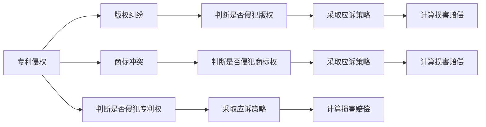

                 

# AI创业公司的知识产权诉讼应对：侵权判定、应诉策略与损害赔偿

在蓬勃发展的AI创业公司中，知识产权（IP）诉讼已经成为一大挑战。随着AI技术的不断进步，越来越多的初创企业在技术创新方面取得了突破，但与此同时，知识产权纠纷也随之而来。本文旨在为AI创业公司提供一套全面的知识产权诉讼应对策略，涵盖侵权判定、应诉策略以及损害赔偿等方面。我们将深入探讨这些核心问题，并结合实际案例进行详细分析，为AI创业公司应对知识产权诉讼提供切实可行的指导。

## 1. 背景介绍

### 1.1 问题由来
随着人工智能（AI）技术在各个领域的广泛应用，越来越多的AI创业公司应运而生。这些初创企业凭借独特的技术优势和创新的商业模式，在市场上占据了一席之地。然而，技术的快速发展也带来了知识产权纠纷的频发。

AI创业公司面临的知识产权问题主要包括以下几个方面：

- **专利侵权**：初创企业在使用现有的专利技术时，可能会侵犯他人的专利权。
- **版权纠纷**：在开发AI模型时，使用开源数据集或第三方代码库，可能导致版权争议。
- **商标冲突**：初创企业的品牌标识可能与已有商标存在冲突，引发商标诉讼。

这些问题不仅会严重影响公司的正常运营，还可能带来巨额的经济损失和信誉损害。因此，AI创业公司需要具备一定的知识产权法律知识，及时应对可能的诉讼风险。

### 1.2 问题核心关键点
要有效应对知识产权诉讼，AI创业公司需要掌握以下几个关键点：

- **侵权判定**：如何判断他人专利、版权或商标是否被侵犯。
- **应诉策略**：面对知识产权诉讼时，应采取何种策略进行辩护。
- **损害赔偿**：如何在法律框架下计算和争取合理的损害赔偿。

掌握这些关键点，有助于AI创业公司建立健全的知识产权保护机制，提升企业的法律风险应对能力。

## 2. 核心概念与联系

### 2.1 核心概念概述

为了更好地理解知识产权诉讼的应对策略，我们首先需要了解以下核心概念：

- **专利侵权**：在未经专利权人许可的情况下，使用、销售或进口其专利产品或方法，侵犯了专利权人的权利。
- **版权纠纷**：未经版权所有者许可，使用其作品，包括复制、分发、修改等行为，可能构成版权侵权。
- **商标冲突**：在品牌注册或使用过程中，与他人已注册的商标产生冲突，可能引发商标诉讼。
- **损害赔偿**：在知识产权被侵犯时，受害方有权获得经济补偿，以弥补损失。

这些概念之间存在紧密联系，共同构成了知识产权法律框架的基本要素。通过理解这些概念，我们可以更清晰地识别和应对知识产权诉讼。

### 2.2 核心概念原理和架构的 Mermaid 流程图(Mermaid 流程节点中不要有括号、逗号等特殊字符)


这个流程图展示了侵权判定和应诉策略之间的联系。首先，需要对各种知识产权类型进行判断，然后根据不同的情况采取相应的应诉策略，并最终计算损害赔偿。

## 3. 核心算法原理 & 具体操作步骤
### 3.1 算法原理概述

知识产权诉讼应对的核心算法主要包括以下几个步骤：

1. **侵权判定**：根据法律规定，判断是否存在侵权行为。
2. **应诉策略**：根据侵权情况，制定应诉策略，包括但不限于谈判、仲裁或诉讼。
3. **损害赔偿**：根据法律规定，计算和争取合理的损害赔偿。

这些步骤相互依赖，缺一不可。只有准确判断侵权行为，才能制定有效的应诉策略，最终在法律框架下争取合理的损害赔偿。

### 3.2 算法步骤详解

以下将详细讲解侵权判定、应诉策略和损害赔偿的具体操作步骤。

#### 3.2.1 侵权判定

侵权判定是应对知识产权诉讼的第一步，主要包括以下几个方面：

1. **收集证据**：包括但不限于专利文献、版权登记信息、商标使用记录等。
2. **分析证据**：通过专业的知识产权分析工具，分析证据中的关键信息。
3. **对比分析**：将收集的证据与涉嫌侵权的技术、作品或商标进行对比，判断是否存在侵权行为。

#### 3.2.2 应诉策略

应诉策略的制定需要考虑多种因素，包括但不限于：

1. **证据准备**：收集和整理证据，形成强有力的辩护材料。
2. **法律辩护**：根据侵权情况，制定具体的法律辩护策略，包括但不限于权利主张、抗辩理由等。
3. **谈判或诉讼**：根据具体情况，决定是否通过谈判或诉讼解决争议。

#### 3.2.3 损害赔偿

损害赔偿的计算和争取主要包括以下几个方面：

1. **评估损失**：根据侵权行为的性质、范围和影响，评估受害方所遭受的经济损失。
2. **考虑其他因素**：包括但不限于市场份额、利润损失、品牌价值等。
3. **争取合理赔偿**：在法律框架下，争取合理的损害赔偿。

### 3.3 算法优缺点

侵权判定、应诉策略和损害赔偿的算法具有以下优缺点：

**优点**：

- **全面性**：覆盖了侵权判定、应诉策略和损害赔偿三个关键环节，提供系统的解决方案。
- **灵活性**：应诉策略可以根据具体情况灵活调整，适应不同侵权类型和复杂度。
- **合理性**：损害赔偿的计算和争取基于法律规定，确保赔偿的合理性和公正性。

**缺点**：

- **复杂性**：侵权判定和损害赔偿需要专业的法律知识和丰富的实践经验。
- **高成本**：应诉策略的制定和实施往往需要高昂的律师费用和专业工具。
- **不确定性**：应诉结果存在不确定性，最终能否获胜无法保证。

### 3.4 算法应用领域

侵权判定、应诉策略和损害赔偿的算法不仅适用于AI创业公司，还广泛应用于各类知识产权纠纷的解决中。以下是几个典型应用领域：

1. **知识产权许可协议**：在签订许可协议时，需要对对方的知识产权进行严格审查，确保不会侵犯其权利。
2. **技术研发与合作**：在进行技术研发和合作时，需要对合作方的知识产权进行评估，避免潜在的法律风险。
3. **市场推广与竞争**：在市场推广和竞争中，需要对竞争对手的知识产权进行监控，避免侵权行为。
4. **国际贸易**：在国际贸易中，需要对目标市场的知识产权进行充分了解，避免侵权风险。

## 4. 数学模型和公式 & 详细讲解 & 举例说明（备注：数学公式请使用latex格式，latex嵌入文中独立段落使用 $$，段落内使用 $)
### 4.1 数学模型构建

在本节中，我们将使用数学语言来描述侵权判定和损害赔偿的模型。

假设一个AI创业公司涉嫌侵犯了某项专利，设该专利的权利要求为$P$，公司的技术方案为$T$。侵权判定的数学模型可以表示为：

$$
侵权 = \begin{cases}
1, & \text{如果} P \subset T \\
0, & \text{否则}
\end{cases}
$$

其中$P \subset T$表示专利权利要求被技术方案所包含。

### 4.2 公式推导过程

根据上述模型，我们可以通过以下步骤进行侵权判定的推导：

1. **权利要求分解**：将专利权利要求分解为多个子权利要求，每个子权利要求代表专利的一个技术特征。
2. **特征匹配**：将公司的技术方案$T$与每个子权利要求进行匹配，判断是否存在侵权行为。
3. **综合判断**：根据特征匹配的结果，综合判断是否构成侵权。

例如，对于一个涉及计算机视觉的专利，可以将权利要求分解为多个子权利要求，如“用于图像处理的算法”、“特定的图像处理步骤”等。然后，将这些子权利要求与公司的技术方案进行匹配，如果存在匹配，则判断为侵权。

### 4.3 案例分析与讲解

假设一个AI创业公司使用了一种特定的算法进行图像处理，但未事先了解该算法是否侵犯了某项专利。可以通过以下步骤进行侵权判定：

1. **收集专利文献**：查找与该算法相关的专利文献，了解其权利要求。
2. **技术方案分解**：将公司的算法分解为多个技术特征。
3. **特征匹配**：将每个技术特征与专利权利要求进行匹配，判断是否存在侵权行为。
4. **综合判断**：根据特征匹配的结果，判断是否构成侵权。

如果公司未发现任何侵权行为，则可以直接进行后续业务操作；否则，需要立即采取应诉策略，保护公司权益。

## 5. 项目实践：代码实例和详细解释说明
### 5.1 开发环境搭建

在进行知识产权诉讼应对的开发时，我们需要安装一些必要的工具和环境，包括：

1. **Python编程环境**：安装Python 3.x版本，并确保环境变量设置正确。
2. **法律分析工具**：安装一些专业的知识产权分析工具，如PatentMachine、Casetrack等。
3. **数据库管理工具**：安装数据库管理系统，如MySQL、PostgreSQL等，用于存储和管理证据数据。
4. **文档管理系统**：安装文档管理系统，如SharePoint、Google Docs等，用于管理相关法律文件。

### 5.2 源代码详细实现

以下是一个简单的Python代码示例，用于收集和分析证据数据：

```python
import patentmachine as pm
import sqlite3

# 连接数据库
conn = sqlite3.connect('evidence.db')
cursor = conn.cursor()

# 查询专利信息
query = '''
SELECT * FROM patents WHERE patent_number = ?;
'''
cursor.execute(query, ('US1234567',))
patent_data = cursor.fetchone()

# 解析专利信息
title = patent_data[1]
abstract = patent_data[2]
claims = patent_data[3]

# 存储专利信息到数据库
cursor.execute('INSERT INTO patent_info VALUES (?, ?, ?)', (title, abstract, claims))
conn.commit()

# 关闭数据库连接
conn.close()
```

这个示例代码实现了从数据库中查询和存储专利信息的功能。在实际应用中，可以根据具体需求，扩展数据收集和分析的功能。

### 5.3 代码解读与分析

该示例代码通过Python的sqlite3模块连接到SQLite数据库，查询专利信息，并解析专利的标题、摘要和权利要求。最后，将专利信息存储到数据库中，以便后续使用。

### 5.4 运行结果展示

运行上述代码，将生成一个名为`evidence.db`的SQLite数据库文件，其中包含了查询到的专利信息。可以通过SQL查询语句，从数据库中检索和分析专利信息，为侵权判定提供数据支持。

## 6. 实际应用场景
### 6.1 智能客服系统

在智能客服系统中，使用AI技术处理用户请求时，需要特别注意专利和版权问题。例如，如果使用的自然语言处理（NLP）技术侵犯了他人的专利权，可能会面临侵权诉讼。

智能客服系统应对专利侵权的具体步骤包括：

1. **专利审查**：在技术研发初期，进行专利审查，确保使用的技术不侵犯他人的专利权。
2. **合同签订**：在与第三方合作时，签订包含知识产权保护条款的合同，明确双方的权利和义务。
3. **法律咨询**：在接到诉讼通知时，及时咨询法律专家，了解诉讼风险和应对策略。

### 6.2 金融数据处理

在金融数据处理中，使用AI技术进行数据分析和预测时，需要特别注意版权问题。例如，如果使用的数据集侵犯了他人的版权，可能会面临版权纠纷。

金融数据处理系统应对版权纠纷的具体步骤包括：

1. **版权审查**：在使用开源数据集或第三方数据时，进行版权审查，确保使用的数据不侵犯他人的版权。
2. **数据许可**：在获取数据时，签订包含数据使用许可的协议，明确数据的来源和用途。
3. **法律辩护**：在接到诉讼通知时，及时进行法律辩护，证明数据使用的合法性和合理性。

### 6.3 社交媒体平台

在社交媒体平台上，使用AI技术进行内容推荐和用户分析时，需要特别注意商标冲突问题。例如，如果使用平台上的商标作为品牌标识，可能会面临商标侵权诉讼。

社交媒体平台应对商标冲突的具体步骤包括：

1. **商标审查**：在使用品牌标识时，进行商标审查，确保不侵犯他人的商标权。
2. **品牌注册**：及时注册品牌商标，保护品牌权益。
3. **法律应对**：在接到诉讼通知时，及时进行法律应对，维护品牌形象和市场声誉。

### 6.4 未来应用展望

未来，随着AI技术的不断发展和普及，知识产权诉讼应对的需求将越来越广泛。以下是一些未来应用展望：

1. **智能合同管理**：使用AI技术进行智能合同管理，自动检测和标记合同中的知识产权条款，降低侵权风险。
2. **法律文书生成**：使用AI技术自动生成法律文书，如起诉状、答辩状等，提高法律事务处理效率。
3. **风险预警系统**：使用AI技术构建知识产权风险预警系统，实时监控和预警潜在的侵权风险。
4. **跨地域知识产权保护**：使用AI技术进行跨地域知识产权保护，确保全球范围内的知识产权安全。

## 7. 工具和资源推荐
### 7.1 学习资源推荐

为了帮助AI创业公司应对知识产权诉讼，以下是一些优质的学习资源：

1. **《知识产权法》书籍**：详细介绍知识产权法的各项法律规定，为理解法律问题提供基础。
2. **《AI法律事务》课程**：涵盖AI技术的法律风险和应对策略，适合AI从业者和法律专业人士学习。
3. **法律博客和论坛**：如IPLaw Blog、IP Law360等，提供最新的法律动态和案例分析，帮助企业及时了解法律趋势。
4. **法律咨询服务**：如Baker McKenzie、Clifford Chance等知名律所，提供专业的法律咨询和顾问服务。

### 7.2 开发工具推荐

在进行知识产权诉讼应对的开发时，需要使用一些专业的工具，包括：

1. **法律分析工具**：如PatentMachine、Casetrack等，用于分析和处理专利和版权数据。
2. **数据库管理系统**：如MySQL、PostgreSQL等，用于存储和管理证据数据。
3. **文档管理系统**：如SharePoint、Google Docs等，用于管理相关法律文件。
4. **编程语言**：如Python、R等，进行数据分析和处理。

### 7.3 相关论文推荐

为了深入了解知识产权诉讼应对的理论和实践，以下是一些推荐的学术论文：

1. "Patent Infringement Detection using Deep Learning"：研究使用深度学习进行专利侵权判定的技术和方法。
2. "Copyright Infringement Detection and Prevention"：探讨版权侵权检测和预防的技术和策略。
3. "Trademark Infringement and Defense Strategies"：分析商标侵权的法律和策略，提供应对建议。

## 8. 总结：未来发展趋势与挑战
### 8.1 研究成果总结

本文详细探讨了AI创业公司在知识产权诉讼应对中面临的侵权判定、应诉策略和损害赔偿问题，提供了系统的解决方案和实际案例分析。通过分析专利侵权、版权纠纷和商标冲突的应对策略，帮助企业有效应对知识产权诉讼，保护自身权益。

### 8.2 未来发展趋势

未来，知识产权诉讼应对将呈现以下几个发展趋势：

1. **智能化法律分析**：使用AI技术进行法律分析，提高知识产权纠纷解决的效率和准确性。
2. **自动化法律事务处理**：通过自动化技术，减少法律事务处理的重复性工作，提高处理效率。
3. **跨领域知识产权保护**：在多个领域进行知识产权保护，确保企业在不同领域的技术和品牌权益。
4. **全球知识产权保护**：在跨国界知识产权纠纷中，提供全球范围内的法律支持和应对策略。

### 8.3 面临的挑战

尽管AI技术在知识产权诉讼应对中发挥了重要作用，但仍面临以下挑战：

1. **技术复杂性**：知识产权诉讼涉及多学科知识，需要综合考虑技术、法律等多个方面。
2. **法律多样性**：不同国家和地区的法律规定存在差异，需要针对不同地区进行法律合规性检查。
3. **数据隐私**：在数据收集和处理过程中，需要遵守数据隐私法规，确保数据安全。
4. **法律风险**：在法律诉讼中，存在诉讼结果的不确定性和高昂的诉讼成本。

### 8.4 研究展望

为了应对未来知识产权诉讼应对的挑战，需要从以下几个方面进行研究和创新：

1. **跨学科合作**：加强技术专家和法律专业人士的合作，共同研究知识产权诉讼应对的解决方案。
2. **技术创新**：开发更加智能化的法律分析和文书生成技术，提高应对效率。
3. **合规管理**：建立健全的合规管理体系，确保企业符合法律规定。
4. **数据安全**：加强数据隐私保护，确保数据安全。

总之，随着AI技术的不断发展，知识产权诉讼应对将变得更加智能化和自动化，但同时也面临着技术、法律和合规等多方面的挑战。未来需要持续创新，推动AI技术在知识产权保护中的应用，为企业提供更加高效和安全的解决方案。

## 9. 附录：常见问题与解答
### Q1: 如何判断专利侵权？

**A**：判断专利侵权需要考虑以下几个方面：

1. **权利要求分解**：将专利的权利要求分解为多个子权利要求，每个子权利要求代表专利的一个技术特征。
2. **特征匹配**：将公司的技术方案与每个子权利要求进行匹配，判断是否存在侵权行为。
3. **综合判断**：根据特征匹配的结果，综合判断是否构成侵权。

### Q2: 应诉策略有哪些？

**A**：应诉策略可以根据具体情况灵活调整，包括但不限于：

1. **谈判解决**：与原告进行谈判，争取达成和解协议。
2. **仲裁解决**：通过仲裁机构解决争议，减少诉讼成本和时间。
3. **诉讼解决**：通过法律程序解决争议，寻求法院判决。

### Q3: 如何计算损害赔偿？

**A**：损害赔偿的计算主要基于法律规定，具体计算方法包括：

1. **直接经济损失**：计算因侵权行为直接造成的经济损失。
2. **间接经济损失**：计算因侵权行为间接造成的经济损失，如市场份额损失等。
3. **其他因素**：考虑品牌价值、声誉损失等因素，综合评估损失金额。

### Q4: 如何应对版权纠纷？

**A**：应对版权纠纷的具体步骤包括：

1. **版权审查**：在使用开源数据集或第三方数据时，进行版权审查，确保使用的数据不侵犯他人的版权。
2. **数据许可**：在获取数据时，签订包含数据使用许可的协议，明确数据的来源和用途。
3. **法律辩护**：在接到诉讼通知时，及时进行法律辩护，证明数据使用的合法性和合理性。

### Q5: 如何应对商标冲突？

**A**：应对商标冲突的具体步骤包括：

1. **商标审查**：在使用品牌标识时，进行商标审查，确保不侵犯他人的商标权。
2. **品牌注册**：及时注册品牌商标，保护品牌权益。
3. **法律应对**：在接到诉讼通知时，及时进行法律应对，维护品牌形象和市场声誉。

---

作者：禅与计算机程序设计艺术 / Zen and the Art of Computer Programming

