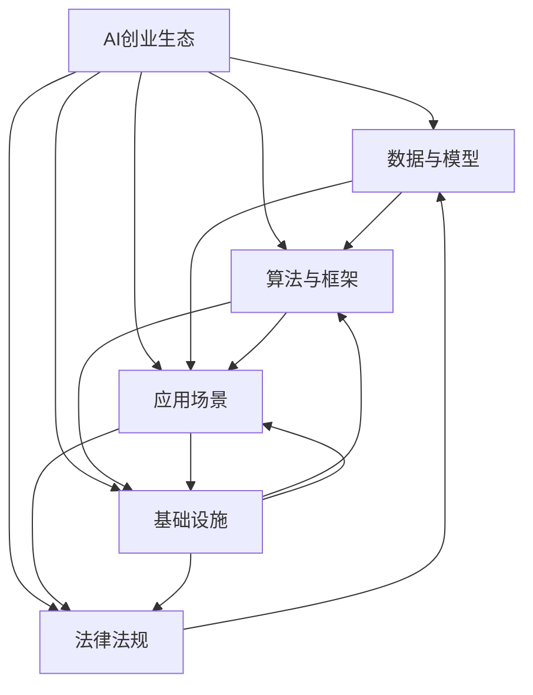

                 

# AI创业生态日益丰富，产业链 expansively

## 1. 背景介绍

### 1.1 问题由来

人工智能(AI)技术的发展已经进入一个快速迭代的新阶段。过去十年，从深度学习、计算机视觉、自然语言处理等领域的突破，到通用大模型的出现，AI正逐步渗透到各个行业和应用场景中。创业者和投资者的关注焦点，也从传统的硬件技术，转移到AI软件和服务领域，催生了大量的AI初创企业。

在此背景下，AI创业生态日益丰富，产业上下游紧密相连，形成了以AI技术为核心的新产业链。无论是数据、算法、模型、应用，还是基础设施、市场监管、法律法规等，每个环节都在迅速变化和发展。对于AI创业者和投资者而言，如何在这种动态变化中把握机会，成为一大挑战。

### 1.2 问题核心关键点

当前，AI创业生态的核心关键点包括以下几个方面：

1. **数据与模型**：数据是AI的“粮食”，高质量的数据是模型训练和应用的基础。如何获取、存储、清洗、标注数据，是大规模AI应用的核心问题。同时，预训练模型和微调技术的应用，极大地提升了AI模型训练的效率和效果。
2. **算法与框架**：算法创新和开源框架是AI技术的核心驱动力。从传统机器学习、深度学习到最近兴起的Transformer模型、自监督学习、生成对抗网络(GAN)等，每一种算法和框架的进步，都在为AI应用开辟新的可能性。
3. **应用场景**：AI技术的应用场景正在从最初的热门领域（如图像识别、语音识别、自然语言处理）向更多垂直行业（如医疗、金融、教育、制造等）扩展，带来了前所未有的商业机会。
4. **基础设施**：AI的普及离不开强大的基础设施支持。从高性能计算、云计算、边缘计算，到AI芯片、传感器等，基础设施的发展为AI应用提供了坚实基础。
5. **法律法规与监管**：随着AI技术的广泛应用，法律法规和监管问题日益突出。如何在隐私保护、安全伦理、知识产权等方面进行规范，确保AI技术的健康发展，成为当前社会关注的重点。

## 2. 核心概念与联系

### 2.1 核心概念概述

为了更好地理解AI创业生态的各个环节，本节将介绍几个关键概念，并描述它们之间的联系。

- **AI创业生态**：包括数据、算法、模型、应用、基础设施、法律法规等各个环节，相互影响、相互促进，形成一个完整的产业体系。
- **AI初创企业**：通过创新的AI技术和产品，解决特定行业或场景的实际问题，推动AI技术的商业化应用。
- **预训练模型**：通过大规模无标签数据进行训练，学习通用的语言或视觉表示，广泛应用于下游任务微调。
- **微调**：在预训练模型的基础上，使用下游任务的少量标注数据进行进一步优化，提升模型在该任务上的性能。
- **Transformer**：一种基于自注意力机制的神经网络架构，在NLP、CV等任务上表现优异。
- **深度学习框架**：如TensorFlow、PyTorch等，提供了高效的深度学习模型开发和训练环境，加速了AI技术的创新和应用。
- **联邦学习**：在分布式环境下，通过模型参数的联合优化，实现跨设备、跨机构的协作学习，保护数据隐私。
- **自监督学习**：通过无标签数据自适应学习，提升模型的泛化能力和数据利用效率。
- **生成对抗网络(GAN)**：通过生成器和判别器的对抗训练，生成高质量的合成数据或图像，拓展数据资源的边界。

这些概念之间的联系可以通过以下Mermaid流程图来展示：



这个流程图展示了大语言模型的核心概念及其之间的关系：

1. **AI创业生态**：是大规模AI应用的基础，由数据、算法、模型、应用、基础设施、法律法规等多个环节共同构成。
2. **数据与模型**：是AI创业生态的核心组成部分，数据提供模型训练的基础，模型是应用落地的关键。
3. **算法与框架**：是技术创新的驱动力，新的算法和框架不断推动AI应用的发展。
4. **应用场景**：是AI技术应用的实际落地，通过应用场景推动技术迭代和市场推广。
5. **基础设施**：是AI应用的技术支撑，为模型的训练、推理等提供必要的硬件和软件支持。
6. **法律法规**：是AI应用的社会保障，规范AI技术的伦理和隐私问题，促进健康发展。

这些概念共同构成了AI创业生态的完整框架，各个环节相互依赖，共同推动AI技术的进步和应用。

## 3. 核心算法原理 & 具体操作步骤

### 3.1 算法原理概述

AI创业生态的核心算法原理主要包括以下几个方面：

1. **深度学习与神经网络**：基于多层神经网络结构，通过反向传播算法训练模型，实现对复杂数据的拟合。
2. **卷积神经网络(CNN)**：主要用于图像处理，通过卷积操作提取局部特征，实现图像分类、检测等任务。
3. **循环神经网络(RNN)**：主要用于序列数据处理，通过循环结构捕捉时间依赖关系，实现自然语言处理、语音识别等任务。
4. **Transformer**：基于自注意力机制，能够高效处理长序列数据，广泛应用于机器翻译、文本生成等任务。
5. **预训练与微调**：通过在大规模无标签数据上预训练模型，在小规模标注数据上进行微调，提升模型性能。
6. **自监督学习**：利用未标注数据进行自适应学习，提升模型的泛化能力。
7. **对抗学习**：通过对抗样本训练，提高模型的鲁棒性和泛化能力。
8. **联邦学习**：在分布式环境下，通过联合优化模型参数，实现跨设备、跨机构的协作学习。

这些算法原理在大规模AI应用中扮演着重要角色，推动了AI技术的不断进步和应用落地。

### 3.2 算法步骤详解

以基于Transformer模型的微调为例，下面详细介绍微调的具体操作步骤：

1. **数据准备**：收集下游任务的标注数据集，进行数据清洗和预处理，确保数据的质量和分布。
2. **模型选择**：选择合适的预训练模型（如BERT、GPT等）作为初始化参数。
3. **任务适配**：在预训练模型的顶层设计合适的输出层和损失函数，根据具体任务类型调整。
4. **超参数设置**：选择合适的优化器（如AdamW）及其参数，设置学习率、批大小、迭代轮数等。
5. **模型训练**：将训练集数据分批次输入模型，前向传播计算损失函数，反向传播计算参数梯度，更新模型参数。
6. **验证集评估**：在验证集上评估模型性能，根据性能指标决定是否触发Early Stopping。
7. **模型测试**：在测试集上评估微调后模型的性能，对比微调前后的精度提升。
8. **模型部署**：将微调后的模型部署到实际应用系统中，进行实时推理和预测。

### 3.3 算法优缺点

基于深度学习和Transformer模型的微调方法具有以下优点：

1. **高效性**：使用预训练模型作为初始化参数，能够显著缩短训练时间，提高模型效果。
2. **泛化能力强**：预训练模型在大量无标签数据上学习到通用的语言或视觉表示，具有较强的泛化能力。
3. **灵活性高**：通过微调，可以在不破坏预训练权重的情况下，针对特定任务进行优化。
4. **模型表现好**：在许多NLP任务上，微调后的模型能够达到或超过从头训练的效果。

同时，该方法也存在一些缺点：

1. **标注数据依赖**：微调效果很大程度上依赖于标注数据的质量和数量，获取高质量标注数据的成本较高。
2. **模型复杂度高**：预训练模型和微调模型通常参数量较大，对计算资源和存储要求较高。
3. **可解释性不足**：微调模型通常作为黑盒系统使用，难以解释其内部工作机制和决策逻辑。
4. **数据分布变化**：当目标数据与预训练数据的分布差异较大时，微调的性能提升有限。

尽管存在这些缺点，但基于深度学习和Transformer模型的微调方法仍是大规模AI应用的重要手段。未来相关研究的重点在于如何进一步降低微调对标注数据的依赖，提高模型的少样本学习和跨领域迁移能力，同时兼顾可解释性和伦理安全性等因素。

### 3.4 算法应用领域

基于深度学习和Transformer模型的微调方法，在多个领域得到了广泛应用，具体包括：

1. **自然语言处理(NLP)**：文本分类、情感分析、机器翻译、问答系统、文本摘要、命名实体识别等。
2. **计算机视觉(CV)**：图像分类、目标检测、图像分割、人脸识别等。
3. **语音识别**：语音识别、语音合成、说话人识别、语音情感分析等。
4. **推荐系统**：个性化推荐、广告推荐、商品推荐等。
5. **医疗健康**：医学影像分析、基因组学分析、医疗知识图谱等。
6. **金融科技**：风险控制、信用评估、量化投资等。
7. **智能制造**：质量检测、设备维护、供应链管理等。
8. **智能家居**：语音助手、智能监控、能源管理等。

这些领域的大规模AI应用，展示了微调方法在不同场景下的强大适应性和实用性。

## 4. 数学模型和公式 & 详细讲解

### 4.1 数学模型构建

假设微调的模型为 $M_{\theta}$，其中 $\theta$ 为模型参数。设训练集为 $D=\{(x_i,y_i)\}_{i=1}^N$，其中 $x_i$ 为输入，$y_i$ 为标签。微调的目标是最小化经验风险：

$$
\mathcal{L}(\theta) = \frac{1}{N}\sum_{i=1}^N \ell(M_{\theta}(x_i),y_i)
$$

其中 $\ell$ 为损失函数，通常是交叉熵损失、均方误差损失等。微调的优化目标是最小化经验风险：

$$
\theta^* = \mathop{\arg\min}_{\theta} \mathcal{L}(\theta)
$$

在实践中，我们通常使用基于梯度的优化算法（如Adam、SGD等）来近似求解上述最优化问题。设 $\eta$ 为学习率，则参数的更新公式为：

$$
\theta \leftarrow \theta - \eta \nabla_{\theta}\mathcal{L}(\theta)
$$

其中 $\nabla_{\theta}\mathcal{L}(\theta)$ 为损失函数对参数 $\theta$ 的梯度，可通过反向传播算法高效计算。

### 4.2 公式推导过程

以二分类任务为例，推导交叉熵损失函数及其梯度的计算公式。

假设模型 $M_{\theta}$ 在输入 $x$ 上的输出为 $\hat{y}=M_{\theta}(x) \in [0,1]$，表示样本属于正类的概率。真实标签 $y \in \{0,1\}$。则二分类交叉熵损失函数定义为：

$$
\ell(M_{\theta}(x),y) = -[y\log \hat{y} + (1-y)\log (1-\hat{y})]
$$

将其代入经验风险公式，得：

$$
\mathcal{L}(\theta) = -\frac{1}{N}\sum_{i=1}^N [y_i\log M_{\theta}(x_i)+(1-y_i)\log(1-M_{\theta}(x_i))]
$$

根据链式法则，损失函数对参数 $\theta_k$ 的梯度为：

$$
\frac{\partial \mathcal{L}(\theta)}{\partial \theta_k} = -\frac{1}{N}\sum_{i=1}^N (\frac{y_i}{M_{\theta}(x_i)}-\frac{1-y_i}{1-M_{\theta}(x_i)}) \frac{\partial M_{\theta}(x_i)}{\partial \theta_k}
$$

其中 $\frac{\partial M_{\theta}(x_i)}{\partial \theta_k}$ 可进一步递归展开，利用自动微分技术完成计算。

在得到损失函数的梯度后，即可带入参数更新公式，完成模型的迭代优化。重复上述过程直至收敛，最终得到适应下游任务的最优模型参数 $\theta^*$。

## 5. 项目实践：代码实例和详细解释说明

### 5.1 开发环境搭建

在进行微调实践前，我们需要准备好开发环境。以下是使用Python进行PyTorch开发的环境配置流程：

1. 安装Anaconda：从官网下载并安装Anaconda，用于创建独立的Python环境。

2. 创建并激活虚拟环境：
```bash
conda create -n pytorch-env python=3.8 
conda activate pytorch-env
```

3. 安装PyTorch：根据CUDA版本，从官网获取对应的安装命令。例如：
```bash
conda install pytorch torchvision torchaudio cudatoolkit=11.1 -c pytorch -c conda-forge
```

4. 安装TensorFlow：由Google主导开发的开源深度学习框架，生产部署方便，适合大规模工程应用。同样有丰富的预训练语言模型资源。

5. 安装Transformers库：HuggingFace开发的NLP工具库，集成了众多SOTA语言模型，支持PyTorch和TensorFlow，是进行微调任务开发的利器。

6. 安装各类工具包：
```bash
pip install numpy pandas scikit-learn matplotlib tqdm jupyter notebook ipython
```

完成上述步骤后，即可在`pytorch-env`环境中开始微调实践。

### 5.2 源代码详细实现

这里以BERT模型为例，展示基于PyTorch对文本分类任务进行微调的代码实现。

首先，定义数据处理函数：

```python
from transformers import BertTokenizer
from torch.utils.data import Dataset
import torch

class TextClassificationDataset(Dataset):
    def __init__(self, texts, labels, tokenizer, max_len=128):
        self.texts = texts
        self.labels = labels
        self.tokenizer = tokenizer
        self.max_len = max_len
        
    def __len__(self):
        return len(self.texts)
    
    def __getitem__(self, item):
        text = self.texts[item]
        label = self.labels[item]
        
        encoding = self.tokenizer(text, return_tensors='pt', max_length=self.max_len, padding='max_length', truncation=True)
        input_ids = encoding['input_ids'][0]
        attention_mask = encoding['attention_mask'][0]
        
        # 将标签编码成向量
        label = torch.tensor(label, dtype=torch.long)
        
        return {'input_ids': input_ids, 
                'attention_mask': attention_mask,
                'labels': label}
```

然后，定义模型和优化器：

```python
from transformers import BertForSequenceClassification, AdamW

model = BertForSequenceClassification.from_pretrained('bert-base-cased', num_labels=2)

optimizer = AdamW(model.parameters(), lr=2e-5)
```

接着，定义训练和评估函数：

```python
from torch.utils.data import DataLoader
from tqdm import tqdm
from sklearn.metrics import classification_report

device = torch.device('cuda') if torch.cuda.is_available() else torch.device('cpu')
model.to(device)

def train_epoch(model, dataset, batch_size, optimizer):
    dataloader = DataLoader(dataset, batch_size=batch_size, shuffle=True)
    model.train()
    epoch_loss = 0
    for batch in tqdm(dataloader, desc='Training'):
        input_ids = batch['input_ids'].to(device)
        attention_mask = batch['attention_mask'].to(device)
        labels = batch['labels'].to(device)
        model.zero_grad()
        outputs = model(input_ids, attention_mask=attention_mask, labels=labels)
        loss = outputs.loss
        epoch_loss += loss.item()
        loss.backward()
        optimizer.step()
    return epoch_loss / len(dataloader)

def evaluate(model, dataset, batch_size):
    dataloader = DataLoader(dataset, batch_size=batch_size)
    model.eval()
    preds, labels = [], []
    with torch.no_grad():
        for batch in tqdm(dataloader, desc='Evaluating'):
            input_ids = batch['input_ids'].to(device)
            attention_mask = batch['attention_mask'].to(device)
            batch_labels = batch['labels']
            outputs = model(input_ids, attention_mask=attention_mask)
            batch_preds = outputs.logits.argmax(dim=2).to('cpu').tolist()
            batch_labels = batch_labels.to('cpu').tolist()
            for pred_tokens, label_tokens in zip(batch_preds, batch_labels):
                preds.append(pred_tokens[:len(label_tokens)])
                labels.append(label_tokens)
                
    print(classification_report(labels, preds))
```

最后，启动训练流程并在测试集上评估：

```python
epochs = 5
batch_size = 16

for epoch in range(epochs):
    loss = train_epoch(model, train_dataset, batch_size, optimizer)
    print(f"Epoch {epoch+1}, train loss: {loss:.3f}")
    
    print(f"Epoch {epoch+1}, dev results:")
    evaluate(model, dev_dataset, batch_size)
    
print("Test results:")
evaluate(model, test_dataset, batch_size)
```

以上就是使用PyTorch对BERT进行文本分类任务微调的完整代码实现。可以看到，得益于Transformers库的强大封装，我们可以用相对简洁的代码完成BERT模型的加载和微调。

### 5.3 代码解读与分析

让我们再详细解读一下关键代码的实现细节：

**TextClassificationDataset类**：
- `__init__`方法：初始化文本、标签、分词器等关键组件。
- `__len__`方法：返回数据集的样本数量。
- `__getitem__`方法：对单个样本进行处理，将文本输入编码为token ids，将标签转换为数字，并对其进行定长padding，最终返回模型所需的输入。

**训练和评估函数**：
- 使用PyTorch的DataLoader对数据集进行批次化加载，供模型训练和推理使用。
- 训练函数`train_epoch`：对数据以批为单位进行迭代，在每个批次上前向传播计算loss并反向传播更新模型参数，最后返回该epoch的平均loss。
- 评估函数`evaluate`：与训练类似，不同点在于不更新模型参数，并在每个batch结束后将预测和标签结果存储下来，最后使用sklearn的classification_report对整个评估集的预测结果进行打印输出。

**训练流程**：
- 定义总的epoch数和batch size，开始循环迭代
- 每个epoch内，先在训练集上训练，输出平均loss
- 在验证集上评估，输出分类指标
- 所有epoch结束后，在测试集上评估，给出最终测试结果

可以看到，PyTorch配合Transformers库使得BERT微调的代码实现变得简洁高效。开发者可以将更多精力放在数据处理、模型改进等高层逻辑上，而不必过多关注底层的实现细节。

当然，工业级的系统实现还需考虑更多因素，如模型的保存和部署、超参数的自动搜索、更灵活的任务适配层等。但核心的微调范式基本与此类似。

## 6. 实际应用场景

### 6.1 智能客服系统

基于大语言模型微调的对话技术，可以广泛应用于智能客服系统的构建。传统客服往往需要配备大量人力，高峰期响应缓慢，且一致性和专业性难以保证。而使用微调后的对话模型，可以7x24小时不间断服务，快速响应客户咨询，用自然流畅的语言解答各类常见问题。

在技术实现上，可以收集企业内部的历史客服对话记录，将问题和最佳答复构建成监督数据，在此基础上对预训练对话模型进行微调。微调后的对话模型能够自动理解用户意图，匹配最合适的答案模板进行回复。对于客户提出的新问题，还可以接入检索系统实时搜索相关内容，动态组织生成回答。如此构建的智能客服系统，能大幅提升客户咨询体验和问题解决效率。

### 6.2 金融舆情监测

金融机构需要实时监测市场舆论动向，以便及时应对负面信息传播，规避金融风险。传统的人工监测方式成本高、效率低，难以应对网络时代海量信息爆发的挑战。基于大语言模型微调的文本分类和情感分析技术，为金融舆情监测提供了新的解决方案。

具体而言，可以收集金融领域相关的新闻、报道、评论等文本数据，并对其进行主题标注和情感标注。在此基础上对预训练语言模型进行微调，使其能够自动判断文本属于何种主题，情感倾向是正面、中性还是负面。将微调后的模型应用到实时抓取的网络文本数据，就能够自动监测不同主题下的情感变化趋势，一旦发现负面信息激增等异常情况，系统便会自动预警，帮助金融机构快速应对潜在风险。

### 6.3 个性化推荐系统

当前的推荐系统往往只依赖用户的历史行为数据进行物品推荐，无法深入理解用户的真实兴趣偏好。基于大语言模型微调技术，个性化推荐系统可以更好地挖掘用户行为背后的语义信息，从而提供更精准、多样的推荐内容。

在实践中，可以收集用户浏览、点击、评论、分享等行为数据，提取和用户交互的物品标题、描述、标签等文本内容。将文本内容作为模型输入，用户的后续行为（如是否点击、购买等）作为监督信号，在此基础上微调预训练语言模型。微调后的模型能够从文本内容中准确把握用户的兴趣点。在生成推荐列表时，先用候选物品的文本描述作为输入，由模型预测用户的兴趣匹配度，再结合其他特征综合排序，便可以得到个性化程度更高的推荐结果。

### 6.4 未来应用展望

随着大语言模型微调技术的发展，基于微调范式将在更多领域得到应用，为传统行业带来变革性影响。

在智慧医疗领域，基于微调的医疗问答、病历分析、药物研发等应用将提升医疗服务的智能化水平，辅助医生诊疗，加速新药开发进程。

在智能教育领域，微调技术可应用于作业批改、学情分析、知识推荐等方面，因材施教，促进教育公平，提高教学质量。

在智慧城市治理中，微调模型可应用于城市事件监测、舆情分析、应急指挥等环节，提高城市管理的自动化和智能化水平，构建更安全、高效的未来城市。

此外，在企业生产、社会治理、文娱传媒等众多领域，基于大模型微调的人工智能应用也将不断涌现，为经济社会发展注入新的动力。相信随着技术的日益成熟，微调方法将成为人工智能落地应用的重要范式，推动人工智能技术在各个领域的深度融合和创新应用。

## 7. 工具和资源推荐

### 7.1 学习资源推荐

为了帮助开发者系统掌握大语言模型微调的理论基础和实践技巧，这里推荐一些优质的学习资源：

1. 《Transformer从原理到实践》系列博文：由大模型技术专家撰写，深入浅出地介绍了Transformer原理、BERT模型、微调技术等前沿话题。

2. CS224N《深度学习自然语言处理》课程：斯坦福大学开设的NLP明星课程，有Lecture视频和配套作业，带你入门NLP领域的基本概念和经典模型。

3. 《Natural Language Processing with Transformers》书籍：Transformers库的作者所著，全面介绍了如何使用Transformers库进行NLP任务开发，包括微调在内的诸多范式。

4. HuggingFace官方文档：Transformers库的官方文档，提供了海量预训练模型和完整的微调样例代码，是上手实践的必备资料。

5. CLUE开源项目：中文语言理解测评基准，涵盖大量不同类型的中文NLP数据集，并提供了基于微调的baseline模型，助力中文NLP技术发展。

通过对这些资源的学习实践，相信你一定能够快速掌握大语言模型微调的精髓，并用于解决实际的NLP问题。

### 7.2 开发工具推荐

高效的开发离不开优秀的工具支持。以下是几款用于大语言模型微调开发的常用工具：

1. PyTorch：基于Python的开源深度学习框架，灵活动态的计算图，适合快速迭代研究。大部分预训练语言模型都有PyTorch版本的实现。

2. TensorFlow：由Google主导开发的开源深度学习框架，生产部署方便，适合大规模工程应用。同样有丰富的预训练语言模型资源。

3. Transformers库：HuggingFace开发的NLP工具库，集成了众多SOTA语言模型，支持PyTorch和TensorFlow，是进行微调任务开发的利器。

4. Weights & Biases：模型训练的实验跟踪工具，可以记录和可视化模型训练过程中的各项指标，方便对比和调优。与主流深度学习框架无缝集成。

5. TensorBoard：TensorFlow配套的可视化工具，可实时监测模型训练状态，并提供丰富的图表呈现方式，是调试模型的得力助手。

6. Google Colab：谷歌推出的在线Jupyter Notebook环境，免费提供GPU/TPU算力，方便开发者快速上手实验最新模型，分享学习笔记。

合理利用这些工具，可以显著提升大语言模型微调任务的开发效率，加快创新迭代的步伐。

### 7.3 相关论文推荐

大语言模型和微调技术的发展源于学界的持续研究。以下是几篇奠基性的相关论文，推荐阅读：

1. Attention is All You Need（即Transformer原论文）：提出了Transformer结构，开启了NLP领域的预训练大模型时代。

2. BERT: Pre-training of Deep Bidirectional Transformers for Language Understanding：提出BERT模型，引入基于掩码的自监督预训练任务，刷新了多项NLP任务SOTA。

3. Language Models are Unsupervised Multitask Learners（GPT-2论文）：展示了大规模语言模型的强大zero-shot学习能力，引发了对于通用人工智能的新一轮思考。

4. Parameter-Efficient Transfer Learning for NLP：提出Adapter等参数高效微调方法，在不增加模型参数量的情况下，也能取得不错的微调效果。

5. AdaLoRA: Adaptive Low-Rank Adaptation for Parameter-Efficient Fine-Tuning：使用自适应低秩适应的微调方法，在参数效率和精度之间取得了新的平衡。

这些论文代表了大语言模型微调技术的发展脉络。通过学习这些前沿成果，可以帮助研究者把握学科前进方向，激发更多的创新灵感。

## 8. 总结：未来发展趋势与挑战

### 8.1 总结

本文对基于深度学习和Transformer模型的AI创业生态进行了全面系统的介绍。首先阐述了AI创业生态的各个环节及其联系，明确了预训练模型和微调技术在AI创业生态中的核心作用。其次，从原理到实践，详细讲解了微调的具体操作步骤，提供了微调任务开发的完整代码实例。同时，本文还广泛探讨了微调方法在智能客服、金融舆情、个性化推荐等多个行业领域的应用前景，展示了微调范式的巨大潜力。

通过本文的系统梳理，可以看到，基于深度学习和Transformer模型的微调方法正在成为AI创业生态的重要范式，极大地拓展了AI技术的应用边界，催生了更多的落地场景。受益于大规模语料的预训练，微调模型以更低的时间和标注成本，在小样本条件下也能取得不俗的效果，有力推动了AI技术的产业化进程。未来，伴随预训练语言模型和微调方法的持续演进，相信AI技术必将在更广阔的应用领域大放异彩，深刻影响人类的生产生活方式。

### 8.2 未来发展趋势

展望未来，AI创业生态的发展趋势包括以下几个方面：

1. **数据与模型规模化**：随着AI技术的不断发展，数据量和模型参数规模将持续增大，推动AI应用向更广泛、更深层次扩展。
2. **算法与框架创新**：新的算法和框架将不断涌现，提升AI应用的效率和效果，推动AI技术的普及和应用。
3. **应用场景多样化**：AI技术将进一步渗透到各个行业和应用场景中，带来更多新的商业机会和社会价值。
4. **基础设施升级**：高性能计算、云计算、边缘计算等基础设施的升级，将为AI应用提供更强大的技术支撑。
5. **法律法规完善**：AI技术的广泛应用也将带来更多法律法规和社会伦理问题，需要进一步完善相关规范和监管。

这些趋势凸显了AI创业生态的广阔前景，各个环节的相互推动，将进一步推动AI技术的进步和应用落地。

### 8.3 面临的挑战

尽管AI创业生态正在快速成长，但仍面临一些挑战：

1. **数据获取与标注**：高质量数据的获取和标注成本高，数据分布不均衡等问题，仍然是制约AI技术发展的瓶颈。
2. **模型鲁棒性**：在实际应用中，模型面对噪声数据和对抗样本时，泛化性能和鲁棒性仍需进一步提升。
3. **可解释性**：AI模型通常作为黑盒系统使用，难以解释其内部工作机制和决策逻辑，需要进一步提升模型的可解释性。
4. **隐私与伦理**：AI技术的应用可能涉及用户隐私和伦理问题，需要建立完善的隐私保护和伦理规范。
5. **安全与攻击**：AI模型可能被恶意攻击和利用，需要进一步加强安全防护措施。
6. **技术壁垒**：AI技术的应用需要高技术门槛，如何降低门槛，普及AI技术，还需进一步探索。

解决这些挑战，需要AI创业者和投资者共同努力，通过技术创新和实践积累，不断推动AI技术的进步和应用。

### 8.4 研究展望

面对未来AI创业生态的发展挑战，未来的研究需要在以下几个方面寻求新的突破：

1. **数据获取与处理**：研究高效的数据获取和处理技术，提升数据质量，解决数据分布不均衡等问题。
2. **模型鲁棒性与可解释性**：研究鲁棒性模型和可解释性模型，提升模型在复杂环境下的稳定性和透明性。
3. **隐私保护与伦理规范**：建立完善的隐私保护和伦理规范体系，确保AI技术的健康发展。
4. **安全防护与防御策略**：研究AI模型的安全防护和攻击防御策略，保障模型安全。
5. **技术普及与大众化**：通过技术创新和工具封装，降低AI技术的入门门槛，推动AI技术在各行业的应用普及。

这些研究方向将为AI创业生态的持续发展提供有力支撑，推动AI技术在更广泛的应用场景中落地，为人类社会的进步和繁荣带来新的动力。

## 9. 附录：常见问题与解答

**Q1：AI创业生态是否适用于所有行业？**

A: AI创业生态的各个环节，如数据、算法、模型、应用等，在不同行业中都有不同的适用场景和挑战。AI技术在技术门槛高、数据资源丰富的行业，如金融、医疗、自动驾驶等，有着更为广泛的应用前景。但在一些数据资源稀缺或技术需求不高的行业，如传统制造业、餐饮服务行业等，AI技术的应用仍需进一步探索。

**Q2：如何选择合适的微调算法？**

A: 选择合适的微调算法需要考虑多个因素，包括任务的复杂度、数据规模、模型结构等。一般而言，复杂的任务和大规模的数据更适合使用自监督学习、联邦学习等方法，而简单的任务和小规模的数据则可以直接使用传统的深度学习框架进行微调。在实际应用中，可以通过实验对比不同微调算法的性能，选择最适合的算法。

**Q3：AI创业生态的生态系统如何构建？**

A: 构建AI创业生态需要多方协同，包括技术开发者、投资方、合作伙伴、政府监管等。技术开发者需要不断创新，推出高性能的AI技术和工具，投资方需要提供资金和资源支持，合作伙伴提供实际应用场景，政府监管提供法规和政策支持。只有各方的共同努力，才能构建一个健康、可持续发展的AI创业生态。

**Q4：如何应对AI技术的未来挑战？**

A: 应对AI技术的未来挑战，需要从技术、伦理、法律等多个方面进行综合考虑。在技术方面，需要不断提升模型的鲁棒性、可解释性和隐私保护能力；在伦理方面，需要建立明确的伦理规范和价值观，避免AI技术的滥用；在法律方面，需要制定完善的法律法规，保障AI技术的安全应用。通过多方协同，共同推动AI技术的健康发展。

**Q5：AI创业生态的未来趋势是什么？**

A: AI创业生态的未来趋势将更加多样化、智能化和普适化。随着AI技术的不断进步，AI创业生态将涵盖更多的应用场景和行业，为各行各业带来变革性影响。同时，AI技术的普及将推动更多创业者和投资者的参与，形成一个更加开放、活跃的AI生态系统。未来，AI技术将与人类社会深度融合，带来前所未有的创新和发展机会。

---

作者：禅与计算机程序设计艺术 / Zen and the Art of Computer Programming

