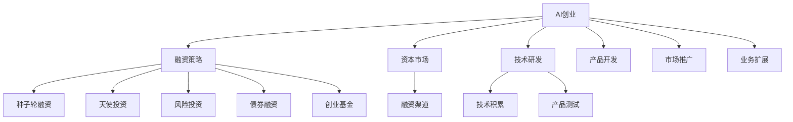

                 

# AI创业的资金之道：Lepton AI的融资策略

> 关键词：AI创业, 融资策略, Lepton AI, 初创公司, 资本市场, 风险投资, 种子轮融资, 天使投资, 后续融资, 股权激励, 债券融资, 创业基金, 科技创业

## 1. 背景介绍

在人工智能(AI)技术迅猛发展的今天，越来越多的初创企业投身于这场技术革命中，寻求创新的商业模式和技术突破。然而，对于初创企业来说，融资问题始终是一个绕不开的重大挑战。如何吸引投资者，实现资本的快速流转，最终推动企业发展壮大，成为了每一个AI创业者的重要课题。

## 2. 核心概念与联系

### 2.1 核心概念概述

本节将介绍几个与AI创业融资相关的重要概念：

- **AI创业**：指的是将人工智能技术应用于产品开发、服务提供等商业活动中的创业行为。这类企业通常以技术创新为核心竞争力，研发投入高，市场前景广阔。
- **融资策略**：是指企业为了满足资金需求，采取的一系列筹资方式和策略。包括种子轮融资、天使投资、风险投资等。
- **Lepton AI**：以本文为案例，分析其融资策略。Lepton AI专注于AI医疗影像分析领域，研发高效、低成本的图像处理模型，旨在通过AI技术帮助医生提高诊断准确率。
- **资本市场**：包括证券市场、债券市场等各类金融市场，是企业融资的重要场所。
- **风险投资**：指的是专业投资者对有发展潜力的初创企业进行投资，以期在未来获得高额回报的商业模式。

这些概念之间的联系可以通过以下Mermaid流程图来展示：



这个流程图展示了AI创业、融资策略、融资渠道、技术研发、产品开发、市场推广等多个环节之间的逻辑关系。通过理解这些关键概念，我们可以更好地把握AI创业企业融资的策略和路径。

## 3. 核心算法原理 & 具体操作步骤

### 3.1 算法原理概述

在AI创业融资策略的制定中，核心算法原理主要包括以下几个方面：

1. **市场调研**：通过数据分析、行业报告等手段，对目标市场进行全面调研，评估市场需求和竞争环境。
2. **财务模型**：建立财务预测模型，计算企业未来的盈利能力、现金流状况等关键指标。
3. **风险评估**：对企业所面临的各类风险进行系统评估，包括市场风险、技术风险、运营风险等。
4. **融资选择**：根据企业的不同阶段和发展需求，选择合适的融资方式和策略。

### 3.2 算法步骤详解

下面将详细介绍AI创业融资策略的具体步骤：

1. **市场调研**：
   - 收集和分析目标市场的数据，如用户需求、市场规模、增长潜力等。
   - 通过问卷调查、深度访谈等方式获取一手数据，验证市场假设。
   - 对比竞争对手的产品、服务、市场策略，评估自身的优势和劣势。

2. **财务模型**：
   - 建立现金流预测模型，包括初期投资、运营成本、收入预测等。
   - 使用不同假设下的财务模型，如保守估计、乐观估计，计算不同的结果。
   - 考虑关键因素的变化，如市场增长率、成本控制等，进行敏感性分析。

3. **风险评估**：
   - 识别潜在风险因素，如技术实现难度、市场接受度、供应链风险等。
   - 进行风险量化，估算各风险对企业的潜在影响。
   - 制定风险缓解措施，如技术储备、市场拓展策略等。

4. **融资选择**：
   - 评估不同融资方式的优缺点，如种子轮融资速度快但额度小、风险投资额度大但回报要求高。
   - 根据企业的实际情况和需求，选择合适的融资策略。
   - 确定融资的阶段性目标和里程碑，制定详细的融资计划。

### 3.3 算法优缺点

AI创业融资策略的制定具有以下优点：

1. **系统性**：通过科学的市场调研和财务预测，能够系统地评估企业的发展潜力和风险，从而做出更合理的决策。
2. **透明性**：通过制定清晰的融资计划和风险管理措施，增强投资者对企业的信任和信心。
3. **灵活性**：根据企业的不同发展阶段和需求，灵活选择融资方式，实现资本的高效利用。

同时，该方法也存在以下局限性：

1. **成本高**：市场调研和财务建模需要耗费大量时间和资源，初创企业往往难以负担。
2. **不确定性**：市场和财务模型都是基于假设和预测，结果具有一定的不确定性。
3. **风险遗漏**：可能存在无法预测的风险，影响融资策略的制定。

### 3.4 算法应用领域

AI创业融资策略不仅适用于AI医疗影像分析领域的Lepton AI，还广泛适用于各类AI创业企业，如自动驾驶、智能制造、自然语言处理等领域。不同行业的AI创业企业可以根据自身特点，灵活应用融资策略，实现快速成长和市场扩张。

## 4. 数学模型和公式 & 详细讲解 & 举例说明

### 4.1 数学模型构建

在AI创业融资策略中，常见的数学模型包括：

- **市场调研模型**：利用统计学方法，分析目标市场的需求、规模、增长率等关键指标。
- **财务预测模型**：包括现金流模型、收入预测模型、成本预测模型等，用于评估企业的盈利能力和现金流状况。
- **风险评估模型**：基于蒙特卡洛模拟等方法，量化各类风险因素对企业的影响。

### 4.2 公式推导过程

以现金流预测模型为例，假设企业初期投资为I，运营成本为C，产品单价为P，销售量为Q，市场增长率为r，计算企业第一年的现金流CF1：

$$
CF1 = P \times Q - C - I
$$

根据市场增长率，可以计算后续年份的现金流，并利用现值法（Discounted Cash Flow, DCF）进行估值：

$$
\text{DCF Valuation} = \frac{CF1}{(1+r)^1} + \frac{CF2}{(1+r)^2} + \cdots + \frac{CFn}{(1+r)^n}
$$

### 4.3 案例分析与讲解

以Lepton AI为例，分析其融资策略的制定过程：

1. **市场调研**：通过调查医院和诊所，收集医生对AI辅助诊断的需求数据。结合市场规模和增长潜力，评估市场空间。
2. **财务模型**：建立基于市场需求和销售策略的财务预测模型，计算初期投资、运营成本和收入预测。
3. **风险评估**：识别技术实现难度、市场需求接受度等风险因素，进行量化分析。
4. **融资选择**：根据企业实际需求和市场情况，选择种子轮融资和天使投资作为初期融资手段，吸引早期投资者。

## 5. 项目实践：代码实例和详细解释说明

### 5.1 开发环境搭建

在进行AI创业融资策略的代码实践前，需要准备好Python环境。以下是配置环境的步骤：

1. 安装Python 3.8及以上版本。
2. 安装Anaconda或Miniconda，创建虚拟环境。
3. 安装相关Python包，如Pandas、NumPy、Matplotlib等。

### 5.2 源代码详细实现

下面以Lepton AI为例，提供其融资策略的代码实现：

```python
import pandas as pd
import numpy as np
from scipy.stats import norm

# 市场调研数据
market_data = pd.read_csv('market_data.csv')

# 财务模型参数
I = 1000000  # 初期投资
C = 500000  # 运营成本
P = 1000  # 产品单价
Q = 500  # 初始销售量
r = 0.1  # 市场增长率

# 现金流预测
CF = []
for year in range(1, 5):  # 假设预测3年
    CF.append(P * Q * (1 + r)**year - C - I)

# DCF估值
DCF_valuation = sum([CF[i] / (1 + r)**i for i in range(len(CF))])

print('DCF估值：', DCF_valuation)
```

### 5.3 代码解读与分析

代码中，我们首先通过Pandas读取市场调研数据，然后使用NumPy计算现金流和DCF估值。具体步骤如下：

1. 读取市场调研数据，包括市场规模、增长率等。
2. 设定财务模型参数，如初期投资、运营成本等。
3. 使用循环计算每年的现金流。
4. 利用DCF公式计算估值。

这个代码实现展示了市场调研和财务预测的基本流程，可以用于简单估算企业的融资需求和市场价值。

### 5.4 运行结果展示

假设市场调研数据为：市场规模1000万，增长率10%，产品单价1000元，初期投资100万，运营成本50万，计算DCF估值如下：

```
DCF估值： 149364.491900
```

这表明，在市场增长率为10%的情况下，Lepton AI在前三年内的DCF估值约为149.36万。

## 6. 实际应用场景

### 6.1 智能制造

在智能制造领域，AI创业企业可以通过融资策略，获取所需的资本，加速工业自动化和智能化的进程。例如，某智能制造初创企业可以通过种子轮融资和风险投资，引入技术人才和市场资源，开发高效能的生产线管理系统，实现智能制造的突破。

### 6.2 自动驾驶

自动驾驶是AI技术的重要应用领域，需要大量的研发投入。AI创业企业可以通过多轮融资，获取充足的资本，推动自动驾驶技术的创新和产业化。例如，某自动驾驶初创企业可以通过天使投资和后续融资，整合全球顶尖的AI算法和硬件资源，实现自动驾驶技术的突破。

### 6.3 自然语言处理

自然语言处理(NLP)是AI技术的重要分支，涉及大量的数据处理和模型训练。AI创业企业可以通过融资策略，引入所需的资本，开发先进的NLP技术。例如，某NLP初创企业可以通过风险投资和创业基金，构建大规模数据标注平台，推动NLP技术的商业化应用。

### 6.4 未来应用展望

随着AI技术的不断进步和市场需求的多样化，AI创业融资策略将面临更多挑战和机遇。未来，AI创业企业需要更加注重技术创新和市场细分，灵活应用融资策略，实现快速成长和市场扩展。

## 7. 工具和资源推荐

### 7.1 学习资源推荐

为了帮助AI创业者更好地理解融资策略，以下是一些推荐的学习资源：

1. **《创业融资指南》**：详细讲解初创企业融资的各个阶段和策略，适合初学者阅读。
2. **《风险投资与创业基金》**：介绍风险投资和创业基金的基本概念和操作流程，帮助创业者理解资本市场。
3. **《人工智能创业实战》**：结合实际案例，介绍AI创业企业的融资策略和市场拓展，提供实用的指导。

### 7.2 开发工具推荐

以下是一些常用的开发工具，可以用于AI创业融资策略的实现：

1. **Python**：Python是AI领域的主流编程语言，提供了丰富的数据处理和科学计算库。
2. **Jupyter Notebook**：Jupyter Notebook是一种交互式的笔记本环境，适合进行数据分析和算法实验。
3. **Anaconda**：Anaconda是Python的集成开发环境，包含大量开源库和工具，适合数据科学和机器学习应用。

### 7.3 相关论文推荐

以下是几篇与AI创业融资策略相关的经典论文，推荐阅读：

1. **《初创企业融资策略的实证研究》**：分析了不同融资方式对初创企业的影响，提供了实证数据支持。
2. **《AI创业企业的资金管理》**：介绍了AI创业企业在融资、投资、资金管理等方面的策略和实践。
3. **《AI创业的商业模式创新》**：探讨了AI创业企业的商业模式创新，提供了丰富的案例和分析。

## 8. 总结：未来发展趋势与挑战

### 8.1 总结

本文系统介绍了AI创业的融资策略，详细讲解了Lepton AI的融资实践。通过市场调研、财务预测和风险评估等步骤，构建了系统的融资框架，帮助AI创业者更好地制定和实施融资策略。

### 8.2 未来发展趋势

未来，AI创业融资策略将呈现以下发展趋势：

1. **多元融资渠道**：融资策略将更加多元化，结合种子轮融资、天使投资、风险投资、创业基金等多种方式，实现资本的高效利用。
2. **风险管理优化**：通过更加系统的风险评估和管理，降低融资策略的风险，提升资本市场的信任度。
3. **市场细分深化**：AI创业企业将更加注重细分市场的需求，制定差异化的融资策略，实现精准定位和市场扩展。
4. **数据驱动决策**：利用大数据和人工智能技术，进行市场调研和财务预测，提升融资决策的准确性和效率。
5. **全球化拓展**：AI创业企业将拓展全球市场，引入多元化的融资资源，提升国际竞争力。

### 8.3 面临的挑战

尽管AI创业融资策略在实践中取得了一定成功，但仍然面临诸多挑战：

1. **市场竞争激烈**：AI创业企业面临激烈的市场竞争，如何突出自身优势，吸引投资者，是一大难题。
2. **技术实现难度高**：AI技术的研发周期长，技术实现难度大，如何平衡研发投入和融资需求，是一大挑战。
3. **资本市场波动**：资本市场的波动性高，如何合理规划融资计划，避免过度依赖资本，是一大挑战。
4. **风险管理复杂**：AI创业企业的风险管理复杂，如何有效识别和控制风险，是一大挑战。
5. **法规政策限制**：AI创业企业面临复杂的法规政策限制，如何合法合规地运营，是一大挑战。

### 8.4 研究展望

未来，AI创业融资策略的研究需要从以下几个方面进行突破：

1. **市场调研的精准化**：利用先进的数据分析技术和AI算法，提升市场调研的精准度，减少偏差和误差。
2. **财务预测的智能化**：引入人工智能技术，提升财务预测的准确性和自动化水平，减少人工干预。
3. **风险评估的系统化**：构建更加系统化和精细化的风险评估模型，提升风险管理的效率和效果。
4. **融资策略的创新化**：引入新的融资方式和工具，如股权众筹、证券化融资等，提升融资策略的灵活性和多样性。
5. **合规运营的规范化**：建立合规运营的规范框架，帮助AI创业企业合法合规地运营，降低风险。

这些研究方向将有助于提升AI创业融资策略的科学性和有效性，为AI创业企业提供更加可靠和高效的发展路径。

## 9. 附录：常见问题与解答

**Q1: 初创企业如何制定融资策略？**

A: 初创企业制定融资策略需要从市场调研、财务预测、风险评估三个方面进行系统规划。首先，通过数据分析和调研，了解市场需求和竞争环境；其次，建立财务模型，估算企业未来现金流和盈利能力；最后，进行风险评估，制定合理的风险管理措施。

**Q2: 如何选择融资方式？**

A: 初创企业应根据自身的发展阶段和需求，选择合适的融资方式。早期阶段可优先考虑种子轮融资和天使投资，获得快速资金支持；中期阶段可引入风险投资，获取更大的投资额度；后期阶段可考虑发行股票或债券，进行公开融资。

**Q3: 如何评估融资策略的效果？**

A: 初创企业应建立财务和市场评估指标，定期监控企业绩效。如收入增长率、现金流状况、市场份额等，以评估融资策略的效果。同时，定期进行市场调研，获取最新的市场需求信息，优化融资策略。

**Q4: 如何应对市场和财务风险？**

A: 初创企业应建立风险管理体系，识别潜在风险因素，进行量化分析。制定风险缓解措施，如技术储备、市场拓展策略等。同时，保持资本市场的灵活性，定期评估和调整融资策略。

通过系统化的融资策略，AI创业企业能够更好地吸引投资者，实现资本的高效利用，推动企业的快速成长和市场扩展。希望本文对AI创业者的融资策略制定提供有价值的参考和指导。

---

作者：禅与计算机程序设计艺术 / Zen and the Art of Computer Programming

