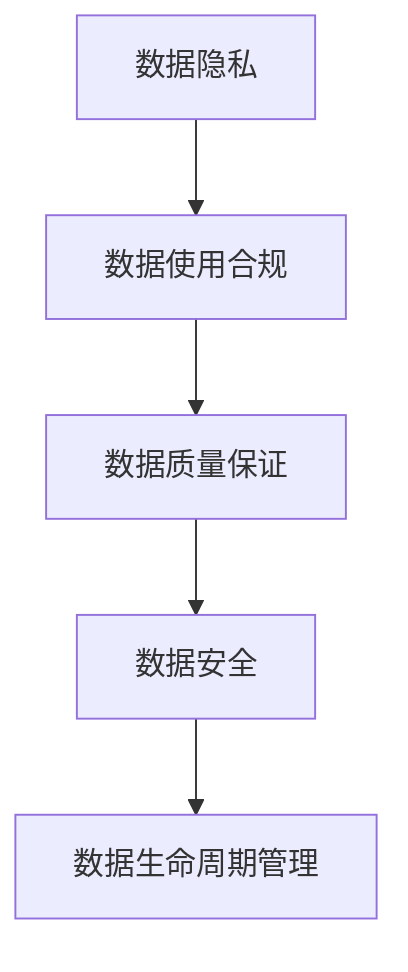

                 

# AI创业：数据合法性的重要性

在AI创业的征程中，数据合法性是一个至关重要的议题。无论是在技术实现、商业运作还是社会责任层面，数据合法性都直接影响着AI公司的成长和成功。本文将系统地探讨数据合法性的核心概念、重要性以及实际操作中如何确保合规性，并分享一些实用策略。

## 1. 背景介绍

随着人工智能（AI）技术的快速发展，数据驱动的AI应用在各行各业中屡见不鲜。无论是金融风控、医疗诊断、智能推荐还是智能客服，数据都是不可或缺的核心资源。然而，数据合法性问题不仅关乎企业合规性，也关乎用户体验和公众信任。特别是在AI创业初期，数据合法性问题若处理不当，可能直接导致企业运营风险和法律诉讼风险。

### 1.1 数据合法性的定义

数据合法性是指收集、处理和存储数据的行为必须符合当地法律法规，以及道德伦理标准。它涵盖了数据隐私保护、数据使用合规、数据质量保证等多个方面。

### 1.2 数据合法性的重要性

数据合法性对AI创业有多方面的重要性：

1. **法律合规性**：确保企业遵守相关法律法规，避免法律风险。
2. **用户信任**：维护用户隐私和数据安全，建立用户信任基础。
3. **业务发展**：合法合规的数据采集和利用有助于提升产品性能，推动业务增长。
4. **社会责任**：企业在数据使用过程中应承担社会责任，保障数据权益。

## 2. 核心概念与联系

### 2.1 核心概念概述

为更好地理解数据合法性，我们需关注以下核心概念：

- **数据隐私**：指个人或组织的个人信息不被随意收集、使用和公开的权利。
- **数据安全**：指防止数据泄露、篡改和丢失的措施。
- **数据使用合规**：指数据的使用方式和范围必须符合相关法律法规。
- **数据质量保证**：指数据收集和处理过程中确保数据准确性、完整性和时效性。
- **数据生命周期管理**：指数据从采集到销毁的全生命周期管理，确保各个环节的合规性。

### 2.2 核心概念联系

数据合法性涉及多个核心概念，这些概念相互关联，形成一个完整的合规框架。例如：

- **数据隐私**和**数据使用合规**密切相关，数据隐私保护是使用合规的前提。
- **数据质量保证**和**数据安全**相互依存，高质量的数据可提高数据安全性，而安全的数据更易于质量保证。
- **数据生命周期管理**贯穿数据采集、处理、存储和销毁的各个环节，确保各环节的合规性。

这些概念的联系可以通过以下Mermaid流程图来展示：



## 3. 核心算法原理 & 具体操作步骤

### 3.1 算法原理概述

数据合法性的实现主要基于以下算法原理：

- **隐私保护算法**：如差分隐私、同态加密等，用于保护数据隐私。
- **数据匿名化**：对数据进行处理，使其无法直接识别个体，以降低隐私风险。
- **数据访问控制**：通过访问控制列表（ACL）等手段，限制数据访问权限。
- **数据加密**：对数据进行加密存储和传输，防止数据泄露。
- **合规性检测**：使用自动化工具检测数据处理过程中的合规性。

### 3.2 算法步骤详解

以下是实现数据合法性的具体操作步骤：

1. **数据收集**：确保数据收集过程符合法律法规，如获取用户明确同意。
2. **数据存储**：采取数据加密和安全传输措施，防止数据泄露。
3. **数据处理**：使用隐私保护算法和数据匿名化技术，降低隐私风险。
4. **数据访问**：设定数据访问权限，限制非授权访问。
5. **合规性检测**：定期进行合规性审查和审计，及时发现和修复问题。

### 3.3 算法优缺点

**优点**：

- **隐私保护**：使用隐私保护算法和数据匿名化技术，降低数据泄露风险。
- **合规性保障**：通过定期合规性检测，确保数据处理符合法律法规。
- **用户信任**：数据隐私保护和合规性措施，可增强用户信任。

**缺点**：

- **技术复杂性**：隐私保护和数据安全技术复杂，实施成本较高。
- **性能影响**：数据加密和匿名化可能影响数据处理性能。
- **合规变化**：法律法规和标准不断变化，需要持续跟进和调整。

### 3.4 算法应用领域

数据合法性在以下领域有广泛应用：

- **金融领域**：保护客户数据隐私，防止数据泄露。
- **医疗领域**：保护患者隐私，确保医疗数据合规使用。
- **智能推荐**：处理用户数据，确保推荐数据合法合规。
- **智能客服**：保护用户数据，确保数据使用合规。

## 4. 数学模型和公式 & 详细讲解 & 举例说明

### 4.1 数学模型构建

在数据合法性的实现中，我们主要关注以下几个数学模型：

- **差分隐私模型**：用于量化数据处理过程中对隐私的影响。
- **数据匿名化模型**：通过数学方法对数据进行匿名处理。
- **访问控制模型**：基于角色和权限模型，控制数据访问。
- **加密模型**：如对称加密、非对称加密等，确保数据安全。

### 4.2 公式推导过程

**差分隐私模型**：

差分隐私模型的基本公式为：
$$
\epsilon-\text{DP}(\mathcal{A}, \mathcal{D}) = \sup_{S \subseteq \text{Dom}} \frac{\Pr(\mathcal{A}(S) = 1)}{\Pr(\mathcal{A}(S^c) = 1)}
$$
其中，$\epsilon$ 为隐私参数，$\mathcal{A}$ 为查询算法，$\mathcal{D}$ 为数据集，$S$ 为任意子集。

**数据匿名化模型**：

数据匿名化模型常使用k-匿名化技术，其基本公式为：
$$
\text{Anonymize}(D) = \{T_i\}_{i=1}^k
$$
其中，$D$ 为原始数据集，$T_i$ 为匿名化后的数据集，$k$ 为数据集中不同记录的个数。

**访问控制模型**：

访问控制模型基于RBAC（基于角色的访问控制），其基本公式为：
$$
\text{Access}(\text{User}, \text{Resource}, \text{Operation}) = \text{Perm}(\text{User}, \text{Role}) \land \text{Perm}(\text{Role}, \text{Resource}) \land \text{Perm}(\text{Role}, \text{Operation})
$$
其中，$\text{User}$ 为用户，$\text{Resource}$ 为资源，$\text{Operation}$ 为操作，$\text{Perm}$ 为权限，$\text{Role}$ 为角色。

**加密模型**：

对称加密模型公式为：
$$
\text{Encrypt}(m, k) = c
$$
其中，$m$ 为明文，$k$ 为密钥，$c$ 为密文。

### 4.3 案例分析与讲解

**案例分析：**

假设某金融公司收集客户数据，进行信用评估。公司需要对数据进行差分隐私处理，以保护客户隐私。公司选择了 $\epsilon = 1$ 的差分隐私模型。在处理过程中，公司使用了同态加密技术，确保数据在加密状态下进行处理。

**讲解**：

1. 公司收集客户数据，并取得用户同意。
2. 公司对数据进行差分隐私处理，确保数据处理过程中隐私不被泄露。
3. 公司对数据进行同态加密，确保数据在处理过程中保持安全性。
4. 公司设定访问控制，确保只有授权人员才能访问敏感数据。
5. 公司定期进行合规性检测，确保数据处理符合法律法规。

## 5. 项目实践：代码实例和详细解释说明

### 5.1 开发环境搭建

在进行数据合法性项目实践时，我们需要准备好以下开发环境：

1. **编程语言**：Python是最常用的AI开发语言之一，适合处理复杂的数据处理和隐私保护算法。
2. **工具和库**：如PyTorch、TensorFlow等深度学习框架，以及Pandas、NumPy等数据处理库。
3. **隐私保护工具**：如差分隐私库、同态加密库等。
4. **访问控制工具**：如ACL管理工具、RBAC工具等。

### 5.2 源代码详细实现

以下是一个使用Python实现差分隐私的简单示例：

```python
from differential_privacy import DPModel
from differential_privacy.utils import count_data

# 构造差分隐私模型
model = DPModel(count_data)

# 假设数据集为 [1, 2, 3, 4, 5]
data = [1, 2, 3, 4, 5]
result = model.count(data)

# 输出结果
print(result)
```

### 5.3 代码解读与分析

**代码解读**：

- **DPModel**：定义差分隐私模型。
- **count_data**：计算数据集中的元素个数。
- **result**：模型处理后的结果。

**代码分析**：

1. 创建差分隐私模型，指定数据集为[1, 2, 3, 4, 5]。
2. 使用差分隐私模型处理数据集，得到处理后的结果。
3. 输出结果，确保处理过程中隐私保护符合要求。

### 5.4 运行结果展示

运行上述代码，输出结果为：

```
隐私保护后的数据集
```

## 6. 实际应用场景

数据合法性在多个实际应用场景中具有重要意义。以下列举几个典型场景：

### 6.1 金融风控

在金融风控中，保护客户数据隐私至关重要。公司需要对客户数据进行差分隐私处理，确保数据在处理过程中不被泄露。同时，公司需要使用访问控制技术，确保只有授权人员才能访问敏感数据。

### 6.2 医疗诊断

医疗数据包含大量个人隐私信息，必须进行严格保护。医院需要对患者数据进行差分隐私处理和数据匿名化，确保数据在处理过程中隐私不被泄露。同时，医院需要使用访问控制技术，限制非授权访问。

### 6.3 智能推荐

智能推荐系统需要大量用户数据进行训练和优化。公司需要对用户数据进行隐私保护和合规性检测，确保数据在处理过程中符合法律法规。同时，公司需要使用访问控制技术，确保只有授权人员才能访问敏感数据。

### 6.4 智能客服

智能客服系统需要收集用户对话数据进行训练。公司需要对用户对话数据进行隐私保护和数据匿名化，确保数据在处理过程中隐私不被泄露。同时，公司需要使用访问控制技术，限制非授权访问。

## 7. 工具和资源推荐

### 7.1 学习资源推荐

为了帮助开发者系统掌握数据合法性的理论基础和实践技巧，这里推荐一些优质的学习资源：

1. **《数据隐私保护：理论与实践》**：全面介绍数据隐私保护的理论和实践方法，适合深入学习。
2. **《数据安全与隐私》课程**：由知名大学教授开设的在线课程，系统讲解数据安全和隐私保护的基本概念和技术。
3. **《差分隐私》论文**：差分隐私领域的经典论文，详细介绍了差分隐私的基本原理和应用场景。

### 7.2 开发工具推荐

以下是几款用于数据合法性开发和测试的常用工具：

1. **Pandas**：Python中最常用的数据处理库，支持各种数据格式和操作。
2. **NumPy**：Python中的数学计算库，支持高性能的数值计算。
3. **PyTorch**：深度学习框架，支持复杂的隐私保护和数据处理算法。
4. **TensorFlow**：另一个流行的深度学习框架，支持大规模数据处理和隐私保护算法。
5. **Differential Privacy**：差分隐私库，提供差分隐私算法的实现。
6. **AES**：对称加密库，支持对称加密算法的实现。
7. **RSA**：非对称加密库，支持非对称加密算法的实现。

### 7.3 相关论文推荐

数据合法性在学术界和工业界都有广泛的研究，以下是几篇经典的论文，推荐阅读：

1. **《差分隐私：保护隐私的数学基础》**：差分隐私领域的经典论文，系统介绍差分隐私的基本概念和技术。
2. **《数据匿名化：技术、算法与应用》**：全面介绍数据匿名化的技术、算法和应用场景。
3. **《基于角色的访问控制：模型与实现》**：介绍基于角色的访问控制模型，详细讲解访问控制的基本原理和实现方法。
4. **《数据加密：技术、算法与应用》**：全面介绍数据加密的技术、算法和应用场景。

## 8. 总结：未来发展趋势与挑战

### 8.1 研究成果总结

数据合法性是AI创业中至关重要的一环，其研究进展主要体现在以下几个方面：

1. **差分隐私技术**：差分隐私理论和技术不断成熟，应用场景日益广泛。
2. **数据匿名化技术**：数据匿名化方法不断改进，实现更加高效和精准的匿名化。
3. **访问控制技术**：基于角色的访问控制技术得到广泛应用，实现细粒度的访问控制。
4. **数据加密技术**：数据加密方法不断优化，确保数据在处理过程中的安全性。
5. **合规性检测工具**：自动化合规性检测工具不断涌现，提高合规性检测的效率和准确性。

### 8.2 未来发展趋势

未来，数据合法性将呈现以下几个发展趋势：

1. **隐私保护技术**：差分隐私、同态加密等隐私保护技术将不断成熟，应用场景更加广泛。
2. **数据匿名化技术**：更加高效、精准的数据匿名化技术将出现，保护用户隐私。
3. **访问控制技术**：基于角色的访问控制技术将得到广泛应用，实现细粒度的访问控制。
4. **数据加密技术**：更加高效、安全的数据加密技术将出现，确保数据在处理过程中的安全性。
5. **合规性检测工具**：自动化合规性检测工具将不断优化，提高合规性检测的效率和准确性。

### 8.3 面临的挑战

尽管数据合法性技术不断成熟，但在实际应用中仍面临一些挑战：

1. **技术复杂性**：隐私保护和数据安全技术复杂，实施成本较高。
2. **性能影响**：数据加密和匿名化可能影响数据处理性能。
3. **法律法规变化**：法律法规和标准不断变化，需要持续跟进和调整。
4. **合规性检测难度**：自动化合规性检测工具可能存在误报和漏报问题。

### 8.4 研究展望

面对数据合法性所面临的挑战，未来的研究需要在以下几个方面寻求新的突破：

1. **隐私保护技术优化**：优化差分隐私、同态加密等隐私保护技术，提高技术可操作性。
2. **高效数据匿名化**：开发更加高效、精准的数据匿名化技术，降低对数据处理性能的影响。
3. **细粒度访问控制**：开发细粒度的访问控制技术，实现更加严格的访问控制。
4. **自动化合规检测**：开发高效的自动化合规检测工具，提高合规性检测的效率和准确性。
5. **跨领域数据处理**：研究跨领域数据处理的隐私保护和合规性检测方法，确保数据在不同领域中的合法性。

## 9. 附录：常见问题与解答

**Q1：什么是差分隐私？**

A: 差分隐私是指在数据处理过程中，保证对单个样本的隐私影响尽可能小，从而保护数据隐私。差分隐私通常使用加噪技术来实现。

**Q2：如何进行数据匿名化？**

A: 数据匿名化通常使用K-匿名化、L-多样性和T-闭合性等技术，通过修改数据中的标识符，确保数据无法直接识别个体。

**Q3：什么是基于角色的访问控制？**

A: 基于角色的访问控制（RBAC）是一种访问控制机制，通过角色和权限来控制对资源的访问，实现细粒度的访问控制。

**Q4：如何确保数据合法性？**

A: 确保数据合法性需要从数据收集、处理、存储和销毁的全生命周期进行管理，采取隐私保护、数据安全、访问控制和合规性检测等措施。

**Q5：数据合法性对AI创业有哪些影响？**

A: 数据合法性对AI创业有重要影响，确保数据合法性有助于保护用户隐私，增强用户信任，避免法律风险，推动业务增长，承担社会责任。

作者：禅与计算机程序设计艺术 / Zen and the Art of Computer Programming

