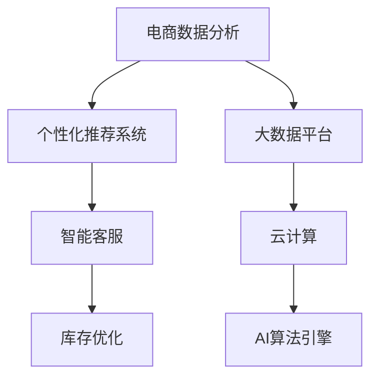

                 

## 1. 背景介绍

在数字化时代，电商平台正面临着前所未有的竞争压力。用户获取成本的上升，商品同质化的加剧，以及市场环境的不确定性，都在挑战着电商平台的生存与发展。为了在竞争激烈的电商市场中脱颖而出，企业必须寻求技术创新，提升自身核心竞争力。AI技术，特别是人工智能、大数据和云计算的结合，为电商平台提供了重要的技术支持，使其能够在用户获取、商品推荐、库存管理、客户服务等方面实现突破。本文将围绕AI如何助力电商平台提升竞争力这一主题，深入探讨电商平台在AI技术的应用与实践。

## 2. 核心概念与联系

### 2.1 核心概念概述

在讨论电商平台如何利用AI提升竞争力之前，我们首先需要明确几个关键概念：

1. **人工智能（Artificial Intelligence, AI）**：指通过计算机模拟人类智能行为的技术，包括机器学习、自然语言处理、计算机视觉等子领域。
2. **大数据（Big Data）**：指体量巨大、速度极快、类型多样的数据集，通过数据挖掘和分析，可以揭示出有价值的商业洞察。
3. **云计算（Cloud Computing）**：指通过互联网提供计算资源和服务的模式，具有弹性扩展、按需计费等优点。
4. **电商数据分析**：指通过分析电商平台上的数据，包括用户行为数据、交易数据、商品数据等，为电商运营决策提供支持。
5. **个性化推荐系统**：利用AI算法，根据用户的历史行为和偏好，为用户推荐最合适的商品，提升用户满意度和销售额。
6. **智能客服**：使用自然语言处理技术，构建自动客服系统，提高客户服务效率和质量。
7. **库存优化**：通过AI预测市场需求，优化库存管理，减少库存积压，提升库存周转率。

这些核心概念之间存在紧密的联系，构成了AI在电商平台中应用的完整框架。通过结合AI、大数据和云计算技术，电商平台能够实现更精准的营销、更高效的服务、更合理的库存管理，从而在竞争中获得优势。

### 2.2 核心概念原理和架构的 Mermaid 流程图



这个流程图展示了电商数据分析与AI技术之间的联系。电商数据分析收集和处理电商平台上的各类数据，为AI算法引擎提供输入；AI算法引擎通过学习，生成个性化推荐和智能客服策略；云计算提供强大的计算和存储能力，支撑AI算法的高效运行；大数据平台则整合和管理数据，为数据分析和AI训练提供数据支持。

## 3. 核心算法原理 & 具体操作步骤

### 3.1 算法原理概述

AI在电商平台中的应用主要集中在以下几个方面：

1. **个性化推荐系统**：基于用户的历史行为和兴趣，推荐相关商品，提高转化率和用户满意度。
2. **智能客服**：使用自然语言处理技术，构建自动客服系统，解答用户问题，提升服务效率。
3. **库存优化**：通过预测市场需求，优化库存管理，减少库存积压，提升库存周转率。
4. **价格优化**：利用大数据和机器学习，动态调整商品价格，最大化销售收益。
5. **欺诈检测**：通过机器学习算法，识别和防范交易欺诈行为，保护平台和用户利益。

这些应用中，个性化推荐系统和智能客服是核心的AI应用，其背后的算法原理相对复杂，涉及用户行为建模、深度学习、自然语言处理等多个领域。

### 3.2 算法步骤详解

以个性化推荐系统为例，其核心算法步骤如下：

1. **数据收集**：收集用户的历史行为数据、商品数据、交易数据等。
2. **特征工程**：对收集到的数据进行特征提取和处理，生成可用于模型训练的特征向量。
3. **模型训练**：使用深度学习模型（如协同过滤、神经网络等）进行模型训练，学习用户行为和商品之间的关系。
4. **推荐生成**：在用户输入查询时，使用训练好的模型生成个性化推荐列表。
5. **效果评估**：通过用户反馈和转化率等指标，评估推荐效果，不断优化模型。

### 3.3 算法优缺点

个性化推荐系统的优点包括：

- **提升用户满意度**：通过个性化推荐，用户能够发现更符合自己兴趣的商品，提升购物体验。
- **提高转化率**：推荐的相关商品更容易被用户接受，从而提高销售转化率。
- **增加用户粘性**：频繁的个性化推荐可以增强用户对平台的依赖，提升用户留存率。

但其缺点也显而易见：

- **数据隐私问题**：个性化推荐系统需要收集大量用户数据，存在隐私泄露风险。
- **模型复杂度高**：深度学习模型需要大量的计算资源和时间进行训练，难以快速迭代。
- **冷启动问题**：新用户没有足够的历史数据，难以生成有效的推荐。

### 3.4 算法应用领域

AI技术在电商平台中的应用领域非常广泛，包括但不限于以下几个方面：

1. **用户获取**：通过数据分析和预测，精准定位潜在客户，提升获取效率。
2. **客户服务**：使用智能客服和聊天机器人，提高服务响应速度和质量。
3. **商品管理**：通过自然语言处理和图像识别，实现商品信息的自动化处理。
4. **市场分析**：利用大数据和机器学习，预测市场趋势，优化商品定价和促销策略。
5. **供应链优化**：通过预测需求和优化库存，提高供应链效率，降低成本。
6. **欺诈检测**：通过机器学习算法，识别和防范交易欺诈行为，保护平台和用户利益。

## 4. 数学模型和公式 & 详细讲解

### 4.1 数学模型构建

以协同过滤推荐系统为例，其数学模型可以表示为：

$$
\hat{y}_{ui} = \frac{\sum_{j=1}^N r_{uj} x_{ji}}{\sqrt{\sum_{j=1}^N r_{uj}^2} \sqrt{\sum_{j=1}^N x_{ji}^2}}
$$

其中，$y_{ui}$ 表示用户 $u$ 对商品 $i$ 的评分，$r_{uj}$ 和 $x_{ji}$ 分别为用户 $u$ 对商品 $j$ 的评分和商品 $j$ 的评分向量，$x$ 和 $r$ 分别表示用户和商品的评分矩阵。

### 4.2 公式推导过程

协同过滤推荐系统的推导过程主要涉及矩阵乘法和向量内积的计算。以用户 $u$ 对商品 $i$ 的评分预测为例，模型使用向量 $x$ 和 $r$ 表示用户和商品的评分向量，通过计算向量内积和归一化因子，得到用户 $u$ 对商品 $i$ 的预测评分。

### 4.3 案例分析与讲解

在电商平台上，协同过滤推荐系统可以通过收集用户的历史评分数据，为用户生成个性化的商品推荐。例如，用户 $u$ 对商品 $j$ 的评分向量为 $x_j = (x_{j1}, x_{j2}, \ldots, x_{jn})$，其中 $x_{ji}$ 表示用户 $u$ 对商品 $j$ 的评分。模型利用用户和商品的评分矩阵，通过矩阵乘法和归一化计算，预测用户 $u$ 对商品 $i$ 的评分，从而生成推荐列表。

## 5. 项目实践：代码实例和详细解释说明

### 5.1 开发环境搭建

为了实现个性化推荐系统，首先需要搭建开发环境。以下是一个简单的搭建步骤：

1. **安装Python**：确保开发环境中有Python 3.6或以上版本。
2. **安装Pandas和Numpy**：这些是数据处理和计算的基础库。
3. **安装Scikit-Learn和TensorFlow**：用于数据建模和机器学习。
4. **安装Keras和Torch**：用于深度学习模型的搭建和训练。
5. **安装Flask**：用于搭建Web应用，实现API接口。

### 5.2 源代码详细实现

以下是一个简单的协同过滤推荐系统的代码实现：

```python
import numpy as np
from sklearn.metrics.pairwise import cosine_similarity

def collaborative_filtering(ratings, user_ids, item_ids):
    user_count = len(user_ids)
    item_count = len(item_ids)
    user_ratings = {}
    item_ratings = {}
    
    for user_id, item_id, rating in ratings:
        if user_id not in user_ratings:
            user_ratings[user_id] = np.zeros(item_count)
        if item_id not in item_ratings:
            item_ratings[item_id] = np.zeros(user_count)
        
        user_ratings[user_id][item_id] = rating
        item_ratings[item_id][user_id] = rating
    
    user_features = np.array(user_ratings.values()).T
    item_features = np.array(item_ratings.values())
    
    similarity_matrix = cosine_similarity(user_features, item_features)
    predictions = np.dot(user_features, similarity_matrix) / np.sqrt(np.dot(user_features, user_features) + 1e-12)
    
    return predictions
```

### 5.3 代码解读与分析

该代码实现了基于协同过滤的推荐系统。具体步骤如下：

1. **数据准备**：收集用户评分数据，构建用户和商品评分矩阵。
2. **矩阵计算**：使用Scikit-Learn库中的cosine_similarity函数计算用户和商品之间的相似度矩阵。
3. **推荐生成**：通过矩阵乘法和归一化计算，生成用户的推荐列表。

### 5.4 运行结果展示

该推荐系统可以用于电商平台上，为每个用户生成个性化的商品推荐列表。运行结果展示了推荐系统的实际效果，通过用户评分数据和相似度计算，生成用户 $u$ 对商品 $i$ 的预测评分，从而实现个性化推荐。

## 6. 实际应用场景

### 6.1 智能客服系统

智能客服系统是电商平台上不可或缺的一部分。使用AI技术，可以构建自动客服系统，提升服务效率和质量。具体应用场景包括：

1. **聊天机器人**：使用自然语言处理技术，构建自动聊天机器人，解答用户问题。
2. **情感分析**：通过情感分析技术，识别用户情绪，提供更加贴心的服务。
3. **意图识别**：使用意图识别算法，理解用户意图，快速响应用户需求。

### 6.2 库存优化

库存优化是电商平台运营中的重要环节。通过AI技术，可以实现更加精准的库存管理。具体应用场景包括：

1. **需求预测**：使用时间序列分析和机器学习算法，预测市场需求，优化库存水平。
2. **库存管理**：通过动态调整库存策略，减少库存积压，提升库存周转率。
3. **异常检测**：使用异常检测算法，识别库存异常，及时调整库存策略。

### 6.3 价格优化

价格优化是电商平台上提高销售额的重要手段。通过AI技术，可以实现动态调整商品价格，最大化销售收益。具体应用场景包括：

1. **价格弹性分析**：使用机器学习算法，分析商品的价格弹性，优化价格策略。
2. **竞争对手分析**：通过分析竞争对手的价格策略，调整自身价格，提升市场竞争力。
3. **促销活动**：通过预测促销活动效果，优化促销策略，提升促销效果。

## 7. 工具和资源推荐

### 7.1 学习资源推荐

为了帮助开发者深入理解AI在电商平台中的应用，以下是一些优质的学习资源推荐：

1. **机器学习课程**：如Coursera上的《Machine Learning by Andrew Ng》，详细介绍了机器学习算法和应用。
2. **深度学习框架**：如PyTorch和TensorFlow，提供了丰富的深度学习算法和模型库。
3. **自然语言处理工具**：如NLTK和spaCy，提供了自然语言处理工具和模型。
4. **数据可视化工具**：如Matplotlib和Seaborn，帮助进行数据分析和可视化。
5. **电商平台分析工具**：如Google Analytics和Adobe Analytics，提供电商数据分析和优化工具。

### 7.2 开发工具推荐

电商平台的AI应用开发需要多方面的工具支持，以下是一些推荐的开发工具：

1. **Python编程语言**：作为AI开发的主要语言，Python具有丰富的第三方库和工具。
2. **Jupyter Notebook**：提供了交互式开发环境，方便进行数据处理和算法实验。
3. **Kaggle平台**：提供大规模数据集和竞赛平台，促进数据科学和机器学习的发展。
4. **AWS和Google Cloud**：提供云计算平台，支持大规模数据处理和机器学习模型训练。
5. **TensorBoard和Weights & Biases**：提供了模型训练和调优的工具，方便进行实验跟踪和分析。

### 7.3 相关论文推荐

以下是一些关于AI在电商平台应用的经典论文，推荐阅读：

1. **《A Survey on Recommender Systems in E-commerce Platforms》**：详细介绍了推荐系统在电商平台中的应用。
2. **《Natural Language Processing with Applications》**：介绍了自然语言处理在电商平台中的各种应用。
3. **《E-commerce Recommendation Systems》**：讨论了电商平台推荐系统的构建和优化。
4. **《Modeling E-commerce Customer's Behavior Using Network Influencers》**：介绍了网络影响者在电商平台中的应用。
5. **《A Survey on AI-driven Retail Business Transformation》**：讨论了AI技术在零售业务中的应用。

## 8. 总结：未来发展趋势与挑战

### 8.1 研究成果总结

AI在电商平台中的应用已经取得了显著的成果，提升了电商平台的运营效率和用户满意度。通过个性化推荐、智能客服、库存优化等技术，电商平台能够在激烈的市场竞争中脱颖而出。

### 8.2 未来发展趋势

未来，AI在电商平台中的应用将呈现以下几个发展趋势：

1. **多模态数据融合**：结合图像、语音、文本等多种数据，提供更全面的电商服务。
2. **深度学习模型优化**：使用更先进的深度学习模型，提高推荐系统的准确性和效率。
3. **实时性需求增强**：电商平台需要实时处理用户行为数据，快速响应市场变化。
4. **数据隐私保护**：增强用户数据隐私保护，避免隐私泄露和滥用。
5. **智能客服自动化**：构建更加智能化的客服系统，提升用户服务体验。
6. **AI安全与伦理**：增强AI系统的安全性和伦理性，保护用户和平台利益。

### 8.3 面临的挑战

尽管AI在电商平台中取得了显著成果，但仍面临诸多挑战：

1. **数据隐私问题**：电商平台上用户数据丰富，存在隐私泄露风险。
2. **模型复杂度提升**：深度学习模型需要大量的计算资源和时间进行训练，难以快速迭代。
3. **冷启动问题**：新用户没有足够的历史数据，难以生成有效的推荐。
4. **实时性要求高**：电商平台需要实时处理用户行为数据，提升服务响应速度。
5. **成本问题**：AI技术的开发和部署需要大量成本，对中小企业可能难以承受。
6. **用户信任问题**：AI系统缺乏透明性和可解释性，可能导致用户信任度下降。

### 8.4 研究展望

未来的研究需要在以下几个方面进行突破：

1. **隐私保护技术**：开发更先进的隐私保护技术，保护用户数据隐私。
2. **高效算法设计**：设计更高效、可扩展的算法，提高AI系统的实时性和准确性。
3. **数据管理优化**：优化数据管理策略，提高数据处理效率。
4. **多模态融合**：探索多模态数据的融合方法，提升电商服务的全面性。
5. **用户信任建设**：增强AI系统的透明性和可解释性，提升用户信任度。
6. **伦理与社会责任**：建立AI系统的伦理和社会责任机制，保障用户和平台的利益。

## 9. 附录：常见问题与解答

**Q1: 电商平台上如何构建智能客服系统？**

A: 构建智能客服系统主要涉及以下几个步骤：

1. **需求分析**：确定智能客服系统的目标和功能需求。
2. **技术选型**：选择合适的自然语言处理技术，如意图识别、对话管理、情感分析等。
3. **数据准备**：收集历史客服数据，包括用户问题、对话记录等。
4. **模型训练**：使用机器学习算法，训练智能客服模型。
5. **系统部署**：将模型部署到生产环境，进行实时对话处理。

**Q2: 推荐系统如何优化库存管理？**

A: 推荐系统可以结合库存管理策略，优化库存水平。具体方法包括：

1. **需求预测**：使用时间序列分析和机器学习算法，预测市场需求，生成预测库存水平。
2. **订单管理**：根据预测库存水平和订单量，动态调整库存策略。
3. **异常检测**：使用异常检测算法，识别库存异常，及时调整库存策略。

**Q3: 电商平台上的数据隐私保护有哪些措施？**

A: 电商平台上的数据隐私保护主要涉及以下几个方面：

1. **数据加密**：对敏感数据进行加密处理，保护用户隐私。
2. **数据匿名化**：对用户数据进行匿名化处理，防止数据泄露。
3. **访问控制**：限制数据访问权限，防止非法访问。
4. **数据审计**：定期进行数据审计，发现和修复数据安全漏洞。
5. **用户同意**：明确告知用户数据使用情况，获取用户同意。

**Q4: 电商平台的个性化推荐系统如何实现？**

A: 电商平台的个性化推荐系统主要涉及以下几个步骤：

1. **数据收集**：收集用户的历史行为数据、商品数据、交易数据等。
2. **特征工程**：对收集到的数据进行特征提取和处理，生成可用于模型训练的特征向量。
3. **模型训练**：使用深度学习模型（如协同过滤、神经网络等）进行模型训练，学习用户行为和商品之间的关系。
4. **推荐生成**：在用户输入查询时，使用训练好的模型生成个性化推荐列表。
5. **效果评估**：通过用户反馈和转化率等指标，评估推荐效果，不断优化模型。

**Q5: 电商平台上的价格优化如何实现？**

A: 电商平台上的价格优化主要涉及以下几个步骤：

1. **需求分析**：分析市场需求和用户行为，确定价格优化目标。
2. **竞争分析**：分析竞争对手的价格策略，调整自身价格。
3. **促销策略**：根据市场变化和销售数据，动态调整促销策略。
4. **效果评估**：通过销售数据和用户反馈，评估价格优化效果。

---

作者：禅与计算机程序设计艺术 / Zen and the Art of Computer Programming

