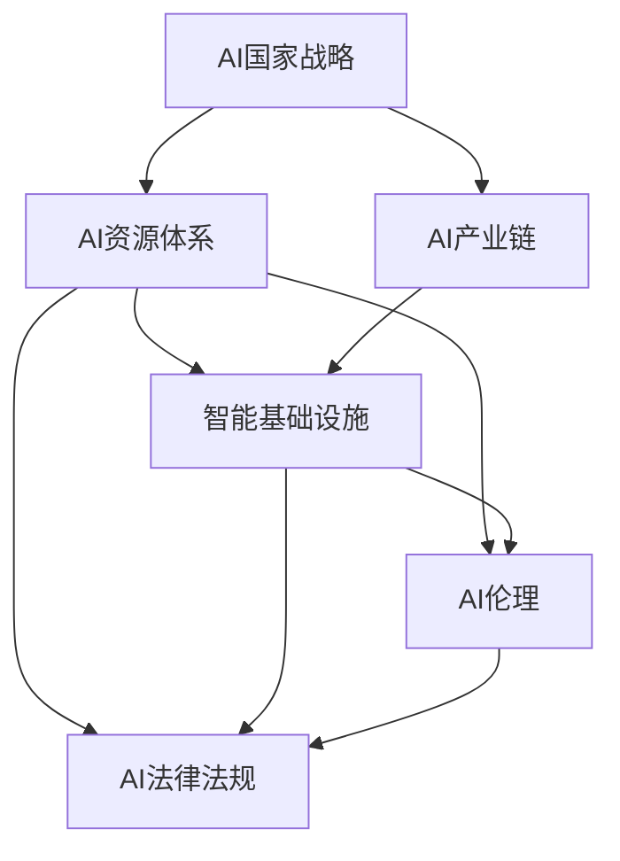

                 

# AI国家战略的资源体系建设

## 1. 背景介绍

### 1.1 问题由来
在当前全球科技竞争日趋激烈的背景下，各国纷纷制定并实施人工智能(AI)国家战略，以期在全球AI竞争中获得优势。我国在推动AI发展的过程中，逐渐认识到其核心竞争力不仅在于技术突破和应用落地，更在于AI资源体系的有效建设和高效运营。

AI资源体系建设，不仅涉及数据、算法、计算资源、人才等硬资源的整合，更涉及政策、标准、伦理等软环境的打造。只有构建起健全的资源体系，才能形成可持续发展的AI产业链，支持AI技术的创新和应用，推动国家AI战略的实施。

### 1.2 问题核心关键点
AI国家战略的资源体系建设，核心在于整合和优化以下几个方面的资源：

1. **数据资源**：AI发展依赖大量高质量标注数据，包括通用领域的语料库、特定领域的任务数据、跨模态数据等。
2. **算法资源**：包含机器学习算法、深度学习算法、强化学习算法等，以及相应的算法库和开源工具。
3. **计算资源**：包括高性能计算集群、GPU/TPU等硬件资源，以及云服务平台、边缘计算设备等。
4. **人才资源**：包括AI领域的高端人才、研究机构、高校、产业界等。
5. **政策和标准**：制定合理的AI发展政策、伦理规范、安全标准、隐私保护等，为AI发展提供良好的政策环境。
6. **软硬件基础设施**：建设基于AI的应用平台、智能终端、传感器网络等基础设施，支撑AI应用落地。
7. **伦理和法律**：制定AI伦理准则和法律法规，规范AI应用，保障社会公平和安全。

这些核心资源要素的有效整合和高效运营，是推动AI国家战略成功实施的关键。

## 2. 核心概念与联系

### 2.1 核心概念概述

为更好地理解AI国家战略的资源体系建设，本节将介绍几个密切相关的核心概念：

- **AI国家战略**：指一个国家或地区在人工智能领域的整体规划和发展策略，旨在通过系统性布局，推动AI技术创新和应用，提升国家竞争力。
- **AI资源体系**：包括数据、算法、计算资源、人才、政策和标准、软硬件基础设施、伦理和法律等多个维度的资源集。
- **AI产业链**：从基础研究到应用落地的完整链条，涉及科研机构、高校、企业、政府等多个主体。
- **智能基础设施**：以AI为核心的新一代基础设施，包括智能传感器、智能终端、智能城市等。
- **AI伦理**：涉及AI技术的伦理审查、伦理应用、伦理教育等内容，保障AI技术的公平、公正、透明和可控。
- **AI法律法规**：包括数据隐私保护、算法公平性、责任归属等法律法规，规范AI技术的应用和发展。

这些核心概念之间的逻辑关系可以通过以下Mermaid流程图来展示：



这个流程图展示出AI国家战略与各个核心概念之间的联系：

1. AI国家战略通过整合AI资源体系，推动AI产业链的完整形成。
2. 智能基础设施和AI伦理、AI法律法规，作为AI资源体系的重要组成部分，支撑AI技术的安全、公平、透明应用。

## 3. 核心算法原理 & 具体操作步骤
### 3.1 算法原理概述

AI国家战略的资源体系建设，是一个涉及多维度的复杂系统工程。其核心算法原理包括数据治理、算法创新、计算资源优化、人才发展、政策制定、伦理规范和法律法规制定等方面。

### 3.2 算法步骤详解

AI资源体系的建设可以大致分为以下几个关键步骤：

**Step 1: 需求分析**
- 明确AI国家战略的目标和愿景，梳理关键任务和需求。
- 分析现有资源状况，识别资源缺口和瓶颈。

**Step 2: 资源整合**
- 通过数据共享平台、算法库、云计算平台等基础设施，整合和优化各类资源。
- 建立跨部门的资源协调机制，实现资源的高效流动和复用。

**Step 3: 平台建设**
- 建设AI数据平台、算法平台、计算平台等基础设施，提供一站式服务。
- 通过API接口、SDK等工具，方便用户接入和使用各类资源。

**Step 4: 技术创新**
- 推动算法和模型的创新，鼓励开源和社区合作，形成技术生态。
- 支持跨学科研究，促进AI与其他领域的融合。

**Step 5: 人才培育**
- 建立AI人才培训体系，包括学位教育、职业培训、继续教育等。
- 设立AI人才激励机制，吸引和留住高端人才。

**Step 6: 政策制定**
- 制定AI发展规划、激励政策、安全规范等，提供政策支持。
- 推动AI法律法规建设，保障AI应用的合法合规。

**Step 7: 伦理规范**
- 建立AI伦理审查机制，确保AI应用符合伦理标准。
- 加强AI伦理教育，提升公众对AI的认知和接受度。

### 3.3 算法优缺点

AI国家战略的资源体系建设具有以下优点：
1. 系统性强。整合各类资源，形成完整的AI产业链，提升整体竞争力。
2. 政策引导。政府主导的战略规划和政策支持，为AI发展提供方向和动力。
3. 协同高效。通过跨部门、跨行业的资源共享和合作，实现资源的高效利用。
4. 技术创新。推动AI技术前沿研究和应用落地，加速AI产业发展。

同时，该方法也存在一些局限性：
1. 实施难度大。资源整合涉及多个主体和部门，协调难度大。
2. 资金投入高。建设初期需要大量资金投入，短期内难以见到明显回报。
3. 风险不可控。AI伦理和法律法规的制定需要时间，短期内有不确定性。
4. 数据隐私问题。大量数据的整合和使用，涉及数据隐私和安全问题。

尽管存在这些局限性，但总体而言，AI国家战略的资源体系建设仍是大势所趋，必将推动AI技术的全面发展。

### 3.4 算法应用领域

AI资源体系的建设，在多个领域都有着广泛的应用前景：

- **科学研究**：通过整合各类科研资源，支持AI基础研究和前沿技术突破。
- **智能制造**：推动AI技术在工业生产中的应用，实现智能制造和智慧工厂。
- **医疗健康**：通过AI技术提升医疗服务水平，推动精准医疗和健康管理。
- **智慧城市**：建设智能基础设施，提升城市管理和居民生活质量。
- **金融服务**：推动AI技术在金融风控、反欺诈、智能投顾等方面的应用。
- **教育培训**：利用AI技术进行个性化教育、智能评估和教育资源优化。
- **农业农业**：推动AI技术在农业生产、管理、监测等方面的应用，提升农业现代化水平。

除了上述这些领域，AI资源体系还将逐步拓展到更多新兴行业，为经济社会发展注入新的动力。

## 4. 数学模型和公式 & 详细讲解 & 举例说明

### 4.1 数学模型构建

本节将使用数学语言对AI国家战略资源体系建设的原理进行更加严格的刻画。

记AI资源体系为 $R$，包括数据 $D$、算法 $A$、计算资源 $C$、人才 $T$、政策和标准 $P$、软硬件基础设施 $I$、伦理和法律 $E$ 等维度，其中 $R = D \cup A \cup C \cup T \cup P \cup I \cup E$。

定义资源体系的价值函数 $V(R)$，表示资源体系的整体价值，可以分解为各资源的价值之和：

$$
V(R) = V(D) + V(A) + V(C) + V(T) + V(P) + V(I) + V(E)
$$

其中 $V(D) = \sum_{d \in D} v_d$，$V(A) = \sum_{a \in A} v_a$，以此类推。

### 4.2 公式推导过程

为便于理解，这里以数据资源为例，推导数据治理的数学模型。

假设数据资源 $D$ 由 $n$ 个数据集构成，每个数据集的价值为 $v_d$，数据资源的价值函数 $V(D)$ 为各数据集价值的加权和，权重为 $\omega_d$，满足 $\omega_d \geq 0$，且 $\sum_{d=1}^n \omega_d = 1$。则有：

$$
V(D) = \sum_{d=1}^n \omega_d v_d
$$

通过求解优化问题 $\max V(D)$，可以得到最优的数据治理策略。

### 4.3 案例分析与讲解

以智能医疗为例，分析数据资源治理的具体方法：

**案例背景**：
在智能医疗领域，数据资源是支撑AI算法和应用的基础。主要包括患者电子病历、影像数据、基因数据等，涉及隐私保护和数据共享的问题。

**优化目标**：
目标是最大化智能医疗数据资源的价值，同时保障数据隐私和安全。

**优化策略**：
1. **数据清洗与标注**：对原始数据进行清洗和标注，去除噪声和异常值，确保数据质量。
2. **数据加密与匿名化**：对敏感数据进行加密和匿名化处理，确保数据隐私安全。
3. **数据共享机制**：建立数据共享平台，通过政策引导和利益分配，实现数据的高效共享。
4. **数据访问控制**：设置严格的数据访问权限，确保数据只能被授权人员访问和使用。
5. **数据质量评估**：定期对数据质量进行评估，确保数据资源的价值最大化。

## 5. 项目实践：代码实例和详细解释说明

### 5.1 开发环境搭建

在进行AI国家战略资源体系建设的实践前，我们需要准备好开发环境。以下是使用Python进行项目开发的Python环境配置流程：

1. 安装Anaconda：从官网下载并安装Anaconda，用于创建独立的Python环境。

2. 创建并激活虚拟环境：
```bash
conda create -n ai-env python=3.8 
conda activate ai-env
```

3. 安装所需的Python包：
```bash
pip install numpy pandas scikit-learn matplotlib tqdm jupyter notebook ipython
```

4. 安装数据处理和分析工具：
```bash
pip install torch torchvision torchaudio huggingface transformers
```

5. 安装AI开发工具：
```bash
pip install pytorch-lightning transformers huggingface_hub
```

完成上述步骤后，即可在`ai-env`环境中开始AI国家战略资源体系建设的实践。

### 5.2 源代码详细实现

下面我们以数据资源治理为例，给出使用Python和PyTorch实现数据清洗和标注的代码实现。

```python
import torch
from torch.utils.data import Dataset, DataLoader
from torchvision import transforms
import pandas as pd
import numpy as np

class MedicalDataset(Dataset):
    def __init__(self, data_path):
        self.data = pd.read_csv(data_path)
        self.transform = transforms.Compose([
            transforms.ToTensor(),
            transforms.Normalize(mean=[0.5, 0.5, 0.5], std=[0.5, 0.5, 0.5])
        ])
        
    def __len__(self):
        return len(self.data)
    
    def __getitem__(self, idx):
        img_path = self.data.iloc[idx]['img_path']
        label = self.data.iloc[idx]['label']
        
        img = transforms.Image.open(img_path)
        img = self.transform(img)
        img = img.unsqueeze(0)
        
        return {'image': img, 'label': label}

# 数据清洗与标注
data_path = 'path/to/data.csv'
dataset = MedicalDataset(data_path)
dataloader = DataLoader(dataset, batch_size=32, shuffle=True)

for batch in dataloader:
    img, label = batch['image'], batch['label']
    # 进行数据清洗和标注操作，如去噪、增强、分类等
    clean_img, clean_label = clean_and_augment(img, label)
    # 保存清洗和标注后的数据
    save_clean_data(clean_img, clean_label)
```

以上是使用PyTorch和Pandas实现数据清洗和标注的代码示例。可以看到，通过定义一个自定义的Dataset类，我们可以方便地对数据进行加载和预处理。

### 5.3 代码解读与分析

让我们再详细解读一下关键代码的实现细节：

**MedicalDataset类**：
- `__init__`方法：初始化数据集，加载CSV文件，并定义数据预处理步骤。
- `__len__`方法：返回数据集的长度。
- `__getitem__`方法：对单个样本进行处理，包括加载图像和标签，并进行数据预处理。

**数据清洗与标注**：
- 使用Pandas库加载CSV文件，读取原始数据。
- 定义数据预处理步骤，包括图像读取、预处理、增强、标注等。
- 定义数据保存函数，将处理后的数据保存到磁盘上。

可以看到，通过Pandas和PyTorch等工具，我们可以高效地进行数据清洗和标注操作，为AI国家战略资源体系建设提供坚实的数据基础。

## 6. 实际应用场景

### 6.1 智慧医疗

AI国家战略的资源体系建设，在智慧医疗领域具有广阔的应用前景。通过整合和优化数据资源、算法资源、计算资源、人才资源等，可以推动智能医疗技术的快速发展，提升医疗服务的智能化水平。

具体而言，可以构建基于AI的智能诊断、智能治疗、智能健康管理等系统，利用AI算法对患者的影像数据、基因数据、电子病历等进行分析，提供精准的诊断和治疗建议，改善患者的治疗效果和体验。同时，通过数据共享和协作，实现医疗资源的高效利用，推动医疗行业的健康发展。

### 6.2 智能制造

在智能制造领域，AI国家战略的资源体系建设可以推动工业生产的智能化和自动化，提升生产效率和产品质量。

通过整合和优化数据资源、算法资源、计算资源、人才资源等，可以构建基于AI的智能制造平台，实现智能设备监控、智能质量检测、智能生产调度等功能。利用AI算法对生产过程中的数据进行实时分析，预测设备故障、优化生产流程、降低生产成本，推动制造业的数字化、智能化转型。

### 6.3 智慧城市

智慧城市建设是AI国家战略的重要组成部分，通过AI国家战略的资源体系建设，可以构建更加智能、便捷、高效的城市管理和服务体系。

在智慧城市建设中，可以利用AI算法对城市基础设施、交通、环境、安防等数据进行分析和优化，实现智能交通管理、智能安防监控、智能环境监测等功能。同时，通过数据共享和协作，实现城市资源的优化配置，提升城市管理的智能化水平。

### 6.4 未来应用展望

随着AI国家战略的持续推进，AI资源体系的建设将进一步深化和拓展，带来更多的创新应用。

1. **跨学科融合**：AI技术将与各个学科进行深度融合，推动跨学科研究和技术创新。例如，AI与生物医学的融合，推动精准医疗和健康管理的发展；AI与物理学的融合，推动新材料和新设备的研发。
2. **智能化服务**：AI国家战略将推动各类智能服务的发展，如智能客服、智能推荐、智能监控等，提升用户体验和效率。
3. **普适化应用**：AI技术将更多地应用于普适化应用场景，如智慧农业、智能家居、智能教育等，推动经济社会的全面数字化转型。
4. **全球化协作**：AI国家战略将推动全球范围内的AI协作，促进技术和资源的共享，提升全球AI竞争力和影响力。
5. **伦理和安全**：AI国家战略将重视AI伦理和安全问题，建立完善的伦理和安全保障体系，确保AI技术的安全、公平、透明应用。

未来，随着AI技术的发展和应用，AI国家战略的资源体系建设将进一步深化和拓展，为经济社会的全面发展提供强大的技术支撑。

## 7. 工具和资源推荐

### 7.1 学习资源推荐

为了帮助开发者系统掌握AI国家战略资源体系建设的理论基础和实践技巧，这里推荐一些优质的学习资源：

1. **《人工智能：一种现代方法》**：斯坦福大学提供的AI课程，涵盖AI基础、机器学习、深度学习、自然语言处理等内容，适合入门学习。
2. **DeepLearning.AI的在线课程**：深度学习领域的权威课程，涵盖深度学习基础、神经网络、卷积神经网络、生成模型等内容，适合进阶学习。
3. **Coursera的AI课程**：包含多个顶级高校提供的AI课程，涵盖AI基础、深度学习、强化学习、计算机视觉等内容，适合综合学习。
4. **HuggingFace官方文档**：提供各类预训练模型和微调样例，适合开发者学习实际应用。
5. **Kaggle竞赛平台**：提供大量AI竞赛项目，适合实践和提高。

通过对这些资源的学习实践，相信你一定能够快速掌握AI国家战略资源体系建设的精髓，并用于解决实际的AI问题。

### 7.2 开发工具推荐

高效的开发离不开优秀的工具支持。以下是几款用于AI国家战略资源体系建设的常用工具：

1. **Jupyter Notebook**：轻量级的交互式编程环境，适合快速迭代和共享学习笔记。
2. **PyTorch**：基于Python的开源深度学习框架，灵活的动态计算图，适合快速开发和研究。
3. **TensorFlow**：由Google主导的深度学习框架，生产部署方便，适合大规模工程应用。
4. **Weights & Biases**：模型训练的实验跟踪工具，记录和可视化模型训练指标，便于调试和优化。
5. **TensorBoard**：TensorFlow配套的可视化工具，实时监测模型训练状态，提供丰富的图表呈现方式。
6. **Google Colab**：谷歌提供的在线Jupyter Notebook环境，免费提供GPU/TPU算力，适合快速实验和学习。

合理利用这些工具，可以显著提升AI国家战略资源体系建设的开发效率，加快创新迭代的步伐。

### 7.3 相关论文推荐

AI国家战略的资源体系建设，源于学界的持续研究。以下是几篇奠基性的相关论文，推荐阅读：

1. **《人工智能的未来》**：阐述了AI技术的发展趋势和应用前景，适合理解AI国家战略的整体方向。
2. **《人工智能的伦理和法律问题》**：探讨了AI技术的伦理和法律问题，适合理解AI应用中的关键问题。
3. **《智能医疗：AI技术的应用与挑战》**：介绍了AI在医疗领域的应用和挑战，适合理解智慧医疗的实现方法。
4. **《智能制造：AI技术在工业中的应用》**：介绍了AI在智能制造中的应用和方法，适合理解智能制造的实现方法。
5. **《智慧城市：AI技术在城市管理中的应用》**：介绍了AI在智慧城市中的应用和方法，适合理解智慧城市的实现方法。

这些论文代表了大规模AI国家战略资源体系建设的发展脉络。通过学习这些前沿成果，可以帮助研究者把握学科前进方向，激发更多的创新灵感。

## 8. 总结：未来发展趋势与挑战

### 8.1 研究成果总结

本文对AI国家战略的资源体系建设进行了全面系统的介绍。首先阐述了AI国家战略在国家发展中的重要性，明确了资源体系建设在其中的核心作用。其次，从原理到实践，详细讲解了资源体系建设的关键步骤和算法原理，提供了完整的项目实践示例。同时，本文还探讨了资源体系建设在多个领域的应用前景，展示了AI国家战略的广阔前景。

### 8.2 未来发展趋势

展望未来，AI国家战略的资源体系建设将呈现以下几个发展趋势：

1. **智能化升级**：AI国家战略将推动各行各业的智能化升级，提升生产效率和服务质量。
2. **跨学科融合**：AI技术将与各个学科进行深度融合，推动跨学科研究和技术创新。
3. **普适化应用**：AI技术将更多地应用于普适化应用场景，推动经济社会的全面数字化转型。
4. **全球化协作**：AI国家战略将推动全球范围内的AI协作，促进技术和资源的共享。
5. **伦理和安全**：AI国家战略将重视AI伦理和安全问题，建立完善的伦理和安全保障体系。

以上趋势凸显了AI国家战略资源体系建设的广阔前景。这些方向的探索发展，必将进一步推动AI技术的全面发展，为经济社会的全面发展提供强大的技术支撑。

### 8.3 面临的挑战

尽管AI国家战略的资源体系建设取得了显著进展，但在迈向更加智能化、普适化应用的过程中，仍面临诸多挑战：

1. **数据隐私问题**：大量数据的整合和使用，涉及数据隐私和安全问题。如何保障数据隐私，确保数据使用的合法合规，是一大挑战。
2. **技术标准化**：AI技术的多样性和快速迭代，使得标准化和规范化难度大。如何建立统一的技术标准，促进技术的共享和互操作，需要进一步努力。
3. **伦理和安全问题**：AI技术的应用涉及伦理和安全问题，如何确保AI应用的公平、公正、透明和安全，是一大挑战。
4. **资源协调问题**：资源整合涉及多个主体和部门，协调难度大。如何建立高效的资源协调机制，实现资源的高效流动和利用，需要进一步优化。
5. **政策和法律环境**：AI国家战略的实施需要良好的政策环境和法律法规支持，如何制定合理的政策和法律法规，保障AI应用的合法合规，是一大挑战。

这些挑战需要我们在技术、政策、伦理等多方面共同努力，才能构建更加完善的AI国家战略资源体系。

### 8.4 研究展望

未来，在AI国家战略的资源体系建设中，我们需要在以下几个方面进行深入研究：

1. **数据隐私保护**：开发更加安全、高效的数据隐私保护技术，保障数据的隐私和安全。
2. **技术标准化**：制定统一的技术标准和规范，促进技术的共享和互操作。
3. **伦理和安全保障**：建立完善的AI伦理和安全保障体系，确保AI应用的公平、公正、透明和安全。
4. **资源协调机制**：建立高效的资源协调机制，实现资源的高效流动和利用。
5. **政策和法律环境**：制定合理的政策和法律法规，保障AI应用的合法合规。

只有从技术、政策、伦理等多方面共同努力，才能构建更加完善的AI国家战略资源体系，推动AI技术的全面发展。相信随着技术的不断发展，AI国家战略的资源体系建设必将为经济社会的全面发展提供强大的技术支撑。

## 9. 附录：常见问题与解答

**Q1：AI国家战略的资源体系建设是否适用于所有国家？**

A: AI国家战略的资源体系建设，是一个综合性工程，需要根据国家的实际情况进行定制。不同国家在经济、文化、政策等方面存在差异，需要根据这些差异进行资源体系建设。因此，AI国家战略的资源体系建设需要因地制宜，不能简单照搬。

**Q2：AI国家战略的资源体系建设是否需要大量资金投入？**

A: AI国家战略的资源体系建设，需要大量资金投入。初期建设阶段，需要投入大量资金购买硬件设备、软件开发、人才培养等。但长期来看，通过AI技术的应用，可以带来巨大的经济和社会效益，补偿初期投入。因此，AI国家战略的资源体系建设需要合理的资金规划和投入。

**Q3：AI国家战略的资源体系建设是否需要跨部门合作？**

A: 是的。AI国家战略的资源体系建设涉及多个部门和领域，需要跨部门、跨领域的合作。例如，在智慧医疗领域，需要医疗、数据、AI等多部门的协同合作，才能推动智能医疗的发展。因此，跨部门合作是AI国家战略资源体系建设的关键。

**Q4：AI国家战略的资源体系建设是否需要国际合作？**

A: 是的。AI技术的发展离不开国际合作，尤其是在数据共享、技术合作、标准制定等方面。国际合作可以推动AI技术在全球范围内的共享和应用，提升全球AI竞争力。因此，国际合作是AI国家战略资源体系建设的重要方向。

**Q5：AI国家战略的资源体系建设是否需要法律法规的支持？**

A: 是的。AI国家战略的资源体系建设需要法律法规的支持，保障AI应用的合法合规。例如，在智能医疗领域，需要制定数据隐私保护、算法公平性、责任归属等法律法规，规范AI应用。因此，法律法规是AI国家战略资源体系建设的重要保障。

---

作者：禅与计算机程序设计艺术 / Zen and the Art of Computer Programming

