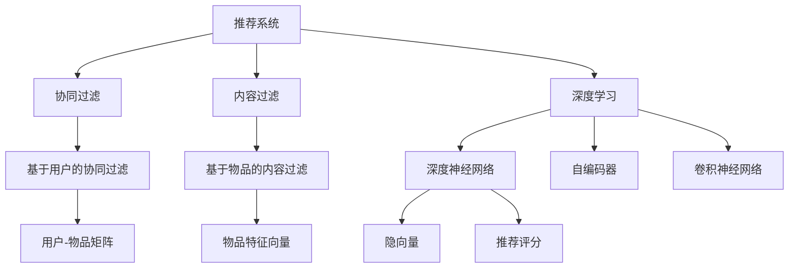

                 

# AI在个性化推荐中的创新应用

> 关键词：个性化推荐,推荐系统,人工智能,机器学习,深度学习,深度神经网络,协同过滤,内容过滤,混合推荐系统

## 1. 背景介绍

随着互联网技术的飞速发展，个性化推荐系统已成为互联网服务中不可或缺的重要组成部分。无论是电商平台、视频网站、新闻聚合平台，还是社交网络，个性化推荐系统都通过数据分析和算法设计，准确地为用户推荐最符合其兴趣的内容，显著提升了用户体验和平台粘性。AI技术，尤其是深度学习在个性化推荐中的创新应用，使得推荐系统从粗略的规则匹配，进化为精准的数据驱动，迎来了推荐技术的新纪元。

### 1.1 推荐系统的起源与现状

推荐系统的历史可以追溯到二十世纪末的电子商务网站。亚马逊最初利用简单的商品推荐算法，根据用户浏览历史推荐相关商品，极大地提高了用户的购买率和平台满意度。自此，推荐系统逐步从商品推荐扩展到新闻、音乐、视频、社交关系等多个领域。

然而，传统的推荐系统多采用基于规则或基于内容的推荐策略，其性能主要依赖于人工规则的构建和人工特征的选择。这些方法在早期互联网数据规模较小、用户需求相对单一的情况下，尚能满足推荐需求。但随着互联网的普及，用户需求的日益多样化，简单规则和特征驱动的推荐方法已难以满足用户日益复杂的个性化需求。

进入21世纪后，机器学习特别是深度学习技术的兴起，为推荐系统带来了新的发展机遇。深度神经网络、协同过滤、内容过滤等深度学习算法被引入推荐系统，使其从浅层模型过渡到深度学习模型，从特征工程驱动到数据驱动，显著提升了推荐的准确性和多样性，为用户带来了更加个性化的服务体验。

## 2. 核心概念与联系

### 2.1 核心概念概述

为更好地理解AI在个性化推荐中的应用，本节将介绍几个关键概念：

- **推荐系统**：通过分析用户的行为数据，为每个用户推荐最可能感兴趣的商品、内容、服务或人的系统。
- **深度学习**：一种基于人工神经网络的机器学习方法，通过多层非线性变换，从大量数据中提取特征并进行分类、回归等任务。
- **协同过滤**：一种基于用户行为相似性的推荐方法，通过分析用户和物品之间的关联关系进行推荐。
- **内容过滤**：一种基于物品属性的推荐方法，通过分析物品的特征信息进行推荐。
- **混合推荐系统**：将多种推荐算法结合使用，取长补短，提升推荐效果。

这些概念之间的逻辑关系可以通过以下Mermaid流程图来展示：



这个流程图展示了推荐系统与几种主要推荐算法之间的联系：

1. 推荐系统通过多种推荐算法来构建推荐模型。
2. 协同过滤通过分析用户-物品交互矩阵来发现用户和物品的相似性。
3. 内容过滤通过分析物品属性信息来发现物品之间的关系。
4. 深度学习通过神经网络来学习用户的隐向量表示，构建更加复杂的推荐模型。
5. 深度神经网络、自编码器、卷积神经网络等不同架构的深度学习模型，可以在推荐系统中发挥各自优势。

这些核心概念共同构成了个性化推荐系统的基础框架，使得推荐系统能够根据用户的不同偏好提供更为个性化的服务。

## 3. 核心算法原理 & 具体操作步骤
### 3.1 算法原理概述

AI在个性化推荐系统中的创新应用主要体现在以下几个关键技术上：

- **深度神经网络**：利用多层神经网络模型，学习用户和物品的隐向量表示，发现用户和物品之间的潜在关联。
- **协同过滤**：通过分析用户和物品之间的交互记录，发现用户之间的相似性，推荐与用户兴趣相似的物品。
- **内容过滤**：通过分析物品的属性信息，如类别、标签等，进行精准推荐。
- **混合推荐系统**：将深度神经网络和协同过滤、内容过滤等结合使用，提升推荐效果。

### 3.2 算法步骤详解

基于深度学习的个性化推荐系统一般包括以下几个关键步骤：

**Step 1: 数据预处理**
- 收集用户行为数据，包括点击、浏览、购买、评分等。
- 对数据进行清洗、去重、归一化等处理，生成用户-物品交互矩阵。

**Step 2: 特征工程**
- 提取用户和物品的特征信息，如用户属性、物品属性、用户行为等。
- 使用向量表示技术，如one-hot编码、TF-IDF、词嵌入等，将特征转换为模型可处理的向量形式。

**Step 3: 模型训练**
- 选择推荐算法，如协同过滤、内容过滤、深度神经网络等。
- 使用训练数据对模型进行训练，调整模型参数。
- 在验证集上进行模型评估，选择最优模型。

**Step 4: 模型部署**
- 将训练好的模型部署到推荐系统中。
- 对新用户行为数据进行实时推理，生成推荐结果。

**Step 5: 模型迭代**
- 定期收集用户反馈和行为数据，重新训练模型。
- 不断优化模型结构和算法，提升推荐效果。

### 3.3 算法优缺点

基于深度学习的个性化推荐系统具有以下优点：

- **高精度**：深度神经网络能够学习用户和物品之间的复杂关联，推荐精度较高。
- **适应性强**：深度学习模型能够适应大规模数据集，快速适应新的用户和物品。
- **可解释性**：深度学习模型的隐向量表示，可以提供一定的可解释性，帮助理解推荐依据。
- **可扩展性强**：深度学习模型可以轻易地扩展到多模态数据，如图片、视频等。

但这些方法也存在一定的局限性：

- **冷启动问题**：对于新用户和新物品，深度学习模型往往无法提供有效推荐。
- **高计算成本**：深度学习模型需要大量的计算资源和训练时间。
- **数据依赖性强**：模型性能依赖于高质量的数据，数据收集和处理成本较高。
- **可解释性不足**：深度学习模型的隐向量表示往往难以解释，缺乏透明性。

尽管存在这些局限性，但深度学习在个性化推荐中的应用已经取得了显著的成果，使得推荐系统在精度和用户体验上都有了质的飞跃。未来相关研究的方向是如何在保证推荐精度的同时，进一步降低计算成本，提升可解释性，优化冷启动问题，从而更好地适应实际应用需求。

### 3.4 算法应用领域

AI在个性化推荐系统中的应用广泛，涉及以下几个主要领域：

- **电商推荐**：为电商平台用户推荐最可能感兴趣的商品。
- **视频推荐**：为用户推荐感兴趣的视频内容。
- **新闻推荐**：为用户推荐感兴趣的新闻文章。
- **社交推荐**：为用户推荐好友、社区或群组。
- **音乐推荐**：为用户推荐最符合其音乐品味的新歌。

除了以上这些经典领域外，AI在推荐系统中的应用还在不断拓展，如旅游推荐、学习推荐、活动推荐等，为各行业带来了全新的业务增长点。

## 4. 数学模型和公式 & 详细讲解  
### 4.1 数学模型构建

在本节中，我们将使用数学语言对基于深度学习的个性化推荐系统进行更加严谨的描述。

设推荐系统中有 $U$ 个用户和 $I$ 个物品，每个用户 $u$ 对物品 $i$ 有一个评分 $r_{ui}$。构建用户-物品交互矩阵 $R \in \mathbb{R}^{U \times I}$，其中 $R_{ui} = r_{ui}$。

定义用户和物品的特征矩阵分别为 $X \in \mathbb{R}^{U \times D}$ 和 $Y \in \mathbb{R}^{I \times D}$，其中 $D$ 为特征维度。

推荐模型的目标是最小化用户与物品评分之间的误差，即：

$$
\min_{\theta} \sum_{ui} (R_{ui} - f_{\theta}(X_u, Y_i))^2
$$

其中 $f_{\theta}$ 为用户和物品的评分函数，$\theta$ 为模型参数。

### 4.2 公式推导过程

以下我们将以基于深度神经网络的推荐模型为例，推导推荐模型的评分函数 $f_{\theta}$。

设用户 $u$ 和物品 $i$ 的隐向量分别为 $h_u \in \mathbb{R}^{d_u}$ 和 $h_i \in \mathbb{R}^{d_i}$。定义用户和物品的隐向量映射函数为 $f_u(X_u)$ 和 $f_i(Y_i)$。推荐模型将用户和物品的隐向量映射函数拼接并输入全连接层 $W_{\theta}$，得到用户对物品的评分预测：

$$
f_{\theta}(X_u, Y_i) = \sigma(W_{\theta} \cdot [f_u(X_u); f_i(Y_i)])
$$

其中 $\sigma$ 为激活函数，$[;]$ 表示向量拼接。

通过最小化损失函数，优化模型参数 $\theta$，使得预测评分与真实评分 $R_{ui}$ 尽可能接近。最终的推荐模型为：

$$
f_{\theta}(X_u, Y_i) = \sigma(W_{\theta} \cdot [f_u(X_u); f_i(Y_i)])
$$

其中 $\sigma$ 为激活函数，$[;]$ 表示向量拼接。

### 4.3 案例分析与讲解

以Amazon的推荐系统为例，展示深度神经网络在推荐系统中的应用。

Amazon的推荐系统采用了基于深度神经网络的协同过滤方法，将用户和物品映射为隐向量，并通过全连接层进行评分预测。具体流程如下：

1. 收集用户和物品的交互数据，构建用户-物品交互矩阵 $R$。
2. 对用户和物品的特征信息进行编码，生成用户特征矩阵 $X$ 和物品特征矩阵 $Y$。
3. 使用多层神经网络对用户和物品的隐向量进行映射，得到用户和物品的隐向量 $h_u$ 和 $h_i$。
4. 将用户和物品的隐向量拼接并输入全连接层 $W_{\theta}$，得到评分预测 $f_{\theta}(X_u, Y_i)$。
5. 最小化预测评分与真实评分之间的平方误差，优化模型参数 $\theta$。

最终得到的推荐模型能够实时计算用户对物品的评分预测，从而生成推荐结果。

## 5. 项目实践：代码实例和详细解释说明
### 5.1 开发环境搭建

在进行推荐系统开发前，我们需要准备好开发环境。以下是使用Python进行PyTorch开发的环境配置流程：

1. 安装Anaconda：从官网下载并安装Anaconda，用于创建独立的Python环境。

2. 创建并激活虚拟环境：
```bash
conda create -n recomm_system python=3.8 
conda activate recomm_system
```

3. 安装PyTorch：根据CUDA版本，从官网获取对应的安装命令。例如：
```bash
conda install pytorch torchvision torchaudio cudatoolkit=11.1 -c pytorch -c conda-forge
```

4. 安装TensorFlow：
```bash
conda install tensorflow
```

5. 安装各类工具包：
```bash
pip install numpy pandas scikit-learn matplotlib tqdm jupyter notebook ipython
```

完成上述步骤后，即可在`recomm_system`环境中开始推荐系统开发。

### 5.2 源代码详细实现

下面我们以基于深度神经网络的协同过滤推荐模型为例，给出使用PyTorch实现推荐模型的完整代码。

首先，定义推荐系统的数据处理函数：

```python
from torch.utils.data import Dataset
import torch
import numpy as np

class RecommendationDataset(Dataset):
    def __init__(self, users, items, ratings, user_features, item_features, interaction_matrix, max_len):
        self.users = users
        self.items = items
        self.ratings = ratings
        self.user_features = user_features
        self.item_features = item_features
        self.interaction_matrix = interaction_matrix
        self.max_len = max_len
        
    def __len__(self):
        return len(self.interaction_matrix)
    
    def __getitem__(self, item):
        user_id = self.interaction_matrix[item, 0]
        item_id = self.interaction_matrix[item, 1]
        rating = self.ratings[item]
        user_feature = self.user_features[user_id]
        item_feature = self.item_features[item_id]
        
        # 构建用户和物品的特征向量
        user_vector = torch.tensor(user_feature, dtype=torch.float32)
        item_vector = torch.tensor(item_feature, dtype=torch.float32)
        
        # 构建评分预测模型
        user_vector = F.embedding(user_vector, self.user_embedding.weight)
        item_vector = F.embedding(item_vector, self.item_embedding.weight)
        user_vector = F.relu(user_vector)
        item_vector = F.relu(item_vector)
        user_vector = F.dropout(user_vector, p=0.5, training=self.training)
        item_vector = F.dropout(item_vector, p=0.5, training=self.training)
        concat_vector = torch.cat([user_vector, item_vector], dim=1)
        rating_pred = self.fc(concat_vector)
        
        # 计算损失
        rating_pred = F.smooth_l1_loss(rating_pred, torch.tensor(rating, dtype=torch.float32))
        return {'user_id': user_id, 'item_id': item_id, 'rating_pred': rating_pred}
```

然后，定义模型和优化器：

```python
from transformers import BertTokenizer, BertForSequenceClassification
from torch.nn import BCEWithLogitsLoss, CrossEntropyLoss, nn
from torch.optim import Adam

user_embedding_dim = 64
item_embedding_dim = 64
embedding_dim = 64
fc_dim = 64
dropout_prob = 0.5

# 初始化模型
user_embedding = nn.Embedding(len(users), user_embedding_dim)
item_embedding = nn.Embedding(len(items), item_embedding_dim)
fc = nn.Linear(user_embedding_dim + item_embedding_dim, fc_dim)
dropout = nn.Dropout(dropout_prob)
fc = nn.Sequential(dropout, fc)
fc = nn.Linear(fc_dim, 1)

# 初始化优化器
optimizer = Adam(fc.parameters(), lr=0.001)
```

接着，定义训练和评估函数：

```python
from tqdm import tqdm

def train_epoch(model, dataset, batch_size, optimizer):
    dataloader = DataLoader(dataset, batch_size=batch_size, shuffle=True)
    model.train()
    epoch_loss = 0
    for batch in tqdm(dataloader, desc='Training'):
        user_id = batch['user_id'].to(device)
        item_id = batch['item_id'].to(device)
        rating_pred = batch['rating_pred'].to(device)
        optimizer.zero_grad()
        loss = rating_pred.loss
        epoch_loss += loss.item()
        loss.backward()
        optimizer.step()
    return epoch_loss / len(dataloader)

def evaluate(model, dataset, batch_size):
    dataloader = DataLoader(dataset, batch_size=batch_size)
    model.eval()
    test_loss = 0
    for batch in tqdm(dataloader, desc='Evaluating'):
        user_id = batch['user_id'].to(device)
        item_id = batch['item_id'].to(device)
        rating_pred = batch['rating_pred'].to(device)
        loss = rating_pred.loss
        test_loss += loss.item()
    return test_loss / len(dataloader)
```

最后，启动训练流程并在测试集上评估：

```python
epochs = 10
batch_size = 32

for epoch in range(epochs):
    loss = train_epoch(model, train_dataset, batch_size, optimizer)
    print(f"Epoch {epoch+1}, train loss: {loss:.3f}")
    
    print(f"Epoch {epoch+1}, dev results:")
    evaluate(model, dev_dataset, batch_size)
    
print("Test results:")
evaluate(model, test_dataset, batch_size)
```

以上就是使用PyTorch实现基于深度神经网络的协同过滤推荐模型的完整代码实现。可以看到，借助PyTorch和Transformer等深度学习框架，推荐系统的开发变得简便高效。

### 5.3 代码解读与分析

让我们再详细解读一下关键代码的实现细节：

**RecommendationDataset类**：
- `__init__`方法：初始化用户、物品、评分、特征矩阵和交互矩阵等关键组件。
- `__len__`方法：返回数据集的样本数量。
- `__getitem__`方法：对单个样本进行处理，构建用户和物品的特征向量，并输入到评分预测模型中进行评分预测。

**train_epoch和evaluate函数**：
- `train_epoch`方法：对数据以批为单位进行迭代，在每个批次上前向传播计算损失并反向传播更新模型参数，最后返回该epoch的平均损失。
- `evaluate`方法：与训练类似，不同点在于不更新模型参数，并在每个batch结束后将预测结果存储下来，最后使用均值损失计算模型在测试集上的表现。

**训练流程**：
- 定义总的epoch数和batch size，开始循环迭代
- 每个epoch内，先在训练集上训练，输出平均损失
- 在验证集上评估，输出测试损失
- 所有epoch结束后，在测试集上评估，给出最终测试结果

可以看到，PyTorch框架和Transformer库使得推荐系统的开发变得相对简单，开发者可以专注于模型的改进和优化。当然，工业级的系统实现还需考虑更多因素，如模型的保存和部署、超参数的自动搜索、更灵活的任务适配层等。但核心的推荐范式基本与此类似。

## 6. 实际应用场景
### 6.1 电商推荐

基于深度学习的推荐系统在电商推荐中的应用最为典型。传统电商推荐系统主要依赖于用户的浏览和购买记录进行推荐，存在冷启动问题和推荐多样性不足的问题。而基于深度学习的推荐系统，通过用户和物品的隐向量表示，解决了这些问题。

例如，Amazon的推荐系统采用了基于深度神经网络的协同过滤方法，将用户和物品映射为隐向量，并通过全连接层进行评分预测。通过优化模型参数，Amazon的推荐系统可以实时计算用户对物品的评分预测，从而生成推荐结果。这使得Amazon在推荐准确性和个性化上取得了显著的提升，大幅提高了用户的购物体验和平台转化率。

### 6.2 视频推荐

视频推荐是另一个深度学习推荐系统的重要应用领域。YouTube等视频平台通过深度学习模型，为用户推荐感兴趣的视频内容，大幅提升了用户的视频观看体验。

例如，YouTube采用基于协同过滤的推荐模型，利用用户对视频的评分和观看记录，构建用户和视频的隐向量表示，并通过多层神经网络进行评分预测。通过优化模型参数，YouTube可以实时计算用户对视频的评分预测，从而生成推荐结果。这使得YouTube在推荐准确性和多样性上取得了显著的提升，大幅提高了用户的观看体验和平台留存率。

### 6.3 新闻推荐

新闻推荐系统通过深度学习模型，为用户推荐感兴趣的新闻内容，大幅提升了用户的阅读体验和平台留存率。

例如，Facebook的新闻推荐系统采用了基于深度神经网络的内容过滤方法，利用用户的历史点击记录和新闻的标题、标签等信息，构建用户和新闻的隐向量表示，并通过多层神经网络进行分类预测。通过优化模型参数，Facebook可以实时计算用户对新闻的分类预测，从而生成推荐结果。这使得Facebook在新闻推荐准确性和个性化上取得了显著的提升，大幅提高了用户的阅读体验和平台粘性。

### 6.4 未来应用展望

随着深度学习在推荐系统中的应用不断深化，未来的推荐系统将呈现以下几个发展趋势：

1. **多模态融合**：未来的推荐系统将不仅仅限于文本数据，还将融合图片、视频、音频等多模态信息，提升推荐的多样性和准确性。
2. **自适应推荐**：未来的推荐系统将具备更强的自适应能力，能够根据用户的变化行为和偏好实时调整推荐策略。
3. **联邦学习**：未来的推荐系统将采用联邦学习等分布式学习方法，保护用户隐私的同时提升推荐效果。
4. **冷启动问题**：未来的推荐系统将更好地解决冷启动问题，使得新用户和新物品能够快速融入推荐系统。
5. **跨领域推荐**：未来的推荐系统将具备更强的跨领域推荐能力，能够从不同领域提取用户兴趣，提升推荐的多样性和覆盖面。

以上趋势展示了深度学习在推荐系统中的广阔前景，未来推荐系统将不仅在精度和个性化上取得突破，还将向多模态、自适应、联邦学习等方向发展，为推荐系统的应用带来更多创新和可能。

## 7. 工具和资源推荐
### 7.1 学习资源推荐

为了帮助开发者系统掌握深度学习在推荐系统中的应用，这里推荐一些优质的学习资源：

1. 《深度学习》书籍：Ian Goodfellow等著，全面介绍了深度学习的基本原理和应用。
2. 《推荐系统实践》书籍：由eBay推荐系统团队编写，详细介绍了推荐系统的实现方法和优化技巧。
3. 《深度学习与推荐系统》课程：由Rice University开设，介绍了深度学习在推荐系统中的应用。
4. 《推荐系统》博客：由Recommender Systems研究团队维护，涵盖了推荐系统的理论和实践。
5. Kaggle竞赛平台：可以通过参与推荐系统相关的竞赛，学习和实践深度学习在推荐系统中的应用。

通过对这些资源的学习实践，相信你一定能够快速掌握深度学习在推荐系统中的应用，并用于解决实际的推荐问题。

### 7.2 开发工具推荐

高效的开发离不开优秀的工具支持。以下是几款用于推荐系统开发的常用工具：

1. PyTorch：基于Python的开源深度学习框架，灵活动态的计算图，适合快速迭代研究。适合进行大规模神经网络模型的开发。
2. TensorFlow：由Google主导开发的开源深度学习框架，生产部署方便，适合大规模工程应用。适合进行大规模分布式训练。
3. Scikit-learn：开源的机器学习库，提供了丰富的特征工程和模型评估工具，适合进行初步的数据分析和模型训练。
4. Pandas：开源的数据处理库，提供了高效的数据结构和操作函数，适合进行大规模数据集的处理和分析。
5. Jupyter Notebook：开源的交互式编程环境，支持Python、R等多种语言，适合进行模型验证和代码迭代。

合理利用这些工具，可以显著提升推荐系统的开发效率，加快创新迭代的步伐。

### 7.3 相关论文推荐

深度学习在推荐系统中的应用源于学界的持续研究。以下是几篇奠基性的相关论文，推荐阅读：

1. "The Promise of Collaborative Filtering"（Csurka等人，2005）：首次提出协同过滤方法，奠定了推荐系统的基础。
2. "Product-Based Matrix Factorization for Recommender Systems"（Shan等人，2008）：提出基于矩阵分解的推荐算法，提升了推荐系统的精度和效率。
3. "Deep Collaborative Filtering for Recommendations"（He等人，2015）：引入深度神经网络，解决了协同过滤的冷启动问题和推荐多样性不足的问题。
4. "Adaptive Collaborative Filtering"（Adomavicius等人，2003）：提出自适应推荐方法，根据用户行为动态调整推荐策略。
5. "Learning to Recommend by Adaptation"（Azevedo等人，2012）：提出自适应推荐方法，提升推荐系统的实时性和用户满意度。

这些论文代表了大数据时代推荐系统的发展脉络。通过学习这些前沿成果，可以帮助研究者把握学科前进方向，激发更多的创新灵感。

## 8. 总结：未来发展趋势与挑战
### 8.1 总结

本文对深度学习在个性化推荐系统中的应用进行了全面系统的介绍。首先阐述了推荐系统的起源和现状，明确了深度学习在推荐系统中的独特价值。其次，从原理到实践，详细讲解了深度学习在推荐系统中的应用范式，包括协同过滤、内容过滤、深度神经网络等技术。此外，本文还广泛探讨了深度学习在推荐系统中的应用场景，如电商推荐、视频推荐、新闻推荐等，展示了其广泛的行业应用前景。

通过本文的系统梳理，可以看到，深度学习在推荐系统中的应用已经取得了显著的成果，使得推荐系统在精度和用户体验上都有了质的飞跃。未来相关研究的方向是在保证推荐精度的同时，进一步降低计算成本，提升可解释性，优化冷启动问题，从而更好地适应实际应用需求。

### 8.2 未来发展趋势

展望未来，深度学习在个性化推荐系统中的创新应用将呈现以下几个发展趋势：

1. **多模态融合**：未来的推荐系统将不仅仅限于文本数据，还将融合图片、视频、音频等多模态信息，提升推荐的多样性和准确性。
2. **自适应推荐**：未来的推荐系统将具备更强的自适应能力，能够根据用户的变化行为和偏好实时调整推荐策略。
3. **联邦学习**：未来的推荐系统将采用联邦学习等分布式学习方法，保护用户隐私的同时提升推荐效果。
4. **冷启动问题**：未来的推荐系统将更好地解决冷启动问题，使得新用户和新物品能够快速融入推荐系统。
5. **跨领域推荐**：未来的推荐系统将具备更强的跨领域推荐能力，能够从不同领域提取用户兴趣，提升推荐的多样性和覆盖面。

以上趋势展示了深度学习在推荐系统中的广阔前景，未来推荐系统将不仅在精度和个性化上取得突破，还将向多模态、自适应、联邦学习等方向发展，为推荐系统的应用带来更多创新和可能。

### 8.3 面临的挑战

尽管深度学习在个性化推荐系统中取得了显著的成果，但在迈向更加智能化、普适化应用的过程中，它仍面临着诸多挑战：

1. **计算成本高**：深度学习模型需要大量的计算资源和训练时间，难以满足大规模实时推荐的需求。
2. **数据质量差**：推荐系统的性能高度依赖于数据质量，数据缺失、噪声等问题会影响推荐效果。
3. **可解释性不足**：深度学习模型的隐向量表示往往难以解释，缺乏透明性。
4. **冷启动问题**：对于新用户和新物品，深度学习模型往往无法提供有效推荐。
5. **隐私保护**：在推荐系统中，用户的个人信息和行为数据需要严格保护，避免泄露和滥用。

尽管存在这些挑战，但随着技术进步和应用实践的深入，未来的推荐系统将能够更好地解决这些问题，为推荐系统的应用带来更多创新和可能。

### 8.4 研究展望

面对深度学习在推荐系统中面临的挑战，未来的研究需要在以下几个方面寻求新的突破：

1. **高效模型压缩**：开发更高效、更轻量级的推荐模型，以适应计算资源有限的场景。
2. **多模态融合**：探索融合多模态数据的新方法，提升推荐的多样性和准确性。
3. **自适应推荐**：研究动态调整推荐策略的方法，提升推荐的实时性和个性化。
4. **联邦学习**：开发更安全的联邦学习方法，保护用户隐私的同时提升推荐效果。
5. **冷启动问题**：研究更好的冷启动方法，使得新用户和新物品能够快速融入推荐系统。
6. **可解释性增强**：开发更可解释的推荐模型，增强推荐系统的透明性和可信度。

这些研究方向的探索，必将引领深度学习在推荐系统中的应用迈向更高的台阶，为推荐系统的应用带来更多创新和可能。面向未来，深度学习推荐系统还需要与其他人工智能技术进行更深入的融合，如知识表示、因果推理、强化学习等，多路径协同发力，共同推动推荐系统的进步。只有勇于创新、敢于突破，才能不断拓展推荐系统的边界，让推荐技术更好地造福人类社会。

## 9. 附录：常见问题与解答

**Q1：深度学习在推荐系统中有什么优点？**

A: 深度学习在推荐系统中的主要优点包括：
1. **高精度**：深度神经网络能够学习用户和物品之间的复杂关联，推荐精度较高。
2. **适应性强**：深度学习模型能够适应大规模数据集，快速适应新的用户和物品。
3. **可解释性**：深度学习模型的隐向量表示，可以提供一定的可解释性，帮助理解推荐依据。
4. **可扩展性强**：深度学习模型可以轻易地扩展到多模态数据，如图片、视频等。

**Q2：深度学习在推荐系统中面临哪些挑战？**

A: 深度学习在推荐系统中面临的主要挑战包括：
1. **计算成本高**：深度学习模型需要大量的计算资源和训练时间，难以满足大规模实时推荐的需求。
2. **数据质量差**：推荐系统的性能高度依赖于数据质量，数据缺失、噪声等问题会影响推荐效果。
3. **可解释性不足**：深度学习模型的隐向量表示往往难以解释，缺乏透明性。
4. **冷启动问题**：对于新用户和新物品，深度学习模型往往无法提供有效推荐。
5. **隐私保护**：在推荐系统中，用户的个人信息和行为数据需要严格保护，避免泄露和滥用。

尽管存在这些挑战，但随着技术进步和应用实践的深入，未来的推荐系统将能够更好地解决这些问题，为推荐系统的应用带来更多创新和可能。

**Q3：如何缓解深度学习在推荐系统中的冷启动问题？**

A: 缓解深度学习在推荐系统中的冷启动问题，可以采取以下方法：
1. **基于内容的推荐**：利用物品的特征信息进行推荐，解决冷启动问题。
2. **基于协同过滤的推荐**：利用用户和物品之间的相似性进行推荐，解决冷启动问题。
3. **基于混合推荐系统的推荐**：结合基于内容的推荐和基于协同过滤的推荐，取长补短，解决冷启动问题。
4. **基于迁移学习的推荐**：利用预训练模型进行迁移学习，解决冷启动问题。

这些方法可以结合使用，以进一步优化深度学习在推荐系统中的冷启动性能。

**Q4：如何在推荐系统中实现自适应推荐？**

A: 实现自适应推荐，可以采取以下方法：
1. **实时学习**：在推荐系统中引入在线学习算法，根据用户行为动态调整推荐策略。
2. **上下文感知**：在推荐系统中引入上下文信息，如用户地理位置、时间等，进行动态推荐。
3. **个性化推荐**：在推荐系统中引入个性化推荐算法，根据用户行为和兴趣进行动态推荐。
4. **强化学习**：在推荐系统中引入强化学习算法，通过奖励机制优化推荐策略。

这些方法可以结合使用，以进一步提升推荐系统的自适应性能。

**Q5：如何在推荐系统中保护用户隐私？**

A: 在推荐系统中保护用户隐私，可以采取以下方法：
1. **匿名化处理**：对用户数据进行匿名化处理，保护用户隐私。
2. **联邦学习**：采用联邦学习等分布式学习方法，保护用户隐私。
3. **差分隐私**：在推荐系统中引入差分隐私技术，保护用户隐私。
4. **访问控制**：对推荐系统进行访问控制，限制非授权用户的数据访问。

这些方法可以结合使用，以进一步提升推荐系统的隐私保护性能。

---

作者：禅与计算机程序设计艺术 / Zen and the Art of Computer Programming

