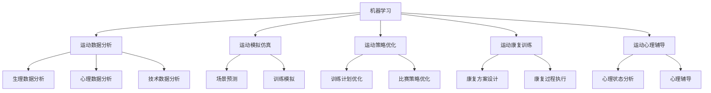

                 

# AI在体育训练中的应用:优化运动员表现

## 1. 背景介绍

### 1.1 问题由来

随着人工智能(AI)技术的迅猛发展，其在体育训练领域的应用也日益广泛。传统的体育训练往往依赖于教练的经验和人力的指导，而AI技术的引入，可以通过数据分析、模拟仿真等方式，帮助运动员更好地训练，提高训练效果和表现。AI在体育训练中的应用，正在改变传统训练模式，推动体育训练的智能化、精准化和个性化发展。

### 1.2 问题核心关键点

AI在体育训练中的应用，主要集中在以下几个方面：

- 运动数据分析：通过收集运动员在训练和比赛中的数据，利用机器学习技术进行数据分析，发现训练中的不足和潜在问题。
- 运动模拟仿真：构建虚拟训练环境，通过计算机模拟仿真，进行场景预测和训练模拟，帮助运动员提高技能和应对比赛。
- 运动策略优化：利用AI算法分析比赛数据，制定个性化训练计划和比赛策略，提升运动员的竞争力和训练效果。
- 运动康复训练：针对运动员的伤病情况，通过AI辅助进行康复训练，加速康复过程。
- 运动心理辅导：利用AI技术进行心理分析和辅导，帮助运动员提高心理素质和比赛表现。

这些核心关键点展示了AI技术在体育训练中的多方面应用，为运动员的全面发展和竞技水平的提升提供了强大的支持。

## 2. 核心概念与联系

### 2.1 核心概念概述

为了更好地理解AI在体育训练中的应用，本节将介绍几个关键概念：

- 机器学习：通过数据驱动的算法，使机器具有学习能力，可以从经验中提升性能。
- 运动数据分析：从运动员的生理、心理、技术等方面收集数据，利用机器学习进行分析和挖掘。
- 运动模拟仿真：构建虚拟环境，利用AI技术进行运动场景模拟，提高运动员的实战能力。
- 运动策略优化：通过AI算法对比赛数据进行分析，帮助制定个性化的训练计划和比赛策略。
- 运动康复训练：利用AI技术进行运动康复方案的设计和执行，加速运动员的康复过程。
- 运动心理辅导：通过AI技术进行心理状态的分析和辅导，提高运动员的心理素质和比赛表现。

这些概念之间的逻辑关系可以通过以下Mermaid流程图来展示：



这个流程图展示了机器学习在不同体育训练场景中的应用，包括数据收集、分析和利用，运动模拟和仿真，以及策略优化和康复训练等。

## 3. 核心算法原理 & 具体操作步骤
### 3.1 算法原理概述

AI在体育训练中的应用，主要基于机器学习算法，特别是监督学习和无监督学习算法。其核心思想是通过收集运动员的数据，利用机器学习算法进行建模和分析，发现其中的规律和模式，进而辅助训练和决策。

### 3.2 算法步骤详解

AI在体育训练中的具体操作步骤如下：

1. **数据收集与预处理**：收集运动员在训练和比赛中的各种数据，包括生理数据、技术数据、心理数据等。数据预处理包括数据清洗、归一化和特征工程等步骤。

2. **模型选择与训练**：根据训练任务的需求，选择合适的机器学习模型，如线性回归、决策树、随机森林、神经网络等，并利用收集到的数据进行模型训练。训练过程中需要选择合适的超参数，如学习率、正则化系数等，以提高模型的准确性和泛化能力。

3. **数据分析与挖掘**：利用训练好的模型对收集到的数据进行分析和挖掘，发现其中的规律和模式。例如，可以通过分析运动员的技术数据，发现其在不同技术动作上的表现差异，或者通过心理数据分析，了解运动员的心理状态和情绪变化。

4. **训练与模拟仿真**：将分析结果应用于运动员的训练中，通过虚拟训练环境和运动模拟仿真，帮助运动员进行技能提升和实战模拟。例如，可以利用虚拟现实(VR)技术，模拟比赛场景，让运动员在仿真环境中进行实战训练。

5. **策略优化与执行**：利用AI算法对比赛数据进行分析，制定个性化的训练计划和比赛策略，提升运动员的竞争力和训练效果。例如，可以通过分析对手的比赛数据，制定针对性的训练计划，或者通过模拟比赛，调整比赛策略。

6. **康复训练与心理辅导**：针对运动员的伤病情况，利用AI技术进行康复训练方案的设计和执行，同时进行心理状态的分析和辅导，提高运动员的心理素质和比赛表现。例如，可以利用AI技术进行康复进度监测，或者通过心理辅导工具，帮助运动员进行心理调节。

### 3.3 算法优缺点

AI在体育训练中的应用具有以下优点：

- 高效性：利用机器学习算法进行数据分析和建模，可以大大提高训练和决策的效率。
- 个性化：通过分析运动员的个性化数据，制定个性化的训练计划和比赛策略，提升训练效果。
- 精准性：利用AI技术进行数据分析和模拟仿真，可以更精准地预测比赛结果和运动员的表现。

然而，AI在体育训练中也有一些缺点：

- 依赖数据：AI的应用需要大量的高质量数据作为支撑，数据收集和处理的成本较高。
- 技术复杂：AI技术的实现和应用需要较强的技术背景，普通教练和运动员可能难以掌握。
- 可解释性：AI算法的决策过程往往是"黑盒"的，难以解释其内部工作机制。
- 伦理问题：AI技术在训练和比赛中的应用，可能引发隐私保护和伦理问题，需要严格监管。

## 4. 数学模型和公式 & 详细讲解 & 举例说明

### 4.1 数学模型构建

AI在体育训练中的应用，涉及多个领域的数据和算法。以运动数据分析为例，可以构建如下数学模型：

设运动员在训练中的生理数据为 $x_1, x_2, ..., x_n$，技术数据为 $y_1, y_2, ..., y_n$，心理数据为 $z_1, z_2, ..., z_n$。我们可以构建如下的线性回归模型：

$$
y = \alpha x + \beta z + \epsilon
$$

其中，$\alpha$ 和 $\beta$ 为回归系数，$\epsilon$ 为误差项。通过对模型进行训练，可以预测运动员在未来的比赛表现。

### 4.2 公式推导过程

线性回归模型的推导过程如下：

1. **最小二乘法**：最小二乘法是线性回归中最常用的方法。其基本思想是通过最小化误差平方和，求解模型参数 $\alpha$ 和 $\beta$。具体公式为：

$$
\min_{\alpha, \beta} \sum_{i=1}^n (y_i - (\alpha x_i + \beta z_i))^2
$$

2. **正则化**：为了减少过拟合，可以在损失函数中加入正则化项，如L2正则化。正则化公式为：

$$
\min_{\alpha, \beta} \frac{1}{2} \sum_{i=1}^n (y_i - (\alpha x_i + \beta z_i))^2 + \lambda (\alpha^2 + \beta^2)
$$

其中，$\lambda$ 为正则化系数。

3. **交叉验证**：为了评估模型的泛化能力，可以使用交叉验证方法。通过将数据集分为训练集和验证集，对模型进行训练和验证，以选择合适的参数和模型。

### 4.3 案例分析与讲解

假设我们要分析运动员在训练中的生理数据和技术数据，以预测其比赛表现。我们可以使用以下数据集：

| 运动员编号 | 生理数据 | 技术数据 | 比赛表现 |
|------------|----------|----------|----------|
| 1          | 80       | 0.5      | 80       |
| 2          | 85       | 0.6      | 85       |
| ...        | ...      | ...      | ...      |

我们可以将数据集分为训练集和验证集，并使用线性回归模型进行训练和预测。具体步骤如下：

1. **数据预处理**：对生理数据和技术数据进行归一化处理，以保证数据的一致性和可比性。

2. **模型训练**：利用训练集进行模型训练，求解回归系数 $\alpha$ 和 $\beta$。

3. **模型验证**：利用验证集对模型进行验证，评估模型的泛化能力和预测准确度。

4. **预测结果**：将测试集代入模型，预测运动员在未来的比赛表现。

## 5. 项目实践：代码实例和详细解释说明
### 5.1 开发环境搭建

在进行体育训练数据处理和分析时，我们需要准备好开发环境。以下是使用Python进行数据分析的开发环境配置流程：

1. 安装Anaconda：从官网下载并安装Anaconda，用于创建独立的Python环境。

2. 创建并激活虚拟环境：
```bash
conda create -n sports-analysis python=3.8 
conda activate sports-analysis
```

3. 安装相关库：
```bash
conda install numpy pandas scikit-learn matplotlib seaborn jupyter notebook ipython
```

4. 安装运动数据模拟库：
```bash
pip install pyaap
```

完成上述步骤后，即可在`sports-analysis`环境中开始数据分析实践。

### 5.2 源代码详细实现

下面我们以运动员训练数据为例，给出使用Python进行数据分析的代码实现。

首先，导入必要的库和数据：

```python
import numpy as np
import pandas as pd
from sklearn.linear_model import LinearRegression
from sklearn.model_selection import train_test_split
import matplotlib.pyplot as plt

# 导入运动员训练数据
data = pd.read_csv('athlete_data.csv')

# 数据预处理
X = data[['physiological_data', 'technical_data']]
y = data['performance']
X_train, X_test, y_train, y_test = train_test_split(X, y, test_size=0.2, random_state=42)

# 构建线性回归模型
model = LinearRegression()
model.fit(X_train, y_train)

# 预测和评估
y_pred = model.predict(X_test)
print('R^2:', model.score(X_test, y_test))

# 可视化
plt.scatter(y_test, y_pred)
plt.xlabel('Actual Performance')
plt.ylabel('Predicted Performance')
plt.title('Linear Regression Model')
plt.show()
```

这段代码主要完成了以下几个步骤：

1. **数据导入和预处理**：将运动员训练数据导入Pandas DataFrame，并进行数据预处理，包括特征选择和数据拆分。

2. **模型训练**：利用线性回归模型对训练集进行训练，求解回归系数。

3. **预测和评估**：利用训练好的模型对测试集进行预测，并计算模型的R^2值，评估模型的预测能力。

4. **可视化**：将预测结果可视化，展示模型的预测效果。

### 5.3 代码解读与分析

让我们再详细解读一下关键代码的实现细节：

- `pd.read_csv`：使用Pandas库读取运动员训练数据，将其导入DataFrame对象。

- `train_test_split`：使用sklearn库对数据进行拆分，将数据集分为训练集和测试集，以便于模型训练和评估。

- `LinearRegression`：使用scikit-learn库的线性回归模型，构建线性回归模型。

- `model.fit`：利用训练集对模型进行训练，求解回归系数。

- `model.predict`：利用训练好的模型对测试集进行预测，返回预测结果。

- `model.score`：计算模型的R^2值，评估模型的预测能力。

- `plt.scatter`：使用Matplotlib库绘制散点图，展示预测结果和实际结果的对比。

可以看到，这段代码的实现相对简洁，但涵盖了数据处理、模型训练、预测评估和可视化等关键步骤，是一个完整的体育训练数据分析范例。

### 5.4 运行结果展示

运行上述代码后，将生成一个散点图，展示预测结果和实际结果的对比。如果模型的预测效果较好，散点图将接近于一条直线。


## 6. 实际应用场景
### 6.1 运动员训练计划优化

利用AI技术，可以对运动员的训练数据进行分析，发现其中的规律和模式，制定个性化的训练计划，提升训练效果。例如，可以通过分析运动员的技术数据，发现其在不同技术动作上的表现差异，从而调整训练重点。

在技术实现上，可以收集运动员在训练中的技术数据，如动作轨迹、力量数据等，利用机器学习算法进行分析和建模。通过模型训练和预测，可以发现运动员在不同技术动作上的表现差异，进而调整训练计划，使其更加个性化和科学。

### 6.2 比赛策略优化

AI技术可以用于分析比赛数据，制定个性化的比赛策略，提升运动员的竞技水平。例如，可以通过分析对手的比赛数据，制定针对性的训练计划，或者通过模拟比赛，调整比赛策略。

在技术实现上，可以收集对手的比赛数据，利用机器学习算法进行分析和建模。通过模型训练和预测，可以发现对手的优点和缺点，进而制定相应的比赛策略，提高运动员的胜算。

### 6.3 运动康复训练

AI技术可以用于辅助运动员进行康复训练，加速康复过程。例如，可以利用AI技术进行康复进度监测，或者通过虚拟现实(VR)技术进行康复训练。

在技术实现上，可以收集运动员的康复数据，如康复进度、疼痛数据等，利用机器学习算法进行分析和建模。通过模型训练和预测，可以评估康复进度，调整康复计划，使其更加科学和个性化。

### 6.4 运动心理辅导

AI技术可以用于分析运动员的心理状态，进行心理辅导，提高运动员的心理素质和比赛表现。例如，可以通过分析运动员的比赛数据，发现其情绪波动，进而进行心理调节。

在技术实现上，可以收集运动员的比赛数据，如表情数据、语音数据等，利用机器学习算法进行分析和建模。通过模型训练和预测，可以发现运动员的心理状态变化，进而进行心理调节，提升其比赛表现。

## 7. 工具和资源推荐
### 7.1 学习资源推荐

为了帮助开发者系统掌握AI在体育训练中的应用，这里推荐一些优质的学习资源：

1. 《深度学习与体育》系列博文：由AI专家撰写，深入浅出地介绍了深度学习在体育训练中的应用，包括数据分析、运动模拟仿真、运动策略优化等方面。

2. 《机器学习与体育》课程：斯坦福大学开设的机器学习课程，涵盖了机器学习在体育领域的基础理论和实践应用。

3. 《运动数据分析与建模》书籍：详细介绍了运动数据的收集、预处理和分析方法，包括机器学习算法在运动数据分析中的应用。

4. 《运动模拟仿真技术》视频教程：介绍运动模拟仿真技术的实现原理和应用案例，包括虚拟现实技术在运动训练中的应用。

5. 《运动康复训练与AI》专题讲座：邀请AI和运动康复领域的专家进行讲解，介绍运动康复训练中AI技术的应用，包括数据收集、分析与模型训练等方面。

通过对这些资源的学习实践，相信你一定能够快速掌握AI在体育训练中的应用方法，并用于解决实际的体育训练问题。

### 7.2 开发工具推荐

高效的开发离不开优秀的工具支持。以下是几款用于AI在体育训练中应用的常用工具：

1. Python：作为数据科学和机器学习领域的主流语言，Python提供了丰富的库和工具，如Pandas、NumPy、Scikit-learn等，适合进行数据处理和分析。

2. R语言：R语言也是数据科学和统计分析的重要工具，提供了丰富的统计函数和数据可视化工具，适合进行复杂的数据分析和建模。

3. Pyaap：一个用于体育运动模拟仿真的开源库，可以生成虚拟训练环境和运动场景，帮助运动员进行技能提升和实战模拟。

4. Jupyter Notebook：一个基于Web的交互式计算环境，适合进行数据探索和代码实验，可以快速迭代和分享研究结果。

5. TensorFlow和PyTorch：作为主流的深度学习框架，支持复杂的神经网络模型训练和优化，适合进行高精度的数据分析和建模。

合理利用这些工具，可以显著提升AI在体育训练中的应用效率，加快创新迭代的步伐。

### 7.3 相关论文推荐

AI在体育训练中的应用是一个前沿的研究领域，以下是几篇奠基性的相关论文，推荐阅读：

1. 《A Deep Learning Approach to Sports Training》：介绍利用深度学习进行运动员训练数据分析和优化的方法。

2. 《Sports Performance Analysis with Machine Learning》：介绍利用机器学习进行运动数据分析和运动策略优化的应用。

3. 《Simulation-Based Training for Sports》：介绍利用运动模拟仿真技术进行运动员技能提升和实战模拟的方法。

4. 《Rehabilitation Training with AI》：介绍利用AI技术进行运动员康复训练和进度监测的方法。

5. 《Psychological Analysis and Coaching with AI》：介绍利用AI技术进行运动员心理状态分析和辅导的方法。

这些论文代表了大语言模型微调技术的发展脉络。通过学习这些前沿成果，可以帮助研究者把握学科前进方向，激发更多的创新灵感。

## 8. 总结：未来发展趋势与挑战
### 8.1 总结

本文对AI在体育训练中的应用进行了全面系统的介绍。首先阐述了AI在体育训练中的应用背景和意义，明确了AI在运动数据分析、运动模拟仿真、运动策略优化等方面的独特价值。其次，从原理到实践，详细讲解了机器学习算法在体育训练中的应用步骤，给出了具体的代码实现。同时，本文还探讨了AI在体育训练中的应用场景，展示了其在运动员训练计划优化、比赛策略优化、运动康复训练和运动心理辅导等方面的巨大潜力。此外，本文精选了AI在体育训练中的学习资源和工具，力求为读者提供全方位的技术指引。

通过本文的系统梳理，可以看到，AI在体育训练中的应用正在为运动员的全面发展和竞技水平的提升提供强大的支持。未来，伴随AI技术的不断演进，体育训练将变得更加智能化、精准化和个性化，将带来更加广泛的应用前景。

### 8.2 未来发展趋势

展望未来，AI在体育训练中的应用将呈现以下几个发展趋势：

1. 数据驱动：随着数据收集和处理技术的进步，更多的运动数据将用于训练和优化，使得AI在体育训练中的应用更加数据驱动。

2. 实时分析：利用AI技术进行实时数据分析和反馈，可以帮助运动员在训练中及时调整策略，提升训练效果。

3. 跨模态融合：将体育训练数据与生理数据、心理数据等其他数据进行跨模态融合，可以更全面地理解运动员的表现和需求，制定更加个性化的训练计划。

4. 深度学习：利用深度学习算法进行运动数据分析和建模，可以更深入地挖掘运动数据中的规律和模式。

5. 自然语言处理：利用自然语言处理技术进行运动数据的自动标注和分析，可以提高数据处理的效率和准确性。

6. 跨学科融合：将AI技术与体育训练中的其他技术，如运动医学、运动心理学等进行跨学科融合，可以提升训练效果和运动员的整体表现。

以上趋势凸显了AI技术在体育训练中的广阔前景，必将进一步推动体育训练的智能化、精准化和个性化发展。

### 8.3 面临的挑战

尽管AI在体育训练中的应用已经取得了显著成果，但在迈向更加智能化、普适化应用的过程中，它仍面临着诸多挑战：

1. 数据隐私：运动员的生理、技术、心理等数据涉及个人隐私，需要严格保护，确保数据的安全性和隐私性。

2. 数据质量：AI的应用需要高质量的数据作为支撑，如何提高数据的质量和完整性，是关键问题。

3. 技术复杂：AI技术的实现和应用需要较强的技术背景，普通教练和运动员可能难以掌握，需要技术培训和普及。

4. 伦理问题：AI技术在训练和比赛中的应用，可能引发隐私保护和伦理问题，需要严格监管。

5. 可解释性：AI算法的决策过程往往是"黑盒"的，难以解释其内部工作机制，需要提高算法的可解释性。

6. 资源限制：AI技术的应用需要高性能计算设备和大量数据，如何提高资源利用效率，是重要挑战。

这些挑战需要多方共同努力，推动AI在体育训练中的应用更加安全、透明和高效。

### 8.4 研究展望

面对AI在体育训练中所面临的挑战，未来的研究需要在以下几个方面寻求新的突破：

1. 数据隐私保护：研究数据隐私保护技术，确保运动员的生理、技术、心理等数据的安全性和隐私性。

2. 数据质量提升：研究数据清洗、预处理和增强技术，提高数据的质量和完整性。

3. 技术普及培训：推广AI技术的培训和普及，帮助普通教练和运动员掌握AI技术的应用方法。

4. 算法可解释性：研究算法的可解释性技术，提高AI算法的透明度和可信度。

5. 资源优化利用：研究高性能计算设备的优化利用技术，提高AI应用的资源效率。

这些研究方向将推动AI在体育训练中的应用更加全面、安全、高效，为运动员的全面发展和竞技水平的提升提供更强大的支持。

## 9. 附录：常见问题与解答

**Q1：AI在体育训练中的应用有哪些？**

A: AI在体育训练中的应用主要包括以下几个方面：

- 运动数据分析：通过收集运动员的生理、技术、心理等数据，利用机器学习技术进行数据分析和挖掘。
- 运动模拟仿真：构建虚拟训练环境，利用AI技术进行运动场景模拟，提高运动员的实战能力。
- 运动策略优化：利用AI算法分析比赛数据，制定个性化的训练计划和比赛策略，提升运动员的竞争力和训练效果。
- 运动康复训练：利用AI技术进行运动康复方案的设计和执行，加速运动员的康复过程。
- 运动心理辅导：利用AI技术进行心理状态的分析和辅导，提高运动员的心理素质和比赛表现。

这些应用展示了AI技术在体育训练中的多方面价值。

**Q2：如何收集和处理运动员的运动数据？**

A: 运动员的运动数据可以从以下几个方面进行收集和处理：

- 生理数据：通过穿戴设备，如心率监测器、血压计等，收集运动员的生理数据，如心率、血压、血氧饱和度等。
- 技术数据：通过传感器、摄像头等设备，收集运动员的技术数据，如动作轨迹、力量数据、角度等。
- 心理数据：通过问卷调查、表情识别等技术，收集运动员的心理数据，如情绪状态、心理压力等。

收集数据后，需要进行预处理和特征工程，以保证数据的一致性和可比性。例如，对生理数据进行归一化处理，对技术数据进行特征提取，对心理数据进行情感分析等。

**Q3：如何选择和训练机器学习模型？**

A: 选择和训练机器学习模型的关键在于以下几个方面：

- 数据驱动：根据训练任务的需求，选择合适的机器学习模型，如线性回归、决策树、随机森林、神经网络等。
- 数据预处理：对数据进行清洗、归一化和特征工程，以保证数据的质量和完整性。
- 模型训练：利用训练集对模型进行训练，求解模型参数。在训练过程中，需要选择合适的超参数，如学习率、正则化系数等，以提高模型的准确性和泛化能力。
- 模型评估：利用验证集对模型进行评估，评估模型的泛化能力和预测准确度。
- 模型优化：根据评估结果，对模型进行优化和调整，以达到最佳效果。

以上步骤是一个完整的机器学习模型选择和训练流程，需要根据具体任务进行灵活应用。

**Q4：如何利用AI技术进行运动康复训练？**

A: 利用AI技术进行运动康复训练，主要包括以下几个步骤：

- 数据收集：收集运动员的康复数据，如康复进度、疼痛数据等。
- 模型训练：利用康复数据训练AI模型，进行康复进度监测和预测。
- 康复计划制定：根据康复数据和模型预测结果，制定个性化的康复训练计划。
- 康复过程监测：利用AI技术对康复过程进行监测，评估康复效果。
- 康复进度调整：根据康复效果和实时数据，动态调整康复计划，加速康复过程。

通过以上步骤，可以利用AI技术进行运动康复训练，提高康复效果和效率。

**Q5：如何利用AI技术进行运动心理辅导？**

A: 利用AI技术进行运动心理辅导，主要包括以下几个步骤：

- 数据收集：收集运动员的比赛数据和心理数据，如表情数据、语音数据等。
- 模型训练：利用比赛数据和心理数据训练AI模型，进行心理状态的分析和预测。
- 心理状态分析：利用AI模型对运动员的心理状态进行分析和评估，发现其情绪波动和心理问题。
- 心理辅导：根据心理状态分析结果，制定个性化的心理辅导计划，帮助运动员进行心理调节。
- 心理效果评估：利用心理数据对心理辅导效果进行评估，优化心理辅导方案。

通过以上步骤，可以利用AI技术进行运动心理辅导，提高运动员的心理素质和比赛表现。

---

作者：禅与计算机程序设计艺术 / Zen and the Art of Computer Programming

