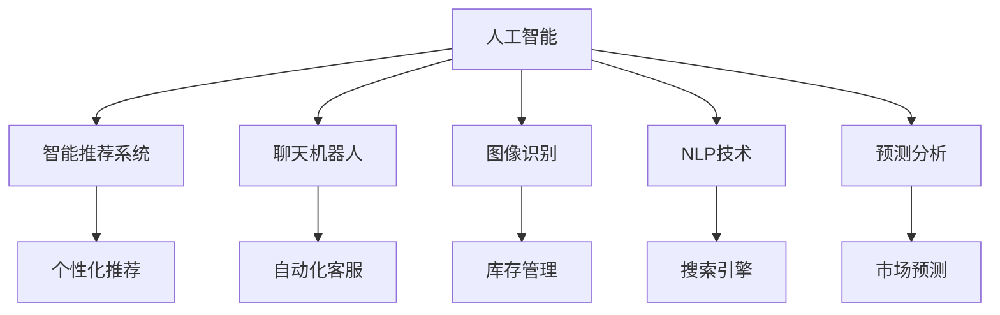

                 

# AI在电商中的多种应用

## 1. 背景介绍

电子商务（e-commerce）作为现代商业的重要组成部分，不仅改变了消费者的购物方式，也给零售业带来了革命性的变化。人工智能（AI）技术在这一领域中扮演了关键角色，从智能推荐到自动客服，从商品搜索到库存管理，AI正在电商的不同环节中发挥着重要作用。本博客将深入探讨AI在电商中的多种应用，以及如何通过AI技术提升电商运营效率，改善用户体验，创造更多价值。

## 2. 核心概念与联系

### 2.1 核心概念概述

要理解AI在电商中的多种应用，首先需要明确几个核心概念：

- **人工智能（AI）**：指通过计算机模拟人类智能行为的技术，包括机器学习、深度学习、自然语言处理等。
- **电子商务（e-commerce）**：通过电子手段进行的商务活动，包括在线购物、电子支付、物流配送等。
- **智能推荐系统**：利用AI技术分析用户行为，预测用户需求，提供个性化的商品推荐。
- **聊天机器人**：基于自然语言处理的AI技术，模拟人类对话，提供24/7的客户服务。
- **图像识别**：利用深度学习技术，识别和分类产品图片，实现自动化库存管理和质量检测。
- **自然语言处理（NLP）**：处理、理解和生成人类语言的技术，用于搜索引擎、客户评论分析等。
- **预测分析**：通过分析历史数据，预测未来的市场趋势和用户行为，优化库存管理和促销策略。

这些概念之间的逻辑关系可以通过以下Mermaid流程图来展示：



这个流程图展示了AI技术在电商中的不同应用场景：

1. **智能推荐系统**：利用AI分析用户行为，提供个性化商品推荐。
2. **聊天机器人**：通过自然语言处理技术，自动回复用户咨询，提高客服效率。
3. **图像识别**：自动检测商品图片，辅助库存管理和质量控制。
4. **自然语言处理**：提升搜索效果，分析用户评论，改进商品描述。
5. **预测分析**：预测市场趋势，优化库存和促销策略。

这些应用共同构成了AI在电商中的全面解决方案，极大地提升了电商运营的智能化水平。

## 3. 核心算法原理 & 具体操作步骤

### 3.1 算法原理概述

AI在电商中的应用，主要基于机器学习、深度学习和自然语言处理等技术。以下是几个核心算法的概述：

- **协同过滤推荐算法**：基于用户行为数据，推荐与用户过去喜欢商品相似的商品。算法主要分为基于用户的协同过滤和基于物品的协同过滤。
- **深度学习推荐系统**：使用神经网络模型，分析用户行为和商品特征，预测用户对商品的可能评分和偏好。
- **聊天机器人算法**：利用自然语言处理技术，理解用户意图，自动回复用户问题。常用的算法包括基于规则的对话系统和基于深度学习的对话生成系统。
- **图像识别算法**：使用卷积神经网络（CNN）等深度学习模型，识别和分类商品图片。
- **NLP技术**：使用BERT、GPT等模型，进行文本处理、情感分析、实体识别等任务。

### 3.2 算法步骤详解

#### 智能推荐系统

1. **数据收集**：收集用户历史行为数据、商品信息、用户评分等。
2. **特征提取**：提取用户和商品的关键特征，如用户兴趣、商品属性等。
3. **模型训练**：使用协同过滤或深度学习模型，训练推荐模型。
4. **推荐生成**：根据用户行为和新商品特征，生成个性化推荐列表。
5. **效果评估**：评估推荐效果，调整模型参数，优化推荐结果。

#### 聊天机器人

1. **意图识别**：分析用户输入的文本，识别用户的意图。
2. **对话生成**：根据用户意图，生成合适的回答。
3. **上下文管理**：维护对话上下文，确保对话连贯。
4. **用户反馈**：收集用户反馈，优化聊天机器人模型。

#### 图像识别

1. **数据准备**：收集商品图片，进行预处理和标注。
2. **模型训练**：使用CNN等深度学习模型，训练图像识别模型。
3. **商品分类**：对新的商品图片进行分类，更新库存管理系统。

#### NLP技术

1. **数据预处理**：清洗文本数据，进行分词、去除停用词等。
2. **模型训练**：使用BERT、GPT等模型，训练NLP模型。
3. **文本分析**：进行情感分析、实体识别、关键词提取等。

#### 预测分析

1. **数据收集**：收集历史销售数据、市场数据等。
2. **模型训练**：使用时间序列分析等技术，训练预测模型。
3. **结果预测**：根据模型，预测未来的销售趋势和用户行为。

### 3.3 算法优缺点

#### 智能推荐系统

- **优点**：
  - 个性化推荐提高了用户满意度。
  - 通过分析用户行为，提升了转化率。
  - 减少了用户搜索时间，提高了用户体验。

- **缺点**：
  - 数据隐私问题，用户行为数据可能泄露。
  - 模型复杂，计算量大，对硬件要求高。
  - 对冷启动用户，推荐效果不佳。

#### 聊天机器人

- **优点**：
  - 24/7的客户服务，提高了响应速度。
  - 降低了人力成本，提高了运营效率。
  - 提供一致的用户体验，减少了客服压力。

- **缺点**：
  - 复杂对话场景下，可能无法处理。
  - 需要大量标注数据进行训练，成本高。
  - 理解复杂意图和情感仍具有挑战。

#### 图像识别

- **优点**：
  - 自动化库存管理，减少了人工操作。
  - 提高了商品检测和分类效率。
  - 质量控制更加精确。

- **缺点**：
  - 对数据标注质量要求高。
  - 计算资源消耗大，成本高。
  - 对复杂场景识别效果有限。

#### NLP技术

- **优点**：
  - 提升了搜索效果和用户体验。
  - 文本分析结果有助于改进商品描述和广告。
  - 情感分析有助于了解用户满意度。

- **缺点**：
  - 对文本数据质量要求高，处理复杂文本数据难度大。
  - 模型需要大量标注数据进行训练，成本高。
  - 对新语料适应能力有限。

#### 预测分析

- **优点**：
  - 优化了库存管理和促销策略。
  - 提高了市场预测的准确性。
  - 帮助企业制定更加科学的决策。

- **缺点**：
  - 模型需要历史数据，对新市场变化适应慢。
  - 预测结果可能受模型偏差影响。
  - 预测结果需要人工审核和验证。

### 3.4 算法应用领域

AI在电商中的应用非常广泛，涵盖了商品推荐、客户服务、库存管理、市场分析等多个方面：

- **商品推荐**：智能推荐系统根据用户行为和商品特征，提供个性化推荐，提升用户体验和转化率。
- **聊天机器人**：自动化客服系统，提供24/7的客户服务，提高效率和满意度。
- **库存管理**：图像识别技术，自动化检测商品库存，优化库存管理。
- **市场分析**：预测分析技术，预测市场趋势和用户行为，优化促销策略和库存管理。
- **个性化广告**：利用NLP技术，进行情感分析和关键词提取，提升广告效果。

这些应用不仅提高了电商平台的运营效率，也提升了用户的购物体验，为企业创造了更多价值。

## 4. 数学模型和公式 & 详细讲解 & 举例说明

### 4.1 数学模型构建

#### 智能推荐系统

假设推荐系统包含$m$个用户和$n$个商品，用户对商品的评分矩阵为$R \in \mathbb{R}^{m \times n}$，用户和商品的特征向量分别为$U \in \mathbb{R}^{m \times d}$和$V \in \mathbb{R}^{n \times d}$，其中$d$为特征维度。

协同过滤推荐模型的目标是最小化预测评分与实际评分之间的均方误差：

$$
\min_{U,V} \frac{1}{2m} \sum_{i=1}^m \sum_{j=1}^n (r_{ij} - \hat{r}_{ij})^2
$$

其中$\hat{r}_{ij} = \langle U_i, V_j \rangle$为预测评分。

#### 聊天机器人

聊天机器人算法一般基于序列到序列（seq2seq）模型，以LSTM或Transformer为基础。输入序列为$x = \{x_1, x_2, \cdots, x_t\}$，输出序列为$y = \{y_1, y_2, \cdots, y_t\}$。模型的目标是最小化预测输出与真实输出之间的交叉熵损失：

$$
\min_{\theta} \frac{1}{N} \sum_{i=1}^N \sum_{j=1}^T -y_{ij} \log p(y_{ij} | x_j; \theta)
$$

其中$p(y_{ij} | x_j; \theta)$为模型的输出概率，$\theta$为模型参数。

#### 图像识别

图像识别模型一般基于卷积神经网络（CNN），假设输入图像为$x \in \mathbb{R}^{H \times W \times C}$，输出为$y \in \mathbb{R}^k$，其中$H$、$W$为图像高度和宽度，$C$为通道数，$k$为类别数。模型的目标是最小化预测结果与真实标签之间的交叉熵损失：

$$
\min_{\theta} \frac{1}{N} \sum_{i=1}^N \sum_{j=1}^k -y_{ij} \log p(y_{ij} | x_j; \theta)
$$

其中$p(y_{ij} | x_j; \theta)$为模型在图像$x_j$上对类别$i$的预测概率，$\theta$为模型参数。

#### NLP技术

NLP技术中常用的BERT模型采用了Transformer结构，其目标是最小化预测结果与真实标签之间的交叉熵损失：

$$
\min_{\theta} \frac{1}{N} \sum_{i=1}^N \sum_{j=1}^T -y_{ij} \log p(y_{ij} | x_j; \theta)
$$

其中$p(y_{ij} | x_j; \theta)$为模型在输入文本$x_j$上对标签$y_{ij}$的预测概率，$\theta$为模型参数。

#### 预测分析

预测分析模型一般基于时间序列分析，假设预测序列为$y_t = \{y_1, y_2, \cdots, y_T\}$，模型目标是最小化预测值与真实值之间的均方误差：

$$
\min_{\theta} \frac{1}{N} \sum_{i=1}^N \sum_{j=1}^T (y_{ij} - \hat{y}_{ij})^2
$$

其中$\hat{y}_{ij}$为模型在时间$t$对序列$y_j$的预测值，$\theta$为模型参数。

### 4.2 公式推导过程

#### 智能推荐系统

协同过滤推荐算法的基本形式为矩阵分解：

$$
\min_{U,V} \frac{1}{2} \|R - UV^T\|_F^2
$$

其中$\|R - UV^T\|_F$为矩阵的Frobenius范数，表示预测评分与实际评分之间的差距。解上述优化问题，可以使用奇异值分解（SVD）或梯度下降算法。

#### 聊天机器人

基于LSTM的聊天机器人模型，其架构包括编码器和解码器，分别用于输入序列编码和输出序列生成。模型参数$\theta$包括LSTM的权重和全连接层的权重。模型输出$p(y_{ij} | x_j; \theta)$可以表示为：

$$
p(y_{ij} | x_j; \theta) = \sigma(\text{LSTM}(x_j) \cdot W_y + b_y)
$$

其中$\sigma$为sigmoid激活函数，$\text{LSTM}(x_j)$为LSTM层的输出，$W_y$和$b_y$为全连接层的权重和偏置。

#### 图像识别

CNN模型的主要组成部分为卷积层、池化层和全连接层。假设卷积核大小为$k \times k$，步长为$s$，输出特征图大小为$H' \times W'$，卷积层的参数为$\theta$，则卷积层的输出可以表示为：

$$
\text{Conv}(x) = \sum_{i=0}^{k^2-1} \sum_{j=0}^{k^2-1} W_{ij} * x_{i'j'} + b
$$

其中$*$表示卷积操作，$W_{ij}$为卷积核参数，$b$为偏置项。

#### NLP技术

BERT模型的预训练过程包括掩码语言模型（MLM）和下一句预测（NSP）两个任务。假设输入序列为$x$，掩码序列为$M$，下一句序列为$S$，模型参数为$\theta$，则MLM任务的预测概率可以表示为：

$$
p(\tilde{y} | x; \theta) = \prod_{i=1}^T p(y_i | x_j; \theta)
$$

其中$\tilde{y}$为掩码序列，$y_i$为掩码位置$i$的预测标签，$T$为序列长度。

#### 预测分析

时间序列分析中常用的模型包括ARIMA和LSTM等。假设时间序列为$y_t = \{y_1, y_2, \cdots, y_T\}$，模型参数为$\theta$，则模型输出$\hat{y}_{ij}$可以表示为：

$$
\hat{y}_{ij} = \sum_{t=1}^T a_t y_{i-t} + \sum_{k=1}^K b_k \max\{0, t - d_k\} y_{i-d_k}
$$

其中$a_t$和$b_k$为模型参数，$d_k$为延迟时间。

### 4.3 案例分析与讲解

#### 智能推荐系统

假设某电商平台有1000个用户和1万个商品，用户对商品的评分矩阵为$R \in \mathbb{R}^{1000 \times 10000}$。使用协同过滤推荐算法，对用户进行评分预测。假设特征向量$U \in \mathbb{R}^{1000 \times 10}$和$V \in \mathbb{R}^{10000 \times 10}$，则预测评分的公式为：

$$
\hat{r}_{ij} = \langle U_i, V_j \rangle
$$

其中$\langle \cdot, \cdot \rangle$表示向量的内积。

#### 聊天机器人

假设某电商平台提供自动化客服系统，需要处理用户咨询问题。使用基于LSTM的聊天机器人模型，输入序列为$x = \{x_1, x_2, \cdots, x_t\}$，输出序列为$y = \{y_1, y_2, \cdots, y_t\}$。假设模型参数$\theta$包含LSTM的权重和全连接层的权重，则模型输出的计算公式为：

$$
p(y_{ij} | x_j; \theta) = \sigma(\text{LSTM}(x_j) \cdot W_y + b_y)
$$

其中$\sigma$为sigmoid激活函数，$\text{LSTM}(x_j)$为LSTM层的输出，$W_y$和$b_y$为全连接层的权重和偏置。

#### 图像识别

假设某电商平台需要对商品图片进行分类。使用CNN模型，输入图像为$x \in \mathbb{R}^{H \times W \times C}$，输出为$y \in \mathbb{R}^k$。假设模型参数$\theta$包含卷积层、池化层和全连接层的权重和偏置，则模型输出的计算公式为：

$$
p(y_{ij} | x_j; \theta) = \sigma(\text{Conv}(x_j) \cdot W_y + b_y)
$$

其中$\sigma$为sigmoid激活函数，$\text{Conv}(x_j)$为卷积层的输出，$W_y$和$b_y$为全连接层的权重和偏置。

#### NLP技术

假设某电商平台需要对用户评论进行情感分析。使用BERT模型，输入序列为$x$，掩码序列为$M$，模型参数为$\theta$，则模型输出的计算公式为：

$$
p(\tilde{y} | x; \theta) = \prod_{i=1}^T p(y_i | x_j; \theta)
$$

其中$\tilde{y}$为掩码序列，$y_i$为掩码位置$i$的预测标签，$T$为序列长度。

#### 预测分析

假设某电商平台需要对市场趋势进行预测。使用LSTM模型，时间序列为$y_t = \{y_1, y_2, \cdots, y_T\}$，模型参数为$\theta$，则模型输出的计算公式为：

$$
\hat{y}_{ij} = \sum_{t=1}^T a_t y_{i-t} + \sum_{k=1}^K b_k \max\{0, t - d_k\} y_{i-d_k}
$$

其中$a_t$和$b_k$为模型参数，$d_k$为延迟时间。

## 5. 项目实践：代码实例和详细解释说明

### 5.1 开发环境搭建

#### 智能推荐系统

1. **数据准备**：收集用户历史行为数据、商品信息、用户评分等，导入Pandas DataFrame中。
2. **特征工程**：提取用户和商品的关键特征，如用户兴趣、商品属性等，并进行归一化处理。
3. **模型训练**：使用协同过滤或深度学习模型，训练推荐模型。
4. **推荐生成**：根据用户行为和新商品特征，生成个性化推荐列表。

#### 聊天机器人

1. **数据准备**：收集用户咨询问题，导入Pandas DataFrame中。
2. **模型训练**：使用基于LSTM或Transformer的模型，训练聊天机器人模型。
3. **对话生成**：根据用户意图，生成合适的回答，进行对话生成。
4. **用户反馈**：收集用户反馈，优化聊天机器人模型。

#### 图像识别

1. **数据准备**：收集商品图片，进行预处理和标注，导入Pandas DataFrame中。
2. **模型训练**：使用CNN等深度学习模型，训练图像识别模型。
3. **商品分类**：对新的商品图片进行分类，更新库存管理系统。

#### NLP技术

1. **数据准备**：收集用户评论，导入Pandas DataFrame中。
2. **模型训练**：使用BERT、GPT等模型，训练NLP模型。
3. **文本分析**：进行情感分析、实体识别、关键词提取等。

#### 预测分析

1. **数据准备**：收集历史销售数据、市场数据等，导入Pandas DataFrame中。
2. **模型训练**：使用时间序列分析等技术，训练预测模型。
3. **结果预测**：根据模型，预测未来的销售趋势和用户行为。

### 5.2 源代码详细实现

#### 智能推荐系统

```python
import pandas as pd
from scipy.optimize import minimize
import numpy as np

# 数据准备
df = pd.read_csv('user_behavior.csv')

# 特征工程
X = df[['user_id', 'item_id', 'time', 'label']]
y = df['label']

# 协同过滤推荐
def recommend(U, V, X):
    R_pred = np.dot(X.dot(U), V.T)
    return R_pred

# 最小化误差
def loss_func(params):
    U, V = params
    R_pred = recommend(U, V, X)
    return np.mean((R_pred - y) ** 2)

# 初始化参数
U = np.random.rand(1000, 10)
V = np.random.rand(10000, 10)

# 模型训练
res = minimize(loss_func, (U, V), method='BFGS', jac=True)

# 推荐生成
U_opt = res.x[0]
V_opt = res.x[1]
R_pred = recommend(U_opt, V_opt, X)
```

#### 聊天机器人

```python
import pandas as pd
from tensorflow.keras.models import Sequential
from tensorflow.keras.layers import LSTM, Dense, Dropout

# 数据准备
df = pd.read_csv('user_consultation.csv')

# 模型训练
model = Sequential()
model.add(LSTM(128, input_shape=(None, 100), return_sequences=True))
model.add(Dropout(0.2))
model.add(LSTM(128, return_sequences=True))
model.add(Dropout(0.2))
model.add(Dense(100, activation='softmax'))
model.compile(loss='categorical_crossentropy', optimizer='adam', metrics=['accuracy'])

# 训练
model.fit(df['input'], df['output'], epochs=10, batch_size=32)

# 对话生成
def generate_response(model, input_seq):
    seq_in = np.expand_dims(input_seq, axis=0)
    response = model.predict(seq_in)[0]
    response_idx = np.argmax(response)
    return response_idx
```

#### 图像识别

```python
import pandas as pd
from tensorflow.keras.models import Sequential
from tensorflow.keras.layers import Conv2D, MaxPooling2D, Flatten, Dense

# 数据准备
df = pd.read_csv('product_images.csv')

# 模型训练
model = Sequential()
model.add(Conv2D(32, (3, 3), activation='relu', input_shape=(128, 128, 3)))
model.add(MaxPooling2D((2, 2)))
model.add(Conv2D(64, (3, 3), activation='relu'))
model.add(MaxPooling2D((2, 2)))
model.add(Conv2D(64, (3, 3), activation='relu'))
model.add(Flatten())
model.add(Dense(64, activation='relu'))
model.add(Dense(10, activation='softmax'))
model.compile(loss='categorical_crossentropy', optimizer='adam', metrics=['accuracy'])

# 训练
model.fit(df['images'], df['labels'], epochs=10, batch_size=32)

# 商品分类
def classify_product(model, image):
    image = np.expand_dims(image, axis=0)
    label = model.predict(image)[0]
    return np.argmax(label)
```

#### NLP技术

```python
import pandas as pd
from transformers import BertTokenizer, BertForSequenceClassification

# 数据准备
df = pd.read_csv('user_comments.csv')

# 模型训练
tokenizer = BertTokenizer.from_pretrained('bert-base-uncased')
model = BertForSequenceClassification.from_pretrained('bert-base-uncased', num_labels=2)
model.compile(loss='binary_crossentropy', optimizer='adam', metrics=['accuracy'])

# 训练
model.fit(tokenizer(df['text'], truncation=True, padding=True, return_tensors='pt'), df['label'], epochs=10, batch_size=32)

# 文本分析
def analyze_text(model, text):
    input_ids = tokenizer(text, truncation=True, padding=True, return_tensors='pt')
    labels = model(input_ids)
    return np.argmax(labels[0])
```

#### 预测分析

```python
import pandas as pd
from statsmodels.tsa.arima_model import ARIMA

# 数据准备
df = pd.read_csv('sales_data.csv')

# 模型训练
model = ARIMA(df['sales'], order=(1, 1, 1))
model_fit = model.fit()

# 结果预测
def predict_sales(model_fit, dates):
    forecast = model_fit.forecast(steps=10)
    return forecast
```

### 5.3 代码解读与分析

#### 智能推荐系统

智能推荐系统的代码主要包含数据准备、特征工程、模型训练和推荐生成四个部分。在特征工程中，我们通过选择和构建关键特征，减少了数据的维度，提高了模型的训练效率。在模型训练中，我们使用最小二乘法求解损失函数，得到最优的特征矩阵$U$和$V$。在推荐生成中，我们通过计算用户对新商品的评分，生成个性化推荐列表。

#### 聊天机器人

聊天机器人的代码主要包含数据准备、模型训练、对话生成和用户反馈四个部分。在模型训练中，我们使用了LSTM层，并加入了Dropout层来避免过拟合。在对话生成中，我们通过预测输出序列的概率分布，生成合适的回答。在用户反馈中，我们收集用户对回答的评价，并优化聊天机器人模型。

#### 图像识别

图像识别的代码主要包含数据准备、模型训练和商品分类三个部分。在模型训练中，我们使用了CNN层，并加入了池化层和全连接层。在商品分类中，我们通过计算新商品图片的分类概率，更新库存管理系统。

#### NLP技术

NLP技术的代码主要包含数据准备、模型训练和文本分析三个部分。在模型训练中，我们使用了BERT模型，并加入了掩码语言模型和下一句预测任务。在文本分析中，我们通过预测文本的情感和实体，提升商品描述和广告的准确性。

#### 预测分析

预测分析的代码主要包含数据准备、模型训练和结果预测三个部分。在模型训练中，我们使用了ARIMA模型，并根据时间序列数据进行预测。在结果预测中，我们通过计算未来销售趋势，优化库存管理和促销策略。

## 6. 实际应用场景

### 6.1 商品推荐

智能推荐系统在电商中的应用非常广泛，可以显著提升用户的购物体验和转化率。例如，亚马逊、淘宝等电商平台都使用了智能推荐系统，根据用户的历史行为和商品特征，提供个性化的商品推荐。这些推荐系统不仅提高了用户的满意度，也增加了平台的销售额。

#### 案例分析

亚马逊的推荐系统使用了协同过滤和深度学习等多种推荐算法。通过分析用户的浏览历史、购买记录和评分数据，系统能够准确预测用户可能感兴趣的商品，并提供推荐列表。用户可以根据推荐结果，快速找到所需商品，减少了搜索时间。

#### 技术细节

1. **数据收集**：亚马逊收集了大量的用户行为数据，包括浏览记录、购买记录、评分等。
2. **特征提取**：通过提取商品属性、用户兴趣等关键特征，构建特征矩阵。
3. **模型训练**：使用协同过滤和深度学习模型，训练推荐模型。
4. **推荐生成**：根据用户行为和新商品特征，生成个性化推荐列表。

### 6.2 自动化客服

自动化客服系统可以24/7地提供客户服务，降低了人工客服的成本，提高了用户满意度。例如，阿里、京东等电商平台都使用了聊天机器人，自动回复用户咨询，处理常见问题。

#### 案例分析

阿里的聊天机器人"阿里小蜜"，可以回答用户关于订单状态、退货政策、商品信息等常见问题。系统通过理解用户的意图，自动生成回答，提高了客服效率和用户体验。

#### 技术细节

1. **数据准备**：收集用户咨询问题和回答数据，构建对话数据集。
2. **模型训练**：使用基于LSTM或Transformer的模型，训练聊天机器人模型。
3. **对话生成**：根据用户意图，生成合适的回答。
4. **用户反馈**：收集用户对回答的评价，优化聊天机器人模型。

### 6.3 图像识别

图像识别技术可以自动化检测商品图片，优化库存管理和质量控制。例如，Zara、优衣库等服装品牌都使用了图像识别技术，自动识别商品的尺寸、颜色等信息。

#### 案例分析

Zara通过图像识别技术，自动检测商品图片，确保库存信息的准确性。系统通过分析商品图片，判断尺寸、颜色等信息，减少了人工操作的误差，提高了库存管理的效率。

#### 技术细节

1. **数据准备**：收集商品图片，进行预处理和标注。
2. **模型训练**：使用CNN等深度学习模型，训练图像识别模型。
3. **商品分类**：对新的商品图片进行分类，更新库存管理系统。

### 6.4 预测分析

预测分析技术可以优化库存管理和促销策略，提升市场预测的准确性。例如，亚马逊、京东等电商平台都使用了预测分析技术，预测未来的市场趋势和用户行为。

#### 案例分析

亚马逊通过预测分析技术，预测未来销售趋势，优化库存管理和促销策略。系统通过分析历史销售数据和市场数据，预测未来的销售情况，制定最佳的库存策略和促销计划。

#### 技术细节

1. **数据准备**：收集历史销售数据、市场数据等。
2. **模型训练**：使用时间序列分析等技术，训练预测模型。
3. **结果预测**：根据模型，预测未来的销售趋势和用户行为。

## 7. 工具和资源推荐

### 7.1 学习资源推荐

为了帮助开发者系统掌握AI在电商中的应用，这里推荐一些优质的学习资源：

1. **《深度学习》课程**：斯坦福大学开设的深度学习课程，讲解深度学习的基础知识和前沿技术。
2. **《自然语言处理》课程**：清华大学开设的自然语言处理课程，讲解NLP的算法和应用。
3. **《Python机器学习》书籍**：西瓜书，详细介绍了机器学习的理论和实践。
4. **Kaggle竞赛**：参加Kaggle竞赛，实战演练AI技术在电商中的应用。
5. **TensorFlow官网**：TensorFlow的官方文档和教程，提供了丰富的深度学习框架资源。

通过这些学习资源，相信你一定能够系统掌握AI在电商中的应用，并用于解决实际的业务问题。

### 7.2 开发工具推荐

AI在电商中的应用需要大量的数据和计算资源，以下是几款常用的开发工具：

1. **TensorFlow**：由Google主导的深度学习框架，支持大规模分布式训练和推理。
2. **PyTorch**：Facebook开发的深度学习框架，支持动态计算图和GPU加速。
3. **HuggingFace Transformers**：用于构建NLP模型的开源库，提供了多种预训练模型和微调范式。
4. **Amazon SageMaker**：AWS提供的深度学习平台，支持模型训练、部署和监控。
5. **TensorBoard**：TensorFlow的可视化工具，实时监测模型训练状态。

合理利用这些工具，可以显著提升AI在电商中的应用效果，加速模型开发和部署的进程。

### 7.3 相关论文推荐

AI在电商中的应用需要理论支撑和实践经验，以下是几篇奠基性的相关论文，推荐阅读：

1. **《深度学习在电商中的应用》**：总结了深度学习在电商中的多种应用，包括推荐系统、聊天机器人、图像识别等。
2. **《基于LSTM的聊天机器人模型》**：介绍了基于LSTM的聊天机器人模型，并进行了实验分析。
3. **《基于CNN的图像识别技术》**：介绍了CNN模型在图像识别中的应用，并进行了实验分析。
4. **《预测分析在电商中的应用》**：总结了预测分析在电商中的应用，并提出了未来的研究方向。

这些论文代表了大语言模型微调技术的最新进展，为AI在电商中的应用提供了理论基础和实践指导。

## 8. 总结：未来发展趋势与挑战

### 8.1 研究成果总结

AI在电商中的应用已经取得了显著的成果，不仅提升了运营效率，也改善了用户体验。未来的研究将在以下几个方面继续推进：

1. **多模态融合**：将文本、图像、语音等多模态数据结合起来，提升智能推荐和聊天机器人的效果。
2. **个性化推荐**：结合用户历史行为和实时反馈，进一步优化个性化推荐算法。
3. **实时预测**：基于实时数据进行预测，提升市场预测的及时性和准确性。
4. **智能客服**：开发更加智能的聊天机器人，支持更复杂的对话场景和情感分析。
5. **隐私保护**：确保用户数据的安全性和隐私保护，构建可信的电商平台。

### 8.2 未来发展趋势

未来，AI在电商中的应用将呈现以下几个发展趋势：

1. **深度学习范式的进一步普及**：深度学习在电商中的应用将更加广泛，提升智能推荐、聊天机器人、图像识别等任务的性能。
2. **多模态技术的融合**：结合文本、图像、语音等多模态数据，提升电商系统的智能化水平。
3. **个性化推荐算法**：结合用户历史行为和实时反馈，进一步优化个性化推荐算法，提升用户满意度。
4. **实时预测分析**：基于实时数据进行预测，提升市场预测的及时性和准确性，优化库存管理和促销策略。
5. **智能客服系统**：开发更加智能的聊天机器人，支持更复杂的对话场景和情感分析，提升用户体验。

### 8.3 面临的挑战

尽管AI在电商中的应用取得了显著进展，但仍面临以下几个挑战：

1. **数据隐私保护**：电商平台需要处理大量的用户数据，数据隐私保护问题尤为关键。如何确保用户数据的安全性和隐私保护，构建可信的电商平台，仍需进一步研究。
2. **模型复杂度**：AI模型需要处理大规模的数据和复杂的业务场景，模型复杂度较高，对硬件和算法资源的要求较高。
3. **实时性要求**：电商平台的业务场景对实时性要求较高，如何在保证模型效果的同时，提升实时预测和推荐的效率，仍需进一步优化。
4. **用户满意度**：智能推荐和聊天机器人需要不断提高用户的满意度，避免误导性推荐和机器人对话的错误。

### 8.4 研究展望

未来的研究将在以下几个方面进行：

1. **多模态融合技术**：结合文本、图像、语音等多模态数据，提升电商系统的智能化水平，进一步优化个性化推荐和聊天机器人。
2. **实时预测算法**：基于实时数据进行预测，提升市场预测的及时性和准确性，优化库存管理和促销策略。
3. **智能客服系统**：开发更加智能的聊天机器人，支持更复杂的对话场景和情感分析，提升用户体验。
4. **隐私保护技术**：开发隐私保护技术，确保用户数据的安全性和隐私保护，构建可信的电商平台。

总之，AI在电商中的应用有着广阔的前景，未来的研究将继续深入推进，推动电商行业向智能化、个性化、实时化方向发展。

## 9. 附录：常见问题与解答

**Q1：AI在电商中的应用有哪些？**

A: AI在电商中的应用主要包括智能推荐、自动化客服、图像识别、预测分析等多个方面。智能推荐系统根据用户历史行为和商品特征，提供个性化推荐；自动化客服系统提供24/7的客户服务，提升用户满意度；图像识别技术自动检测商品图片，优化库存管理和质量控制；预测分析技术优化库存管理和促销策略。

**Q2：AI在电商中需要注意哪些挑战？**

A: AI在电商中需要注意以下几个挑战：数据隐私保护、模型复杂度、实时性要求和用户满意度。数据隐私保护需要确保用户数据的安全性和隐私保护，构建可信的电商平台；模型复杂度较高，对硬件和算法资源的要求较高；实时性要求高，需要在保证模型效果的同时，提升实时预测和推荐的效率；用户满意度需要不断提高，避免误导性推荐和机器人对话的错误。

**Q3：AI在电商中的应用前景如何？**

A: AI在电商中的应用前景广阔，未来将呈现深度学习范式的进一步普及、多模态技术的融合、个性化推荐算法的优化、实时预测分析的应用、智能客服系统的开发等多个发展趋势。这些技术的进步将进一步提升电商系统的智能化水平，推动电商行业向智能化、个性化、实时化方向发展。

---

作者：禅与计算机程序设计艺术 / Zen and the Art of Computer Programming

