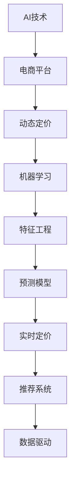

                 

# AI在电商动态定价中的技术应用

> 关键词：AI, 电商, 动态定价, 机器学习, 模型优化, 特征工程, 预测模型, 实时定价, 推荐系统, 数据驱动

## 1. 背景介绍

### 1.1 问题由来

电子商务平台的兴起彻底改变了传统的零售模式，使得商家可以通过互联网进行商品销售。与此同时也为商家带来了巨大的挑战，其中最显著的便是如何在短时间内高效地定价。传统的静态定价方法如成本加成法、市场需求分析法等无法适应电商平台上实时变化的竞争环境。因此，电商动态定价应运而生，即在电商平台上，根据需求、竞争等因素实时调整商品价格，以最大化销售额和利润。

### 1.2 问题核心关键点

电商动态定价的本质是利用AI技术进行数据驱动的决策。其关键点如下：

1. **实时数据处理**：电商平台的实时交易数据可以实时处理，以实现动态定价。
2. **需求预测**：基于历史交易数据预测未来需求，是动态定价的重要基础。
3. **价格优化**：在预测的基础上，优化商品价格以最大化收益。
4. **竞争环境监测**：考虑竞争对手的价格策略，制定相应定价策略。

## 2. 核心概念与联系

### 2.1 核心概念概述

为更好地理解电商动态定价，我们首先需要明确几个关键概念：

- **AI技术**：人工智能的核心概念，涉及机器学习、深度学习、自然语言处理等技术。
- **电商平台**：如淘宝、京东、亚马逊等。
- **动态定价**：根据市场需求和竞争环境实时调整商品价格。
- **机器学习**：利用数据进行模型训练，提升预测和定价精度。
- **特征工程**：从原始数据中提取有价值特征，提升模型的预测能力。
- **预测模型**：用于预测未来需求的模型，如线性回归、随机森林、深度学习模型等。
- **实时定价**：根据预测结果实时调整价格。
- **推荐系统**：电商平台上重要的应用，通过推荐增加用户转化率。
- **数据驱动**：所有的决策基于数据和算法模型，而非经验或直觉。

这些概念之间的逻辑关系可以通过以下Mermaid流程图来展示：



这个流程图展示了大语言模型的核心概念及其之间的关系：

1. AI技术是电商动态定价的基础，通过机器学习和深度学习技术实现预测和定价。
2. 电商平台是AI技术的应用场景，通过动态定价提升销售效率和利润。
3. 机器学习利用数据训练模型，进行需求预测和价格优化。
4. 特征工程从原始数据中提取有价值的特征，提升模型预测精度。
5. 预测模型用于预测未来需求，是动态定价的重要基础。
6. 实时定价根据预测结果实时调整价格，提升销售效率。
7. 推荐系统通过分析用户行为提升用户转化率。
8. 数据驱动则是整个决策流程的核心，确保所有的决策基于数据和算法模型。

## 3. 核心算法原理 & 具体操作步骤
### 3.1 算法原理概述

电商动态定价的核心是利用AI技术，通过机器学习模型进行需求预测和价格优化。其实现步骤如下：

1. **数据收集**：收集电商平台的交易数据、用户行为数据、竞争对手数据等。
2. **数据预处理**：清洗、转换和归一化数据，以便于模型训练。
3. **特征提取**：从预处理后的数据中提取有用的特征。
4. **模型训练**：使用机器学习模型训练预测模型，对需求进行预测。
5. **价格优化**：根据预测结果，使用优化算法调整商品价格。
6. **实时定价**：实时获取交易数据和需求预测，实时调整价格。

### 3.2 算法步骤详解

以下是电商动态定价的详细步骤：

**Step 1: 数据收集**

- 电商平台的交易数据包括时间、用户ID、商品ID、价格等。
- 用户行为数据包括浏览、点击、收藏、购买等。
- 竞争对手数据包括竞争对手的商品价格、销量等。

**Step 2: 数据预处理**

- 清洗数据，去除噪音和异常值。
- 处理缺失值和重复值。
- 归一化数据，确保所有特征在一个范围内。

**Step 3: 特征提取**

- 提取有用的特征，如用户行为特征、商品特征、时间特征等。
- 特征选择，选择对需求预测有用的特征。
- 特征工程，进行特征编码、降维等操作。

**Step 4: 模型训练**

- 选择合适的机器学习模型，如线性回归、决策树、随机森林、神经网络等。
- 划分训练集和验证集。
- 训练模型，使用训练集数据进行模型训练。
- 使用验证集数据评估模型性能，调整模型超参数。

**Step 5: 价格优化**

- 根据预测结果，使用优化算法调整商品价格。
- 优化算法如梯度下降、遗传算法、粒子群算法等。
- 确定最优价格，最大化利润。

**Step 6: 实时定价**

- 实时获取交易数据和需求预测。
- 根据实时数据调整价格，实现动态定价。
- 使用缓存和负载均衡等技术提升实时定价的效率。

### 3.3 算法优缺点

电商动态定价的算法具有以下优点：

1. **提升销售效率**：动态定价可以根据市场需求实时调整价格，提升销售效率。
2. **提高利润率**：通过优化定价，最大化利润率。
3. **个性化定价**：考虑用户行为和偏好，进行个性化定价。
4. **实时监测**：实时监测市场变化，及时调整策略。

但同时也存在以下缺点：

1. **模型复杂度高**：模型训练和价格优化过程复杂，需要大量计算资源。
2. **数据需求大**：需要大量历史数据和实时数据支持。
3. **模型敏感性**：模型对数据变化和异常值敏感，需要及时更新和维护。
4. **实时性要求高**：实时获取和处理数据，对系统性能要求高。

### 3.4 算法应用领域

电商动态定价在电商平台上得到广泛应用，以下是几个典型应用场景：

1. **商品促销**：根据需求预测，选择合适时机进行促销活动。
2. **库存管理**：根据预测结果，优化库存管理，避免缺货或库存积压。
3. **用户个性化定价**：根据用户行为，进行个性化定价，提升用户满意度。
4. **竞价策略**：根据竞争对手价格和销量，制定相应竞价策略。
5. **推荐系统**：基于用户行为和商品特征，推荐相关商品，提升销售量。

## 4. 数学模型和公式 & 详细讲解 & 举例说明

### 4.1 数学模型构建

电商动态定价的数学模型一般包括以下几个部分：

- **需求预测模型**：$P_i(t) = f(x_i, t)$，其中$P_i(t)$表示商品$i$在时间$t$的需求量，$f$为需求预测模型，$x_i$为商品$i$的相关特征。
- **价格优化模型**：$P_i(t) = g(P_{i-1}, P_{i+1}, P_i, t)$，其中$P_i$表示商品$i$在时间$t$的价格，$P_{i-1}$和$P_{i+1}$表示相邻时间点的价格，$g$为价格优化模型。
- **实时定价模型**：$P_i(t) = h(P_{i-1}, P_{i+1}, P_i, t, d_t)$，其中$d_t$表示时间$t$的实时需求。

### 4.2 公式推导过程

以线性回归模型为例，其公式推导过程如下：

设需求预测模型为线性回归模型：

$$
P_i(t) = \beta_0 + \beta_1 x_{i1}(t) + \beta_2 x_{i2}(t) + \ldots + \beta_n x_{in}(t) + \epsilon_i(t)
$$

其中，$\beta_0, \beta_1, \beta_2, \ldots, \beta_n$为线性回归系数，$\epsilon_i(t)$为随机误差项。

对上述模型进行最小二乘法求解，可得：

$$
\hat{\beta} = (X^TX)^{-1}X^TY
$$

其中，$X$为特征矩阵，$Y$为目标变量，$\hat{\beta}$为回归系数。

### 4.3 案例分析与讲解

以下是一个电商动态定价的案例分析：

**案例背景**：某电商平台上某商品的历史销售数据如下：

| 时间 | 时间 | 用户行为 | 商品价格 | 商品销量 |
| --- | --- | --- | --- | --- |
| t1 | t2 | t3 | t4 | t5 |

**需求预测**：使用线性回归模型预测未来销量。设需求预测模型为：

$$
P_i(t) = \beta_0 + \beta_1 x_{i1}(t) + \beta_2 x_{i2}(t) + \ldots + \beta_n x_{in}(t) + \epsilon_i(t)
$$

其中，$x_{i1}(t), x_{i2}(t), \ldots, x_{in}(t)$为商品$i$在时间$t$的相关特征，$\beta_0, \beta_1, \beta_2, \ldots, \beta_n$为回归系数。

**价格优化**：根据需求预测结果，使用梯度下降算法调整价格。设价格优化模型为：

$$
P_i(t) = g(P_{i-1}, P_{i+1}, P_i, t) = \min_{P_i} \{C(P_i, P_{i-1}, P_{i+1}, t) + \lambda ||P_i - P_{i-1}||^2 \}
$$

其中，$C(P_i, P_{i-1}, P_{i+1}, t)$为价格优化目标函数，$\lambda$为正则化系数。

## 5. 项目实践：代码实例和详细解释说明

### 5.1 开发环境搭建

在进行电商动态定价项目实践前，我们需要准备好开发环境。以下是使用Python进行TensorFlow开发的环境配置流程：

1. 安装Anaconda：从官网下载并安装Anaconda，用于创建独立的Python环境。

2. 创建并激活虚拟环境：
```bash
conda create -n tf-env python=3.8 
conda activate tf-env
```

3. 安装TensorFlow：根据CUDA版本，从官网获取对应的安装命令。例如：
```bash
conda install tensorflow -c tf
```

4. 安装各类工具包：
```bash
pip install numpy pandas scikit-learn matplotlib tqdm jupyter notebook ipython
```

完成上述步骤后，即可在`tf-env`环境中开始电商动态定价的实践。

### 5.2 源代码详细实现

这里我们以线性回归模型为例，给出使用TensorFlow进行电商动态定价的PyTorch代码实现。

```python
import tensorflow as tf
from tensorflow.keras import layers

# 定义模型
class DynamicPricingModel(tf.keras.Model):
    def __init__(self, num_features):
        super(DynamicPricingModel, self).__init__()
        self.dense1 = layers.Dense(64, activation='relu')
        self.dense2 = layers.Dense(64, activation='relu')
        self.dense3 = layers.Dense(1, activation='linear')

    def call(self, inputs):
        x = self.dense1(inputs)
        x = self.dense2(x)
        x = self.dense3(x)
        return x

# 数据预处理
train_dataset = ...
train_dataset = train_dataset.map(preprocess_data)

# 模型训练
model = DynamicPricingModel(num_features)
optimizer = tf.keras.optimizers.Adam(learning_rate=0.001)
loss_fn = tf.keras.losses.MeanSquaredError()

for epoch in range(epochs):
    for batch in train_dataset:
        with tf.GradientTape() as tape:
            predictions = model(batch)
            loss = loss_fn(y_true, predictions)
        gradients = tape.gradient(loss, model.trainable_variables)
        optimizer.apply_gradients(zip(gradients, model.trainable_variables))
```

### 5.3 代码解读与分析

让我们再详细解读一下关键代码的实现细节：

**DynamicPricingModel类**：
- `__init__`方法：定义模型结构，包括多个密集层。
- `call`方法：定义模型的前向传播过程。

**数据预处理**：
- 使用TensorFlow的`map`方法，对数据进行预处理，如归一化、特征编码等。

**模型训练**：
- 使用TensorFlow的`Adam`优化器进行模型训练。
- 定义损失函数为均方误差损失。
- 在每个epoch内，对每个batch进行前向传播和反向传播，更新模型参数。

**运行结果展示**：
- 在验证集上评估模型性能，如平均绝对误差等指标。
- 绘制训练曲线，观察模型训练过程。

可以看到，TensorFlow的强大封装使得电商动态定价的代码实现变得简洁高效。开发者可以将更多精力放在模型改进和数据处理等高层逻辑上，而不必过多关注底层的实现细节。

## 6. 实际应用场景

### 6.1 智能推荐系统

电商平台上，智能推荐系统可以帮助用户发现更多感兴趣的商品。动态定价技术可以与推荐系统结合，通过实时调整价格，提升推荐效果。

在推荐系统中，通过分析用户历史行为，预测用户需求，并根据需求预测结果调整商品价格。例如，当某个用户对某类商品感兴趣时，可以提升该类商品的价格，吸引用户购买。

### 6.2 库存管理

库存管理是电商平台上重要的应用，可以实时调整库存数量，避免缺货或库存积压。动态定价技术可以与库存管理结合，通过优化定价策略，提升库存管理效率。

在库存管理中，通过需求预测模型预测未来需求，并根据预测结果调整商品价格。例如，当需求高时，可以提升价格，吸引更多用户购买，同时增加库存数量；当需求低时，可以降低价格，减少库存积压。

### 6.3 个性化营销

电商平台上，个性化营销可以提高用户转化率和销售额。动态定价技术可以与个性化营销结合，通过实时调整价格，提升个性化营销效果。

在个性化营销中，通过分析用户行为和偏好，预测用户需求，并根据需求预测结果调整商品价格。例如，当某个用户对某类商品感兴趣时，可以提升该类商品的价格，吸引用户购买。

### 6.4 未来应用展望

随着电商平台的不断发展，电商动态定价技术将有更广阔的应用前景。

在智慧物流领域，动态定价技术可以与物流配送结合，通过优化配送策略，降低配送成本，提升配送效率。

在智能客服领域，动态定价技术可以与智能客服结合，通过分析用户需求，调整商品价格，提升客户满意度。

在智能城市领域，动态定价技术可以与城市管理结合，通过优化城市资源配置，提升城市管理效率。

## 7. 工具和资源推荐

### 7.1 学习资源推荐

为了帮助开发者系统掌握电商动态定价的理论基础和实践技巧，这里推荐一些优质的学习资源：

1. 《深度学习与电商应用》系列博文：由电商领域的专家撰写，深入浅出地介绍了电商平台的机器学习应用。

2. CS234《电商领域的深度学习》课程：斯坦福大学开设的电商领域的深度学习课程，提供Lecture视频和配套作业，带你入门电商领域的深度学习应用。

3. 《电商数据分析与挖掘》书籍：电商领域的经典书籍，涵盖电商数据挖掘、特征工程、推荐系统等。

4. Kaggle电商数据集：包含电商平台的交易数据和用户行为数据，提供丰富的机器学习实践案例。

5. Weights & Biases：模型训练的实验跟踪工具，可以记录和可视化模型训练过程中的各项指标，方便对比和调优。

6. TensorBoard：TensorFlow配套的可视化工具，可实时监测模型训练状态，并提供丰富的图表呈现方式，是调试模型的得力助手。

通过对这些资源的学习实践，相信你一定能够快速掌握电商动态定价的精髓，并用于解决实际的电商平台问题。

### 7.2 开发工具推荐

高效的开发离不开优秀的工具支持。以下是几款用于电商动态定价开发的常用工具：

1. TensorFlow：由Google主导开发的开源深度学习框架，生产部署方便，适合大规模工程应用。
2. PyTorch：基于Python的开源深度学习框架，灵活动态的计算图，适合快速迭代研究。
3. Weights & Biases：模型训练的实验跟踪工具，可以记录和可视化模型训练过程中的各项指标，方便对比和调优。
4. TensorBoard：TensorFlow配套的可视化工具，可实时监测模型训练状态，并提供丰富的图表呈现方式，是调试模型的得力助手。
5. Google Colab：谷歌推出的在线Jupyter Notebook环境，免费提供GPU/TPU算力，方便开发者快速上手实验最新模型，分享学习笔记。

合理利用这些工具，可以显著提升电商动态定价任务的开发效率，加快创新迭代的步伐。

### 7.3 相关论文推荐

电商动态定价的发展源于学界的持续研究。以下是几篇奠基性的相关论文，推荐阅读：

1. 《电商平台上的个性化推荐系统》：介绍了电商平台上的推荐系统应用，包括基于协同过滤和基于内容的推荐方法。
2. 《电商平台的动态定价策略》：分析了电商平台的动态定价策略，探讨了价格优化模型和实时定价模型。
3. 《基于深度学习的电商需求预测》：研究了电商平台的深度学习需求预测方法，包括卷积神经网络、循环神经网络等。
4. 《电商平台的库存管理》：分析了电商平台的库存管理问题，探讨了需求预测和库存优化的算法。
5. 《电商平台的智能客服》：分析了电商平台的智能客服应用，包括自然语言处理和对话系统。

这些论文代表了大语言模型微调技术的发展脉络。通过学习这些前沿成果，可以帮助研究者把握学科前进方向，激发更多的创新灵感。

## 8. 总结：未来发展趋势与挑战

### 8.1 总结

本文对电商动态定价方法进行了全面系统的介绍。首先阐述了电商动态定价的背景和意义，明确了动态定价在电商平台上提升销售效率和利润的重要作用。其次，从原理到实践，详细讲解了电商动态定价的数学模型和关键步骤，给出了电商动态定价的完整代码实例。同时，本文还广泛探讨了电商动态定价在推荐系统、库存管理、个性化营销等多个场景中的应用前景，展示了电商动态定价的广泛应用。此外，本文精选了电商动态定价的相关学习资源，力求为读者提供全方位的技术指引。

通过本文的系统梳理，可以看到，电商动态定价方法正在成为电商平台的重要范式，极大地提升了电商平台的销售效率和利润。未来，伴随电商平台的持续发展和电商动态定价技术的不断演进，相信电商平台将进一步提升运营效率，带来更多的创新应用。

### 8.2 未来发展趋势

展望未来，电商动态定价技术将呈现以下几个发展趋势：

1. **模型复杂化**：随着深度学习模型的不断发展，电商动态定价模型将变得更加复杂，具备更强的预测和优化能力。
2. **数据多样化**：电商平台上数据来源多样，可以通过多模态数据融合提升预测精度。
3. **实时性要求高**：电商平台上交易实时发生，电商动态定价需要实时处理数据，实现实时定价。
4. **个性化增强**：通过个性化推荐系统，电商动态定价可以更好地满足用户个性化需求，提升用户体验。
5. **技术融合**：电商动态定价将与智能客服、推荐系统、库存管理等技术进一步融合，形成更全面的电商生态系统。

### 8.3 面临的挑战

尽管电商动态定价技术已经取得了瞩目成就，但在迈向更加智能化、普适化应用的过程中，它仍面临着诸多挑战：

1. **数据质量问题**：电商平台上数据量大且复杂，需要有效清洗和处理数据，以确保数据质量。
2. **模型复杂度问题**：深度学习模型复杂度大，需要高效模型训练和优化算法。
3. **实时性问题**：电商平台上交易实时发生，需要实时处理数据，实现实时定价。
4. **模型可解释性问题**：电商动态定价模型复杂，需要提高模型可解释性，以便更好地理解模型决策过程。
5. **伦理和安全问题**：电商动态定价需要确保用户隐私和数据安全，避免滥用用户数据。

### 8.4 研究展望

面对电商动态定价所面临的种种挑战，未来的研究需要在以下几个方面寻求新的突破：

1. **多模态数据融合**：将电商平台上的多模态数据如文本、图像、视频等融合，提升预测精度。
2. **实时性优化**：优化模型计算图，提升模型训练和推理效率，实现实时定价。
3. **模型可解释性**：引入可解释性技术，如LIME、SHAP等，提高模型可解释性。
4. **数据隐私保护**：引入隐私保护技术，如差分隐私、联邦学习等，保护用户隐私。
5. **动态定价模型优化**：研究更高效的定价模型，如强化学习、变分自编码器等，提升定价精度。

这些研究方向将推动电商动态定价技术不断进步，为电商平台带来更多的创新应用。

## 9. 附录：常见问题与解答

**Q1：电商动态定价是否适用于所有电商平台？**

A: 电商动态定价方法适用于大部分电商平台，尤其是那些数据量较大、竞争激烈的平台。但对于小型电商平台，由于数据量较小，可能无法有效应用动态定价方法。

**Q2：电商动态定价如何实现实时定价？**

A: 电商动态定价的实时定价主要通过以下步骤实现：
1. 实时获取交易数据，如商品价格、销量等。
2. 实时预测需求，根据交易数据和历史数据进行预测。
3. 实时调整价格，根据需求预测结果调整商品价格。
4. 实时监控效果，根据实际效果不断优化模型和定价策略。

**Q3：电商动态定价对电商平台的运营成本有什么影响？**

A: 电商动态定价可以优化库存管理，避免库存积压和缺货，降低运营成本。同时，通过个性化推荐和动态定价，提升用户转化率和销售额，增加收入。

**Q4：电商动态定价的算法复杂度如何？**

A: 电商动态定价的算法复杂度较高，需要处理大量数据，进行模型训练和优化。因此，需要高效的数据处理和模型训练工具，如TensorFlow、PyTorch等。

**Q5：电商动态定价如何提升电商平台的销售效率和利润？**

A: 电商动态定价通过实时调整价格，可以最大化销售效率和利润。具体而言，可以根据需求预测，调整商品价格，吸引更多用户购买，提升销售量。同时，通过库存管理和个性化推荐，提升用户满意度，增加用户转化率，降低运营成本。

---

作者：禅与计算机程序设计艺术 / Zen and the Art of Computer Programming

