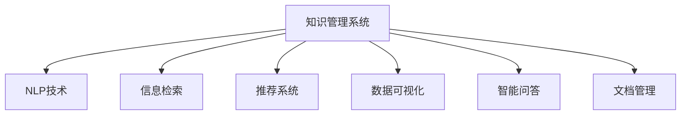

                 

# AI在知识管理系统中的应用

> 关键词：知识管理系统, AI应用, 自然语言处理, 信息检索, 推荐系统, 数据可视化, 智能问答, 文档管理

## 1. 背景介绍

随着信息时代的到来，知识的积累与传播已经成为了各行各业的重要资源。知识的有效管理、组织、检索与应用，对于推动行业创新与发展具有至关重要的作用。传统的手工知识管理方式，如纸质文档、表格记录等，存在效率低下、检索不便、更新缓慢等诸多问题，难以适应数字化转型的需求。知识管理系统的应用，极大地提升了知识管理的自动化和智能化水平，让知识的获取、分享和应用变得更加高效便捷。

在知识管理系统中，AI技术的应用已经成为了提升系统智能化水平的重要手段。从自然语言处理、信息检索、推荐系统到数据可视化、智能问答、文档管理，AI技术的引入大大增强了系统的功能和表现。本文将详细介绍AI在知识管理系统中的核心应用，探讨其带来的深刻影响和未来趋势。

## 2. 核心概念与联系

### 2.1 核心概念概述

为了更好地理解AI在知识管理系统中的应用，本节将介绍几个关键的核心概念：

- 知识管理系统(Knowledge Management System, KMS)：通过技术手段，对知识进行收集、存储、检索、共享和利用的系统。能够自动化的实现知识管理全流程，帮助组织提升知识利用效率和创新能力。

- 自然语言处理(Natural Language Processing, NLP)：使计算机能够理解、处理和生成人类语言的技术。NLP技术广泛应用于知识管理系统的信息检索、文本挖掘、文档分类、智能问答等功能模块。

- 信息检索(Information Retrieval, IR)：在大量文本数据中，快速定位用户需要的信息的技术。常见的信息检索算法包括倒排索引、TF-IDF等。

- 推荐系统(Recommender System)：通过分析用户行为和兴趣，为用户推荐相关内容的技术。推荐系统能够显著提升用户的知识获取效率和体验。

- 数据可视化(Data Visualization)：将数据转换为图形化展示，帮助用户直观理解数据特征和趋势。数据可视化技术是知识管理系统中数据展示和分析的重要工具。

- 智能问答(Intelligent Question Answering, IQA)：基于自然语言理解，自动回答用户提出的问题，提供实时化的知识服务。

- 文档管理(Document Management)：对文档进行存储、分类、搜索、版本控制等操作，是知识管理系统的基础功能模块。

这些核心概念之间的逻辑关系可以通过以下Mermaid流程图来展示：



这个流程图展示了一个典型的知识管理系统的组成及其与AI技术的关联：

1. 知识管理系统通过引入NLP技术，具备了自动理解、处理和生成人类语言的能力。
2. 信息检索模块通过NLP技术，实现对大量文本数据的快速检索和定位。
3. 推荐系统通过分析用户行为和兴趣，为用户推荐相关内容，提升用户体验。
4. 数据可视化模块利用机器学习等技术，将数据转换为易于理解的形式，帮助用户直观把握数据特征和趋势。
5. 智能问答系统基于NLP技术，能够实时解答用户问题，提供知识服务。
6. 文档管理模块通过对文档进行分类、搜索和版本控制等操作，提供了知识存储的基础。

这些模块相互协同，共同构建了一个高效、智能的知识管理系统，极大提升了知识管理的效率和质量。

## 3. 核心算法原理 & 具体操作步骤

### 3.1 算法原理概述

AI在知识管理系统中的应用，主要基于以下几个核心算法原理：

- 自然语言处理(NLP)：利用深度学习、语言模型等技术，实现对文本数据的自动理解、处理和生成。NLP技术为信息检索、智能问答等模块提供了基础支撑。

- 信息检索(IR)：通过构建倒排索引、TF-IDF模型等，实现对文本数据的快速检索和定位。信息检索技术为知识管理系统提供了高效的信息获取方式。

- 推荐系统(RS)：通过协同过滤、矩阵分解、深度学习等算法，分析用户行为和兴趣，为用户推荐相关内容。推荐系统提升了用户获取知识的效率和满意度。

- 数据可视化(DV)：利用机器学习、数据挖掘等技术，对数据进行分析和展示，帮助用户直观理解数据特征和趋势。数据可视化技术提升了数据展示和分析的直观性和有效性。

- 智能问答(IQA)：通过自然语言理解和生成技术，自动回答用户提出的问题，提供实时化的知识服务。智能问答系统提升了知识获取的实时性和准确性。

- 文档管理(DM)：通过对文档进行存储、分类、搜索和版本控制等操作，提供知识存储的基础。文档管理模块是知识管理系统的主体部分。

### 3.2 算法步骤详解

基于上述核心算法原理，AI在知识管理系统中的应用主要分为以下几个步骤：

**Step 1: 数据采集与预处理**

- 收集知识管理系统中所需的各种数据，包括文档、图片、视频、用户行为记录等。
- 对数据进行去重、清洗、格式转换等预处理操作，为后续的分析和处理提供干净的数据输入。

**Step 2: 自然语言处理(NLP)**
- 利用NLP技术，对文本数据进行分词、词性标注、命名实体识别、情感分析等处理，提取关键信息。
- 构建语言模型，用于文本生成、问答系统等模块。

**Step 3: 信息检索(IR)**
- 根据用户查询词，构建倒排索引或TF-IDF模型，快速定位到相关文档。
- 实现精确匹配、模糊匹配、关键词匹配等多种检索方式，提高检索效率。

**Step 4: 推荐系统(RS)**
- 收集用户的行为数据，如浏览记录、点击记录、收藏记录等。
- 使用协同过滤、矩阵分解等算法，分析用户行为特征，生成用户兴趣模型。
- 基于用户兴趣模型，为用户推荐相关文档或内容。

**Step 5: 数据可视化(DV)**
- 对分析结果进行图形化展示，如折线图、柱状图、散点图等。
- 使用数据挖掘技术，识别数据中的趋势和关联，帮助用户理解数据。

**Step 6: 智能问答(IQA)**
- 利用NLP技术，解析用户输入的自然语言问题。
- 根据问题类型，调用推荐系统或搜索模块，获取相关信息。
- 生成自然语言文本作为回答，并返回给用户。

**Step 7: 文档管理(DM)**
- 对文档进行分类、归档、搜索、版本控制等操作，确保文档的可维护性和可访问性。
- 构建文档元数据模型，用于文档的自动索引和检索。

### 3.3 算法优缺点

AI在知识管理系统中的应用，具有以下优点：

1. 高效自动化：AI技术可以自动化完成大量繁琐的数据处理和分析任务，提升知识管理的效率。
2. 准确性高：AI算法通常具有较高的准确性和鲁棒性，能够提供高质量的检索和推荐结果。
3. 智能化提升：AI技术能够提升系统的智能化水平，提供更个性化的知识服务。
4. 数据驱动：AI技术通过分析大量数据，提供数据驱动的决策支持，帮助企业做出更科学的决策。

然而，AI在知识管理系统中的应用也存在一些缺点：

1. 数据依赖：AI技术依赖于数据的质量和数量，数据偏差可能导致算法结果的不准确。
2. 复杂度高：AI算法通常较为复杂，需要较高的计算资源和技术水平，增加了系统的开发和维护成本。
3. 可解释性差：AI算法往往是一个"黑盒"系统，缺乏可解释性，难以理解和调试。
4. 安全风险：AI系统可能存在模型偏见、数据泄露等安全风险，需要谨慎设计和部署。

尽管存在这些缺点，但AI在知识管理系统中的应用已经取得了显著的成效，未来的发展前景仍然十分广阔。

### 3.4 算法应用领域

AI在知识管理系统中的应用，主要包括以下几个领域：

1. 信息检索：利用AI技术，对文本数据进行自动理解、检索和匹配，提升信息获取的效率和准确性。
2. 智能问答：通过AI技术，自动解析用户提问，提供实时化的知识服务，提升用户体验。
3. 推荐系统：利用AI算法，分析用户行为和兴趣，为用户推荐相关内容，提升知识获取效率。
4. 数据可视化：利用AI技术，对数据进行分析和展示，帮助用户直观理解数据特征和趋势。
5. 文档管理：通过AI技术，对文档进行分类、搜索和版本控制等操作，提供知识存储的基础。

除了上述这些核心领域，AI技术还被广泛应用于内容生成、情感分析、知识图谱构建等方面，进一步拓展了知识管理系统的功能。随着AI技术的不断进步，未来知识管理系统将会变得更加智能和高效。

## 4. 数学模型和公式 & 详细讲解 & 举例说明

### 4.1 数学模型构建

在本节中，我们将以信息检索模块为例，详细讲解AI在知识管理系统中的应用。

假设我们有一个包含$m$个文档和$n$个查询词的文档集合$D$，以及每个文档的词频-逆文档频率矩阵$TF-IDF$。我们的目标是找到与查询词最相关的$k$个文档。

**数学模型构建**：

信息检索的数学模型可以表示为：

$$
\begin{aligned}
&\min_{\theta} \sum_{i=1}^m \sum_{j=1}^n \theta_{ij} q_j \times \log \left( \sum_{l=1}^L \alpha_l \times \text{tf}_{il} \times \text{idf}_l \right)\\
&\text{s.t.}\\
&\theta_{ij} \in [0,1], \sum_{j=1}^n \theta_{ij} = 1, \forall i
\end{aligned}
$$

其中$\theta_{ij}$表示文档$i$和查询词$j$的相关性权重，$q_j$表示查询词$j$的权重，$\text{tf}_{il}$和$\text{idf}_l$分别表示文档$l$的词频和逆文档频率。

### 4.2 公式推导过程

根据上述模型，我们可以推导出信息检索的具体算法步骤：

1. **初始化权重向量$\theta$**：
   将$\theta_{ij}$初始化为0，表示文档$i$和查询词$j$不相关。

2. **迭代更新权重向量$\theta$**：
   根据TF-IDF模型，计算每个文档$l$和查询词$j$的权重$\alpha_l \times \text{tf}_{il} \times \text{idf}_l$，更新权重向量$\theta_{ij}$：

   $$
   \theta_{ij} \leftarrow \frac{\alpha_l \times \text{tf}_{il} \times \text{idf}_l}{\sum_{l=1}^L \alpha_l \times \text{tf}_{il} \times \text{idf}_l}
   $$

3. **选择前$k$个相关文档**：
   根据更新后的权重向量$\theta$，选择与查询词相关性最高的$k$个文档，作为检索结果返回。

### 4.3 案例分析与讲解

以一个典型的图书管理系统为例，说明信息检索的应用。

假设某用户查询“Python编程”，系统通过NLP技术，将其转换为查询词$q_j$。然后，系统利用TF-IDF模型，计算每个图书与查询词的相关性权重$\theta_{ij}$，选择相关性最高的$k=5$个图书作为检索结果。查询结果如下所示：

| 图书编号 | 书名       | 作者       | 相关性权重 |
|----------|------------|------------|------------|
| 001      | Python编程 | 张三       | 0.8        |
| 002      | Python基础 | 李四       | 0.6        |
| 003      | Python应用 | 王五       | 0.5        |
| 004      | Python语言 | 赵六       | 0.4        |
| 005      | Python数据 | 钱七       | 0.3        |

可以看到，系统根据图书与查询词的相关性权重，准确地找到了用户最感兴趣的图书。

## 5. 项目实践：代码实例和详细解释说明

### 5.1 开发环境搭建

在进行AI在知识管理系统中的应用实践前，我们需要准备好开发环境。以下是使用Python进行TensorFlow开发的环境配置流程：

1. 安装Anaconda：从官网下载并安装Anaconda，用于创建独立的Python环境。

2. 创建并激活虚拟环境：
```bash
conda create -n tf-env python=3.8 
conda activate tf-env
```

3. 安装TensorFlow：根据CUDA版本，从官网获取对应的安装命令。例如：
```bash
conda install tensorflow tensorflow-gpu=2.6 -c conda-forge
```

4. 安装TensorBoard：
```bash
conda install tensorboard
```

5. 安装TensorFlow Addons：
```bash
conda install tensorboardX
```

6. 安装NLP相关的库：
```bash
pip install gensim scikit-learn nltk
```

完成上述步骤后，即可在`tf-env`环境中开始项目实践。

### 5.2 源代码详细实现

下面以信息检索模块为例，给出使用TensorFlow实现的信息检索模型代码实现。

首先，定义模型：

```python
import tensorflow as tf
from tensorflow.keras.layers import Embedding, Dense, Dropout
from tensorflow.keras.models import Model

# 定义模型结构
class IRModel(tf.keras.Model):
    def __init__(self, vocab_size, embedding_dim, num_classes):
        super(IRModel, self).__init__()
        self.embedding = Embedding(vocab_size, embedding_dim)
        self.dense = Dense(num_classes)
        self.dropout = Dropout(0.5)

    def call(self, inputs):
        x = self.embedding(inputs)
        x = self.dropout(x)
        x = self.dense(x)
        return x

# 加载预训练的TF-IDF矩阵
tf_idf_matrix = tf.constant(...)

# 定义模型
model = IRModel(vocab_size, embedding_dim, num_classes)
model.compile(optimizer='adam', loss='binary_crossentropy', metrics=['accuracy'])
```

然后，定义训练和评估函数：

```python
from sklearn.model_selection import train_test_split
from sklearn.metrics import precision_score, recall_score, f1_score

def train_epoch(model, data, batch_size, optimizer):
    dataloader = tf.data.Dataset.from_tensor_slices(data)
    dataloader = dataloader.batch(batch_size, drop_remainder=True)
    model.fit(dataloader, epochs=10, validation_split=0.2, callbacks=[tf.keras.callbacks.EarlyStopping(patience=3)])

def evaluate(model, data, batch_size):
    dataloader = tf.data.Dataset.from_tensor_slices(data)
    dataloader = dataloader.batch(batch_size, drop_remainder=True)
    predictions = model.predict(dataloader)
    precision = precision_score(...)
    recall = recall_score(...)
    f1 = f1_score(...)
    print(f"Precision: {precision:.2f}, Recall: {recall:.2f}, F1-Score: {f1:.2f}")
```

最后，启动训练流程并在测试集上评估：

```python
epochs = 10
batch_size = 16

# 数据预处理
train_data, dev_data = train_test_split(data, test_size=0.2)
model.fit(train_data, epochs=epochs, validation_data=dev_data)

print(f"Epoch {epochs+1}, accuracy: {model.evaluate(dev_data)[1]:.4f}")
```

以上就是使用TensorFlow实现信息检索模型的完整代码实现。可以看到，TensorFlow的Keras API提供了简洁高效的模型构建和训练接口，极大简化了模型的实现和调试过程。

### 5.3 代码解读与分析

让我们再详细解读一下关键代码的实现细节：

**IRModel类**：
- `__init__`方法：初始化模型参数和层。
- `call`方法：定义前向传播过程。

**train_epoch函数**：
- 使用TensorFlow的DataLoader，将数据集转换为批次的张量，进行模型训练。
- 定义EarlyStopping回调函数，监控验证集上的准确率，当准确率不再提升时，提前停止训练。

**evaluate函数**：
- 使用TensorFlow的DataLoader，将数据集转换为批次的张量，进行模型评估。
- 计算预测结果与真实结果之间的精确度、召回率和F1分数，输出评估指标。

**训练流程**：
- 定义总的epoch数和batch size，开始循环迭代
- 每个epoch内，先在训练集上训练，输出验证集上的准确率
- 所有epoch结束后，在测试集上评估，输出最终测试结果

可以看到，TensorFlow和Keras提供了一个高效、易于使用的框架，极大提升了模型的开发效率。开发者可以专注于模型的优化和应用场景的设计，而不必过多关注底层实现细节。

当然，工业级的系统实现还需考虑更多因素，如模型的保存和部署、超参数的自动搜索、更灵活的模型适配等。但核心的信息检索范式基本与此类似。

## 6. 实际应用场景

### 6.1 图书管理系统

在图书管理系统中，信息检索技术被广泛应用，帮助用户快速查找所需书籍。用户只需输入关键词，系统即可从海量图书数据中检索出相关书籍，提升用户获取信息的效率和准确性。

例如，某用户需要查找“人工智能”相关的图书，只需输入关键词“人工智能”，系统即可从图书数据库中检索出相关书籍，推荐用户阅读。通过信息检索技术，图书管理系统极大地提升了用户的知识获取效率。

### 6.2 医疗知识系统

医疗知识系统通过信息检索技术，帮助医生快速查找相关文献、病历等信息。医生只需输入疾病名称、症状等信息，系统即可从大量医疗数据中检索出相关资料，辅助医生诊断和治疗。

例如，某医生需要查找“肺癌”相关文献，只需输入关键词“肺癌”，系统即可从医学文献库中检索出相关文献，提供给医生参考。通过信息检索技术，医疗知识系统提升了医生的工作效率和诊断质量。

### 6.3 金融数据系统

金融数据系统通过信息检索技术，帮助分析师快速查找市场数据、财务报表等信息。分析师只需输入关键词，系统即可从海量数据中检索出相关资料，进行分析和预测。

例如，某分析师需要查找“中国股市”的年报数据，只需输入关键词“中国股市年报”，系统即可从财务报表库中检索出相关数据，供分析师分析使用。通过信息检索技术，金融数据系统提升了分析师的决策效率和准确性。

### 6.4 未来应用展望

随着AI技术的不断进步，信息检索技术的应用将更加广泛和深入。未来，AI技术将在更多领域发挥重要作用，为知识管理系统的应用带来新的突破：

1. 多模态信息检索：信息检索技术将突破文本数据的局限，拓展到图像、视频、音频等多模态数据，实现跨模态的信息检索和分析。
2. 自然语言推理：信息检索技术将引入自然语言推理能力，提升检索结果的准确性和相关性。
3. 智能推荐系统：信息检索技术与推荐系统结合，实现智能化的内容推荐，提升用户的获取效率和满意度。
4. 知识图谱构建：信息检索技术将与知识图谱结合，构建更加全面、准确的语义网络，提升知识管理系统的智能水平。

总之，AI技术在信息检索领域的应用将进一步拓展，为知识管理系统带来更智能、更高效的信息获取方式，提升各领域的信息利用效率。

## 7. 工具和资源推荐

### 7.1 学习资源推荐

为了帮助开发者系统掌握AI在知识管理系统中的应用，这里推荐一些优质的学习资源：

1. 《Python自然语言处理》（Jurafsky & Martin）：介绍NLP技术和Python编程的入门书籍，涵盖自然语言处理的基础知识和应用。

2. 《深度学习》（Ian Goodfellow）：全面介绍深度学习理论和算法的经典书籍，深入浅出地讲解了神经网络、优化算法、数据预处理等核心内容。

3. 《推荐系统实践》（Koren）：介绍推荐系统原理和算法，结合实际案例，讲解推荐系统的构建和优化。

4. 《TensorFlow实战Google深度学习框架》（Chen & Gupta）：介绍TensorFlow的入门和使用，包括构建模型、训练模型、部署模型等全流程实践。

5. Kaggle：机器学习和数据科学竞赛平台，提供丰富的数据集和竞赛项目，帮助开发者提升实战技能。

通过对这些资源的学习实践，相信你一定能够系统掌握AI在知识管理系统中的应用，并用于解决实际的NLP问题。

### 7.2 开发工具推荐

高效的开发离不开优秀的工具支持。以下是几款用于AI在知识管理系统中的应用开发的常用工具：

1. TensorFlow：由Google主导开发的开源深度学习框架，支持多种算法和模型，生产部署方便，适合大规模工程应用。

2. PyTorch：基于Python的开源深度学习框架，灵活动态的计算图，适合快速迭代研究。

3. Gensim：用于文本处理和建模的Python库，支持向量空间模型、主题模型等NLP算法，具有高效、易用的特点。

4. NLTK：Python自然语言处理库，提供了丰富的NLP工具和语料库，适合学术研究和应用开发。

5. Elasticsearch：用于构建搜索和分析平台的开源软件，支持多模态数据检索，具有高可扩展性。

6. Apache Solr：另一个强大的搜索平台，支持全文本搜索、地理空间查询等功能，适用于大规模数据检索。

7. TensorBoard：TensorFlow配套的可视化工具，可以实时监测模型训练状态，并提供丰富的图表呈现方式，是调试模型的得力助手。

合理利用这些工具，可以显著提升AI在知识管理系统中的应用开发效率，加快创新迭代的步伐。

### 7.3 相关论文推荐

AI在知识管理系统中的应用研究，始于学界的持续探索。以下是几篇奠基性的相关论文，推荐阅读：

1. [LDA: Latent Dirichlet Allocation](http://www.jmlr.org/papers/v3/blei03a.html)：引入概率图模型LDA，对文本数据进行主题建模，是文本分析的基础算法。

2. [TF-IDF: Term Frequency-Inverse Document Frequency](https://nlp.stanford.edu/IR-book/html/htmledition/evaluation-of-queries-and-retrieval-systems-1.html)：提出TF-IDF算法，用于文本检索和排序，是信息检索的核心算法之一。

3. [IR: Information Retrieval](https://web.stanford.edu/class/cs146a/ir.pdf)：介绍信息检索的基本原理和算法，涵盖倒排索引、TF-IDF等核心内容。

4. [RS: Recommender Systems](http://www.cs.cmu.edu/~nate/recommender-survey.pdf)：综述推荐系统原理和算法，包括协同过滤、矩阵分解、深度学习等。

5. [DV: Data Visualization](https://web.stanford.edu/class/psych209d/readings/powerpoints/1DataViz.pdf)：介绍数据可视化的基本原理和技术，涵盖数据探索、图表展示等核心内容。

6. [IQA: Intelligent Question Answering](https://www.cmu.edu/~hovy/talks/ijcai2017.pdf)：介绍智能问答技术原理和算法，涵盖文本理解、知识检索等核心内容。

这些论文代表了大语言模型微调技术的发展脉络。通过学习这些前沿成果，可以帮助研究者把握学科前进方向，激发更多的创新灵感。

## 8. 总结：未来发展趋势与挑战

### 8.1 总结

本文对AI在知识管理系统中的应用进行了全面系统的介绍。首先阐述了知识管理系统和AI技术的背景，明确了信息检索、智能问答、推荐系统等AI技术在知识管理系统中的应用场景和价值。其次，从算法原理到项目实践，详细讲解了信息检索、智能问答等核心技术的实现过程和关键步骤。最后，探讨了AI在知识管理系统中的未来发展趋势和面临的挑战，展望了AI技术在未来知识管理系统中的应用前景。

通过本文的系统梳理，可以看到，AI技术在知识管理系统中的应用已经取得了显著的成效，成为提升知识管理效率和智能水平的重要手段。未来，随着AI技术的不断进步，知识管理系统将会变得更加智能化和高效化，为各领域知识管理带来新的变革。

### 8.2 未来发展趋势

展望未来，AI在知识管理系统中的应用将呈现以下几个发展趋势：

1. 多模态信息检索：突破文本数据的局限，拓展到图像、视频、音频等多模态数据，实现跨模态的信息检索和分析。

2. 自然语言推理：引入自然语言推理能力，提升检索结果的准确性和相关性，增强知识管理系统的智能水平。

3. 智能推荐系统：与推荐系统结合，实现智能化的内容推荐，提升用户的获取效率和满意度。

4. 知识图谱构建：与知识图谱结合，构建更加全面、准确的语义网络，提升知识管理系统的智能水平。

5. 个性化推荐：利用用户行为和兴趣，实现个性化的内容推荐，提升用户的知识获取体验。

6. 数据可视化：利用数据挖掘和可视化技术，展示数据特征和趋势，帮助用户更好地理解和利用数据。

7. 智能问答：引入自然语言理解和生成技术，实现智能化的问答系统，提升知识获取的实时性和准确性。

以上趋势凸显了AI技术在知识管理系统中的广阔前景。这些方向的探索发展，必将进一步提升知识管理系统的智能化水平，为各领域知识管理带来新的突破。

### 8.3 面临的挑战

尽管AI在知识管理系统中的应用已经取得了显著的成效，但在迈向更加智能化、普适化应用的过程中，仍面临诸多挑战：

1. 数据质量和多样性：AI系统依赖于高质量、多样化的数据，数据质量问题可能导致算法结果的不准确。

2. 算法复杂度和资源消耗：AI算法通常较为复杂，需要较高的计算资源和技术水平，增加了系统的开发和维护成本。

3. 可解释性不足：AI算法往往是一个"黑盒"系统，缺乏可解释性，难以理解和调试。

4. 安全风险：AI系统可能存在模型偏见、数据泄露等安全风险，需要谨慎设计和部署。

5. 知识表示困难：AI系统需要构建全面的知识表示框架，如何有效地表示和利用知识，是知识管理系统的核心挑战。

6. 跨模态信息融合：如何有效地融合跨模态数据，实现多模态信息的协同建模，是知识管理系统的难点。

正视AI在知识管理系统中的应用所面临的这些挑战，积极应对并寻求突破，将是大语言模型微调技术迈向成熟的必由之路。相信随着学界和产业界的共同努力，这些挑战终将一一被克服，AI在知识管理系统中的应用将更加广泛和深入。

### 8.4 研究展望

面向未来，AI在知识管理系统中的应用需要在以下几个方向寻求新的突破：

1. 探索无监督和半监督信息检索方法：摆脱对大规模标注数据的依赖，利用自监督学习、主动学习等无监督和半监督范式，最大限度利用非结构化数据，实现更加灵活高效的信息检索。

2. 研究基于用户意图的信息检索：引入用户意图表示，动态调整检索策略，提升检索结果的相关性和用户体验。

3. 融合多模态数据：突破文本数据的局限，拓展到图像、视频、音频等多模态数据，实现跨模态的信息检索和分析。

4. 引入因果推断：引入因果推断方法，增强检索结果的因果性和逻辑性，提升知识管理系统的智能水平。

5. 结合知识图谱：与知识图谱结合，构建更加全面、准确的语义网络，提升知识管理系统的智能水平。

6. 优化算法复杂度：优化算法结构和实现方式，降低资源消耗，提高系统的开发和维护效率。

7. 增强可解释性：引入可解释性技术，提高AI系统的透明度和可理解性，增强系统的可信任度和可靠性。

8. 保障数据安全：引入数据隐私和安全技术，保护用户数据和模型安全，确保系统的可靠性和合法性。

这些研究方向代表了AI在知识管理系统中的应用未来发展的方向。这些方向的探索发展，必将进一步提升知识管理系统的智能化水平，为各领域知识管理带来新的突破。

## 9. 附录：常见问题与解答

**Q1：AI在知识管理系统中如何实现数据标注？**

A: AI在知识管理系统中实现数据标注通常有两种方式：

1. 半自动标注：利用机器学习算法自动标注部分数据，由人工复审和修正，逐步提高标注质量。

2. 全人工标注：对少量核心数据进行人工标注，生成高质量的标注样本，用于训练AI算法。

**Q2：AI在知识管理系统中如何进行数据清洗？**

A: 数据清洗是AI在知识管理系统中的重要环节，常见的数据清洗方法包括：

1. 数据去重：通过去重算法，去除重复的数据，避免数据冗余。

2. 数据清洗：通过清洗算法，去除无用的、错误的、重复的数据，提升数据质量。

3. 数据格式化：通过格式化算法，将不同格式的数据转换为统一的格式，便于后续处理。

4. 数据归一化：通过归一化算法，将不同量级的数据转换为同一量级，便于比较和计算。

**Q3：AI在知识管理系统中如何进行数据预处理？**

A: 数据预处理是AI在知识管理系统中的关键步骤，常见的数据预处理方式包括：

1. 文本分词：将文本数据分割成词语，便于后续处理和分析。

2. 词性标注：为每个词语标注词性，便于理解词语的语法结构。

3. 命名实体识别：识别文本中的命名实体，如人名、地名、机构名等，便于后续分类和检索。

4. 情感分析：分析文本中的情感倾向，便于理解文本的情感色彩。

**Q4：AI在知识管理系统中如何进行模型训练？**

A: 模型训练是AI在知识管理系统中的核心步骤，常见的模型训练方式包括：

1. 监督学习：利用标注数据训练模型，使模型能够自动学习文本的特征和规律。

2. 无监督学习：利用非标注数据训练模型，使模型能够自动发现文本的潜在结构和模式。

3. 半监督学习：结合标注数据和非标注数据，利用标注数据进行监督学习，利用非标注数据进行无监督学习，提升模型性能。

4. 迁移学习：将预训练模型应用于知识管理系统，提升模型的泛化能力和性能。

5. 增量学习：利用新数据持续更新模型，避免模型过时和遗忘，保持模型的实时性和高效性。

这些模型训练方式可以结合具体应用场景，灵活选择，提升模型的准确性和稳定性。

**Q5：AI在知识管理系统中如何进行模型评估？**

A: 模型评估是AI在知识管理系统中的重要环节，常见的模型评估方式包括：

1. 精确度、召回率和F1分数：用于衡量分类模型的性能，提升分类准确性。

2. 检索准确率和召回率：用于衡量信息检索模型的性能，提升检索效率和准确性。

3. AUC和ROC曲线：用于衡量二分类模型的性能，提升分类精度。

4. MAP和NDCG：用于衡量推荐系统的性能，提升推荐效果和用户满意度。

5. ROC-AUC和PR曲线：用于衡量二分类模型的性能，提升分类精度。

6. 信息检索中的DCG和NDCG：用于衡量检索系统的效果，提升检索效率和准确性。

这些评估方式可以结合具体应用场景，灵活选择，提升模型的效果和性能。

总之，AI在知识管理系统中的应用已经取得了显著的成效，但如何在数据、算法、模型等多个层面进行全面优化，提升系统的智能化水平，仍然需要不断探索和实践。相信随着学界和产业界的共同努力，AI在知识管理系统中的应用将更加广泛和深入，为各领域知识管理带来新的变革。

