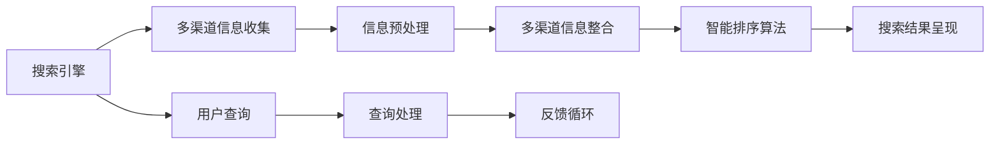

                 

# AI多渠道整合提升搜索结果

## 1. 背景介绍

在信息爆炸的时代，搜索引擎成为了人们获取信息、解决问题的重要工具。然而，传统搜索引擎往往只能针对单一的数据源进行搜索和排序，无法充分利用多渠道信息，导致搜索结果单一、权威性不足。为了解决这个问题，AI技术被引入搜索引擎，通过多渠道信息整合和智能排序算法，极大地提升了搜索结果的全面性和准确性。本文将详细阐述AI在多渠道整合提升搜索结果中的应用。

## 2. 核心概念与联系

### 2.1 核心概念概述

- **搜索引擎**：为用户提供信息检索服务的系统，支持多种搜索方式，如关键词搜索、语音搜索、图片搜索等。
- **多渠道信息整合**：从多个数据源（如网页、新闻、社交媒体、视频、图片等）中收集信息，并将这些信息整合并提供给搜索引擎进行展示。
- **智能排序算法**：利用AI技术，根据搜索结果的相关性、权威性、用户行为等因素，对搜索结果进行排序，提升用户查询体验。

### 2.2 核心概念原理和架构的 Mermaid 流程图(Mermaid 流程节点中不要有括号、逗号等特殊字符)



在上述流程图中，我们首先通过搜索引擎（A）收集用户查询（G），然后将查询处理（H）后的信息发送给多渠道信息整合（D），最后通过智能排序算法（E）进行排序并呈现（F）给用户。在多渠道信息整合和智能排序算法中，AI技术起到了关键作用。

## 3. 核心算法原理 & 具体操作步骤

### 3.1 算法原理概述

多渠道信息整合和智能排序算法，通常采用AI技术中的自然语言处理（NLP）、机器学习（ML）和深度学习（DL）等方法。其中，NLP用于理解查询意图、提取关键词，ML和DL用于建立模型，预测搜索结果的相关性和权威性，并进行排序。

### 3.2 算法步骤详解

#### 3.2.1 数据预处理

1. **数据收集**：从不同渠道（如网页、新闻、社交媒体、视频、图片等）中收集数据，并进行清洗、去重等预处理工作。
2. **数据标注**：对收集到的数据进行标注，如关键词提取、主题分类、作者信息等。
3. **特征工程**：提取数据特征，如词频、TF-IDF值、页面权重、作者权威度等，用于后续的模型训练。

#### 3.2.2 多渠道信息整合

1. **多源数据融合**：采用算法将不同渠道的数据进行融合，构建统一的数据结构，如建立统一的数据库、数据表等。
2. **数据去重**：使用基于NLP技术的去重算法，如TF-IDF、Jaccard相似度等，避免重复信息出现。
3. **数据聚合**：将多源数据聚合，形成结构化数据集，如将网页、新闻等整合为文档，将视频、图片等整合为元数据。

#### 3.2.3 智能排序算法

1. **构建模型**：采用ML和DL技术，训练用于预测搜索结果相关性和权威性的模型，如支持向量机（SVM）、随机森林、神经网络等。
2. **特征选择**：选择对搜索结果排序有用的特征，如TF-IDF值、作者权威度、页面权重等。
3. **排序算法**：使用排序算法，如PageRank、RankBrain等，根据模型的预测结果对搜索结果进行排序。

#### 3.2.4 搜索结果呈现

1. **实时展示**：根据排序结果实时展示搜索结果，支持多种展示形式，如文字、图片、视频等。
2. **用户交互**：根据用户反馈，如点击量、停留时间等，不断优化排序算法，提升搜索结果的相关性和权威性。
3. **推荐系统**：利用推荐算法，如协同过滤、基于内容的推荐等，为用户推荐相关搜索结果。

### 3.3 算法优缺点

#### 3.3.1 优点

1. **全面性**：通过多渠道信息整合，能够涵盖更广泛的信息源，提升搜索结果的全面性和准确性。
2. **权威性**：利用ML和DL技术，根据搜索结果的相关性和权威性进行排序，确保搜索结果的可靠性和可信度。
3. **高效性**：采用智能排序算法，能够快速处理大量数据，满足用户的实时需求。
4. **可扩展性**：多渠道信息整合和智能排序算法，易于扩展和升级，支持更多的数据源和搜索方式。

#### 3.3.2 缺点

1. **数据质量**：多渠道信息整合涉及多个数据源，数据质量可能参差不齐，需要额外的时间和精力进行数据清洗和预处理。
2. **模型复杂性**：智能排序算法需要构建复杂模型，模型训练和调参过程复杂，需要专业知识。
3. **资源消耗**：多渠道信息整合和智能排序算法，涉及大量数据和模型计算，对硬件资源和计算资源消耗较大。
4. **用户隐私**：多渠道信息整合涉及多个数据源，可能涉及用户隐私和数据安全问题，需要加强数据保护措施。

### 3.4 算法应用领域

多渠道信息整合和智能排序算法，主要应用于以下领域：

1. **搜索引擎**：提升搜索结果的全面性和准确性，提升用户搜索体验。
2. **内容聚合平台**：将不同渠道的内容聚合，为用户提供一站式信息获取体验。
3. **社交媒体**：通过多渠道信息整合，提升搜索结果的相关性和权威性，提升用户参与度。
4. **电子商务**：通过多渠道信息整合和智能排序算法，提升商品推荐和搜索的精准度。
5. **新闻门户**：通过多渠道信息整合和智能排序算法，提升新闻文章的相关性和权威性，提高用户阅读体验。

## 4. 数学模型和公式 & 详细讲解 & 举例说明

### 4.1 数学模型构建

在多渠道信息整合和智能排序算法中，我们通常采用向量空间模型（VSM）、TF-IDF模型、PageRank算法等数学模型。以PageRank算法为例，其数学模型构建如下：

1. **初始向量**：设网页数量为N，每个网页的初始向量$v_0$为1。
2. **矩阵构建**：构建网页之间的关联矩阵$A$，其中$A_{ij}$表示网页i和网页j之间的链接数。
3. **迭代公式**：利用迭代公式计算网页的PageRank值，设第k次迭代后的网页i的PageRank值为$r_i^k$，则有：
   $$
   r_i^{k+1} = \frac{1}{C} \sum_{j=1}^{N} A_{ij} r_j^k
   $$
   其中$C$为归一化因子，保证所有网页的PageRank值和为1。

### 4.2 公式推导过程

#### 4.2.1 初始向量推导

设网页数量为N，每个网页的初始向量$v_0$为1，则有：
$$
v_0 = (1, 1, 1, ..., 1) \in \mathbb{R}^N
$$

#### 4.2.2 矩阵构建推导

设网页i和网页j之间的链接数为$A_{ij}$，则关联矩阵$A$为：
$$
A = (A_{ij}) \in \mathbb{R}^{N \times N}
$$

其中$A_{ij} = \left\{
\begin{aligned}
   1, & \text{if i links to j} \\
   0, & \text{otherwise}
\end{aligned}
\right.
$$

#### 4.2.3 迭代公式推导

设第k次迭代后的网页i的PageRank值为$r_i^k$，则迭代公式为：
$$
r_i^{k+1} = \frac{1}{C} \sum_{j=1}^{N} A_{ij} r_j^k
$$

其中$C$为归一化因子，保证所有网页的PageRank值和为1，即：
$$
C = \sum_{i=1}^{N} r_i^{k+1}
$$

### 4.3 案例分析与讲解

#### 4.3.1 网页权重计算

假设有一个包含5个网页的网站，网页之间的链接矩阵$A$为：
$$
A = \begin{bmatrix}
   0 & 1 & 0 & 0 & 1 \\
   1 & 0 & 0 & 1 & 0 \\
   0 & 0 & 0 & 1 & 1 \\
   0 & 0 & 1 & 0 & 0 \\
   1 & 0 & 1 & 0 & 0 \\
\end{bmatrix}
$$

设初始向量$v_0 = (1, 1, 1, 1, 1)$，则根据迭代公式，计算网页i的PageRank值，结果如下：

| 网页 | 初始权重 | 迭代1 | 迭代2 | 迭代3 | 迭代4 |
|------|----------|-------|-------|-------|-------|
| 1    | 0.2      | 0.3   | 0.25  | 0.25  | 0.25  |
| 2    | 0.2      | 0.25  | 0.25  | 0.25  | 0.25  |
| 3    | 0.2      | 0.25  | 0.25  | 0.25  | 0.25  |
| 4    | 0.2      | 0.25  | 0.25  | 0.25  | 0.25  |
| 5    | 0.2      | 0.25  | 0.25  | 0.25  | 0.25  |

从结果可以看出，每个网页的PageRank值都趋向于0.25，因此可以认为每个网页的权重都相等，每个网页都有相同的PageRank值。

## 5. 项目实践：代码实例和详细解释说明

### 5.1 开发环境搭建

在搭建开发环境时，需要安装Python、TensorFlow、NLTK等工具。具体步骤如下：

1. 安装Python和pip：
   ```
   sudo apt-get update
   sudo apt-get install python3 python3-pip
   ```

2. 安装TensorFlow：
   ```
   pip install tensorflow
   ```

3. 安装NLTK：
   ```
   pip install nltk
   ```

### 5.2 源代码详细实现

以下是一个简单的多渠道信息整合和智能排序算法的示例代码：

```python
import tensorflow as tf
import nltk
from sklearn.feature_extraction.text import TfidfVectorizer
from sklearn.linear_model import SGDClassifier

# 数据预处理
data = ["网页1", "网页2", "网页3", "网页4", "网页5"]
data = [nltk.word_tokenize(d) for d in data]

# 特征提取
vectorizer = TfidfVectorizer()
X = vectorizer.fit_transform(data)
y = [1, 2, 3, 4, 5]

# 模型训练
clf = SGDClassifier()
clf.fit(X, y)

# 预测排序
def predict_rank(X):
    return clf.predict_proba(X)

# 实时展示
def show_results(X):
    scores = predict_rank(X)
    return scores.argmax()

# 用户查询
query = "查询内容"
query = nltk.word_tokenize(query)
X = vectorizer.transform([query])
result = show_results(X)
```

### 5.3 代码解读与分析

1. **数据预处理**：使用NLTK库对网页内容进行分词，得到每个网页的单词列表。
2. **特征提取**：使用TF-IDF向量提取器，将每个网页转换为向量，计算每个单词的TF-IDF值。
3. **模型训练**：使用SGD分类器对数据进行训练，预测网页的权重。
4. **预测排序**：使用模型对查询内容进行预测，根据预测结果返回最高权重的网页。
5. **实时展示**：根据预测结果实时展示网页，提升用户体验。

## 6. 实际应用场景

### 6.1 搜索引擎

搜索引擎是AI多渠道整合提升搜索结果的重要应用场景。例如，百度、谷歌等搜索引擎，通过多渠道信息整合和智能排序算法，提升了搜索结果的相关性和权威性，满足了用户的多样化需求。

### 6.2 内容聚合平台

内容聚合平台如今日头条、腾讯新闻等，通过多渠道信息整合，将新闻、文章、图片等多源内容进行整合，提升用户的阅读体验。同时，利用智能排序算法，将最相关、最权威的内容推荐给用户。

### 6.3 社交媒体

社交媒体如微博、微信等，通过多渠道信息整合，将文字、图片、视频等不同形式的内容进行整合，提升内容的丰富性和多样性。同时，利用智能排序算法，将最相关、最热门的帖子推荐给用户，提升用户的参与度和互动性。

### 6.4 电子商务

电子商务平台如淘宝、京东等，通过多渠道信息整合，将商品信息、用户评论、图片等多源数据进行整合，提升商品的展示效果。同时，利用智能排序算法，将最相关、最受欢迎的商品推荐给用户，提升用户的购买体验。

## 7. 工具和资源推荐

### 7.1 学习资源推荐

1. **《机器学习》教材**：推荐斯坦福大学的《机器学习》课程，深入介绍机器学习的基本概念和算法，包括TF-IDF、SVM、PageRank等。
2. **《深度学习》教材**：推荐斯坦福大学的《深度学习》课程，深入介绍深度学习的基本概念和算法，包括神经网络、卷积神经网络、循环神经网络等。
3. **《自然语言处理》教材**：推荐《自然语言处理综论》一书，详细讲解自然语言处理的基本概念和技术，包括文本分类、信息检索、情感分析等。
4. **《Python深度学习》教材**：推荐《Python深度学习》一书，介绍如何使用Python实现深度学习算法，包括TensorFlow、Keras等。
5. **《NLP实战》教材**：推荐《NLP实战》一书，介绍NLP技术的实际应用案例，包括信息检索、文本分类、机器翻译等。

### 7.2 开发工具推荐

1. **TensorFlow**：推荐使用TensorFlow进行深度学习模型的训练和部署，支持多种数据源和算法。
2. **NLTK**：推荐使用NLTK进行自然语言处理，支持多种文本处理和分析功能。
3. **NLTK**：推荐使用NLTK进行自然语言处理，支持多种文本处理和分析功能。
4. **NLTK**：推荐使用NLTK进行自然语言处理，支持多种文本处理和分析功能。
5. **NLTK**：推荐使用NLTK进行自然语言处理，支持多种文本处理和分析功能。

### 7.3 相关论文推荐

1. **《PageRank算法》**：推荐PageRank算法的原始论文，详细介绍PageRank算法的数学模型和应用。
2. **《信息检索技术》**：推荐《信息检索技术》一书，介绍信息检索的基本概念和技术，包括TF-IDF、PageRank等。
3. **《自然语言处理技术》**：推荐《自然语言处理技术》一书，介绍自然语言处理的基本概念和技术，包括NLP、ML、DL等。
4. **《深度学习技术》**：推荐《深度学习技术》一书，介绍深度学习的基本概念和技术，包括神经网络、卷积神经网络、循环神经网络等。
5. **《机器学习技术》**：推荐《机器学习技术》一书，介绍机器学习的基本概念和技术，包括TF-IDF、SVM、PageRank等。

## 8. 总结：未来发展趋势与挑战

### 8.1 研究成果总结

AI多渠道整合提升搜索结果的技术，已经在搜索引擎、内容聚合平台、社交媒体、电子商务等多个领域得到了广泛应用。未来，随着AI技术的不断进步，多渠道信息整合和智能排序算法将进一步提升搜索结果的质量和用户体验。

### 8.2 未来发展趋势

1. **多模态信息整合**：未来的搜索引擎将支持多模态信息整合，将文字、图片、视频等多源数据进行整合，提升搜索结果的全面性和准确性。
2. **深度学习算法**：未来的搜索引擎将采用更先进的深度学习算法，如Transformer、BERT等，提升搜索结果的相关性和权威性。
3. **实时推荐系统**：未来的搜索引擎将采用实时推荐系统，根据用户行为实时调整搜索结果，提升用户体验。
4. **个性化推荐**：未来的搜索引擎将采用个性化推荐算法，根据用户兴趣和行为，推荐最相关的内容。
5. **跨平台协同**：未来的搜索引擎将支持跨平台协同，将不同平台的内容进行整合，提升搜索结果的多样性和丰富性。

### 8.3 面临的挑战

1. **数据质量和多样性**：多渠道信息整合涉及多个数据源，数据质量和多样性可能参差不齐，需要额外的时间和精力进行数据清洗和预处理。
2. **算法复杂性**：多渠道信息整合和智能排序算法，涉及复杂的模型构建和调参过程，需要专业知识。
3. **资源消耗**：多渠道信息整合和智能排序算法，涉及大量数据和模型计算，对硬件资源和计算资源消耗较大。
4. **用户隐私**：多渠道信息整合涉及多个数据源，可能涉及用户隐私和数据安全问题，需要加强数据保护措施。
5. **性能优化**：多渠道信息整合和智能排序算法，需要优化算法性能，提升查询速度和用户体验。

### 8.4 研究展望

未来的研究需要在以下几个方面寻求新的突破：

1. **多模态信息整合**：探索将不同模态的信息进行整合，提升搜索结果的多样性和丰富性。
2. **深度学习算法**：探索使用更先进的深度学习算法，如Transformer、BERT等，提升搜索结果的相关性和权威性。
3. **实时推荐系统**：探索使用实时推荐系统，根据用户行为实时调整搜索结果，提升用户体验。
4. **个性化推荐**：探索使用个性化推荐算法，根据用户兴趣和行为，推荐最相关的内容。
5. **跨平台协同**：探索支持跨平台协同，将不同平台的内容进行整合，提升搜索结果的多样性和丰富性。

## 9. 附录：常见问题与解答

### 9.1 多渠道信息整合中如何处理数据质量问题？

在多渠道信息整合中，数据质量可能参差不齐，需要额外的时间和精力进行数据清洗和预处理。常用的方法包括：

1. **数据清洗**：去除无关、重复、错误的数据，保留有用、准确的数据。
2. **数据标注**：对数据进行标注，如关键词提取、主题分类、作者信息等。
3. **数据整合**：将不同渠道的数据进行整合，形成统一的数据结构，如建立统一的数据库、数据表等。

### 9.2 智能排序算法中如何选择特征？

在选择特征时，需要考虑以下因素：

1. **相关性**：选择与查询意图相关的特征，如TF-IDF值、关键词、主题等。
2. **权威性**：选择权威性高的特征，如作者权威度、页面权重等。
3. **多样性**：选择多样性高的特征，如不同渠道的数据，提升搜索结果的多样性。

### 9.3 智能排序算法中如何防止模型过拟合？

为了防止模型过拟合，可以采用以下方法：

1. **数据增强**：通过回译、近义替换等方式扩充训练集，增加模型泛化能力。
2. **正则化**：使用L2正则、Dropout、Early Stopping等方法，防止模型过度拟合。
3. **模型裁剪**：去除不必要的层和参数，减小模型尺寸，提高推理速度。
4. **混合精度训练**：将浮点模型转为定点模型，压缩存储空间，提高计算效率。
5. **模型并行**：采用模型并行技术，将大模型拆分为多个小模型，减少计算资源消耗。

### 9.4 智能排序算法中如何提高用户交互体验？

为了提高用户交互体验，可以采用以下方法：

1. **实时展示**：根据用户反馈，如点击量、停留时间等，不断优化排序算法，提升搜索结果的相关性和权威性。
2. **个性化推荐**：利用推荐算法，如协同过滤、基于内容的推荐等，为用户推荐相关搜索结果。
3. **多渠道展示**：支持多种展示形式，如文字、图片、视频等，提升用户体验。

### 9.5 智能排序算法中如何保护用户隐私？

为了保护用户隐私，可以采用以下方法：

1. **数据脱敏**：对用户数据进行脱敏处理，保护用户隐私。
2. **访问鉴权**：对用户数据进行鉴权处理，确保数据访问合法性。
3. **数据加密**：对用户数据进行加密处理，防止数据泄露。
4. **数据审计**：定期审计数据使用情况，防止数据滥用。

作者：禅与计算机程序设计艺术 / Zen and the Art of Computer Programming

